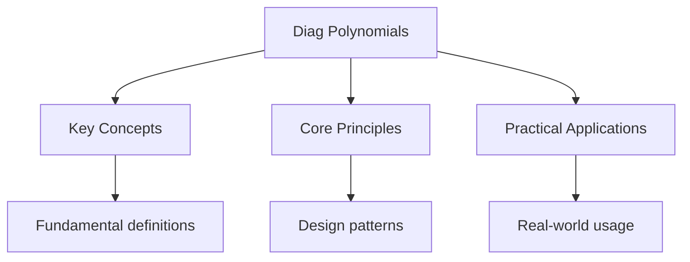

<!-- Breadcrumb Schema for SEO -->

## Polynomials — Diagnostic Tests

## Unit Tests

> Tests edge cases, boundary conditions, and common misconceptions for polynomials.

### UT-1: Factor Theorem Sign Confusion

**Question:**

Determine whether $x + 2$ is a factor of $P(x) = x^3 + 3x^2 - 4x - 8$.

**Solution:**

By the factor theorem, $x + 2$ is a factor if and only if $P(-2) = 0$.

$$P(-2) = (-2)^3 + 3(-2)^2 - 4(-2) - 8 = -8 + 12 + 8 - 8 = 4$$

Since $P(-2) = 4 \neq 0$, $x + 2$ is **not** a factor.

A common mistake is testing $P(2)$ instead of $P(-2)$. The factor theorem states that $(x - a)$ is a
factor if $P(a) = 0$. Here the factor is $x + 2 = x - (-2)$ So we test $a = -2$.

---

<!-- Breadcrumb Schema for SEO -->

### UT-2: Remainder Theorem Application

**Question:**

When $P(x) = 2x^3 + ax^2 - 5x + 3$ is divided by $x - 2$The remainder is $11$. When $P(x)$ is
divided by $x + 1$The remainder is $-4$. Find $a$ and $b$ (if $P(x)$ also has a constant term
correction $b$ replacing $3$), or find $a$.

**Solution:**

By the remainder theorem:

$P(2) = 2(8) + 4a - 10 + 3 = 16 + 4a - 7 = 4a + 9 = 11 \implies 4a = 2 \implies a = \dfrac{1}{2}$.

Verify: $P(-1) = 2(-1) + \dfrac{1}{2}(1) - 5(-1) + 3 = -2 + \dfrac{1}{2} + 5 + 3 = 6.5 = -4$?

Wait:
$P(-1) = 2(-1)^3 + \dfrac{1}{2}(-1)^2 - 5(-1) + 3 = -2 + \dfrac{1}{2} + 5 + 3 = \dfrac{13}{2}$.

But we need $P(-1) = -4$. There is no single value of $a$ satisfying both conditions simultaneously
with the constant term fixed at $3$. The problem as stated is inconsistent. This highlights the
importance of verifying all conditions.

If instead the constant term is also a variable $b$:

$P(2) = 4a + b + 9 = 11 \implies 4a + b = 2$.

$P(-1) = -2 + a + 5 + b = a + b + 3 = -4 \implies a + b = -7$.

Subtracting: $3a = 9 \implies a = 3$, $b = -10$.

---

<!-- Breadcrumb Schema for SEO -->

### UT-3: Polynomial Division with Errors

**Question:**

Divide $2x^3 - 5x^2 + x - 6$ by $x^2 - 2x + 3$.

**Solution:**

$$
\begin{array}{r|l}
X^2 - 2x + 3 & 2x^3 - 5x^2 + \phantom{0}x - 6 \\
\hline
& 2x \\
& 2x^3 - 4x^2 + 6x \\
\hline
& \phantom{2x^3} - x^2 - 5x - 6 \\
& \phantom{2x^3} - x^2 + 2x - 3 \\
\hline
& \phantom{2x^3} \phantom{- x^2} - 7x - 3 \\
\end{array}
$$

Quotient: $2x - 1$Remainder: $-7x - 3$.

Verify: $(2x - 1)(x^2 - 2x + 3) + (-7x - 3)$

$= 2x^3 - 4x^2 + 6x - x^2 + 2x - 3 - 7x - 3$

$= 2x^3 - 5x^2 + x - 6$. Correct.

---

<!-- Breadcrumb Schema for SEO -->

### UT-4: Vieta"s Formulas for Cubic

**Question:**

If $\alpha$, $\beta$, $\gamma$ are the roots of $x^3 - 5x^2 + 2x + 8 = 0$Find:

(a) $\alpha + \beta + \gamma$ (b) $\alpha\beta + \beta\gamma + \gamma\alpha$ (c) $\alpha\beta\gamma$

**Solution:**

By Vieta's formulas for $x^3 + px^2 + qx + r = 0$:

$$\alpha + \beta + \gamma = -p = 5$$ $$\alpha\beta + \beta\gamma + \gamma\alpha = q = 2$$
$$\alpha\beta\gamma = -r = -8$$

---

<!-- Breadcrumb Schema for SEO -->

### UT-5: Finding Unknown Coefficients Given Factors

**Question:**

$P(x) = x^3 + ax^2 + bx - 12$ has factors $(x - 1)$ and $(x + 4)$. Find $a$, $b$ And the remaining
factor.

**Solution:**

Since $(x - 1)$ is a factor: $P(1) = 1 + a + b - 12 = 0 \implies a + b = 11$. ... (1)

Since $(x + 4)$ is a factor:
$P(-4) = -64 + 16a - 4b - 12 = 0 \implies 16a - 4b = 76 \implies 4a - b = 19$. ... (2)

From (1) + (2): $5a = 30 \implies a = 6$. Then $b = 5$.

So $P(x) = x^3 + 6x^2 + 5x - 12$.

Dividing by $(x - 1)(x + 4) = x^2 + 3x - 4$:

$x^3 + 6x^2 + 5x - 12 = (x^2 + 3x - 4)(x + c)$

Expanding RHS: $x^3 + cx^2 + 3x^2 + 3cx - 4x - 4c = x^3 + (c+3)x^2 + (3c-4)x - 4c$.

Matching: $c + 3 = 6 \implies c = 3$.

The remaining factor is $(x + 3)$.

---

<!-- Breadcrumb Schema for SEO -->

## Integration Tests

> Tests synthesis of polynomials with other topics.

### IT-1: Polynomials and Inequalities (with Inequalities)

**Question:**

Let $P(x) = (x - 1)(x^2 - 4x + 3)$. Find the set of values of $x$ for which $P(x) \leq 0$.

**Solution:**

$$P(x) = (x - 1)(x - 1)(x - 3) = (x - 1)^2(x - 3)$$

Critical values: $x = 1$ (double root) and $x = 3$.

| Interval    | Test    | $(x-1)^2$ | $(x-3)$ | Product |
| ----------- | ------- | --------- | ------- | ------- |
| $x < 1$     | $x = 0$ | $+$       | $-$     | $-$     |
| $1 < x < 3$ | $x = 2$ | $+$       | $-$     | $-$     |
| $x > 3$     | $x = 4$ | $+$       | $+$     | $+$     |

$P(x) \leq 0$ when $x \leq 3$ (including $x = 1$ and $x = 3$).

Therefore $x \in (-\infty,\; 3]$.

---

<!-- Breadcrumb Schema for SEO -->

### IT-2: Polynomials and Functions (with Functions)

**Question:**

Let $f(x) = x^3 - 3x^2 - 4x + 12$. Given that $(x - 2)$ is a factor, find all $x$ for which
$f(x) = 0$ And hence state the domain on which $f$ is one-to-one.

**Solution:**

$P(2) = 8 - 12 - 8 + 12 = 0$. Confirmed.

Divide $x^3 - 3x^2 - 4x + 12$ by $(x - 2)$:

$$
\begin{array}{r|l}
X - 2 & x^3 - 3x^2 - 4x + 12 \\
\hline
& x^2 - x - 6 \\
& x^3 - 2x^2 \\
\hline
& \phantom{x^3} - x^2 - 4x \\
& \phantom{x^3} - x^2 + 2x \\
\hline
& \phantom{x^3 x^2} - 6x + 12 \\
& \phantom{x^3 x^2} - 6x + 12 \\
\hline
& \phantom{x^3 x^2} 0 \\
\end{array}
$$

$$x^2 - x - 6 = (x - 3)(x + 2)$$

Roots: $x = -2$, $x = 2$, $x = 3$.

$P(x) = (x - 2)(x - 3)(x + 2)$ is a cubic with positive leading coefficient, so it is strictly
increasing when restricted to avoid the local maximum and minimum.

To make $f$ one-to-one, restrict to $[2,\; \infty)$ (after the local minimum at one of the turning
points) or $(-\infty,\; -2]$.

---

<!-- Breadcrumb Schema for SEO -->

### IT-3: Polynomials and Coordinate Geometry (with Coordinate Geometry)

**Question:**

The cubic curve $y = x^3 - 6x^2 + 11x - 6$ intersects the $x$-axis at points $A$, $B$ And $C$. Find the
coordinates of $A$, $B$, $C$ and the area of triangle $ABC$.

**Solution:**

$x^3 - 6x^2 + 11x - 6 = 0$

By inspection $x = 1$: $1 - 6 + 11 - 6 = 0$. So $(x - 1)$ is a factor.

Dividing: $x^3 - 6x^2 + 11x - 6 = (x - 1)(x^2 - 5x + 6) = (x - 1)(x - 2)(x - 3)$.

Roots: $x = 1, 2, 3$.

$A = (1, 0)$$B = (2, 0)$$C = (3, 0)$.

Since all three points lie on the $x$-axis, they are collinear, and the area of triangle $ABC$ is
$0$.

---

<!-- Breadcrumb Schema for SEO -->

## Worked Examples

### WE-1: Factor Theorem with Multiple Factors

**Question:**

Given that $x - 1$$x + 2$ And $x - 3$ are factors of $P(x) = x^3 + ax^2 + bx + c$Find $a$$b$ And $c$.

**Solution:**

Since $x - 1$$x + 2$ And $x - 3$ are all factors of the cubic $P(x)$We can write:

$$P(x) = (x - 1)(x + 2)(x - 3)$$

Expanding: $(x - 1)(x^2 - x - 6) = x^3 - x^2 - 6x - x^2 + x + 6 = x^3 - 2x^2 - 5x + 6$.

Therefore $a = -2$$b = -5$$c = 6$.

---

<!-- Breadcrumb Schema for SEO -->

### WE-2: Remainder When Dividing by Quadratic

**Question:**

When $P(x) = x^3 + 2x^2 - 5x + 1$ is divided by $x^2 - x - 2$Find the quotient and remainder.

**Solution:**

Since we divide a cubic by a quadratic, the remainder has degree at most 1: $R(x) = Ax + B$.

$$P(x) = Q(x)(x^2 - x - 2) + Ax + B$$

Factorising: $x^2 - x - 2 = (x - 2)(x + 1)$.

$P(2) = 8 + 8 - 10 + 1 = 7 = A(2) + B = 2A + B$. ... (1)

$P(-1) = -1 + 2 + 5 + 1 = 7 = A(-1) + B = -A + B$. ... (2)

(1) - (2): $3A = 0 \implies A = 0$. Then $B = 7$.

Remainder $= 7$.

For the quotient: $P(x) - 7 = x^3 + 2x^2 - 5x - 6$.

Dividing by $x^2 - x - 2$: the leading term is $x$Giving $x(x^2 - x - 2) = x^3 - x^2 - 2x$.

$P(x) - 7 - x(x^2 - x - 2) = 3x^2 - 3x - 6 = 3(x^2 - x - 2)$.

So $Q(x) = x + 3$Remainder $= 7$.

---

<!-- Breadcrumb Schema for SEO -->

### WE-3: Using Factor Theorem to Fully Factorise

**Question:**

Fully factorise $P(x) = 2x^3 - x^2 - 13x - 6$.

**Solution:**

By the factor theorem, try integer factors of $-6$ divided by factors of $2$:
$\pm 1, \pm 2, \pm 3, \pm 6, \pm \dfrac{1}{2}, \pm \dfrac{3}{2}$.

$P(3) = 2(27) - 9 - 39 - 6 = 54 - 54 = 0$. So $(x - 3)$ is a factor.

Divide $2x^3 - x^2 - 13x - 6$ by $(x - 3)$:

$$
\begin{array}{r|l}
X - 3 & 2x^3 - x^2 - 13x - 6 \\
\hline
& 2x^2 \\
& 2x^3 - 6x^2 \\
\hline
& \phantom{2x^3} 5x^2 - 13x \\
& \phantom{2x^3} 5x^2 - 15x \\
\hline
& \phantom{2x^3 x^2} 2x - 6 \\
& \phantom{2x^3 x^2} 2x - 6 \\
\hline
& \phantom{2x^3 x^2} 0 \\
\end{array}
$$

$P(x) = (x - 3)(2x^2 + 5x + 2) = (x - 3)(2x + 1)(x + 2)$.

---

<!-- Breadcrumb Schema for SEO -->

### WE-4: Symmetric Sums of Roots

**Question:**

If $\alpha$$\beta$$\gamma$ are the roots of $2x^3 - 3x^2 + 4x - 5 = 0$Find
$\dfrac{1}{\alpha} + \dfrac{1}{\beta} + \dfrac{1}{\gamma}$.

**Solution:**

By Vieta's formulas (for $ax^3 + bx^2 + cx + d = 0$):

$\alpha + \beta + \gamma = \dfrac{3}{2}$$\alpha\beta + \beta\gamma + \gamma\alpha = 2$$\alpha\beta\gamma = \dfrac{5}{2}$.

$$\frac{1}{\alpha} + \frac{1}{\beta} + \frac{1}{\gamma} = \frac{\alpha\beta + \beta\gamma + \gamma\alpha}{\alpha\beta\gamma} = \frac{2}{5/2} = \frac{4}{5}$$

---

<!-- Breadcrumb Schema for SEO -->

### WE-5: Finding the Remainder Without Division

**Question:**

Find the remainder when $x^{100} + x^{50} + 1$ is divided by $x^2 - 1$.

**Solution:**

$x^2 - 1 = (x - 1)(x + 1)$.

Remainder has the form $Ax + B$.

At $x = 1$: $P(1) = 1 + 1 + 1 = 3 = A + B$. ... (1)

At $x = -1$: $P(-1) = 1 + 1 + 1 = 3 = -A + B$. ... (2)

(1) + (2): $2B = 6 \implies B = 3$$A = 0$.

Remainder $= 3$.

---

<!-- Breadcrumb Schema for SEO -->

### WE-6: Polynomial Identity Method

**Question:**

Find constants $A$$B$$C$ such that
$\dfrac{3x + 7}{(x + 1)(x + 2)} = \dfrac{A}{x + 1} + \dfrac{B}{x + 2}$.

**Solution:**

$$3x + 7 = A(x + 2) + B(x + 1)$$

At $x = -1$: $-3 + 7 = A(1) + 0 \implies A = 4$.

At $x = -2$: $-6 + 7 = 0 + B(-1) \implies B = -1$.

Verification:
$\dfrac{4}{x+1} - \dfrac{1}{x+2} = \dfrac{4(x+2) - (x+1)}{(x+1)(x+2)} = \dfrac{4x + 8 - x - 1}{(x+1)(x+2)} = \dfrac{3x + 7}{(x+1)(x+2)}$.
Correct.

---

<!-- Breadcrumb Schema for SEO -->

### WE-7: Reciprocal Equation Roots

**Question:**

If $\alpha$ and $\beta$ are the roots of $2x^2 + 3x - 4 = 0$Find the equation whose roots are
$\dfrac{1}{\alpha^2}$ and $\dfrac{1}{\beta^2}$.

**Solution:**

$\alpha + \beta = -\dfrac{3}{2}$, $\alpha\beta = -2$.

$$\alpha^2 + \beta^2 = (\alpha + \beta)^2 - 2\alpha\beta = \frac{9}{4} + 4 = \frac{25}{4}$$

$$\alpha^2 \beta^2 = 4$$

$$\frac{1}{\alpha^2} + \frac{1}{\beta^2} = \frac{\alpha^2 + \beta^2}{\alpha^2 \beta^2} = \frac{25/4}{4} = \frac{25}{16}$$

$$\frac{1}{\alpha^2} \cdot \frac{1}{\beta^2} = \frac{1}{4}$$

Required equation: $x^2 - \dfrac{25}{16}x + \dfrac{1}{4} = 0$I.e. $16x^2 - 25x + 4 = 0$.

---

<!-- Breadcrumb Schema for SEO -->

### WE-8: Polynomial Graph Behaviour

**Question:**

For $P(x) = -x^4 + 4x^2 - 3$Find:

(a) The $x$-intercepts. (b) The $y$-intercept. (c) The maximum value of $P(x)$.

**Solution:**

(a) $-x^4 + 4x^2 - 3 = 0 \implies x^4 - 4x^2 + 3 = 0$.

Let $u = x^2$: $u^2 - 4u + 3 = 0 \implies (u-1)(u-3) = 0$.

$u = 1 \implies x = \pm 1$. $u = 3 \implies x = \pm\sqrt{3}$.

$x$-intercepts: $(-\sqrt{3}, 0), (-1, 0), (1, 0), (\sqrt{3}, 0)$.

(b) $P(0) = -3$. $y$-intercept: $(0, -3)$.

(c) Let $v = x^2 \geq 0$. $P(x) = -(v^2 - 4v + 3) = -(v - 2)^2 + 4 - 3 = -(v-2)^2 + 1$.

Maximum is $1$ when $v = 2$I.e. $x^2 = 2$ So $x = \pm\sqrt{2}$.

---

<!-- Breadcrumb Schema for SEO -->

## Intuition

**A factory assembly line:** Polynomials are like expressions built from repeated operations — the factor theorem tells you which "ingredients" (factors) go into making the polynomial, and division strips away known factors to find what's left.

**Why it matters:** Factoring polynomials is the backbone of solving equations, simplifying expressions, and understanding function behavior. Vieta's formulas connect roots to coefficients without solving.

**The key insight:** (x - a) is a factor if and only if P(a) = 0 — this simple test replaces long division and reveals hidden structure.

## Common Pitfalls

1. **Testing the wrong value in the factor theorem.** For the factor $(x - a)$You must evaluate
   $P(a)$Not $P(-a)$. For $(x + a)$Evaluate $P(-a)$. The sign is the most common source of error in
   factor theorem problems.

2. **Not verifying the factorisation.** After polynomial division, always expand the quotient times
   divisor plus remainder to verify you get back the original polynomial. This catches arithmetic
   errors.

3. **Incorrect Vieta's sign conventions.** For $ax^3 + bx^2 + cx + d = 0$: sum of roots $= -b/a$Sum
   of pairwise products $= c/a$Product $= -d/a$. The alternating signs are easy to confuse.

4. **Assuming a polynomial has rational roots.** Not all polynomials factorise with rational roots.
   If the rational root theorem yields no valid candidates, the polynomial may have irrational or
   complex roots.

5. **Forgetting the degree of the remainder.** When dividing by a polynomial of degree $m$The
   remainder has degree less than $m$. Dividing by a quadratic gives a linear (or constant)
   remainder, not a quadratic one.

---

<!-- Breadcrumb Schema for SEO -->

## DSE Exam-Style Questions

### DSE-1

Let $P(x) = x^3 - 4x^2 + x + 6$.

(a) Show that $(x + 1)$ is a factor of $P(x)$. (1 mark) (b) Hence factorise $P(x)$ completely. (3
marks) (c) Solve $P(x) = 0$. (1 mark) (d) Sketch the graph of $y = P(x)$Indicating the
$x$-intercepts and the $y$-intercept. (3 marks)

**Solution:**

(a) $P(-1) = -1 - 4 - 1 + 6 = 0$. Confirmed.

(b) Divide by $(x + 1)$: $x^3 - 4x^2 + x + 6 = (x+1)(x^2 - 5x + 6) = (x+1)(x-2)(x-3)$.

(c) $x = -1$, $x = 2$, $x = 3$.

(d) $y$-intercept: $(0, 6)$. $x$-intercepts: $(-1, 0)$$(2, 0)$$(3, 0)$. The cubic has positive
leading coefficient, so it goes from bottom-left to top-right, crossing the $x$-axis at each root.

---

<!-- Breadcrumb Schema for SEO -->

### DSE-2

When $P(x) = 2x^3 + px^2 + qx + 3$ is divided by $(x - 1)$The remainder is $6$. When divided by
$(x + 2)$The remainder is $-15$.

(a) Find $p$ and $q$. (4 marks) (b) Find the remainder when $P(x)$ is divided by $(x - 2)(x + 1)$.
(3 marks)

**Solution:**

(a) $P(1) = 2 + p + q + 3 = 6 \implies p + q = 1$. ... (1)

$P(-2) = -16 + 4p - 2q + 3 = -15 \implies 4p - 2q = -2 \implies 2p - q = -1$. ... (2)

(1) + (2): $3p = 0 \implies p = 0$$q = 1$.

(b) $P(x) = 2x^3 + x + 3$.

Remainder when divided by $(x-2)(x+1)$: let $R(x) = Ax + B$.

$P(2) = 16 + 2 + 3 = 21 = 2A + B$. ... (1)

$P(-1) = -2 - 1 + 3 = 0 = -A + B$. ... (2)

(1) + (2): $3B = 21 \implies B = 7$$A = 7$.

Remainder $= 7x + 7$.

---

<!-- Breadcrumb Schema for SEO -->

### DSE-3

The equation $x^3 + ax^2 + bx + c = 0$ has roots $\alpha$$\beta$$\gamma$ where
$\alpha + \beta + \gamma = 6$$\alpha\beta + \beta\gamma + \gamma\alpha = 11$ And
$\alpha\beta\gamma = 6$.

(a) Find $a$$b$ And $c$. (2 marks) (b) Find the values of $\alpha^2 + \beta^2 + \gamma^2$. (2 marks)
(c) Find the equation whose roots are $\alpha + 1$$\beta + 1$$\gamma + 1$. (3 marks)

**Solution:**

(a) $a = -6$$b = 11$$c = -6$.

Equation: $x^3 - 6x^2 + 11x - 6 = 0 = (x-1)(x-2)(x-3)$.

(b)
$\alpha^2 + \beta^2 + \gamma^2 = (\alpha + \beta + \gamma)^2 - 2(\alpha\beta + \beta\gamma + \gamma\alpha) = 36 - 22 = 14$.

(c) Sum of new roots: $(\alpha+1) + (\beta+1) + (\gamma+1) = 6 + 3 = 9$.

Sum of pairwise products:
$(\alpha+1)(\beta+1) + (\beta+1)(\gamma+1) + (\gamma+1)(\alpha+1) = (\alpha\beta + \alpha + \beta + 1) + \ldots = 11 + 2 \times 6 + 3 = 26$.

Product:
$(\alpha+1)(\beta+1)(\gamma+1) = \alpha\beta\gamma + (\alpha\beta + \beta\gamma + \gamma\alpha) + (\alpha + \beta + \gamma) + 1 = 6 + 11 + 6 + 1 = 24$.

Equation: $x^3 - 9x^2 + 26x - 24 = 0$.

---

<!-- Breadcrumb Schema for SEO -->

### DSE-4

(a) Express $\dfrac{5x - 1}{(x + 2)(2x - 1)}$ in partial fractions. (4 marks) (b) Hence find
$\displaystyle\int \frac{5x - 1}{(x + 2)(2x - 1)} \, dx$. (2 marks)

**Solution:**

(a) $\dfrac{5x - 1}{(x + 2)(2x - 1)} = \dfrac{A}{x + 2} + \dfrac{B}{2x - 1}$.

$5x - 1 = A(2x - 1) + B(x + 2)$.

At $x = -2$: $-11 = A(-5) \implies A = \dfrac{11}{5}$.

At $x = \dfrac{1}{2}$: $\dfrac{5}{2} - 1 = B\left(\dfrac{5}{2}\right) \implies B = 1$.

$$\frac{5x - 1}{(x + 2)(2x - 1)} = \frac{11/5}{x + 2} + \frac{1}{2x - 1}$$

(b)
$\displaystyle\int \left(\frac{11/5}{x+2} + \frac{1}{2x-1}\right) dx = \frac{11}{5}\ln|x + 2| + \frac{1}{2}\ln|2x - 1| + C$.

---

<!-- Breadcrumb Schema for SEO -->

### DSE-5

$P(x) = x^4 + ax^3 + bx^2 + cx + d$ has roots $1, -1, 2, -3$.

(a) Find $a$, $b$, $c$, $d$. (3 marks) (b) Find the value of $P'(1)$. (3 marks)

**Solution:**

(a)
$P(x) = (x-1)(x+1)(x-2)(x+3) = (x^2 - 1)(x^2 + x - 6) = x^4 + x^3 - 6x^2 - x^2 - x + 6 = x^4 + x^3 - 7x^2 - x + 6$.

$a = 1$$b = -7$$c = -1$$d = 6$.

(b) $P'(x) = 4x^3 + 3x^2 - 14x - 1$.

$P'(1) = 4 + 3 - 14 - 1 = -8$.

## Cross-References

- **[Functions](diag-functions):** Functions are central
- **[Quadratics](diag-quadratics):** Quadratics are a core topic
- **[Trigonometry](diag-trigonometry):** Trigonometry is fundamental
