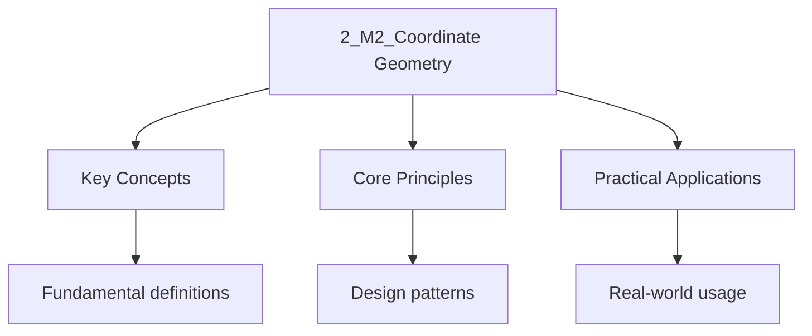

<!-- Breadcrumb Schema for SEO -->

## Coordinate Geometry of Straight Lines

### Gradient (Slope)

The gradient $m$ of a line passing through $(x_1, y_1)$ and $(x_2, y_2)$ is:

$$m = \frac{y_2 - y_1}{x_2 - x_1}$$

### Equations of a Line

- **Gradient-intercept form**: $y = mx + c$
- **Point-gradient form**: $y - y_1 = m(x - x_1)$
- **Two-point form**: $\frac{y - y_1}{x - x_1} = \frac{y_2 - y_1}{x_2 - x_1}$
- **General form**: $Ax + By + C = 0$ where $A$, $B$, $C$ are constants

### Parallel and Perpendicular Lines

- **Parallel**: $m_1 = m_2$
- **Perpendicular**: $m_1 \cdot m_2 = -1$

### Distance Between Points

$$d = \sqrt{(x_2 - x_1)^2 + (y_2 - y_1)^2}$$

### Distance from a Point to a Line

The perpendicular distance from $(x_0, y_0)$ to $Ax + By + C = 0$:

$$d = \frac{|Ax_0 + By_0 + C|}{\sqrt{A^2 + B^2}}$$

### Intersection of Two Lines

To find the intersection of $A_1 x + B_1 y + C_1 = 0$ and $A_2 x + B_2 y + C_2 = 0$, solve the
system of simultaneous equations.

If $\frac{A_1}{A_2} = \frac{B_1}{B_2} = \frac{C_1}{C_2}$, the lines are coincident (the same line).
If $\frac{A_1}{A_2} = \frac{B_1}{B_2} \neq \frac{C_1}{C_2}$, the lines are parallel (no
intersection).

### Angle Between Two Lines

The acute angle $\theta$ between two lines with gradients $m_1$ and $m_2$:

$$\tan \theta = \left|\frac{m_1 - m_2}{1 + m_1 m_2}\right|$$

## Coordinate Geometry of Circles

### Standard Form

A circle with centre $(h, k)$ and radius $r$:

$$(x - h)^2 + (y - k)^2 = r^2$$

### General Form

$$x^2 + y^2 + Dx + Ey + F = 0$$

Centre: $\left(-\frac{D}{2}, -\frac{E}{2}\right)$. Radius: $r = \frac{1}{2}\sqrt{D^2 + E^2 - 4F}$.

For a real circle, $D^2 + E^2 - 4F > 0$.

### Finding the Equation of a Circle

**Given the centre and a point on the circle**: Substitute into the standard form.

**Given three points**: Set up a system of three equations using the general form and solve for $D$,
$E$, and $F$.

**Given the endpoints of a diameter**: The centre is the midpoint of the diameter. The radius is
half the length of the diameter.

### Tangent to a Circle

A tangent to a circle at point $(x_1, y_1)$ on $(x - h)^2 + (y - k)^2 = r^2$:

$$(x_1 - h)(x - h) + (y_1 - k)(y - k) = r^2$$

**Example**: Find the equation of the tangent to $x^2 + y^2 = 25$ at the point $(3, 4)$.

$$3x + 4y = 25$$

### Intersection of a Line and a Circle

Substitute the equation of the line into the equation of the circle to obtain a quadratic in $x$ (or
$y$). The discriminant of this quadratic determines the nature of the intersection:

- $\Delta > 0$: The line cuts the circle at two distinct points
- $\Delta = 0$: The line is tangent to the circle
- $\Delta < 0$: The line does not meet the circle

### Circle through Three Points

Given three non-collinear points $(x_1, y_1)$, $(x_2, y_2)$, $(x_3, y_3)$, substitute each into
$x^2 + y^2 + Dx + Ey + F = 0$ to obtain a system of three linear equations in $D$, $E$, $F$.

## Conic Sections: Parabola

### Standard Forms

A parabola is the locus of points equidistant from a fixed point (focus) and a fixed line
(directrix).

**Vertical axis (opening up or down)**:

$$y^2 = 4ax \quad \text{(opens right)}$$ $$y^2 = -4ax \quad \text{(opens left)}$$
$$x^2 = 4ay \quad \text{(opens upward)}$$ $$x^2 = -4ay \quad \text{(opens downward)}$$

For $y^2 = 4ax$: Focus at $(a, 0)$, directrix $x = -a$, axis of symmetry is the $x$-axis. Vertex at
the origin.

**Translated parabola**: $(x - h)^2 = 4a(y - k)$ has vertex at $(h, k)$, focus at $(h, k + a)$,
directrix $y = k - a$.

### Parametric Form

For the parabola $y^2 = 4ax$, a general point is $(at^2, 2at)$ where $t$ is the parameter.

### Tangent to a Parabola

For $y^2 = 4ax$, the tangent at the point $(at_1^2, 2at_1)$ is:

$$ty = x + at_1^2$$

### Reflective Property

A ray from the focus reflects off the parabola parallel to the axis. Conversely, a ray parallel to
the axis reflects through the focus. This property is used in satellite dishes, headlights, and
telescopes.

## Conic Sections: Ellipse

### Standard Forms

An ellipse is the locus of points such that the sum of the distances from two fixed points (foci) is
constant.

**Horizontal major axis**:

$$\frac{x^2}{a^2} + \frac{y^2}{b^2} = 1 \quad (a > b)$$

Centre: $(0, 0)$. Foci: $(\pm c, 0)$ where $c^2 = a^2 - b^2$. Major axis length: $2a$. Minor axis
length: $2b$. Vertices: $(\pm a, 0)$. Co-vertices: $(0, \pm b)$. Eccentricity: $e = \frac{c}{a}$
where $0 < e < 1$.

**Vertical major axis**:

$$\frac{x^2}{b^2} + \frac{y^2}{a^2} = 1 \quad (a > b)$$

Foci: $(0, \pm c)$ where $c^2 = a^2 - b^2$.

**Translated ellipse**: $\frac{(x-h)^2}{a^2} + \frac{(y-k)^2}{b^2} = 1$ has centre at $(h, k)$.

### Properties

- The sum of distances from any point on the ellipse to the two foci equals $2a$
- The closer $e$ is to 0, the more circular the ellipse
- The closer $e$ is to 1, the more elongated the ellipse

### Tangent to an Ellipse

For $\frac{x^2}{a^2} + \frac{y^2}{b^2} = 1$, the tangent at $(x_1, y_1)$ is:

$$\frac{x x_1}{a^2} + \frac{y y_1}{b^2} = 1$$

## Conic Sections: Hyperbola

### Standard Forms

A hyperbola is the locus of points such that the difference of distances from two fixed points
(foci) is constant.

**Horizontal transverse axis**:

$$\frac{x^2}{a^2} - \frac{y^2}{b^2} = 1$$

Centre: $(0, 0)$. Foci: $(\pm c, 0)$ where $c^2 = a^2 + b^2$. Vertices: $(\pm a, 0)$. Asymptotes:
$y = \pm \frac{b}{a} x$. Eccentricity: $e = \frac{c}{a}$ where $e > 1$.

**Vertical transverse axis**:

$$\frac{y^2}{a^2} - \frac{x^2}{b^2} = 1$$

Foci: $(0, \pm c)$ where $c^2 = a^2 + b^2$. Asymptotes: $y = \pm \frac{a}{b} x$.

**Translated hyperbola**: $\frac{(x-h)^2}{a^2} - \frac{(y-k)^2}{b^2} = 1$ has centre at $(h, k)$.

### Properties

- The difference of distances from any point on the hyperbola to the two foci equals $2a$
- Asymptotes are the lines the hyperbola approaches but never reaches
- The eccentricity $e > 1$

### Tangent to a Hyperbola

For $\frac{x^2}{a^2} - \frac{y^2}{b^2} = 1$, the tangent at $(x_1, y_1)$ is:

$$\frac{x x_1}{a^2} - \frac{y y_1}{b^2} = 1$$

## Comparing Conic Sections

| Property                       | Parabola     | Ellipse           | Hyperbola         |
| ------------------------------ | ------------ | ----------------- | ----------------- |
| Eccentricity                   | $e = 1$      | $0 < e < 1$       | $e > 1$           |
| Foci                           | 1 focus      | 2 foci            | 2 foci            |
| Key relation                   | $e = 1$      | $c^2 = a^2 - b^2$ | $c^2 = a^2 + b^2$ |
| Asymptotes                     | None         | None              | Two asymptotes    |
| Conic condition ($\Delta = 0$) | $\Delta = 0$ | $\Delta < 0$      | $\Delta > 0$      |

## Rectangular Hyperbola

A rectangular hyperbola has perpendicular asymptotes. Its standard equation is $xy = c^2$ or
$x^2 - y^2 = a^2$.

For $xy = c^2$: Asymptotes are the coordinate axes $x = 0$ and $y = 0$.

## Transformations

### Translation

Replacing $x$ with $(x - h)$ and $y$ with $(y - k)$ translates the graph $h$ units right and $k$
units up.

**Example**: $y = (x - 2)^2 + 3$ is $y = x^2$ translated 2 units right and 3 units up.

### Reflection

- $y = f(-x)$: Reflection in the $y$-axis
- $y = -f(x)$: Reflection in the $x$-axis

### Scaling

- $y = af(x)$: Vertical stretch by factor $a$ (if $a > 1$) or compression (if $0 < a < 1$)
- $y = f(ax)$: Horizontal compression by factor $a$ (if $a > 1$) or stretch (if $0 < a < 1$)

### Rotation of Conics

The general second-degree equation $Ax^2 + Bxy + Cy^2 + Dx + Ey + F = 0$ represents:

- An ellipse (or circle) if $B^2 - 4AC < 0$
- A parabola if $B^2 - 4AC = 0$
- A hyperbola if $B^2 - 4AC > 0$

## Vector Methods in Proofs

### Vectors in Coordinate Geometry

The position vector of point $P(x, y)$ is $\vec{OP} = \begin{pmatrix} x \\ y \end{pmatrix}$.

### Vector Equation of a Line

Through point $A$ with position vector $\mathbf{a}$, in the direction of vector $\mathbf{d}$:

$$\mathbf{r} = \mathbf{a} + t\mathbf{d} \quad (t \in \mathbb{R})$$

In Cartesian form, if $\mathbf{d} = \begin{pmatrix} d_1 \\ d_2 \end{pmatrix}$:

$$\frac{x - a_1}{d_1} = \frac{y - a_2}{d_2}$$

### Using Vectors to Prove Geometric Properties

**Example**: Prove that the diagonals of a parallelogram bisect each other.

Let the parallelogram have vertices $A$, $B$, $C$, $D$ with position vectors $\mathbf{a}$,
$\mathbf{b}$, $\mathbf{c}$, $\mathbf{d}$.

Since $ABCD$ is a parallelogram: $\overrightarrow{AB} = \overrightarrow{DC}$, so
$\mathbf{b} - \mathbf{a} = \mathbf{c} - \mathbf{d}$, giving
$\mathbf{a} + \mathbf{c} = \mathbf{b} + \mathbf{d}$.

The midpoint of diagonal $AC$ is $\frac{\mathbf{a} + \mathbf{c}}{2}$. The midpoint of diagonal $BD$
is $\frac{\mathbf{b} + \mathbf{d}}{2}$.

Since $\mathbf{a} + \mathbf{c} = \mathbf{b} + \mathbf{d}$, the midpoints coincide. Therefore, the
diagonals bisect each other.

### Using Dot Product for Perpendicularity

Two vectors $\mathbf{u}$ and $\mathbf{v}$ are perpendicular if and only if their dot product is
zero:

$$\mathbf{u} \cdot \mathbf{v} = 0$$

$$\mathbf{u} \cdot \mathbf{v} = |\mathbf{u}||\mathbf{v}|\cos\theta$$

### Area Using Vectors

The area of triangle $ABC$ is:

$$\text{Area} = \frac{1}{2}|\overrightarrow{AB} \times \overrightarrow{AC}|$$

In 2D, if $\overrightarrow{AB} = \begin{pmatrix} a_1 \\ a_2 \end{pmatrix}$ and
$\overrightarrow{AC} = \begin{pmatrix} c_1 \\ c_2 \end{pmatrix}$:

$$\text{Area} = \frac{1}{2}|a_1 c_2 - a_2 c_1|$$

### Vector Proofs for Collinearity

Three points $A$, $B$, $C$ are collinear if and only if $\overrightarrow{AB}$ is parallel to
$\overrightarrow{AC}$, i.e.:

$$\overrightarrow{AB} = k\overrightarrow{AC} \quad \text{for some scalar } k$$

## Common Pitfalls

- Confusing the standard forms of the ellipse and hyperbola
- Forgetting that $c^2 = a^2 - b^2$ for the ellipse but $c^2 = a^2 + b^2$ for the hyperbola
- Misidentifying the transverse axis of a hyperbola (it is the axis containing the vertices)
- Incorrectly computing the perpendicular distance from a point to a line (sign errors in the
  formula)
- Forgetting to check the discriminant condition when determining intersection types
- Errors in the sign when using the translation formula for conics

## Intuition

Mathematics is the study of structure, quantity, and change. Algebra provides symbols for unknown quantities, geometry describes spatial relationships, and calculus captures motion and growth. Together, these branches form a powerful toolkit for solving problems that range from calculating areas to predicting population dynamics. Mathematical literacy is essential for science, technology, and informed citizenship.

## Cross-References

- [Algebra](../../../../../../sat/src/content/docs/mathematics/algebra)
- [Calculus](../../../../../../hsc/src/content/docs/mathematics/calculus)
- [Statistics](../../../../../../alevel/src/content/docs/further-maths/flashcards-further-statistics)
- [Trigonometry](../../../../../../alevel/src/content/docs/maths/pure-mathematics/08-trigonometry)
