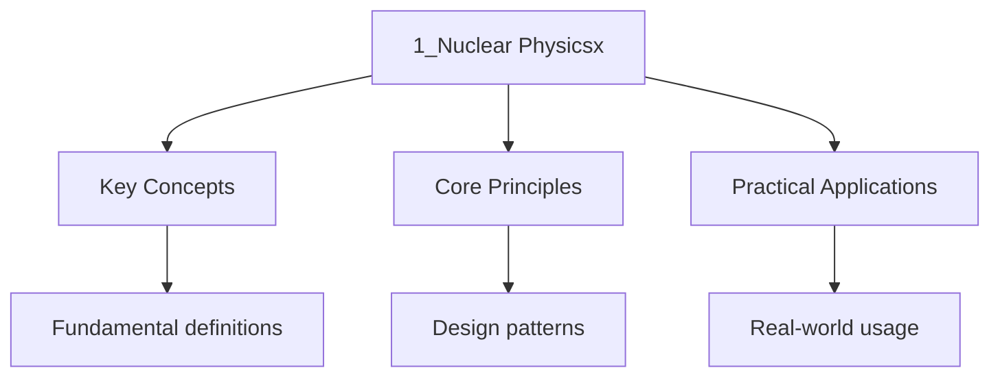

---

title: "Nuclear Physics | DSE - Wyatt's Notes"
description: "The nucleus is a tiny, dense powerhouse that contains almost all the atom's mass: If an atom were a football stadium, the nucleus would be a marble at the"
date: 2026-04-07T00:00:00.000Z
tags:
  - DSE
  - Physics
categories:
  - DSE
  - Physics

---

import PhetSimulation from "@components/PhetSimulation";

## Intuition

**The nucleus is a tiny, dense powerhouse that contains almost all the atom's mass:** If an atom were a football stadium, the nucleus would be a marble at the centre — yet it contains 99.9% of the mass. This incredible density means that when nuclei split (fission) or combine (fusion), enormous amounts of energy are released. This is the source of both nuclear power and nuclear weapons.

**Why it matters:** Nuclear physics explains how the Sun shines (fusion), how nuclear power plants generate electricity (fission), how medical imaging works (radioactive tracers), and how carbon dating determines the age of ancient artefacts. It's also the basis for understanding particle physics and the fundamental forces of nature.

**The key insight:** Radioactive decay is fundamentally random — you cannot predict when a specific nucleus will decay, only the probability that it will decay within a given time. This randomness is not due to our ignorance — it's a fundamental property of quantum mechanics. The half-life is the average time for half the nuclei to decay, not an exact time for each one.

## Atomic Structure Review

### The Nuclear Atom

An atom consists of a small, dense, positively charged **nucleus** surrounded by negatively charged
**electrons** orbiting in shells. The nucleus contains two types of nucleons:

| Particle | Symbol | Charge                   | Mass (u)   | Mass (kg)               |
| -------- | ------ | ------------------------ | ---------- | ----------------------- |
| Proton   | $p$    | $+1.6 \times 10^{-19}$ C | $1.007276$ | $1.673 \times 10^{-27}$ |
| Neutron  | $n$    | $0$                      | $1.008665$ | $1.675 \times 10^{-27}$ |
| Electron | $e^-$  | $-1.6 \times 10^{-19}$ C | $0.000549$ | $9.11 \times 10^{-31}$  |

The **atomic mass unit** (u) is defined as $\frac{1}{12}$ the mass of a carbon-12 atom:

$$1 \mathrm{ u} = 1.66054 \times 10^{-27} \mathrm{ kg}$$

The nucleus occupies roughly $10^{-15}$ m of an atom with diameter $10^{-10}$ m. If the atom were
The size of a football stadium, the nucleus would be approximately the size of a marble at the
Centre.

### Nuclear Notation

**Definition.** Nuclear notation represents an atom as $\prescript{A}{Z}\mathrm X$ where $A$ is The
mass number (total nucleons), $Z$ is the atomic number (protons), and X is the chemical symbol.

$$\prescript{A}{Z}\mathrm X$$

- $A = Z + N$ where $N$ is the neutron number
- $Z$ determines the element (chemical identity)
- $A$ determines the isotope

Examples:

- $\prescript{235}{92}\mathrm U$: uranium-235 with 92 protons and 143 neutrons
- $\prescript{1}{1}\mathrm H$: protium (the most common hydrogen isotope)
- $\prescript{2}{1}\mathrm H$: deuterium (heavy hydrogen, one proton + one neutron)
- $\prescript{3}{1}\mathrm H$: tritium (one proton + two neutrons, radioactive)
- $\prescript{12}{6}\mathrm C$: carbon-12 (the standard for defining the atomic mass unit)

### Isotopes, Isobars, and Isotones

**Definition.** **Isotopes** are atoms of the same element (same $Z$) but different mass number
(different $N$). They have identical chemical properties but different nuclear properties.

| Term     | Same $Z$ | Same $N$ | Same $A$ |
| -------- | -------- | -------- | -------- |
| Isotopes | Yes      | No       | No       |
| Isobars  | No       | No       | Yes      |
| Isotones | No       | Yes      | No       |

Examples:

- Isotopes: $\prescript{1}{1}\mathrm H$, $\prescript{2}{1}\mathrm H$ $\prescript{3}{1}\mathrm H$
- Isobars: $\prescript{40}{20}\mathrm{Ca}$ and $\prescript{40}{18}\mathrm{Ar}$
- Isotones: $\prescript{14}{6}\mathrm C$ and $\prescript{15}{7}\mathrm N$ (both have $N = 8$)

:::note
<strong>In DSE exams, isotopes share the same chemical symbol and chemical behaviour. Only nuclear</strong>

Reactions can distinguish between isotopes of the same element.
:::
### Nuclear Forces

The nucleus is held together by the **strong nuclear force**, which is:

- Attractive at distances of $1$ to $3 \mathrm{ fm}$ ($1 \mathrm{ fm} = 10^{-15}$ m)
- Repulsive at distances shorter than about $0.5 \mathrm{ fm}$ (hard core repulsion)
- Independent of charge (acts equally between proton-proton, neutron-neutron, and proton-neutron
  pairs)
- Much stronger than the electrostatic force at short range, but has a very short range
- Not described by a simple inverse-square law

The competition between the attractive strong nuclear force and the repulsive electrostatic force
(between protons) determines nuclear stability. Heavy nuclei with many protons require extra
Neutrons to provide additional strong force to counteract the increasing electrostatic repulsion.

### Worked Example: Nuclear Notation

How many protons, neutrons, and nucleons are in $\prescript{238}{92}\mathrm U$?

Solution

- Protons: $Z = 92$
- Neutrons: $N = A - Z = 238 - 92 = 146$
- Nucleons: $A = 238$

---

## Radioactivity

<PhetSimulation client:only="solid-js" simulationId="alpha-decay" title="Alpha Decay"  />

Explore the simulation above to develop intuition for this topic.

### Nature of Radioactivity

**Definition.** **Radioactivity** is the spontaneous disintegration of unstable nuclei with the
Emission of radiation. It is a random, spontaneous process that depends only on the nuclear
Structure, not on external conditions such as temperature, pressure, or chemical state.

Radioactivity was discovered by Henri Becquerel in 1896 when he observed that uranium salts could
Expose photographic plates. Marie and Pierre Curie subsequently isolated polonium and radium.

### Types of Radiation

There are three main types of radiation emitted by radioactive nuclei:

| Property                    | Alpha ($\alpha$)                                  | Beta-minus ($\beta^-$)                      | Beta-plus ($\beta^+$)                       | Gamma ($\gamma$)                            |
| --------------------------- | ------------------------------------------------- | ------------------------------------------- | ------------------------------------------- | ------------------------------------------- |
| **Nature**                  | Helium nucleus $\prescript{4}{2}\mathrm{He}^{2+}$ | Electron $e^-$                              | Positron $e^+$                              | Electromagnetic wave                        |
| **Charge**                  | $+2e$                                             | $-e$                                        | $+e$                                        | $0$                                         |
| **Mass (u)**                | $4.0015$                                          | $0.00055$                                   | $0.00055$                                   | $0$                                         |
| **Speed**                   | $\sim 5\%$ of $c$                                 | Up to $99\%$ of $c$                         | Up to $99\%$ of $c$                         | $c$ (speed of light)                        |
| **Ionising power**          | Very high                                         | Moderate                                    | Moderate                                    | Low                                         |
| **Penetrating power**       | Very low (stopped by paper or a few cm of air)    | Moderate (stopped by a few mm of aluminium) | Moderate (stopped by a few mm of aluminium) | Very high (requires thick lead/concrete)    |
| **Range in air**            | $\sim 5 \mathrm{ cm}$                             | $\sim 1 \mathrm{ m}$                        | $\sim 1 \mathrm{ m}$                        | Infinite (intensity decreases with $1/r^2$) |
| **Deflection in E/B field** | Deflected towards negative plate                  | Deflected towards positive plate            | Deflected towards negative plate            | Not deflected                               |
| **Energy spectrum**         | Discrete (monoenergetic)                          | Continuous (shared with antineutrino)       | Continuous (shared with neutrino)           | Discrete (line spectrum)                    |

### Alpha Decay

In alpha decay, the nucleus emits an alpha particle ($\prescript{4}{2}\mathrm{He}$), reducing both
$A$ by $4$ and $Z$ by $2$:

$$\prescript{A}{Z}\mathrm X \to \prescript{A-4}{Z-2}\mathrm Y + \prescript{4}{2}\mathrm{He}$$

The daughter nucleus shifts two places to the left in the periodic table.

Example (radium-226 decay):

$$\prescript{226}{88}\mathrm{Ra} \to \prescript{222}{86}\mathrm{Rn} + \prescript{4}{2}\mathrm{He}$$

Alpha particles are emitted with a single characteristic energy (discrete spectrum) because the
Transition is between two well-defined nuclear energy levels. Alpha decay occurs primarily in heavy
Nuclei ($A \gt 150$) where the strong nuclear force can no longer overcome the electrostatic
Repulsion.

### Beta-Minus Decay

In beta-minus decay, a neutron inside the nucleus converts into a proton, emitting an electron and
An antineutrino:

$$n \to p + e^- + \bar{\nu}_e$$

The nuclear equation is:

$$\prescript{A}{Z}\mathrm X \to \prescript{A}{Z+1}\mathrm Y + e^- + \bar{\nu}_e$$

The daughter nucleus shifts one place to the right in the periodic table. The mass number $A$ does
Not change because a neutron is replaced by a proton.

Beta-minus decay occurs when the nucleus has an excess of neutrons (neutron-rich nuclei). The energy
Is shared between the beta particle and the antineutrino, producing a **continuous energy spectrum**
For the beta particle.

**Why is the antineutrino necessary?** Without the antineutrino, both energy and momentum
Conservation would be violated. The continuous energy spectrum of beta particles (unlike the
Discrete alpha spectrum) was evidence that a third particle carries away some energy.

### Beta-Plus (Positron) Decay

In beta-plus decay, a proton inside the nucleus converts into a neutron, emitting a positron and a
Neutrino:

$$p \to n + e^+ + \nu_e$$

The nuclear equation is:

$$\prescript{A}{Z}\mathrm X \to \prescript{A}{Z-1}\mathrm Y + e^+ + \nu_e$$

Beta-plus decay occurs in proton-rich nuclei. The daughter nucleus shifts one place to the left in
The periodic table.

**Condition for beta-plus decay:** The parent nucleus must have enough mass-energy to create the
Positron. Specifically:

$$m(\mathrm{parent}) \gt m(\mathrm{daughter}) + 2m_e$$

The extra $m_e$ is required because the daughter has one fewer electron, so one orbital electron
Must be emitted as well. If this condition is not met, **electron capture** may occur instead:

$$\prescript{A}{Z}\mathrm X + e^- \to \prescript{A}{Z-1}\mathrm Y + \nu_e$$

### Gamma Radiation

Gamma rays are high-energy photons emitted when a nucleus transitions from an excited state to a
Lower energy state:

$$\prescript{A}{Z}\mathrm X^* \to \prescript{A}{Z}\mathrm X + \gamma$$

The asterisk denotes an excited nuclear state. Gamma emission does not change $A$ or $Z$. It follows
alpha or beta decay when the daughter nucleus is left in an excited state.

Gamma rays have a discrete line spectrum because the nuclear energy levels are quantised. They are
The most penetrating form of radiation but the least ionising.

### Conservation Laws in Nuclear Decay

Every nuclear decay must satisfy:

1. **Conservation of nucleon number** ($A$): total $A$ is conserved
2. **Conservation of proton number** ($Z$): total $Z$ is conserved
3. **Conservation of charge**: total charge is conserved
4. **Conservation of mass-energy**: total mass-energy is conserved (Q-value)
5. **Conservation of momentum**: linear momentum is conserved
6. **Conservation of lepton number**: total lepton number is conserved

:::caution
<strong>Warning Equations. While DSE exams sometimes omit them for simplicity, always check</strong>

whether the question Requires them. Also, ensure $A$ and $Z$ balance on both sides of every decay
equation.
:::
### Worked Example: Balancing Decay Equations

Complete the following decay equation:
$\prescript{214}{84}\mathrm{Po} \to \prescript{210}{82}\mathrm{Pb} + \ ?$

Solution

Check the nucleon number: $214 - 210 = 4$

Check the proton number: $84 - 82 = 2$

The missing particle has $A = 4$, $Z = 2$Which is an alpha particle: $\prescript{4}{2}\mathrm{He}$

---

## Radioactive Decay

### Random and Spontaneous Nature

Radioactive decay is **random**: it is impossible to predict which specific nucleus will decay next
Or exactly when a particular nucleus will decay. It is **spontaneous**: the decay is not affected by
External conditions such as temperature, pressure, chemical bonding, or physical state.

These properties are confirmed experimentally by:

- The fluctuation in count rate observed with a Geiger-Muller tube (statistical fluctuations)
- The identical decay rate of a radioactive compound regardless of its chemical form

### Activity and Decay Constant

**Definition.** The **activity** $A$ of a radioactive source is the number of decays per unit time.

$$A = -\frac{dN}{dt} = \lambda N$$

Where:

- $N$ = number of undecayed nuclei at time $t$
- $\lambda$ = decay constant (probability of decay per nucleus per unit time)
- The SI unit of activity is the **becquerel** (Bq), where $1 \mathrm{ Bq} = 1 \mathrm{ decay/s}$

The decay constant $\lambda$ is characteristic of a particular isotope. A large $\lambda$ means the
Isotope decays quickly (short-lived); a small $\lambda$ means it decays slowly (long-lived).

### Exponential Decay Law

Starting from $A = \lambda N$ and solving the differential equation:

$$\frac{dN}{dt} = -\lambda N$$

We obtain:

$$N = N_0 e^{-\lambda t}$$

Where $N_0$ is the initial number of undecayed nuclei at $t = 0$.

Since activity is proportional to the number of undecayed nuclei ($A = \lambda N$), activity also
Follows exponential decay:

$$A = A_0 e^{-\lambda t}$$

Where $A_0 = \lambda N_0$ is the initial activity.

### Half-Life

**Definition.** The **half-life** $t_{1/2}$ is the time taken for half of the radioactive nuclei in
A sample to decay.

Setting $N = \frac{N_0}{2}$ in the decay law:

$$\frac{N_0}{2} = N_0 e^{-\lambda t_{1/2}}$$

$$\frac{1}{2} = e^{-\lambda t_{1/2}}$$

$$\ln\left(\frac{1}{2}\right) = -\lambda t_{1/2}$$

$$t_{1/2} = \frac{\ln 2}{\lambda} = \frac{0.693}{\lambda}$$

Conversely:

$$\lambda = \frac{\ln 2}{t_{1/2}} = \frac{0.693}{t_{1/2}}$$

After $n$ half-lives, the fraction remaining is:

$$\frac{N}{N_0} = \left(\frac{1}{2}\right)^n = \frac{1}{2^n}$$

| Number of half-lives ($n$) | Fraction remaining | Percentage remaining |
| -------------------------- | ------------------ | -------------------- |
| $0$                        | $1$                | $100\%$              |
| $1$                        | $1/2$              | $50\%$               |
| $2$                        | $1/4$              | $25\%$               |
| $3$                        | $1/8$              | $12.5\%$             |
| $4$                        | $1/16$             | $6.25\%$             |
| $5$                        | $1/32$             | $3.125\%$            |

### Determining Half-Life from a Graph

Given an exponential decay curve of activity (or count rate) versus time:

1. Find the initial activity $A_0$
2. Find the time at which the activity drops to $\frac{A_0}{2}$ -- this is $t_{1/2}$
3. Verify by checking that the activity at $2t_{1/2}$ is $\frac{A_0}{4}$

For a logarithmic plot ($\ln A$ vs $t$):

$$\ln A = \ln A_0 - \lambda t$$

This is a straight line with:

- Slope $= -\lambda$
- y-intercept $= \ln A_0$

The half-life is then:

$$t_{1/2} = \frac{\ln 2}{\lvert\mathrm{slope}\rvert}$$

:::note
<strong>Info Plot, remember the slope is negative: $\lvert\mathrm{slope}\rvert = \lambda$. Always</strong>

check the axes carefully -- count rate is proportional to activity but is lower due to detector
efficiency.
:::
### Relationship Between Activity and Mass

For a sample of mass $m$ of an isotope with molar mass $M$:

$$N = \frac{m}{M} N_A$$

Where $N_A = 6.02 \times 10^{23} \mathrm{ mol}^{-1}$ is the Avogadro constant.

The activity is then:

$$A = \lambda N = \frac{\lambda m N_A}{M} = \frac{m N_A \ln 2}{M t_{1/2}}$$

:::caution
<strong>Warning Detected by a particular instrument). The count rate is always less than or equal</strong>

to the activity Because:

- The detector only captures a fraction of emitted radiation (solid angle)
- Not all radiation reaches the detector (absorption by air, source holder)
- The detector has less than 100% efficiency
:::
---

## Nuclear Reactions

### Mass-Energy Equivalence

Einstein\'s mass-energy equivalence is the foundational principle behind all nuclear energy
Calculations:

$$E = mc^2$$

Where:

- $E$ = energy equivalent (J)
- $m$ = mass (kg)
- $c = 3.0 \times 10^8 \mathrm{ m/s}$ (speed of light)

A small amount of mass corresponds to a very large amount of energy. For nuclear physics
Calculations, it is often convenient to use the conversion:

$$1 \mathrm{ u} \times c^2 = 931.5 \mathrm{ MeV}$$

Or equivalently:

$$1 \mathrm{ MeV}/c^2 = 1.783 \times 10^{-30} \mathrm{ kg}$$

### Mass Defect and Binding Energy

**Definition.** The **mass defect** $\Delta m$ of a nucleus is the difference between the total mass
Of its constituent nucleons (when separated) and the actual mass of the nucleus:

$$\Delta m = Zm_p + Nm_n - m_{\mathrm{nucleus}}$$

Where:

- $Z$ = number of protons
- $N$ = number of neutrons
- $m_p$ = mass of a proton
- $m_n$ = mass of a neutron
- $m_{\mathrm{nucleus}}$ = actual mass of the nucleus

The mass defect is always positive for stable nuclei. The "missing" mass has been converted into
Binding energy that holds the nucleus together.

**Definition.** The **binding energy** $BE$ of a nucleus is the energy equivalent of its mass
Defect:

$$BE = \Delta m \cdot c^2$$

This is the minimum energy required to completely separate the nucleus into its individual protons
And neutrons.

**Definition.** The **binding energy per nucleon** is the binding energy divided by the mass number:

$$\frac{BE}{A} = \frac{\Delta m \cdot c^2}{A}$$

This is a measure of nuclear stability -- the higher the binding energy per nucleon, the more stable
The nucleus.

### Binding Energy per Nucleon Curve

The binding energy per nucleon curve is one of the most important graphs in nuclear physics:

| Region              | Mass number range | Binding energy per nucleon | Characteristics               |
| ------------------- | ----------------- | -------------------------- | ----------------------------- |
| Very light nuclei   | $A \lt 20$        | Rising sharply             | Fusion releases energy        |
| Peak region (Fe-56) | $A \approx 50-60$ | Maximum ($\sim 8.8$ MeV)   | Most stable nuclei            |
| Medium nuclei       | $20 \lt A \lt 60$ | Relatively flat            | Stable                        |
| Heavy nuclei        | $A \gt 60$        | Gradually decreasing       | Fission releases energy       |
| Very heavy nuclei   | $A \gt 200$       | $\sim 7.5$ MeV             | Unstable, can undergo fission |

Key points:

- Iron-56 ($\prescript{56}{26}\mathrm{Fe}$) has the highest binding energy per nucleon and is the
  most stable nucleus
- Energy is released when light nuclei **fuse** (move towards the peak from the left)
- Energy is released when heavy nuclei **fission** (move towards the peak from the right)
- The curve explains why both fusion and fission can release energy

### Nuclear Fission

**Definition.** **Nuclear fission** is the splitting of a heavy nucleus into two (or occasionally
Three) lighter nuclei, accompanied by the release of energy and two or three neutrons.

The most studied fission reaction is uranium-235:

$$\prescript{1}{0}\mathrm n + \prescript{235}{92}\mathrm U \to \prescript{236}{92}\mathrm U^* \to \prescript{141}{56}\mathrm{Ba} + \prescript{92}{36}\mathrm{Kr} + 3\prescript{1}{0}\mathrm n + \mathrm{energy}$$

The released neutrons can induce further fission reactions, creating a **chain reaction**.

**Critical mass** is the minimum mass of fissile material required to sustain a chain reaction. If
The mass is subcritical, too many neutrons escape without causing further fission. If the mass is
Supercritical, the reaction rate increases exponentially.

#### Components of a Nuclear Reactor

| Component    | Function                                                          | Material examples            |
| ------------ | ----------------------------------------------------------------- | ---------------------------- |
| Fuel rods    | Contain fissile material                                          | U-235, Pu-239                |
| Moderator    | Slow down fast neutrons to thermal energies for efficient fission | Water, heavy water, graphite |
| Control rods | Absorb excess neutrons to control the reaction rate               | Boron, cadmium, hafnium      |
| Coolant      | Remove heat from the reactor core                                 | Water, liquid sodium, CO$_2$ |
| Containment  | Prevent radiation leaks to the environment                        | Thick concrete and steel     |
| Shielding    | Absorb gamma rays and neutrons                                    | Lead, concrete, water        |

**Moderator:** Fast neutrons from fission have energies of about $2 \mathrm{ MeV}$. U-235 fission is
Much more probable with thermal (slow) neutrons ($\sim 0.025 \mathrm{ eV}$). The moderator slows
Neutrons through elastic collisions. A good moderator has a small mass number (for efficient energy
Transfer in elastic collisions) and a low neutron absorption cross-section.

**Control rods:** These are inserted or withdrawn to regulate the reaction rate. Inserting control
Rods absorbs more neutrons, reducing the reaction rate. Withdrawing them allows more neutrons to
Cause fission, increasing the rate. In an emergency (SCRAM), control rods are fully inserted to shut
Down the reactor.

#### Types of Nuclear Power Reactors

**Pressurised Water Reactor (PWR):**

- Water acts as both coolant and moderator
- Primary coolant loop is kept at high pressure ($\sim 155$ bar) to prevent boiling
- Heat is transferred to a secondary loop via a heat exchanger to produce steam
- Most common reactor type worldwide
- Negative temperature coefficient provides inherent safety

**Boiling Water Reactor (BWR):**

- Water boils directly in the reactor core to produce steam
- Steam drives the turbine directly (no secondary loop)
- Simpler design but radioactive steam passes through the turbine
- Lower operating pressure than PWR

| Feature           | PWR                               | BWR                        |
| ----------------- | --------------------------------- | -------------------------- |
| Coolant           | Pressurised water (does not boil) | Boiling water              |
| Steam generation  | Secondary loop (heat exchanger)   | Direct in reactor core     |
| Moderator         | Water (primary loop)              | Water                      |
| Pressure          | $\sim 155$ bar                    | $\sim 70$ bar              |
| Fuel enrichment   | $3$-$5\%$ U-235                   | $2$-$4\%$ U-235            |
| Radioactive steam | No (secondary loop is clean)      | Yes (steam is radioactive) |

### Nuclear Fusion

**Definition.** **Nuclear fusion** is the combining of two light nuclei to form a heavier nucleus,
Releasing energy in the process.

Fusion releases energy because the product nucleus has a higher binding energy per nucleon than the
Reactants (moving towards the peak of the binding energy curve).

Example fusion reactions:

$$\prescript{2}{1}\mathrm H + \prescript{2}{1}\mathrm H \to \prescript{3}{2}\mathrm{He} + \prescript{1}{0}\mathrm n + 3.27 \mathrm{ MeV}$$

$$\prescript{2}{1}\mathrm H + \prescript{3}{1}\mathrm H \to \prescript{4}{2}\mathrm{He} + \prescript{1}{0}\mathrm n + 17.6 \mathrm{ MeV}$$

#### Conditions for Fusion

For fusion to occur, nuclei must overcome the electrostatic repulsion between them. This requires:

1. **High temperature** ($\sim 10^7$ to $10^8$ K): nuclei must have sufficient kinetic energy to
   overcome the Coulomb barrier
2. **High density**: increases the collision rate between nuclei
3. **Confinement time**: nuclei must be held together long enough for fusion to occur

These three conditions are described by the **Lawson criterion**.

#### Fusion in Stars

Stars are powered by fusion. The main processes are:

**Proton-proton (pp) chain** (dominant in stars like the Sun):

Step 1:
$\prescript{1}{1}\mathrm H + \prescript{1}{1}\mathrm H \to \prescript{2}{1}\mathrm H + e^+ + \nu_e + 0.42 \mathrm{ MeV}$

Step 2:
$\prescript{2}{1}\mathrm H + \prescript{1}{1}\mathrm H \to \prescript{3}{2}\mathrm{He} + \gamma + 5.49 \mathrm{ MeV}$

Step 3:
$\prescript{3}{2}\mathrm{He} + \prescript{3}{2}\mathrm{He} \to \prescript{4}{2}\mathrm{He} + 2\prescript{1}{1}\mathrm H + 12.86 \mathrm{ MeV}$

Net:
$4\prescript{1}{1}\mathrm H \to \prescript{4}{2}\mathrm{He} + 2e^+ + 2\nu_e + 2\gamma + 26.7 \mathrm{ MeV}$

**CNO cycle** (dominant in stars more massive than the Sun):

Uses carbon, nitrogen, and oxygen as catalysts. The net result is the same: four protons fuse to
Form a helium-4 nucleus with the release of about $26.7 \mathrm{ MeV}$. The CNO cycle has a much
Stronger temperature dependence than the pp chain, making it dominant at higher temperatures.

### Q-Value of Nuclear Reactions

**Definition.** The **Q-value** of a nuclear reaction is the energy released (or absorbed) in the
Reaction, calculated from the mass difference between reactants and products:

$$Q = (m_{\mathrm{reactants}} - m_{\mathrm{products}}) \times c^2$$

- $Q \gt 0$: exothermic reaction (energy released, e.g., fission, fusion)
- $Q \lt 0$: endothermic reaction (energy absorbed, threshold energy required)

For the D-T fusion reaction:

$$Q = [m(\prescript{2}{1}\mathrm H) + m(\prescript{3}{1}\mathrm H) - m(\prescript{4}{2}\mathrm{He}) - m(\prescript{1}{0}\mathrm n)]c^2 = 17.6 \mathrm{ MeV}$$

:::note
<strong>In DSE calculations, always convert masses to the same units (preferably u) before computing</strong>

The Q-value. Use $1 \mathrm{ u} = 931.5 \mathrm{ MeV}/c^2$ for the energy conversion. Remember that
The Q-value is shared among all products as kinetic energy (and possibly photons).
:::
---

## Detection and Measurement

### Geiger-Muller Tube

The Geiger-Muller (GM) tube is the most commonly used radiation detector in school laboratories.

**Construction and operation:**

1. A thin mica window at one end allows radiation to enter
2. The tube contains a low-pressure gas ( argon with a small amount of halogen quenching gas)
3. A central anode wire is at high positive potential ($\sim 400$-$900$ V); the cylindrical cathode
   is at ground potential
4. When radiation enters the tube, it ionises gas atoms, producing ion pairs
5. The electrons are accelerated towards the anode and ionise more gas atoms in an **avalanche**
   (Townsend avalanche)
6. Each avalanche produces a detectable pulse of current
7. The pulse is counted by an electronic counter

**Dead time:** After each detection event, the GM tube requires a brief recovery period ($\sim 100$
To $300 \ \mu\mathrm s$) during which it cannot detect new events. This is called the **dead
Time**. At high count rates, some events are missed, leading to an undercount.

**Quenching:** Without quenching, the positive ions would reach the cathode and release secondary
Electrons, causing multiple pulses from a single radiation event. Quenching is achieved by:

- Adding a small amount of halogen gas (self-quenching tube) that absorbs the energy of positive
  ions
- Using an external quenching circuit

**Limitations of the GM tube:**

- Cannot distinguish between different types of radiation
- Cannot measure the energy of radiation
- Has a dead time that limits the maximum count rate
- Cannot detect very low-energy radiation (absorbed by the window)

### Photographic Film

Photographic film darkens when exposed to ionising radiation. The degree of darkening depends on the
Total dose received.

- Used in **film badges** worn by radiation workers to monitor cumulative exposure
- Can provide a permanent record of radiation exposure
- Different filters (e.g., aluminium, lead) over different sections allow estimation of the type and
  energy of radiation
- Simple, inexpensive, and requires no power supply
- Cannot provide real-time readings; must be developed in a laboratory

### Scintillation Counter

A scintillation counter uses a scintillating material that emits flashes of light (scintillations)
When ionising radiation passes through it.

**Operation:**

1. Radiation strikes a scintillator (e.g., sodium iodide doped with thallium, NaI(Tl))
2. The scintillator produces a flash of light
3. The light is detected by a **photomultiplier tube** (PMT)
4. The PMT converts the light into an electrical signal and amplifies it enormously

**Advantages over GM tube:**

- Can measure the energy of radiation (pulse height analysis)
- Faster response time (shorter dead time)
- Higher detection efficiency for certain types of radiation
- Can distinguish between different types of radiation based on pulse characteristics

### Cloud Chamber

A cloud chamber makes the paths of ionising radiation visible by creating a supersaturated vapour.

**Operation:**

1. A chamber contains alcohol (or water) vapour near its condensation point
2. The chamber is cooled rapidly (expansion-type) or has a cold plate (diffusion-type)
3. When ionising radiation passes through the chamber, it ionises air molecules along its path
4. The ions act as condensation nuclei, and tiny liquid droplets form along the track
5. The tracks are illuminated and can be photographed or observed directly

**Track characteristics:**

| Radiation | Track appearance                                               | Length              |
| --------- | -------------------------------------------------------------- | ------------------- |
| Alpha     | Thick, straight, dense track                                   | Short ($\sim 5$ cm) |
| Beta      | Thin, winding track ( deflected)                               | Long ($\sim 1$ m)   |
| Gamma     | Very faint, short, scattered tracks (pair production, Compton) | Very short          |

### Semiconductor Detector

Semiconductor detectors use the principle that ionising radiation creates electron-hole pairs in a
Semiconductor material (e.g., silicon or germanium).

- Each ionising event creates many electron-hole pairs, proportional to the energy deposited
- Very good energy resolution
- Fast response
- Compact size
- Often requires cooling (especially germanium detectors) to reduce thermal noise

### Comparison of Detectors

| Detector              | Radiation types detected   | Energy measurement | Advantages                        | Disadvantages                     |
| --------------------- | -------------------------- | ------------------ | --------------------------------- | --------------------------------- |
| GM tube               | Alpha, beta, gamma         | No                 | Simple, portable, cheap           | No energy resolution, dead time   |
| Photographic film     | Alpha, beta, gamma, X-rays | No                 | Permanent record, no power needed | No real-time reading, slow        |
| Scintillation counter | Alpha, beta, gamma         | Yes                | Good energy resolution, fast      | Expensive, requires PMT           |
| Cloud chamber         | Alpha, beta, gamma         | Limited            | Visualises tracks                 | Bulky, requires careful setup     |
| Semiconductor         | Alpha, beta, gamma, X-rays | Yes (excellent)    | Best energy resolution, compact   | Expensive, often requires cooling |

:::note
<strong>In DSE exams, the GM tube is the most important detector. Know its construction, operation</strong>

Principle, dead time, and limitations. Be prepared to explain why a GM tube cannot distinguish
Between alpha and beta radiation.
:::
---

## Biological Effects of Radiation

### Ionising Radiation and Damage

Ionising radiation carries enough energy to remove electrons from atoms, creating ions. This
Ionisation can damage biological tissue through several mechanisms:

1. **Direct ionisation:** Radiation directly ionises DNA molecules, causing strand breaks
2. **Indirect ionisation:** Radiation ionises water molecules (the most abundant molecule in the
   body), producing reactive free radicals ($\mathrm{OH}^*$, $\mathrm H^*$) that attack DNA

Types of DNA damage:

- Single-strand breaks: repairable
- Double-strand breaks: more serious, may lead to cell death or mutations
- Base damage: may cause mispairing during replication
- Chromosome aberrations: visible under a microscope

### Dose Units

| Quantity                          | Unit           | Definition                                                         |
| --------------------------------- | -------------- | ------------------------------------------------------------------ |
| Absorbed dose                     | Gray (Gy)      | Energy absorbed per unit mass: $1 \mathrm{ Gy} = 1 \mathrm{ J/kg}$ |
| Equivalent dose (dose equivalent) | Sievert (Sv)   | Absorbed dose weighted by radiation type: $H = D \times w_R$       |
| Effective dose                    | Sievert (Sv)   | Equivalent dose weighted by tissue sensitivity: $E = \sum H_T w_T$ |
| Activity                          | Becquerel (Bq) | One decay per second: $1 \mathrm{ Bq} = 1 \mathrm{ s}^{-1}$        |

Radiation weighting factors $w_R$:

| Radiation type         | $w_R$                        |
| ---------------------- | ---------------------------- |
| X-rays, gamma rays     | $1$                          |
| Beta particles         | $1$                          |
| Thermal neutrons       | $1$                          |
| Fast neutrons, protons | $2$-$20$ (depends on energy) |
| Alpha particles        | $20$                         |

Alpha particles have a high $w_R$ because of their high ionising power, which causes concentrated
Damage along a short track.

Common dose conversions:

$$1 \mathrm{ Sv} = 1000 \mathrm{ mSv}$$

$$1 \mathrm{ mSv} = 1000 \ \mu\mathrm{Sv}$$

### Exposure Limits

| Category                         | Annual limit (typical)                                                           |
| -------------------------------- | -------------------------------------------------------------------------------- |
| General public                   | $1 \mathrm{ mSv}$                                                                |
| Radiation workers (occupational) | $20 \mathrm{ mSv}$ averaged over 5 years ($50 \mathrm{ mSv}$ in any single year) |
| Pregnant radiation workers       | $1 \mathrm{ mSv}$ to the foetus                                                  |

Typical radiation doses:

| Source                          | Typical dose                  |
| ------------------------------- | ----------------------------- |
| Chest X-ray                     | $0.02$-$0.1 \mathrm{ mSv}$    |
| Dental X-ray                    | $0.005 \mathrm{ mSv}$         |
| CT scan (abdomen)               | $8$-$10 \mathrm{ mSv}$        |
| Background radiation (per year) | $2.4$-$3.0 \mathrm{ mSv}$     |
| Flight at 35,000 ft (per hour)  | $0.003$-$0.005 \mathrm{ mSv}$ |
| Mammogram                       | $0.4 \mathrm{ mSv}$           |

### ALARA Principle

**Definition.** The **ALARA** principle states that radiation exposure should be kept **A**s **L**ow
**A**s **R**easonably **A**chievable. This means:

- **Time:** Minimise time spent near radioactive sources
- **Distance:** Maximise distance from sources (intensity falls off as $1/r^2$ for a point source)
- **Shielding:** Use appropriate shielding between the source and the person

### Shielding

The choice of shielding material depends on the type of radiation:

| Radiation | Shielding material                     | Reason                                                                                            |
| --------- | -------------------------------------- | ------------------------------------------------------------------------------------------------- |
| Alpha     | Paper, human skin                      | Alpha particles have low penetration; stopped by a few cm of air                                  |
| Beta      | Aluminium ($\sim 1$-$5$ mm) or perspex | Beta particles are stopped by low-Z materials; high-Z materials can produce bremsstrahlung X-rays |
| Gamma     | Lead ($\sim$ cm) or thick concrete     | High penetration requires dense, high-Z materials; intensity reduced exponentially                |

**Half-value thickness (HVT):** The thickness of material that reduces the intensity of gamma
Radiation to half its original value:

$$I = I_0 e^{-\mu x}$$

$$\mathrm{HVT} = \frac{\ln 2}{\mu}$$

Where $\mu$ is the linear attenuation coefficient.

:::caution
<strong>Never use lead shielding for beta radiation. High-Z materials like lead produce</strong>

Bremsstrahlung (breaking radiation) when beta particles decelerate rapidly, creating X-rays that are
More penetrating than the original beta particles. Use aluminium or perspex for beta shielding
Instead.
:::
---

## Applications

### Radiocarbon Dating

Carbon-14 dating is used to determine the age of organic materials up to about $50,000$ years.

**Principle:**

- Carbon-14 ($\prescript{14}{6}\mathrm C$) is produced in the upper atmosphere by cosmic ray
  neutrons interacting with nitrogen-14:

  $$\prescript{1}{0}\mathrm n + \prescript{14}{7}\mathrm N \to \prescript{14}{6}\mathrm C + \prescript{1}{1}\mathrm H$$

- C-14 is radioactive and undergoes beta-minus decay with a half-life of $5730$ years:

  $$\prescript{14}{6}\mathrm C \to \prescript{14}{7}\mathrm N + e^- + \bar{\nu}_e$$

- Living organisms continuously exchange carbon with the environment, maintaining a constant ratio
  of C-14 to C-12 ($\sim 1.3 \times 10^{-12}$)
- When an organism dies, it stops exchanging carbon. The C-14 decays while C-12 remains constant
- The ratio of C-14 to C-12 decreases over time, allowing the age to be calculated

**Age calculation:**

$$N = N_0 e^{-\lambda t}$$

$$\frac{N}{N_0} = e^{-\lambda t}$$

$$t = \frac{1}{\lambda} \ln\left(\frac{N_0}{N}\right) = \frac{t_{1/2}}{\ln 2} \ln\left(\frac{N_0}{N}\right)$$

**Limitations:**

- Maximum useful age is about $50,000$ years (after about 10 half-lives, too little C-14 remains)
- Requires calibration with other dating methods (tree rings, ice cores) because atmospheric C-14
  concentration has varied over time
- Contamination by modern or old carbon can affect results
- Only works for organic materials (formerly living things)

### Medical Isotopes

| Isotope | Half-life    | Radiation emitted | Application                                              |
| ------- | ------------ | ----------------- | -------------------------------------------------------- |
| I-131   | $8.02$ days  | Beta-minus, gamma | Treatment of thyroid cancer and hyperthyroidism          |
| Tc-99m  | $6.01$ hours | Gamma ($140$ keV) | Diagnostic imaging (most widely used medical isotope)    |
| Co-60   | $5.27$ years | Beta-minus, gamma | Radiotherapy (external beam), sterilisation of equipment |
| P-32    | $14.3$ days  | Beta-minus        | Treatment of certain blood disorders                     |
| Sr-90   | $28.8$ years | Beta-minus        | Treatment of eye diseases, superficial radiotherapy      |
| F-18    | $110$ min    | Beta-plus         | PET scans (FDG: fluorodeoxyglucose)                      |

**Technetium-99m** is the most widely used diagnostic radioisotope because:

- Its half-life ($6.01$ hours) is short enough to minimise patient dose but long enough for imaging
  procedures
- It emits a single, well-defined gamma ray at $140$ keV, ideal for gamma camera detection
- It can be attached to various pharmaceutical compounds to target specific organs
- It is produced from a Mo-99/Tc-99m generator, making it readily available in hospitals

**Iodine-131** is used therapeutically because:

- The thyroid gland selectively absorbs iodine, so I-131 concentrates in thyroid tissue
- Beta particles deliver a localised radiation dose to thyroid cells (treating cancer)
- Gamma rays allow imaging of the thyroid for diagnostic purposes

### Nuclear Power Plants

Nuclear power plants generate electricity using the heat from controlled nuclear fission. The basic
Process:

1. Fission in the reactor core produces heat
2. A coolant (water, liquid sodium, CO$_2$) transfers heat from the core
3. The heat is used to produce steam (either directly or via a heat exchanger)
4. Steam drives a turbine connected to a generator
5. The steam is condensed and recycled

**Advantages of nuclear power:**

- Very high energy density: $1 \mathrm{ kg}$ of U-235 produces as much energy as about $2.7$ million
  kg of coal
- No greenhouse gas emissions during operation (CO$_2$-free electricity generation)
- Reliable baseload power (not dependent on weather)
- Relatively small fuel volume compared to fossil fuels

**Disadvantages of nuclear power:**

- Production of long-lived radioactive waste (some isotopes have half-lives of thousands of years)
- Risk of catastrophic accidents (Chernobyl 1986, Fukushima 2011)
- High initial construction costs and long construction times
- Potential for nuclear weapons proliferation (enriched uranium and plutonium)
- Decommissioning costs and challenges

### Smoke Detectors

Domestic smoke detectors commonly use a small amount of americium-241 (an alpha emitter):

- Am-241 emits alpha particles that ionise the air in a small chamber
- The ionised air conducts a small current between two electrodes
- When smoke particles enter the chamber, they attach to ions, reducing the current
- The drop in current triggers the alarm

Am-241 has a half-life of $432$ years, so the source lasts for the lifetime of the detector. The
Alpha particles cannot penetrate the detector casing, so there is no external radiation hazard under
Normal operation.

---

## DSE Exam Focus

### Common Question Types

#### Type 1: Decay Equations and Conservation Laws

Given a decay equation, identify the missing particle. Check:

- Does $A$ balance? (total mass number conserved)
- Does $Z$ balance? (total proton number conserved)
- Is the emitted particle consistent with the decay type?

#### Type 2: Half-Life Calculations

- Given initial and final activity (or count rate), find the time elapsed
- Given half-life and initial quantity, find the quantity after a given time
- Determine half-life from a graph (linear or log-linear)

#### Type 3: Binding Energy and Mass Defect

- Calculate mass defect given nuclear masses
- Calculate binding energy per nucleon
- Determine whether fission or fusion is energetically favourable
- Calculate Q-value of a nuclear reaction

#### Type 4: Activity and Count Rate

- Calculate activity from the number of nuclei and decay constant
- Relate count rate to activity (accounting for efficiency)
- Determine the number of nuclei from activity and half-life

#### Type 5: Radiocarbon Dating

- Calculate the age of a sample given the current activity and the expected initial activity
- Understand the assumptions and limitations of carbon dating

#### Type 6: Nuclear Power and Radiation Safety

- Explain the role of moderator, control rods, and coolant
- Compare fission and fusion
- Calculate shielding thickness using half-value thickness

### Graph Interpretation Skills

1. **Exponential decay graph ($N$ or $A$ vs $t$):** Verify that it is exponential by checking that
   halving the activity always takes the same time. Read half-life directly from the graph.

2. **Log-linear graph ($\ln A$ vs $t$):** Should be a straight line with negative slope
   $= -\lambda$. Use the slope to find $\lambda$ and then $t_{1/2}$.

3. **Binding energy per nucleon curve:** Identify the region of maximum stability (around Fe-56).
   Determine whether fusion or fission is energetically favourable for a given nucleus.

4. **Alpha energy spectrum:** Discrete lines at specific energies.

5. **Beta energy spectrum:** Continuous distribution from zero to a maximum energy $E_{\max}$. The
   "missing" energy is carried by the neutrino/antineutrino.

### Experimental Skills

- Use a GM tube and counter to measure count rate
- Determine half-life from experimental data
- Plot a log-linear graph and extract the decay constant
- Account for background radiation by subtracting the background count rate
- Understand sources of error: statistical fluctuations, dead time, geometry, absorption

:::note
<strong>Info Calculations and explanations. In Paper 2, it appears as multiple-choice questions</strong>

testing concepts, Definitions, and quick calculations. Practise balancing decay equations and
calculating binding Energy -- these are high-frequency topics.
:::
### Key Formulae Summary

| Quantity                | Formula                                                   |
| ----------------------- | --------------------------------------------------------- |
| Activity                | $A = \lambda N$                                           |
| Decay law               | $N = N_0 e^{-\lambda t}$                                  |
| Activity decay          | $A = A_0 e^{-\lambda t}$                                  |
| Half-life               | $t_{1/2} = \frac{\ln 2}{\lambda}$                         |
| Decay constant          | $\lambda = \frac{\ln 2}{t_{1/2}}$                         |
| Number of nuclei        | $N = \frac{m}{M} N_A$                                     |
| Mass-energy equivalence | $E = mc^2$                                                |
| Mass defect             | $\Delta m = Zm_p + Nm_n - m_{\mathrm{nucleus}}$           |
| Binding energy          | $BE = \Delta m \cdot c^2$                                 |
| Q-value                 | $Q = (m_{\mathrm{reactants}} - m_{\mathrm{products}})c^2$ |
| Energy conversion       | $1 \mathrm{ u} = 931.5 \mathrm{ MeV}$                     |
| Radiation intensity     | $I = I_0 e^{-\mu x}$                                      |
| Half-value thickness    | $\mathrm{HVT} = \frac{\ln 2}{\mu}$                        |

---

## Worked Examples

### Worked Example 1: Alpha Decay Equation

Radon-222 decays by alpha emission. Write the complete decay equation and calculate the energy
Released if the mass of Rn-222 is $221.970$ u, the mass of Po-218 is $217.963$ u, and the mass of
He-4 is $4.003$ u.

Solution

**Decay equation:**

$$\prescript{222}{86}\mathrm{Rn} \to \prescript{218}{84}\mathrm{Po} + \prescript{4}{2}\mathrm{He}$$

**Energy released (Q-value):**

$$Q = (m_{\mathrm{parent}} - m_{\mathrm{daughter}} - m_{\alpha}) \times 931.5 \mathrm{ MeV}$$

$$Q = (221.970 - 217.963 - 4.003) \times 931.5$$

$$Q = 0.004 \times 931.5 = 3.73 \mathrm{ MeV}$$

This energy is shared as kinetic energy between the alpha particle and the polonium-218 daughter
Nucleus, with most going to the alpha particle (due to conservation of momentum and the lighter mass
Of the alpha particle).

### Worked Example 2: Half-Life Calculation

A radioactive isotope has an initial activity of $800$ Bq. After $30$ minutes, the activity has
Fallen to $100$ Bq. Calculate the half-life of the isotope.

Solution

**Method 1: Using the fraction remaining**

The activity has decreased from $800$ Bq to $100$ Bq, so the fraction remaining is:

$$\frac{A}{A_0} = \frac{100}{800} = \frac{1}{8} = \frac{1}{2^3}$$

This corresponds to $3$ half-lives. Therefore:

$$3 t_{1/2} = 30 \mathrm{ min}$$

$$t_{1/2} = 10 \mathrm{ min}$$

**Method 2: Using the decay law**

$$A = A_0 e^{-\lambda t}$$

$$100 = 800 e^{-\lambda \times 1800}$$

$$\frac{1}{8} = e^{-1800\lambda}$$

$$\ln\left(\frac{1}{8}\right) = -1800\lambda$$

$$-2.079 = -1800\lambda$$

$$\lambda = 1.155 \times 10^{-3} \mathrm{ s}^{-1}$$

$$t_{1/2} = \frac{\ln 2}{\lambda} = \frac{0.693}{1.155 \times 10^{-3}} = 600 \mathrm{ s} = 10 \mathrm{ min}$$

### Worked Example 3: Binding Energy per Nucleon

Calculate the binding energy per nucleon of helium-4 ($\prescript{4}{2}\mathrm{He}$).

Given:

- Mass of He-4 nucleus $= 4.001506$ u
- Mass of proton $= 1.007276$ u
- Mass of neutron $= 1.008665$ u

Solution

**Step 1: Calculate the mass defect**

$$\Delta m = Zm_p + Nm_n - m_{\mathrm{nucleus}}$$

$$\Delta m = 2(1.007276) + 2(1.008665) - 4.001506$$

$$\Delta m = 2.014552 + 2.017330 - 4.001506$$

$$\Delta m = 4.031882 - 4.001506 = 0.030376 \mathrm{ u}$$

**Step 2: Calculate the binding energy**

$$BE = \Delta m \times 931.5 \mathrm{ MeV} = 0.030376 \times 931.5 = 28.30 \mathrm{ MeV}$$

**Step 3: Calculate the binding energy per nucleon**

$$\frac{BE}{A} = \frac{28.30}{4} = 7.07 \mathrm{ MeV/nucleon}$$

### Worked Example 4: Radiocarbon Dating

A piece of ancient wood has a carbon-14 activity of $1.5$ Bq per gram of carbon. Living wood has a
Carbon-14 activity of $15.0$ Bq per gram of carbon. Calculate the age of the ancient wood. (Take
$t_{1/2}$ of C-14 $= 5730$ years.)

Solution

**Using the decay law:**

$$A = A_0 e^{-\lambda t}$$

$$\frac{A}{A_0} = e^{-\lambda t}$$

$$\frac{1.5}{15.0} = e^{-\lambda t}$$

$$0.1 = e^{-\lambda t}$$

$$\ln(0.1) = -\lambda t$$

$$-2.303 = -\lambda t$$

$$t = \frac{2.303}{\lambda}$$

With
$\lambda = \frac{\ln 2}{t_{1/2}} = \frac{0.693}{5730} = 1.209 \times 10^{-4} \mathrm{ yr}^{-1}$:

$$t = \frac{2.303}{1.209 \times 10^{-4}} = 19,040 \mathrm{ years}$$

The ancient wood is approximately $19,000$ years old.

:::note
<strong>Info Many half-lives correspond to this fraction. $2^n = 10$ gives</strong>

$n = \frac{\ln 10}{\ln 2} = 3.32$ Half-lives. So $t = 3.32 \times 5730 = 19,024$ years. Both methods
give the same result.
:::
### Worked Example 5: Nuclear Fission Energy

A nuclear power plant uses uranium-235 as fuel. Each fission of U-235 releases approximately $200$
MeV of energy. If the plant operates at a power output of $1000$ MW with an efficiency of $33\%$
Calculate:

(a) The number of U-235 fissions per second (b) The mass of U-235 consumed per day

Solution

**(a) Number of fissions per second:**

The thermal power (energy per second from fission) is:

$$P_{\mathrm{thermal}} = \frac{P_{\mathrm{electrical}}}{\mathrm{efficiency}} = \frac{1000 \times 10^6}{0.33} = 3.03 \times 10^9 \mathrm{ W}$$

Energy released per fission:

$$E_{\mathrm{fission}} = 200 \mathrm{ MeV} = 200 \times 10^6 \times 1.6 \times 10^{-19} = 3.2 \times 10^{-11} \mathrm{ J}$$

Number of fissions per second:

$$\mathrm{Rate} = \frac{P_{\mathrm{thermal}}}{E_{\mathrm{fission}}} = \frac{3.03 \times 10^9}{3.2 \times 10^{-11}} = 9.47 \times 10^{19} \mathrm{ fissions/s}$$

**(b) Mass of U-235 consumed per day:**

Number of fissions per day:

$$N = 9.47 \times 10^{19} \times 86400 = 8.18 \times 10^{24} \mathrm{ fissions/day}$$

Mass of U-235 per atom:

$$m_{\mathrm{U-235}} = 235 \times 1.66 \times 10^{-27} = 3.90 \times 10^{-25} \mathrm{ kg}$$

Mass consumed per day:

$$m = N \times m_{\mathrm{U-235}} = 8.18 \times 10^{24} \times 3.90 \times 10^{-25} = 3.19 \mathrm{ kg/day}$$

### Worked Example 6: Activity and Number of Nuclei

A sample contains $5.0 \times 10^{20}$ atoms of cobalt-60 ($t_{1/2} = 5.27$ years). Calculate:

(a) The decay constant (b) The initial activity (c) The activity after 2 years

Solution

**(a) Decay constant:**

$$\lambda = \frac{\ln 2}{t_{1/2}} = \frac{0.693}{5.27 \times 365.25 \times 24 \times 3600}$$

$$\lambda = \frac{0.693}{1.663 \times 10^8} = 4.17 \times 10^{-9} \mathrm{ s}^{-1}$$

**(b) Initial activity:**

$$A_0 = \lambda N_0 = 4.17 \times 10^{-9} \times 5.0 \times 10^{20} = 2.08 \times 10^{12} \mathrm{ Bq}$$

**(c) Activity after 2 years:**

$$t = 2 \times 365.25 \times 24 \times 3600 = 6.31 \times 10^7 \mathrm{ s}$$

$$A = A_0 e^{-\lambda t} = 2.08 \times 10^{12} \times e^{-(4.17 \times 10^{-9})(6.31 \times 10^7)}$$

$$A = 2.08 \times 10^{12} \times e^{-0.263}$$

$$A = 2.08 \times 10^{12} \times 0.769 = 1.60 \times 10^{12} \mathrm{ Bq}$$

### Worked Example 7: Penetration and Shielding

A gamma source emits radiation with a half-value thickness of $2.5$ cm in lead. How thick must the
Lead shield be to reduce the gamma intensity to $1/16$ of its original value?

Solution

If the intensity is reduced to $1/16$This corresponds to $4$ half-value thicknesses (since
$2^4 = 16$):

$$\mathrm{Thickness} = 4 \times \mathrm{HVT} = 4 \times 2.5 = 10 \mathrm{ cm}$$

**Alternatively, using the exponential attenuation law:**

$$\frac{I}{I_0} = e^{-\mu x} = \frac{1}{16}$$

$$\mu = \frac{\ln 2}{\mathrm{HVT}} = \frac{0.693}{2.5} = 0.277 \mathrm{ cm}^{-1}$$

$$\frac{1}{16} = e^{-0.277x}$$

$$\ln\left(\frac{1}{16}\right) = -0.277x$$

$$-2.773 = -0.277x$$

$$x = 10.0 \mathrm{ cm}$$

---

## Common Mistakes

### Mistake 1: Confusing Activity and Count Rate

Activity ($A$) is the number of decays per second from the source itself, measured in becquerels.
Count rate ($R$) is the number of counts per second recorded by a detector.

$$R = \eta \cdot A$$

Where $\eta$ is the detection efficiency ($0 \lt \eta \lt 1$). In practice, $\eta$ depends on the
Solid angle subtended by the detector, absorption in air, the detector window, and the intrinsic
Efficiency of the detector.

Always use activity (not count rate) in decay law calculations. If a question gives count rate data,
Recognise that the count rate follows the same exponential decay pattern as activity, so you can
Still determine half-life from count rate measurements.

### Mistake 2: Mixing Up Radiation Types

| Confusion                      | Correct understanding                                        |
| ------------------------------ | ------------------------------------------------------------ |
| Alpha = helium-4 nucleus       | $\prescript{4}{2}\mathrm{He}^{2+}$ (not just "helium")       |
| Beta-minus = electron          | Emitted from the nucleus (not an orbital electron)           |
| Beta-plus = positron           | Not the same as beta-minus; emitted by proton-rich nuclei    |
| Gamma = photon                 | No charge, no mass; travels at $c$                           |
| Alpha has highest penetration  | Wrong -- alpha has the LOWEST penetration (stopped by paper) |
| Beta has the lowest ionisation | Wrong -- gamma has the lowest ionisation power               |

### Mistake 3: Binding Energy Sign Conventions

The binding energy is defined as a **positive** quantity. It represents the energy that must be
Supplied to separate the nucleus into its constituent nucleons.

$$BE = (Zm_p + Nm_n - m_{\mathrm{nucleus}})c^2 \gt 0$$

The mass defect $\Delta m$ is always **positive** for a bound nucleus:

$$\Delta m = Zm_p + Nm_n - m_{\mathrm{nucleus}} \gt 0$$

Do not write $BE = (m_{\mathrm{nucleus}} - Zm_p - Nm_n)c^2$ -- this would give a negative value,
Which is incorrect by definition.

### Mistake 4: Forgetting Background Radiation

When measuring count rates with a GM tube, the measured count rate includes both the source and
Background radiation:

$$R_{\mathrm{measured}} = R_{\mathrm{source}} + R_{\mathrm{background}}$$

Always subtract the background count rate to obtain the true source count rate:

$$R_{\mathrm{source}} = R_{\mathrm{measured}} - R_{\mathrm{background}}$$

This is particularly important when the source count rate is comparable to the background rate.

### Mistake 5: Incorrect Half-Life from Graph

When determining half-life from an exponential decay graph:

- The half-life is the time for the activity to drop to **half its current value**, not half the
  **initial** value after the first half-life. After the first half-life, the next half-life is
  measured from the current value, not from the initial value.
- On a log-linear plot, the slope is $-\lambda$Not $-t_{1/2}$. Use $t_{1/2} = \ln 2 / \lambda$.
- Ensure you are reading the correct values from the axes (check units).

### Mistake 6: Not Balancing Decay Equations

Every decay equation must conserve:

- Mass number ($A$): sum of $A$ on left $=$ sum of $A$ on right
- Proton number ($Z$): sum of $Z$ on left $=$ sum of $Z$ on right
- Charge: sum of charges on left $=$ sum of charges on right

Common errors:

- Writing $A$ or $Z$ values incorrectly for daughter nuclei
- Forgetting that beta-minus decay increases $Z$ by $1$ (daughter is the next element)
- Forgetting that alpha decay decreases $Z$ by $2$ (daughter is two elements back)
- Confusing beta-minus (emits electron, $Z$ increases) with beta-plus (emits positron, $Z$
  decreases)

### Mistake 7: Using Electron Mass Instead of Atomic Mass

When calculating mass defects and binding energies, be consistent with the masses used:

- If using **nuclear masses** (mass of the bare nucleus): use $m_p$ for protons and $m_n$ for
  neutrons
- If using **atomic masses** (mass of the neutral atom): the atomic mass already includes the mass
  of the electrons, so use the atomic mass directly. The electron masses cancel out in the
  calculation

For most DSE problems, atomic masses are given, and the calculation simplifies because the electron
Masses cancel:

$$\Delta m = Z \cdot m(\prescript{1}{1}\mathrm H) + N \cdot m_n - m(\prescript{A}{Z}\mathrm X)$$

Where $m(\prescript{1}{1}\mathrm H)$ is the atomic mass of hydrogen (proton + electron).

:::caution
<strong>Warning Atomic masses are provided. Mixing the two conventions will lead to incorrect</strong>

results. When in Doubt, use atomic masses (the more common convention in exam questions) and note
that the electron Masses approximately cancel.
:::
### Mistake 8: Assuming All Radiation Is Equally Harmful

The biological effect of radiation depends on:

- The **type** of radiation (alpha is more damaging per unit dose but less penetrating)
- The **dose** received (higher dose = more damage)
- The **duration** of exposure
- Whether the source is **external** (alpha cannot penetrate skin) or **internal** (alpha is
  extremely dangerous if ingested)

An alpha source outside the body is relatively harmless (stopped by skin). An alpha source inside
The body (e.g., inhaled or ingested) is extremely dangerous due to the high ionising power
Concentrated in a small volume of tissue.

---

## Problem Set

Problem 1: Balancing a Beta-Minus Decay Equation

Complete the following beta-minus decay equation and identify the daughter nucleus:

$\prescript{60}{27}\mathrm{Co} \to \ ? + e^- + \bar{\nu}_e$

### Details

Solution

In beta-minus decay, $Z$ increases by 1 while $A$ stays the same.

Daughter nucleus: $A = 60$, $Z = 27 + 1 = 28$

$\prescript{60}{27}\mathrm{Co} \to \prescript{60}{28}\mathrm{Ni} + e^- + \bar{\nu}_e$

The daughter is nickel-60 ($\prescript{60}{28}\mathrm{Ni}$).

_If you get this wrong, revise: Beta-minus decay — $Z$ increases by 1, $A$ stays the same._

Problem 2: Activity from Mass

A sample of sodium-24 ($t_{1/2} = 15$ hours, molar mass $= 24 \mathrm{ g/mol}$) has a mass of
$0.48 \mathrm{ g}$. Calculate its activity.

Solution

$$\lambda = \frac{\ln 2}{t_{1/2}} = \frac{0.693}{15 \times 3600} = 1.283 \times 10^{-5} \mathrm{ s}^{-1}$$

$$N = \frac{m}{M} N_A = \frac{0.48 \times 10^{-3}}{0.024} \times 6.02 \times 10^{23} = 0.02 \times 6.02 \times 10^{23} = 1.204 \times 10^{22}$$

$$A = \lambda N = (1.283 \times 10^{-5})(1.204 \times 10^{22}) = 1.545 \times 10^{17} \mathrm{ Bq}$$

_If you get this wrong, revise: Relationship between activity, decay constant, and number of nuclei
($A = \lambda N$) and $N = \frac{m}{M}N_A$._

Problem 3: Half-Life from Count Rate Data

A GM tube measures a count rate of $400$ counts/s from a radioactive source. After $20$ minutes, the
Count rate is $100$ counts/s. The background count rate is $20$ counts/s. Calculate the half-life of
The source.

Solution

Subtract background:

Initial: $R_0 = 400 - 20 = 380$ counts/s

After 20 min: $R = 100 - 20 = 80$ counts/s

$$\frac{R}{R_0} = \frac{80}{380} = 0.2105$$

Using the decay law:

$$0.2105 = e^{-\lambda \times 1200}$$

$$\lambda = \frac{-\ln(0.2105)}{1200} = \frac{1.558}{1200} = 1.298 \times 10^{-3} \mathrm{ s}^{-1}$$

$$t_{1/2} = \frac{\ln 2}{\lambda} = \frac{0.693}{1.298 \times 10^{-3}} = 533.9 \mathrm{ s} = 8.90 \mathrm{ minutes}$$

_If you get this wrong, revise: Background subtraction and half-life determination from count rate
Data._

Problem 4: Q-Value of a Nuclear Reaction

Calculate the Q-value of the fission reaction:

$\prescript{1}{0}\mathrm n + \prescript{235}{92}\mathrm U \to \prescript{144}{56}\mathrm{Ba} + \prescript{89}{36}\mathrm{Kr} + 3\prescript{1}{0}\mathrm n$

Given: $m(\mathrm n) = 1.008665$ u, $m(\mathrm{U\mathrm{-}235}) = 235.043930$ u,
$m(\mathrm{Ba\mathrm{-}144}) = 143.922953$ u, $m(\mathrm{Kr\mathrm{-}89}) = 88.917630$ u.

Solution

$$m_{\mathrm{reactants}} = 1.008665 + 235.043930 = 236.052595 \mathrm{ u}$$

$$m_{\mathrm{products}} = 143.922953 + 88.917630 + 3(1.008665) = 143.922953 + 88.917630 + 3.025995 = 235.866578 \mathrm{ u}$$

$$\Delta m = 236.052595 - 235.866578 = 0.186017 \mathrm{ u}$$

$$Q = 0.186017 \times 931.5 = 173.2 \mathrm{ MeV}$$

_If you get this wrong, revise: Q-value calculation — remember to account for all product particles
Including released neutrons._

Problem 5: Comparing Binding Energies

The binding energy per nucleon of deuterium ($\prescript{2}{1}\mathrm H$) is
$1.11 \mathrm{ MeV/nucleon}$ And that of helium-4 ($\prescript{4}{2}\mathrm{He}$) is
$7.07 \mathrm{ MeV/nucleon}$. Calculate The energy released when two deuterium nuclei fuse to form
helium-4:

$2\prescript{2}{1}\mathrm H \to \prescript{4}{2}\mathrm{He}$

Solution

Total binding energy of reactants:

$$BE_{\mathrm{reactants}} = 2 \times 2 \times 1.11 = 4.44 \mathrm{ MeV}$$

Total binding energy of product:

$$BE_{\mathrm{product}} = 4 \times 7.07 = 28.28 \mathrm{ MeV}$$

Energy released:

$$Q = BE_{\mathrm{product}} - BE_{\mathrm{reactants}} = 28.28 - 4.44 = 23.84 \mathrm{ MeV}$$

_If you get this wrong, revise: Binding energy per nucleon curve and how energy release relates to
The increase in binding energy per nucleon._

Problem 6: Radiation Shielding — Multiple HVTs

A gamma source has a half-value thickness of $1.5 \mathrm{ cm}$ in concrete. What thickness of
Concrete is needed to reduce the intensity to $3\%$ of the original?

Solution

$$\frac{I}{I_0} = 0.03$$

$$0.03 = \left(\frac{1}{2}\right)^n$$

$$n = \frac{\ln(1/0.03)}{\ln 2} = \frac{3.507}{0.693} = 5.06 \mathrm{ half-value thicknesses}$$

$$\mathrm{Thickness} = 5.06 \times 1.5 = 7.59 \mathrm{ cm} \approx 7.6 \mathrm{ cm}$$

_If you get this wrong, revise: Half-value thickness and exponential attenuation._

Problem 7: Fraction Remaining After Multiple Half-Lives

A radioactive isotope has a half-life of $8$ days. What fraction of the original sample remains
after 30 days?

Solution

Number of half-lives: $n = \frac{30}{8} = 3.75$

$$\frac{N}{N_0} = \left(\frac{1}{2}\right)^{3.75} = \frac{1}{2^{3.75}} = \frac{1}{13.45} = 0.0743$$

About $7.4\%$ of the original sample remains.

Alternatively, using the exponential decay law:

$$\frac{N}{N_0} = e^{-\lambda t} = e^{-(\ln 2 / 8) \times 30} = e^{-2.601} = 0.0743$$

_If you get this wrong, revise: Fraction remaining after $n$ half-lives: $(1/2)^n$._

Problem 8: Dose Calculation

A patient receives a dose of $0.5 \mathrm{ mGy}$ from alpha radiation to a specific organ. Calculate
The equivalent dose in mSv.

Solution

$$H = D \times w_R = 0.5 \times 20 = 10 \mathrm{ mSv}$$

_If you get this wrong, revise: Absorbed dose vs equivalent dose and radiation weighting factors._

Problem 9: GM Tube Dead Time Correction

A GM tube with a dead time of $200 \ \mu\mathrm s$ records a count rate of $5000$ counts/s from a
Source. Estimate the true count rate.

Solution

The fraction of time the tube is dead:

$$f = R_{\mathrm{measured}} \times \tau = 5000 \times 200 \times 10^{-6} = 1.0$$

Since $f = 1.0$The tube is dead $100\%$ of the time, which is physically impossible. This means The
measured count rate of $5000$ counts/s is unreliable with this dead time.

For a more realistic scenario, if the measured rate were $1000$ counts/s:

$$f = 1000 \times 200 \times 10^{-6} = 0.2$$

$$R_{\mathrm{true}} \approx \frac{R_{\mathrm{measured}}}{1 - f} = \frac{1000}{0.8} = 1250 \mathrm{ counts/s}$$

_If you get this wrong, revise: GM tube dead time and its effect on measured count rates at high
Activities._

Problem 10: Fusion vs Fission — Binding Energy Curve

Explain, with reference to the binding energy per nucleon curve, why energy is released in both
Nuclear fission and nuclear fusion.

Solution

The binding energy per nucleon curve has a peak around iron-56 ($\sim 8.8 \mathrm{ MeV/nucleon}$).

- **Fusion:** Light nuclei (low $A$) have low binding energy per nucleon. When they fuse to form
  heavier nuclei closer to the peak, the binding energy per nucleon **increases**. This means the
  products are more tightly bound than the reactants, so energy is released.

- **Fission:** Heavy nuclei (high $A$) have lower binding energy per nucleon than medium-mass nuclei
  near the peak. When a heavy nucleus splits into two lighter nuclei closer to the peak, the total
  binding energy **increases**. Energy is released because the products are more stable than the
  parent.

In both cases, energy is released because the products have a higher binding energy per nucleon
(i.e., are more stable) than the reactants.

_If you get this wrong, revise: The binding energy per nucleon curve and its interpretation._

Problem 11: Radiocarbon Dating — Percentage Remaining

An archaeological artefact has $35\%$ of the original C-14 remaining. How old is the artefact?
($t_{1/2}$ of C-14 $= 5730$ years)

Solution

$$\frac{N}{N_0} = 0.35 = e^{-\lambda t}$$

$$\ln(0.35) = -\lambda t$$

$$t = \frac{-\ln(0.35)}{\lambda} = \frac{-(-1.050)}{(\ln 2)/5730} = \frac{1.050}{1.209 \times 10^{-4}} = 8683 \mathrm{ years}$$

The artefact is approximately $8700$ years old.

_If you get this wrong, revise: Radiocarbon dating formula and the decay law._

Problem 12: Moderator — Elastic Collision with Neutron

Explain why a moderator with a small mass number (like graphite or heavy water) is more effective At
slowing neutrons than a heavy material like lead.

Solution

In an elastic head-on collision between a neutron (mass $m$) and a stationary nucleus (mass $M$),
the Fraction of kinetic energy transferred is:

$$\frac{\Delta E_k}{E_k} = \frac{4mM}{(m + M)^2}$$

This fraction is maximised when $M \approx m$ (i.e., when the moderator nucleus has a similar mass
To the neutron).

For hydrogen ($M \approx m$): $\frac{\Delta E_k}{E_k} = \frac{4m^2}{(2m)^2} = 1$ (100% energy
transfer)

For carbon-12 ($M = 12m$): $\frac{\Delta E_k}{E_k} = \frac{48m^2}{169m^2} = 0.284$ (28.4%)

For lead-207 ($M = 207m$): $\frac{\Delta E_k}{E_k} = \frac{828m^2}{43264m^2} = 0.019$ (1.9%)

A lighter moderator transfers much more energy per collision, so fewer collisions are needed to
Thermalise the neutrons.

_If you get this wrong, revise: Nuclear reactor moderator and elastic collision energy transfer._

Problem 13: Alpha Particle Speed from Q-Value

In the alpha decay of Po-210 ($m = 209.9829$ u) to Pb-206 ($m = 205.9745$ u), the Q-value is
$5.41 \mathrm{ MeV}$. Calculate the kinetic energy of the alpha particle ($m = 4.0026$ u).

Solution

By conservation of momentum, the alpha particle and daughter nucleus move in opposite directions
With equal momentum:

$$m_\alpha v_\alpha = m_{\mathrm{Pb}} v_{\mathrm{Pb}}$$

The kinetic energies are in the inverse ratio of the masses:

$$\frac{E_{k,\alpha}}{E_{k,\mathrm{Pb}}} = \frac{m_{\mathrm{Pb}}}{m_\alpha} = \frac{206}{4} = 51.5$$

Since $E_{k,\alpha} + E_{k,\mathrm{Pb}} = Q = 5.41 \mathrm{ MeV}$:

$$E_{k,\alpha} = Q \times \frac{m_{\mathrm{Pb}}}{m_{\mathrm{Pb}} + m_\alpha} = 5.41 \times \frac{206}{210} = 5.31 \mathrm{ MeV}$$

The alpha particle carries approximately $98\%$ of the total kinetic energy.

_If you get this wrong, revise: Conservation of momentum in nuclear decay and the distribution of
Kinetic energy between products._

Problem 14: Electron Capture

Write the equation for electron capture by beryllium-7 and explain why electron capture is Favoured
over beta-plus decay for this isotope.

Solution

$$\prescript{7}{4}\mathrm{Be} + e^- \to \prescript{7}{3}\mathrm{Li} + \nu_e$$

Electron capture is favoured because:

- Beta-plus decay requires $m(\mathrm{parent}) \gt m(\mathrm{daughter}) + 2m_e$Creating a positron
  and an additional electron
- Electron capture only requires $m(\mathrm{parent}) \gt m(\mathrm{daughter})$ (since the captured
  electron already exists)
- For light nuclei like Be-7, the mass difference is too small to create a positron, so electron
  capture is the only available decay mode

_If you get this wrong, revise: Electron capture as an alternative to beta-plus decay and the
Condition $m(\mathrm{parent}) \gt m(\mathrm{daughter}) + 2m_e$._

Problem 15: Log-Linear Plot — Finding Decay Constant

A log-linear plot of $\ln A$ versus $t$ for a radioactive source gives a straight line with gradient
$-0.05 \mathrm{ min}^{-1}$. Find the decay constant and half-life.

Solution

$$\ln A = \ln A_0 - \lambda t$$

The gradient is $-\lambda = -0.05 \mathrm{ min}^{-1}$

$$\lambda = 0.05 \mathrm{ min}^{-1} = \frac{0.05}{60} = 8.33 \times 10^{-4} \mathrm{ s}^{-1}$$

$$t_{1/2} = \frac{\ln 2}{\lambda} = \frac{0.693}{0.05} = 13.86 \mathrm{ min}$$

_If you get this wrong, revise: Log-linear plots of radioactive decay — the gradient equals
$-\lambda$ Not $-t_{1/2}$.\_

For the A-Level treatment of this topic, see
[Radioactivity](https://alevel.wyattau.com/docs/physic../5-nuclear-physics/1_nuclear-physics/radioactivity).

---

:::tip
<strong>Diagnostic Test Ready to test your understanding of **Nuclear Physics**? The contains the hardest questions</strong>

within the DSE specification for this topic, each with a full worked solution.

**Unit tests** probe edge cases and common misconceptions. **Integration tests** combine Nuclear
Physics with other physics topics to test synthesis under exam conditions.

See for instructions on
self-marking and building a personal test matrix.

---

## Derivations

### Derivation: Radioactive Decay Law

The rate of decay of a radioactive sample is proportional to the number of undecayed nuclei:

$$\frac{dN}{dt} = -\lambda N$$

Separating variables and integrating:

$$\int_{N_0}^{N} \frac{dN}{N} = \int_0^t -\lambda\, dt$$

$$\ln N - \ln N_0 = -\lambda t$$

$$N = N_0 e^{-\lambda t}$$

Since activity $A = \lambda N$:

$$A = A_0 e^{-\lambda t}$$

### Derivation: Half-Life Relation

At $t = t_{1/2}$, $N = N_0/2$:

$$\frac{N_0}{2} = N_0 e^{-\lambda t_{1/2}}$$

$$\frac{1}{2} = e^{-\lambda t_{1/2}}$$

$$\ln\left(\frac{1}{2}\right) = -\lambda t_{1/2}$$

$$-\ln 2 = -\lambda t_{1/2}$$

$$t_{1/2} = \frac{\ln 2}{\lambda} = \frac{0.693}{\lambda}$$

### Derivation: Mass-Energy Equivalence Applied to Nuclear Reactions

In a nuclear reaction, the total mass of the products differs from the total mass of the Reactants.
The mass defect $\Delta m$ corresponds to the energy released (or absorbed):

$$\Delta E = \Delta m \cdot c^2$$

For $1 \mathrm{ u}$ of mass defect:

$$\Delta E = 1.661 \times 10^{-27} \times (3.0 \times 10^8)^2 = 1.495 \times 10^{-10} \mathrm{ J} = 931.5 \mathrm{ MeV}$$

This is used to calculate binding energies and energy released in fission/fusion.

### Derivation: Binding Energy per Nucleon

The binding energy of a nucleus with $Z$ protons and $N$ neutrons (mass number $A = Z + N$):

$$B = [Zm_p + Nm_n - m_{\mathrm{nucleus}}]c^2$$

Where $m_{\mathrm{nucleus}}$ is the actual mass of the nucleus.

The binding energy per nucleon is $B/A$. Plotting $B/A$ versus $A$ shows:

- Light nuclei (low $A$): increasing $B/A$ (fusion releases energy).
- Iron-56 ($A = 56$): maximum $B/A$ (most stable nucleus).
- Heavy nuclei (high $A$): decreasing $B/A$ (fission releases energy).

---

## Experimental Methods

### Investigating Radioactive Decay with a Geiger-Muller Tube

**Apparatus:** A Geiger-Muller (GM) tube connected to a counter/timer, a radioactive source (e.g.,
cobalt-60 or radon-220), and a ruler.

**Procedure:**

1. Place the GM tube at a fixed distance from the source.
2. Record the count rate at regular time intervals (e.g., every 30 seconds for radon-220, which has
   a short half-life of about 55 seconds).
3. Subtract the background count rate (measured with the source removed) from each reading.
4. Plot corrected count rate (or $\ln(\mathrm{count\ rate})$) versus time.
5. The half-life is determined from the time for the count rate to halve, or from the gradient of
   the ln(count rate) versus time graph.

**Sources of error:**

- Statistical fluctuations in radioactive decay (random nature).
- Background radiation changes during the experiment.
- Dead time of the GM tube (it cannot register counts during a brief recovery period after each
  detection).

**Improvements:** Take longer counting times to reduce statistical uncertainty. Repeat the
Experiment several times and average.

### Determining the Half-Life of a Long-Lived Source

For a source with a half-life much longer than the practical measurement time, measure the Activity
at two widely separated times $t_1$ and $t_2$:

$$A_1 = A_0 e^{-\lambda t_1}, \quad A_2 = A_0 e^{-\lambda t_2}$$

$$\frac{A_1}{A_2} = e^{-\lambda(t_1 - t_2)}$$

$$\lambda = \frac{\ln(A_1/A_2)}{t_2 - t_1}$$

$$t_{1/2} = \frac{\ln 2}{\lambda} = \frac{(t_2 - t_1)\ln 2}{\ln(A_1/A_2)}$$

---

## Data Analysis and Uncertainty

### Statistical Uncertainty in Count Rate Measurements

Radioactive decay is a random process. The number of counts $N$ in time $t$ follows Poisson
Statistics. The standard deviation is $\sqrt{N}$.

For a count rate $R = N/t$:

$$\Delta R = \frac{\sqrt{N}}{t} = \frac{\sqrt{Rt}}{t} = \sqrt{\frac{R}{t}}$$

**Example:** A GM tube records $1200$ counts in $60 \mathrm{ s}$.

Count rate: $R = 1200/60 = 20 \mathrm{ counts/s}$

Uncertainty: $\Delta R = \sqrt{1200}/60 = 34.6/60 = 0.58 \mathrm{ counts/s}$

$$R = (20.0 \pm 0.6) \mathrm{ counts/s}$$

After subtracting background ($5.0 \pm 0.3 \mathrm{ counts/s}$):

$$R_{\mathrm{net}} = (20.0 - 5.0) \pm \sqrt{0.6^2 + 0.3^2} = 15.0 \pm 0.67 \mathrm{ counts/s}$$

$$R_{\mathrm{net}} = (15.0 \pm 0.7) \mathrm{ counts/s}$$

### Analysing Decay Data with Logarithmic Plots

Plot $\ln A$ (y-axis) versus $t$ (x-axis). The equation $\ln A = \ln A_0 - \lambda t$ gives:

- **Gradient** $= -\lambda$
- **Y-intercept** $= \ln A_0$
- **Half-life** $= \ln 2 / |\mathrm{gradient}|$

The uncertainty in $\lambda$ is estimated from the worst-fit lines on the graph.

---

## Additional Worked Examples

### Worked Example 11

A sample contains two radioactive isotopes: X (half-life $6.0 \mathrm{ hours}$Initial activity
$800 \mathrm{ Bq}$) and Y (half-life $3.0 \mathrm{ hours}$Initial activity $400 \mathrm{ Bq}$).
Calculate the total activity after $12 \mathrm{ hours}$.

### Details

Solution

For X: number of half-lives in 12 hours $= 12/6 = 2$

$$A_X = 800 \times \left(\frac{1}{2}\right)^2 = 800 \times 0.25 = 200 \mathrm{ Bq}$$

For Y: number of half-lives in 12 hours $= 12/3 = 4$

$$A_Y = 400 \times \left(\frac{1}{2}\right)^4 = 400 \times 0.0625 = 25 \mathrm{ Bq}$$

$$A_{\mathrm{total}} = 200 + 25 = 225 \mathrm{ Bq}$$

### Worked Example 12

Calculate the energy released when a uranium-235 nucleus undergoes fission, given:

- Mass of U-235 $= 235.0439 \mathrm{ u}$
- Mass of Ba-141 $= 140.9139 \mathrm{ u}$
- Mass of Kr-92 $= 91.8973 \mathrm{ u}$
- Mass of 2 neutrons $= 2 \times 1.0087 = 2.0174 \mathrm{ u}$
- $1 \mathrm{ u} = 931.5 \mathrm{ MeV}/c^2$

Solution

$$\Delta m = 235.0439 - (140.9139 + 91.8973 + 2.0174) = 235.0439 - 234.8286 = 0.2153 \mathrm{ u}$$

$$\Delta E = 0.2153 \times 931.5 = 200.6 \mathrm{ MeV}$$

### Worked Example 13

A nuclear power station produces $1500 \mathrm{ MW}$ of electrical power with an overall Efficiency
of $33\%$. Each fission of U-235 releases approximately $200 \mathrm{ MeV}$ of energy. Calculate the
mass of U-235 consumed per day.

Solution

Total thermal power:
$P_{\mathrm{thermal}} = 1500/0.33 = 4545 \mathrm{ MW} = 4.545 \times 10^9 \mathrm{ W}$

Energy per day: $E = 4.545 \times 10^9 \times 86400 = 3.93 \times 10^{14} \mathrm{ J}$

Energy per fission:
$200 \mathrm{ MeV} = 200 \times 1.6 \times 10^{-13} = 3.2 \times 10^{-11} \mathrm{ J}$

Number of fissions per day:
$N = \frac{3.93 \times 10^{14}}{3.2 \times 10^{-11}} = 1.23 \times 10^{25}$

Mass of U-235 per day:
$m = N \times 235 \times 1.661 \times 10^{-27} = 1.23 \times 10^{25} \times 3.90 \times 10^{-25} = 4.80 \mathrm{ kg}$

---

## Exam-Style Questions

### Question 1 (DSE Structured)

(a) Define the term "half-life".

(b) A radioactive isotope has a half-life of $8.0 \mathrm{ days}$. A sample initially contains
$4.0 \times 10^{20}$ undecayed nuclei.

(i) Calculate the number of undecayed nuclei after $24 \mathrm{ days}$.

(ii) Calculate the decay constant.

(iii) Calculate the initial activity.

(iv) How long does it take for the activity to fall to $5.0 \times 10^8 \mathrm{ Bq}$?

Solution

(a) The half-life is the time taken for half of the radioactive nuclei in a sample to decay (or
equivalently, for the activity to fall to half its initial value).

(b) (i) Number of half-lives in $24 \mathrm{ days}$: $n = 24/8 = 3$

$$N = N_0 \times \left(\frac{1}{2}\right)^3 = 4.0 \times 10^{20} \times 0.125 = 5.0 \times 10^{19}$$

(ii)
$\lambda = \frac{\ln 2}{t_{1/2}} = \frac{0.693}{8.0 \times 24 \times 3600} = \frac{0.693}{691200} = 1.00 \times 10^{-6} \mathrm{ s}^{-1}$

(iii)
$A_0 = \lambda N_0 = 1.00 \times 10^{-6} \times 4.0 \times 10^{20} = 4.0 \times 10^{14} \mathrm{ Bq}$

(iv) $A = 5.0 \times 10^8 = A_0 e^{-\lambda t} = 4.0 \times 10^{14} e^{-\lambda t}$

$$e^{-\lambda t} = \frac{5.0 \times 10^8}{4.0 \times 10^{14}} = 1.25 \times 10^{-6}$$

$$-\lambda t = \ln(1.25 \times 10^{-6}) = -13.59$$

$$t = \frac{13.59}{1.00 \times 10^{-6}} = 1.36 \times 10^7 \mathrm{ s} = 157 \mathrm{ days}$$

### Question 2 (DSE Structured)

(a) Explain what is meant by "binding energy per nucleon".

(b) The following data are for several nuclei:

| Nucleus | Mass (u)  | Nucleon number $A$ |
| ------- | --------- | ------------------ |
| H-2     | 2.01410   | 2                  |
| He-4    | 4.00260   | 4                  |
| C-12    | 12.00000  | 12                 |
| Fe-56   | 55.93494  | 56                 |
| U-235   | 235.04393 | 235                |

Mass of proton $= 1.00728 \mathrm{ u}$Mass of neutron $= 1.00867 \mathrm{ u}$.

(i) Calculate the binding energy of He-4 in MeV.

(ii) Calculate the binding energy per nucleon of He-4 and Fe-56.

(iii) Explain why energy is released when light nuclei undergo fusion and when heavy nuclei Undergo
fission.

Solution

(a) The binding energy per nucleon is the total binding energy of a nucleus divided by its mass
Number $A$. It represents the average energy needed to remove one nucleon from the nucleus. A Higher
binding energy per nucleon indicates greater nuclear stability.

(b) (i) He-4 has 2 protons and 2 neutrons.

$$\Delta m = (2 \times 1.00728 + 2 \times 1.00867) - 4.00260 = 2.01456 + 2.01734 - 4.00260 = 0.03030 \mathrm{ u}$$

$$B = 0.03030 \times 931.5 = 28.2 \mathrm{ MeV}$$

(ii) He-4: $B/A = 28.2/4 = 7.05 \mathrm{ MeV/nucleon}$

Fe-56 (26 protons, 30 neutrons):

$$\Delta m = (26 \times 1.00728 + 30 \times 1.00867) - 55.93494 = 26.18928 + 30.26010 - 55.93494 = 0.51444 \mathrm{ u}$$

$$B = 0.51444 \times 931.5 = 479.2 \mathrm{ MeV}$$

$$B/A = 479.2/56 = 8.56 \mathrm{ MeV/nucleon}$$

(iii) The binding energy per nucleon curve peaks around Fe-56. Light nuclei (lower $B/A$) can
Increase their $B/A$ by fusing together (moving towards the peak), releasing energy equal to The
difference in binding energies. Heavy nuclei (lower $B/A$ than the peak) can increase their $B/A$ by
splitting apart (fission), also releasing energy. In both cases, the products have a Higher binding
energy per nucleon than the reactants, meaning they are more stable.

### Question 3 (DSE Structured)

(a) Describe the operation of a Geiger-Muller tube.

(b) In a radiation experiment, a student measures the following count rates at different Distances
from a gamma source:

| Distance $d$ (cm) | Count rate $R$ (counts/min) |
| ----------------- | --------------------------- |
| 2.0               | 3600                        |
| 4.0               | 900                         |
| 6.0               | 400                         |
| 8.0               | 225                         |
| 10.0              | 144                         |

(i) Explain why the count rate decreases with distance.

(ii) Plot a suitable graph to verify the inverse square law.

(iii) The background count rate is $20 \mathrm{ counts/min}$. Calculate the corrected count Rate at
$d = 4.0 \mathrm{ cm}$ and the percentage correction.

Solution

(a) A Geiger-Muller tube consists of a metal cylinder (cathode) with a thin wire (anode) running
Along its axis, filled with an inert gas at low pressure. A high voltage is applied between The
anode and cathode. When radiation enters the tube through a thin mica window, it ionises Gas atoms.
The ions are accelerated by the electric field, producing further ionisation (townsend avalanche).
This creates a pulse of current that is registered as one count. The Quenching gas (e.g., halogen)
absorbs UV photons to prevent secondary discharges.

(b) (i) Gamma radiation obeys the inverse square law: $R \propto 1/d^2$. As the distance Increases,
the radiation is spread over a larger area, so the count rate decreases.

(ii) Plot $R$ (y-axis) versus $1/d^2$ (x-axis):

| $1/d^2$ (cm$^{-2}$) | $R$ (counts/min) |
| ------------------- | ---------------- |
| 0.250               | 3600             |
| 0.0625              | 900              |
| 0.0278              | 400              |
| 0.0156              | 225              |
| 0.0100              | 144              |

The graph is approximately a straight line through the origin, confirming the inverse square Law.

(iii) Corrected count rate at $d = 4.0 \mathrm{ cm}$:
$R_{\mathrm{corrected}} = 900 - 20 = 880 \mathrm{ counts/min}$

Percentage correction: $\frac{20}{900} \times 100\% = 2.2\%$

The background correction is small at close range but becomes more significant at larger Distances
where the count rate is lower.

## Common Pitfalls

1. Confusing atomic number (protons) with mass number (protons + neutrons).

   > > > > > > > Stashed changes:docs/docs_dse/Physics/nuclear-physics.md

2. Forgetting that radioactive decay is random and spontaneous. It cannot be predicted for
   individual nuclei.

substance.

1. Forgetting to include units in final answers, especially when working with derived units like
   $\text{N}\,\text{kg}^{-1}\,\text{m}^2$.

2. Using the wrong equation from the data sheet. Take time to read the full equation, including
   conditions and variable definitions.

3. Confusing displacement with distance, or velocity with speed, particularly in graphs and
   calculations.
   > > > > > > > Stashed changes:docs/docs_dse/Physics/nuclear-physics.md

## Summary

The key principles covered in this topic are linked in the sub-pages above. Focus on understanding
the definitions, applying the formulas or frameworks, and evaluating strengths and limitations of
each approach.

## Cross-References

- [Heat and Gases](../4-thermal-physics/1_heat-and-gases) -- Kinetic theory of gases connects to nuclear physics through particle behaviour and energy transfer.
- [Mechanics](../1-mechanics/2_mechanics-depth) -- Conservation of momentum applies to nuclear reactions and radioactive decay.
- [Genetics](../../biology/3-genetics/1_genetics) -- Radiation-induced mutations link nuclear physics to genetic variation.
- [Organic Chemistry](../../chemistry/7-organic-chemistry/1_organic-chemistry) -- Radioactive isotopes are used in carbon dating organic compounds.
:::
