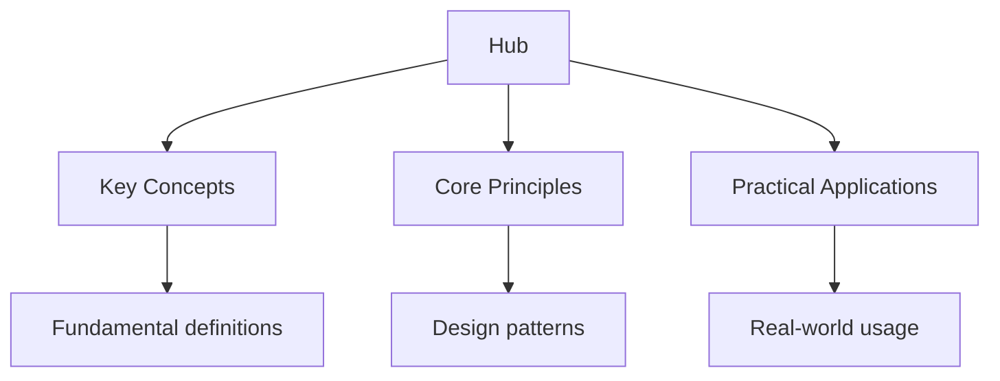

## Why This Guide Exists

Elixir is a functional language built on the Erlang VM (BEAM). It combines the simplicity of functional programming with the concurrency, fault tolerance, and distribution capabilities of Erlang. Elixir's process model makes concurrent programming straightforward — processes are lightweight, isolated, and communicate through message passing. The Phoenix framework provides a productive web development experience with real-time capabilities out of the box.

This hub page maps every resource on this site. The learning path takes you from Elixir's core language features through OTP, Phoenix, and distributed systems, building a thorough understanding of how to build resilient, concurrent applications.

## Table of Contents

- [Language Fundamentals](#language-fundamentals)
- [Functional Programming](#functional-programming)
- [Processes and Concurrency](#processes-and-concurrency)
- [OTP](#otp)
- [Phoenix Framework](#phoenix-framework)
- [Testing](#testing)
- [Learning Path](#learning-path)
- [Cross-Site Resources](#cross-site-resources)
- [FAQ](#faq)

---

## Language Fundamentals

Elixir's fundamentals build on functional programming principles. Everything is an expression, pattern matching is pervasive, and immutable data is the default. Understanding these concepts is the foundation for all Elixir programming.

### Topic Notes

- [Basics](../../../../dart/src/content/docs/flashcards-dart-basics) — variables, atoms, tuples, lists, and maps
- [Pattern Matching](../../../../dart/src/content/docs/07-dart3-features/01-pattern-matching) — the match operator, pin operator, and destructuring
- [Functions](../../../../alevel/src/content/docs/maths/pure-mathematics/05-functions) — named functions, anonymous functions, guards, and clauses
- [Modules and Attributes](02-fundamentals/04-modules-and-attributes) — module definitions, module attributes, and documentation
- [Control Flow](../../../../kotlin/src/content/docs/basics/control-flow) — case, cond, with, and do blocks

### Key Concepts

**Pattern matching with `=`** — The match operator destructures data. `{a, b} = {1, 2}` binds `a` to 1 and `b` to 2. Pattern matching is used in function heads, case expressions, and with chains. It is the primary way to handle different data shapes.

**Atoms** are constants whose name is their value. `:ok`, `:error`, `:not_found` — atoms are lightweight and fast to compare. They are commonly used as tags, keys, and enum values.

**The `with` construct** chains operations that may fail. Each step is pattern-matched against the expected success case. If any step does not match, the non-matching value is returned. `with {:ok, data} <- fetch(url), {:ok, parsed} <- parse(data), do: {:ok, parsed}`.

---

## Functional Programming

Elixir is a functional language — functions are first-class citizens, data is immutable, and side effects are isolated. Understanding functional patterns is essential for writing idiomatic Elixir.

### Topic Notes

- [Higher-Order Functions](../../../../alevel/src/content/docs/maths/pure-mathematics/05-functions) — Enum.map, Enum.filter, Enum.reduce, and pipe operator
- [Pipelines](03-functional/02-pipelines) — the |> operator for chaining functions
- [Recursion](03-functional/03-recursion) — tail call optimization and recursive patterns
- [Protocols](../../../../languages/src/content/docs/python/08-advanced-topics/04-protocols-dunder-methods) — polymorphism through protocol dispatch

### Key Concepts

**The pipe operator `|>`** passes the result of the left expression as the first argument to the right function. `data |> fetch() |> parse() |> save()` reads top-to-bottom, left-to-right. Pipelines make Elixir code highly readable.

**Enum module** provides powerful functions for working with collections. `Enum.map`, `Enum.filter`, `Enum.reduce`, `Enum.flat_map`, and `Enum.group_by` cover most collection operations. The Stream module provides lazy evaluation for large datasets.

**Protocols** enable polymorphism through protocol dispatch. A protocol defines a set of functions. Types implement the protocol by providing implementations. Protocols dispatch on the type of the first argument at runtime.

---

## Processes and Concurrency

Elixir's process model is its most distinctive feature. Processes are lightweight (a few KB), isolated (no shared memory), and managed by the BEAM VM. Communication between processes uses message passing. This model eliminates data races and makes concurrent programming straightforward.

### Topic Notes

- [Process Basics](04-processes/01-process-basics) — spawn, send, receive, and process IDs
- [GenServer](04-processes/02-genserver) — the generic server behaviour for stateful processes
- [Agent and Task](04-processes/03-agent-and-task) — simple state management and concurrent tasks
- [Supervisors](04-processes/04-supervisors) — monitoring, restarting, and fault tolerance
- [Process Communication](04-processes/05-process-communication) — message passing, selective receive, and timeouts

### Key Concepts

**Processes** are not OS threads. The BEAM VM manages thousands of processes on a single OS thread, switching between them in microseconds. Each process has its own heap and stack. Processes are cheap to create and destroy.

**GenServer** is the most commonly used OTP behaviour. It provides a synchronous request-response pattern with state. `handle_call` handles synchronous requests. `handle_cast` handles asynchronous messages. `handle_info` handles everything else.

**Supervisors** monitor processes and restart them when they crash. A supervisor defines a strategy: `:one_for_one` restarts only the failed child, `:one_for_all` restarts all children. Supervisors form a tree that provides fault tolerance.

---

## OTP

OTP (Open Telecom Platform) is a set of libraries and behaviours for building fault-tolerant applications. OTP provides GenServer, Supervisor, Application, and other behaviours that standardize common patterns.

### Topic Notes

- [OTP Overview](05-otp/01-otp-overview) — what OTP provides and why it matters
- [Application](../../../../computer-science/src/content/docs/3-computer-networks/6_application-layer) — application lifecycle, configuration, and the supervision tree
- [GenStateMachine](05-otp/03-gen-state-machine) — state machines with OTP
- [ETS and Mnesia](05-otp/04-ets-and-mnesia) — in-memory storage and distributed database

### Key Concepts

**OTP applications** are the unit of deployment. An application module defines `start/2` and `stop/1`. The application starts a supervision tree that manages all processes. Configuration is stored in `config/config.exs`.

**The supervision tree** is a hierarchy of supervisors and workers. If a worker crashes, its supervisor restarts it. If a supervisor crashes, its parent supervisor restarts it. This "let it crash" philosophy makes systems self-healing.

**ETS (Erlang Term Storage)** is an in-memory key-value store. It is fast, supports concurrent access, and can be shared between processes. ETS is used for caching, configuration, and temporary data storage.

---

## Phoenix Framework

Phoenix is Elixir's web framework. It follows the MVC pattern, provides real-time capabilities with Channels, and includes tools for database access (Ecto), testing, and deployment. Phoenix is designed for concurrency and fault tolerance.

### Topic Notes

- [Phoenix Basics](06-phoenix/01-phoenix-basics) — router, controllers, views, and templates
- [Ecto and Changesets](06-phoenix/02-ecto-and-changesets) — database access, schemas, and data validation
- [Channels](../../../../go/src/content/docs/concurrency/channels) — WebSocket connections, real-time updates, and presence
- [LiveView](06-phoenix/04-liveview) — server-rendered real-time UI without JavaScript
- [Testing](../../../../alevel/src/content/docs/computer-science/software-engineering/02-testing) — controller tests, channel tests, and LiveView tests

### Key Concepts

**Ecto** is Phoenix's database layer. Schemas map database tables to Elixir structs. Changesets validate and cast input data. Queries are composable and compile-time checked. Ecto supports PostgreSQL, MySQL, and other databases.

**Channels** provide real-time WebSocket communication. A channel handles events from connected clients. Topics group connections. Presence tracks who is online. Channels are lightweight and fault-tolerant.

**LiveView** enables real-time, server-rendered UIs without writing JavaScript. LiveViews handle events on the server and push updates to the client over WebSocket. This eliminates the client-server divide and simplifies real-time features.

---

## Testing

Elixir has excellent testing support built into the language. ExUnit is the standard test framework. It provides describe/it blocks, fixtures, async tests, and property-based testing with StreamData.

### Topic Notes

- [ExUnit Basics](07-testing/01-exunit-basics) — test modules, assertions, and test helpers
- [Fixtures and Setup](07-testing/02-fixtures-and-setup) — ExUnit.Case, setup blocks, and shared fixtures
- [Mocking and Stubs](07-testing/03-mocking-and-stubs) — Mox and behaviour-based mocking
- [Property-Based Testing](../../../../alevel/src/content/docs/computer-science/software-engineering/02-testing) — StreamData and generative testing

### Key Concepts

**ExUnit** uses the `test` macro and `assert`/`refute` for assertions. Tests are organized in modules with `use ExUnit.Case`. The `describe` block groups related tests. Tests can run asynchronously with `async: true`.

**Mox** is the standard mocking library. It defines behaviours that test doubles implement. Mox ensures test isolation by verifying that mocks are defined before tests run. It avoids the pitfalls of traditional mocking.

**Fixtures** provide test data. ExUnit supports setup blocks that create fixtures and inject them into tests. The `let` pattern from other frameworks is replaced by `setup` blocks and module attributes.

---

## Learning Path

Elixir's learning curve is moderate. The functional paradigm is approachable, and OTP provides structure. Follow this progression.

### Stage 1: Elixir Foundations (Weeks 1–3)

- Learn variables, pattern matching, and functions
- Understand modules, attributes, and documentation
- Write small programs using recursion and Enum

### Stage 2: Processes and OTP (Weeks 4–7)

- Learn process basics — spawn, send, receive
- Master GenServer and the supervision tree
- Study OTP Application and fault tolerance

### Stage 3: Phoenix (Weeks 8–12)

- Build web applications with Phoenix router and controllers
- Learn Ecto for database access and changesets
- Study Channels and LiveView for real-time features

### Stage 4: Advanced (Weeks 13–16)

- Study distributed Elixir and clustering
- Learn testing with Mox and property-based testing
- Build a production-ready application with supervision trees

---

## Cross-Site Resources

Wyatt's Notes is a network of interconnected programming and study sites:

- **[Go Programming Guide](https://go.wyattau.com/hub)** — Go and Elixir both excel at concurrent systems with different approaches
- **[Ruby Programming Guide](https://ruby.wyattau.com/hub)** — Elixir's syntax is influenced by Ruby
- **[Haskell Programming Guide](https://haskell.wyattau.com/hub)** — Elixir borrows functional concepts from Haskell
- **[Computer Science Study Guide](https://computer-science.wyattau.com/hub)** — algorithms and data structures that apply to Elixir
- **[Database Design Guide](https://databases.wyattau.com/hub)** — relevant for Ecto and database design
- **[Networking Guide](https://networking.wyattau.com/hub)** — relevant for distributed Elixir systems

---

## Frequently Asked Questions

### Should I learn Elixir or Ruby first?

If your goal is web development, learn Ruby first — it is more widely used and has a larger ecosystem. If your goal is concurrent, fault-tolerant systems, learn Elixir — its process model and OTP are unmatched. Elixir's syntax is Ruby-inspired, so learning Ruby first makes Elixir easier.

### What is the difference between Elixir and Erlang?

Elixir runs on the Erlang VM (BEAM) and can use any Erlang library. Elixir provides a more modern syntax, better tooling (Mix, Hex), and a more productive developer experience. Erlang is more established in telecom and mission-critical systems. Choose Elixir for new projects.

### What is "let it crash"?

"Let it crash" is the OTP philosophy of fault tolerance. Instead of defensively checking for every possible error, you write code that handles the happy path and lets unexpected errors crash the process. A supervisor detects the crash and restarts the process with a clean state. This makes systems self-healing.

### Is Elixir good for CPU-bound work?

The BEAM VM is optimized for I/O-bound and concurrent work, not CPU-bound computation. If you need heavy computation, use a NIF (Native Implemented Function) in C or Rust, or delegate to a specialized service. Elixir excels at handling many concurrent connections, not heavy computation.

### What is LiveView and when should I use it?

LiveView renders HTML on the server and pushes updates over WebSocket. It eliminates the need for a JavaScript framework for most real-time features. Use LiveView for dashboards, real-time feeds, and interactive forms. For complex client-side interactions, you may still need JavaScript.

### How do I deploy a Phoenix application?

Use Mix releases for deployment. `mix release` builds a self-contained release with the Erlang VM. Deploy to servers, containers (Docker), or platforms like Gigalixir, Fly.io, and Render. For production, configure Ecto, error tracking (Sentry), and monitoring.

---

*Last updated: 24 July 2026*

*Written by Wyatt. For questions or feedback, visit [wyattau.com](https://wyattau.com).*
