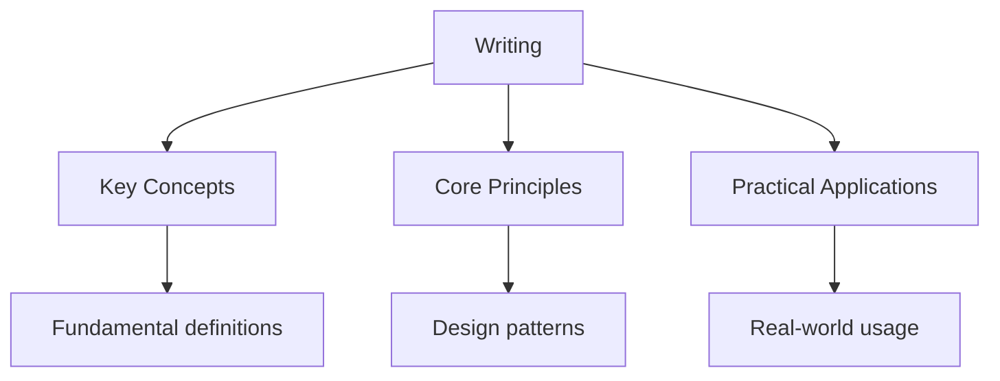

---

date: 2026-07-23T21:57:32+01:00
title: "Writing | Gaokao - Wyatt's Notes"
description: "\"itemListElement\": [{\"name\": \"Home\", \"url\": \"https://wyattau.com\"}, {\"name\": \"gaokao\", \"url\": \"https://gaokao.wyattau.com\"}, {\"name\": \"Chinese\", \"url\":"
---

<!-- Breadcrumb Schema for SEO -->
<script type="application/ld+json">
{
  "@context": "https://schema.org",
  "@type": "BreadcrumbList",
  "itemListElement": [{"name": "Home", "url": "https://wyattau.com"}, {"name": "gaokao", "url": "https://gaokao.wyattau.com"}, {"name": "Chinese", "url": "https://gaokao.wyattau.com/chinese"}, {"name": "Writing", "url": "https://gaokao.wyattau.com/chinese/writing"}]
}
</script>

## Writing

高考 chinese 学习笔记 - Writing

## 核心概念

### 作文评分标准

**基础等级：**

- 内容（20分）：切合题意、中心突出、内容充实、感情真挚
- 表达（20分）：结构严谨、语言流畅、字迹工整

**发展等级：**

- 深刻（透过现象深入本质、揭示因果关系）
- 丰富（材料丰富、形象丰满、意境深远）
- 有文采（词语生动、句式灵活、善用修辞）
- 有创新（见解新颖、构思精巧、有个性特征）

### 审题立意

**材料作文审题步骤：**

1. 通读材料，把握整体内容
2. 抓住关键句，确定核心话题
3. 多角度思考，寻找最佳立意
4. 联系现实，深化主题

**常见审题方法：**

- 抓关键词法
- 由果溯因法
- 多角度立意法
- 化虚为实法

### 文章结构

**议论文结构：**

- 总分总结构
- 并列式结构
- 递进式结构
- 对照式结构

**开头方法：**

- 开门见山法
- 引用名言法
- 设问引入法
- 故事引入法

**结尾方法：**

- 首尾呼应法
- 总结全文法
- 升华主题法
- 展望未来法

## 典型例题

### 例题1：材料作文审题

**题目：** 阅读下面的材料，根据要求写作。

"一只蜗牛想要去看外面的世界，但它知道自己爬得很慢。于是它给自己定了一个目标：先爬上山顶，再走遍世界。然而，它还没有出发就开始担心自己爬不到山顶，于是犹豫了很久。最后，它既没有爬上山顶，也没有走遍世界。"

要求：选好角度，确定立意，明确文体，自拟标题。

**解答：**

步骤1：分析材料核心：蜗牛因犹豫不决而一事无成

步骤2：多角度立意：

- 立意一：行动比犹豫更重要
- 立意二：不要被困难吓倒
- 立意三：与其空想不如脚踏实地

步骤3：选择最佳立意：行动比犹豫更重要

步骤4：拟标题：《与其犹豫，不如前行》

**答案：** 立意为"行动比犹豫更重要"，标题《与其犹豫，不如前行》

### 例题2：议论文开头

**题目：** 以"坚持"为话题，写一个议论文的开头段（150字左右）。

**解答：**

示范开头：

"水滴石穿，非一日之功；冰冻三尺，非一日之寒。古往今来，凡成大事者，无不具有坚持的品质。司马迁忍辱负重，历时十余年写成《史记》；李时珍跋山涉水，花费二十七年编著《本草纲目》。坚持，是通往成功的桥梁，是实现梦想的基石。"

**答案：** 见示范开头

### 例题3：作文提纲

**题目：** 以"科技与生活"为题，列一个议论文提纲。

**解答：**

```
一、开头：引出话题——科技深刻改变了我们的生活

二、本论：
  （一）科技便利了日常生活
    例证：移动支付、网购、共享单车
  （二）科技促进了信息传播
    例证：互联网、社交媒体、在线教育
  （三）科技也带来了挑战
    例证：隐私泄露、网络沉迷、信息茧房

三、结尾：
  正确看待科技，趋利避害，让科技更好地服务生活
```

**答案：** 见提纲

## 考试技巧

1. 审题时要抓住材料的核心矛盾，不要偏离题意
2. 议论文要观点明确，论据充分，论证有力
3. 记叙文要有真情实感，避免空洞抒情
4. 字迹工整、卷面整洁可以提高印象分
5. 作文时间一般控制在50分钟左右

### 例题4：议论文结尾

**题目：** 以"创新"为主题，写一个议论文的结尾段（100字左右）。

**解答：**

示范结尾：

"创新是民族进步的灵魂，是国家兴旺发达的不竭动力。从古代的四大发明到现代的5G技术，中华民族从来就不缺少创新的基因。在新时代的征程上，我们更应勇于突破、敢于尝试，以创新之火点燃民族复兴的伟大梦想。"

**答案：** 见示范结尾

### 例题5：材料作文审题——多角度立意

**题目：** 阅读下面的材料，根据要求写作。

"一滴水只有放进大海里才永远不会干涸，一个人只有当他把自己和集体事业融合在一起的时候才能最有力量。"

要求：选好角度，确定立意，明确文体，自拟标题。

**解答：**

步骤1：分析材料核心：个人与集体的关系，强调团结合作的重要性

步骤2：多角度立意：

- 立意一：团结就是力量
- 立意二：个人价值在集体中实现
- 立意三：合作才能共赢

步骤3：选择最佳立意：个人价值在集体中实现

步骤4：拟标题：《融于集体，成就自我》

**答案：** 立意为"个人价值在集体中实现"，标题《融于集体，成就自我》

**常见错误：** 偏离材料核心，只写"团结"而忽略"个人与集体的关系"。审题时要抓住材料的关键词和核心矛盾。

### 例题6：记叙文写作

**题目：** 以"那一刻，我长大了"为题，写一篇记叙文（不少于800字）。

**解答：**

写作提纲：

```
一、开头：设置情境，引出"长大"的主题
   示例：冬日清晨，母亲在寒风中等我放学

二、主体：
  （一）事件起因：与母亲发生矛盾，认为她不理解我
  （二）事件经过：看到母亲在风中等待的身影，内心触动
  （三）事件高潮：接过母亲手中的热牛奶，泪水夺眶而出

三、结尾：
  升华主题——长大不是年龄的增长，而是懂得感恩和承担责任
```

**答案：** 见写作提纲

**常见错误：** 记叙文容易写成流水账。要注意细节描写、心理描写和环境描写，使文章生动感人。

## 考试技巧

1. 审题时要抓住材料的核心矛盾，不要偏离题意
2. 议论文要观点明确，论据充分，论证有力
3. 记叙文要有真情实感，避免空洞抒情
4. 字迹工整、卷面整洁可以提高印象分
5. 作文时间一般控制在50分钟左右

## 练习题

1. 以"读书的意义"为话题，写一个议论文开头
2. 为"诚信"主题的作文列一个提纲
3. 改写一段平铺直叙的文字，使之更有文采

## 更多典型例题

### 例题7：材料作文审题——寓意类

**题目：** 阅读下面的材料，根据要求写作。

"有一种竹子，前四年只长了3厘米，但从第五年开始，它每天以30厘米的速度疯长，仅用六周就长到了15米。其实，在前面的四年里，竹子将根在土壤里延伸了数百平米。"

要求：选好角度，确定立意，明确文体，自拟标题。

**解答：**

步骤1：分析材料核心——竹子前四年看似没有成长，实际上在扎根；第五年快速生长，是前四年积累的结果。

步骤2：多角度立意：

- 立意一：厚积薄发——成功需要长期的积累和沉淀
- 立意二：不要急于求成——成长需要过程，不能急功近利
- 立意三：扎根与成长——根基扎实才能走得更远

步骤3：选择最佳立意：厚积薄发。

步骤4：拟标题：《扎根与成长》

**答案：** 立意为"厚积薄发"，标题《扎根与成长》

**常见错误：** 只写"坚持"而忽略"积累"的内涵。材料强调的是前期的扎根和积累，而非简单的坚持。

### 例题8：议论文段落展开

**题目：** 以"细节决定成败"为论点，写一个论证段落（150字左右）。

**解答：**

示范段落：

"细节决定成败，古今中外概莫能外。海尔集团创始人张瑞敏曾说过：'把每一件简单的事做好就是不简单，把每一件平凡的事做好就是不平凡。'当年海尔在创业初期，张瑞敏亲自砸毁了76台有瑕疵的冰箱，正是这种对细节的极致追求，使海尔从一个濒临倒闭的小厂发展成为全球家电巨头。反观那些忽视细节的企业，往往因一个微小的失误而满盘皆输。由此可见，成大事者必注重细节，细节之处见精神，细节之中显成败。"

**考试技巧：** 议论文段落的基本结构：论点→论据（事例或道理）→分析→结论。注意论据要典型，分析要深入，不能只罗列事例。

### 例题9：记叙文——细节描写

**题目：** 以"温暖"为题，写一个细节描写的片段（200字左右）。

**解答：**

示范片段：

"冬天的夜晚，风呼啸着拍打窗户。我裹紧棉衣，缩着脖子走进家门。母亲正在厨房忙碌，听到动静，她快步迎了出来。'冻坏了吧？'她一边说着，一边用温热的手握住我冰凉的手指。我感觉到她掌心的温度一点一点传递过来，指尖渐渐恢复了知觉。她转身端来一碗热气腾腾的姜汤，碗边还冒着白雾。'快喝，趁热。'我捧起碗，姜汤的辛辣和温暖一同涌入喉咙，一直暖到心底。"

**考试技巧：** 细节描写要调动多种感官（视觉、听觉、触觉、嗅觉），通过具体的动作、语言、神态来表现人物情感，避免空洞的抒情。

### 例题10：材料作文审题——寓意类

**题目：** 阅读下面的材料，根据要求写作。

"一只蜗牛想要去看外面的世界，但它知道自己爬得很慢。于是它给自己定了一个目标：先爬上山顶，再走遍世界。然而，它还没有出发就开始担心自己爬不到山顶，于是犹豫了很久。最后，它既没有爬上山顶，也没有走遍世界。"

要求：选好角度，确定立意，明确文体，自拟标题。

**解答：**

步骤1：分析材料核心：蜗牛因犹豫不决而一事无成

步骤2：多角度立意：

- 立意一：行动比犹豫更重要
- 立意二：不要被困难吓倒
- 立意三：与其空想不如脚踏实地

步骤3：选择最佳立意：行动比犹豫更重要

步骤4：拟标题：《与其犹豫，不如前行》

**答案：** 立意为"行动比犹豫更重要"，标题《与其犹豫，不如前行》

**常见错误：** 偏离材料核心，只写"团结"而忽略"个人与集体的关系"。审题时要抓住材料的关键词和核心矛盾。

### 例题11：议论文段落展开

**题目：** 以"细节决定成败"为论点，写一个论证段落（150字左右）。

**解答：**

示范段落：

"细节决定成败，古今中外概莫能外。海尔集团创始人张瑞敏曾说过：'把每一件简单的事做好就是不简单，把每一件平凡的事做好就是不平凡。'当年海尔在创业初期，张瑞敏亲自砸毁了76台有瑕疵的冰箱，正是这种对细节的极致追求，使海尔从一个濒临倒闭的小厂发展成为全球家电巨头。反观那些忽视细节的企业，往往因一个微小的失误而满盘皆输。由此可见，成大事者必注重细节，细节之处见精神，细节之中显成败。"

**考试技巧：** 议论文段落的基本结构：论点→论据（事例或道理）→分析→结论。注意论据要典型，分析要深入，不能只罗列事例。

### 例题12：记叙文写作

**题目：** 以"那一刻，我长大了"为题，写一篇记叙文（不少于800字）。

**解答：**

写作提纲：

```
一、开头：设置情境，引出"长大"的主题
   示例：冬日清晨，母亲在寒风中等我放学

二、主体：
  （一）事件起因：与母亲发生矛盾，认为她不理解我
  （二）事件经过：看到母亲在风中等待的身影，内心触动
  （三）事件高潮：接过母亲手中的热牛奶，泪水夺眶而出

三、结尾：
  升华主题——长大不是年龄的增长，而是懂得感恩和承担责任
```

**答案：** 见写作提纲

**常见错误：** 记叙文容易写成流水账。要注意细节描写、心理描写和环境描写，使文章生动感人。




## Intuition

Writing an essay is like building a bridge. The introduction is the foundation that must be solid and well-placed. Each paragraph is a support beam that must connect logically to the next. The conclusion is the capstone that ties everything together. If any beam is weak or poorly placed, the entire structure collapses.

Argumentation is like a debate. You must present your position evidently, anticipate counterarguments, and respond to them with evidence. A strong essay does not just state opinions; it defends them with logic and examples, just as a skilled debater uses facts and reasoning to persuade.

## Common Mistakes

### Mistake 1: Drifting from the core theme of the material in作文

In material-based essays, students often seize on a secondary detail and write an essay that偏离 the material's central message. For example, a material about a snail that never acted because it worried about failure should be addressed with a theme like "action over hesitation," not directly "bravery." Always identify the core矛盾 (contradiction) in the material before choosing your立意.

### Mistake 2: Writing a记叙文 that reads like a流水账

Narrative essays that directly recount events in chronological order without detail描写, psychological描写, or environmental描写 score poorly. The examiners look for vivid sensory details, internal monologue, and meaningful dialogue. Instead of writing "I was moved," show the character's reaction through actions, thoughts, and surrounding atmosphere.

### Mistake 3: Using examples that are irrelevant or poorly explained

In议论文, students sometimes cite famous figures or events without explaining how they support the argument. An example without analysis is just a name-drop. Each piece of evidence should be followed by a sentence that explicitly connects it to your论点 (thesis). Ask yourself: "How does this example prove my point?"

## Cross-References

- [Chinese Reading](reading) - Reading analysis skills that inform effective essay structure and argumentation
- [English Writing](writing) - Cross-language writing techniques for narrative and argumentative essays
- [Algebra](../../../../../sat/src/content/docs/mathematics/algebra) - Logical structuring skills that apply to essay organization and argumentation
