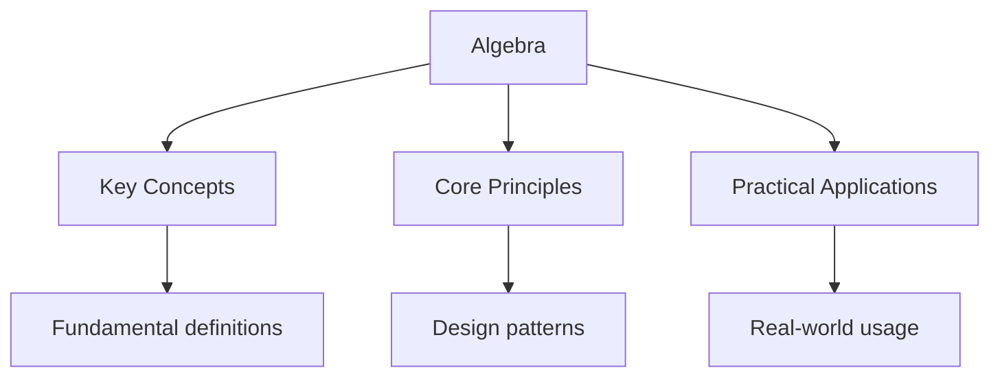

---

date: 2026-07-23T21:57:32+01:00
title: "Algebra | Gaokao - Wyatt's Notes"
description: "Study notes for Algebra with worked examples, practice problems, and key concepts for exam preparation."
---

<!-- Breadcrumb Schema for SEO -->

## Algebra

高考 mathematics 学习笔记 - Algebra

## 核心概念

### 一元二次方程

一元二次方程的标准形式为 $ax^2 + bx + c = 0$（$a \neq 0$），其解法包括：

**求根公式：**
$$x = \frac{-b \pm \sqrt{b^2 - 4ac}}{2a}$$

**判别式 $\Delta = b^2 - 4ac$：**

- $\Delta > 0$：两个不相等的实数根
- $\Delta = 0$：两个相等的实数根（重根）
- $\Delta < 0$：无实数根（两个共轭复数根）

**韦达定理：** 若 $x_1, x_2$ 是方程的两个根，则：
$$x_1 + x_2 = -\frac{b}{a}, \quad x_1 \cdot x_2 = \frac{c}{a}$$

### 集合与逻辑

集合的三种表示方法：列举法、描述法、图示法（Venn图）。

**集合运算：**

- 交集：$A \cap B = \{x \mid x \in A \text{ 且 } x \in B\}$
- 并集：$A \cup B = \{x \mid x \in A \text{ 或 } x \in B\}$
- 补集：$\complement_U A = \{x \mid x \in U \text{ 且 } x \notin A\}$

**德摩根定律：**
$$\complement_U(A \cap B) = (\complement_U A) \cup (\complement_U B)$$
$$\complement_U(A \cup B) = (\complement_U A) \cap (\complement_U B)$$

### 不等式

**均值不等式：** 对于正数 $a, b$：
$$\frac{a + b}{2} \geq \sqrt{ab}$$
等号成立当且仅当 $a = b$。

**柯西不等式（二维形式）：**
$$(a^2 + b^2)(c^2 + d^2) \geq (ac + bd)^2$$

### 等差数列与等比数列

**等差数列：** $a_n = a_1 + (n-1)d$，前 $n$ 项和 $S_n = \frac{n(a_1 + a_n)}{2}$

**等比数列：** $a_n = a_1 \cdot q^{n-1}$，前 $n$ 项和 $S_n = \frac{a_1(1 - q^n)}{1 - q}$（$q \neq 1$）

## 典型例题

### 例题1：一元二次方程

**题目：** 已知方程 $x^2 - 5x + 6 = 0$ 的两个根为 $x_1$ 和 $x_2$，求 $x_1^2 + x_2^2$ 的值。

**解答：**

步骤1：识别系数 $a = 1, b = -5, c = 6$

步骤2：由韦达定理：
$$x_1 + x_2 = 5, \quad x_1 \cdot x_2 = 6$$

步骤3：利用恒等变换：
$$x_1^2 + x_2^2 = (x_1 + x_2)^2 - 2x_1 x_2 = 25 - 12 = 13$$

**答案：** $x_1^2 + x_2^2 = 13$

### 例题2：等差数列

**题目：** 在等差数列 $\{a_n\}$ 中，$a_3 = 7, a_7 = 19$，求 $a_{10}$。

**解答：**

步骤1：由等差数列通项公式建立方程组：
$$\begin{cases} a_1 + 2d = 7 \\ a_1 + 6d = 19 \end{cases}$$

步骤2：两式相减得 $4d = 12$，故 $d = 3$

步骤3：代入得 $a_1 = 1$，因此：
$$a_{10} = a_1 + 9d = 1 + 27 = 28$$

**答案：** $a_{10} = 28$

### 例题3：集合运算

**题目：** 已知全集 $U = \mathbb{R}$，集合 $A = \{x \mid x^2 - 3x + 2 \leq 0\}$，$B = \{x \mid x > 1\}$，求 $A \cap (\complement_U B)$。

**解答：**

步骤1：解不等式 $x^2 - 3x + 2 \leq 0$，得 $A = [1, 2]$

步骤2：$\complement_U B = \{x \mid x \leq 1\} = (-\infty, 1]$

步骤3：$A \cap (\complement_U B) = [1, 2] \cap (-\infty, 1] = \{1\}$

**答案：** $A \cap (\complement_U B) = \{1\}$

## 考试技巧

1. 涉及一元二次方程时，优先考虑韦达定理而非直接求根
2. 等差数列求和公式 $S_n = na_1 + \frac{n(n-1)}{2}d$ 在 $d$ 已知时更方便
3. 集合问题注意端点是否包含（开区间与闭区间）
4. 不等式证明中，均值不等式的使用前提是各变量为正数

## 练习题

1. 解方程 $2x^2 - 7x + 3 = 0$，并验证韦达定理
2. 等差数列 $\{a_n\}$ 中，$S_{10} = 100$，求 $a_1 + a_{10}$
3. 已知 $A = \{1, 2, 3, 4\}$，$B = \{2, 4, 6, 8\}$，求 $A \cup B$ 和 $A \cap B$

### 例题4：等比数列

**题目：** 在等比数列 $\{a_n\}$ 中，$a_1 = 2$，公比 $q = 3$，求前 $5$ 项和 $S_5$。

**解答：**

步骤1：由等比数列求和公式：
$$S_n = \frac{a_1(1 - q^n)}{1 - q}$$

步骤2：代入数据：
$$S_5 = \frac{2(1 - 3^5)}{1 - 3} = \frac{2(1 - 243)}{-2} = \frac{2 \times (-242)}{-2} = 242$$

**答案：** $S_5 = 242$

### 例题5：均值不等式应用

**题目：** 已知 $x > 0$，求 $f(x) = x + \dfrac{1}{x}$ 的最小值。

**解答：**

步骤1：由均值不等式，对正数 $a, b$：
$$\frac{a + b}{2} \geq \sqrt{ab}$$

步骤2：令 $a = x$，$b = \frac{1}{x}$：
$$\frac{x + \frac{1}{x}}{2} \geq \sqrt{x \cdot \frac{1}{x}} = 1$$

步骤3：因此 $x + \frac{1}{x} \geq 2$，等号成立当且仅当 $x = \frac{1}{x}$，即 $x = 1$。

**答案：** 最小值为 $2$，当 $x = 1$ 时取得

### 例题6：韦达定理的综合应用

**题目：** 已知方程 $x^2 - 3x + m = 0$ 的两根之比为 $1:2$，求 $m$ 的值。

**解答：**

步骤1：设两根为 $x_1 = a$，$x_2 = 2a$。

步骤2：由韦达定理：
$$x_1 + x_2 = 3a = 3 \implies a = 1$$
$$x_1 \cdot x_2 = 2a^2 = m \implies m = 2$$

步骤3：验证判别式 $\Delta = 9 - 8 = 1 > 0$，方程有两个不相等的实数根。

**答案：** $m = 2$

## 深入理解

### 一元二次方程的根的分布

对于方程 $ax^2 + bx + c = 0$（$a > 0$），判别式 $\Delta = b^2 - 4ac$ 决定了根的情况。但在高考中，经常考查根的分布问题，即讨论根在某个区间内的条件。

**两根都大于 $k$ 的条件：**
$$\Delta \geq 0, \quad -\frac{b}{2a} > k, \quad f(k) > 0$$

**两根都小于 $k$ 的条件：**
$$\Delta \geq 0, \quad -\frac{b}{2a} < k, \quad f(k) > 0$$

**一根大于 $k$，一根小于 $k$ 的条件：**
$$f(k) < 0$$

### 数列的综合应用

等差数列和等比数列的综合问题通常涉及：

- 利用通项公式建立方程组
- 利用求和公式计算部分和
- 判断数列的单调性和有界性
- 与不等式结合的最值问题

**关键公式：**

- 等差数列：$a_n = a_1 + (n-1)d$，$S_n = \frac{n(a_1 + a_n)}{2} = na_1 + \frac{n(n-1)}{2}d$
- 等比数列：$a_n = a_1 q^{n-1}$，$S_n = \frac{a_1(1-q^n)}{1-q}$（$q \neq 1$）

## 更多典型例题

### 例题7：一元二次方程根的判别

**题目：** 若方程 $x^2 + 2mx + m + 2 = 0$ 有两个不相等的实数根，求 $m$ 的取值范围。

**解答：**

步骤1：由题意，方程有两个不相等的实数根，故判别式 $\Delta > 0$。

步骤2：计算判别式：
$$\Delta = (2m)^2 - 4(m + 2) = 4m^2 - 4m - 8$$

步骤3：令 $\Delta > 0$：
$$4m^2 - 4m - 8 > 0$$
$$m^2 - m - 2 > 0$$
$$(m - 2)(m + 1) > 0$$

步骤4：解不等式得 $m < -1$ 或 $m > 2$。

**答案：** $m$ 的取值范围为 $(-\infty, -1) \cup (2, +\infty)$

**常见错误：** 忘记二次项系数 $a \neq 0$ 的条件。本题 $a = 1$，始终满足。

### 例题8：等差数列求和的综合应用

**题目：** 在等差数列 $\{a_n\}$ 中，已知 $S_{10} = 100$，$S_{20} = 400$，求 $S_{30}$。

**解答：**

步骤1：由等差数列求和公式 $S_n = na_1 + \frac{n(n-1)}{2}d$，列出方程组：
$$\begin{cases} 10a_1 + 45d = 100 \\ 20a_1 + 190d = 400 \end{cases}$$

步骤2：化简：
$$\begin{cases} a_1 + 4.5d = 10 \\ a_1 + 9.5d = 20 \end{cases}$$

步骤3：两式相减得 $5d = 10$，故 $d = 2$，$a_1 = 1$。

步骤4：计算 $S_{30}$：
$$S_{30} = 30 \times 1 + \frac{30 \times 29}{2} \times 2 = 30 + 870 = 900$$

**答案：** $S_{30} = 900$

**考试技巧：** 等差数列中，$S_n$、$S_{2n} - S_n$、$S_{3n} - S_{2n}$ 也构成等差数列。利用此性质可快速验证：$100$、$300$、$500$ 成等差，故 $S_{30} = 100 + 300 + 500 = 900$。

### 例题9：集合与不等式的综合

**题目：** 已知集合 $A = \{x \mid x^2 - 2x - 3 < 0\}$，$B = \{x \mid x > a\}$。若 $A \subseteq B$，求实数 $a$ 的取值范围。

**解答：**

步骤1：解不等式 $x^2 - 2x - 3 < 0$：
$$(x - 3)(x + 1) < 0$$
$$A = (-1, 3)$$

步骤2：由 $A \subseteq B$，即 $(-1, 3) \subseteq (a, +\infty)$。

步骤3：要使 $A$ 中所有元素都大于 $a$，需 $a \leq -1$。

步骤4：当 $a = -1$ 时，$B = (-1, +\infty)$，$A = (-1, 3) \subseteq B$ 成立。

**答案：** $a \leq -1$，即 $a \in (-\infty, -1]$

**常见错误：** 注意端点是否可以取等号。若 $a = -1$，$A = (-1, 3)$ 中的元素都大于 $-1$，故 $a = -1$ 可以取到。

### 例题10：一元二次方程根的分布

**题目：** 若方程 $x^2 + 2mx + m + 2 = 0$ 的两个实数根都大于 $1$，求 $m$ 的取值范围。

**解答：**

步骤1：设 $f(x) = x^2 + 2mx + m + 2$，方程有两个实数根都大于 $1$ 的条件为：

$$\begin{cases}
\Delta \geq 0 \\
-\dfrac{b}{2a} > 1 \\
f(1) > 0
\end{cases}$$

步骤2：计算各条件：
- $\Delta = 4m^2 - 4(m + 2) = 4m^2 - 4m - 8 \geq 0$，即 $m^2 - m - 2 \geq 0$，$(m - 2)(m + 1) \geq 0$，得 $m \leq -1$ 或 $m \geq 2$
- $-\dfrac{2m}{2} > 1$，即 $-m > 1$，得 $m < -1$
- $f(1) = 1 + 2m + m + 2 = 3m + 3 > 0$，得 $m > -1$

步骤3：取交集：$m < -1$ 且 $m > -1$ 且 ($m \leq -1$ 或 $m \geq 2$)

步骤4：无解。实际上，当 $m = -1$ 时，$f(1) = 0$，不满足 $f(1) > 0$。

**答案：** 不存在满足条件的 $m$ 值

**考试技巧：** 根的分布问题需要同时考虑判别式、对称轴位置和端点函数值，三者缺一不可。

### 例题11：等差数列与不等式

**题目：** 在等差数列 $\{a_n\}$ 中，$a_1 > 0$，$S_9 = S_{17}$，求使 $S_n$ 最大的 $n$ 值。

**解答：**

步骤1：由 $S_9 = S_{17}$，利用求和公式：
$$9a_1 + \frac{9 \times 8}{2}d = 17a_1 + \frac{17 \times 16}{2}d$$
$$9a_1 + 36d = 17a_1 + 136d$$
$$-8a_1 = 100d \implies d = -\frac{2a_1}{25}$$

步骤2：由 $a_1 > 0$ 且 $d < 0$，数列递减。$S_n$ 最大时 $a_n \geq 0$ 且 $a_{n+1} \leq 0$。

步骤3：$a_n = a_1 + (n-1)d = a_1 - \frac{2a_1}{25}(n-1) = a_1\left(1 - \frac{2(n-1)}{25}\right)$

步骤4：令 $a_n \geq 0$：$1 - \frac{2(n-1)}{25} \geq 0 \implies n \leq 13.5$

步骤5：故 $n = 13$ 时 $a_{13} > 0$，$n = 14$ 时 $a_{14} < 0$，$S_{13}$ 最大。

**答案：** $n = 13$

**常见错误：** 当 $a_n = 0$ 时，$S_n = S_{n-1}$，两者都是最大值。本题中 $a_{13} > 0$，$a_{14} < 0$，故 $S_{13}$ 唯一最大。

### 例题12：集合与逻辑的综合

**题目：** 已知命题 $p$：$\forall x \in [1, 2]$，$x^2 - a \geq 0$；命题 $q$：$\exists x \in \mathbb{R}$，$x^2 + 2ax + 2 - a = 0$。若 $p \land q$ 为真命题，求实数 $a$ 的取值范围。

**解答：**

步骤1：命题 $p$ 为真：$\forall x \in [1, 2]$，$a \leq x^2$。$x^2$ 在 $[1, 2]$ 上的最小值为 $1$，故 $a \leq 1$。

步骤2：命题 $q$ 为真：方程 $x^2 + 2ax + 2 - a = 0$ 有实数根，故 $\Delta \geq 0$。

步骤3：计算判别式：$\Delta = 4a^2 - 4(2 - a) = 4a^2 + 4a - 8 \geq 0$，即 $a^2 + a - 2 \geq 0$，$(a + 2)(a - 1) \geq 0$，得 $a \leq -2$ 或 $a \geq 1$。

步骤4：$p \land q$ 为真，则 $p$ 与 $q$ 同时为真，取交集：
- $p$ 真：$a \leq 1$
- $q$ 真：$a \leq -2$ 或 $a \geq 1$

步骤5：交集为 $a \leq -2$ 或 $a = 1$。

**答案：** $a \in (-\infty, -2] \cup \{1\}$

**考试技巧：** "$\forall$"型命题转化为最值问题，"$\exists$"型命题转化为判别式问题。注意逻辑联结词"且"对应交集，"或"对应并集。

## Intuition

Algebra is like a balance scale. Whatever you do to one side, you must do to the other to keep it balanced. This is the fundamental principle behind solving equations: you are trying to isolate the variable on one side while keeping the scale balanced. Each operation you perform is like adding or removing weights from both sides.

Functions are like machines in a factory. You put raw materials in (input), the machine processes them according to a specific recipe (the function rule), and成品 comes out (output). Understanding the machine's recipe lets you predict what will come out for any input, and working backward from the output tells you what input was needed.

## Cross-References

- [Functions](../../../../../alevel/src/content/docs/maths/pure-mathematics/05-functions) - How algebraic manipulation underpins function analysis and equation solving
- [Geometry](../../../../../sat/src/content/docs/mathematics/geometry) - Coordinate geometry that connects algebraic and geometric reasoning
- [Chinese Reading](../chinese/reading) - Logical reasoning skills that support mathematical proof writing

## Common Mistakes

**Forgetting to check the discriminant before solving quadratics.** When using the quadratic formula, always compute Delta = b^2 - 4ac first. If Delta < 0, there are no real roots, and continuing with the formula gives complex numbers that may not be expected. This is especially important when the problem asks for real solutions only.

**Confusing the sum and product of roots.** Vieta's formulas state x1 + x2 = -b/a and x1 * x2 = c/a. Students often forget the negative sign in the sum formula or swap the two formulas. The sum is -b/a (note the negative), while the product is c/a (no negative sign).

**Forgetting to verify the endpoint in set operations.** When solving inequalities involving sets, always check whether endpoints should be included (closed interval) or excluded (open interval). Forgetting to test boundary values can lead to incorrect answers, especially when the inequality is non-strict (<= or >=).
