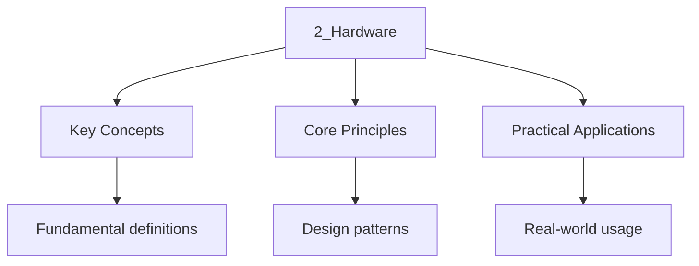

---

title: "Computer Systems | GCSE - Wyatt's Notes"
description: "The is the brain of the computer. It processes data and executes Instructions. Comprehensive educational content coverage with definitions and practice problems"
date: 2026-04-14
tags:
  - gcse
  - gcse-computer-science
categories:
  - gcse-computer-science

---

<!-- Breadcrumb Schema for SEO -->

## Computer Systems

> **Info:** Board Coverage AQA Paper 1 | Edexcel Paper 1 | OCR J277 Paper 1 | WJEC Unit 1
>
## 1. CPU Architecture

### 1.1 Components of the CPU

The **CPU (Central Processing Unit)** is the brain of the computer. It processes data and executes
Instructions.

| Component                   | Function                                                                           |
| --------------------------- | ---------------------------------------------------------------------------------- |
| Arithmetic Logic Unit (ALU) | Performs arithmetic (addition, subtraction) and logical (AND, OR, NOT) operations  |
| Control Unit (CU)           | Coordinates the activities of the CPU; fetches, decodes, and executes instructions |
| Cache                       | Small, fast memory inside the CPU that stores frequently used data                 |
| Registers                   | Small, fast storage locations within the CPU                                       |
| Buses                       | Pathways for data transfer between components                                      |

**The ALU in detail.** The ALU is the part of the CPU that performs actual computation. Given two
Binary inputs and an operation code (from the control unit), it produces a result and a set of
Status flags (zero, negative, carry, overflow). For example, given inputs 0110 and 0011 with an
"add" operation, the ALU outputs 1001 with a zero flag of 0 (result is non-zero).

**The Control Unit in detail.** The CU does not perform computation itself. Instead, it sends
Control signals to other components: it tells the memory which address to read or write, tells the
ALU which operation to perform, and tells the registers when to load or store values. It is the
Conductor of the CPU orchestra.

### 1.2 Registers

| Register                           | Function                                                                   |
| ---------------------------------- | -------------------------------------------------------------------------- |
| Program Counter (PC)               | Holds the memory address of the next instruction to be fetched             |
| Memory Address Register (MAR)      | Holds the address of the memory location to be read from or written to     |
| Memory Data Register (MDR)         | Holds the data that has been read from or is about to be written to memory |
| Accumulator (ACC)                  | Stores the results of calculations performed by the ALU                    |
| Current Instruction Register (CIR) | Holds the instruction currently being decoded and executed                 |

**Key distinction:** The PC holds an **address** (where to go next). The MAR also holds an
**address** (where to read/write data). The MDR holds the actual **data** (what was read or what
Will be written). The CIR holds the **instruction** (what to do).

### 1.3 The Fetch-Decode-Execute Cycle

The CPU continuously cycles through three stages:

**1. Fetch:**

- The address in the PC is copied to the MAR
- The instruction stored at that address is copied from memory to the MDR
- The PC is incremented (points to the next instruction)
- The instruction in the MDR is copied to the CIR

**2. Decode:**

- The control unit decodes the instruction in the CIR
- It determines what operation to perform and what data to use

**3. Execute:**

- The instruction is carried out (the ALU performs calculations, data is moved, etc.)
- The cycle repeats

**Detailed trace.** Suppose the PC contains address 100, and memory address 100 contains the
Instruction "ADD 5" (add 5 to the accumulator).

1. **Fetch:** MAR $\leftarrow$ 100 (copy PC to MAR). MDR $\leftarrow$ memory[100] (read instruction
   from address 100). PC $\leftarrow$ 101 (increment PC). CIR $\leftarrow$ "ADD 5" (copy MDR to
   CIR).
2. **Decode:** CU decodes "ADD 5" -- this means add the value 5 to the accumulator.
3. **Execute:** ACC $\leftarrow$ ACC + 5 (ALU performs the addition, result stored in accumulator).

**Worked Example.** Trace the fetch-decode-execute cycle for a subtract instruction when PC = 50 and
The instruction at address 50 is "SUB 3".

1. Fetch: MAR $\leftarrow$ 50. MDR $\leftarrow$ memory[50] ("SUB 3"). PC $\leftarrow$ 51. CIR
   $\leftarrow$ "SUB 3".
2. Decode: CU decodes "SUB 3" -- subtract the value 3 from the accumulator.
3. Execute: ACC $\leftarrow$ ACC - 3. If ACC was 10, it is now 7.

### 1.4 Von Neumann Architecture

The **Von Neumann architecture** is the standard model for most computers:

- Data and instructions are stored in the same memory
- Memory is accessed sequentially
- The CPU fetches, decodes, and executes instructions one at a time
- A single bus is used for data transfer

**The stored program concept.** Before Von Neumann, computers were rewired for each new program. Von
Neumann"s key insight was that programs and data could both be stored in the same memory, and the
CPU could read instructions from memory just as it reads data. This means you can change what a
Computer does by changing the contents of its memory -- no rewiring required.

**Von Neumann bottleneck.** Because instructions and data share the same bus, the CPU cannot fetch
An instruction and read/write data simultaneously. This limits performance. Modern processors
Mitigate this with caches, pipelines, and Harvard-architecture elements within the CPU.

**Von Neumann vs Harvard comparison:**

| Feature     | Von Neumann                       | Harvard                                       |
| ----------- | --------------------------------- | --------------------------------------------- |
| Memory      | Shared for data and instructions  | Separate data and instruction memory          |
| Bus         | Single bus                        | Separate buses                                |
| Simplicity  | Simpler hardware                  | More complex hardware                         |
| Performance | Bottleneck when fetching and data | Can fetch instruction and data simultaneously |
| Use         | Most general-purpose computers    | DSP, some microcontrollers                    |

### 1.5 Buses (Higher Tier)

The bus system connects the CPU, memory, and I/O devices.

- **Address bus:** Carries memory addresses from the CPU to memory (one direction). The width of the
  address bus determines how much memory can be addressed. A 32-bit address bus can address $2^{32}$
  = 4 GB of memory.
- **Data bus:** Carries data between the CPU and memory (two directions). The width determines how
  much data can be transferred per cycle. A 64-bit data bus transfers 8 bytes at once.
- **Control bus:** Carries control signals from the CPU to other components (one direction). Signals
  include read/write, clock, and interrupt.

**Worked Example.** A CPU has a 16-bit address bus. What is the maximum addressable memory?

$2^{16} = 65536$ bytes = 64 KB.

**Worked Example.** A 32-bit data bus transfers 4 bytes per clock cycle. If the CPU runs at 2 GHz,
What is the maximum data transfer rate?

$2 \times 10^9$ cycles/second $\times$ 4 bytes/cycle = $8 \times 10^9$ bytes/second = 8 GB/s.

## 2. Memory

### 2.1 Types of Memory

| Type              | Volatile? | Speed     | Capacity   | Purpose                                      |
| ----------------- | --------- | --------- | ---------- | -------------------------------------------- |
| RAM               | Yes       | Fast      | Moderate   | Stores currently running programs and data   |
| ROM               | No        | Fast      | Small      | Stores the BIOS/start-up instructions        |
| Cache             | Yes       | Very fast | Very small | Stores frequently used instructions and data |
| Secondary storage | No        | Slow      | Large      | Long-term storage of files and programs      |

### 2.2 RAM vs ROM

| Feature        | RAM                                | ROM                                 |
| -------------- | ---------------------------------- | ----------------------------------- |
| Volatile       | Yes (loses data when power is off) | No (retains data when power is off) |
| Read/Write     | Both                               | Read only                           |
| Contents       | Programs and data currently in use | Boot-up instructions (BIOS)         |
| Can be changed | Yes                                | No (in traditional ROM)             |

**RAM (Random Access Memory):** When you open a program, it is loaded from secondary storage into
RAM because RAM is much faster. When you save your work, it is copied from RAM to secondary storage
So it persists after power off.

**ROM (Read Only Memory):** ROM contains the BIOS (Basic Input/Output System), which is the first
Code the CPU executes when the computer is powered on. The BIOS initialises hardware and loads the
Operating system from disk into RAM. ROM is non-volatile so the computer can always start up.

**Dynamic RAM (DRAM) vs Static RAM (SRAM):**

- **DRAM:** Used for main memory. Stores each bit as a charge in a capacitor. Must be refreshed
  thousands of times per second. Cheaper, higher density.
- **SRAM:** Used for CPU cache. Stores each bit in a flip-flop (transistor circuit). No refreshing
  needed. Faster but more expensive and lower density.

**DRAM vs SRAM comparison:**

| Feature  | DRAM              | SRAM                 |
| -------- | ----------------- | -------------------- |
| Used for | Main memory (RAM) | CPU cache (L1/L2/L3) |
| Speed    | Slower            | Faster               |
| Cost     | Cheaper per bit   | More expensive       |
| Density  | Higher            | Lower                |
| Refresh  | Required          | Not required         |
| Power    | Less (when idle)  | More                 |

### 2.3 Virtual Memory

When RAM is full, the operating system uses a section of the hard drive as additional RAM (called a
**swap file** or **page file**). This is **virtual memory**.

**Advantage:** Allows the computer to run more programs than the physical RAM can hold.

**Disadvantage:** Much slower than physical RAM because hard drives are slower than RAM. A process
That relies heavily on virtual memory will run noticeably slower.

**Page fault:** Occurs when the CPU tries to access data that has been moved from RAM to virtual
Memory (the hard drive). The OS must swap the required page back into RAM, which takes thousands of
Times longer than a RAM access.

**Worked Example.** A computer has 8 GB of RAM and runs programs that require 12 GB total. The
Operating system allocates 8 GB to RAM and uses 4 GB of virtual memory on the SSD. When a program
Accesses data in virtual memory, a page fault occurs and the OS swaps the required page from the SSD
Into RAM, potentially moving a less-used page from RAM to the SSD.

**Thrashing.** If too many programs are running and the system spends more time swapping pages than
Executing instructions, the system becomes extremely slow. This condition is called thrashing. The
Solution is to close some programs or add more physical RAM.

### 2.4 Cache Memory

Cache memory is a small, very fast memory between the CPU and RAM. It stores the most frequently
Used instructions and data so the CPU does not have to wait for slower RAM access.

**Three levels of cache:**

| Level | Location            | Size                   | Speed             |
| ----- | ------------------- | ---------------------- | ----------------- |
| L1    | Inside CPU core     | Smallest (few KB)      | Fastest           |
| L2    | Inside CPU          | Larger (256 KB - 1 MB) | Fast              |
| L3    | Shared across cores | Largest (up to 64 MB)  | Slower than L1/L2 |

**Cache hit:** Data is found in the cache (fast access).

**Cache miss:** Data is not in the cache; must be fetched from RAM (slower).

**Why caching works:** Programs tend to access the same data repeatedly (temporal locality) and
Access data near recently accessed data (spatial locality). Caching exploits these patterns to
Dramatically reduce average memory access time.

**Worked Example.** If a CPU has a 90% cache hit rate, L1 cache access time is 1 ns, and RAM access
Time is 100 ns, what is the average memory access time?

Average access time = $0.9 \times 1 + 0.1 \times 100 = 0.9 + 10 = 10.9$ ns.

Without cache, all accesses would take 100 ns. The cache provides a speedup of approximately
$100 / 10.9 \approx 9.2\times$.

## 3. Storage

### 3.1 Primary vs Secondary Storage

| Feature    | Primary Storage (RAM/ROM) | Secondary Storage           |
| ---------- | ------------------------- | --------------------------- |
| Volatile?  | RAM yes, ROM no           | No                          |
| Speed      | Very fast                 | Slower                      |
| Capacity   | Limited                   | Large                       |
| Connection | Directly accessed by CPU  | Accessed via data bus       |
| Examples   | RAM, ROM, cache           | HDD, SSD, USB, optical disc |

### 3.2 Magnetic Storage (Hard Disk Drive)

- Uses spinning magnetic platters and read/write heads
- Large capacity, relatively cheap
- Slower than SSD
- Moving parts (can be damaged by physical shock)
- Typical capacity: 500 GB to 20 TB

### 3.3 Solid State Storage

- Uses flash memory (no moving parts)
- Faster than HDD
- More durable (no moving parts)
- More expensive per GB
- Examples: SSD, USB flash drives, SD cards
- Typical capacity: 128 GB to 4 TB

### 3.4 Optical Storage

- Uses lasers to read/write data
- CD: 700 MB, DVD: 4.7 GB, Blu-ray: 25 GB
- Slower than magnetic and solid state
- Examples: CD-ROM, DVD-RW, Blu-ray

### 3.5 Comparing Storage Devices

| Device    | Speed  | Capacity   | Durability | Cost         |
| --------- | ------ | ---------- | ---------- | ------------ |
| HDD       | Medium | Very high  | Medium     | Low          |
| SSD       | Fast   | High       | High       | Medium       |
| USB flash | Medium | Low-Medium | High       | Low          |
| Optical   | Slow   | Low-Medium | Low        | Very low     |
| Cloud     | Varies | Varies     | Varies     | Subscription |

**Choosing storage: practical considerations:**

- A photographer storing thousands of RAW images needs high capacity (HDD or cloud).
- A video editor needs fast read/write speeds (SSD).
- A student backing up coursework needs portability (USB flash drive).
- A business sharing files across offices needs cloud storage with collaboration features.

### 3.6 Cloud Storage (Higher Tier)

Data stored on remote servers accessed via the Internet.

**Advantages:**

- Accessible from any device with an Internet connection
- Automatic backups
- Scalable (pay for what you use)
- Collaboration (multiple users can access shared files)

**Disadvantages:**

- Requires Internet connection
- Ongoing subscription costs
- Privacy and security concerns (data stored on third-party servers)
- Dependent on the service provider's uptime

## 4. Operating Systems

### 4.1 Functions of an Operating System

| Function             | Description                                                         |
| -------------------- | ------------------------------------------------------------------- |
| Memory management    | Allocates RAM to programs, manages virtual memory                   |
| Processor management | Schedules CPU time for running programs                             |
| Device management    | Controls hardware devices via drivers                               |
| File management      | Organises files in directories, handles read/write operations       |
| User interface       | Provides a way for users to interact with the computer (GUI or CLI) |
| Security             | Manages user accounts, permissions, and access control              |

**Memory management in detail.** The OS keeps track of which parts of RAM are in use and by which
Program. When a program is launched, the OS allocates a block of RAM. When the program closes, the
OS frees that memory. The OS also handles virtual memory by swapping pages between RAM and disk.

**Processor scheduling.** When multiple programs are running, the OS allocates CPU time to each
Program using a scheduling algorithm (round-robin, priority-based, etc.). This gives the illusion of
Multitasking even on a single-core CPU.

**Common scheduling algorithms:**

| Algorithm                | Description                                            | Fairness |
| ------------------------ | ------------------------------------------------------ | -------- |
| Round-robin              | Each process gets a fixed time slice in turn           | High     |
| Priority-based           | Higher-priority processes get CPU time first           | Low      |
| First-come, first-served | Processes served in order of arrival                   | Medium   |
| Shortest job first       | The process with the shortest expected time runs first | Medium   |

### 4.2 Types of User Interface

**Graphical User Interface (GUI):**

- Uses windows, icons, menus, and pointers
- User-friendly, easy to learn
- Examples: Windows, macOS, Android
- Best for: everyday users, visual tasks

**Command Line Interface (CLI):**

- Text-based commands typed by the user
- Requires knowledge of commands
- Faster for experienced users, uses fewer resources
- Examples: Windows Command Prompt, Linux terminal
- Best for: system administration, scripting, automation

**GUI vs CLI comparison:**

| Feature     | GUI                   | CLI                      |
| ----------- | --------------------- | ------------------------ |
| Ease of use | Easy for beginners    | Steep learning curve     |
| Speed       | Slower (mouse-driven) | Faster (keyboard-driven) |
| Resources   | Higher (graphics)     | Lower                    |
| Automation  | Limited               | Easy with scripting      |
| Flexibility | Menu-driven           | Full control             |

### 4.3 Utility Software

Utility software helps maintain and manage the computer:

| Utility              | Purpose                                     |
| -------------------- | ------------------------------------------- |
| Disk defragmenter    | Reorganises data on a HDD for faster access |
| Disk cleaner         | Removes unnecessary files to free up space  |
| Antivirus            | Detects and removes malware                 |
| Compression software | Compresses and decompresses files           |
| Backup software      | Creates copies of data for recovery         |

**Disk defragmentation.** On a HDD, files can become fragmented -- stored in non-contiguous clusters
Across the disk. This slows down reading because the read head must move to multiple locations.
Defragmentation reorganises files into contiguous blocks. Note: SSDs do not need defragmentation and
It can actually reduce their lifespan.

### 4.4 Types of Operating System (Higher Tier)

| Type        | Description                                    | Examples              |
| ----------- | ---------------------------------------------- | --------------------- |
| Desktop     | For personal computers                         | Windows, macOS, Linux |
| Mobile      | For smartphones and tablets                    | iOS, Android          |
| Real-time   | Guarantees response within a fixed time        | VxWorks, FreeRTOS     |
| Embedded    | Built into devices for specific functions      | Car ECU, smart TV     |
| Network     | Manages network resources and services         | Windows Server, Linux |
| Distributed | Multiple computers work together as one system | Cloud platforms       |

## 5. Embedded Systems

An **embedded system** is a computer system built into a larger device, designed to perform a
Specific function.

**Examples:**

- Washing machines (control programs for wash cycles)
- Microwaves (timer and power settings)
- Cars (engine management, ABS, airbags)
- Traffic lights
- Medical devices (pacemakers)
- Smart thermostats

**Characteristics of embedded systems:**

- Purpose-built for a single task
- Often use ROM to store the program (does not change)
- Limited processing power
- May have no user interface or a simple one
- Reliable and designed to run continuously
- Operate in real-time (must respond within strict time constraints)

**Embedded systems vs general-purpose computers:**

| Feature                | Embedded System       | General-Purpose Computer  |
| ---------------------- | --------------------- | ------------------------- |
| Purpose                | Single, specific task | Multiple tasks            |
| Software               | Fixed (in ROM/flash)  | Changeable (install apps) |
| User interface         | Minimal or none       | Full GUI                  |
| Processing power       | Limited               | High                      |
| Real-time requirements | Often required        | Not required              |

**Worked Example.** A traffic light controller is an embedded system. It runs a fixed program stored
In ROM that cycles through red, amber, and green at set intervals. It has no screen or keyboard --
Its only output is the lights themselves. It must respond within strict time limits (real-time) for
Safety.

### 1.6 Embedded Systems

An **embedded system** is a computer system built into a larger device, designed to perform a
Specific function.

**Examples:**

- Washing machines (control programs for wash cycles)
- Microwaves (timer and power settings)
- Cars (engine management, ABS, airbags)
- Traffic lights
- Medical devices (pacemakers)
- Smart thermostats

**Characteristics of embedded systems:**

- Purpose-built for a single task
- Often use ROM to store the program (does not change)
- Limited processing power
- May have no user interface or a simple one
- Reliable and designed to run continuously
- Operate in real-time (must respond within strict time constraints)

**Worked Example.** A traffic light controller is an embedded system. It runs a fixed program stored
In ROM that cycles through red, amber, and green at set intervals. It has no screen or keyboard --
Its only output is the lights themselves. It must respond within strict time limits (real-time) for
Safety.

### 1.7 Instruction Set and Machine Code (Higher Tier)

**Machine code:** Binary instructions that the CPU can execute directly.

**Assembly language:** Human-readable representation of machine code using mnemonics (e.g., ADD,
SUB, MOV, JMP).

**Example machine code instructions:**

| Instruction | Meaning                          |
| ----------- | -------------------------------- |
| 0000 0001   | Load accumulator from address    |
| 0000 0010   | Store accumulator to address     |
| 0000 0011   | Add value to accumulator         |
| 0000 0100   | Subtract value from accumulator  |
| 0000 0101   | Jump to address                  |
| 0000 0110   | Jump to address if accumulator=0 |
| 0000 0111   | Halt                             |

**Worked Example.** Write the machine code to add two numbers stored at addresses 10 and 11 and
Store the result at address 12.

1. LOAD from address 10: 0000 0001 0000 1010
2. ADD from address 11: 0000 0011 0000 1011
3. STORE to address 12: 0000 0010 0000 1100
4. HALT: 0000 0111

### 1.8 Pipelining (Higher Tier)

**Pipelining** overlaps the fetch, decode, and execute stages so that multiple instructions are
Processed simultaneously. While one instruction is being executed, the next is being decoded, and
the One after that is being fetched.

**Analogy.** Like a factory assembly line: while one car is being painted, the next is being
Assembled, and the next is having its frame built.

**Benefits:** Increases instruction throughput. A 3-stage pipeline can theoretically complete one
Instruction per clock cycle (vs one every 3 cycles without pipelining).

**Problems:**

- **Branch hazards:** When a conditional branch is encountered, the pipeline does not know which
  instruction to fetch next. **Branch prediction** guesses the outcome to keep the pipeline full.
- **Data hazards:** An instruction depends on the result of a previous instruction that has not yet
  completed.

## 2. Memory

### 2.1 Types of Memory

| Type              | Volatile? | Speed     | Capacity   | Purpose                                      |
| ----------------- | --------- | --------- | ---------- | -------------------------------------------- |
| RAM               | Yes       | Fast      | Moderate   | Stores currently running programs and data   |
| ROM               | No        | Fast      | Small      | Stores the BIOS/start-up instructions        |
| Cache             | Yes       | Very fast | Very small | Stores frequently used instructions and data |
| Secondary storage | No        | Slow      | Large      | Long-term storage of files and programs      |

### 2.2 RAM vs ROM

| Feature        | RAM                                | ROM                                 |
| -------------- | ---------------------------------- | ----------------------------------- |
| Volatile       | Yes (loses data when power is off) | No (retains data when power is off) |
| Read/Write     | Both                               | Read only                           |
| Contents       | Programs and data currently in use | Boot-up instructions (BIOS)         |
| Can be changed | Yes                                | No (in traditional ROM)             |

**RAM (Random Access Memory):** When you open a program, it is loaded from secondary storage into
RAM because RAM is much faster. When you save your work, it is copied from RAM to secondary storage
So it persists after power off.

**ROM (Read Only Memory):** ROM contains the BIOS (Basic Input/Output System), which is the first
Code the CPU executes when the computer is powered on. The BIOS initialises hardware and loads the
Operating system from disk into RAM. ROM is non-volatile so the computer can always start up.

**Dynamic RAM (DRAM) vs Static RAM (SRAM):**

- **DRAM:** Used for main memory. Stores each bit as a charge in a capacitor. Must be refreshed
  thousands of times per second. Cheaper, higher density.
- **SRAM:** Used for CPU cache. Stores each bit in a flip-flop (transistor circuit). No refreshing
  needed. Faster but more expensive and lower density.

### 2.3 Virtual Memory

When RAM is full, the operating system uses a section of the hard drive as additional RAM (called a
**swap file** or **page file**). This is **virtual memory**.

**Advantage:** Allows the computer to run more programs than the physical RAM can hold.

**Disadvantage:** Much slower than physical RAM because hard drives are slower than RAM.

**Page fault:** Occurs when the CPU tries to access data that has been moved from RAM to virtual
Memory (the hard drive). The OS must swap the required page back into RAM, which takes thousands of
Times longer than a RAM access.

**Thrashing.** If too many programs are running and the system spends more time swapping pages than
Executing instructions, the system becomes extremely slow. This condition is called thrashing. The
Solution is to close some programs or add more physical RAM.

### 2.4 Flash Memory

Flash memory is a type of non-volatile storage used in SSDs, USB drives, and SD cards. It stores
Data in floating-gate transistors and can be electronically erased and rewritten.

**Advantages over HDD:** Faster, no moving parts, more durable, lower power consumption.

**Limitation:** Each cell has a finite number of write cycles before it becomes unreliable (though
This is tens of thousands of cycles, far exceeding normal use).

## 5. Embedded Systems

An **embedded system** is a computer system built into a larger device, designed to perform a
Specific function.

**Examples:**

- Washing machines (control programs for wash cycles)
- Microwaves (timer and power settings)
- Cars (engine management, ABS, airbags)
- Traffic lights
- Medical devices (pacemakers)
- Smart thermostats

**Characteristics of embedded systems:**

- Purpose-built for a single task
- Often use ROM to store the program (does not change)
- Limited processing power
- May have no user interface or a simple one
- Reliable and designed to run continuously
- Operate in real-time (must respond within strict time constraints)

**Embedded systems vs general-purpose computers:**

| Feature                | Embedded System       | General-Purpose Computer  |
| ---------------------- | --------------------- | ------------------------- |
| Purpose                | Single, specific task | Multiple tasks            |
| Software               | Fixed (in ROM/flash)  | Changeable (install apps) |
| User interface         | Minimal or none       | Full GUI                  |
| Processing power       | Limited               | High                      |
| Real-time requirements | Often required        | Not required              |

**Worked Example.** A traffic light controller is an embedded system. It runs a fixed program stored
In ROM that cycles through red, amber, and green at set intervals. It has no screen or keyboard --
Its only output is the lights themselves. It must respond within strict time limits (real-time) for
Safety.

## 6. The Systems Life Cycle

### 6.1 Stages

1. **Analysis:** Understanding the problem; identifying requirements; consulting stakeholders
2. **Design:** Planning the solution; designing data structures, user interface, and program
   structure
3. **Implementation:** Writing the code; creating the database; building the system
4. **Testing:** Checking that the system works correctly and meets the requirements
5. **Evaluation:** Reviewing the system against the original requirements; identifying improvements
6. **Maintenance:** Fixing bugs and making improvements after deployment

**Why follow a life cycle?** A structured approach reduces the risk of building the wrong system,
Exceeding the budget, or delivering late. Each stage produces documentation that guides the next
Stage and provides a record for future maintenance.

### 6.2 Types of Testing

| Type                | Description                                               |
| ------------------- | --------------------------------------------------------- |
| Unit testing        | Testing individual components in isolation                |
| Integration testing | Testing that components work together correctly           |
| System testing      | Testing the entire system as a whole                      |
| Acceptance testing  | Customer tests the system to ensure it meets requirements |
| Alpha testing       | Testing by the development team                           |
| Beta testing        | Testing by a group of real users                          |

**Black-box vs white-box testing:**

- **Black-box:** Testing based on inputs and expected outputs without knowledge of internal code.
  Focuses on what the system does.
- **White-box:** Testing based on knowledge of the internal structure. Focuses on how the system
  works.

**Boundary value analysis.** Most bugs occur at boundaries. If a function accepts ages 0-120, test
-1, 0, 1, 119, 120, 121 rather than random values in the middle of the range.

**Worked Example.** A function validates that a percentage is between 0 and 100 inclusive. Using
Boundary value analysis, the test cases should include: -1, 0, 1, 99, 100, 101. The values 0 and 100
Are the boundaries where off-by-one errors are most likely.

**Worked Example (Higher Tier).** For a search function that accepts a string of 1 to 50 characters,
Identify the equivalence classes and boundary values.

Equivalence classes: valid (1-50 characters), too short (0 characters), too long (51+ characters).

Boundary values: 0, 1, 2, 49, 50, 51 characters.

## Common Pitfalls

- **Confusing RAM and ROM.** RAM is volatile and holds current data; ROM is non-volatile and holds
  boot instructions. RAM is read-write; ROM is read-only (in traditional implementations).
- **Getting the fetch-decode-execute cycle wrong.** Remember the order: fetch from memory (PC to
  MAR, memory to MDR, increment PC, MDR to CIR), decode the instruction (CU interprets CIR), execute
  (ALU calculates, data moves).
- **Confusing registers.** PC holds the address of the NEXT instruction; MAR holds the address being
  accessed; MDR holds the DATA. If you confuse address and data, you will get the cycle wrong.
- **Thinking SSDs have no limit on read/write cycles.** SSDs do have a limit (though much higher
  than expected lifespan for most users). Each flash memory cell can only be written a finite number
  of times before it becomes unreliable.
- **Confusing embedded systems with general-purpose computers.** Embedded systems are designed for a
  single specific task and run fixed software stored in ROM.
- **Forgetting that virtual memory is on the hard drive**, which is much slower than physical RAM.
  Heavy reliance on virtual memory causes significant performance degradation.
- **Confusing the address bus and data bus.** The address bus carries addresses (one direction: CPU
  to memory). The data bus carries data (two directions: CPU to/from memory).
- **Confusing DRAM and SRAM.** DRAM is used for main memory and needs refreshing. SRAM is used for
  cache and does not need refreshing. SRAM is faster but more expensive.

## Practice Questions

1. Describe the function of each of the following CPU components: ALU, CU, cache, and registers.

2. Explain the fetch-decode-execute cycle, including the role of the Program Counter, MAR, and MDR.

3. Compare RAM and ROM in terms of volatility, purpose, and whether they can be read and written to.

4. Compare three different types of secondary storage, explaining the advantages and disadvantages
   of each.

5. Explain four functions of an operating system.

6. Describe the difference between a GUI and a CLI, giving advantages and disadvantages of each.

7. Explain what an embedded system is and give three examples.

8. Describe the stages of the systems life cycle.

9. Explain why cache memory improves the performance of a computer.

10. Explain the difference between HDD and SSD storage, including why SSDs are generally faster.

11. **(Higher Tier)** Explain the purpose of each of the three buses (address bus, data bus, control
    bus) and what they carry.

12. **(Higher Tier)** Explain what virtual memory is, why it is needed, and why it is slower than
    physical RAM.

13. **(Higher Tier)** Describe three differences between DRAM and SRAM.

14. **(Higher Tier)** A computer has a 32-bit address bus. What is the maximum amount of memory it
    can address?

15. **(Higher Tier)** A CPU has a cache hit rate of 85%. L1 cache access takes 2 ns and RAM access
    takes 80 ns. Calculate the average memory access time.

16. **(Higher Tier)** Explain the Von Neumann bottleneck and describe two techniques used by modern
    CPUs to overcome it.

17. **(Higher Tier)** Explain the difference between round-robin and priority-based scheduling. Give
    an advantage and disadvantage of each.

18. **(Higher Tier)** A 64-bit data bus transfers 8 bytes per clock cycle. If the CPU clock speed is
    3.5 GHz, calculate the maximum data transfer rate in GB/s.

19. **(Higher Tier)** Explain what is meant by pipelining. How does it improve CPU performance, and
    what is a branch hazard?

20. **(Higher Tier)** Explain the difference between DRAM and SRAM. Why is each used in its
    respective role?

21. **(Higher Tier)** Explain what flash memory is and why it is used in SSDs instead of magnetic
    storage.

22. **(Higher Tier)** A CPU has a 16-bit address bus and a 32-bit data bus running at 2.5 GHz.
    Calculate the maximum addressable memory and the maximum data transfer rate.

23. Explain the role of the BIOS/UEFI when a computer is powered on. What would happen if the ROM
    containing the BIOS were corrupted?

24. A computer has 4 GB of RAM. Explain what happens when programs require 6 GB total. Include the
    terms "virtual memory", "page fault", and "thrashing" in your answer.

## Worked Examples

**Example 1:**

A typical exam question on Computer Systems requires you to apply your knowledge to an unfamiliar
context. Read the question carefully, identify the key concept being tested, and structure your
answer using the appropriate terminology.

**Example 2:**

Multi-step problems in Computer Systems often combine two or more concepts. Break the problem down:
identify what you need to find, recall the relevant formula or principle, substitute values, and
state your answer with correct units or formatting.

## Summary

This topic covers the core concepts of computer systems, including underlying theory, practical
implementation, and key applications.

**Key concepts include:**

- CPU architecture and the fetch-decode-execute cycle
- memory hierarchy (cache, RAM, virtual)
- input/output systems
- operating systems and scheduling
- interrupts and polling

Understanding these concepts thoroughly is essential for both examinations and practical
programming, and requires both theoretical knowledge and hands-on practice.

## Intuition

Computer science is about solving problems through computation. Hardware provides the physical foundation, while software provides the instructions that make it useful. Algorithms are step-by-step procedures for solving problems, and data structures organize information for efficient access. Understanding how these layers interact helps you build systems that are not just functional but also fast, reliable, and secure.

## Cross-References

- [2 Hardware](computer-science/2-hardware/2_hardware)
- [3 Networks](computer-science/3-networks/3_networks)
- [Biology](biology)
- [2 Organisation](biology/2-organisation/2_organisation)
