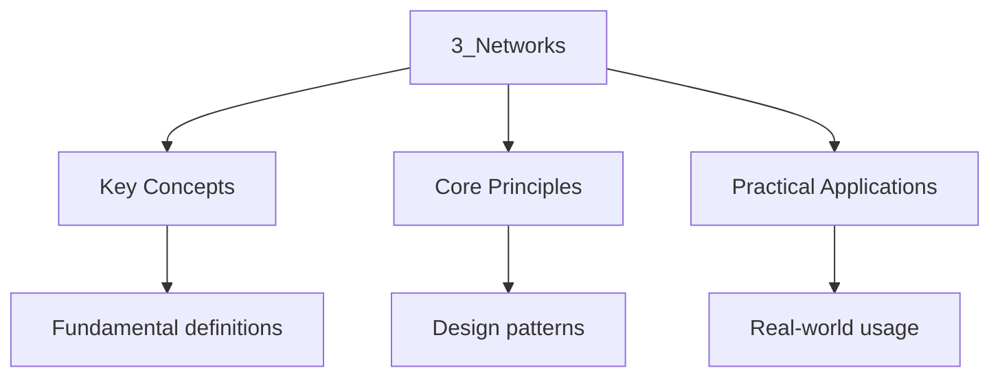

---

title: "Networks | GCSE - Wyatt's Notes"
description: "| Feature | LAN (Local Area Network) | WAN (Wide Area Network) | | --------- | ----------------------------------- | --------------------------------------"
date: 2026-04-14
tags:
  - gcse
  - gcse-computer-science
categories:
  - gcse-computer-science

---

<!-- Breadcrumb Schema for SEO -->

## Networks

> **Info:** Board Coverage AQA Paper 2 | Edexcel Paper 2 | OCR J277 Paper 2 | WJEC Unit 2
>
## 1. Types of Networks

### 1.1 LAN and WAN

| Feature   | LAN (Local Area Network)            | WAN (Wide Area Network)                |
| --------- | ----------------------------------- | -------------------------------------- |
| Coverage  | Small area (building, school, home) | Large area (cities, countries, global) |
| Ownership | Owned by the organisation           | Owned by multiple organisations/ISPs   |
| Speed     | Fast (100 Mbps -- 10 Gbps)          | Slower than LAN                        |
| Cost      | Low setup and maintenance           | High setup and maintenance             |

**The Internet** is the largest WAN in the world, connecting billions of devices globally.

**WLAN (Wireless LAN):** A LAN that uses wireless connections (Wi-Fi) instead of cables. Common in
Homes and schools.

**PAN (Personal Area Network):** Covers a very small area (a few metres). Bluetooth connections
Between a phone and headphones are an example.

### 1.2 Client-Server vs Peer-to-Peer

**Client-Server:**

- A central server provides resources and services to client computers
- The server manages security, backups, and data
- Advantages: centralised management, better security, easy backups
- Disadvantages: server is a single point of failure, more expensive

**Peer-to-Peer (P2P):**

- All computers are equal; each can share resources directly with others
- No central server
- Advantages: cheaper, no single point of failure
- Disadvantages: harder to manage, weaker security, no central backup

**Client-server vs P2P comparison:**

| Feature        | Client-Server              | Peer-to-Peer                 |
| -------------- | -------------------------- | ---------------------------- |
| Central device | Yes (server)               | No                           |
| Cost           | Higher                     | Lower                        |
| Security       | Centralised, stronger      | Decentralised, weaker        |
| Backup         | Centralised                | Each user responsible        |
| Scalability    | Easier to scale            | Difficult at large scale     |
| Failure impact | Server failure affects all | Only affected peer goes down |
| Best for       | Businesses, schools        | Small home networks          |

### 1.3 Network Topologies

A **network topology** describes the physical or logical arrangement of devices in a network.

**Star topology:**

- All devices connect to a central switch or hub
- If the central device fails, the network fails
- If one cable fails, only that device is affected
- Easy to add or remove devices
- Most common topology in modern networks

**Mesh topology:**

- Every device is connected to every other device (full mesh) or to multiple devices (partial mesh)
- Very reliable (multiple paths for data)
- Expensive (many cables)
- Complex to set up
- Used in critical systems where reliability is essential

**Bus topology:**

- All devices connected to a single backbone cable
- Cheap and simple
- If the backbone cable fails, the entire network fails
- Performance degrades with many devices (collisions)
- Rarely used in modern networks

**Ring topology:**

- Devices connected in a circular loop
- Data travels in one direction
- If one device or cable fails, the entire network fails
- Rarely used (modern ring networks use dual rings for redundancy)

### 1.4 Comparing Topologies

| Feature         | Star           | Mesh             | Bus          | Ring     |
| --------------- | -------------- | ---------------- | ------------ | -------- |
| Cost            | Low            | High             | Very low     | Low      |
| Reliability     | Medium         | Very high        | Low          | Low      |
| Scalability     | Good           | Poor             | Poor         | Poor     |
| Fault tolerance | Good           | Excellent        | Poor         | Poor     |
| Cable required  | One per device | Many             | One backbone | One ring |
| Common use      | LANs           | Critical systems | Legacy       | Legacy   |

**Worked Example.** A school has 30 computers in a computer lab. Recommend a topology and justify
Your answer.

A star topology is most appropriate. Each computer connects to a central switch via its own cable.
If one cable fails, only that computer is affected. It is easy to add or remove computers. The
Switch manages traffic efficiently, avoiding collisions.

### 1.5 Network Models in Practice

**Worked Example.** A small office has 5 computers, a printer, and a router connected to the
Internet. Draw and describe the network topology.

All devices connect to a central switch (star topology). The switch connects to the router, which
Connects to the Internet via the ISP. The printer may be connected directly to the switch or shared
Through one of the computers. This is a LAN with a star topology connected to a WAN (the Internet).

## 2. Network Hardware

### 2.1 Key Devices

| Device                       | Function                                                                                                     |
| ---------------------------- | ------------------------------------------------------------------------------------------------------------ |
| Router                       | Connects different networks together; directs data packets to their destination; assigns IP addresses (DHCP) |
| Switch                       | Connects devices within a LAN; directs data to the correct device using MAC addresses                        |
| Hub                          | Connects devices in a LAN; broadcasts data to ALL connected devices (less efficient than a switch)           |
| Network interface card (NIC) | Allows a device to connect to a network; has a unique MAC address                                            |
| Wireless access point (WAP)  | Allows wireless devices to connect to a wired network                                                        |
| Bridge                       | Connects two segments of a LAN, filtering traffic                                                            |
| Repeater                     | Amplifies signals to extend the range of a network                                                           |

### 2.2 Switch vs Hub

A **hub** broadcasts incoming data to ALL ports. This is inefficient and causes collisions because
Every device receives every message, even if it was not the intended recipient.

A **switch** learns which device is connected to each port and directs data only to the intended
Recipient. This is more efficient and reduces collisions.

**Analogy.** A hub is like a person shouting a message in a crowded room -- everyone hears it. A
Switch is like a person handing a sealed envelope directly to the intended recipient.

**Worked Example.** Computer A sends a message to Computer B on a network with a hub. What happens?

The hub receives the message and broadcasts it to ALL ports. Computers C, D, and E also receive the
Message, even though it was only intended for Computer B. Each computer checks the destination MAC
Address and discards the message if it does not match. This wastes bandwidth on all devices.

### 2.3 Router vs Switch

A **switch** connects devices within a single LAN and forwards frames based on MAC addresses.

A **router** connects different networks (e.g., a LAN to the Internet) and forwards packets based on
IP addresses. Routers can also perform NAT (Network Address Translation), allowing multiple devices
On a LAN to share a single public IP address.

**Device comparison by OSI layer:**

| Device | OSI Layer     | Address Used | Connects             |
| ------ | ------------- | ------------ | -------------------- |
| Hub    | Physical (1)  | None         | Devices within a LAN |
| Switch | Data Link (2) | MAC address  | Devices within a LAN |
| Router | Network (3)   | IP address   | Different networks   |

## 3. Network Models

### 3.1 The TCP/IP Model

The TCP/IP model has four layers:

| Layer                 | Function                               | Examples                        |
| --------------------- | -------------------------------------- | ------------------------------- |
| Application           | Provides services to user applications | HTTP, FTP, SMTP, DNS            |
| Transport             | Ensures reliable delivery of data      | TCP, UDP                        |
| Internet (Network)    | Routes data packets across networks    | IP, routing protocols           |
| Link (Network Access) | Handles physical transmission of data  | Ethernet, Wi-Fi, MAC addressing |

### 3.2 The OSI Model (Higher Tier)

The OSI (Open Systems Interconnection) model has seven layers:

| Layer | Name         | Function                     | Examples             |
| ----- | ------------ | ---------------------------- | -------------------- |
| 7     | Application  | User interface, applications | HTTP, FTP, DNS       |
| 6     | Presentation | Data formatting, encryption  | SSL/TLS, JPEG, ASCII |
| 5     | Session      | Session management           | NetBIOS              |
| 4     | Transport    | End-to-end delivery          | TCP, UDP             |
| 3     | Network      | Routing and addressing       | IP, ICMP, ARP        |
| 2     | Data Link    | Node-to-node delivery, MAC   | Ethernet, Wi-Fi      |
| 1     | Physical     | Electrical signals, bits     | Cables, hubs         |

**Mnemonic:** "All People Seem To Need Data Processing" (Application, Presentation, Session,
Transport, Network, Data Link, Physical).

**TCP/IP vs OSI:** The TCP/IP model is the practical model used on the Internet. The OSI model is a
Theoretical reference model. TCP/IP"s Application layer combines OSI layers 5, 6, and 7. TCP/IP's
Link layer combines OSI layers 1 and 2.

### 3.3 The Four-Layer Model in Action

**Example:** Sending an email using SMTP over TCP/IP.

1. **Application layer:** SMTP protocol prepares the email message.
2. **Transport layer:** TCP breaks the message into segments and adds sequence numbers and
   error-checking.
3. **Internet layer:** IP adds source and destination IP addresses, creating packets.
4. **Link layer:** Ethernet/Wi-Fi adds MAC addresses and transmits the data as frames.

**Encapsulation.** At each layer, data is wrapped (encapsulated) with a header. At the receiving
End, each layer removes (decapsulates) its header before passing data up. The application receives
Only the original message.

**Encapsulation sequence:**

$$\mathrm{Data \xrightarrow{\mathrm{Transport} \mathrm{Segment \xrightarrow{\mathrm{Internet} \mathrm{Packet \xrightarrow{\mathrm{Link} \mathrm{Frame$$

**Decapsulation at receiver:** Frame $\to$ Packet $\to$ Segment $\to$ Data.

## 4. Network Protocols

### 4.1 Key Protocols

| Protocol  | Layer       | Purpose                                                                                   |
| --------- | ----------- | ----------------------------------------------------------------------------------------- |
| TCP       | Transport   | Reliable, connection-oriented data transfer; breaks data into segments; checks for errors |
| UDP       | Transport   | Fast, connectionless data transfer; no error checking; used for streaming                 |
| IP        | Internet    | Addresses and routes packets across networks                                              |
| HTTP      | Application | Transfers web pages (port 80)                                                             |
| HTTPS     | Application | Secure version of HTTP (port 443); uses encryption                                        |
| FTP       | Application | Transfers files between client and server (ports 20/21)                                   |
| SMTP      | Application | Sends email (port 25)                                                                     |
| POP3/IMAP | Application | Receives email (port 110/143)                                                             |
| DNS       | Application | Resolves domain names to IP addresses (port 53)                                           |
| DHCP      | Application | Assigns IP addresses automatically (port 67/68)                                           |

### 4.2 TCP vs UDP

| Feature     | TCP                                 | UDP                          |
| ----------- | ----------------------------------- | ---------------------------- |
| Connection  | Connection-oriented (handshake)     | Connectionless               |
| Reliability | Guaranteed delivery, error checking | Best effort, no guarantees   |
| Speed       | Slower                              | Faster                       |
| Order       | Data arrives in order               | Data may arrive out of order |
| Use cases   | Web browsing, email, file transfer  | Streaming, gaming, VoIP      |

**TCP three-way handshake:**

1. Client sends SYN (synchronise) to server
2. Server responds with SYN-ACK (acknowledge)
3. Client sends ACK -- connection established

**Why the handshake?** The handshake ensures both sides are ready to communicate and agree on
Initial sequence numbers. Without it, data could be sent before the receiver is ready, causing
Packet loss.

**When to use UDP.** UDP is appropriate when speed matters more than reliability. A few lost packets
In a video stream are barely noticeable (a momentary glitch), but waiting for retransmission would
Cause visible lag. Similarly, in online gaming, a stale position update is useless -- the game needs
The most recent data, not old reliable data.

### 4.3 Protocol Port Numbers

Well-known ports are standardised so that services can be found at predictable addresses.

| Port  | Protocol | Purpose          |
| ----- | -------- | ---------------- |
| 20/21 | FTP      | File transfer    |
| 22    | SSH      | Secure shell     |
| 25    | SMTP     | Email sending    |
| 53    | DNS      | Domain names     |
| 80    | HTTP     | Web pages        |
| 110   | POP3     | Email receiving  |
| 143   | IMAP     | Email receiving  |
| 443   | HTTPS    | Secure web pages |
| 993   | IMAPS    | Secure IMAP      |

## 5. IP Addressing

### 5.1 IPv4 Addresses

An **IPv4 address** is a 32-bit number, written as four decimal numbers separated by dots:

$$\mathrm{Example:  192.168.1.1$$

Each number ranges from 0 to 255 (8 bits each, total 32 bits).

Total possible IPv4 addresses: $2^{32} = 4,294,967,296$ (approximately 4.3 billion).

**Worked Example.** Convert the IP address 192.168.1.1 to binary.

$192 = 11000000$$168 = 10101000$$1 = 00000001$$1 = 00000001$.

$192.168.1.1 = 11000000.10101000.00000001.00000001$.

### 5.2 IPv6 Addresses (Higher Tier)

An **IPv6 address** is a 128-bit number, written as eight groups of hexadecimal:

$$\mathrm{Example:  2001:0db8:85a3:0000:0000:8a2e:0370:7334$$

Total possible IPv6 addresses: $2^{128} \approx 3.4 \times 10^{38}$.

**Why IPv6?** IPv4 addresses have been exhausted due to the growth of the Internet. IPv6 provides a
Vastly larger address space, ensuring enough addresses for the foreseeable future.

**IPv6 address shortening rules:**

- Leading zeros within each group can be omitted: `0001` becomes `1``0db8` becomes `db8`.
- Consecutive groups of all zeros can be replaced with `::` (only once per address).

Example: `2001:0db8:0000:0000:0000:0000:0000:0001` becomes `2001:db8::1`.

### 5.3 MAC Addresses

A **MAC (Media Access Control) address** is a 48-bit unique identifier assigned to a network
Interface card by the manufacturer. It is written as six pairs of hexadecimal digits:

$$\mathrm{Example:  00:1A:2B:3C:4D:5E$$

**Difference between IP and MAC addresses:**

| Feature     | IP Address                 | MAC Address                            |
| ----------- | -------------------------- | -------------------------------------- |
| Assigned by | Network (DHCP or manually) | Manufacturer (permanent)               |
| Changes?    | Yes (can change)           | No (fixed to hardware)                 |
| Used for    | Routing across networks    | Identifying devices on a local network |
| Layer       | Internet layer             | Link layer                             |
| Length      | 32 bits (IPv4)             | 48 bits                                |

**Analogy.** An IP address is like a postal address (it changes when you move). A MAC address is
Like a National Insurance number (it is permanently assigned to you).

### 5.4 Private vs Public IP Addresses

**Private IP ranges** (not routable on the public Internet):

- 10.0.0.0 to 10.255.255.255
- 172.16.0.0 to 172.31.255.255
- 192.168.0.0 to 192.168.255.255

Devices on a home LAN use private IP addresses. The router uses **NAT** (Network Address
Translation) to map private addresses to a single public IP address when communicating with the
Internet.

**Worked Example.** A home network has devices with IP addresses 192.168.1.2, 192.168.1.3, and
192.168.1.4. The router's public IP is 203.0.113.5. When device 192.168.1.2 sends a request to a web
Server, NAT translates the source address from 192.168.1.2 to 203.0.113.5. When the response
Arrives, NAT translates the destination back to 192.168.1.2.

## 6. Network Security

### 6.1 Threats

| Threat                  | Description                                                                        |
| ----------------------- | ---------------------------------------------------------------------------------- |
| Malware                 | Malicious software (viruses, worms, trojans, ransomware, spyware)                  |
| Phishing                | Fraudulent emails or websites that trick users into revealing personal information |
| Social engineering      | Manipulating people into breaking security procedures                              |
| Brute force attacks     | Trying every possible password to gain access                                      |
| Denial of service (DoS) | Overwhelming a server with traffic to make it unavailable                          |
| Interception            | Eavesdropping on network communications                                            |
| Data theft              | Unauthorised access to or copying of data                                          |

**Types of malware in detail:**

- **Virus:** Attaches to a legitimate program and replicates when the program runs. Requires a host
  file to spread.
- **Worm:** Self-replicating malware that spreads over networks without requiring a host file or
  user action.
- **Trojan:** Malware disguised as legitimate software. Does not self-replicate. Named after the
  Trojan horse of Greek mythology.
- **Ransomware:** Encrypts the victim's files and demands payment ( in cryptocurrency) for the
  decryption key.
- **Spyware:** Secretly monitors the user's activity, collecting passwords, browsing history, and
  personal data.

### 6.2 Prevention Methods

| Method                          | Description                                                                   |
| ------------------------------- | ----------------------------------------------------------------------------- |
| Firewall                        | Hardware or software that monitors and filters network traffic based on rules |
| Encryption                      | Converting data into a coded form that can only be read with the correct key  |
| Strong passwords                | Long, complex passwords that are difficult to guess                           |
| Antivirus software              | Detects and removes malware                                                   |
| Two-factor authentication (2FA) | Requires two forms of identification to log in                                |
| User access levels              | Limiting what each user can access based on their role                        |
| Physical security               | Locks, security guards, CCTV                                                  |
| Penetration testing             | Simulated attacks to find vulnerabilities                                     |
| Software updates                | Installing patches to fix known security vulnerabilities                      |

### 6.3 Encryption

**Symmetric encryption:** The same key is used to encrypt and decrypt data. Fast but requires secure
Key exchange. Example: AES.

**Asymmetric encryption:** A public key encrypts data; a private key decrypts it. Slower but more
Secure (no need to exchange keys). Example: RSA.

**How HTTPS uses both:**

1. Browser requests the server's public key (from its digital certificate)
2. Browser generates a random session key and encrypts it with the server's public key
3. Server decrypts the session key with its private key
4. Both sides now share the session key and use symmetric encryption (AES) for fast data transfer

**SSL/TLS:** Used to secure web traffic (HTTPS). The browser and server establish a secure
Connection using asymmetric encryption, then switch to symmetric encryption for speed.

**Hashing:** A one-way function that converts data into a fixed-length hash. Used for storing
Passwords. Even a small change in input produces a completely different hash.

**Worked Example (Higher Tier).** Explain how a man-in-the-middle attack works and how HTTPS
Prevents it.

In a MITM attack, an attacker intercepts communication between two parties. Without HTTPS, the
Attacker can read and modify all data. With HTTPS, the browser verifies the server's digital
Certificate against a trusted certificate authority (CA). The attacker cannot forge a valid
Certificate, so the browser warns the user. The encrypted connection ensures the attacker cannot
Read or modify the data even if they intercept it.

## 7. The Internet and the World Wide Web

### 7.1 Key Distinctions

The **Internet** is the global network of interconnected computers and cables.

The **World Wide Web (WWW)** is a collection of web pages accessed over the Internet using
HTTP/HTTPS.

The Web is a service that runs ON the Internet. The Internet existed before the Web (since 1969 as
ARPANET). The Web was invented by Tim Berners-Lee in 1989. Other services that run on the Internet
Include email (SMTP), file transfer (FTP), and VoIP.

### 7.2 How the Web Works

1. A user enters a URL (e.g. <Https://www.example.com>) in a browser
2. The **DNS (Domain Name System)** translates the domain name into an IP address
3. The browser sends an **HTTP request** to the web server at that IP address
4. The server processes the request and sends back **HTML, CSS, and JavaScript** files
5. The browser renders the page for the user

**DNS resolution in detail:**

1. Browser checks its own cache
2. Operating system checks its DNS cache
3. Query sent to the **recursive DNS resolver** ( the ISP's DNS server)
4. If not cached, the resolver queries the **root name server** (returns the TLD server for .com)
5. The TLD server returns the **authoritative name server** for example.com
6. The authoritative server returns the IP address
7. The result is cached at each level for future queries

### 7.3 Search Engines

A **search engine** (e.g. Google) uses automated programs called **web crawlers** (or spiders) to:

1. Crawl: Follow links from page to page, discovering new pages
2. Index: Store and organise information about each page
3. Search: When a user enters a query, the search engine ranks matching pages by relevance

**Page ranking** algorithms consider:

- Keywords in the page content and title
- Number and quality of links pointing to the page
- Page popularity and user engagement
- Page loading speed and mobile-friendliness

## 8. Data Transmission

### 8.1 Packet Switching

Data is broken into small packets for transmission across a network. Each packet contains:

- The data being sent
- A header (source address, destination address, sequence number, error checking)
- A trailer (error checking)

**Advantages of packet switching:**

- No dedicated route needed (packets can take different paths)
- If a packet is lost, only that packet needs to be resent
- Multiple users can share the same network
- Resilient to failures (packets can be rerouted around broken links)

**Packet switching vs circuit switching:**

| Feature        | Packet Switching                 | Circuit Switching             |
| -------------- | -------------------------------- | ----------------------------- |
| Connection     | No dedicated connection          | Dedicated connection          |
| Resource usage | Efficient (shared)               | Wasteful (reserved)           |
| Reliability    | Packets can take different paths | Fixed route                   |
| Example        | The Internet                     | Traditional telephone network |

### 8.2 Transmission Media

| Medium                      | Type     | Speed     | Distance    | Security            |
| --------------------------- | -------- | --------- | ----------- | ------------------- |
| Copper cable (twisted pair) | Guided   | Medium    | Short       | Low (can be tapped) |
| Fibre optic cable           | Guided   | Very fast | Long        | High                |
| Wi-Fi (radio waves)         | Unguided | Fast      | Short       | Low (interceptable) |
| Microwave                   | Unguided | Fast      | Medium-Long | Medium              |
| Satellite                   | Unguided | Variable  | Very long   | Medium              |

**Fibre optic vs copper:**

- Fibre optic carries data as light pulses through glass fibres. Much faster (can carry terabits per
  second), immune to electromagnetic interference, and harder to tap.
- Copper carries data as electrical signals. Cheaper and easier to install, but slower and
  susceptible to interference.

### 8.3 Encryption for Data Transmission

All data sent over public networks should be encrypted. HTTPS uses TLS (Transport Layer Security) to
Encrypt web traffic, preventing interception.

**Certificate authorities (CAs).** When you visit an HTTPS site, the server presents a digital
Certificate issued by a trusted CA. The browser verifies this certificate to ensure it is
Communicating with the genuine server and not an impostor. This prevents man-in-the-middle attacks.

### 1.6 Network Models in Practice

**Worked Example.** A small office has 5 computers, a printer, and a router connected to the
Internet. Describe the network topology.

All devices connect to a central switch (star topology). The switch connects to the router, which
Connects to the Internet via the ISP. The printer may be connected directly to the switch or shared
Through one of the computers. This is a LAN with a star topology connected to a WAN (the Internet).

**Worked Example.** A school has two buildings, each with 20 computers connected by switches. The
two Buildings are connected by a fibre optic cable. Describe the topology.

Each building has a LAN with a star topology. The buildings are connected by the fibre optic cable,
Forming a WAN. Each building has its own switch, and the switches are connected to a router that
Manages inter-building traffic.

## 2. Network Hardware

### 2.1 Key Devices

| Device                       | Function                                                                                                     |
| ---------------------------- | ------------------------------------------------------------------------------------------------------------ |
| Router                       | Connects different networks together; directs data packets to their destination; assigns IP addresses (DHCP) |
| Switch                       | Connects devices within a LAN; directs data to the correct device using MAC addresses                        |
| Hub                          | Connects devices in a LAN; broadcasts data to ALL connected devices (less efficient than a switch)           |
| Network interface card (NIC) | Allows a device to connect to a network; has a unique MAC address                                            |
| Wireless access point (WAP)  | Allows wireless devices to connect to a wired network                                                        |
| Bridge                       | Connects two segments of a LAN, filtering traffic                                                            |
| Repeater                     | Amplifies signals to extend the range of a network                                                           |

### 2.2 Switch vs Hub

A **hub** broadcasts incoming data to ALL ports. This is inefficient and causes collisions because
Every device receives every message, even if it was not the intended recipient.

A **switch** learns which device is connected to each port and directs data only to the intended
Recipient. This is more efficient and reduces collisions.

**Analogy.** A hub is like a person shouting a message in a crowded room -- everyone hears it. A
Switch is like a person handing a sealed envelope directly to the intended recipient.

**Worked Example.** Computer A sends a message to Computer B on a network with a hub. What happens?

The hub receives the message and broadcasts it to ALL ports. Computers C, D, and E also receive the
Message, even though it was only intended for Computer B. Each computer checks the destination MAC
Address and discards the message if it does not match. This wastes bandwidth on all devices.

### 2.3 Router vs Switch

A **switch** connects devices within a single LAN and forwards frames based on MAC addresses.

A **router** connects different networks (e.g., a LAN to the Internet) and forwards packets based on
IP addresses. Routers can also perform NAT (Network Address Translation), allowing multiple devices
On a LAN to share a single public IP address.

**Device comparison by OSI layer:**

| Device | OSI Layer     | Address Used | Connects             |
| ------ | ------------- | ------------ | -------------------- |
| Hub    | Physical (1)  | None         | Devices within a LAN |
| Switch | Data Link (2) | MAC address  | Devices within a LAN |
| Router | Network (3)   | IP address   | Different networks   |

### 2.4 MAC Addresses in Detail

A MAC address is a 48-bit unique identifier assigned to a NIC by the manufacturer. It is written as
Six pairs of hexadecimal digits: `00:1A:2B:3C:4D:5E`.

The first 24 bits (3 bytes) identify the manufacturer (OUI -- Organisationally Unique Identifier).
The last 24 bits identify the specific device.

**Worked Example.** Why do switches use MAC addresses instead of IP addresses?

Switches operate at layer 2 (Data Link) of the OSI model, which deals with local network delivery
Using MAC addresses. IP addresses are used at layer 3 (Network) for routing between networks.

### 2.5 Transmission Media in Detail

**Copper cable (twisted pair):**

- Uses electrical signals
- Category 5e (Cat5e) supports up to 1 Gbps
- Category 6 (Cat6) supports up to 10 Gbps over short distances
- Maximum distance: 100 metres (without repeaters)

**Fibre optic cable:**

- Uses light pulses through glass or plastic fibres
- Speeds up to 100 Gbps or more
- Immune to electromagnetic interference
- Can span several kilometres without repeaters
- More expensive to install but lower maintenance costs

**Worked Example.** A school needs to connect two buildings 500 metres apart. Which transmission
Medium should they use and why?

Fibre optic cable. Copper (twisted pair) has a maximum reliable distance of 100 metres. Fibre optic
Can span the 500 metres without repeaters and provides higher bandwidth for future growth.

## 8. Data Transmission

### 8.1 Packet Switching

Data is broken into small packets for transmission across a network. Each packet contains:

- The data being sent
- A header (source address, destination address, sequence number, error checking)
- A trailer (error checking)

**Advantages of packet switching:**

- No dedicated route needed (packets can take different paths)
- If a packet is lost, only that packet needs to be resent
- Multiple users can share the same network
- Resilient to failures (packets can be rerouted around broken links)

**Packet switching vs circuit switching:**

| Feature        | Packet Switching                 | Circuit Switching             |
| -------------- | -------------------------------- | ----------------------------- |
| Connection     | No dedicated connection          | Dedicated connection          |
| Resource usage | Efficient (shared)               | Wasteful (reserved)           |
| Reliability    | Packets can take different paths | Fixed route                   |
| Example        | The Internet                     | Traditional telephone network |

### 8.2 Error Detection

**Parity check:** An extra bit added to make the number of 1s even (even parity) or odd (odd
Parity).

**Checksum:** A value calculated from the data and sent with it. The receiver recalculates and
Compares.

**Worked Example.** Calculate the parity bit for 1011011 using even parity.

Number of 1s = 5 (odd). Parity bit = 1 (to make total even). Transmitted: 11011011.

### 8.3 Encryption for Data Transmission

All data sent over public networks should be encrypted. HTTPS uses TLS (Transport Layer Security) to
Encrypt web traffic, preventing interception.

**Certificate authorities (CAs).** When you visit an HTTPS site, the server presents a digital
Certificate issued by a trusted CA. The browser verifies this certificate to ensure it is
Communicating with the genuine server and not an impostor. This prevents man-in-the-middle attacks.

## Additional Practice Questions

1. Explain the difference between a bridge and a repeater. When would you use each?

2. A company has a LAN with 100 devices connected to switches. Explain why replacing the switches
    with hubs would degrade network performance.

3. Explain what a MAC address is, how it is assigned, and why it is needed.

4. Calculate the parity bit for the byte 01101011 using even parity. If bit 3 (from the left) is
    flipped during transmission, will the parity check detect the error?

5. Explain why fibre optic cable is preferred over copper cable for connecting buildings that are
    far apart.

6. A packet with the following structure is sent: [Source IP: 192.168.1.5] [Dest IP: 10.0.0.1]
    [Seq: 42] [Data: "Hello"] [Checksum: 0xAB]. Explain the purpose of each field.

7. Explain what NAT is and why it is necessary for a home network to access the Internet.

## Common Pitfalls

- **Confusing the Internet and the World Wide Web.** The Internet is the infrastructure (cables,
  routers, protocols). The Web is a service (web pages) that runs on it.
- **Confusing TCP and UDP.** TCP is reliable and ordered but slower; UDP is fast but unreliable. Use
  TCP for file transfers and UDP for live streaming.
- **Confusing IP addresses and MAC addresses.** IP addresses are logical and change; MAC addresses
  are physical and permanent. IP is used for routing; MAC is used for local delivery.
- **Thinking a hub and a switch do the same thing.** A hub broadcasts to all ports; a switch directs
  data to the correct port using a MAC address table.
- **Confusing symmetric and asymmetric encryption.** Symmetric uses one key (fast); asymmetric uses
  a key pair (slower but more secure for key exchange).
- **Forgetting that firewalls filter traffic based on rules.** They are not the same as antivirus
  software. A firewall blocks unauthorised network traffic; antivirus detects and removes malware.
- **Confusing packet switching with circuit switching.** The Internet uses packet switching; the
  traditional phone network uses circuit switching.
- **Forgetting port numbers.** Each protocol uses a standard port number. HTTP uses port 80, HTTPS
  uses port 443. These must be correct for communication to work.

## Practice Questions

1. Compare LANs and WANs, giving an example of each.

2. Describe the function of a router, a switch, and a NIC.

3. Explain the difference between a star topology and a mesh topology, including advantages and
   disadvantages of each.

4. Describe the four layers of the TCP/IP model and give an example protocol for each layer.

5. Explain the difference between TCP and UDP, and state when each would be appropriate.

6. Explain the difference between an IP address and a MAC address.

7. Describe three methods of protecting a network from security threats.

8. Explain how a web browser loads a web page when the user enters a URL.

9. Explain how packet switching works and why it is used for data transmission over the Internet.

10. Describe the role of a firewall and explain how it differs from antivirus software.

11. **(Higher Tier)** Describe the seven layers of the OSI model and explain how the TCP/IP model
    maps to it.

12. **(Higher Tier)** Explain the TCP three-way handshake. Why is it necessary?

13. **(Higher Tier)** Explain how asymmetric encryption is used in HTTPS to establish a secure
    connection. Why is symmetric encryption used for the actual data transfer?

14. **(Higher Tier)** Explain the difference between NAT and DHCP. What does each protocol do?

15. **(Higher Tier)** Convert the IPv4 address 172.16.254.1 to its 32-bit binary representation.

16. **(Higher Tier)** Explain how data is encapsulated as it travels from the application layer down
    to the link layer. Use sending an email as an example.

17. **(Higher Tier)** A company has a LAN with 50 devices. Explain why a switch is preferred over a
    hub for this network.

18. **(Higher Tier)** Explain the concept of a DDoS attack. How does it differ from a standard DoS
    attack, and what defences are available?

## Worked Examples

**Example 1:**

A typical exam question on Networks requires you to apply your knowledge to an unfamiliar context.
Read the question carefully, identify the key concept being tested, and structure your answer using
the appropriate terminology.

**Example 2:**

Multi-step problems in Networks often combine two or more concepts. Break the problem down: identify
what you need to find, recall the relevant formula or principle, substitute values, and state your
answer with correct units or formatting.

## Summary

This topic covers the core concepts of networks, including underlying theory, practical
implementation, and key applications.

**Key concepts include:**

- TCP/IP and the OSI model
- network topologies
- protocols (HTTP, FTP, SMTP)
- encryption and security
- client-server and peer-to-peer

Understanding these concepts thoroughly is essential for both examinations and practical
programming, and requires both theoretical knowledge and hands-on practice.

## Intuition

Computer science is about solving problems through computation. Hardware provides the physical foundation, while software provides the instructions that make it useful. Algorithms are step-by-step procedures for solving problems, and data structures organize information for efficient access. Understanding how these layers interact helps you build systems that are not just functional but also fast, reliable, and secure.

## Cross-References

- [2 Hardware](computer-science/2-hardware/2_hardware)
- [3 Networks](computer-science/3-networks/3_networks)
- [Biology](biology)
- [2 Organisation](biology/2-organisation/2_organisation)
