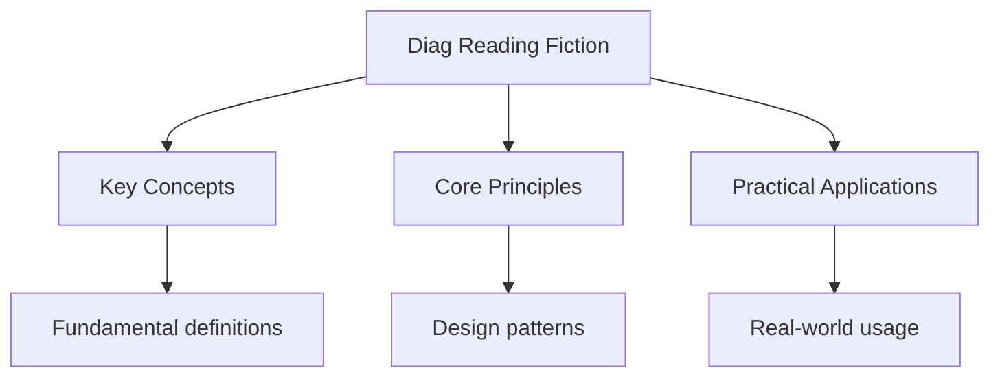

---

date: 2026-07-23T21:57:32+01:00
title: "Reading Fiction -- Diagnostic Tests"
description: "Reading Fiction -- Diagnostic Tests: comprehensive educational content notes with precise definitions, worked examples, common pitfalls, and practice problems."
tableOfContents: false
---

<!-- Breadcrumb Schema for SEO -->

## Reading Fiction -- Diagnostic Tests

## Unit Tests

### UT-1: Language Analysis in Fiction

**Question:**

Read the following extract from a novel:

> The wind clawed at the shutters, rattling them like bones in a sack. Old Mrs Pemberton sat hunched
> in her chair, her knuckles white around the teacup, watching the shadows that pooled in the
> corners of the room. Outside, the oak tree -- her husband"s tree, planted the year they married --
> thrashed against the windowpanes with a frantic, almost human desperation. She had not moved from
> that chair in three days. The house groaned around her, settling into its old bones, and she
> wondered whether the walls remembered the sound of his laughter, or whether the silence had
> swallowed that too.

(a) Identify two examples of personification in the extract and explain the effect of each.

(b) Analyse the use of the simile "rattling them like bones in a sack". What does this suggest about
the atmosphere?

(c) How does the writer use imagery to create a sense of isolation? Refer to at least two specific
words or phrases.

(d) Explore the significance of the oak tree in the extract. How does it function symbolically?

**Solution:**

(a)

- **"The wind clawed at the shutters"**: Personification gives the wind animal-like aggression. The
  verb "clawed" suggests violence and threat, making the natural weather seem predatory and
  menacing, reflecting Mrs Pemberton's inner turmoil.
- **"The house groaned around her, settling into its old bones"**: Personification makes the house
  seem alive and suffering, mirroring Mrs Pemberton's grief. "Groaned" suggests pain and age, while
  "old bones" personifies the house as an elderly, weary body.

(b) The simile "rattling them like bones in a sack" compares the sound of the shutters to bones
shaking inside a sack. This creates a macabre, unsettling image that associates the storm with death
and decay. It heightens the gothic atmosphere and suggests that Mrs Pemberton's world is filled with
reminders of mortality, which is reinforced by the mention of her dead husband.

(c) The writer uses imagery to emphasise isolation through specific word choices. "Shadows that
pooled in the corners" creates a visual image of darkness accumulating in the room, suggesting that
gloom and emptiness are surrounding Mrs Pemberton. The phrase "the silence had swallowed that too"
personifies silence as something consuming and overpowering, implying that everything comforting --
including the memory of laughter -- has been absorbed by emptiness. The detail that she "had not
moved from that chair in three days" physically demonstrates her isolation and immobility.

(d) The oak tree functions as a symbol of the relationship between Mrs Pemberton and her husband. It
was "planted the year they married," linking it directly to their life together. Its current state
-- "thrashing against the windowpanes with a frantic, almost human desperation" -- mirrors Mrs
Pemberton's own emotional turmoil and distress at losing him. The tree, like her, has been left
behind and is reacting to the storm, suggesting that grief, like the wind, is an external force that
punishes what remains. Its proximity "outside" the window, separated from her by glass, emphasises
her separation from the living world and her inability to reconnect with what the tree represents.

---

<!-- Breadcrumb Schema for SEO -->

### UT-2: Structural Analysis in Fiction

**Question:**

The following extract is from the opening of a novel. A young man arrives in a new city:

> I stepped off the train into a wall of noise. Car horns, shouted conversations, the grinding
> screech of brakes -- it was all too much, too loud, too fast. I stood on the platform for what
> must have been five minutes, my suitcase clutched against my chest like a shield, before a porter
> tapped me on the shoulder and told me I needed to move. The city did not wait for newcomers. I
> learned that on my first day. By evening, I had been knocked twice, ignored four times, and
> completely lost seven times. And yet, as I crossed the bridge over the river at sunset, with the
> skyline blazing gold against the purple sky, I felt something unexpected: the faintest stirring of
> excitement, buried beneath the fear.

(a) How does the writer structure the opening to establish a sense of contrast? Refer to the
beginning and end of the extract.

(b) Analyse the effect of the list "knocked twice, ignored four times, and completely lost seven
times." How does it contribute to the structure of the paragraph?

(c) The narrator says "the city did not wait for newcomers." Explore the effect of this short,
declarative sentence in the context of the extract's structure.

(d) How does the writer use the progression through the day (from arrival to evening to sunset) to
structure the narrator's emotional journey?

**Solution:**

(a) The extract is structured around a clear contrast between the overwhelming, hostile experience
of arrival and the moment of unexpected wonder at the end. The opening presents chaos and sensory
overload ("a wall of noise," "too much, too loud, too fast"), while the closing introduces beauty
and a hint of positive emotion ("skyline blazing gold," "faintest stirring of excitement"). This
structural shift from negative to cautiously positive mirrors the narrator's own emotional arc from
fear to the first seeds of belonging.

(b) The list of negative experiences structures the paragraph as a crescendo of difficulty, each
item adding a new form of frustration. The specificity of the numbers ("twice," "four times," "seven
times") exaggerates and quantifies the narrator's suffering, making the experience feel systematic
rather than accidental. Structurally, this accumulation of hardships makes the eventual shift to the
positive image at the bridge more impactful, because the reader has been led through a sequence of
failure before the hopeful turn.

(c) Placed after the narrator's description of standing still on the platform, this short,
declarative sentence acts as a structural turning point. It is a generalised, almost proverbial
statement that shifts the focus from the narrator's specific experience to a universal truth about
the city. Its brevity and finality ("The city did not wait") create a sense of authority and
inevitability, suggesting that adaptation is not optional. Structurally, it bridges the paralysis of
the platform scene with the action of the rest of the day, propelling the narrative forward.

(d) The temporal progression from the moment of arrival (stepping off the train) through the day
(the accumulated experiences of "my first day") to evening and sunset mirrors the narrator's
emotional journey from overwhelm and fear to cautious excitement. The sunset image -- traditionally
associated with endings -- here paradoxically represents a beginning, as the narrator finds beauty
in the city for the first time. The structure of the day (arrival, struggle, evening reflection)
gives the extract a narrative arc that compresses an entire process of adaptation into a single
passage.

---

<!-- Breadcrumb Schema for SEO -->

### UT-3: Evaluating Writer's Methods in Fiction

**Question:**

Read the following extract:

> The school hall smelled of floor polish and failure. Rows of desks stretched to the back of the
> room, each one labelled with a number that felt, to Marcus, like a verdict. He sat at desk 47 and
> stared at the exam paper in front of him. The questions blurred. Not because his eyes were
> watering -- although they were -- but because the words seemed to rearrange themselves on the
> page, dancing just out of reach. Around him, the scratch of pens was relentless, a reminder that
> everyone else had started writing. He had not. He could not. The invigilator walked slowly down
> the aisle, her footsteps a countdown he could not escape.

(a) Select two words or short phrases from the extract that contribute to the tense atmosphere. For
each, explain its effect.

(b) How does the writer use the setting to reflect Marcus's internal state?

(c) Analyse the metaphor "each one labelled with a number that felt, to Marcus, like a verdict."
What does it reveal about Marcus's perspective?

(d) Some readers might find this extract melodramatic. Evaluate how effectively the writer builds
tension. Support your answer with specific references.

**Solution:**

(a)

- **"floor polish and failure"**: The noun "failure" is presented as if it is a physical smell
  alongside floor polish, personifying failure as something pervasive and inescapable. It
  immediately establishes a tone of dread.
- **"her footsteps a countdown he could not escape"**: The metaphor of footsteps as a countdown
  creates a sense of urgency and inevitability. "Could not escape" heightens the feeling of Marcus
  being trapped under pressure.

(b) The setting of the exam hall is used to externalise Marcus's anxiety. The clinical description
("floor polish," "rows of desks") establishes a sterile, impersonal environment that offers no
comfort. The numbered desks feel threatening to Marcus ("like a verdict"), transforming an ordinary
classroom feature into a symbol of judgment. The soundscape of the hall -- "the scratch of pens" --
surrounds him with the productivity of others, deepening his sense of isolation and inadequacy
within the setting.

(c) The metaphor transforms the desk number from a neutral identifier into a judgment or sentence
("verdict" is a legal term associated with a court's decision). This reveals that Marcus perceives
the exam as a trial in which he has already been found guilty. The number 47 is not just a seat
position but a label of his worth, suggesting he views the exam as defining his identity rather than
testing his knowledge.

(d) The writer builds tension effectively through several methods. The opening sentence immediately
establishes a negative tone. The focus tightens progressively from the hall as a whole to the desk,
to the exam paper, and finally to the invigilator's footsteps, creating a claustrophobic narrowing
of perspective. The repetition in "He had not. He could not." uses short, fragmented sentences to
mirror Marcus's mental paralysis, creating rhythmic tension. However, a reader might argue that the
description borders on melodramatic, particularly the claim that words "danced just out of reach,"
which could be seen as overblown for an exam scenario. Nevertheless, the cumulative effect of the
sensory details and the relentless invigilator builds a convincing picture of anxiety.

---

<!-- Breadcrumb Schema for SEO -->

## Integration Tests

### IT-1: Comparative Analysis of Fiction Extracts

**Question:**

Extract A describes a character returning to their childhood home after many years:

> The gate hung open on one hinge. The garden, once so carefully tended, had erupted into wildness
> -- brambles clawing over the path, the rose beds buried under a sea of nettles. She pushed the
> front door and it gave way with a sigh, as though the house had been holding its breath all these
> years, waiting. The hallway smelled of dust and damp, and something else beneath: the ghost of
> lavender polish her mother used on Saturdays. She ran her fingers along the wall where the height
> marks still stood, each one a small monument to a growing child.

Extract B describes a character visiting a place they have never been before:

> The terminal was vast and gleaming, every surface reflecting the harsh fluorescent light. Signs in
> three languages pointed in directions she could not decipher. She moved through the crowd,
> clutching her passport against her chest, aware that she looked exactly like what she was: someone
> who did not belong. The announcements overhead were a constant stream of incomprehensible
> syllables. She found a seat by a window and watched the planes being loaded with luggage, each
> case a story she would never know.

(a) Compare how both extracts present the relationship between the characters and the places they
are in.

(b) Compare the use of sensory detail in Extract A and Extract B.

(c) Both extracts use personification. Compare the effect of personification in each.

(d) Evaluate which extract you find more emotionally effective, supporting your answer with specific
references to both.

**Solution:**

(a) Both extracts present characters who feel a deep sense of emotional displacement, but the nature
of the relationship differs. In Extract A, the character has an intimate, nostalgic connection to
the place; the height marks on the wall and the "ghost of lavender polish" show that the house holds
personal memories. Despite this, the decay of the house creates a sense of loss and disconnect from
the past. In Extract B, the character has no prior connection to the place; her displacement comes
from unfamiliarity. She is defined by her status as an outsider ("someone who did not belong") in an
impersonal, anonymous space. Both characters are alienated, but Extract A's character mourns what
was lost while Extract B's character is overwhelmed by what is unknown.

(b) Both extracts use sensory detail to establish atmosphere, but to different effects. Extract A
draws on smell and touch to evoke nostalgia and decay: "smelled of dust and damp, and something else
beneath: the ghost of lavender polish" layers present decay with a faint trace of the past. "She ran
her fingers along the wall" uses tactile detail to create intimacy. Extract B uses visual and
auditory detail to create disorientation: "harsh fluorescent light," "signs in three languages," and
"a constant stream of incomprehensible syllables" bombard the reader with sensory overload,
mirroring the character's confusion.

(c) In Extract A, the door "gave way with a sigh, as though the house had been holding its breath
all these years, waiting." This personification gives the house a sense of conscious anticipation
and relief, suggesting it has been longing for the character's return. It makes the house feel like
a living companion. In Extract B, personification is less prominent but the "stream of
incomprehensible syllables" implies the announcements are an active, flowing force. However, the
terminal itself is described impersonally ("vast and gleaming"), and it is the character who feels
personified ("clutching her passport... someone who did not belong"). The personification in A is
tender; in B, the absence of personification in the setting contributes to its coldness.

(d) Extract A is more emotionally effective because it works through the reader's recognition of
universal experiences -- returning home to find it changed, the bittersweet nature of memory. The
detail of the "height marks" is particularly poignant because it is specific and relatable,
transforming an ordinary domestic feature into a powerful symbol of the passage of time. Extract B,
while effective in conveying disorientation, lacks the depth of personal history that makes Extract
A resonate. The image in Extract A of "each one a small monument to a growing child" is more
emotionally charged than any single image in Extract B, because it encapsulates loss, memory, and
the irrevocability of time in a single line.

---

<!-- Breadcrumb Schema for SEO -->

### IT-2: Language and Structure in Fiction

**Question:**

> He found the letter in the pocket of his winter coat, wedged between a crumpled receipt and a
> two-pound coin. It was addressed to him in her handwriting -- the looping Ls, the way her Ss
> curled like ferns -- and it had not been opened. He remembered the day she gave it to him.
> November. Rain on the windows of the cafe. She had pushed it across the table and said, "Don't
> read it yet. Wait until you need to." He had tucked it into his coat pocket without a word, and
> there it had stayed for three years, through two house moves and one divorce. Now, standing in the
> hallway of his new flat with a cup of tea going cold in his hand, he turned it over and slid his
> finger under the seal.

(a) How does the writer use detail in the opening sentence to establish the everyday nature of the
discovery?

(b) Analyse the effect of the shift from past tense to present tense at the end of the extract.

(c) Explore the significance of the quotation "Don't read it yet. Wait until you need to." How does
the writer use it to create suspense?

(d) Evaluate the effectiveness of the extract as a piece of narrative writing. Consider structure,
language, and the creation of tension.

**Solution:**

(a) The opening sentence grounds the discovery in mundane reality: "a crumpled receipt and a
two-pound coin" are ordinary, forgettable objects. The winter coat pocket is a relatable domestic
space where items are routinely lost or forgotten. This ordinariness makes the eventual significance
of the letter more striking by contrast -- the extraordinary hidden within the everyday.

(b) The narrative shifts from past tense ("He remembered," "She had pushed," "He had tucked") to
present tense ("standing in the hallway," "his cup of tea going cold," "turned it over") at the
final paragraph. This tense shift moves the reader from the retrospective context directly into the
immediate moment of decision. It creates immediacy and tension, placing the reader alongside the
character as he is about to open the letter. The present tense suggests that this is the moment that
matters -- the past has been building to this instant.

(c) The instruction "Don't read it yet. Wait until you need to" creates suspense because it raises a
series of unanswered questions: what does the letter say? What circumstances would cause him to
"need" to read it? The fact that three years have passed since the letter was given heightens the
suspense -- whatever is in the letter has been deliberately deferred, accumulating significance. The
phrase "Wait until you need to" implies that the letter's contents are important enough to be
reserved for a moment of need, which generates anticipation about both the letter's message and the
character's current circumstances.

(d) The extract is highly effective as narrative writing. Structurally, it moves from a specific
physical discovery to a flashback that contextualises the letter, then returns to the present moment
of opening it. This framing structure creates a sense of inevitability -- the reader knows the
letter will be opened, and the flashback builds emotional weight before the reveal. The language is
precise and evocative: the description of her handwriting ("looping Ls, the way her Ss curled like
ferns") reveals character and relationship through a small, intimate detail. The pacing is
controlled -- the list "through two house moves and one divorce" compresses significant life events
into a single line, suggesting that the letter has been carried through major changes without being
read. The tension is maintained because the content of the letter is never revealed, leaving the
reader to imagine what it might contain.

## Intuition

**Stories as mirrors:** Reading fiction is like looking through windows into other lives — each story reveals human nature, social issues, and different perspectives through characters and plot.

**Why it matters:** Literature develops critical thinking, empathy, and communication skills. Understanding narrative techniques helps you analyze texts and express ideas evidently.

**The key insight:** Every literary choice (word, structure, character) serves a purpose — the author's craft is as important as the story itself.

## Summary

The key principles covered in this topic are linked in the sub-pages above. Focus on understanding
the definitions, applying the formulas or frameworks, and evaluating strengths and limitations of
each approach.

## Worked Examples

Worked examples demonstrating the application of key concepts are covered in the detailed sub-pages
linked above.

## Common Pitfalls

- Confusing language analysis (how writers use words) with structural analysis (how writers organise
  their text). These are assessed separately.
- Describing techniques without explaining their effect: naming that a simile is used is
  insufficient; you must explain what the simile suggests and why the writer chose it.
- Writing generally about the text without using specific quotations to support points.
- Confusing the writer's perspective with the narrator's perspective when analysing first-person
  narratives.
- Failing to evaluate -- going beyond description to make a judgment about effectiveness or
  significance.

## See Also

- [Diagnostics](./)
- [Reading Non-Fiction -- Diagnostic Tests](./diag-reading-nonfiction)
- [Creative Writing -- Diagnostic Tests](./diag-creative-writing)
