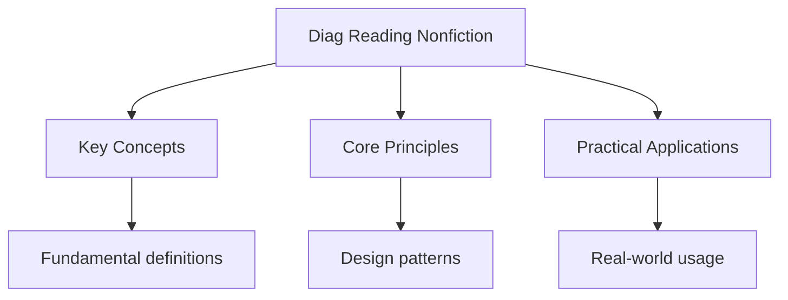

---

date: 2026-07-23T21:57:32+01:00
title: "Reading Non-Fiction -- Diagnostic Tests"
description: "Diagnostic test notes for gcse Reading Non-Fiction -- Diagnostic Tests covering key concepts, worked examples, and practice problems for exam preparation."
tableOfContents: false
---

<!-- Breadcrumb Schema for SEO -->

## Reading Non-Fiction -- Diagnostic Tests

## Unit Tests

### UT-1: Comprehension and Inference

**Question:**

Read the following article extract about urban cycling:

> When the city of Groningen in the Netherlands decided to redesign its centre in the 1970s,
> planners divided the urban area into distinct sectors. Cars were permitted within each sector but
> could not drive directly from one sector to another; instead, they had to use a ring road that
> circled the outer edge of the city. The result was radical: car traffic in the city centre dropped
> by over 70%, and cycling became the dominant mode of transport. Today, 61% of all journeys in
> Groningen are made by bicycle, compared with just 2% in most British cities. Critics argue that
> what worked in a flat Dutch city of 200,000 people cannot be transplanted to a congested
> British metropolis of millions. They may be right. But the principle behind Groningen"s approach
> -- that infrastructure determines behaviour -- is applicable everywhere.

(a) According to the text, what was the key change made to Groningen's city centre in the 1970s?

(b) State two statistics from the text that illustrate the difference in cycling rates between
Groningen and British cities.

(c) What does the writer mean by the phrase "infrastructure determines behaviour"? Use your own
words.

(d) Why does the writer include the critics' viewpoint? What is its effect on the argument?

**Solution:**

(a) Planners divided the urban area into distinct sectors. Cars were allowed within each sector but
could not drive directly between sectors; they had to use a ring road around the outer edge of the
city instead.

(b) Two statistics: "61% of all journeys in Groningen are made by bicycle" and "just 2% in most
British cities" are made by bicycle.

(c) The writer means that the way a city is designed and built -- its roads, pathways, transport
systems, and layout -- directly shapes how people choose to travel and live. If infrastructure is
designed to favour cycling (by restricting cars and creating bike-friendly routes), people will
cycle more. Conversely, if infrastructure prioritises cars, driving will dominate regardless of
individual preferences.

(d) The writer includes the critics' viewpoint to acknowledge a counterargument and demonstrate that
the argument is balanced and considered. By conceding that Groningen's specific model may not work
identically in a large British city ("They may be right"), the writer builds credibility and trust
with the reader. This makes the concluding argument -- that the underlying principle is still
applicable -- more persuasive, because the writer has shown they are not ignoring legitimate
objections.

---

<!-- Breadcrumb Schema for SEO -->

### UT-2: Analysing Rhetoric and Persuasive Techniques

**Question:**

Read the following opinion piece about school uniforms:

> School uniforms are not merely items of clothing. They are statements about belonging, about
> equality, and about the values a school chooses to uphold. When a student puts on a blazer in the
> morning, they are not dressing; they are entering a social contract that says, "I am part
> of this community, and I accept its standards." Opponents of uniforms frequently cite the cost --
> and yes, uniform policies can place a financial burden on families, particularly those with
> multiple children. This is a legitimate concern that schools must address through second-hand
> schemes and subsidised provision. But abolishing uniforms entirely would be a catastrophic
> overreaction. Without a shared standard of dress, schools risk becoming arenas of visible
> inequality, where the brands on a student's back dictate their social standing. Is that really the
> progressive outcome we want?

(a) Identify and analyse the use of the rhetorical question at the end of the extract.

(b) How does the writer use the metaphor of a "social contract" to support the argument?

(c) The writer acknowledges the counterargument about cost. Analyse how this strengthens the overall
argument.

(d) Evaluate the effectiveness of the writer's concluding sentence. How does it use language to
persuade the reader?

**Solution:**

(a) The rhetorical question "Is that really the progressive outcome we want?" is placed at the end
of the extract to leave the reader with a challenging thought. By framing the alternative to
uniforms as "visible inequality" and then questioning whether this is "progressive," the writer
forces the reader to confront the consequences of abolishing uniforms. The word "really" adds a tone
of incredulity, suggesting that the outcome is undesirable and that anyone who supports
abolition has not thought through the implications.

(b) The metaphor of a "social contract" elevates the act of wearing a uniform from a mundane
requirement to a meaningful agreement. A social contract implies mutual obligations and shared
values, suggesting that the uniform represents a two-way commitment between the student and the
school community. By framing it this way, the writer suggests that wearing a uniform is not an
imposition but a voluntary acceptance of community standards, making the argument for uniforms
appear more principled and less authoritarian.

(c) By acknowledging the counterargument about cost ("yes, uniform policies can place a financial
burden"), the writer demonstrates that they have considered opposing views fairly. This strengthens
the overall argument because it prevents the reader from dismissing the piece as one-sided. The
writer then offers a solution ("second-hand schemes and subsidised provision") that addresses the
concern without abandoning uniforms, positioning the writer as reasonable and practical rather than
dogmatic. This "concede and redirect" technique makes the subsequent argument against abolishing
uniforms seem more measured and compelling.

(d) The concluding sentence is effective because it reframes the debate. By describing the
alternative to uniforms in emotive terms ("arenas of visible inequality," "brands on a student's
back dictate their social standing"), the writer creates a vivid, negative image of a world without
uniforms. The phrase "dictate their social standing" uses strong, almost violent language
("dictate") to emphasise the severity of the consequences. The rhetorical question then invites the
reader to reject this outcome, effectively positioning the reader on the writer's side. The sentence
is persuasive because it does not restate the argument but forces the reader to visualise its
consequences.

---

<!-- Breadcrumb Schema for SEO -->

### UT-3: Summarising and Synthesising Information

**Question:**

The following passage presents information about sleep and academic performance:

> A 2022 study by the National Sleep Foundation surveyed 2,500 secondary school students across the
> UK and found that those who averaged fewer than seven hours of sleep per night scored, on average,
> 12% lower in GCSE examinations than those who slept eight or more hours. The gap was most
> pronounced in subjects requiring sustained concentration and recall, such as mathematics and the
> sciences. Researchers noted that sleep deprivation affects the hippocampus -- the brain region
> responsible for consolidating memories -- making it harder for students to retain information
> learned during the day. Furthermore, irregular sleep patterns (going to bed at widely different
> times each night) were found to be as harmful as insufficient sleep, disrupting the circadian
> rhythm and reducing the quality of deep sleep even when total hours were adequate.

(a) Summarise the main findings of the study in no more than two sentences.

(b) Explain the biological mechanism by which sleep deprivation affects academic performance,
according to the passage.

(c) According to the text, why are irregular sleep patterns harmful even when total sleep hours are
sufficient?

(d) A school is considering starting lessons at 10am instead of 8:30am to improve student
performance. Using evidence from the passage, evaluate whether later start times alone would address
the issues raised.

**Solution:**

(a) Students who sleep fewer than seven hours per night score 12% lower in GCSEs than those sleeping
eight or more hours, with the greatest impact in maths and sciences. Irregular sleep patterns are
equally harmful to performance as insufficient total sleep.

(b) Sleep deprivation affects the hippocampus, the brain region responsible for memory
consolidation. When the hippocampus is impaired by lack of sleep, students find it harder to retain
information learned during the day, which directly reduces their ability to recall material in
examinations.

(c) Irregular sleep patterns disrupt the circadian rhythm (the body's internal clock). Even when a
student gets enough total hours of sleep, going to bed at inconsistent times reduces the quality of
deep sleep, meaning the sleep obtained is less restorative and less effective at supporting memory
consolidation.

(d) Later start times alone would not fully address the issues raised in the passage. The passage
identifies two problems: insufficient total sleep (fewer than seven hours) and irregular sleep
patterns. A later start time might help students who currently get insufficient sleep because they
stay up late and have to wake early. However, it would not address irregular sleep patterns -- a
student who goes to bed at 10pm one night and 2am the next would still have a disrupted circadian
rhythm regardless of when school starts. Additionally, later start times do not directly address the
quality or quantity of deep sleep. A more effective approach would combine later start times with
education about consistent bedtime routines.

---

<!-- Breadcrumb Schema for SEO -->

## Integration Tests

### IT-1: Comparative Analysis of Non-Fiction Texts

**Question:**

Text A is from a charity's fundraising leaflet about homelessness:

> Last winter, 128,000 children in Britain woke up in temporary accommodation. Not in homes of their
> own, but in bed-and-breakfasts, hostels, and converted offices with no space to play, no space to
> study, and no space to be a child. These are not abstract statistics. They are real children with
> real names, and their futures are being shaped by the instability of their present. We believe
> that every child deserves a safe, permanent home. That is not a radical aspiration -- it is a
> basic human right.

Text B is from a government report on housing policy:

> The number of households in temporary accommodation in England reached 104,510 at the end of Q2
> 2023, representing a 10.5% increase from the previous year. Key drivers include a shortage of
> social housing stock, rising private rental costs, and increased rates of family breakdown. The
> average duration of stay in temporary accommodation has risen from 13 weeks in 2019 to 23 weeks
> in 2023. The Department for Levelling Up has allocated an additional 1.2 billion pounds to local
> authority housing budgets for the 2024-25 financial year.

(a) Compare the purpose and audience of Text A and Text B.

(b) Compare how both texts use statistics, and explain the different effects.

(c) How does Text A use emotive language to persuade, whereas Text B uses formal language to inform?
Provide specific examples.

(d) Evaluate which text is more effective for its stated purpose. Support your answer with detailed
comparison.

**Solution:**

(a) Text A has the purpose of **persuading** its audience to donate money to a homelessness charity.
Its audience is the general public, likely people who are sympathetic but have not yet donated. Text
B has the purpose of **informing** policymakers and officials about housing statistics and
government action. Its audience is civil servants, local authority leaders, and politicians who need
factual data for decision-making.

(b) Text A uses statistics for emotional impact: "128,000 children" is a large, striking number, and
the writer immediately follows it with humanising details ("Not in homes of their own, but in
bed-and-breakfasts"). The statistic is a tool to provoke outrage and sympathy. Text B uses
statistics for factual precision: "104,510," "10.5% increase," "13 weeks to 23 weeks." These are
specific, measured figures presented alongside context (drivers of the problem, budget allocations)
to enable informed policy decisions. Text A's statistics are rounded and simplified for impact; Text
B's are precise and contextualised for analysis.

(c) Text A uses emotive language to create empathy: "woke up in temporary accommodation" puts the
reader in the child's position; "no space to be a child" is a poignant, emotionally charged phrase;
"real children with real names" counters the tendency to see statistics as abstract. Text B uses
formal, impersonal language: "the number of households," "key drivers include," "allocated an
additional 1.2 billion pounds." It avoids emotional appeals entirely, relying on factual authority.
Text A's language is designed to move the reader to action; Text B's is designed to convey authority
and reliability.

(d) Both texts are effective for their respective purposes. Text A is highly effective as a
fundraising tool because it combines a startling statistic with emotionally resonant language and a
clear call to action ("every child deserves a safe, permanent home"). The direct address and
repetition of "real" create a sense of urgency. Text B is effective as a policy document because it
provides precise data, identifies causes, and reports government responses, which is exactly what
its audience needs. Text A would be ineffective for policymakers because it lacks the specific data
and analysis they require; Text B would be ineffective for fundraising because it lacks the
emotional appeal needed to motivate donations. The effectiveness of each text is inseparable from
its awareness of its audience and purpose.

---

<!-- Breadcrumb Schema for SEO -->

### IT-2: Critical Evaluation of Non-Fiction

**Question:**

Read the following article about technology in education:

> The promise of educational technology has been repeated so often that it has become a cliche:
> tablets will transform learning, apps will personalise education, and artificial intelligence will
> replace the need for human teachers. Yet after two decades of sustained investment, the evidence
> for technology's transformative effect on educational outcomes is, at best, mixed. A 2021
> meta-analysis published in the Journal of Educational Psychology examined 145 studies and found
> that technology-based interventions produced only a modest improvement in test scores -- an effect
> size of 0.15, compared to 0.40 for one-to-one tutoring by a human teacher. This does not mean
> technology is useless. Interactive simulations can make abstract concepts concrete; online
> platforms can provide access to resources in underserved communities; and automated marking
> systems can free teachers to spend more time on actual teaching. The mistake is not in adopting
> technology but in expecting it to solve problems that are fundamentally human.

(a) What is the writer's overall argument about educational technology?

(b) Analyse how the writer uses the evidence from the meta-analysis to support their argument. Why
is the comparison with human tutoring significant?

(c) How does the writer use a pattern of concession to build their argument? Identify at least two
points where this occurs.

(d) Evaluate whether the final sentence of the article is an effective conclusion. Consider its
impact on the reader.

**Solution:**

(a) The writer argues that educational technology has been overhyped and that while it offers
genuine benefits, it cannot solve problems that are fundamentally human in nature. Technology should
be adopted pragmatically for what it does well, rather than treated as a transformative solution to
all educational challenges.

(b) The meta-analysis provides empirical evidence (145 studies, published in a peer-reviewed
journal) that technology produces only "a modest improvement" (effect size 0.15). The comparison
with human tutoring (effect size 0.40) is significant because it quantifies the gap between
technological and human intervention, grounding the writer's scepticism in data. By showing that
even after two decades of investment, technology is less than half as effective as a human tutor,
the evidence undermines the "cliche" of technological transformation described in the opening
sentence.

(c) The writer uses a pattern of concession (acknowledging the opposing or alternative view before
refining the argument) at several points:

1. After criticising the hype, the writer concedes: "This does not mean technology is useless,"
   before listing specific, realistic benefits (simulations, access, automated marking).
2. The final sentence concedes the value of adoption ("The mistake is not in adopting technology")
   while redirecting the argument ("but in expecting it to solve problems that are fundamentally
   human").

This pattern makes the argument appear balanced and thoughtful, rather than anti-technology.

(d) The final sentence is highly effective as a conclusion. It distils the entire argument into a
single, memorable statement that is balanced and precise. By using a "not X but Y" structure, the
writer separates reasonable use of technology from unreasonable expectations. The phrase
"fundamentally human" is particularly powerful because it reframes the debate: the issue is not
whether technology is good or bad, but whether the problems we are trying to solve require human
qualities that technology cannot replicate. This leaves the reader with a nuanced, thought-provoking
conclusion rather than a simplistic verdict.

## Intuition

**Facts and arguments:** Non-fiction reading is like being a detective — you evaluate evidence, identify biases, and understand how writers persuade through language and structure.

**Why it matters:** From news articles to academic papers, non-fiction reading skills help you navigate information critically and form informed opinions.

**The key insight:** Every non-fiction text has a purpose — understanding the writer's intent helps you evaluate their arguments more effectively.

## Summary

The key principles covered in this topic are linked in the sub-pages above. Focus on understanding
the definitions, applying the formulas or frameworks, and evaluating strengths and limitations of
each approach.

## Worked Examples

Worked examples demonstrating the application of key concepts are covered in the detailed sub-pages
linked above.

## Common Pitfalls

- Confusing inference (reading between the lines using textual evidence) with personal opinion
  (bringing in ideas not supported by the text).
- When summarising, including too much detail or missing the key point. A good summary captures the
  main idea concisely.
- In comparative questions, describing each text separately rather than making direct comparisons
  point by point.
- Identifying persuasive techniques by name (e.g., "the writer uses a rhetorical question") without
  explaining the effect on the reader.
- Failing to address the specific wording of the question, particularly the "how" and "why"
  elements.

## See Also

- [Diagnostics](./)
- [Reading Fiction -- Diagnostic Tests](./diag-reading-fiction)
- [Creative Writing -- Diagnostic Tests](./diag-creative-writing)
