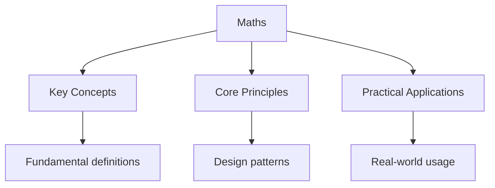

---

title: "GCSE Maths Study Guide - Wyatt's Notes"
date: 2026-05-31
description: "GCSE Maths.Md Maths Study notes covering key definitions, core concepts, worked examples, and practice questions for thorough preparation."
tags:
  - gcse
  - maths
categories:
  - gcse

---

<!-- Breadcrumb Schema for SEO -->
<script type="application/ld+json">
{
  "@context": "https://schema.org",
  "@type": "BreadcrumbList",
  "itemListElement": [{"name": "Home", "url": "https://wyattau.com"}, {"name": "gcse", "url": "https://gcse.wyattau.com"}, {"name": "Maths", "url": "https://gcse.wyattau.com/maths"}]
}
</script>

## GCSE Maths Study Guide

A complete single-page revision guide covering the full GCSE Mathematics specification. Each
section contains key concepts, worked methods, and essential facts. Use this alongside the
[full topic pages](maths/) for detailed proofs and further practice.

---

<!-- Breadcrumb Schema for SEO -->
<script type="application/ld+json">
{
  "@context": "https://schema.org",
  "@type": "BreadcrumbList",
  "itemListElement": [{"name": "Home", "url": "https://wyattau.com"}, {"name": "gcse", "url": "https://gcse.wyattau.com"}, {"name": "Maths", "url": "https://gcse.wyattau.com/maths"}]
}
</script>

## 1. Number

### 1.1 Fractions

**Adding and subtracting:** Find a common denominator, then add/subtract the numerators.

$$\frac{a}{b} + \frac{c}{d} = \frac{ad + bc}{bd}$$

$$\frac{5}{6} + \frac{3}{8} = \frac{20 + 9}{24} = \frac{29}{24} = 1\frac{5}{24}$$

**Multiplying:** Multiply numerators together and denominators together, then simplify.

$$\frac{a}{b} \times \frac{c}{d} = \frac{ac}{bd}$$

$$\frac{3}{4} \times \frac{5}{7} = \frac{15}{28}$$

**Dividing:** Flip the second fraction (find its reciprocal) and multiply.

$$\frac{a}{b} \div \frac{c}{d} = \frac{a}{b} \times \frac{d}{c} = \frac{ad}{bc}$$

**Simplifying:** Divide numerator and denominator by their highest common factor (HCF).

$$\frac{12}{18} = \frac{12 \div 6}{18 \div 6} = \frac{2}{3}$$

### 1.2 Decimals

- **Recurring decimals to fractions:** Let $x = 0.\dot{3}$, then $10x = 3.\dot{3}$, so $9x = 3$ and
  $x = \frac{3}{9} = \frac{1}{3}$.
- For $0.\overline{16}$: let $x = 0.\overline{16}$, then $100x = 16.\overline{16}$, so $99x = 16$ and
  $x = \frac{16}{99}$.

### 1.3 Percentages

**Finding a percentage:** $\text{percentage} = \frac{\text{part}}{\text{whole}} \times 100$

**Percentage change:** $\text{percentage change} = \frac{\text{new} - \text{original}}{\text{original}} \times 100$

**Reverse percentages:** To find the original after a percentage increase:
$\text{original} = \frac{\text{new value}}{1 + \frac{\text{percentage}}{100}}$

After a decrease: $\text{original} = \frac{\text{new value}}{1 - \frac{\text{percentage}}{100}}$

**Example.** A shirt costs £54 after a 20% discount. Original price:
$\frac{54}{1 - 0.20} = \frac{54}{0.80} = £67.50$

### 1.4 Ratio and Proportion

**Simplifying ratios:** Divide all parts by the HCF. $\;12 : 18 = 2 : 3$

**Sharing in a ratio:** To split £60 in the ratio $2 : 3$:
Total parts $= 2 + 3 = 5$. One part $= 60 \div 5 = 12$. Shares are $£24$ and $£36$.

**Direct proportion:** $y = kx$ for some constant $k$.

**Inverse proportion:** $y = \frac{k}{x}$ for some constant $k$.

### 1.5 Compound Interest and Depreciation

$$\text{Amount} = P\left(1 \pm \frac{r}{100}\right)^n$$

Where $P$ is principal, $r$ is the rate per period, and $n$ is the number of periods. Use $+$ for growth,
$-$ for decay.

**Example.** £5000 invested at 3% compound interest for 4 years:
$5000 \times 1.03^4 = £5627.54$

### 1.6 Standard Form

A number in standard form is $A \times 10^n$ where $1 \leq A < 10$ and $n$ is an integer.

- $4\,500\,000 = 4.5 \times 10^6$
- $0.00032 = 3.2 \times 10^{-4}$

**Calculations:** Multiply the $A$ values, add the powers of 10.

$$(2.4 \times 10^5) \times (3 \times 10^3) = 7.2 \times 10^8$$

### 1.7 Bounds

If a length is given as $8.3 \text{ cm}$ to the nearest $0.1 \text{ cm}$:

- Upper bound = $8.35 \text{ cm}$
- Lower bound = $8.25 \text{ cm}$

For calculated values, combine bounds appropriately:

- Maximum area: use upper bounds for all lengths
- Minimum area: use lower bounds for all lengths

---

<!-- Breadcrumb Schema for SEO -->
<script type="application/ld+json">
{
  "@context": "https://schema.org",
  "@type": "BreadcrumbList",
  "itemListElement": [{"name": "Home", "url": "https://wyattau.com"}, {"name": "gcse", "url": "https://gcse.wyattau.com"}, {"name": "Maths", "url": "https://gcse.wyattau.com/maths"}]
}
</script>

## 2. Algebra

### 2.1 Simplifying Expressions

**Collecting like terms:** $3x + 5y - 2x + 4y = x + 9y$

**Using indices laws:**

$$a^m \times a^n = a^{m+n} \qquad \frac{a^m}{a^n} = a^{m-n} \qquad (a^m)^n = a^{mn}$$

$$a^0 = 1 \qquad a^{-n} = \frac{1}{a^n} \qquad a^{\frac{1}{n}} = \sqrt[n]{a}$$

### 2.2 Expanding Brackets

**Single bracket:** $3(2x - 5) = 6x - 15$

**Double brackets:**

$$(x + 3)(x + 7) = x^2 + 7x + 3x + 21 = x^2 + 10x + 21$$

**Difference of two squares:**

$$(a + b)(a - b) = a^2 - b^2$$

### 2.3 Factorising

**Common factor:** $6x^2 + 9x = 3x(2x + 3)$

**Quadratic (two brackets):** $x^2 + 5x + 6 = (x + 2)(x + 3)$

**Difference of two squares:** $x^2 - 25 = (x + 5)(x - 5)$

**Harder quadratics:** $2x^2 + 7x + 3 = (2x + 1)(x + 3)$

### 2.4 Solving Equations

**Linear equations:**

$$3x - 7 = 2x + 5 \implies x = 12$$

**Quadratic equations by factorising:**

$$x^2 + 5x + 6 = 0 \implies (x + 2)(x + 3) = 0 \implies x = -2 \text{ or } x = -3$$

**Quadratic formula:**

$$x = \frac{-b \pm \sqrt{b^2 - 4ac}}{2a}$$

For $ax^2 + bx + c = 0$. The discriminant $\Delta = b^2 - 4ac$ tells you the number of real solutions:
$\Delta > 0$: two solutions, $\Delta = 0$: one solution, $\Delta < 0$: no real solutions.

### 2.5 Inequalities

Solve like equations but **flip the sign** when multiplying or dividing by a negative number.

$$-3x \leq 9 \implies x \geq -3$$

**Showing inequalities on a number line:** Closed circle for $\leq$ or $\geq$; open circle for $<$ or $>$.

### 2.6 Sequences

**Finding the $n$th term of an arithmetic sequence:**

For the sequence $5, 8, 11, 14, \ldots$ the common difference is $3$, so:

$$u_n = 3n + 2$$

**Quadratic sequences:** The second differences are constant. Halve the second difference to get the
coefficient of $n^2$.

### 2.7 Simultaneous Equations

**Elimination method:** Multiply one or both equations to make coefficients equal, then add or subtract.

$$2x + y = 7 \quad \text{and} \quad x - y = 2$$

Adding: $3x = 9 \implies x = 3$, then $y = 1$.

**Substitution method:** Rearrange one equation, substitute into the other. Essential when one equation
is non-linear.

### 2.8 Rearranging Formulae

Apply inverse operations to isolate the required subject. Treat all other letters like numbers.

**Example.** Make $a$ the subject of $v = u + at$:

$$v - u = at \implies a = \frac{v - u}{t}$$

### 2.9 Functions

A function maps each input to exactly one output. $f(x) = 2x + 3$ means $f(4) = 11$.

**Composite functions:** $(fg)(x) = f(g(x))$. Apply $g$ first, then $f$.

**Inverse functions:** $f^{-1}(x)$ reverses $f(x)$. If $f(x) = 2x + 3$, then $f^{-1}(x) = \frac{x - 3}{2}$.

---

<!-- Breadcrumb Schema for SEO -->
<script type="application/ld+json">
{
  "@context": "https://schema.org",
  "@type": "BreadcrumbList",
  "itemListElement": [{"name": "Home", "url": "https://wyattau.com"}, {"name": "gcse", "url": "https://gcse.wyattau.com"}, {"name": "Maths", "url": "https://gcse.wyattau.com/maths"}]
}
</script>

## 3. Geometry

### 3.1 Angles

**Parallel lines:**

- Corresponding angles are equal (F-shape)
- Alternate angles are equal (Z-shape)
- Co-interior (allied) angles sum to $180°$ (U-shape)

**Triangles:** Interior angles sum to $180°$.

**Polygons:** Interior angle sum $= (n - 2) \times 180°$ where $n$ is the number of sides.
Each interior angle of a regular polygon $= \frac{(n - 2) \times 180°}{n}$.

**Exterior angles:** Sum to $360°$ for any polygon. Each exterior angle of a regular polygon $= \frac{360°}{n}$.

### 3.2 Circles

$$\text{Circumference} = \pi d = 2\pi r$$

$$\text{Area} = \pi r^2$$

**Arc length:** $\text{arc} = \frac{\theta}{360} \times 2\pi r$ where $\theta$ is the angle of the sector.

**Sector area:** $\text{area} = \frac{\theta}{360} \times \pi r^2$

### 3.3 Pythagoras" Theorem

In a right-angled triangle, the square of the hypotenuse equals the sum of the squares of the other two
sides.

$$a^2 + b^2 = c^2$$

where $c$ is the hypotenuse.

### 3.4 Trigonometry — SOH CAH TOA

$$\sin \theta = \frac{\text{opposite}}{\text{hypotenuse}} \qquad \cos \theta = \frac{\text{adjacent}}{\text{hypotenuse}} \qquad \tan \theta = \frac{\text{opposite}}{\text{adjacent}}$$

**Sine rule (non-right-angled triangles):**

$$\frac{a}{\sin A} = \frac{b}{\sin B} = \frac{c}{\sin C}$$

Use when you know an angle and its opposite side.

**Cosine rule:**

$$a^2 = b^2 + c^2 - 2bc \cos A$$

Use when you know two sides and the included angle, or all three sides.

**Area of a triangle:**

$$\text{Area} = \frac{1}{2}ab \sin C$$

### 3.5 Transformations

| Transformation | Description |
| --- | --- |
| **Translation** | Movement by a vector $\begin{pmatrix} x \\ y \end{pmatrix}$ |
| **Rotation** | Turn about a centre by a given angle and direction |
| **Reflection** | Mirror image across a given line of symmetry |
| **Enlargement** | Scale factor $k$ from a centre of enlargement; lengths multiply by $k$, areas by $k^2$, volumes by $k^3$ |

### 3.6 Vectors

A vector has both magnitude and direction.

$$\mathbf{a} = \begin{pmatrix} 3 \\ 4 \end{pmatrix}$$

**Magnitude:** $|\mathbf{a}| = \sqrt{3^2 + 4^2} = 5$

**Addition:** $\begin{pmatrix} a \\ b \end{pmatrix} + \begin{pmatrix} c \\ d \end{pmatrix} = \begin{pmatrix} a + c \\ b + d \end{pmatrix}$

**Scalar multiplication:** $k\begin{pmatrix} a \\ b \end{pmatrix} = \begin{pmatrix} ka \\ kb \end{pmatrix}$

**Column vector travel:** $\mathbf{AB}$ represents the vector from point $A$ to point $B$.
$\mathbf{AB} = \mathbf{OB} - \mathbf{OA}$.

---

<!-- Breadcrumb Schema for SEO -->
<script type="application/ld+json">
{
  "@context": "https://schema.org",
  "@type": "BreadcrumbList",
  "itemListElement": [{"name": "Home", "url": "https://wyattau.com"}, {"name": "gcse", "url": "https://gcse.wyattau.com"}, {"name": "Maths", "url": "https://gcse.wyattau.com/maths"}]
}
</script>

## 4. Statistics

### 4.1 Averages

| Measure | Definition |
| --- | --- |
| **Mean** | $\bar{x} = \frac{\text{sum of values}}{\text{number of values}}$ |
| **Median** | The middle value when data is arranged in order |
| **Mode** | The most common value |
| **Range** | $\text{largest value} - \text{smallest value}$ |

### 4.2 Grouped Data

For grouped frequency tables, use the midpoint of each class as an estimate:

$$\text{Estimated mean} = \frac{\sum f \times m}{\sum f}$$

where $f$ is the frequency and $m$ is the class midpoint.

### 4.3 Frequency Tables and Charts

- **Frequency polygon:** Plot the midpoint of each class against its frequency, join with straight lines.
- **Bar chart:** Height of each bar represents the frequency; gaps between bars for discrete data, no gaps for continuous data.

### 4.4 Scatter Graphs

- Points plotted to show the relationship between two variables.
- **Correlation:** Positive, negative, or none.
- **Line of best fit:** Drawn by eye, passing through as many points as possible with equal numbers on each side.
- **Interpolation:** Reading values within the data range (reliable).
- **Extrapolation:** Reading values outside the data range (unreliable).

### 4.5 Cumulative Frequency

- **Cumulative frequency:** The running total of frequencies.
- Plot cumulative frequency against the upper class boundary.
- **Median:** Read off at 50% of the total frequency.
- **Lower quartile ($Q_1$):** 25% of the total frequency.
- **Upper quartile ($Q_3$):** 75% of the total frequency.
- **Interquartile range (IQR):** $Q_3 - Q_1$.

### 4.6 Box Plots

A box plot displays five key values: minimum, $Q_1$, median, $Q_3$, maximum.

```
min |----[ Q1 | median | Q3 ]----| max
```

Compare distributions by commenting on the median, IQR (spread), and overall range.

### 4.7 Probability

$$P(\text{event}) = \frac{\text{number of favourable outcomes}}{\text{total number of outcomes}}$$

**Rules:**

- $0 \leq P(E) \leq 1$
- $P(\text{not }E) = 1 - P(E)$
- $P(A \text{ or } B) = P(A) + P(B) - P(A \text{ and } B)$ for mutually exclusive events: $P(A \text{ or } B) = P(A) + P(B)$
- For independent events: $P(A \text{ and } B) = P(A) \times P(B)$

**Tree diagrams:** Multiply along branches for combined events; add between branches for mutually exclusive outcomes.

**Conditional probability:** The probability of event $B$ given event $A$ has occurred:

$$P(B \mid A) = \frac{P(A \text{ and } B)}{P(A)}$$

---

<!-- Breadcrumb Schema for SEO -->
<script type="application/ld+json">
{
  "@context": "https://schema.org",
  "@type": "BreadcrumbList",
  "itemListElement": [{"name": "Home", "url": "https://wyattau.com"}, {"name": "gcse", "url": "https://gcse.wyattau.com"}, {"name": "Maths", "url": "https://gcse.wyattau.com/maths"}]
}
</script>

## 5. Key Formulas

### Geometry

| Formula | Value |
| --- | --- |
| Circumference | $C = \pi d = 2\pi r$ |
| Area of a circle | $A = \pi r^2$ |
| Pythagoras' theorem | $a^2 + b^2 = c^2$ |
| Area of a triangle | $A = \frac{1}{2}bh = \frac{1}{2}ab\sin C$ |
| Sine rule | $\frac{a}{\sin A} = \frac{b}{\sin B} = \frac{c}{\sin C}$ |
| Cosine rule | $a^2 = b^2 + c^2 - 2bc\cos A$ |
| Arc length | $\text{arc} = \frac{\theta}{360} \times 2\pi r$ |
| Sector area | $A = \frac{\theta}{360} \times \pi r^2$ |
| Volume of a cuboid | $V = lwh$ |
| Volume of a cylinder | $V = \pi r^2 h$ |
| Volume of a cone | $V = \frac{1}{3}\pi r^2 h$ |
| Volume of a sphere | $V = \frac{4}{3}\pi r^3$ |
| Surface area of a sphere | $A = 4\pi r^2$ |
| Surface area of a cylinder | $A = 2\pi r^2 + 2\pi r h$ |

### Algebra

| Formula | Value |
| --- | --- |
| Quadratic formula | $x = \frac{-b \pm \sqrt{b^2 - 4ac}}{2a}$ |
| Discriminant | $\Delta = b^2 - 4ac$ |
| Compound interest | $A = P\left(1 \pm \frac{r}{100}\right)^n$ |

### Number

| Formula | Value |
| --- | --- |
| Density | $\rho = \frac{m}{V}$ |
| Speed | $s = \frac{d}{t}$ |
| Pressure | $p = \frac{F}{A}$ |

---

<!-- Breadcrumb Schema for SEO -->
<script type="application/ld+json">
{
  "@context": "https://schema.org",
  "@type": "BreadcrumbList",
  "itemListElement": [{"name": "Home", "url": "https://wyattau.com"}, {"name": "gcse", "url": "https://gcse.wyattau.com"}, {"name": "Maths", "url": "https://gcse.wyattau.com/maths"}]
}
</script>

## 6. Exam Tips

1. **Show all working.** Method marks are awarded even if the final answer is wrong. An answer with no working shown scores zero if incorrect.

2. **Read the question twice.** Identify exactly what is being asked. Many marks are lost by answering a slightly different question from the one on the paper. Look for phrases like "give your answer in surd form" or "correct to 3 significant figures".

3. **Check your answer makes sense.** If asked for the length of a triangle's side and you get a negative number, something is wrong. Use estimation to verify: $4.7 \times 3.1 \approx 5 \times 3 = 15$.

4. **Use the calculator paper to your advantage.** On Paper 2 (calculator), use the fraction button, check answers with inverse operations, and use the answer function (ANS) to store intermediate results to avoid rounding errors.

5. **Draw diagrams.** Even when not required, a quick sketch for geometry, vectors, or probability questions can reveal relationships that are hard to spot in words alone.

6. **Manage time carefully.** Roughly 1 mark per minute is a good guide. If a question is worth 1 mark, do not spend more than 1 minute on it. Move on and come back to difficult questions at the end.

7. **Know what is given and what is not.** The formula sheet provides some formulas but not all. Memorise the quadratic formula, area and volume formulas, trigonometric ratios, and compound interest. These are not always provided.

---

<!-- Breadcrumb Schema for SEO -->
<script type="application/ld+json">
{
  "@context": "https://schema.org",
  "@type": "BreadcrumbList",
  "itemListElement": [{"name": "Home", "url": "https://wyattau.com"}, {"name": "gcse", "url": "https://gcse.wyattau.com"}, {"name": "Maths", "url": "https://gcse.wyattau.com/maths"}]
}
</script>

## Common Pitfalls

1. **Cancelling incorrectly in fractions.** $\frac{a + b}{a + c} \neq \frac{b}{c}$. You cannot cancel terms across addition -- only factors can be cancelled.
2. **Forgetting the negative sign when squaring.** $(-3)^2 = 9$, not $-9$. The square of any real number is non-negative.
3. **Confusing the radius and diameter.** The area formula uses $r^2$ not $d^2$. Always check whether a question gives you the radius or the diameter before substituting.
4. **Rounding too early in multi-step calculations.** Carry forward the full calculator value and round only the final answer.
5. **Writing inequalities the wrong way round.** When multiplying or dividing an inequality by a negative number, reverse the inequality sign.
6. **Using the wrong trigonometric ratio.** Always label the triangle first, then apply SOH CAH TOA systematically.
7. **Forgetting units in the final answer.** Always include correct units.

## Intuition

GCSE Maths is like learning a musical instrument -- you need both theory (formulas, rules) and practice (working through problems). The formulas are your scales: you must know them fluently so that when you see a problem, you reach for the right tool automatically. Estimation is your ear for music: it tells you whether your answer sounds right before you check the details. The discriminant is like a weather forecast for quadratic equations: positive means two solutions, zero means one, negative means none. Showing your working is like playing with sheet music visible -- the examiner awards method marks even when the final note is wrong.

## Worked Examples

### Example 1: Solving a Quadratic by Factorising

**Problem:** Solve x^2 - 5x + 6 = 0.
**Solution:** Find two numbers that multiply to 6 and add to -5: -2 and -3. Factorise: (x - 2)(x - 3) = 0. Therefore x = 2 or x = 3.

### Example 2: Using the Sine Rule

**Problem:** In triangle ABC, angle A = 42 degrees, angle B = 67 degrees, side a = 8 cm. Find side b.
**Solution:** Angle C = 180 - 42 - 67 = 71 degrees. By the sine rule: b/sin(67) = 8/sin(42). b = 8 x sin(67) / sin(42) = 8 x 0.921 / 0.669 = 11.0 cm (to 3 s.f.).

### Example 3: Tree Diagram Probability

**Problem:** A bag contains 3 red and 2 blue counters. Two counters are drawn without replacement. Find the probability that both are red.
**Solution:** P(first red) = 3/5. P(second red | first red) = 2/4 = 1/2. P(both red) = 3/5 x 1/2 = 3/10.




## Summary

GCSE Mathematics covers number (fractions, decimals, percentages, ratio, standard form, bounds), algebra (simplifying, expanding, factorising, solving equations, inequalities, sequences, functions, graphs), geometry (angles, circles, Pythagoras, trigonometry, transformations, vectors), and statistics (averages, grouped data, scatter graphs, cumulative frequency, box plots, probability, tree diagrams, conditional probability). Key exam skills include showing all working, reading questions twice to identify exact requirements, estimating answers to check reasonableness, and managing time at roughly one mark per minute.

## Cross-References

- **[Practice Maths](maths/practice-maths):** Interactive practice problems covering number, algebra, geometry, and statistics.
- **[Maths Question Bank](maths-question-bank):** Additional practice questions organized by topic.
- **[Chemistry](chemistry/):** Chemistry notes that use mathematical skills for quantitative calculations.
