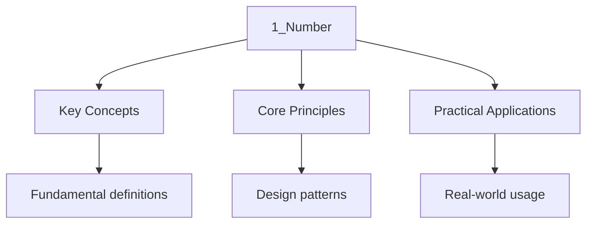

---

title: "Number | GCSE - Wyatt's Notes"
description: 'Number: comprehensive educational content notes with precise definitions, worked examples, common pitfalls, and practice problems.'
date: 2026-04-14
tags:
  - gcse
  - gcse-maths
categories:
  - gcse-maths

---

<!-- Breadcrumb Schema for SEO -->

## Number

:::note
1
:::
## 1. Types of Number

### 1.1 The Number System

The real numbers can be classified into several nested subsets. Understanding these classifications
Is essential for working with the number system fluently.

**Definition.** The set of **natural numbers** is $\mathbb{N} = \{1, 2, 3, \ldots\}$. The set of
**integers** is $\mathbb{Z} = \{\ldots, -2, -1, 0, 1, 2, \ldots\}$.

A **rational number** is any number that can be expressed as $\frac{p}{q}$ where $p \in \mathbb{Z}$
$q \in \mathbb{Z} \setminus \{0\}$ And $p$ and $q$ have no common factors other than 1 (i.e. The
Fraction is in its **lowest terms**).

An **irrational number** is a real number that cannot be expressed as a fraction of two integers.
Key examples include $\sqrt{2}$, $\pi$ And $e$.

**Theorem.** $\sqrt{2}$ is irrational.

**Proof.** Suppose for contradiction that $\sqrt{2} = \frac{p}{q}$ where $p$ and $q$ are coprime
Integers with $q \neq 0$. Then:

$$2 = \frac{p^2}{q^2} \implies p^2 = 2q^2$$

Since $p^2$ is even, $p$ must be even. Write $p = 2k$ for some integer $k$. Then:

$$4k^2 = 2q^2 \implies q^2 = 2k^2$$

So $q^2$ is also even, meaning $q$ is even. But this contradicts the assumption that $p$ and $q$ are
Coprime. Therefore $\sqrt{2}$ is irrational. $\blacksquare$

**Theorem.** $\sqrt{3}$ is irrational.

**Proof.** Suppose $\sqrt{3} = \frac{p}{q}$ in lowest terms. Then $p^2 = 3q^2$ So $3 \mid p^2$ Hence
$3 \mid p$ (since 3 is prime). Write $p = 3k$: $9k^2 = 3q^2$ So $q^2 = 3k^2$Giving $3 \mid q$. This
contradicts coprimality. $\blacksquare$

This technique generalises: for any prime $p$, $\sqrt{p}$ is irrational. The proof structure is
Identical in every case.

**Proposition.** The sum of a rational and an irrational number is irrational.

**Proof.** Let $r \in \mathbb{Q}$ and $s \notin \mathbb{Q}$. Suppose $r + s = q \in \mathbb{Q}$.
Then $s = q - r \in \mathbb{Q}$ (since rationals are closed under subtraction), contradicting the
Irrationality of $s$. $\blacksquare$

**Proposition.** The product of a non-zero rational and an irrational number is irrational.

**Proof.** Let $r \in \mathbb{Q} \setminus \{0\}$ and $s \notin \mathbb{Q}$. Suppose
$rs = q \in
\mathbb{Q}$. Then $S = \frac{q}{r} \in \mathbb{Q}$ (since $R \neq 0$), a contradiction.
$\blacksquare$

:::caution
$\sqrt{2} \times \sqrt{2} = 2$. The sum of two irrational numbers can also be rational:
$(1 + \sqrt{2}) + (1 - \sqrt{2}) = 2$.
:::
### 1.2 Prime Numbers and Factorisation

**Definition.** A **prime number** is a natural number greater than 1 that has exactly two factors:
1 and itself.

The prime numbers below 30 are: 2, 3, 5, 7, 11, 13, 17, 19, 23, 29.

**Theorem (Fundamental Theorem of Arithmetic).** Every integer greater than 1 can be written as a
Unique product of prime numbers, up to the order of the factors.

This uniqueness is surprisingly powerful. It underpins the entire theory of divisibility and is the
Reason prime factorisation is such a central tool.

**Example.** Write $1260$ as a product of primes.

$$1260 = 126 \times 10 = (63 \times 2) \times (2 \times 5) = (7 \times 9) \times 2^2 \times 5 = 2^2 \times 3^2 \times 5 \times 7$$

**Example.** Write $3960$ as a product of primes.

$$3960 = 396 \times 10 = (4 \times 99) \times (2 \times 5) = 2^2 \times 9 \times 11 \times 2 \times 5 = 2^3 \times 3^2 \times 5 \times 11$$

**Theorem (Euclid).** There are infinitely many prime numbers.

**Proof.** Suppose there are finitely many primes $p_1, p_2, \ldots, p_n$. Consider
$N = p_1 p_2
\cdots p_n + 1$. For each prime $P_i$, $N$ leaves remainder 1 when divided by $P_i$, so
No $p_i$ divides $N$. Either $N$ is prime (contradicting that the list was complete) or $N$ has a
Prime factor not in the list (also a contradiction). $\blacksquare$

### 1.3 Highest Common Factor and Lowest Common Multiple

Given two integers $a$ and $b$Their **highest common factor** (HCF) is the largest integer that
Divides both $a$ and $b$. Their **lowest common multiple** (LCM) is the smallest positive integer
That is a multiple of both.

If the prime factorisations are $a = p_1^{\alpha_1} p_2^{\alpha_2} \cdots$ and
$b = p_1^{\beta_1} p_2^{\beta_2} \cdots$ Then:

$$\mathrm{HCF(a, b) = p_1^{\min(\alpha_1, \beta_1)} p_2^{\min(\alpha_2, \beta_2)} \cdots$$

$$\mathrm{LCM(a, b) = p_1^{\max(\alpha_1, \beta_1)} p_2^{\max(\alpha_2, \beta_2)} \cdots$$

**Relationship:** For any positive integers $a$ and $b$:

$$\mathrm{HCF(a, b) \times \mathrm{LCM(a, b) = a \times b$$

**Proof of the relationship.** Write $a = \prod p_i^{\alpha_i}$ and $b = \prod p_i^{\beta_i}$. Then:

$$\mathrm{HCF \times \mathrm{LCM = \prod p_i^{\min(\alpha_i, \beta_i)} \cdot \prod p_i^{\max(\alpha_i, \beta_i)} = \prod p_i^{\min(\alpha_i, \beta_i) + \max(\alpha_i, \beta_i)} = \prod p_i^{\alpha_i + \beta_i} = ab \quad \blacksquare$$

**Worked Example.** Find the HCF and LCM of $84$ and $210$.

$$84 = 2^2 \times 3 \times 7, \qquad 210 = 2 \times 3 \times 5 \times 7$$

$$\mathrm{HCF = 2^{\min(2,1)} \times 3^{\min(1,1)} \times 5^{\min(0,1)} \times 7^{\min(1,1)} = 2 \times 3 \times 7 = 42$$

$$\mathrm{LCM = 2^{\max(2,1)} \times 3^{\max(1,1)} \times 5^{\max(0,1)} \times 7^{\max(1,1)} = 2^2 \times 3 \times 5 \times 7 = 420$$

**Verification:** $42 \times 420 = 17640 = 84 \times 210$. $\checkmark$

**Worked Example (Higher Tier).** Find the HCF and LCM of $180$, $252$ And $396$.

$$180 = 2^2 \times 3^2 \times 5, \qquad 252 = 2^2 \times 3^2 \times 7, \qquad 396 = 2^2 \times 3^2 \times 11$$

$$\mathrm{HCF = 2^2 \times 3^2 = 36$$

$$\mathrm{LCM = 2^2 \times 3^2 \times 5 \times 7 \times 11 = 4 \times 9 \times 385 = 13860$$

### 1.4 Divisibility Tests and Prime Testing

To test whether a number $n$ is prime, you only need to check divisibility by primes up to
$\sqrt{n}$. If none divide $n$ Then $n$ is prime.

**Worked Example.** Is $211$ prime?

$\sqrt{211} \approx 14.5$ So we check primes up to $13$: 2, 3, 5, 7, 11, 13.

- Not divisible by 2 (odd), 3 (digit sum $= 4$), or 5 (does not end in 0 or 5).
- $211 = 30 \times 7 + 1$Not divisible by 7.
- $211 = 19 \times 11 + 2$Not divisible by 11.
- $211 = 16 \times 13 + 3$Not divisible by 13.

Therefore $211$ is prime.

## 2. Fractions, Decimals, and Percentages

### 2.1 Fraction Arithmetic

**Addition and subtraction:** $\frac{a}{b} \pm \frac{c}{d} = \frac{ad \pm bc}{bd}$

**Multiplication:** $\frac{a}{b} \times \frac{c}{d} = \frac{ac}{bd}$

**Division:** $\frac{a}{b} \div \frac{c}{d} = \frac{a}{b} \times \frac{d}{c} = \frac{ad}{bc}$

**Worked Example.** Evaluate $\frac{3}{4} + \frac{2}{5} - \frac{1}{3}$.

$$\frac{3}{4} + \frac{2}{5} - \frac{1}{3} = \frac{45 + 24 - 20}{60} = \frac{49}{60}$$

**Worked Example (Higher Tier).** Simplify $\frac{2\frac{3}{4}}{1\frac{1}{3}}$.

Convert to improper fractions:
$\frac{11}{4} \div \frac{4}{3} = \frac{11}{4} \times \frac{3}{4} = \frac{33}{16}$.

**Worked Example (Higher Tier).** Evaluate $\left(\frac{2}{3}\right)^{-2} \times \frac{9}{16}$.

$$\left(\frac{3}{2}\right)^2 \times \frac{9}{16} = \frac{9}{4} \times \frac{9}{16} = \frac{81}{64}$$

### 2.2 Recurring Decimals to Fractions

A **recurring decimal** has digits that repeat infinitely. We can convert these to exact fractions
Using algebra.

**Worked Example.** Convert $0.\dot{3}\dot{6}$ to a fraction.

Let $x = 0.363636\ldots$

The repeating block has 2 digits, so multiply by 100:

$$100x = 36.363636\ldots$$

$$x = 0.363636\ldots$$

Subtracting: $99x = 36$ So $x = \frac{36}{99} = \frac{4}{11}$.

**General rule:** If the repeating block has $n$ digits, multiply by $10^n$Subtract the original,
And simplify.

**Worked Example (Higher Tier).** Convert $0.1\dot{6}\dot{3}$ to a fraction.

Let $x = 0.163163163\ldots$

The repeating block has 3 digits, so multiply by 1000:

$$1000x = 163.163163\ldots$$

$$x = 0.163163\ldots$$

$$999x = 163 \implies x = \frac{163}{999}$$

Check: $\gcd(163, 999)$. Since $163$ is prime and $999 = 3^3 \times 37$They are coprime. So
$x = \frac{163}{999}$.

**Worked Example.** Convert $0.4\dot{7}$ to a fraction.

Here one digit ($4$) does not repeat and two digits ($7$) repeat. Let $x = 0.47777\ldots$

Multiply by 10: $10x = 4.7777\ldots$

Multiply by 100: $100x = 47.7777\ldots$

Subtract: $90x = 43 \implies x = \frac{43}{90}$.

### 2.3 Percentages

A percentage represents a fraction out of 100. The key operations are:

- **Percentage of an amount:** $P\%$ of $A = \frac{P}{100} \times A$
- **Percentage change:** $\frac{\mathrm{change}{\mathrm{original} \times 100\%$
- **Percentage increase/decrease:**
  $\mathrm{new = \mathrm{original \times \left(1 \pm \frac{P}{100}\right)$

**Worked Example.** A coat costs 120 pounds. It is reduced by 15% in a sale, then the sale price is
Increased by 15%. What is the final price?

After the reduction: $120 \times 0.85 = 102$ pounds.

After the increase: $102 \times 1.15 = 117.30$ pounds.

:::caution
Second percentage is applied to a smaller base.
:::
**Theorem.** A percentage increase of $P\%$ followed by a percentage decrease of $P\%$ (or vice
Versa) always results in a net decrease. The net effect is a decrease of $\frac{P^2}{100}\%$.

**Proof.** The factor for increase is $\left(1 + \frac{P}{100}\right)$ and for decrease is
$\left(1 - \frac{P}{100}\right)$. The combined factor is:

$$\left(1 + \frac{P}{100}\right)\left(1 - \frac{P}{100}\right) = 1 - \frac{P^2}{10000}$$

This is always less than 1 for $P \neq 0$Confirming a net decrease of $\frac{P^2}{100}\%$.
$\blacksquare$

**Worked Example (Higher Tier).** A quantity increases by 20% one year and decreases by 20% the
Next. What is the overall percentage change?

Combined factor: $1.2 \times 0.8 = 0.96$A net decrease of 4%.

By the theorem: $\frac{20^2}{100} = 4\%$ decrease. $\checkmark$

### 2.4 Reverse Percentages

**Worked Example.** After a 20% increase, a price is 336 pounds. Find the original price.

The original price is $100\%$ And after the increase it is $120\%$. So:

$$\mathrm{original = \frac{336}{1.20} = 280 \mathrm{ pounds$$

**Worked Example (Higher Tier).** A shop offers "15% off the sale price." A customer pays 34 pounds.
What was the original price before the sale?

The customer pays 85% of the sale price. Sale price $= \frac{34}{0.85} = 40$ pounds.

If the sale itself was, say, a 20% discount on the original: original $= \frac{40}{0.80} = 50$
Pounds.

### 2.5 Compound Interest and Depreciation

For compound growth at rate $r\%$ per period over $n$ periods:

$$A = P\left(1 + \frac{r}{100}\right)^n$$

For depreciation:

$$A = P\left(1 - \frac{r}{100}\right)^n$$

**Worked Example.** 2000 pounds is invested at 3.5% compound interest per year. Find the value after
6 years, giving your answer to the nearest penny.

$$A = 2000 \times 1.035^6 = 2000 \times 1.22925\ldots = 2458.51 \mathrm{ pounds$$

**Worked Example (Higher Tier).** A car bought for 18000 pounds depreciates at 12% per annum. After
How many whole years will its value first fall below 8000 pounds?

We need $18000 \times 0.88^n \lt 8000$ So $0.88^n \lt \frac{8000}{18000} = \frac{4}{9}$.

Taking logarithms: $n \ln 0.88 \lt \ln\!\left(\frac{4}{9}\right)$.

Since $\ln 0.88 \lt 0$The inequality reverses:
$n \gt \frac{\ln(4/9)}{\ln 0.88} = \frac{-0.811}{-0.128} \approx 6.33$.

So after 7 years the value first falls below 8000 pounds.

**Worked Example.** 5000 pounds is invested at 4% compound interest. Find the total interest earned
After 3 years.

$$A = 5000 \times 1.04^3 = 5000 \times 1.124864 = 5624.32 \mathrm{ pounds$$

Total interest $= 5624.32 - 5000 = 624.32$ pounds.

## 3. Indices and Surds

### 3.1 Laws of Indices

For positive integers $m$ and $n$ And non-zero base $a$:

| Law                | Expression                             |
| ------------------ | -------------------------------------- |
| Multiplication     | $a^m \times a^n = a^{m+n}$             |
| Division           | $a^m \div a^n = a^{m-n}$               |
| Power of a power   | $(a^m)^n = a^{mn}$                     |
| Power of a product | $(ab)^n = a^n b^n$                     |
| Negative index     | $a^{-n} = \frac{1}{a^n}$               |
| Zero index         | $a^0 = 1$                              |
| Fractional index   | $a^{1/n} = \sqrt[n]{a}$                |
| Mixed fractional   | $a^{m/n} = \left(\sqrt[n]{a}\right)^m$ |

**Why $a^0 = 1$:** Consider $a^m \div a^m = a^{m-m} = a^0$. But $a^m \div a^m = 1$. Therefore
$a^0 = 1$ for all $a \neq 0$.

**Worked Example.** Simplify $\frac{8a^3 b^2 \times 3a^{-1} b^4}{6a^2 b^{-3}}$.

$$\frac{8 \times 3}{6} \cdot a^{3 + (-1) - 2} \cdot b^{2 + 4 - (-3)} = 4 \cdot a^0 \cdot b^9 = 4b^9$$

**Worked Example (Higher Tier).** Simplify $\left(\frac{27x^6}{8y^{-3}}\right)^{-2/3}$.

$$= \left(\frac{8y^{-3}}{27x^6}\right)^{2/3} = \frac{8^{2/3} \cdot y^{-3 \times 2/3}}{27^{2/3} \cdot x^{6 \times 2/3}} = \frac{4 \cdot y^{-2}}{9 \cdot x^4} = \frac{4}{9x^4 y^2}$$

### 3.2 Surds

A **surd** is an irrational number expressed as the root of an integer, for example $\sqrt{3}$ or
$\sqrt[3]{5}$.

**Rules of surds:**

$$\sqrt{a} \times \sqrt{b} = \sqrt{ab}, \qquad \frac{\sqrt{a}}{\sqrt{b}} = \sqrt{\frac{a}{b}}, \qquad (\sqrt{a})^2 = a$$

**Rationalising the denominator:** To remove a surd from the denominator, multiply top and bottom by
The surd (or its conjugate if the denominator is a binomial).

**Worked Example.** Simplify $\frac{6}{\sqrt{3}}$.

$$\frac{6}{\sqrt{3}} = \frac{6\sqrt{3}}{3} = 2\sqrt{3}$$

**Worked Example.** Rationalise $\frac{5}{2 - \sqrt{3}}$.

Multiply by the conjugate $2 + \sqrt{3}$:

$$\frac{5(2 + \sqrt{3})}{(2 - \sqrt{3})(2 + \sqrt{3})} = \frac{5(2 + \sqrt{3})}{4 - 3} = 5(2 + \sqrt{3}) = 10 + 5\sqrt{3}$$

**Worked Example (Higher Tier).** Simplify $\frac{\sqrt{7} + \sqrt{3}}{\sqrt{7} - \sqrt{3}}$.

$$\frac{(\sqrt{7} + \sqrt{3})^2}{7 - 3} = \frac{7 + 2\sqrt{21} + 3}{4} = \frac{10 + 2\sqrt{21}}{4} = \frac{5 + \sqrt{21}}{2}$$

**Worked Example (Higher Tier).** Expand and simplify $(3 + 2\sqrt{5})(1 - \sqrt{5})$.

$$= 3 - 3\sqrt{5} + 2\sqrt{5} - 2 \times 5 = 3 - \sqrt{5} - 10 = -7 - \sqrt{5}$$

**Worked Example (Higher Tier).** Simplify $\sqrt{50} + 2\sqrt{8} - 3\sqrt{18}$.

Write each in simplest surd form:

$$= 5\sqrt{2} + 2 \times 2\sqrt{2} - 3 \times 3\sqrt{2} = 5\sqrt{2} + 4\sqrt{2} - 9\sqrt{2} = 0$$

**Theorem.** If $a + b\sqrt{c} = d + e\sqrt{c}$ where $a, b, d, e$ are rational and $\sqrt{c}$ is
Irrational, then $a = d$ and $b = e$.

**Proof.** If $a + b\sqrt{c} = d + e\sqrt{c}$ Then $(a - d) = (e - b)\sqrt{c}$. If $e \neq b$ Then
$\sqrt{c} = \frac{a - d}{e - b} \in \mathbb{Q}$Contradicting the irrationality of $\sqrt{c}$.
Therefore $e = b$ and hence $a = d$. $\blacksquare$

This theorem is used frequently in solving equations involving surds.

### 3.3 Standard Form

A number in **standard form** is written as $a \times 10^n$ where $1 \leq a \lt 10$ and $n$ is an
Integer.

**Worked Example.** Calculate $\frac{4.5 \times 10^8}{3 \times 10^{-2}}$Giving your answer in
Standard form.

$$\frac{4.5 \times 10^8}{3 \times 10^{-2}} = 1.5 \times 10^{8 - (-2)} = 1.5 \times 10^{10}$$

**Worked Example.** The population of a city is $2.4 \times 10^6$. The average income is
$3.1 \times 10^4$ pounds per year. Find the total income, in standard form.

$$2.4 \times 10^6 \times 3.1 \times 10^4 = 7.44 \times 10^{10} \mathrm{ pounds$$

**Worked Example (Higher Tier).** The speed of light is approximately $3 \times 10^8$ m/s. The
Distance from the Sun to the Earth is approximately $1.5 \times 10^{11}$ m. How many minutes does
Light take to travel from the Sun to the Earth?

$$\mathrm{Time = \frac{1.5 \times 10^{11}}{3 \times 10^8} = 500 \mathrm{ seconds = \frac{500}{60} \approx 8.33 \mathrm{ minutes$$

## 4. Upper and Lower Bounds

When a measurement is given to a specified degree of accuracy, the true value lies within a range.

**Definition.** If a quantity $x$ is given as $a$ to the nearest unit, then:

- The **upper bound** of $x$ is $a + 0.5$
- The **lower bound** of $x$ is $a - 0.5$

For $x$ rounded to $d$ decimal places, the bounds are $a \pm 0.5 \times 10^{-d}$.

For $x$ rounded to $s$ significant figures, the bounds are
$a \pm 0.5 \times 10^{\lfloor \log_{10} a \rfloor - s + 1}$.

**Worked Example.** A rectangle has length $8.4$ cm and width $5.2$ cm, both measured to 1 decimal
Place. Find the upper and lower bounds for the area.

Bounds for length: $8.35 \leq l \lt 8.45$

Bounds for width: $5.15 \leq w \lt 5.20$

- Upper bound of area: $8.45 \times 5.20 = 43.94 \mathrm{ cm^2$
- Lower bound of area: $8.35 \times 5.15 = 43.0025 \mathrm{ cm^2$

:::caution
Positive quantities).
:::
**Worked Example (Higher Tier).** $x = 6.3$ and $y = 2.7$Both correct to 1 decimal place. Find the
Lower bound of $\frac{x}{y}$.

Lower bound of
$\frac{x}{y} = \frac{\mathrm{lower(x)}{\mathrm{upper(y)} = \frac{6.25}{2.75} = \frac{25}{11}
\approx 2.27$.

Upper bound of
$\frac{x}{y} = \frac{\mathrm{upper(x)}{\mathrm{lower(y)} = \frac{6.35}{2.65} = \frac{127}{53}
\approx 2.40$.

**General principle for bounds:**

| Operation    | Upper bound                    | Lower bound                    |
| ------------ | ------------------------------ | ------------------------------ |
| $a + b$      | upper$(a)$ + upper$(b)$        | lower$(a)$ + lower$(b)$        |
| $a - b$      | upper$(a)$ - lower$(b)$        | lower$(a)$ - upper$(b)$        |
| $a \times b$ | upper$(a)$ $\times$ upper$(b)$ | lower$(a)$ $\times$ lower$(b)$ |
| $a \div b$   | upper$(a)$ $\div$ lower$(b)$   | lower$(a)$ $\div$ upper$(b)$   |

**Worked Example (Higher Tier).** $a = 12.4$ cm and $b = 3.7$ cm, both to 1 d.p. Find the upper
Bound of $a^2 - b^2$.

Upper bound of $a^2 - b^2$:
$\mathrm{upper(a)^2 - \mathrm{lower(b)^2 = 12.45^2 - 3.65^2 = 155.0025 -
13.3225 = 141.68 \mathrm{ cm^2$.

## 5. Estimation and Approximation

### 5.1 Rounding

- **Decimal places:** Count digits after the decimal point.
- **Significant figures:** Count from the first non-zero digit.

**Worked Example.** Round $0.004063$ to 2 significant figures.

The first significant figure is 4, the second is 0. The next digit is 6, so round up: $0.0041$.

**Worked Example.** Round $0.004063$ to 3 significant figures.

The third significant figure is 6, and the next digit is 3, so round down: $0.00406$.

### 5.2 Estimation

Replace numbers with approximate values ( 1 significant figure) to get a quick estimate.

**Worked Example.** Estimate $\frac{3.97 \times 18.4}{0.498}$.

$$\approx \frac{4 \times 20}{0.5} = \frac{80}{0.5} = 160$$

**Worked Example.** Estimate $\sqrt{51} + \frac{4.9 \times 7.8}{3.1}$.

$$\approx \sqrt{49} + \frac{5 \times 8}{3} = 7 + \frac{40}{3} \approx 7 + 13.3 = 20.3$$

### 5.3 Error Intervals

An **error interval** for a rounded value $x$ is the range of possible true values.

**Worked Example.** $x$ is rounded to the nearest integer as 7. Write down the error interval for
$x$.

$$6.5 \leq x \lt 7.5$$

Note: the lower bound is inclusive (values of exactly 6.5 round up to 7), but the upper bound is
Exclusive (values of exactly 7.5 round up to 8).

**Worked Example (Higher Tier).** $p = 42.6$ is correct to 3 significant figures. Write down the
Error interval for $p$.

$$42.55 \leq p \lt 42.65$$

**Worked Example (Higher Tier).** $x = 0.0304$ is correct to 3 significant figures. Write down the
Error interval for $x$.

$$0.03035 \leq x \lt 0.03045$$

### 5.4 Truncation

Truncation is different from rounding. When a number is truncated to a given number of decimal
Places, all digits beyond that point are discarded (not rounded).

**Example.** Truncate $3.749$ to 1 decimal place: $3.7$ (not $3.8$).

**Example.** Truncate $\pi$ to 3 decimal places: $3.141$ (not $3.142$).

:::caution
Cutoff is 5 or greater. Be sure to read the question carefully.

## 6. Direct and Inverse Proportion

### 6.1 Direct Proportion

$y$ is **directly proportional** to $x$ if $y = kx$ for some constant $k$ (the constant of
Proportionality).

We write $y \propto x$.

**Worked Example.** $y$ is directly proportional to $x$. When $x = 5$, $y = 30$. Find $y$ when
$x = 8$.

$$30 = 5k \implies k = 6$$

$$y = 6 \times 8 = 48$$

### 6.2 Inverse Proportion

$y$ is **inversely proportional** to $x$ if $y = \frac{k}{x}$.

We write $y \propto \frac{1}{x}$.

**Worked Example.** $y$ is inversely proportional to $x^2$. When $x = 3$, $y = 12$. Find $y$ when
$x = 6$.

$$12 = \frac{k}{9} \implies k = 108$$

$$y = \frac{108}{36} = 3$$

**Worked Example (Higher Tier).** The time $t$ taken to fill a tank is inversely proportional to the
Square of the radius $r$ of the pipe. When $r = 2$ cm, $t = 45$ minutes. Find $t$ when $r = 5$ cm.

$$t = \frac{k}{r^2} \implies 45 = \frac{k}{4} \implies k = 180$$

$$t = \frac{180}{25} = 7.2 \mathrm{ minutes$$

### 6.3 Proportionality with Powers and Roots

**Worked Example (Higher Tier).** $y$ is directly proportional to $\sqrt{x}$. When $x = 9$ $y = 12$.
Find $y$ when $x = 25$.

$$y = k\sqrt{x} \implies 12 = 3k \implies k = 4$$

$$y = 4\sqrt{25} = 20$$

## 7. Factors, Multiples, and Primes in Context

### 7.1 Squares, Cubes, and Roots

| Operation   | Symbol        | Example            |
| ----------- | ------------- | ------------------ |
| Square      | $n^2$         | $7^2 = 49$         |
| Cube        | $n^3$         | $4^3 = 64$         |
| Square root | $\sqrt{n}$    | $\sqrt{81} = 9$    |
| Cube root   | $\sqrt[3]{n}$ | $\sqrt[3]{27} = 3$ |

It is essential to memorise squares up to $15^2 = 225$ and cubes up to $5^3 = 125$ for efficient
Exam work.

### 7.2 Triangular and Other Sequences

**Triangular numbers:** $T_n = \frac{n(n+1)}{2}$Giving the sequence $1, 3, 6, 10, 15, 21, \ldots$

These represent the number of dots that can form an equilateral triangle with $n$ dots on each side.

**Square numbers:** $S_n = n^2$Giving $1, 4, 9, 16, 25, \ldots$

**Cube numbers:** $C_n = n^3$Giving $1, 8, 27, 64, 125, \ldots$

**Proposition.** Every square number is either a multiple of 4 or one more than a multiple of 4.

**Proof.** If $n$ is even, $n = 2k$ and $n^2 = 4k^2$A multiple of 4. If $n$ is odd, $n = 2k + 1$ And
$n^2 = 4k^2 + 4k + 1 = 4(k^2 + k) + 1$One more than a multiple of 4. $\blacksquare$

### 7.3 Rules of Divisibility

| Divisible by | Rule                                           |
| ------------ | ---------------------------------------------- |
| 2            | Last digit is even                             |
| 3            | Sum of digits is divisible by 3                |
| 4            | Last two digits form a number divisible by 4   |
| 5            | Last digit is 0 or 5                           |
| 6            | Divisible by both 2 and 3                      |
| 8            | Last three digits form a number divisible by 8 |
| 9            | Sum of digits is divisible by 9                |
| 10           | Last digit is 0                                |
| 11           | Alternating sum of digits is divisible by 11   |

**Worked Example.** Is $734856$ divisible by 11?

Alternating sum: $7 - 3 + 4 - 8 + 5 - 6 = -1$. Since $-1$ is not divisible by 11, no.

**Worked Example.** Is $81624$ divisible by 8?

Last three digits: $624$. Check $624 \div 8 = 78$. Yes, divisible by 8.

### 7.4 LCM Applications (Higher Tier)

LCM problems arise frequently in real-world contexts: synchronising events, finding repeating
Patterns, and scheduling.

**Worked Example.** Bus A arrives every 12 minutes and Bus B arrives every 18 minutes. They both
Arrive together at 08:00. When will they next arrive together?

We need $\mathrm{LCM(12, 18) = 36$ minutes.

Next simultaneous arrival: 08:36.

**Worked Example.** Three lights flash every 6, 8, and 12 seconds respectively. They all flash at
Time $t = 0$. When will they next all flash together?

$\mathrm{LCM(6, 8, 12) = 24$ seconds.

## 8. Number Theory Proofs (Higher Tier)

### 8.1 Proof by Exhaustion

List all possible cases and verify each one.

**Example.** Prove that every prime greater than 3 is of the form $6n \pm 1$ for some integer $n$.

Every integer is of the form $6n$, $6n+1$, $6n+2$, $6n+3$, $6n+4$Or $6n+5$.

- $6n$: divisible by 6 (not prime for $n \geq 1$)
- $6n + 2 = 2(3n + 1)$: even (not prime)
- $6n + 3 = 3(2n + 1)$: divisible by 3 (not prime)
- $6n + 4 = 2(3n + 2)$: even (not prime)

The only remaining forms are $6n + 1$ and $6n + 5 = 6(n + 1) - 1$. $\blacksquare$

### 8.2 Proof by Deduction

**Example.** Prove that the sum of any three consecutive integers is divisible by 3.

Let the three consecutive integers be $n$, $n + 1$, $n + 2$.

Sum $= n + (n + 1) + (n + 2) = 3n + 3 = 3(n + 1)$.

Since $n + 1$ is an integer, the sum is a multiple of 3. $\blacksquare$

**Example.** Prove that the sum of any four consecutive integers is never a prime number.

Let the integers be $n$, $n + 1$, $n + 2$, $n + 3$.

Sum $= 4n + 6 = 2(2n + 3)$.

This is always even and always greater than 2 (since the smallest possible sum is
$0 + 1 + 2 + 3 = 6$). The only even prime is 2, and the sum is always at least 6, so it can never be
Prime. $\blacksquare$

**Example.** Prove that $n^2 + n$ is always even for all integers $n$.

$n^2 + n = n(n + 1)$. Among any two consecutive integers, one must be even. Therefore their product
Is even. $\blacksquare$

**Example.** Prove that the difference between the squares of any two consecutive odd numbers is
Divisible by 8.

Let the consecutive odd numbers be $2k + 1$ and $2k + 3$.

$(2k + 3)^2 - (2k + 1)^2 = (4k^2 + 12k + 9) - (4k^2 + 4k + 1) = 8k + 8 = 8(k + 1)$.

Since $k + 1$ is an integer, this is a multiple of 8. $\blacksquare$

## Common Pitfalls

- **Confusing HCF and LCM.** The HCF uses the _minimum_ power of each prime; the LCM uses the
  _maximum_.
- **Incorrect bounds for subtraction and division.** For positive quantities, the upper bound of
  $a - b$ is upper$(a)$ - lower$(b)$Not upper$(a)$ - upper$(b)$.
- **Forgetting that $a^0 = 1$ for any $a \neq 0$.** This is a definition, not a pattern.
- **Mishandling negative indices.** $a^{-n} = \frac{1}{a^n}$Not $-a^n$.
- **Rationalising denominators incorrectly.** When the denominator is $a + \sqrt{b}$Multiply by
  $a - \sqrt{b}$Not by $\sqrt{a} - \sqrt{b}$.
- **Assuming compound percentage changes cancel.** A 20% increase followed by a 20% decrease gives
  $1.2 \times 0.8 = 0.96$A net decrease of 4%.
- **Truncation vs rounding.** Truncation discards digits; rounding considers the next digit.
- **Using the wrong bound for division.** To maximise $\frac{a}{b}$ (positive), maximise the
  numerator and minimise the denominator.
- **Assuming surds can cancel partially.** $\sqrt{2} + \sqrt{3}$ cannot be simplified further.

## Practice Questions

1. Express $540$ as a product of prime factors. Hence find the HCF and LCM of $540$ and $324$.

2. Convert $0.2\dot{7}$ to a fraction in its lowest terms.

3. Simplify $\frac{(2\sqrt{3})^3}{\sqrt{27}}$.

4. A car depreciates at 12% per year. If it was bought for 18000 pounds, find its value after 4
   years to the nearest pound.

5. $a = 6.3$ and $b = 2.7$Both correct to 1 decimal place. Find the lower bound of $\frac{a}{b}$.

6. $y$ is directly proportional to the cube of $x$. When $x = 2$, $y = 40$. Find $x$ when
   $y = 1080$.

7. Simplify $\frac{12x^5 y^{-2}}{3x^{-1} y^4} \times (xy^3)^2$.

8. Rationalise the denominator of $\frac{\sqrt{5} + 3}{\sqrt{5} - 1}$.

9. Calculate $\frac{6.2 \times 10^{-3} \times 4.8 \times 10^7}{1.2 \times 10^2}$ in standard form.

10. Prove that the sum of any three consecutive integers is divisible by 3.

11. Simplify $\frac{(3 + \sqrt{2})^2 - (3 - \sqrt{2})^2}{\sqrt{2}}$.

12. Prove that the product of $n(n + 1)(n + 2)$ is always divisible by 6 for positive integers $n$.

13. A number $x$ is truncated to 2 decimal places as $3.47$. Write down the error interval for $x$.

14. Express $0.1\dot{2}\dot{3}$ as a fraction in its lowest terms.

15. Two lights flash every 15 seconds and 24 seconds. They flash together at noon. At what times
    before 1 pm will they flash together?

## Intuition

Number theory is the bedrock of mathematics -- every other topic builds on it. Prime factorisation is like a molecular formula: it breaks every number into its irreducible elements, revealing structure that is invisible on the surface. The Fundamental Theorem of Arithmetic guarantees that this decomposition is unique, which is why prime factorisation is so powerful for finding HCFs and LCMs. Bounds are about precision: when you round a measurement, you are accepting uncertainty, and bounds quantify that uncertainty. The key insight is that numbers are not just values -- they have properties (divisibility, primality, parity) that determine how they behave in calculations.

## Worked Examples

**Example 1:**

A typical exam question on Number requires you to apply your knowledge to an unfamiliar context.
Read the question carefully, identify the key concept being tested, and structure your answer using
the appropriate terminology.

**Example 2:**

Multi-step problems in Number often combine two or more concepts. Break the problem down: identify
what you need to find, recall the relevant formula or principle, substitute values, and state your
answer with correct units or formatting.

## Summary

This topic covers the mathematical techniques and concepts related to number, including key
theorems, methods, and problem-solving approaches.

**Key concepts include:**

- arithmetic and geometric sequences
- series and sigma notation
- recurrence relations
- convergence tests
- mathematical induction

Regular practice with a variety of question types is essential to build fluency and confidence in
applying these mathematical techniques.
:::

## See Also

- [Number](./)
- [GCSE Maths](..)
- [Number -- Diagnostic Tests](../diagnostics/diag-number)
