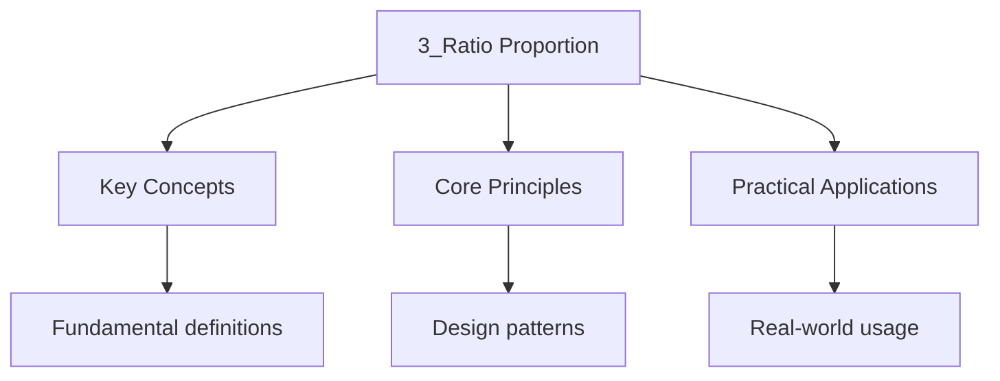

---

title: Ratio, Proportion, and Rates of Change
description: 'A compares quantities of the same kind. Ratios are written in their simplest form by Dividing all parts by their highest common factor.'
date: 2026-04-14
tags:
  - gcse
  - gcse-maths
categories:
  - gcse-maths

---

<!-- Breadcrumb Schema for SEO -->

## Ratio, Proportion, and Rates of Change

:::note
## 1. Ratio

### 1.1 Writing and Simplifying Ratios

A **ratio** compares quantities of the same kind. Ratios are written in their simplest form by
Dividing all parts by their highest common factor.

**Worked Example.** Simplify the ratio $24 : 36 : 48$.

$$\mathrm{HCF(24, 36, 48) = 12$$

$$24 : 36 : 48 = 2 : 3 : 4$$

**Worked Example.** Express the ratio $0.4 : 1.2$ in its simplest form.

Multiply both by 10: $4 : 12 = 1 : 3$.

**Worked Example (Higher Tier).** Express the ratio $2\frac{1}{2} : 3\frac{3}{4}$ as a ratio of
Whole numbers.

Convert to improper fractions: $\frac{5}{2} : \frac{15}{4}$.

Multiply both by 4: $10 : 15 = 2 : 3$.

### 1.2 Sharing in a Ratio

To share a quantity $Q$ in the ratio $a : b$:

$$\mathrm{Each share = \frac{Q}{a + b}$$

First share $= \frac{aQ}{a + b}$Second share $= \frac{bQ}{a + b}$.

**Worked Example.** Share 360 pounds in the ratio $2 : 3 : 4$.

$$\mathrm{Total parts = 2 + 3 + 4 = 9$$ $$\mathrm{One part = \frac{360}{9} = 40$$
$$\mathrm{Shares = 80, 120, 160$$

**Worked Example (Higher Tier).** Share 560 pounds in the ratio
$\frac{1}{2} : \frac{1}{3} : \frac{1}{4}$.

Multiply each part by 12: $6 : 4 : 3$.

Total parts: 13. One part: $\frac{560}{13}$.

Shares: $\frac{3360}{13}, \frac{2240}{13}, \frac{1680}{13}$Approximately 258.46, 172.31, 129.23
Pounds.

### 1.3 Ratios and Fractions

The ratio $a : b$ means:

- The first quantity is $\frac{a}{a + b}$ of the total
- The second quantity is $\frac{b}{a + b}$ of the total

**Worked Example.** In a class, the ratio of boys to girls is $3 : 5$. What fraction of the class
Are girls?

$$\frac{5}{3 + 5} = \frac{5}{8}$$

### 1.4 Combining Ratios

**Worked Example.** The ratio of $A$ to $B$ is $2 : 3$ and the ratio of $B$ to $C$ is $4 : 5$. Find
The ratio $A : B : C$.

Make $B$ the same in both ratios. LCM of 3 and 4 is 12.

$A : B = 8 : 12$ and $B : C = 12 : 15$.

Therefore $A : B : C = 8 : 12 : 15$.

**Worked Example (Higher Tier).** The ratio of $A$ to $B$ is $3 : 4$ and the ratio of $B$ to $C$ is
$6 : 7$. Find the ratio $A : B : C$.

$A : B = 3 : 4 = 9 : 12$ and $B : C = 6 : 7 = 12 : 14$.

$A : B : C = 9 : 12 : 14$.

### 1.5 Unit Ratios

**Worked Example.** 8 chocolate bars cost 3.60 pounds. Find the cost of 15 bars.

$$\mathrm{Cost per bar = \frac{3.60}{8} = 0.45 \mathrm{ pounds$$
$$\mathrm{Cost of 15 bars = 15 \times 0.45 = 6.75 \mathrm{ pounds$$

**Worked Example (Higher Tier).** It takes 5 people 8 hours to paint a fence. How long would it take
3 people?

This is an inverse proportion problem. Total person-hours $= 5 \times 8 = 40$.

Time for 3 people $= \frac{40}{3} \approx 13.3$ hours.

## 2. Direct and Inverse Proportion

### 2.1 Direct Proportion

$y$ is directly proportional to $x$ when $y = kx$ for a constant $k$.

**Key features:**

- As $x$ increases, $y$ increases
- The ratio $\frac{y}{x}$ is constant
- The graph is a straight line through the origin with gradient $k$

**Worked Example.** The cost $C$ of petrol is directly proportional to the number of litres $L$. 12
Litres costs 16.80 pounds. Find the cost of 20 litres.

$$16.80 = 12k \implies k = 1.40$$ $$C = 1.40L$$ $$C = 1.40 \times 20 = 28.00 \mathrm{ pounds$$

### 2.2 Inverse Proportion

$y$ is inversely proportional to $x$ when $y = \frac{k}{x}$ for a constant $k$.

**Key features:**

- As $x$ increases, $y$ decreases
- The product $xy$ is constant
- The graph is a reciprocal curve

**Worked Example.** The time $t$ to complete a job is inversely proportional to the number of
Workers $n$. 6 workers take 10 hours. How long do 15 workers take?

$$10 = \frac{k}{6} \implies k = 60$$ $$t = \frac{60}{15} = 4 \mathrm{ hours$$

### 2.3 Proportionality with Powers

$y$ is directly proportional to $x^2$: $y = kx^2$.

$y$ is inversely proportional to $\sqrt{x}$: $y = \frac{k}{\sqrt{x}}$.

**Worked Example.** $y$ is directly proportional to $x^3$. When $x = 2$, $y = 24$. Find $y$ when
$x = 5$.

$$24 = 8k \implies k = 3$$ $$y = 3 \times 125 = 375$$

**Worked Example (Higher Tier).** The kinetic energy $E$ of an object is directly proportional to
The square of its velocity $v$. When $v = 10$ m/s, $E = 500$ J. Find $E$ when $v = 15$ m/s.

$$E = kv^2 \implies 500 = 100k \implies k = 5$$

$$E = 5 \times 225 = 1125 \mathrm{ J$$

## 3. Real-Life Graphs

### 3.1 Distance-Time Graphs

| Feature            | Meaning                 |
| ------------------ | ----------------------- |
| Gradient           | Speed                   |
| Horizontal section | Stationary              |
| Steeper section    | Faster speed            |
| Downhill section   | Returning towards start |

**Worked Example.** A person walks at 2 m/s for 10 seconds, then stops for 5 seconds, then runs at 5
M/s for 4 seconds. Draw and interpret the distance-time graph.

- After 10 s: distance = 20 m (gradient = 2 m/s)
- After 15 s: distance = 20 m (horizontal, stationary)
- After 19 s: distance = 20 + 20 = 40 m (gradient = 5 m/s)

**Worked Example (Higher Tier).** A car accelerates uniformly from rest. The distance-time graph is
A curve. How would you find the instantaneous speed at $t = 4$ s?

Draw the tangent to the curve at $t = 4$ s and find its gradient. Alternatively, differentiate the
Distance function if given.

### 3.2 Speed-Time (Velocity-Time) Graphs

| Feature              | Meaning                          |
| -------------------- | -------------------------------- |
| Gradient             | Acceleration                     |
| Area under the graph | Distance travelled               |
| Below the time axis  | Moving in the opposite direction |

**Key equations of motion (constant acceleration):**

$$v = u + at$$ $$s = ut + \frac{1}{2}at^2$$ $$v^2 = u^2 + 2as$$ $$s = \frac{1}{2}(u + v)t$$

Where $u$ = initial velocity, $v$ = final velocity, $a$ = acceleration, $t$ = time, $s$ =
Displacement.

**Worked Example.** A car accelerates from rest at 3 m/s$^2$ for 8 seconds. Find the distance
Travelled.

$$s = 0 \times 8 + \frac{1}{2} \times 3 \times 64 = 96 \mathrm{ m$$

**Worked Example (Higher Tier).** A car travels at 20 m/s for 5 s, then decelerates uniformly to
Rest in 4 s. Find the total distance travelled.

Phase 1: $d_1 = 20 \times 5 = 100$ m.

Phase 2: $a = \frac{0 - 20}{4} = -5$ m/s$^2$.
$d_2 = 20 \times 4 + \frac{1}{2} \times (-5) \times 16 = 80 - 40 = 40$ m.

Total: 140 m.

### 3.3 Rates of Change

The **rate of change** of a quantity is how fast it changes per unit of another quantity ( Time).

$$\mathrm{Rate of change = \frac{\mathrm{change in quantity}{\mathrm{change in time}$$

This is the gradient of the graph of that quantity against time.

**Worked Example.** The population of a town was 45000 in 2020 and 54000 in 2025. Find the average
Rate of change.

$$\mathrm{Rate = \frac{54000 - 45000}{2025 - 2020} = \frac{9000}{5} = 1800 \mathrm{ people per year$$

### 3.4 Instantaneous Rate of Change

The **instantaneous rate of change** at a point is the gradient of the **tangent** to the curve at
That point.

**Worked Example.** The volume of water in a tank is given by $V = 2t^2 + 3t$ litres, where $t$ is
In minutes. Find the rate at which the volume is increasing when $t = 4$.

Draw the tangent at $t = 4$ (or differentiate):

$$\frac{dV}{dt} = 4t + 3$$ $$\mathrm{At  t = 4: \frac{dV}{dt} = 16 + 3 = 19 \mathrm{ litres/minute$$

## 4. Growth and Decay

### 4.1 Exponential Growth

$$y = a(1 + r)^t$$

Where $a$ is the initial amount, $r$ is the growth rate (as a decimal), and $t$ is time.

### 4.2 Exponential Decay

$$y = a(1 - r)^t$$

**Worked Example.** A radioactive substance decays at a rate of 8% per hour. If there are initially
500 g, how much remains after 12 hours?

$$y = 500 \times 0.92^{12} = 500 \times 0.3677\ldots = 183.8 \mathrm{ g$$

### 4.3 Half-Life

The **half-life** is the time taken for a quantity to reduce to half its initial value.

For exponential decay with rate $r$:

$$t_{1/2} = \frac{\ln 2}{-\ln(1 - r)}$$

**Worked Example.** A substance has a half-life of 6 hours. If the initial mass is 80 g, find the
Mass after 24 hours.

$$\mathrm{Number of half-lives = \frac{24}{6} = 4$$
$$\mathrm{Mass = 80 \times \left(\frac{1}{2}\right)^4 = 80 \times \frac{1}{16} = 5 \mathrm{ g$$

**Worked Example (Higher Tier).** The mass of a radioactive substance after $t$ years is given by
$m = 200 \times 0.95^t$ grams. Find the half-life.

$$100 = 200 \times 0.95^t$$ $$0.5 = 0.95^t$$
$$t = \frac{\ln 0.5}{\ln 0.95} = \frac{-0.693}{-0.0513} \approx 13.5 \mathrm{ years$$

## 5. Compound Measures

### 5.1 Speed, Density, and Pressure

| Measure  | Formula                                                 | Units            |
| -------- | ------------------------------------------------------- | ---------------- |
| Speed    | $\mathrm{speed = \frac{\mathrm{distance}{\mathrm{time}$ | m/s, km/h        |
| Density  | $\rho = \frac{\mathrm{mass}{\mathrm{volume}$            | kg/m$^3$G/cm$^3$ |
| Pressure | $P = \frac{\mathrm{force}{\mathrm{area}$                | Pa (N/m$^2$)     |

**Worked Example.** A block of metal has mass 1.8 kg and volume 200 cm$^3$. Find its density in
G/cm$^3$.

$$\rho = \frac{1800 \mathrm{ g}{200 \mathrm{ cm^3} = 9 \mathrm{ g/cm^3$$

**Worked Example.** A force of 600 N acts on an area of 0.75 m$^2$. Find the pressure.

$$P = \frac{600}{0.75} = 800 \mathrm{ Pa$$

**Worked Example (Higher Tier).** A pressure of 5000 Pa is exerted on an area of 0.04 m$^2$. Find
The force.

$$F = P \times A = 5000 \times 0.04 = 200 \mathrm{ N$$

### 5.2 Unit Conversions

| Conversion               | Factor                     |
| ------------------------ | -------------------------- |
| 1 km = 1000 m            | $\times 1000$              |
| 1 m = 100 cm             | $\times 100$               |
| 1 hour = 60 min = 3600 s | $\times 60$, $\times 3600$ |
| 1 litre = 1000 cm$^3$    | $\times 1000$              |
| 1 kg = 1000 g            | $\times 1000$              |

**Worked Example.** Convert 72 km/h to m/s.

$$72 \mathrm{ km/h = \frac{72000 \mathrm{ m}{3600 \mathrm{ s} = 20 \mathrm{ m/s$$

**Shortcut:** To convert km/h to m/s, divide by 3.6. To convert m/s to km/h, multiply by 3.6.

### 5.3 Currency Conversions

**Worked Example.** The exchange rate is 1 pound = 1.25 euros. Convert 240 pounds to euros.

$$240 \times 1.25 = 300 \mathrm{ euros$$

**Worked Example (Higher Tier).** The exchange rate is 1 dollar = 0.82 pounds. A laptop costs 899
Dollars. How much is this in pounds?

$$899 \times 0.82 = 737.18 \mathrm{ pounds$$

### 5.4 Best Buy Problems

Compare the **unit cost** (cost per gram, per litre, etc.) of different products.

**Worked Example.** Brand A: 400 g for 3.20 pounds. Brand B: 650 g for 4.55 pounds. Which is better
Value?

$$\mathrm{Brand A:  \frac{320}{400} = 0.80 \mathrm{ p/g$$
$$\mathrm{Brand B:  \frac{455}{650} = 0.70 \mathrm{ p/g$$

Brand B is better value (lower cost per gram).

## 6. Interpretation of Graphs in Context

### 6.1 Gradient and Area

When interpreting real-life graphs:

- The **gradient** represents a rate of change
- The **area under the curve** represents a total or accumulated quantity

### 6.2 Financial Graphs

- **Straight line with positive gradient:** Simple interest or constant rate of saving
- **Curve getting steeper:** Compound interest or accelerating growth
- **Curve flattening out:** Diminishing returns

### 6.3 Conversion Graphs

A conversion graph between two units is always a straight line through the origin (if the conversion
Is proportional).

**Worked Example.** A conversion graph between miles and kilometres passes through $(0, 0)$ and
$(5, 8)$. Find the conversion factor.

$$\mathrm{Gradient = \frac{8 - 0}{5 - 0} = 1.6$$

So 1 mile = 1.6 km.

## 7. Ratio Problems with Algebra

### 7.1 Expressing Ratios as Algebraic Fractions

**Worked Example.** Two numbers are in the ratio $3 : 5$. If 4 is added to each number, the ratio
Becomes $2 : 3$. Find the numbers.

Let the numbers be $3x$ and $5x$.

$$\frac{3x + 4}{5x + 4} = \frac{2}{3}$$ $$3(3x + 4) = 2(5x + 4)$$ $$9x + 12 = 10x + 8$$ $$x = 4$$

The numbers are 12 and 20.

### 7.2 Changing Ratios

**Worked Example.** A bag contains red and blue counters in the ratio $3 : 5$. When 8 red counters
Are added, the ratio becomes $5 : 6$. How many blue counters are there?

Let red $= 3x$ and blue $= 5x$.

$$\frac{3x + 8}{5x} = \frac{5}{6}$$ $$6(3x + 8) = 25x$$ $$18x + 48 = 25x$$ $$7x = 48$$

Since $x$ must be an integer, there is no solution with whole counters. Let us re-check: $7x = 48$
Gives $x = 48/7$Which is not an integer. This suggests the problem has no integer solution, which
Would need to be re-examined in context.

### 7.3 More Complex Ratio Problems (Higher Tier)

**Worked Example.** The ratio of the angles in a triangle is $2 : 3 : 4$. Find the largest angle.

Total parts: $2 + 3 + 4 = 9$.

Each part $= \frac{180}{9} = 20^{\circ}$.

Largest angle $= 4 \times 20 = 80^{\circ}$.

**Worked Example (Higher Tier).** A metal alloy is made from copper, zinc, and tin in the ratio
$7 : 3 : 2$. If the alloy weighs 480 g, how much copper does it contain?

Total parts: $7 + 3 + 2 = 12$.

Copper $= \frac{7}{12} \times 480 = 280$ g.

**Worked Example (Higher Tier).** Two quantities are in the ratio $a : b$. When each quantity is
Increased by 15, the ratio becomes $5 : 4$. The original ratio is $3 : 2$. Find $a$ and $b$.

This is consistent with the earlier worked example: $a = 12$ and $b = 20$.

Let me verify: $12 : 20$ simplifies to $3 : 2$. After adding 15: $27 : 35$. But
$27 : 35 \neq 5 : 4$.

So the numbers $12$ and $20$ with added $4$ gave $5 : 6$Not $5 : 4$. Let me solve from scratch.

$\frac{a + 15}{b + 15} = \frac{5}{4}$ and $\frac{a}{b} = \frac{3}{2}$.

From the second equation: $a = \frac{3b}{2}$.

Substituting: $\frac{3b/2 + 15}{b + 15} = \frac{5}{4}$.

$4(3b/2 + 15) = 5(b + 15)$.

$6b + 60 = 5b + 75$.

$b = 15$, $a = 22.5$.

Verify: $22.5 : 15 = 3 : 2$. After adding 15: $37.5 : 30 = 5 : 4$. $\checkmark$

## 8. Density Problems (Higher Tier)

**Worked Example.** A solid metal cone has base radius 4 cm and height 9 cm. Its density is 8.4
G/cm$^3$. Find its mass.

Volume $= \frac{1}{3}\pi \times 16 \times 9 = 48\pi \approx 150.80 \mathrm{ cm^3$.

Mass $= 8.4 \times 150.80 \approx 1266.7 \mathrm{ g$.

**Worked Example.** A cuboid measures $5 \mathrm{ cm \times 3 \mathrm{ cm \times 2 \mathrm{ cm$. It
has Mass 180 g. Find its density in kg/m$^3$.

Volume $= 30 \mathrm{ cm^3 = 30 \times 10^{-6} \mathrm{ m^3$.

Mass $= 0.180 \mathrm{ kg$.

Density $= \frac{0.180}{30 \times 10^{-6}} = \frac{0.180}{0.00003} = 6000 \mathrm{ kg/m^3$.

## Intuition

**Comparing quantities:** Ratios are like recipes — they tell you how much of each ingredient you need. Proportions scale the recipe up or down while keeping the same relative amounts.

**Why it matters:** From map scales to cooking, ratios and proportions are everywhere. Understanding them helps you scale quantities and compare sizes.

**The key insight:** Cross-multiplication works because it's really multiplying both sides by the product of the denominators — it's a shortcut for maintaining equality.

## Common Pitfalls

- **Mixing up the order of a ratio.** The ratio $A : B = 3 : 5$ means $A/B = 3/5$Not $B/A$.
- **Forgetting to add all parts** when sharing in a ratio. The total number of parts is $a + b$Not
  just $a$ or $b$.
- **Confusing direct and inverse proportion graphs.** Direct proportion is a straight line through
  the origin; inverse proportion is a curve.
- **Incorrect unit conversions**, especially km/h to m/s (divide by 3.6, not multiply).
- **Reading the wrong axis** on distance-time or speed-time graphs. Always check what each axis
  represents.
- **Forgetting that the area under a speed-time graph gives distance**, even when the graph goes
  below the time axis (in which case it represents returning).
- **Forgetting to use consistent units** in density/pressure problems. Convert everything to SI
  units before calculating.
- **Assuming that a ratio of $a : b : c$ with three unknowns has a unique solution** without
  additional constraints.

### 9.1 Compound Measures Summary

| Measure  | Formula                          | Units            |
| -------- | -------------------------------- | ---------------- |
| Speed    | $\mathrm{speed = \frac{d}{t}$    | m/s, km/h        |
| Density  | $\mathrm{density = \frac{m}{V}$  | kg/m$^3$G/cm$^3$ |
| Pressure | $\mathrm{pressure = \frac{F}{A}$ | Pa (N/m$^2$)     |

### 9.2 Proportionality: A Quick Reference

| Type          | Equation        | Graph shape                  |
| ------------- | --------------- | ---------------------------- |
| Direct        | $y = kx$        | Straight line through origin |
| Inverse       | $y = k/x$       | Reciprocal curve             |
| Direct sq.    | $y = kx^2$      | Quadratic through origin     |
| Direct sq.rt. | $y = k\sqrt{x}$ | Square root curve            |

**How to determine the type of proportionality from a table of values:**

1. Check if $y/x$ is constant (direct proportion).
2. Check if $xy$ is constant (inverse proportion).
3. Check if $y/x^2$ is constant (direct square proportion).
4. Check if $y/\sqrt{x}$ is constant (direct square root proportion).

**Worked Example.** Given the table:

| $x$ | 2   | 4   | 8   |
| --- | --- | --- | --- |
| $y$ | 6   | 12  | 24  |

Check $y/x$: $6/2 = 3$$12/4 = 3$$24/8 = 3$. Constant, so $y$ is directly proportional to $x$. The
equation is $y = 3x$.

### 9.3 Graphical Interpretation of Rates

**Distance-time graphs:**

- Gradient = speed.
- A horizontal line means stationary.
- A steeper gradient means faster speed.
- A curve means the speed is changing (acceleration or deceleration).

**Speed-time graphs:**

- Gradient = acceleration.
- Area under the graph = distance travelled.
- A horizontal line means constant speed (zero acceleration).
- Area below the time axis represents motion in the opposite direction.

**Worked Example.** A car accelerates from rest at $2\mathrm{ m/s^2$ for 10 seconds, then travels at
Constant speed for 20 seconds, then decelerates uniformly to rest in 5 seconds.

Acceleration phase: $v = 2 \times 10 = 20$ m/s. Distance = $\frac{1}{2} \times 20 \times 10 = 100$
M.

Constant speed phase: Distance = $20 \times 20 = 400$ m.

Deceleration phase: $a = -20/5 = -4\mathrm{ m/s^2$. Distance = $\frac{1}{2} \times 20 \times 5 = 50$
M.

Total distance = $100 + 400 + 50 = 550$ m.

### 9.4 Reverse Percentage Problems

A reverse percentage problem asks: "A price after VAT is 120 pounds. The VAT rate is 20%. What was
The original price?"

The original price is NOT $120 - 24 = 96$ pounds. Instead:

$$
\mathrm{Original \times 1.20 = 120 \implies \mathrm{Original = \frac{120}{1.20} = 100 \mathrm{ pounds
$$

**Worked Example.** A population grows by 15% to reach 4600. What was the original population?

$$
\mathrm{Original \times 1.15 = 4600 \implies \mathrm{Original = \frac{4600}{1.15} = 4000
$$

### 9.5 Best Buy Problems

When comparing products of different sizes, calculate the unit price for each.

**Worked Example.** Brand A: 400 g for 2.40 pounds. Brand B: 750 g for 3.90 pounds. Which is better
Value?

Brand A: $2.40/400 = 0.0060$ pounds/g = 0.60 pounds per 100 g.

Brand B: $3.90/750 = 0.0052$ pounds/g = 0.52 pounds per 100 g.

Brand B is better value.

### 9.6 Exchange Rates

If 1 pound = 1.18 euros, then to convert pounds to euros, multiply by 1.18. To convert euros to
Pounds, divide by 1.18.

**Worked Example.** A meal costs 45 euros. How much is this in pounds?

$$
45 \div 1.18 \approx 38.14 \mathrm{ pounds
$$

**Worked Example.** A tourist exchanges 500 pounds for euros at a rate of 1 pound = 1.15 euros, with
A commission of 3 pounds. How many euros do they receive?

Euros before commission: $500 \times 1.15 = 575$ euros. Commission: 3 pounds =
$3 \times 1.15 = 3.45$ euros. Net: $575 - 3.45 = 571.55$ euros.

## Practice Questions

1. Divide 420 pounds in the ratio $3 : 5 : 8$.

2. The ratio of $A$ to $B$ is $5 : 2$ and $B$ to $C$ is $3 : 4$. Find $A : B : C$.

3. $y$ is inversely proportional to $x^2$. When $x = 3$$y = 12$. Find $y$ when $x = 6$.

4. A car travels 45 km in 30 minutes, then 60 km in 45 minutes. Calculate the average speed for the
   whole journey.

5. The density of a material is 7.8 g/cm$^3$. Find the mass of a block of dimensions
   $5 \mathrm{ cm \times 3 \mathrm{ cm \times 2 \mathrm{ cm$.

6. A population grows by 4% each year. If the initial population is 50000, find the population after
   7 years.

7. On a speed-time graph, a car accelerates uniformly from 10 m/s to 30 m/s over 8 seconds.
   Calculate the distance travelled during this acceleration.

8. Two numbers are in the ratio $4 : 7$. When 10 is subtracted from each, the ratio becomes $1 : 2$.
   Find the numbers.

9. A 500 g box of cereal costs 2.40 pounds and a 750 g box costs 3.30 pounds. Which is better value
   per 100 g?

10. The half-life of carbon-14 is 5730 years. A sample contains 12.5% of its original carbon-14. How
    old is the sample?

11. A cylinder has radius 5 cm, height 12 cm, and mass 1.2 kg. Find its density in g/cm$^3$.

12. Water flows from a tap at a rate of 0.5 litres per second. How long does it take to fill a tank
    of volume 450 litres?

13. $y$ is directly proportional to $x^n$. When $x = 2$$y = 24$. When $x = 4$$y = 192$. Find the
    value of $n$.

14. The ratio of boys to girls in a school is $3 : 5$. If there are 240 more girls than boys, how
    many students are there in total?

15. A car decelerates uniformly from 25 m/s to 5 m/s in 4 seconds. Sketch the speed-time graph and
    find the distance travelled.

### Extended Practice (Higher Tier)

1. The ratio of the interior angles of a triangle is $2 : 3 : 4$. Find the size of each angle.

2. $y$ is directly proportional to $\sqrt{x}$. When $x = 9$$y = 18$. Find $y$ when $x = 25$.

3. A train travels at 120 km/h for 45 minutes, then at 80 km/h for 1 hour 15 minutes. Calculate the
    average speed for the entire journey.

4. Three friends share a pizza in the ratio of their ages. If their ages are 12, 15, and 18, what
    fraction of the pizza does the oldest friend receive?

5. The population of a town was 80000 in 2020 and 88000 in 2025. Assuming exponential growth, find
    the annual growth rate as a percentage.

6. Water flows into a tank at 12 litres per minute and out at 5 litres per minute. If the tank
    initially contains 200 litres, how long until it contains 500 litres?

7. A rectangular field has dimensions in the ratio $3 : 5$. If the perimeter is 320 m, find the
    area of the field.

8. On a journey, a cyclist accelerates from rest to 8 m/s over 10 seconds, maintains this speed for
    2 minutes, then decelerates to rest over 5 seconds. Draw the speed-time graph and find the total
    distance.

9. The cost of petrol increases by 8% one year and then by 5% the next year. What is the overall
    percentage increase over the two years?

10. A map has a scale of $1 : 25000$. Two towns are 8 cm apart on the map. Find the actual distance
    between them in kilometres.

### Extended Content

#### 10.1 Simple Interest vs Compound Interest

**Simple interest** is calculated only on the original principal:

$$
I = Prt
$$

Where $P$ is the principal, $r$ is the annual rate, and $t$ is the time in years. The total amount
Is $A = P + Prt = P(1 + rt)$.

**Compound interest** is calculated on the principal plus accumulated interest:

$$
A = P(1 + r)^t
$$

**Worked Example.** EUR 2000 is invested at 5% per annum for 3 years. Compare simple and compound
Interest.

Simple interest: $I = 2000 \times 0.05 \times 3 = 300$. Total = EUR 2300.

Compound interest: $A = 2000(1.05)^3 = 2000 \times 1.157625 = 2315.25$. Total = EUR 2315.25.

The compound interest earns EUR 15.25 more than simple interest over 3 years.

#### 10.2 Percentage Change Calculations

**Percentage increase:** $\frac{\mathrm{new - \mathrm{original}{\mathrm{original} \times 100\%$

**Percentage decrease:** $\frac{\mathrm{original - \mathrm{new}{\mathrm{original} \times 100\%$

**Worked Example.** A shirt originally costs 40 pounds. It is reduced to 32 pounds in a sale. What
Is the percentage decrease?

$$
\frac{40 - 32}{40} \times 100\% = \frac{8}{40} \times 100\% = 20\%
$$

**Successive percentage changes.** If a price increases by 10% then decreases by 10%, it does NOT
Return to the original. A 10% increase on 100 gives 110. A 10% decrease on 110 gives
$110 \times 0.9 = 99$. The net effect is a 1% decrease.

**Worked Example.** A salary of 30000 pounds increases by 4% one year and 3% the next. What is the
New salary?

$$
30000 \times 1.04 \times 1.03 = 30000 \times 1.0712 = 32136 \mathrm{ pounds
$$

The overall percentage increase is $7.12\%$ (not $4\% + 3\% = 7\%$).

#### 10.3 Pressure

Pressure is the force per unit area:

$$
P = \frac{F}{A}
$$

**Worked Example.** A person weighing 600 N stands on the ground. If each foot has area
$180\mathrm{ cm^2$Find the pressure.

Total area $= 360\mathrm{ cm^2 = 0.036\mathrm{ m^2$.

$$
P = \frac{600}{0.036} = 16667 \mathrm{ Pa \approx 16.7 \mathrm{ kPa
$$

**Worked Example.** The pressure at the bottom of a swimming pool is 30 kPa. The pool has a
Rectangular base of $10\mathrm{ m \times 5\mathrm{ m$. Find the total force on the base.

$$
F = P \times A = 30000 \times 50 = 1500000 \mathrm{ N = 1500 \mathrm{ kN
$$

#### 10.4 Speed, Distance, Time Problems with Multiple Stages

**Worked Example.** A cyclist travels from A to B at 20 km/h and returns from B to A at 12 km/h. The
Total journey takes 4 hours. Find the distance from A to B.

Let $d$ be the distance. Then:

$$
\frac{d}{20} + \frac{d}{12} = 4
$$

$$
D\left(\frac{1}{20} + \frac{1}{12}\right) = 4
$$

$$
D\left(\frac{3 + 5}{60}\right) = 4
$$

$$
\frac{8d}{60} = 4 \implies d = 30 \mathrm{ km
$$

**Note:** The average speed is NOT $(20 + 12)/2 = 16$ km/h. The average speed is:

$$
\frac{\mathrm{total distance}{\mathrm{total time} = \frac{60}{4} = 15 \mathrm{ km/h
$$

The harmonic mean of 20 and 12 is $\frac{2}{1/20 + 1/12} = 15$Which equals the average speed for a
Return journey.

## Worked Examples

**Example 1:**

A typical exam question on Ratio, Proportion, and Rates of Change requires you to apply your
knowledge to an unfamiliar context. Read the question carefully, identify the key concept being
tested, and structure your answer using the appropriate terminology.

**Example 2:**

Multi-step problems in Ratio, Proportion, and Rates of Change often combine two or more concepts.
Break the problem down: identify what you need to find, recall the relevant formula or principle,
substitute values, and state your answer with correct units or formatting.

## Summary

This topic covers the mathematical techniques and concepts related to ratio, proportion, and rates
of change, including key theorems, methods, and problem-solving approaches.

**Key concepts include:**

- quadratic equations and the discriminant
- simultaneous equations
- polynomial division and the factor theorem
- partial fractions
- binomial expansion

Regular practice with a variety of question types is essential to build fluency and confidence in
applying these mathematical techniques.

## Cross-References

- [Algebra](../2-algebra/2_algebra) -- Ratio and proportion problems are often solved using algebraic equations and substitution.
- [Geometry and Measure](../../../../../../sat/src/content/docs/mathematics/geometry) -- Scale drawings and similar triangles use ratio and proportion concepts.
- [Forces](../../physics/5-forces/5_forces) -- Calculating forces and acceleration involves proportional relationships between mass and force.
- [Cell Biology](../../../../../../ib/src/content/docs/biology/1-cell-biology/1_cell-biology) -- Dilution ratios and concentration calculations in biology require proportion skills.
:::
