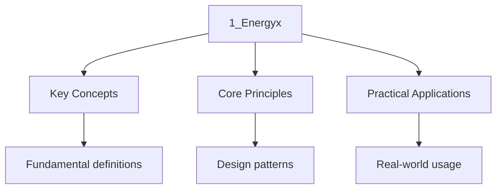

---

title: "Energy | GCSE - Wyatt's Notes"
description: "QUALIFICATIONS Gcse notes: Energy. Comprehensive study material with definitions Study guide for A-Level energy with worked examples and practice questions."
date: 2026-04-14
tags:
  - gcse
  - gcse-physics
categories:
  - gcse-physics

---

import PhetSimulation from "@components/PhetSimulation";

## Intuition

**Energy is the currency of the universe — it can be transformed but never created or destroyed:** Think of energy like money in a bank account. You can transfer it between accounts (stores), but the total amount never changes. A car doesn't "use up" energy — it converts chemical energy from fuel into kinetic energy (motion), thermal energy (heat), and sound. The total energy before and after is identical.

**Why it matters:** Understanding energy explains why perpetual motion machines are impossible, why your phone gets warm when you use it, and why power stations exist. Every physical process involves energy transformations, and understanding them is the key to understanding physics.

**The key insight:** The efficiency of a process is determined by how much energy ends up in useful stores versus wasted stores. A car engine wastes about 70% of its energy as heat — only 30% becomes kinetic energy. Improving efficiency means reducing the energy that ends up in unwanted stores.

## Energy

> **Info:** Board Coverage AQA Paper 1 | Edexcel Paper 1 | OCR A Gateway P1 | WJEC P1
<PhetSimulation client:only="solid-js" simulationId="energy-skate-park-basics" title="Energy Skate Park: Basics"  />

Explore the simulation above to develop intuition for this topic.

## 1. Energy Stores and Systems

### 1.1 The Concept of Energy

**Energy** is the capacity of a system to do work. It is a **scalar quantity** measured in **joules
(J)**. Energy cannot be created or destroyed -- this is the **principle of conservation of energy**,
One of the most fundamental laws of physics.

A **system** is an object or group of objects. When a system changes, energy is **transferred** to
Or from the system. We identify energy **stores** (where energy is held) and energy **transfers**
(pathways by which energy moves).

Why this framing matters: you cannot "use up" energy. A car does not "use" energy -- it transfers
Chemical energy from fuel into kinetic energy, thermal energy, and sound. The total energy before
And after any process is identical. What changes is the distribution of energy across stores. This
Is not a cosmetic distinction; it underpins every energy calculation you will perform.

### 1.2 Energy Stores

| Store                   | Description                                       | Examples                              |
| ----------------------- | ------------------------------------------------- | ------------------------------------- |
| Kinetic                 | Energy of a moving object                         | A rolling ball, a flowing river       |
| Gravitational potential | Energy due to height in a gravitational field     | A book on a shelf, water behind a dam |
| Elastic potential       | Energy stored in a stretched or compressed object | A compressed spring, a drawn bow      |
| Thermal                 | Energy due to the random motion of particles      | A hot cup of tea, a warm room         |
| Chemical                | Energy stored in chemical bonds                   | Food, fuel, batteries                 |
| Magnetic                | Energy stored in a magnetic field                 | Two repelling magnets                 |
| Electrostatic           | Energy stored in an electric field                | A charged capacitor                   |
| Nuclear                 | Energy stored in the nucleus of an atom           | Uranium-235, the Sun                  |

### 1.3 Energy Transfers

Energy is transferred by four main pathways:

| Pathway      | Mechanism                                        |
| ------------ | ------------------------------------------------ |
| Mechanically | By a force acting over a distance (doing work)   |
| Electrically | By charges moving through a circuit              |
| By heating   | By conduction, convection, or radiation          |
| By radiation | By electromagnetic waves (light, infrared, etc.) |

**Worked Example.** A person lifts a 5 kg box from the floor to a shelf 1.5 m high. Describe the
Energy changes.

The system is the box and the Earth. Energy is transferred from the chemical store of the person to
The gravitational potential store of the box.

$$\Delta E_p = mgh = 5 \times 9.8 \times 1.5 = 73.5 \mathrm{ J$$

### 1.4 Why "Stores and Transfers" Matters

This language exists because of a common conceptual error: students often say an object "has energy"
Without specifying _which kind_, or that energy is "lost" when it is merely dissipated into thermal
Stores. The stores-and-transfers model forces you to be explicit:

- **Store:** Where energy resides right now (kinetic, gravitational potential, thermal, etc.).
- **Transfer:** The mechanism by which energy moves between stores (mechanical working, electrical
  working, heating, radiation).

When you say "the light bulb transfers energy electrically from the mains to the thermal and light
Stores of the surroundings," you have given a complete, precise description. When you say "the light
Bulb uses energy," you have not.

## 2. Kinetic and Potential Energy

### 2.1 Kinetic Energy

$$E_k = \frac{1}{2}mv^2$$

Where $m$ is mass (kg) and $v$ is speed (m/s).

**Derivation.** Consider an object of mass $m$ accelerated from rest by a constant force $F$ over
Distance $d$:

$$F = ma \implies a = \frac{F}{m}$$
$$v^2 = u^2 + 2as = 0 + 2 \times \frac{F}{m} \times d = \frac{2Fd}{m}$$ $$Fd = \frac{1}{2}mv^2$$

Since work done $W = Fd$The kinetic energy is $E_k = \frac{1}{2}mv^2$.

### 2.2 Why the Factor of One-Half

The $\frac{1}{2}$ in $E_k = \frac{1}{2}mv^2$ is not arbitrary. It arises because the object
Accelerates uniformly from rest: it covers distance $d$ in time $t$ And the average velocity during
That interval is $\frac{0 + v}{2} = \frac{v}{2}$. The work done is force times distance, which
Equals $m \cdot \frac{v}{t} \cdot \frac{v}{2} \cdot t = \frac{1}{2}mv^2$. If the factor were
Different, the work-energy theorem would fail, and conservation of energy would be violated. The
Factor of one-half is a direct, unavoidable consequence of Newton\'s second law and the definition of
Work.

### 2.3 Gravitational Potential Energy

$$E_p = mgh$$

Where $m$ is mass (kg), $g$ is gravitational field strength (N/kg), and $h$ is height (m).

:::note
<strong>Near the Earth\'s surface, $g \approx 9.8$ N/kg (often approximated as 10 N/kg in</strong>

Calculations).
:::
The height $h$ is measured from an arbitrarily chosen reference level (often the ground). Only
_changes_ in gravitational potential energy are physically meaningful, so the choice of reference
Does not affect the answer to any real problem.

### 2.4 Conservation of Energy: Falling Objects

When an object falls freely (ignoring air resistance), gravitational potential energy is converted
To kinetic energy.

$$mgh = \frac{1}{2}mv^2$$ $$v = \sqrt{2gh}$$

**Worked Example.** A 0.5 kg ball is dropped from a height of 20 m. Find its speed just before it
Hits the ground (ignore air resistance).

$$v = \sqrt{2 \times 9.8 \times 20} = \sqrt{392} = 19.8 \mathrm{ m/s$$

### 2.5 Proof That the Final Speed Is Independent of Mass

In the equation $v = \sqrt{2gh}$The mass $m$ cancels out. This means a bowling ball and a feather
Dropped from the same height in a vacuum hit the ground at the same speed. The reason is that
Although a heavier object has more gravitational potential energy, it also requires more force to
Accelerate (it has more inertia), and these two effects cancel exactly. This is a deep result: it is
A direct consequence of the equivalence of gravitational and inertial mass, which is the starting
Point for Einstein\'s general theory of relativity.

### 2.6 Elastic Potential Energy

$$E_e = \frac{1}{2}ke^2$$

Where $k$ is the spring constant (N/m) and $e$ is the extension (m).

This formula applies to objects that obey **Hooke\'s law**: the extension is directly proportional to
The force applied, up to the **limit of proportionality**.

**Derivation.** The force needed to extend a spring by $e$ is $F = ke$. The average force during
Extension from 0 to $e$ is $\frac{0 + ke}{2} = \frac{1}{2}ke$. The work done (energy stored) is:

$$E_e = \mathrm{average force \times \mathrm{distance = \frac{1}{2}ke \times e = \frac{1}{2}ke^2$$

Alternatively, using calculus (for Higher tier students): the work done is the integral of force
With respect to displacement:

$$E_e = \int_0^e F\, dx = \int_0^e kx\, dx = \left[\frac{1}{2}kx^2\right]_0^e = \frac{1}{2}ke^2$$

### 2.7 Energy Changes in a Vertical Spring-Mass System (Higher Tier)

When a mass is hung from a spring and released, the energy oscillates between elastic potential and
Gravitational potential and kinetic energy. At the equilibrium position, the spring is extended but
The mass is moving fastest (maximum kinetic energy). At the lowest point, the spring has maximum
Extension (maximum elastic potential energy) and the mass is momentarily at rest (zero kinetic
Energy).

### 2.8 Worked Example: Bungee Jumping

A bungee cord has spring constant $k = 50$ N/m and natural length $15$ m. A jumper of mass $60$ kg
Falls from a bridge. Find the maximum extension of the cord.

At maximum extension, velocity is zero. All energy has been transferred from gravitational potential
To elastic potential (measuring from the point where the cord first becomes taut):

$$mgh = \frac{1}{2}ke^2$$

Where $h = e$ (the distance fallen beyond the natural length equals the extension):

$$60 \times 9.8 \times e = \frac{1}{2} \times 50 \times e^2$$ $$588e = 25e^2$$
$$e = \frac{588}{25} = 23.52 \mathrm{ m$$

The total distance fallen is $15 + 23.52 = 38.52$ m.

## 3. Specific Heat Capacity

### 3.1 Definition

The **specific heat capacity** $c$ of a substance is the energy required to change the temperature
Of 1 kg of the substance by $1^{\circ}\mathrm{C$ (or 1 K).

$$\Delta E = mc\Delta T$$

### 3.2 Microscopic Interpretation

Temperature is a measure of the average kinetic energy of the particles in a substance. When you
Heat a material, you increase the kinetic energy of its particles. The specific heat capacity tells
You how much energy is needed to produce a given temperature increase. Materials with high specific
Heat capacities (like water) require more energy per degree of temperature rise because their
Particles need more energy input to increase their average kinetic energy. This can be due to
Intermolecular forces (hydrogen bonds in water, for instance, absorb energy without increasing
Kinetic energy) or to the number of degrees of freedom available to the particles.

### 3.3 Specific Heat Capacities

| Substance | Specific Heat Capacity (J/(kg $^{\circ}$C)) |
| --------- | ------------------------------------------- |
| Water     | 4200                                        |
| Aluminium | 900                                         |
| Copper    | 390                                         |
| Iron      | 450                                         |
| Lead      | 130                                         |

Water has a very high specific heat capacity, which is why it is effective as a coolant and why
Coastal climates are more moderate.

### 3.4 Why Water\'s High Specific Heat Capacity Matters

Water\'s specific heat capacity of 4200 J/(kg $^{\circ}$C) is anomalously high compared to most
Liquids. The consequence: a large body of water (ocean, lake) absorbs or releases enormous amounts
Of energy with only a small temperature change. This is why coastal regions have milder climates
Than inland areas at the same latitude. It is also why water is used as a coolant in car engines and
Nuclear reactors: it can absorb a great deal of waste heat before its temperature rises to dangerous
Levels.

**Worked Example.** A 2 kW kettle heats 1.5 kg of water from $15^{\circ}\mathrm{C$ to
$100^{\circ}\mathrm{C$. How long does this take?

$$\Delta E = mc\Delta T = 1.5 \times 4200 \times 85 = 535,500 \mathrm{ J$$

$$t = \frac{\Delta E}{P} = \frac{535500}{2000} = 267.75 \mathrm{ s \approx 4.5 \mathrm{ minutes$$

### 3.5 Required Practical: Specific Heat Capacity

**Method:**

1. Measure the mass of the metal block.
2. Place a heater in the block and connect it to a power supply.
3. Measure the initial temperature.
4. Switch on the heater and start a timer. Record the voltmeter and ammeter readings.
5. After a set time, switch off and record the final temperature.
6. Calculate: energy supplied $E = VIt$ Then $c = \frac{E}{m\Delta T}$.

**Sources of error:**

- Heat loss to the surroundings: the block loses thermal energy to the air, so the measured
  temperature rise is smaller than it should be. The calculated specific heat capacity will be
  _higher_ than the true value.
- Incomplete thermal contact between heater and block: some energy from the heater is not
  transferred to the block.
- Reading the thermometer at an angle (parallax error).
- The heater itself has a heat capacity and absorbs some of the energy.

**Improvement:** Plot a graph of temperature against energy supplied and take the gradient. This
Reduces the impact of the initial temperature measurement error and allows you to account for a
Constant rate of heat loss (the graph may not pass through the origin; the intercept represents
Energy lost to the surroundings during the initial heating phase).

### 3.6 Specific Latent Heat (Higher Tier)

When a substance changes state (melts, boils, freezes, condenses), energy is transferred without any
Change in temperature. The energy per unit mass for a change of state is the **specific latent
Heat**.

$$E = mL$$

Where $L$ is the specific latent heat (J/kg).

- **Specific latent heat of fusion:** energy per kg to change from solid to liquid (no temperature
  change).
- **Specific latent heat of vaporisation:** energy per kg to change from liquid to gas (no
  temperature change).

| Substance | Latent heat of fusion (J/kg) | Latent heat of vaporisation (J/kg) |
| --------- | ---------------------------- | ---------------------------------- |
| Water     | $3.34 \times 10^5$           | $2.26 \times 10^6$                 |
| Ethanol   | $1.05 \times 10^5$           | $8.55 \times 10^5$                 |

**Why temperature stays constant during a change of state:** The energy being supplied does not
Increase the kinetic energy of the particles. Instead, it overcomes the intermolecular forces that
Hold the particles in place (for melting) or that hold them close together in the liquid phase (for
Boiling). Once all particles have been separated, further energy input raises the temperature again.

## 4. Power

### 4.1 Definition

**Power** is the rate of energy transfer.

$$P = \frac{\Delta E}{t}$$

Where $P$ is power (watts, W), $\Delta E$ is energy transferred (J), and $t$ is time (s).

One watt equals one joule per second: $1 \mathrm{ W = 1 \mathrm{ J/s$.

### 4.2 Power and Force

$$P = Fv$$

Where $F$ is force (N) and $v$ is velocity (m/s).

**Derivation.** $P = \frac{W}{t} = \frac{Fd}{t} = F \times \frac{d}{t} = Fv$.

This assumes the force is in the same direction as the velocity. If the force is at angle $\theta$
To the velocity, then $P = Fv\cos\theta$.

### 4.3 Power, Force, and Constant Speed

When a vehicle travels at constant speed, the driving force equals the resistive force (friction
Plus air resistance). The engine\'s power output is:

$$P = F_{\mathrm{drive} \times v = F_{\mathrm{resistive} \times v$$

This means that for a given engine power, doubling the speed halves the available driving force
(because $F = P/v$). This is why accelerating from 60 mph to 120 mph requires far more than double
The power -- the resistive force (especially air resistance) increases with speed.

**Worked Example.** A car engine provides a driving force of 3000 N at a speed of 25 m/s. Calculate
The power output.

$$P = Fv = 3000 \times 25 = 75000 \mathrm{ W = 75 \mathrm{ kW$$

### 4.4 Human Power Output

A typical adult can sustain a power output of about 100 W for extended periods (walking, light
Work). A trained cyclist might sustain 200--300 W. Sprinters can briefly reach 1000--2000 W. By
Comparison, a car engine produces 50,000--100,000 W. This 500:1 ratio explains why human-powered
Transport is limited.

## 5. Energy Resources

### 5.1 Non-Renewable Resources

| Resource    | Energy Source              | Advantages                                           | Disadvantages                                                   |
| ----------- | -------------------------- | ---------------------------------------------------- | --------------------------------------------------------------- |
| Coal        | Chemical (fossil fuel)     | High energy density, established infrastructure      | Releases CO$_2$ and pollutants, finite supply                   |
| Oil         | Chemical (fossil fuel)     | Versatile (transport, heating)                       | Releases CO$_2$Finite, risk of spills                           |
| Natural gas | Chemical (fossil fuel)     | Cleaner than coal, flexible power output             | Releases CO$_2$Finite                                           |
| Nuclear     | Nuclear (fission of U-235) | Very high energy density, no CO$_2$ during operation | Radioactive waste, risk of accidents, high decommissioning cost |

### 5.2 Renewable Resources

| Resource      | Energy Source                                  | Advantages               | Disadvantages                           |
| ------------- | ---------------------------------------------- | ------------------------ | --------------------------------------- |
| Wind          | Kinetic energy of moving air                   | Clean, unlimited         | Intermittent, visual impact             |
| Solar         | Electromagnetic radiation from the Sun         | Clean, low maintenance   | Intermittent, low efficiency            |
| Hydroelectric | Gravitational potential of water               | Reliable, controllable   | Habitat destruction, limited locations  |
| Tidal         | Gravitational energy (Moon)                    | Predictable              | Limited locations, habitat impact       |
| Wave          | Kinetic energy of water waves                  | Abundant                 | Unreliable, technology immature         |
| Geothermal    | Thermal energy from radioactive decay in Earth | Reliable, low CO$_2$     | Limited locations, high setup cost      |
| Biofuel       | Chemical (from recently living organisms)      | Carbon-neutral in theory | Competes with food production, land use |

### 5.3 Comparing Resources

**Factors to consider:**

- Cost of setup and running
- Reliability and predictability
- Environmental impact (CO$_2$ emissions, habitat loss, visual impact)
- Decommissioning costs
- Energy density (energy per unit mass)
- Efficiency of energy transfer

### 5.4 Energy Transfers in Power Stations

In a fossil fuel power station:

$$\mathrm{Chemical \to \mathrm{Thermal \to \mathrm{Kinetic \to \mathrm{Electrical$$

- Fuel is burned to heat water, producing steam (chemical to thermal)
- Steam drives a turbine (thermal to kinetic)
- Turbine drives a generator (kinetic to electrical)

The overall efficiency is 35--40%, with the remaining energy transferred to the Surroundings as
thermal energy.

In a nuclear power station, the initial energy store is nuclear rather than chemical, but the
Subsequent transfers are the same.

### 5.5 Energy Density

Energy density is the energy per unit mass of a fuel. It determines how much fuel must be
Transported and stored.

| Fuel                | Energy density (MJ/kg) |
| ------------------- | ---------------------- |
| Uranium-235         | $8.2 \times 10^7$      |
| Petrol              | 46                     |
| Coal                | 30                     |
| Natural gas         | 54                     |
| Hydrogen            | 143                    |
| Lithium-ion battery | 0.5 -- 0.9             |

Uranium-235 has an energy density roughly a million times greater than fossil fuels. This is why a
Nuclear power station needs only a few tonnes of fuel per year, whereas a coal station needs
Millions of tonnes.

## 6. Efficiency

### 6.1 Definition

**Efficiency** is the ratio of useful energy output to total energy input.

$$\mathrm{Efficiency = \frac{\mathrm{useful energy output}{\mathrm{total energy input} \times 100\%$$

Equivalently, since power is energy per unit time:

$$\mathrm{Efficiency = \frac{\mathrm{useful power output}{\mathrm{total power input} \times 100\%$$

**Worked Example.** A light bulb transfers 60 J of energy per second. 6 J per second is transferred
As light. Calculate the efficiency.

$$\mathrm{Efficiency = \frac{6}{60} \times 100\% = 10\%$$

:::caution
<strong>No machine can be 100% efficient. Some energy is always dissipated (transferred to</strong>

Thermal stores in the surroundings) due to friction, air resistance, or electrical resistance.
:::
### 6.2 Why Efficiency Cannot Reach 100 Percent

The second law of thermodynamics sets a fundamental upper limit on the efficiency of any process
That converts thermal energy into work. Even in principle, a perfect heat engine cannot convert all
Its input thermal energy into useful work. In practice, all real machines lose energy to friction,
Electrical resistance, sound, and thermal radiation. These losses are not a design flaw; they are a
Consequence of the laws of physics.

### 6.3 Cascading Efficiency

When multiple energy transfers occur in sequence, the overall efficiency is the _product_ of the
Individual efficiencies. For example, if a power station is 40% efficient, transmission is 92%
Efficient, and a light bulb is 5% efficient, the overall efficiency from fuel chemical energy to
Light is:

$$0.40 \times 0.92 \times 0.05 = 0.0184 = 1.84\%$$

This means that only about 1.8% of the original chemical energy in the fuel ends up as light. The
Rest is dissipated as thermal energy at various stages. This cascading effect is why improving
Efficiency at every stage matters.

### 6.4 Improving Efficiency

Ways to improve efficiency:

- Reduce friction (lubrication, streamlined shapes)
- Reduce heat loss (insulation)
- Use more efficient components (LED bulbs instead of filament bulbs)
- Recover waste heat (combined heat and power systems)
- Use cogeneration (using waste heat from electricity generation for district heating)

**Example:** An LED bulb has an efficiency of about 30--40%, compared to 5--10% for a compact
Fluorescent and 2--5% for an incandescent bulb. Replacing all incandescent bulbs with LEDs in a
Building can reduce lighting energy consumption by a factor of 8--10.

## 7. Thermal Energy Transfer

### 7.1 Conduction

**Conduction** is the transfer of thermal energy through a material without the material itself
Moving. It occurs primarily in solids.

**Mechanism:** Particles at the hot end vibrate more vigorously. These vibrations are passed to
Neighbouring particles through intermolecular bonds. Metals are good conductors because they have
Free (delocalised) electrons that can transfer energy rapidly.

**Metals vs. Non-metals:** Metals conduct well (free electrons). Non-metals are poor conductors
(insulators).

### 7.2 Why Metals Are Better Conductors Than Non-Metals

In a metal, the outermost electrons are delocalised: they are not bound to individual atoms but move
Freely throughout the lattice. When one end of the metal is heated, these free electrons gain
Kinetic energy and rapidly carry it to the cooler end by diffusion. This electron-based mechanism is
Far faster than the vibration-based mechanism in non-metals, where energy transfer relies solely on
Adjacent atoms passing vibrations through intermolecular bonds.

### 7.3 Convection

**Convection** is the transfer of thermal energy through a fluid (liquid or gas) by the movement of
The fluid itself.

**Mechanism:** Fluid particles gain energy, expand (become less dense), and rise. Cooler, denser
Fluid replaces them, creating a **convection current**.

### 7.4 Why Convection Cannot Occur in Solids

Convection requires bulk motion of the medium. In a solid, particles are locked in fixed positions
By strong intermolecular forces and can only vibrate. They cannot move through the material, so no
Convection current can form. This is why the handle of a metal spoon gets hot by conduction, not
Convection.

### 7.5 Radiation

**Thermal radiation** is the transfer of energy by electromagnetic waves (infrared radiation). It
Does not require a medium and can travel through a vacuum.

**Key properties:**

- All objects emit and absorb thermal radiation
- Hotter objects emit more radiation
- Dark, matt surfaces are better emitters and absorbers
- Light, shiny surfaces are better reflectors and poorer emitters

### 7.6 The Stefan-Boltzmann Law (Higher Tier)

The power radiated by a black body is proportional to the fourth power of its absolute temperature:

$$P = \sigma A T^4$$

Where $\sigma = 5.67 \times 10^{-8}$ W/(m$^2$ K$^4$) is the Stefan-Boltzmann constant, $A$ is the
Surface area, and $T$ is the absolute temperature in kelvin.

This means that doubling the absolute temperature of an object increases its radiated power by a
Factor of $2^4 = 16$. A small increase in temperature produces a very large increase in radiated
Power. This is why hot objects cool down rapidly at first (when they are hottest) and then cool more
Slowly as their temperature drops.

### 7.7 Required Practical: Insulation

**Method:** Compare the rate of cooling of a hot object with and without insulation. Measure
Temperature at regular time intervals and plot a temperature-time graph. The steeper the gradient,
The faster the energy transfer.

**Expected result:** The insulated object cools more slowly (smaller gradient on the
Temperature-time graph). The gradient is steepest at the start (when the temperature difference
Between the object and its surroundings is greatest) and gradually decreases.

### 7.8 Vacuum Flasks: How They Work

A vacuum flask (Thermos) minimises all three mechanisms of heat transfer:

- **Vacuum between double walls:** eliminates conduction and convection (no particles to transfer
  energy).
- **Silvered surfaces:** reflect infrared radiation back into the flask, reducing radiative loss.
- **Stopper:** reduces convection currents above the liquid surface.
- **Plastic or cork support:** minimises conduction through the point where the inner and outer
  walls connect.

No flask is perfectly insulating. There will always be some conduction through the stopper and the
Walls, and some radiation will escape. A good vacuum flask can keep a hot drink warm for several
Hours.

## 8. Energy and Everyday Life

### 8.1 Energy in the Human Body

The average adult requires about 8000--10,000 kJ of energy per day from food. This energy is used
For:

- Basal metabolic rate (maintaining body temperature, organ function): about 60--70% of total
- Physical activity: about 20--30%
- Processing food (thermic effect of food): about 10%

The body converts chemical energy in food (carbohydrates, fats, proteins) into other forms: kinetic
Energy (movement), thermal energy (maintaining body temperature at $37^{\circ}\mathrm{C$), and
Potential energy (climbing stairs, lifting objects).

### 8.2 Energy Costs in the Home

A typical UK household uses about 3000--4000 kWh of electricity per year. Major energy users:

| Appliance       | Typical power (W) | Daily use (hours) | Daily energy (kWh) |
| --------------- | ----------------- | ----------------- | ------------------ |
| Kettle          | 2000              | 0.2               | 0.4                |
| Fridge          | 150               | 24                | 3.6                |
| Washing machine | 2000              | 1                 | 2.0                |
| TV              | 100               | 4                 | 0.4                |
| Electric shower | 10000             | 0.2               | 2.0                |

The electric shower is one of the largest single energy consumers in a home because it heats water
Very rapidly (high power = high rate of energy transfer).

## 9. Sankey Diagrams

A **Sankey diagram** is a visual representation of energy flows. The width of each arrow is
Proportional to the amount of energy it represents.

**Features:**

- Total energy input is shown on the left
- Useful energy output goes to the right
- Wasted energy branches off ( downwards)
- The sum of useful output and wasted energy equals the input (conservation of energy)

**Example:** A power station receives 1000 J of chemical energy from fuel. It transfers 400 J to
Electrical energy and 600 J to thermal energy (waste). The efficiency is 40%. On the Sankey diagram,
The electrical energy arrow would be 40% as wide as the input arrow, and the waste arrow would be
60% as wide.

## Common Pitfalls

- **Confusing energy stores and energy transfers.** A store is where energy is held; a transfer is
  how it moves.
- **Forgetting that energy is conserved.** In an inefficient machine, energy is not lost -- it is
  transferred to unwanted stores ( thermal).
- **Using the wrong mass in $E_k = \frac{1}{2}mv^2$.** $v$ is speed, not velocity (though since it
  is squared, the direction does not matter).
- **Confusing specific heat capacity with specific latent heat.** Specific heat capacity relates to
  temperature change; specific latent heat relates to change of state.
- **Writing efficiency as a decimal when a percentage is required** (or vice versa).
- **Using $g = 10$ when the question specifies $g = 9.8$.** Always use the value given in the
  question.
- **Forgetting that gravitational potential energy depends on height above a reference level, not
  total height above the ground.** If an object falls from 20 m to 5 m, the height change is 15 m,
  not 20 m.
- **Assuming the spring constant is the same in compression and extension.** For many springs this
  is approximately true, but not all.
- **Stating that "energy is lost to the surroundings"** without specifying that it is transferred to
  thermal stores. The energy still exists; it is just no longer in a useful form.

## Practice Questions

1. A 1200 kg car is travelling at 20 m/s. Calculate its kinetic energy. If the brakes apply a force
   of 6000 N, calculate the stopping distance.

2. A 50 kg student climbs a flight of stairs 4 m high in 6 seconds. Calculate the gravitational
   potential energy gained and the power developed.

3. A 500 g block of aluminium is heated from $20^{\circ}\mathrm{C$ to $120^{\circ}\mathrm{C$ by a
   200 W heater. How long does this take? (Specific heat capacity of aluminium = 900 J/(kg
   $^{\circ}$C).)

4. A power station has an efficiency of 38%. It burns fuel at a rate of 500 kg per hour. If the fuel
   has an energy density of 45 MJ/kg, calculate the useful power output.

5. Explain why a vacuum flask keeps a hot drink warm. Refer to all three methods of thermal energy
   transfer.

6. A spring with spring constant 250 N/m is compressed by 0.08 m. Calculate the elastic potential
   energy stored.

7. A ball is thrown vertically upward with speed 14 m/s. Calculate the maximum height it reaches
   (ignore air resistance).

8. Compare the advantages and disadvantages of using wind power and nuclear power for electricity
   generation.

9. An electric motor lifts a 200 kg load through 5 m in 8 seconds. The motor is 80% efficient.
   Calculate the electrical power input.

10. Explain why the specific heat capacity of water being so high makes it a good coolant for car
    engines.

11. A pendulum bob of mass 0.2 kg is raised 0.5 m above its lowest point and released. Calculate its
    speed at the lowest point, and explain why it does not continue to swing forever.

12. A coal-fired power station burns coal with energy density 30 MJ/kg at a rate of 10 kg/s. The
    overall efficiency is 36%. Calculate the useful power output and the rate of energy wasted.

13. A student carries out the specific heat capacity practical and obtains a value of 510 J/(kg
    $^{\circ}$C) for copper, compared to the accepted value of 390 J/(kg $^{\circ}$C). Explain why
    the measured value is too high.

14. A car of mass 800 kg travelling at 20 m/s brakes to a stop. The brakes heat up. If 60% of the
    kinetic energy is transferred to the brakes, and the brakes have a total mass of 15 kg and
    specific heat capacity 460 J/(kg $^{\circ}$C), calculate the temperature rise of the brakes.

15. Calculate the energy required to convert 0.5 kg of ice at $-10^{\circ}\mathrm{C$ to water at
    $50^{\circ}\mathrm{C$. (Specific heat capacity of ice = 2100 J/(kg $^{\circ}$C), specific latent
    heat of fusion of ice = $3.34 \times 10^5$ J/kg, specific heat capacity of water = 4200 J/(kg
    $^{\circ}$C).)

## 10. Worked Example: Multi-Stage Heating

A common exam question involves calculating the energy needed to change both the temperature and the
State of a substance. The key is to break the process into distinct stages and add the energies.

**Question:** Calculate the energy required to convert 0.5 kg of ice at $-10^{\circ}\mathrm{C$ to
Water at $50^{\circ}\mathrm{C$.

**Stage 1:** Heat ice from $-10^{\circ}\mathrm{C$ to $0^{\circ}\mathrm{C$ (no change of state).

$$E_1 = mc_{\mathrm{ice}\Delta T = 0.5 \times 2100 \times 10 = 10500 \mathrm{ J$$

**Stage 2:** Melt ice at $0^{\circ}\mathrm{C$ (change of state, temperature stays at
$0^{\circ}\mathrm{C$).

$$E_2 = mL_f = 0.5 \times 3.34 \times 10^5 = 167000 \mathrm{ J$$

**Stage 3:** Heat water from $0^{\circ}\mathrm{C$ to $50^{\circ}\mathrm{C$.

$$E_3 = mc_{\mathrm{water}\Delta T = 0.5 \times 4200 \times 50 = 105000 \mathrm{ J$$

$$E_{\mathrm{total} = 10500 + 167000 + 105000 = 282500 \mathrm{ J \approx 283 \mathrm{ kJ$$

Notice that the melting stage (Stage 2) requires by far the most energy -- over half the total. This
Is a common pattern: changing state requires more energy than changing temperature by the Same
number of degrees.

## 11. Summary Table: Energy Stores and Their Formulas

| Store                   | Formula                 | Variables                                                          | When to Use                 |
| ----------------------- | ----------------------- | ------------------------------------------------------------------ | --------------------------- |
| Kinetic                 | $E_k = \frac{1}{2}mv^2$ | $m$ = mass, $v$ = speed                                            | Object moving               |
| Gravitational potential | $E_p = mgh$             | $m$ = mass, $g$ = field strength, $h$ = height                     | Object at height            |
| Elastic potential       | $E_e = \frac{1}{2}ke^2$ | $k$ = spring constant, $e$ = extension                             | Spring stretched/compressed |
| Thermal                 | $\Delta E = mc\Delta T$ | $m$ = mass, $c$ = specific heat capacity, $\Delta T$ = temp change | Temperature change          |
| Latent heat             | $E = mL$                | $m$ = mass, $L$ = specific latent heat                             | Change of state             |

## 12. Derivation: Conservation of Energy from the Work-Energy Theorem

The conservation of mechanical energy (kinetic plus potential) is not an independent law -- it
Follows directly from the work-energy theorem when only conservative forces are present.

Starting from the work-energy theorem:

$$W_{\mathrm{net} = \Delta E_k$$

If only gravity does work (no friction, no applied forces), then
$W_{\mathrm{net} = W_{\mathrm{gravity}$. The work done by gravity is
$W_{\mathrm{gravity} = -\Delta E_p$ (negative because when the object moves down, $\Delta E_p$ is
Negative and gravity does positive work).

$$-\Delta E_p = \Delta E_k$$

$$\Delta E_k + \Delta E_p = 0$$

$$E_{k,f} + E_{p,f} = E_{k,i} + E_{p,i}$$

This is the statement of conservation of mechanical energy. It applies whenever only conservative
Forces (gravity, spring force) do work. When non-conservative forces (friction, air resistance) are
Present, the total mechanical energy decreases by an amount equal to the work done by those forces.

## 13. Worked Example: Power on an Incline

A cyclist of mass 70 kg (including the bicycle) travels up a hill inclined at $5^{\circ}$ to the
Horizontal at a constant speed of $6 \mathrm{ m/s$. The total resistive force (friction plus air
Resistance) is 25 N. Calculate the power the cyclist must develop.

At constant speed, the driving force equals the component of weight down the slope plus the
Resistive force:

$$F_{\mathrm{drive} = mg\sin\theta + F_{\mathrm{resistive} = 70 \times 9.8 \times \sin 5^{\circ} + 25$$

$$= 70 \times 9.8 \times 0.0872 + 25 = 59.8 + 25 = 84.8 \mathrm{ N$$

$$P = Fv = 84.8 \times 6 = 508.8 \mathrm{ W$$

This is roughly 500 W, which is elite cyclist-level output. It illustrates why cycling uphill is so
Much harder than cycling on the flat: the additional force needed to overcome gravity at even a
Modest gradient significantly increases the required power.

## 14. Worked Example: Efficiency of a Multi-Stage Process

A natural gas power station burns fuel with energy density 55 MJ/kg at a rate of 8 kg/s. The overall
Efficiency is 42%. Calculate the useful power output and the rate of energy wasted per second.

$$P_{\mathrm{input} = 55 \times 10^6 \times 8 = 4.4 \times 10^8 \mathrm{ W = 440 \mathrm{ MW$$

$$P_{\mathrm{useful} = 0.42 \times 440 = 184.8 \mathrm{ MW$$

$$P_{\mathrm{wasted} = 440 - 184.8 = 255.2 \mathrm{ MW$$

Over one hour, the wasted energy is $255.2 \times 3600 = 918720 \mathrm{ MJ$Enough to heat over
20000 homes. This highlights the enormous scale of energy waste in fossil fuel power stations and
The importance of improving efficiency.

## 15. The Concept of Specific Heat Capacity: Microscopic View

At the microscopic level, temperature is a measure of the average kinetic energy of the particles in
A substance. When you add energy to a substance, the particles gain kinetic energy (they move
Faster) and the temperature rises. The specific heat capacity tells you how much energy is needed
Per kilogram per degree of temperature rise.

Materials with high specific heat capacities have structural features that absorb energy without
Increasing kinetic energy. In water, the hydrogen bonds between molecules absorb energy as the bonds
Stretch and bend. This energy is stored as potential energy in the bonds rather than as kinetic
Energy of the molecules. As a result, more total energy input is needed to produce a given
Temperature rise.

Lead has a low specific heat capacity (130 J/(kg $^{\circ}$C)) because its atoms are heavy and
Tightly packed in a metallic lattice with weak intermolecular interactions. Nearly all the energy
Input goes directly into kinetic energy, producing a rapid temperature rise.

## 16. Practice Questions (Additional)

1. A 200 g copper block at $150^{\circ}\mathrm{C$ is dropped into 300 g of water at
    $20^{\circ}\mathrm{C$. Assuming no heat loss to the surroundings, find the final temperature.
    (Specific heat capacity of copper = 390 J/(kg $^{\circ}$C), specific heat capacity of water =
    4200 J/(kg $^{\circ}$C).)

2. A crane lifts a 500 kg load through a height of 12 m in 15 s. If the motor is 75% efficient,
    calculate the electrical power input to the motor.

3. Explain, with reference to energy stores and transfers, what happens when a ball is thrown
    vertically upward and then falls back down. Account for why the ball does not return to its
    original height.

4. A student designs a solar water heater. The panel has an area of $2.5 \mathrm{ m^2$ and receives
    solar radiation at $800 \mathrm{ W/m^2$. The efficiency of the panel is 35%. The water flows
    through the panel at a rate of 0.02 kg/s. Calculate the temperature rise of the water as it
    passes through the panel.

5. A bungee cord of natural length 20 m has spring constant 40 N/m. A jumper of mass 75 kg falls
    from a bridge. Find the maximum speed of the jumper during the fall. (Hint: the maximum speed
    occurs when the acceleration is zero, i.e., when the net force is zero.)

## Practice Problems

Question 1: Gravitational potential energy

A $60 \mathrm{ kg$ climber ascends a $15 \mathrm{ m$ cliff. Calculate the change in gravitational
potential energy. Take $g = 9.8 \mathrm{ N/kg$.

Answer

$\Delta E_p = mgh = 60 \times 9.8 \times 15 = 8820 \mathrm{ J$.

Question 2: Kinetic energy and speed

A car of mass $800 \mathrm{ kg$ is travelling at $20 \mathrm{ m/s$. Calculate its kinetic energy. If
the brakes apply a force of $4000 \mathrm{ N$Calculate the stopping distance.

Answer

$E_k = \frac{1}{2}mv^2 = 0.5 \times 800 \times 400 = 160,000 \mathrm{ J$.

Work done by brakes = $F \times d = E_k$: $4000 \times d = 160,000$, $d = 40 \mathrm{ m$.

Question 3: Conservation of energy on a roller coaster

A roller coaster car starts from rest at the top of a hill $30 \mathrm{ m$ high. Calculate its speed
at the bottom of the hill, assuming no energy is lost to friction.

Answer

$mgh = \frac{1}{2}mv^2$ So
$v = \sqrt{2gh} = \sqrt{2 \times 9.8 \times 30} = \sqrt{588} = 24.2 \mathrm{ m/s$.

Question 4: Work done and power

A motor lifts a $200 \mathrm{ kg$ load through a height of $8 \mathrm{ m$ in $10 \mathrm{ s$.
Calculate (a) the work done and (b) the power of the motor.

Answer

(a) Work $= F \times d = mg \times h = 200 \times 9.8 \times 8 = 15,680 \mathrm{ J$.

(b) Power $= W/t = 15,680/10 = 1568 \mathrm{ W$.

Question 5: Specific heat capacity

$2.0 \mathrm{ kg$ of water is heated from $20^\circ\mathrm{C$ to $80^\circ\mathrm{C$. The specific
heat capacity of water is $4200 \mathrm{ J/(kg\cdot^\circ C)$. Calculate the energy required.

Answer

$\Delta E = mc\Delta T = 2.0 \times 4200 \times (80 - 20) = 2.0 \times 4200 \times 60 = 504,000 \mathrm{ J = 504 \mathrm{ kJ$.

## Worked Examples

**Example 1: Newton\'s second law**

A $2.0\,\text{kg}$ object is pulled across a rough horizontal surface by a horizontal force of
$15\,\text{N}$. The frictional force is $5.0\,\text{N}$. Calculate the acceleration.

**Solution:**

$$F_{\text{net}} = F_{\text{applied}} - F_{\text{friction}} = 15 - 5.0 = 10\,\text{N}$$

$$a = \frac{F_{\text{net}}}{m} = \frac{10}{2.0} = 5.0\,\text{m\,s}^{-2}$$

## Summary

This topic covers the key concepts of Energy for GCSE Physics. Focus on understanding the
fundamental principles, practising with exam-style questions, and applying your knowledge to
unfamiliar contexts.

## Cross-References

- [Electricity](../2-electricity/2_electricity) -- Electrical circuits involve energy transfers between components, applying the conservation of energy principle.
- [Forces](../5-forces/5_forces) -- Work done by forces and kinetic energy are directly linked through the work-energy theorem.
- [Waves](../6-waves/6_waves) -- Sound and light waves carry energy; understanding energy transfers applies to wave behaviour.
- [Magnetism](../7-magnetism/7_magnetism) -- Electromagnetic induction converts kinetic energy into electrical energy in generators.
