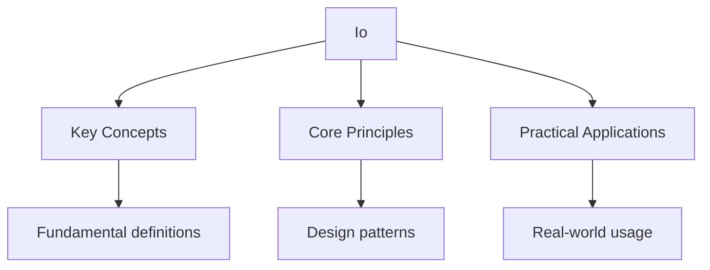

---

title: "Standard Library I/O | Go - Wyatt's Notes"
description: "The package defines the fundamental I/O interfaces that permeate Go' s standard l Comprehensive educational content coverage with definitions and practice pr"
date: 2026-04-18
tags:
  - Go
categories:
  - Go
---

<!-- Breadcrumb Schema for SEO -->
<script type="application/ld+json">
{
  "@context": "https://schema.org",
  "@type": "BreadcrumbList",
  "itemListElement": [{"name": "Home", "url": "https://wyattau.com"}, {"name": "go", "url": "https://go.wyattau.com"}, {"name": "Standard Library", "url": "https://go.wyattau.com/standard-library"}, {"name": "Io", "url": "https://go.wyattau.com/standard-library/io"}]
}
</script>

## The io Package

The `io` package defines the fundamental I/O interfaces that permeate Go's standard library:

```go
type Reader interface {
    Read(p []byte) (n int, err error)
}

type Writer interface {
    Write(p []byte) (n int, err error)
}

type Closer interface {
    Close() error
}

type ReaderAt interface {
    ReadAt(p []byte, off int64) (n int, err error)
}

type WriterAt interface {
    WriteAt(p []byte, off int64) (n int, err error)
}

type Seeker interface {
    Seek(offset int64, whence int) (int64, error)
}

type ReadWriter interface {
    Reader
    Writer
}

type ReadCloser interface {
    Reader
    Closer
}

type WriteCloser interface {
    Writer
    Closer
}
```

### io.Reader Contract

`Read` reads up to `len(p)` bytes into `p`. It returns the number of bytes read (`n`) and any error
Encountered. Key semantics:

- `Read` returns `io.EOF` when the stream ends. `io.EOF` is not an error in the conventional sense
  -- it indicates that no more bytes are available.
- `n > 0` and `err != nil` can occur simultaneously. This means some bytes were read before the
  error. The caller should process the `n` bytes before handling the error.
- `n == 0` and `err == nil` is valid and means "try again later" (e.g., for non-blocking reads).
- `n == 0` and `err == io.EOF` means the stream is exhausted.

### io.Copy

`io.Copy` copies from a Reader to a Writer:

```go
n, err := io.Copy(dst, src)
```

It uses a 32 KB internal buffer and handles `io.ReaderFrom`/`io.WriterTo` optimizations
Automatically.

### io.TeeReader

`io.TeeReader` returns a Reader that writes to a Writer as it reads:

```go
tee := io.TeeReader(reader, os.Stdout) // prints everything read
data, _ := io.ReadAll(tee)
```

### io.LimitReader

`io.LimitReader` returns a Reader that reads at most N bytes:

```go
limited := io.LimitReader(file, 1024) // read at most 1024 bytes
```

### io.MultiReader and io.MultiWriter

Combine multiple readers or writers:

```go
r := io.MultiReader(reader1, reader2, reader3)
w := io.MultiWriter(os.Stdout, logFile)
```

## The bufio Package

`bufio` provides buffered I/O wrappers around `io.Reader` and `io.Writer`. Buffering reduces system
Call overhead by batching small reads and writes.

### bufio.Reader

```go
reader := bufio.NewReader(file)

line, err := reader.ReadString('\n')  // read until delimiter
line, isPrefix, err := reader.ReadLine() // read a line (no trailing \n)

rune, size, err := reader.ReadRune() // read a single Unicode rune
```

### bufio.Scanner

`bufio.Scanner` provides a convenient interface for reading data line by line or token by token:

```go
scanner := bufio.NewScanner(os.Stdin)
for scanner.Scan() {
    fmt.Println(scanner.Text())
}
if err := scanner.Err(); err != nil {
    log.Fatal(err)
}
```

Default scanner splits by lines. Custom split functions:

```go
scanner := bufio.NewScanner(file)
scanner.Split(bufio.ScanWords) // split by whitespace

for scanner.Scan() {
    fmt.Println(scanner.Text())
}
```

The scanner has a default max token size of 64 KB. Increase it if needed:

```go
scanner := bufio.NewScanner(file)
buf := make([]byte, 0, 1024*1024) // 1 MB buffer
scanner.Buffer(buf, 10*1024*1024) // allow up to 10 MB tokens
```

### bufio.Writer

```go
writer := bufio.NewWriter(os.Stdout)
writer.WriteString("hello\n")
writer.WriteString("world\n")
writer.Flush() // must flush to ensure all data is written
```

Use `defer writer.Flush()` to ensure buffered data is written on function exit.

## The os Package

### File Operations

```go
// Read entire file
data, err := os.ReadFile("config.json")

// Write entire file
err := os.WriteFile("output.txt", data, 0644)

// Open file for reading
f, err := os.Open("input.txt")
defer f.Close()

// Open file for writing (creates or truncates)
f, err := os.Create("output.txt")
defer f.Close()

// Open file with flags
f, err := os.OpenFile("log.txt", os.O_APPEND|os.O_CREATE|os.O_WRONLY, 0644)
defer f.Close()
```

### File Flags

| Flag          | Meaning                            |
| ------------- | ---------------------------------- |
| `os.O_RDONLY` | Read-only                          |
| `os.O_WRONLY` | Write-only                         |
| `os.O_RDWR`   | Read-write                         |
| `os.O_APPEND` | Append to file                     |
| `os.O_CREATE` | Create if not exists               |
| `os.O_TRUNC`  | Truncate when opening              |
| `os.O_EXCL`   | Used with O_CREATE, fail if exists |

### File Permissions

File permissions use Unix-style octal notation:

```go
0644 // owner: rw, group: r, others: r
0755 // owner: rwx, group: rx, others: rx
0600 // owner: rw, group: -, others: -
```

### Directory Operations

```go
entries, err := os.ReadDir("./dir")    // read directory entries
err := os.Mkdir("newdir", 0755)        // create directory
err := os.MkdirAll("a/b/c", 0755)      // create directory and parents
err := os.Remove("file.txt")           // remove file or empty directory
err := os.RemoveAll("dir")             // remove directory and contents
err := os.Rename("old", "new")         // rename or move
```

### os.Stdin, os.Stdout, os.Stderr

```go
os.Stdin  // *os.File, standard input
os.Stdout // *os.File, standard output
os.Stderr // *os.File, standard error
```

## The fmt Package

### Print Functions

```go
fmt.Print("hello")              // write to stdout
fmt.Println("hello")            // write with newline
fmt.Printf("value: %d\n", 42)   // formatted write
fmt.Fprintf(w, "value: %d\n", 42) // write to any io.Writer
fmt.Sprintf("value: %d", 42)    // format to string
fmt.Errorf("failed: %w", err)   // format to error
```

### Format Verbs

| Verb  | Meaning                        |
| ----- | ------------------------------ |
| `%v`  | Default format                 |
| `%+v` | Struct with field names        |
| `%#v` | Go syntax representation       |
| `%T`  | Type of the value              |
| `%d`  | Decimal integer                |
| `%x`  | Hexadecimal integer            |
| `%o`  | Octal integer                  |
| `%b`  | Binary integer                 |
| `%f`  | Decimal float                  |
| `%e`  | Scientific notation            |
| `%s`  | String                         |
| `%q`  | Quoted string                  |
| `%p`  | Pointer address                |
| `%t`  | Boolean (true/false)           |
| `%w`  | Error (wraps for errors.Is/As) |

### Width and Precision

```go
fmt.Printf("|%10s|\n", "hello")   // |     hello|   (right-aligned, width 10)
fmt.Printf("|%-10s|\n", "hello")  // |hello     |   (left-aligned, width 10)
fmt.Printf("%.2f\n", 3.14159)     // 3.14
fmt.Printf("%10.2f\n", 3.14)      //       3.14
```

## encoding/json

### Marshaling

```go
type User struct {
    Name string `json:"name"`
    Age  int    `json:"age,omitempty"`
    Email string `json:"email,omitempty"`
}

u := User{Name: "Alice", Age: 30}
data, err := json.Marshal(u)
// {"name":"Alice","age":30}

data, err := json.MarshalIndent(u, "", "  ")
// {
//   "name": "Alice",
//   "age": 30
// }
```

### Unmarshaling

```go
var u User
err := json.Unmarshal(data, &u)
```

### JSON Streaming

```go
decoder := json.NewDecoder(reader)
for decoder.More() {
    var item Item
    if err := decoder.Decode(&item); err != nil {
        break
    }
    process(item)
}

encoder := json.NewEncoder(writer)
encoder.Encode(item) // writes JSON followed by newline
```

### Raw JSON

Use `json.RawMessage` to defer parsing of a portion of JSON:

```go
type Envelope struct {
    Type string          `json:"type"`
    Data json.RawMessage `json:"data"`
}

func handle(e Envelope) {
    switch e.Type {
    case "user":
        var u User
        json.Unmarshal(e.Data, &u)
    case "event":
        var ev Event
        json.Unmarshal(e.Data, &ev)
    }
}
```

### Custom Marshaling

Implement `json.Marshaler` and `json.Unmarshaler` for custom serialization:

```go
func (t Time) MarshalJSON() ([]byte, error) {
    return json.Marshal(t.Format(time.RFC3339))
}

func (t *Time) UnmarshalJSON(data []byte) error {
    var s string
    if err := json.Unmarshal(data, &s); err != nil {
        return err
    }
    parsed, err := time.Parse(time.RFC3339, s)
    *t = Time(parsed)
    return err
}
```

## Intuition

**I/O is about composing streams:** Think of data flowing through a pipe system. `io.Reader` is a faucet that produces bytes, `io.Writer` is a drain that consumes them, and `io.Copy` is the pipe connecting them. Buffering (bufio) is like adding a reservoir — it batches small reads and writes to reduce the overhead of frequent system calls.

**Why it matters:** Nearly every Go program does I/O — reading files, serving HTTP requests, processing JSON, logging. The io.Reader/io.Writer interfaces are the foundation that makes Go's standard library so composable. Once you understand these interfaces, you can read from files, network connections, strings, or any custom source with the same code.

**The key insight:** `io.EOF` is not an error — it's a signal that the stream is exhausted. Always check for it separately from other errors.

## Common Pitfalls

1. **Not closing files.** Always use `defer f.Close()` after opening a file. Even when `Close`
   fails, the file descriptor is released.

2. **Ignoring io.EOF correctly.** `io.EOF` is not a fatal error. `io.ReadAll` returns `io.EOF` only
   if zero bytes were read (an empty stream). For normal reads, `io.EOF` accompanies the last batch
   of data.

3. **Forgetting to flush bufio.Writer.** Buffered data is not written until `Flush()` is called or
   the buffer is full. Use `defer writer.Flush()`.

4. **Scanner token too long.** `bufio.Scanner` has a default 64 KB max token size. If you are
   reading long lines, increase the buffer with `scanner.Buffer()`.

5. **JSON nil vs empty.** A `nil` slice marshals to `null`; an empty slice `[]T{}` marshals to `[]`.
   A `nil` map marshals to `null`; an empty map marshals to `{}`. This difference matters for API
   consumers.

6. **JSON unmarshal target must be a pointer.** `json.Unmarshal(data, u)` (non-pointer) silently
   succeeds without populating `u`. Always pass a pointer: `json.Unmarshal(data, &u)`.

7. **Using `%v` instead of `%w` for error formatting.** `%v` loses the error chain. Use `%w` to
   preserve it for `errors.Is` and `errors.As`.

8. **Not checking scanner errors.** After a `scanner.Scan()` loop, always check `scanner.Err()`. The
   loop may exit due to an I/O error, not just `io.EOF`.




## Summary

This topic covers the core concepts of standard library i/o, including underlying theory, practical
implementation, and key applications.

**Key concepts include:**

- core concepts and terminology
- algorithms and computational thinking
- practical implementation
- security and ethical considerations
- applications in the real world

Understanding these concepts thoroughly is essential for both examinations and practical
programming, and requires both theoretical knowledge and hands-on practice.

## Worked Examples

Worked examples demonstrating the application of key concepts are covered in the detailed sub-pages
linked above.

## Cross-References

- **[Net/HTTP](net-http):** HTTP client and server that use I/O operations.
- **[Strings and Time](strings-and-time):** String and time utilities used with I/O operations.
- **[Flashcards: Standard Library](../flashcards-standard-library):** Interactive flashcards for standard library concepts.
