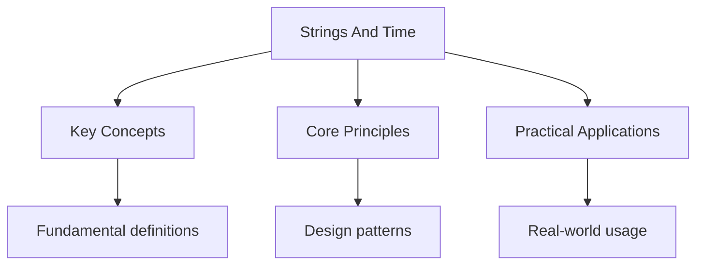

---

title: "strings and time | Go - Wyatt's Notes"
date: 2026-05-30
tags:
  - Go
categories:
  - Go
description: "The package provides functions for manipulating UTF-8 encoded strings. Strings in Go are immutable byte slices -- all operations return new strings rather"
---

<!-- Breadcrumb Schema for SEO -->
<script type="application/ld+json">
{
  "@context": "https://schema.org",
  "@type": "BreadcrumbList",
  "itemListElement": [{"name": "Home", "url": "https://wyattau.com"}, {"name": "go", "url": "https://go.wyattau.com"}, {"name": "Standard Library", "url": "https://go.wyattau.com/standard-library"}, {"name": "Strings And Time", "url": "https://go.wyattau.com/standard-library/strings-and-time"}]
}
</script>

## strings Package

The `strings` package provides functions for manipulating UTF-8 encoded strings. Strings in Go are
immutable byte slices -- all operations return new strings rather than modifying in place.

### Searching

```go
strings.Contains("hello world", "world")    // true
strings.HasPrefix("hello", "hel")            // true
strings.HasSuffix("hello", "llo")            // true
strings.Index("hello", "ll")                 // 2
strings.LastIndex("hello", "l")              // 3
strings.Count("hello", "l")                  // 2
```

`Index` returns -1 if the substring is not found. `Count` counts non-overlapping occurrences.

### Splitting and Joining

```go
parts := strings.Split("a,b,c", ",")     // ["a", "b", "c"]
parts := strings.SplitN("a,b,c", ",", 2) // ["a", "b,c"]
result := strings.Join(parts, "-")        // "a-b-c"
fields := strings.Fields("  hello  world  ") // ["hello", "world"]
```

`SplitN` limits the number of splits. `Fields` splits on whitespace and discards empty strings.

### Trimming and Case

```go
strings.TrimSpace("  hello  ")     // "hello"
strings.Trim("!!!hello!!!", "!")   // "hello"
strings.TrimPrefix("hello", "hel") // "lo"
strings.TrimSuffix("hello", "llo") // "hel"
strings.ToUpper("hello")            // "HELLO"
strings.ToLower("HELLO")            // "hello"
```

### Replace and Repeat

```go
strings.Replace("foo bar foo", "foo", "baz", 1)  // "baz bar foo"
strings.ReplaceAll("foo bar foo", "foo", "baz")   // "baz bar baz"
strings.Repeat("ab", 3)                           // "ababab"
```

`Replace` takes a count argument -- -1 replaces all occurrences (same as `ReplaceAll`).

### strings.Builder

For efficient string concatenation in loops, use `strings.Builder` instead of repeated `+=`:

```go
var b strings.Builder
for _, s := range items {
    b.WriteString(s)
    b.WriteByte(",')
}
result := b.String()
```

`Builder` avoids allocating a new string on each concatenation. `Grow(n)` pre-allocates capacity:

```go
var b strings.Builder
b.Grow(1000)
for _, s := range items {
    b.WriteString(s)
}
```

## strconv Package

The `strconv` package converts between strings and other types:

```go
n, err := strconv.Atoi("42")          // int 42
s := strconv.Itoa(42)                 // "42"
s := strconv.FormatBool(true)         // "true"
s := strconv.FormatInt(-42, 10)       // "-42"
s := strconv.FormatInt(255, 16)       // "ff"
s := strconv.FormatFloat(3.14, 'f', 2, 64) // "3.14"

f, err := strconv.ParseFloat("3.14", 64)    // 3.14
i, err := strconv.ParseInt("ff", 16, 64)    // 255

s := strconv.Quote("hello \"world\"")   // "hello \"world\""
s, err := strconv.Unquote(`"hello"`)   // "hello"
```

`Atoi` is shorthand for `ParseInt(s, 10, 0)`. Always check the returned error.

## time Package

### Creating and Reading time.Time

```go
t := time.Now()              // current local time
t := time.Date(2026, 5, 30, 14, 30, 0, 0, time.UTC)

fmt.Println(t.Year())       // 2026
fmt.Println(t.Month())      // May
fmt.Println(t.Day())        // 30
fmt.Println(t.Hour())       // 14
fmt.Println(t.Minute())     // 30
fmt.Println(t.Second())     // 0
fmt.Println(t.Unix())       // seconds since epoch
fmt.Println(t.UnixNano())   // nanoseconds since epoch
fmt.Println(t.Weekday())    // Saturday
fmt.Println(t.IsZero())     // false
```

### Parsing

```go
layout := "2006-01-02 15:04:05"
t, err := time.Parse(layout, "2026-05-30 14:30:00")
```

Go uses a reference date for layout strings. The reference date is `Mon Jan 2 15:04:05 MST 2006`
(which is `01/02 03:04:05 PM 06 -0700` in a more memorable form). Each component determines how the
corresponding value is interpreted.

Common layouts:

```go
time.RFC3339      // "2006-01-02T15:04:05Z07:00"
time.RFC3339Nano  // "2006-01-02T15:04:05.999999999Z07:00"
time.RFC1123      // "Mon, 02 Jan 2006 15:04:05 MST"
time.Kitchen      // "3:04PM"
time.RubyDate     // "2006-01-02 15:04:05 -0700"
time.UnixDate     // "Mon Jan 2 15:04:05 MST 2006"
```

### Formatting

```go
t := time.Now()
fmt.Println(t.Format(time.RFC3339))         // "2026-05-30T14:30:00Z"
fmt.Println(t.Format("2006-01-02"))         // "2026-05-30"
fmt.Println(t.Format("Jan _2, 2006"))       // "May 30, 2026"
fmt.Println(t.Format("15:04:05"))          // "14:30:00"
```

### Duration

`time.Duration` is an `int64` representing nanoseconds. Constants help construct durations:

```go
d := 2 * time.Hour + 30 * time.Minute   // 2h30m0s
d := time.Millisecond * 500            // 500ms
d := time.Duration(5) * time.Second     // 5s

fmt.Println(d)                         // "2h30m0s"
fmt.Println(d.Hours())                 // 2.5
fmt.Println(d.Minutes())               // 150
fmt.Println(d.Seconds())               // 9000
fmt.Println(d.Milliseconds())          // 9000000
```

### Time Arithmetic

```go
t := time.Now()
future := t.Add(24 * time.Hour)        // 24 hours from now
past := t.Add(-24 * time.Hour)         // 24 hours ago

diff := future.Sub(t)                  // 24h0m0s
fmt.Println(diff.Hours())              // 24

t1 := time.Date(2026, 1, 1, 0, 0, 0, 0, time.UTC)
t2 := time.Date(2026, 12, 31, 0, 0, 0, 0, time.UTC)
t1.Before(t2)                         // true
t1.After(t2)                          // false
t2.Equal(t1)                          // false

since := time.Since(t1)               // duration since t1
until := time.Until(t2)               // duration until t2
```

## Timers and Tickers

### time.Timer

A `Timer` fires once after a specified duration:

```go
timer := time.NewTimer(2 * time.Second)
<-timer.C    // blocks for 2 seconds, then receives the current time
```

Stop a timer before it fires:

```go
timer := time.NewTimer(5 * time.Second)
stopped := timer.Stop()
if stopped {
    fmt.Println("timer was stopped before firing")
}
```

If the timer has already fired or been stopped, `Stop()` returns false. Always drain the channel if
`Stop()` returns false:

```go
if !timer.Stop() {
    <-timer.C
}
```

### time.Ticker

A `Ticker` fires repeatedly at a fixed interval:

```go
ticker := time.NewTicker(1 * time.Second)
defer ticker.Stop()

for i := 0; i < 5; i++ {
    <-ticker.C
    fmt.Println("tick", time.Now().Format("15:04:05"))
}
```

Always stop tickers with `defer ticker.Stop()` to prevent goroutine leaks.

### time.After and time.AfterFunc

```go
// After: fires once, returns a channel
<-time.After(2 * time.Second)   // blocks for 2 seconds

// AfterFunc: fires once, calls a function
timer := time.AfterFunc(2*time.Second, func() {
    fmt.Println("2 seconds elapsed")
})
timer.Stop() // cancel
```

`time.After` is convenient but note that it creates a timer that is not garbage-collected until it
fires. Avoid `time.After` in tight loops -- use `time.NewTimer` instead.

## Time Zones

```go
loc, err := time.LoadLocation("America/New_York")
if err != nil {
    log.Fatal(err)
}

t := time.Date(2026, 5, 30, 14, 30, 0, 0, loc)
fmt.Println(t)                   // 2026-05-30 14:30:00 -0400 EDT

utc := t.UTC()                   // convert to UTC
local := t.Local()               // convert to local
back := utc.In(loc)              // convert to specific location
```

`time.UTC` is a pre-defined location for UTC. `time.Local` is the system's local time zone.

Comparisons: always compare times in the same zone. `Equal` compares the absolute instant regardless
of location:

```go
t1 := time.Date(2026, 5, 30, 14, 0, 0, 0, time.UTC)
t2 := time.Date(2026, 5, 30, 10, 0, 0, 0, loc) // same instant, different zone
t1.Equal(t2)  // true
```

## Intuition

**Strings are just byte sequences with UTF-8 encoding:** Think of a Go string as an immutable array of bytes that happens to be encoded in UTF-8. The `strings` package gives you tools to manipulate these bytes — searching, splitting, trimming, and converting case. Time handling is about parsing and formatting these byte representations of dates and times.

**Why it matters:** String manipulation is fundamental to data processing, parsing, and formatting. Understanding Go's string handling (UTF-8 aware, immutable) prevents bugs like assuming strings are arrays of characters. Time handling is essential for logging, scheduling, and data processing.

**The key insight:** Go strings are immutable — every string operation creates a new string. For heavy string concatenation in loops, use `strings.Builder` to avoid quadratic allocation.

## Common Pitfalls

1. **Using += for string concatenation in loops.** Each `+=` allocates a new string. Use
   `strings.Builder` for repeated concatenation.

2. **Not checking strconv errors.** `Atoi` and `ParseInt` return errors for invalid input. Ignoring
   the error yields a zero value, which can silently corrupt data.

3. **Using the wrong layout string for time.Parse.** The layout must use the reference date
   `2006-01-02 15:04:05`. Using other values (e.g., `2015-01-02`) causes incorrect parsing.

4. **Comparing times with ==.** Use `t1.Equal(t2)` instead. Two `time.Time` values in different
   locations representing the same instant are not `==`, but `Equal` returns `true`.

5. **Leaking timers and tickers.** `time.NewTimer` and `time.NewTicker` create resources that must
   be stopped. Failing to call `Stop()` leaks a goroutine. Always use `defer`.

6. **Using time.After in a loop.** Each call creates a new timer that cannot be stopped. In a loop,
   this leaks timers. Use `time.NewTimer` with `Stop()` instead.

7. **Ignoring time zone in parsing.** `time.Parse` without a time zone offset produces a time with
   no location (UTC +0). Use `time.ParseInLocation` when the input has a known time zone but no
   offset:

```go
loc, _ := time.LoadLocation("America/New_York")
t, _ := time.ParseInLocation("2006-01-02 15:04", "2026-05-30 14:30", loc)
```




## Summary

This topic covers the core concepts of strings and time in Go, including underlying theory,
practical implementation, and key applications.

**Key concepts include:**

- string manipulation and efficient concatenation
- type conversions with strconv
- time parsing, formatting, and arithmetic
- timers, tickers, and time zones
- common pitfalls and best practices

Understanding these concepts thoroughly is essential for both examinations and practical
programming, and requires both theoretical knowledge and hands-on practice.

## Worked Examples

Worked examples demonstrating the application of key concepts are covered in the detailed sub-pages
linked above.

## Cross-References

- **[I/O](io.md):** File and stream operations that work with string data.
- **[Net/HTTP](net-http.md):** HTTP client and server that use string and time utilities.
- **[Basics](../basics/):** Fundamental Go concepts including string and time types.
