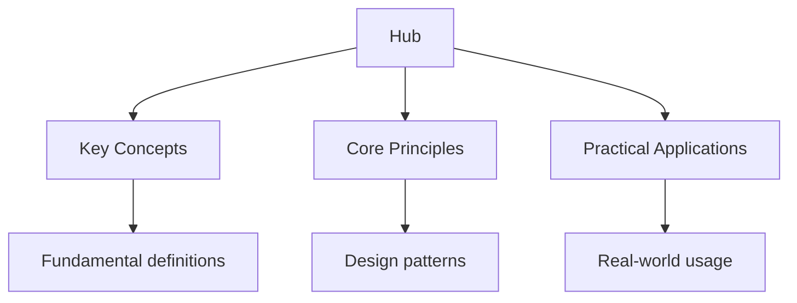

## Why This Guide Exists

Haskell is a purely functional programming language with a strong static type system. It enforces purity — functions have no side effects — and uses laziness by default. These constraints lead to code that is concise, composable, and provably correct. Haskell's type system, including type classes, algebraic data types, and higher-kinded types, enables powerful abstractions that other languages cannot express.

This hub page maps every resource on this site. The learning path takes you from Haskell's core syntax through the type system, monads, and advanced functional patterns, building a thorough understanding of how to think in Haskell.

## Table of Contents

- [Functional Programming Fundamentals](#functional-programming-fundamentals)
- [Type System](#type-system)
- [Type Classes](#type-classes)
- [Algebraic Data Types](#algebraic-data-types)
- [Monads](#monads)
- [Advanced Topics](#advanced-topics)
- [Learning Path](#learning-path)
- [Cross-Site Resources](#cross-site-resources)
- [FAQ](#faq)

---

## Functional Programming Fundamentals

Haskell is the purest functional programming language in mainstream use. Functions are first-class citizens, higher-order functions are ubiquitous, and pattern matching replaces most control flow. Understanding Haskell's functional paradigm is the foundation for everything else.

### Topic Notes

- [Syntax Basics](02-fundamentals/01-syntax-basics) — function definitions, guards, and where clauses
- [Higher-Order Functions](../../../../alevel/src/content/docs/maths/pure-mathematics/05-functions) — map, filter, fold, and function composition
- [Currying and Partial Application](02-fundamentals/03-currying-and-partial-application) — all functions take one argument, function application
- [Laziness](02-fundamentals/04-laziness) — lazy evaluation, infinite data structures, and thunks
- [Lists and Recursion](02-fundamentals/05-lists-and-recursion) — list comprehension, pattern matching, and recursive data structures

### Key Concepts

**Currying** — Every Haskell function takes exactly one argument and returns one result. A function that appears to take two arguments actually takes one argument and returns a function that takes the second argument. This enables partial application: `map (+1)` applies `+1` to every element.

**Laziness** — Haskell evaluates expressions only when their values are needed. This enables infinite data structures and eliminates unnecessary computation. `take 5 [1..]` produces the first five integers from an infinite list without computing the entire list.

**Pattern matching** — Destructure values and dispatch on their shape. `head (x:xs) = x` matches a non-empty list and binds the first element to `x`. Pattern matching replaces if/else chains with concise, declarative code.

---

## Type System

Haskell's type system is one of its greatest strengths. Types are inferred — you rarely need to write type annotations — but they are checked at compile time. The type system prevents entire categories of bugs and serves as documentation.

### Topic Notes

- [Basic Types](03-types/01-basic-types) — Int, Integer, Float, Double, Bool, Char, and String
- [Type Inference](03-types/02-type-inference) — how the compiler deduces types
- [Type Annotations](03-types/03-type-annotations) — explicit type signatures and why they matter
- [Parametric Polymorphism](03-types/04-parametric-polymorphism) — type variables and generic functions
- [Higher-Kinded Types](03-types/05-higher-kinded-types) — kind inference and type constructors

### Key Concepts

**Type inference** — Haskell deduces the most general type for every expression. You can write programs without type annotations, and the compiler will figure out the types. However, adding type signatures improves readability and error messages.

**Parametric polymorphism** — A function with type variable `a` works for any type. `id :: a -> a` is the identity function — it works for integers, strings, lists, or any other type. The implementation cannot inspect the value because it knows nothing about the type.

**Higher-kinded types** — Types can be parameterized by type constructors, not just types. `Functor f => (a -> b) -> f a -> f b` works for any type constructor `f` that implements Functor — lists, Maybe, IO, or custom types. This enables generic programming over type constructors.

---

## Type Classes

Type classes define interfaces for groups of types. They are similar to interfaces in other languages but more powerful — they support ad-hoc polymorphism and can be defined after the types they describe.

### Topic Notes

- [Type Class Basics](04-type-classes/01-type-class-basics) — defining type classes, deriving instances
- [Standard Type Classes](../../../../java/src/content/docs/03-object-oriented/01-classes) — Eq, Ord, Show, Read, Num, Functor, Applicative, Monad
- [Instance Resolution](04-type-classes/03-instance-resolution) — how the compiler finds the right instance
- [Multi-Parameter Type Classes](../../../../java/src/content/docs/03-object-oriented/01-classes) and functional dependencies

### Key Concepts

**Type classes vs interfaces** — A type class defines a set of methods. A type is an instance of a type class if it implements those methods. Unlike interfaces, type classes can be defined separately from the types they describe — you can make an existing type an instance of a new type class.

**Deriving** — Haskell can automatically derive instances for common type classes. `data Color = Red | Green | Blue deriving (Eq, Show, Enum)` automatically generates equality, string representation, and enumeration instances.

**The Functor/Applicative/Monad hierarchy** — These three type classes form the backbone of Haskell's abstract design. Functor maps over values in a context. Applicative applies functions in a context. Monad sequences computations in a context. Understanding this hierarchy is essential for advanced Haskell.

---

## Algebraic Data Types

Algebraic data types (ADTs) model data by combining types. Sum types represent alternatives (OR). Product types represent combinations (AND). ADTs are the primary way to model domain data in Haskell.

### Topic Notes

- [Sum Types](05-adts/01-sum-types) — data declarations with multiple constructors
- [Product Types](05-adts/02-product-types) — records and positional constructors
- [Newtype](05-adts/03-newtype) — zero-cost type wrappers for safety and clarity
- [Recursive Types](05-adts/04-recursive-types) — lists, trees, and other recursive structures

### Key Concepts

**Sum types** represent one of several alternatives. `data Shape = Circle Double | Rectangle Double Double` — a Shape is either a Circle or a Rectangle, not both. Pattern matching on sum types is exhaustive and checked at compile time.

**Product types** represent combinations of fields. `data Point = Point Double Double` — a Point has two Doubles. Record syntax provides named fields: `data Point = Point { x :: Double, y :: Double }`.

**Newtype** wraps an existing type with zero runtime overhead. `newtype Email = Email String` creates a distinct type that prevents mixing emails with other strings at compile time. Newtypes are erased at runtime.

---

## Monads

Monads are the most discussed and least understood concept in Haskell. They are a design pattern for sequencing computations with effects — IO, state, errors, and more. Monads are not magic — they are a type class with three operations.

### Topic Notes

- [Monad Basics](06-monads/01-monad-basics) — return, bind (>>=), and do notation
- [IO Monad](06-monads/02-io-monad) — sequencing side effects in a pure language
- [Maybe and Either](06-monads/03-maybe-and-either) — monadic error handling
- [State Monad](06-monads/04-state-monad) — threading state through computations
- [Monad Transformers](06-monads/05-monad-transformers) — combining monadic effects

### Key Concepts

**The Monad type class** — `class Monad m where return :: a -> m a; (>>=) :: m a -> (a -> m b) -> m b`. `return` wraps a value in a monadic context. `>>=` (bind) chains monadic computations. Do notation is syntactic sugar for bind chains.

**The IO monad** — IO is a type that represents side effects. A function of type `IO String` describes an action that produces a String but does not execute until the runtime runs it. This keeps Haskell pure — side effects are described, not executed.

**Monad transformers** stack multiple monadic effects. `StateT s (ExceptT e IO) a` combines state, error handling, and IO. Transformers are complex but powerful — they let you compose effects without writing custom monads.

---

## Advanced Topics

These topics cover Haskell's deeper layers — applicatives, monoids, lenses, and property-based testing. They are essential for writing production Haskell code.

### Topic Notes

- [Applicative Functors](07-advanced/01-applicative-functors) — pure, (<*>), and applicative style
- [Monoids and Folds](07-advanced/02-monoids-and-folds) — Monoid type class, foldMap, and monoidal aggregation
- [Lenses](07-advanced/03-lenses) — focusing on parts of nested data structures
- [Property-Based Testing](../../../../alevel/src/content/docs/computer-science/software-engineering/02-testing) — QuickCheck, Arbitrary, and generative testing

### Key Concepts

**Applicative functors** provide a middle ground between Functor and Monad. They allow applying functions in a context without sequencing. `pure f <*> x` applies a function in a context to a value in a context. Applicatives are more general than monads and compose better.

**Monoids** define an associative binary operation and an identity element. `Sum` adds numbers, `Product` multiplies, `Any` checks any-true, `All` checks all-true. Monoids enable powerful aggregation with `foldMap` and `mconcat`.

**Lenses** provide a compositional way to focus on parts of nested data structures. They are first-class values that can be composed with `.` to drill into deep structures. Lenses make nested updates clean and composable.

---

## Learning Path

Haskell has a steep learning curve. The pure functional paradigm and advanced type system require a mental shift. Follow this progression.

### Stage 1: Functional Foundations (Weeks 1–4)

- Learn syntax, pattern matching, and recursion
- Understand higher-order functions — map, filter, fold
- Study currying, partial application, and function composition

### Stage 2: Types and Type Classes (Weeks 5–8)

- Learn algebraic data types — sum and product types
- Understand type inference and type annotations
- Study standard type classes — Eq, Ord, Show, Num, Functor

### Stage 3: Monads and Effects (Weeks 9–14)

- Learn the Monad type class, return, and bind
- Understand the IO monad and do notation
- Study Maybe, Either, and the State monad

### Stage 4: Advanced Patterns (Weeks 15–20)

- Learn applicative functors and monoids
- Study lenses and property-based testing
- Build a real application using advanced patterns

---

## Cross-Site Resources

Wyatt's Notes is a network of interconnected programming and study sites:

- **[Rust Programming Guide](https://rust.wyattau.com/hub)** — Rust borrows many concepts from Haskell (traits from type classes, Option from Maybe)
- **[Python Programming Guide](https://python.wyattau.com/hub)** — if you are comparing Haskell with a dynamic language
- **[Computer Science Study Guide](https://computer-science.wyattau.com/hub)** — theory and algorithms that apply to Haskell
- **[University Mathematics](https://mathematics.wyattau.com/hub)** — the mathematical foundations underlying Haskell's type system

---

## Frequently Asked Questions

### How long does it take to learn Haskell?

Haskell has one of the steepest learning curves of any mainstream language. Basic competence takes 2–3 months. Understanding monads and the type system takes 4–6 months. Advanced Haskell with monad transformers, lenses, and type-level programming takes 6–12 months. The learning curve is steep but the mental model transfers to other languages.

### Why is Haskell pure?

Purity means functions have no side effects — they return the same output for the same input every time. This makes Haskell code predictable, testable, and parallelizable. Side effects are isolated in the IO monad, making them explicit and controllable. Purity is enforced by the type system.

### What are monads and why do they matter?

Monads are a design pattern for sequencing computations with effects (IO, errors, state). They provide a uniform interface for different kinds of effects. Do notation makes monadic code look imperative while maintaining purity. Understanding monads is essential for writing any Haskell code that interacts with the outside world.

### Is Haskell practical for real-world projects?

Yes, but with caveats. Haskell excels at correctness-critical applications: compilers, financial systems, and formal verification. The ecosystem is smaller than mainstream languages, and hiring Haskell developers is harder. For most web applications, a mainstream language is more practical.

### What is the difference between laziness and strictness?

Laziness means expressions are not evaluated until their values are needed. Strictness means expressions are evaluated immediately. Haskell is lazy by default — `let x = expensiveComputation in 42` never computes `expensiveComputation`. This enables infinite data structures but can cause space leaks if not managed.

### Should I learn Haskell or a less strict functional language first?

If you want to learn pure functional programming concepts, Haskell is the best choice — it is the most principled and educational. If you want to apply functional programming in production, consider OCaml, F#, or Elm as gentler introductions. The concepts transfer between all functional languages.

---

*Last updated: 24 July 2026*

*Written by Wyatt. For questions or feedback, visit [wyattau.com](https://wyattau.com).*
