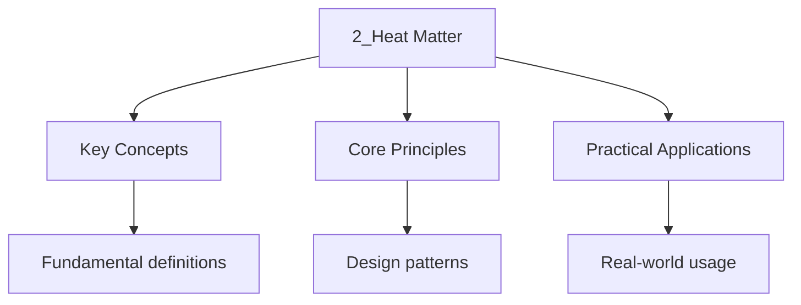

---

title: "Energy and Matter | Highers - Wyatt's Notes"
description: "Scottish Highers Chemistry Energy and Matter notes covering key definitions, core concepts, worked examples, and practice questions for in-depth revision."
date: 2026-04-14
tags:
  - highers
  - highers-chemistry
categories:
  - highers-chemistry

---

<!-- Breadcrumb Schema for SEO -->
<script type="application/ld+json">
{
  "@context": "https://schema.org",
  "@type": "BreadcrumbList",
  "itemListElement": [{"name": "Home", "url": "https://wyattau.com"}, {"name": "highers", "url": "https://highers.wyattau.com"}, {"name": "Chemistry", "url": "https://highers.wyattau.com/chemistry"}, {"name": "2 Heat Matter", "url": "https://highers.wyattau.com/chemistry/2-heat-matter"}, {"name": "2_heat Matter", "url": "https://highers.wyattau.com/chemistry/2-heat-matter/2_heat-matter"}]
}
</script>

## Energy and Matter

## Higher Energetics

### Enthalpy Changes

**Enthalpy ($H$):** The heat content of a system at constant pressure.

**Standard enthalpy change of reaction ($\Delta H_r^\circ$):** The enthalpy change when molar
Quantities of reactants as stated in the equation react under standard conditions (298 K, 100 kPa).

**Exothermic:** $\Delta H < 0$ (energy released to surroundings).

**Endothermic:** $\Delta H > 0$ (energy absorbed from surroundings).

### Types of Enthalpy Change

| Symbol                          | Name                                | Definition                                                                        |
| ------------------------------- | ----------------------------------- | --------------------------------------------------------------------------------- |
| $\Delta H_f^\circ$              | Standard enthalpy of formation      | Enthalpy change when 1 mol of compound forms from its elements in standard states |
| $\Delta H_c^\circ$              | Standard enthalpy of combustion     | Enthalpy change when 1 mol of substance burns completely in oxygen                |
| $\Delta H_{\mathrm{neut}^\circ$ | Standard enthalpy of neutralisation | Enthalpy change when 1 mol of water forms from acid-base neutralisation           |
| $\Delta H_{\mathrm{at}$         | Enthalpy of atomisation             | Enthalpy change to form 1 mol of gaseous atoms from an element                    |

### Hess"s Law

Hess's Law states that the enthalpy change of a reaction is independent of the route taken, provided
The initial and final conditions are the same.

$$\Delta H_1 = \Delta H_2 + \Delta H_3$$

**Proof of Hess's Law:**

Enthalpy is a state function, meaning only on the initial and final states, not on the Pathway.
Since enthalpy is defined as $H = U + pV$ and $U$ (internal energy) and $pV$ are both state
Functions, $H$ must also be a state function. Therefore, any path between the same initial and final
States must give the same $\Delta H$.

**Worked Example 1:** Calculate $\Delta H_f^\circ$ for $\mathrm{CH_4$ given:

$$\mathrm{C(s) + \mathrm{O_2\mathrm{(g) \to \mathrm{CO_2\mathrm{(g) \quad \Delta H = -393.5 \mathrm{ kJ/mol$$

$$\mathrm{H_2\mathrm{(g) + \tfrac{1}{2}\mathrm{O_2\mathrm{(g) \to \mathrm{H_2\mathrm{O(l) \quad \Delta H = -285.8 \mathrm{ kJ/mol$$

$$\mathrm{CH_4\mathrm{(g) + 2\mathrm{O_2\mathrm{(g) \to \mathrm{CO_2\mathrm{(g) + 2\mathrm{H_2\mathrm{O(l) \quad \Delta H = -890.3 \mathrm{ kJ/mol$$

Using Hess's Law (elements $\to$ products via two routes):

$$\Delta H_f(\mathrm{CH_4) + (-890.3) = -393.5 + 2(-285.8)$$

$$\Delta H_f(\mathrm{CH_4) = -393.5 - 571.6 + 890.3 = -74.8 \mathrm{ kJ/mol$$

**Worked Example 2:** Calculate $\Delta H_f^\circ$ for $\mathrm{CS_2$ given:

$$\mathrm{C(s) + \mathrm{O_2\mathrm{(g) \to \mathrm{CO_2\mathrm{(g) \quad \Delta H = -393.5 \mathrm{ kJ/mol$$

$$\mathrm{S(s) + \mathrm{O_2\mathrm{(g) \to \mathrm{SO_2\mathrm{(g) \quad \Delta H = -296.8 \mathrm{ kJ/mol$$

$$\mathrm{CS_2\mathrm{(l) + 3\mathrm{O_2\mathrm{(g) \to \mathrm{CO_2\mathrm{(g) + 2\mathrm{SO_2\mathrm{(g) \quad \Delta H = -1075 \mathrm{ kJ/mol$$

Route 1: $\mathrm{C + 2\mathrm{S \to \mathrm{CS_2$ (direct, $\Delta H_f$) Route 2:
$\mathrm{C + \mathrm{O_2 \to \mathrm{CO_2$ and $2\mathrm{S + 2\mathrm{O_2 \to 2\mathrm{SO_2$ Then
$\mathrm{CO_2 + 2\mathrm{SO_2 \to \mathrm{CS_2 + 3\mathrm{O_2$ (reverse the combustion)

$$\Delta H_f = -393.5 + 2(-296.8) - (-1075) = -393.5 - 593.6 + 1075 = 87.9 \mathrm{ kJ/mol$$

### Calorimetry

**Enthalpy of combustion:**

$$q = mc\Delta T$$

Where $m$ is mass of water, $c$ is specific heat capacity ($4.18 \mathrm{ J g^{-1}\mathrm{K^{-1}$),
And $\Delta T$ is temperature change.

**Worked Example 3:** When $1.50 \mathrm{ g$ of ethanol is burned, it raises the temperature of
$200 \mathrm{ g$ of water by $14.2°C$. Calculate the enthalpy of combustion.

$$q = 200 \times 4.18 \times 14.2 = 11871.2 \mathrm{ J = 11.87 \mathrm{ kJ$$

$$n(\mathrm{ethanol) = \frac{1.50}{46.07} = 0.03256 \mathrm{ mol$$

$$\Delta H_c = -\frac{11.87}{0.03256} = -364.7 \mathrm{ kJ/mol$$

(The negative sign indicates exothermic.)

**Worked Example 4:** $0.80 \mathrm{ g$ of ethanol ($M_r = 46$) raised the temperature of
$150 \mathrm{ g$ of water by $10.5°C$. Calculate $\Delta H_c$ and suggest why this differs from the
Literature value of $-1367 \mathrm{ kJ/mol$.

$$q = 150 \times 4.18 \times 10.5 = 6583.5 \mathrm{ J = 6.58 \mathrm{ kJ$$

$$n = \frac{0.80}{46} = 0.0174 \mathrm{ mol$$

$$\Delta H_c = -\frac{6.58}{0.0174} = -378 \mathrm{ kJ/mol$$

This is much less exothermic than the literature value because of:

- Heat loss to the surroundings (calorimeter is not perfectly insulated)
- Incomplete combustion of ethanol
- Not all heat was transferred to the water (some heated the calorimeter itself)

### Enthalpy of Neutralisation

**Worked Example 5:** $25.0 \mathrm{ cm^3$ of $1.0 \mathrm{ M$ HCl is mixed with
$25.0 \mathrm{ cm^3$ Of $1.0 \mathrm{ M$ NaOH. The temperature rises by $6.8°C$. Calculate the
enthalpy of neutralisation.

$$q = 50.0 \times 4.18 \times 6.8 = 1421.2 \mathrm{ J = 1.42 \mathrm{ kJ$$

$$n = 1.0 \times 0.0250 = 0.0250 \mathrm{ mol$$

$$\Delta H_{\mathrm{neut} = -\frac{1.42}{0.0250} = -56.8 \mathrm{ kJ/mol$$

---

<!-- Breadcrumb Schema for SEO -->
<script type="application/ld+json">
{
  "@context": "https://schema.org",
  "@type": "BreadcrumbList",
  "itemListElement": [{"name": "Home", "url": "https://wyattau.com"}, {"name": "highers", "url": "https://highers.wyattau.com"}, {"name": "Chemistry", "url": "https://highers.wyattau.com/chemistry"}, {"name": "2 Heat Matter", "url": "https://highers.wyattau.com/chemistry/2-heat-matter"}, {"name": "2_heat Matter", "url": "https://highers.wyattau.com/chemistry/2-heat-matter/2_heat-matter"}]
}
</script>

## Chemical Equilibrium

### Dynamic Equilibrium

In a **reversible reaction**, when the rate of the forward reaction equals the rate of the reverse
Reaction, the system is at **dynamic equilibrium**.

$$aA + bB \rightleftharpoons cC + dD$$

**Conditions for dynamic equilibrium:**

1. The reaction must be reversible
2. The system must be closed (no matter can enter or leave)
3. The temperature must be constant
4. Macroscopic properties (concentration, colour, pressure) remain constant

### Le Chatelier's Principle

If a system at equilibrium is subjected to a change, the system adjusts to **oppose** that change.

| Change                             | Effect                                                            |
| ---------------------------------- | ----------------------------------------------------------------- |
| Increase concentration of reactant | Equilibrium shifts right (products)                               |
| Increase pressure                  | Shifts towards fewer gas moles                                    |
| Increase temperature               | Shifts in the endothermic direction                               |
| Add catalyst                       | No effect on position; increases rate of both forward and reverse |

**Example:** For the Haber process:
$\mathrm{N_2 + 3\mathrm{H_2 \rightleftharpoons 2\mathrm{NH_3 \quad \Delta H = -92 \mathrm{ kJ/mol$.

- High pressure favours $\mathrm{NH_3$ (4 moles $\to$ 2 moles of gas)
- Low temperature favours $\mathrm{NH_3$ (exothermic), but slow rate
- Compromise: moderate temperature (~450°C), high pressure (~200 atm), iron catalyst

**Worked Example 6:** Explain the effect of increasing pressure on the equilibrium
$\mathrm{N_2\mathrm{O_4\mathrm{(g) \rightleftharpoons 2\mathrm{NO_2\mathrm{(g)$.

The forward reaction produces 2 moles of gas from 1 mole. Increasing pressure favours the side with
Fewer gas moles, so the equilibrium shifts to the left, favouring $\mathrm{N_2\mathrm{O_4$. The
Mixture becomes paler (less brown $\mathrm{NO_2$ gas).

### Equilibrium Constant ($K_c$)

For the reaction $aA + bB \rightleftharpoons cC + dD$:

$$K_c = \frac{[C]^c[D]^d}{[A]^a[B]^b}$$

Where square brackets denote equilibrium concentrations in $\mathrm{mol/L$.

**Key points about $K_c$:**

- $K_c$ is only affected by temperature, not by concentration, pressure, or catalysts
- A large $K_c$ ($\gt 10^3$) means products are favoured
- A small $K_c$ ($\lt 10^{-3}$) means reactants are favoured
- Pure solids and pure liquids are NOT included in the $K_c$ expression

**Worked Example 7:** For $\mathrm{H_2 + \mathrm{I_2 \rightleftharpoons 2\mathrm{HI$At equilibrium
The concentrations are $[\mathrm{H_2] = 0.22$, $[\mathrm{I_2] = 0.22$
$[\mathrm{HI] = 1.56 \mathrm{ mol/L$. Find $K_c$.

$$K_c = \frac{[\mathrm{HI]^2}{[\mathrm{H_2][\mathrm{I_2]} = \frac{(1.56)^2}{(0.22)(0.22)} = \frac{2.4336}{0.0484} = 50.3$$

**Worked Example 8:** $2.0 \mathrm{ mol$ of $\mathrm{SO_2$ and $1.0 \mathrm{ mol$ of $\mathrm{O_2$
are Placed in a $1.0 \mathrm{ L$ flask at equilibrium. If $1.4 \mathrm{ mol$ of $\mathrm{SO_3$
forms, find $K_c$ for $\mathrm{2SO_2 + \mathrm{O_2 \rightleftharpoons 2\mathrm{SO_3$.

|             | $\mathrm{SO_2$ | $\mathrm{O_2$ | $\mathrm{SO_3$ |
| ----------- | -------------- | ------------- | -------------- |
| Initial     | 2.0            | 1.0           | 0              |
| Change      | -1.4           | -0.7          | +1.4           |
| Equilibrium | 0.6            | 0.3           | 1.4            |

$$K_c = \frac{[\mathrm{SO_3]^2}{[\mathrm{SO_2]^2[\mathrm{O_2]} = \frac{(1.4)^2}{(0.6)^2(0.3)} = \frac{1.96}{0.108} = 18.15$$

**Worked Example 9:** $1.0 \mathrm{ mol$ of $\mathrm{PCl_5$ is placed in a $5.0 \mathrm{ L$
container. At equilibrium, $0.3 \mathrm{ mol$ has dissociated:
$\mathrm{PCl_5 \rightleftharpoons \mathrm{PCl_3 + \mathrm{Cl_2$. Find $K_c$.

|             | $\mathrm{PCl_5$ | $\mathrm{PCl_3$ | $\mathrm{Cl_2$ |
| ----------- | --------------- | --------------- | -------------- |
| Initial     | 1.0             | 0               | 0              |
| Change      | -0.3            | +0.3            | +0.3           |
| Equilibrium | 0.7             | 0.3             | 0.3            |

Concentrations (divide by $V = 5.0$ L): $[\mathrm{PCl_5] = 0.14$, $[\mathrm{PCl_3] = 0.06$
$[\mathrm{Cl_2] = 0.06 \mathrm{ mol/L$.

$$K_c = \frac{[\mathrm{PCl_3][\mathrm{Cl_2]}{[\mathrm{PCl_5]} = \frac{(0.06)(0.06)}{0.14} = \frac{0.0036}{0.14} = 0.0257$$

---

<!-- Breadcrumb Schema for SEO -->
<script type="application/ld+json">
{
  "@context": "https://schema.org",
  "@type": "BreadcrumbList",
  "itemListElement": [{"name": "Home", "url": "https://wyattau.com"}, {"name": "highers", "url": "https://highers.wyattau.com"}, {"name": "Chemistry", "url": "https://highers.wyattau.com/chemistry"}, {"name": "2 Heat Matter", "url": "https://highers.wyattau.com/chemistry/2-heat-matter"}, {"name": "2_heat Matter", "url": "https://highers.wyattau.com/chemistry/2-heat-matter/2_heat-matter"}]
}
</script>

## Advanced Higher Equilibrium

### Equilibrium Constant and Gibbs Free Energy

$$\Delta G^\circ = -RT\ln K$$

Where $R = 8.314 \mathrm{ J mol^{-1}\mathrm{K^{-1}$, $T$ is temperature in Kelvin.

**Derivation:**

Starting from the thermodynamic relationship $\Delta G = \Delta G^\circ + RT\ln Q$ (where $Q$ is the
Reaction quotient), at equilibrium $\Delta G = 0$ and $Q = K$Giving:

$$0 = \Delta G^\circ + RT\ln K \implies \Delta G^\circ = -RT\ln K$$

- $\Delta G^\circ < 0$: $K > 1$Reaction favours products
- $\Delta G^\circ > 0$: $K < 1$Reaction favours reactants
- $\Delta G^\circ = 0$: $K = 1$System at equilibrium

**Worked Example 10:** Calculate $K$ at $298 \mathrm{ K$ for a reaction with
$\Delta G^\circ = -15.2 \mathrm{ kJ/mol$.

$$\Delta G^\circ = -RT\ln K \implies -15200 = -8.314 \times 298 \times \ln K$$

$$\ln K = \frac{15200}{8.314 \times 298} = \frac{15200}{2477.6} = 6.135$$

$$K = e^{6.135} = 461$$

### van't Hoff Equation

$$\ln\left(\frac{K_2}{K_1}\right) = -\frac{\Delta H^\circ}{R}\left(\frac{1}{T_2} - \frac{1}{T_1}\right)$$

This relates the equilibrium constant at two different temperatures.

**Derivation:**

Starting from $\Delta G^\circ = -RT\ln K$ and $\Delta G^\circ = \Delta H^\circ - T\Delta S^\circ$:

$$-RT\ln K = \Delta H^\circ - T\Delta S^\circ$$

$$\ln K = -\frac{\Delta H^\circ}{RT} + \frac{\Delta S^\circ}{R}$$

Assuming $\Delta H^\circ$ and $\Delta S^\circ$ are temperature-independent over the range of
Interest, differentiating with respect to $T$:

$$\frac{d\ln K}{dT} = \frac{\Delta H^\circ}{RT^2}$$

Integrating from $T_1$ to $T_2$:

$$\ln\left(\frac{K_2}{K_1}\right) = -\frac{\Delta H^\circ}{R}\left(\frac{1}{T_2} - \frac{1}{T_1}\right)$$

---

<!-- Breadcrumb Schema for SEO -->
<script type="application/ld+json">
{
  "@context": "https://schema.org",
  "@type": "BreadcrumbList",
  "itemListElement": [{"name": "Home", "url": "https://wyattau.com"}, {"name": "highers", "url": "https://highers.wyattau.com"}, {"name": "Chemistry", "url": "https://highers.wyattau.com/chemistry"}, {"name": "2 Heat Matter", "url": "https://highers.wyattau.com/chemistry/2-heat-matter"}, {"name": "2_heat Matter", "url": "https://highers.wyattau.com/chemistry/2-heat-matter/2_heat-matter"}]
}
</script>

## Kinetics

### Collision Theory

For a reaction to occur:

1. Particles must collide
2. They must collide with sufficient energy (greater than or equal to the activation energy, $E_a$)
3. They must collide with the correct orientation

### Maxwell-Boltzmann Distribution

At any temperature, molecules have a range of kinetic energies. The Maxwell-Boltzmann distribution
Shows that:

- Most molecules have energies close to the average
- Few molecules have very low or very high energies
- Increasing temperature shifts the curve to the right and increases the proportion of molecules
  with energy above $E_a$

**Effect of temperature:** A small increase in temperature significantly increases the fraction of
Molecules with energy above $E_a$Because the distribution is exponential. A $10^\circ\mathrm{C$ rise
Doubles the rate.

**Effect of a catalyst:** A catalyst provides an alternative reaction pathway with a lower
Activation energy. It does not change the distribution of molecular energies but lowers the
Threshold, meaning more molecules have sufficient energy to react.

### Factors Affecting Rate

| Factor        | Effect         | Explanation                                              |
| ------------- | -------------- | -------------------------------------------------------- |
| Concentration | Increases rate | More particles per unit volume, more frequent collisions |
| Temperature   | Increases rate | More particles have energy $\geq E_a$                    |
| Surface area  | Increases rate | More particles exposed for collision                     |
| Catalyst      | Increases rate | Provides alternative pathway with lower $E_a$            |

### Rate Equation

For a reaction $aA + bB \to \mathrm{products$:

$$\mathrm{Rate = k[A]^m[B]^n$$

Where $m$ and $n$ are the **orders of reaction** with respect to A and B, and $k$ is the **rate
Constant**.

The overall order is $m + n$.

**Units of $k$:** Depend on the overall order.

| Overall order | Units of $k$                       |
| ------------- | ---------------------------------- |
| 0             | $\mathrm{mol L^{-1}\mathrm{s^{-1}$ |
| 1             | $\mathrm{s^{-1}$                   |
| 2             | $\mathrm{L mol^{-1}\mathrm{s^{-1}$ |

**Worked Example 11:** For the reaction $\mathrm{A + 2\mathrm{B \to \mathrm{C$The rate equation is
$\mathrm{Rate = k[\mathrm{A][\mathrm{B]^2$. If $[\mathrm{A]$ doubles and $[\mathrm{B]$ triples, by
what Factor does the rate change?

New rate
$= k(2[\mathrm{A])(3[\mathrm{B])^2 = k \times 2[\mathrm{A] \times 9[\mathrm{B]^2 = 18 \times k[\mathrm{A][\mathrm{B]^2$.

The rate increases by a factor of 18.

### Determining Rate Equations Experimentally

**Method of initial rates:** Vary the concentration of one reactant while keeping others constant.
Measure the initial rate and determine the order with respect to each reactant.

**Worked Example 12:** Given the following data for the reaction
$\mathrm{A + \mathrm{B \to \mathrm{products$:

| Experiment | $[\mathrm{A]$ (M) | $[\mathrm{B]$ (M) | Initial rate (M/s)   |
| ---------- | ----------------- | ----------------- | -------------------- |
| 1          | 0.10              | 0.10              | $1.2 \times 10^{-3}$ |
| 2          | 0.20              | 0.10              | $2.4 \times 10^{-3}$ |
| 3          | 0.10              | 0.20              | $4.8 \times 10^{-3}$ |

From experiments 1 and 2: doubling $[\mathrm{A]$ doubles the rate, so order with respect to
$\mathrm{A$ is 1. From experiments 1 and 3: doubling $[\mathrm{B]$ quadruples the rate, so order
with Respect to $\mathrm{B$ is 2.

Rate equation: $\mathrm{Rate = k[\mathrm{A][\mathrm{B]^2$

$$k = \frac{\mathrm{Rate}{[\mathrm{A][\mathrm{B]^2} = \frac{1.2 \times 10^{-3}}{(0.10)(0.10)^2} = \frac{1.2 \times 10^{-3}}{0.001} = 1.2 \mathrm{ L^2\mathrm{mol^{-2}\mathrm{s^{-1}$$

### Arrhenius Equation

$$k = Ae^{-E_a/RT}$$

$$\ln k = \ln A - \frac{E_a}{RT}$$

A plot of $\ln k$ vs. $1/T$ gives a straight line with gradient $-E_a/R$ and y-intercept $\ln A$.

**Derivation of the Arrhenius equation:**

The Arrhenius equation arises from the observation that the rate constant depends exponentially on
Temperature. The factor $e^{-E_a/RT}$ represents the fraction of collisions with energy $\geq E_a$.
The pre-exponential factor $A$ (frequency factor) accounts for the frequency of collisions and the
Orientation factor.

**Worked Example 13:** The rate constant of a reaction at $300 \mathrm{ K$ is
$2.5 \times 10^{-3} \mathrm{ s^{-1}$ and at $350 \mathrm{ K$ is
$4.2 \times 10^{-2} \mathrm{ s^{-1}$. Find the activation energy.

$$\ln\left(\frac{4.2 \times 10^{-2}}{2.5 \times 10^{-3}}\right) = -\frac{E_a}{8.314}\left(\frac{1}{350} - \frac{1}{300}\right)$$

$$\ln(16.8) = -\frac{E_a}{8.314}\left(0.002857 - 0.003333\right)$$

$$2.821 = -\frac{E_a}{8.314}(-0.000476)$$

$$2.821 = \frac{E_a \times 0.000476}{8.314}$$

$$E_a = \frac{2.821 \times 8.314}{0.000476} = 49239 \mathrm{ J/mol \approx 49.2 \mathrm{ kJ/mol$$

**Worked Example 14:** The activation energy of a reaction is $75 \mathrm{ kJ/mol$. If the rate
Constant at $300 \mathrm{ K$ is $3.0 \times 10^{-4} \mathrm{ s^{-1}$Find the rate constant at
$350 \mathrm{ K$.

$$\ln\left(\frac{k_2}{3.0 \times 10^{-4}}\right) = -\frac{75000}{8.314}\left(\frac{1}{350} - \frac{1}{300}\right)$$

$$\ln\left(\frac{k_2}{3.0 \times 10^{-4}}\right) = -9020 \times (-0.000476) = 4.294$$

$$\frac{k_2}{3.0 \times 10^{-4}} = e^{4.294} = 73.2$$

$$k_2 = 73.2 \times 3.0 \times 10^{-4} = 2.20 \times 10^{-2} \mathrm{ s^{-1}$$

---

<!-- Breadcrumb Schema for SEO -->
<script type="application/ld+json">
{
  "@context": "https://schema.org",
  "@type": "BreadcrumbList",
  "itemListElement": [{"name": "Home", "url": "https://wyattau.com"}, {"name": "highers", "url": "https://highers.wyattau.com"}, {"name": "Chemistry", "url": "https://highers.wyattau.com/chemistry"}, {"name": "2 Heat Matter", "url": "https://highers.wyattau.com/chemistry/2-heat-matter"}, {"name": "2_heat Matter", "url": "https://highers.wyattau.com/chemistry/2-heat-matter/2_heat-matter"}]
}
</script>

## Catalysts in Detail

### Types of Catalysts

| Type          | Description                    | Example                                            |
| ------------- | ------------------------------ | -------------------------------------------------- |
| Homogeneous   | Same phase as reactants        | $\mathrm{H_2\mathrm{SO_4$ in esterification        |
| Heterogeneous | Different phase from reactants | Fe in Haber process, V$_2$O$_5$ in Contact process |
| Enzyme        | Biological catalysts           | Catalase, amylase                                  |

### How Catalysts Work

A catalyst provides an alternative reaction pathway with a lower activation energy. It does this by:

1. Forming an intermediate with the reactant(s)
2. The intermediate then decomposes to give products and regenerates the catalyst

**Example:** In the Haber process, iron catalyses the reaction by adsorbing $\mathrm{N_2$ and
$\mathrm{H_2$ onto its surface. The bonds in $\mathrm{N_2$ are weakened, allowing hydrogen atoms to
Add step-by-step at lower energy than the uncatalysed reaction.

### Energy Profile Diagrams

For an exothermic reaction:

```
Energy
  ^
  |         ___
  |        /   \        Products (lower energy)
  |  ___  /     \___
  | /   \/           \___   Reactants
  |/   Ea(catalysed)      \___
  |        Ea(uncatalysed)
  +---------------------------------> Reaction progress
```

The catalysed pathway has a lower peak ($E_a$ reduced) but the same overall $\Delta H$.

---

<!-- Breadcrumb Schema for SEO -->
<script type="application/ld+json">
{
  "@context": "https://schema.org",
  "@type": "BreadcrumbList",
  "itemListElement": [{"name": "Home", "url": "https://wyattau.com"}, {"name": "highers", "url": "https://highers.wyattau.com"}, {"name": "Chemistry", "url": "https://highers.wyattau.com/chemistry"}, {"name": "2 Heat Matter", "url": "https://highers.wyattau.com/chemistry/2-heat-matter"}, {"name": "2_heat Matter", "url": "https://highers.wyattau.com/chemistry/2-heat-matter/2_heat-matter"}]
}
</script>




## Summary Table: Energetics and Kinetics

| Concept              | Symbol/Formula                                                            | Notes                                 |
| -------------------- | ------------------------------------------------------------------------- | ------------------------------------- |
| Hess's Law           | $\Delta H_{\mathrm{total} = \Sigma \Delta H_{\mathrm{steps}$              | State function principle              |
| Calorimetry          | $q = mc\Delta T$                                                          | Assumes no heat loss                  |
| Equilibrium constant | $K_c = \frac{[C]^c[D]^d}{[A]^a[B]^b}$                                     | Temperature-dependent only            |
| Gibbs free energy    | $\Delta G^\circ = -RT\ln K$                                               | Relates thermodynamics to equilibrium |
| Rate equation        | $\mathrm{Rate = k[A]^m[B]^n$                                              | Orders determined experimentally      |
| Arrhenius equation   | $k = Ae^{-E_a/RT}$                                                        | Plot $\ln k$ vs. $1/T$                |
| van't Hoff equation  | $\ln(K_2/K_1) = -\frac{\Delta H^\circ}{R}(\frac{1}{T_2} - \frac{1}{T_1})$ | Relates $K$ at two temperatures       |

---

<!-- Breadcrumb Schema for SEO -->
<script type="application/ld+json">
{
  "@context": "https://schema.org",
  "@type": "BreadcrumbList",
  "itemListElement": [{"name": "Home", "url": "https://wyattau.com"}, {"name": "highers", "url": "https://highers.wyattau.com"}, {"name": "Chemistry", "url": "https://highers.wyattau.com/chemistry"}, {"name": "2 Heat Matter", "url": "https://highers.wyattau.com/chemistry/2-heat-matter"}, {"name": "2_heat Matter", "url": "https://highers.wyattau.com/chemistry/2-heat-matter/2_heat-matter"}]
}
</script>

## Common Pitfalls

1. **Hess's Law sign conventions:** When reversing a reaction, reverse the sign of $\Delta H$.

2. **Calorimetry heat losses:** Real experiments lose heat to surroundings, so calculated values are
   less exothermic than literature values.

3. **Le Chatelier's Principle:** A catalyst does NOT shift the equilibrium position; it only speeds
   up reaching equilibrium.

4. **Units of $K_c$:** Always include units, which depend on the stoichiometry of the reaction.

5. **Rate order vs. Stoichiometric coefficient:** The order of reaction is determined
   experimentally, not from the balanced equation.

6. **Exothermic vs. Endothermic:** Remember that $\Delta H$ refers to the system. Exothermic means
   the system loses energy ($\Delta H < 0$).

7. **Equilibrium concentrations:** Use the ICE table method (Initial, Change, Equilibrium)
   consistently to avoid errors.

---

<!-- Breadcrumb Schema for SEO -->
<script type="application/ld+json">
{
  "@context": "https://schema.org",
  "@type": "BreadcrumbList",
  "itemListElement": [{"name": "Home", "url": "https://wyattau.com"}, {"name": "highers", "url": "https://highers.wyattau.com"}, {"name": "Chemistry", "url": "https://highers.wyattau.com/chemistry"}, {"name": "2 Heat Matter", "url": "https://highers.wyattau.com/chemistry/2-heat-matter"}, {"name": "2_heat Matter", "url": "https://highers.wyattau.com/chemistry/2-heat-matter/2_heat-matter"}]
}
</script>

## Practice Questions

1. Calculate the standard enthalpy of formation of $\mathrm{CS_2$ given:

- $\mathrm{C(s) + \mathrm{O_2\mathrm{(g) \to \mathrm{CO_2\mathrm{(g)$
  $\Delta H = -393.5 \mathrm{ kJ/mol$
- $\mathrm{S(s) + \mathrm{O_2\mathrm{(g) \to \mathrm{SO_2\mathrm{(g)$
  $\Delta H = -296.8 \mathrm{ kJ/mol$
- $\mathrm{CS_2\mathrm{(l) + 3\mathrm{O_2\mathrm{(g) \to \mathrm{CO_2\mathrm{(g) + 2\mathrm{SO_2\mathrm{(g)$
  $\Delta H = -1075 \mathrm{ kJ/mol$

1. Explain the effect of increasing pressure on the equilibrium
   $\mathrm{N_2\mathrm{O_4\mathrm{(g) \rightleftharpoons 2\mathrm{NO_2\mathrm{(g)$.

2. For the reaction $\mathrm{A + 2\mathrm{B \to \mathrm{C$The rate equation is
   $\mathrm{Rate = k[\mathrm{A][\mathrm{B]^2$. If $[\mathrm{A]$ doubles and $[\mathrm{B]$ triples,
   by what factor does the rate change?

3. The activation energy of a reaction is $75 \mathrm{ kJ/mol$. If the rate constant at
   $300 \mathrm{ K$ is $3.0 \times 10^{-4} \mathrm{ s^{-1}$Find the rate constant at
   $350 \mathrm{ K$.

4. $1.0 \mathrm{ mol$ of $\mathrm{PCl_5$ is placed in a $5.0 \mathrm{ L$ container. At equilibrium,
   $0.3 \mathrm{ mol$ has dissociated:
   $\mathrm{PCl_5 \rightleftharpoons \mathrm{PCl_3 + \mathrm{Cl_2$. Find $K_c$.

5. Explain why a catalyst increases the rate of a reaction without being consumed.

6. In a calorimetry experiment, $0.80 \mathrm{ g$ of ethanol ($M_r = 46$) raised the temperature of
   $150 \mathrm{ g$ of water by $10.5°C$. Calculate $\Delta H_c$ and suggest why this value differs
   from the literature value of $-1367 \mathrm{ kJ/mol$.

7. Given $\Delta G^\circ = -RT\ln K$Calculate $K$ at $298 \mathrm{ K$ for a reaction with
   $\Delta G^\circ = -15.2 \mathrm{ kJ/mol$.

8. Using the following data, determine the rate equation and the value of $k$:

| Experiment | $[\mathrm{P]$ (M) | $[\mathrm{Q]$ (M) | Initial rate (M/s)   |
| ---------- | ----------------- | ----------------- | -------------------- |
| 1          | 0.20              | 0.10              | $4.0 \times 10^{-4}$ |
| 2          | 0.40              | 0.10              | $8.0 \times 10^{-4}$ |
| 3          | 0.20              | 0.20              | $4.0 \times 10^{-4}$ |
| 4          | 0.40              | 0.20              | $8.0 \times 10^{-4}$ |

1. Sketch an energy profile diagram for an endothermic reaction, showing the effect of adding a
    catalyst. Label the activation energies, $\Delta H$ And the transition state.

2. For the equilibrium
    $\mathrm{CO(g) + \mathrm{H_2\mathrm{O(g) \rightleftharpoons \mathrm{CO_2\mathrm{(g) + \mathrm{H_2\mathrm{(g)$
    $\Delta H = -41 \mathrm{ kJ/mol$Explain how increasing temperature affects the yield of
    $\mathrm{CO_2$ and the value of $K_c$.

3. Calculate the enthalpy of neutralisation when $30.0 \mathrm{ cm^3$ of $0.50 \mathrm{ M$ HCl is
    mixed with $30.0 \mathrm{ cm^3$ of $0.50 \mathrm{ M$ NaOH, producing a temperature rise of
    $3.2°C$.

---

<!-- Breadcrumb Schema for SEO -->
<script type="application/ld+json">
{
  "@context": "https://schema.org",
  "@type": "BreadcrumbList",
  "itemListElement": [{"name": "Home", "url": "https://wyattau.com"}, {"name": "highers", "url": "https://highers.wyattau.com"}, {"name": "Chemistry", "url": "https://highers.wyattau.com/chemistry"}, {"name": "2 Heat Matter", "url": "https://highers.wyattau.com/chemistry/2-heat-matter"}, {"name": "2_heat Matter", "url": "https://highers.wyattau.com/chemistry/2-heat-matter/2_heat-matter"}]
}
</script>

## Advanced Calorimetry: Solution Calorimetry vs. Bomb Calorimetry

### Solution Calorimetry

Used for reactions occurring in solution. The calorimeter itself also absorbs heat:

$$q_{\mathrm{total} = (m_{\mathrm{water}c_{\mathrm{water} + C_{\mathrm{cal})\Delta T$$

Where $C_{\mathrm{cal}$ is the heat capacity of the calorimeter (in J/K).

**Worked Example 15:** A calorimeter has heat capacity $45 \mathrm{ J/K$. When $50 \mathrm{ cm^3$ of
$1.0 \mathrm{ M$ $\mathrm{HCl$ is mixed with $50 \mathrm{ cm^3$ of $1.0 \mathrm{ M$ $\mathrm{NaOH$
in the Calorimeter, the temperature rises by $6.5°C$. Calculate the enthalpy of neutralisation.

$$q_{\mathrm{total} = (100 \times 4.18 + 45) \times 6.5 = (418 + 45) \times 6.5 = 463 \times 6.5 = 3009.5 \mathrm{ J = 3.01 \mathrm{ kJ$$

$$n = 1.0 \times 0.050 = 0.050 \mathrm{ mol$$

$$\Delta H_{\mathrm{neut} = -\frac{3.01}{0.050} = -60.2 \mathrm{ kJ/mol$$

### Bomb Calorimetry

Used for combustion reactions. The sample is ignited in a sealed container (bomb) surrounded by
Water. The bomb calorimeter is designed to operate at constant volume, so the heat measured is
$\Delta U$ (internal energy change), not $\Delta H$. The correction is:

$$\Delta H = \Delta U + \Delta n_g RT$$

Where $\Delta n_g$ is the change in moles of gas.

---

<!-- Breadcrumb Schema for SEO -->
<script type="application/ld+json">
{
  "@context": "https://schema.org",
  "@type": "BreadcrumbList",
  "itemListElement": [{"name": "Home", "url": "https://wyattau.com"}, {"name": "highers", "url": "https://highers.wyattau.com"}, {"name": "Chemistry", "url": "https://highers.wyattau.com/chemistry"}, {"name": "2 Heat Matter", "url": "https://highers.wyattau.com/chemistry/2-heat-matter"}, {"name": "2_heat Matter", "url": "https://highers.wyattau.com/chemistry/2-heat-matter/2_heat-matter"}]
}
</script>

## Temperature Dependence of Equilibrium in Detail

**Worked Example 16:** For the reaction
$\mathrm{N_2\mathrm{O_4\mathrm{(g) \rightleftharpoons 2\mathrm{NO_2\mathrm{(g)$
$\Delta H^\circ = +57.2 \mathrm{ kJ/mol$ and $K_c = 0.115$ at $298 \mathrm{ K$. Find $K_c$ at
$350 \mathrm{ K$.

Using the van't Hoff equation:

$$\ln\left(\frac{K_2}{0.115}\right) = -\frac{57200}{8.314}\left(\frac{1}{350} - \frac{1}{298}\right)$$

$$= -6879 \times (0.002857 - 0.003356) = -6879 \times (-0.000499) = 3.432$$

$$\frac{K_2}{0.115} = e^{3.432} = 30.94$$

$$K_2 = 30.94 \times 0.115 = 3.56$$

The equilibrium constant increases significantly with temperature, confirming that the forward
Reaction is endothermic (Le Chatelier's principle).

---

<!-- Breadcrumb Schema for SEO -->
<script type="application/ld+json">
{
  "@context": "https://schema.org",
  "@type": "BreadcrumbList",
  "itemListElement": [{"name": "Home", "url": "https://wyattau.com"}, {"name": "highers", "url": "https://highers.wyattau.com"}, {"name": "Chemistry", "url": "https://highers.wyattau.com/chemistry"}, {"name": "2 Heat Matter", "url": "https://highers.wyattau.com/chemistry/2-heat-matter"}, {"name": "2_heat Matter", "url": "https://highers.wyattau.com/chemistry/2-heat-matter/2_heat-matter"}]
}
</script>

## Rate-Determining Step and Reaction Mechanisms

For a multi-step reaction, the overall rate is determined by the **rate-determining step** (slowest
Step).

**Worked Example 17:** A reaction proceeds by the following mechanism:

Step 1 (slow): $\mathrm{A + \mathrm{B \to \mathrm{C$

Step 2 (fast): $\mathrm{C + \mathrm{D \to \mathrm{E$

The rate equation is determined by the slow step: $\mathrm{Rate = k[\mathrm{A][\mathrm{B]$.

Note that $\mathrm{D$ does not appear in the rate equation because it is involved only in the fast
Step.

**Worked Example 18:** For the reaction $\mathrm{2NO_2 + \mathrm{F_2 \to 2\mathrm{NO_2\mathrm{F$The
Proposed mechanism is:

Step 1 (slow): $\mathrm{NO_2 + \mathrm{F_2 \to \mathrm{NO_2\mathrm{F + \mathrm{F$

Step 2 (fast): $\mathrm{F + \mathrm{NO_2 \to \mathrm{NO_2\mathrm{F$

The rate equation is: $\mathrm{Rate = k[\mathrm{NO_2][\mathrm{F_2]$.

This is first order with respect to $\mathrm{NO_2$ and first order with respect to $\mathrm{F_2$Even
Though the overall balanced equation has coefficient 2 for $\mathrm{NO_2$. This confirms that the
Rate order cannot be predicted from the stoichiometry.

---

<!-- Breadcrumb Schema for SEO -->
<script type="application/ld+json">
{
  "@context": "https://schema.org",
  "@type": "BreadcrumbList",
  "itemListElement": [{"name": "Home", "url": "https://wyattau.com"}, {"name": "highers", "url": "https://highers.wyattau.com"}, {"name": "Chemistry", "url": "https://highers.wyattau.com/chemistry"}, {"name": "2 Heat Matter", "url": "https://highers.wyattau.com/chemistry/2-heat-matter"}, {"name": "2_heat Matter", "url": "https://highers.wyattau.com/chemistry/2-heat-matter/2_heat-matter"}]
}
</script>

## Comparison Table: Thermodynamics vs. Kinetics

| Aspect             | Thermodynamics (Equilibrium)           | Kinetics (Rate)                       |
| ------------------ | -------------------------------------- | ------------------------------------- |
| What it predicts   | Whether a reaction CAN occur           | How FAST a reaction occurs            |
| Key equation       | $\Delta G^\circ = -RT\ln K$            | $\mathrm{Rate = k[A]^m[B]^n$          |
| Temperature effect | Changes $K$ and equilibrium position   | Changes rate constant $k$             |
| Catalyst effect    | No effect on $K$ or position           | Increases $k$ (lowers $E_a$)          |
| Time dependence    | System reaches equilibrium eventually  | Describes the approach to equilibrium |
| Spontaneity        | $\Delta G^\circ < 0$ means spontaneous | No concept of spontaneity             |

---

<!-- Breadcrumb Schema for SEO -->
<script type="application/ld+json">
{
  "@context": "https://schema.org",
  "@type": "BreadcrumbList",
  "itemListElement": [{"name": "Home", "url": "https://wyattau.com"}, {"name": "highers", "url": "https://highers.wyattau.com"}, {"name": "Chemistry", "url": "https://highers.wyattau.com/chemistry"}, {"name": "2 Heat Matter", "url": "https://highers.wyattau.com/chemistry/2-heat-matter"}, {"name": "2_heat Matter", "url": "https://highers.wyattau.com/chemistry/2-heat-matter/2_heat-matter"}]
}
</script>

## Practice Questions (Extended)

1. Using Hess's Law, calculate $\Delta H_r^\circ$ for:
    $\mathrm{3C(s) + 4\mathrm{H_2\mathrm{(g) \to \mathrm{C_3\mathrm{H_8\mathrm{(g)$ given
    $\Delta H_c^\circ(\mathrm{C_3\mathrm{H_8) = -2220 \mathrm{ kJ/mol$
    $\Delta H_c^\circ(\mathrm{C) = -393.5 \mathrm{ kJ/mol$
    $\Delta H_c^\circ(\mathrm{H_2) = -285.8 \mathrm{ kJ/mol$.

2. Explain why the enthalpy of neutralisation for strong acid-strong base reactions is
    approximately constant (~-57 kJ/mol), but for weak acid-strong base reactions it is less
    exothermic.

3. For a reaction with $\Delta H^\circ = -92 \mathrm{ kJ/mol$Explain qualitatively how $K_c$
    changes as temperature increases. Would the equilibrium yield of products increase or decrease?

4. In a bomb calorimeter, $1.00 \mathrm{ g$ of glucose ($\mathrm{C_6\mathrm{H_{12}\mathrm{O_6$) is
    burned. The temperature of $500 \mathrm{ g$ of water rises by $7.48°C$. The calorimeter heat
    capacity is $620 \mathrm{ J/K$. Calculate the enthalpy of combustion per mole of glucose.

5. The following data were obtained for the reaction $\mathrm{A + \mathrm{B \to \mathrm{C$ at 25°C:

| $[\mathrm{A]$ (M) | $[\mathrm{B]$ (M) | Initial rate (M/s)   |
| ----------------- | ----------------- | -------------------- |
| 0.10              | 0.10              | $2.0 \times 10^{-3}$ |
| 0.20              | 0.10              | $4.0 \times 10^{-3}$ |
| 0.20              | 0.20              | $1.6 \times 10^{-2}$ |

Determine the rate equation, the value of $k$ with units, and the overall order.

1. Draw and label a fully annotated Maxwell-Boltzmann distribution curve at two different
    temperatures, showing the activation energy and explaining why a small temperature increase has
    a large effect on the reaction rate.

---

<!-- Breadcrumb Schema for SEO -->
<script type="application/ld+json">
{
  "@context": "https://schema.org",
  "@type": "BreadcrumbList",
  "itemListElement": [{"name": "Home", "url": "https://wyattau.com"}, {"name": "highers", "url": "https://highers.wyattau.com"}, {"name": "Chemistry", "url": "https://highers.wyattau.com/chemistry"}, {"name": "2 Heat Matter", "url": "https://highers.wyattau.com/chemistry/2-heat-matter"}, {"name": "2_heat Matter", "url": "https://highers.wyattau.com/chemistry/2-heat-matter/2_heat-matter"}]
}
</script>

## Entropy and Spontaneity

### Entropy ($S$)

Entropy is a measure of disorder or randomness in a system.

**Factors that increase entropy:**

- Increasing the number of particles (more ways to arrange them)
- Changing from solid to liquid to gas
- Increasing temperature (more kinetic energy, more microstates)
- Dissolving a solid in a solvent

**Standard entropy change:**

$$\Delta S^\circ = \sum S^\circ(\mathrm{products) - \sum S^\circ(\mathrm{reactants)$$

### Gibbs Free Energy

$$\Delta G^\circ = \Delta H^\circ - T\Delta S^\circ$$

| $\Delta H^\circ$ | $\Delta S^\circ$ | $\Delta G^\circ$   | Spontaneity           |
| ---------------- | ---------------- | ------------------ | --------------------- |
| Negative         | Positive         | Always negative    | Always spontaneous    |
| Positive         | Negative         | Always positive    | Never spontaneous     |
| Negative         | Negative         | Negative at low T  | Spontaneous at low T  |
| Positive         | Positive         | Negative at high T | Spontaneous at high T |

**Worked Example 19:** For the reaction
$\mathrm{CaCO_3\mathrm{(s) \to \mathrm{CaO(s) + \mathrm{CO_2\mathrm{(g)$
$\Delta H^\circ = +178 \mathrm{ kJ/mol$ and
$\Delta S^\circ = +160 \mathrm{ J mol^{-1}\mathrm{K^{-1}$. Find the minimum temperature at which the
reaction becomes spontaneous.

The reaction is spontaneous when $\Delta G^\circ < 0$:

$$0 = \Delta H^\circ - T\Delta S^\circ$$

$$T = \frac{\Delta H^\circ}{\Delta S^\circ} = \frac{178000}{160} = 1112.5 \mathrm{ K \approx 840°C$$

This is the decomposition temperature of limestone, consistent with industrial practice.

**Worked Example 20:** For the dissolution of $\mathrm{NH_4\mathrm{NO_3\mathrm{(s)$ in water:
$\Delta H^\circ = +25.7 \mathrm{ kJ/mol$, $\Delta S^\circ = +108 \mathrm{ J mol^{-1}\mathrm{K^{-1}$.
Explain why this dissolution is spontaneous at room temperature.

$$\Delta G^\circ = 25700 - 298 \times 108 = 25700 - 32184 = -6484 \mathrm{ J/mol$$

Since $\Delta G^\circ < 0$The dissolution is spontaneous despite being endothermic. The driving
Force is the large increase in entropy (solid $\to$ aqueous ions).

## Worked Examples

**Example 1: Conservation of energy**

A $0.50\,\text{kg}$ ball is dropped from a height of $20\,\text{m}$. Calculate its speed just before
it hits the ground (ignore air resistance).

**Solution:**

Using conservation of energy: $mgh = \frac{1}{2}mv^2$

$$v = \sqrt{2gh} = \sqrt{2 \times 9.81 \times 20} = \sqrt{392.4} \approx 19.8\,\text{m\,s}^{-1}$$

## Intuition

Chemistry explains how atoms combine to form the substances that make up everything around you. Bonding is about how electrons are shared or transferred between atoms, determining properties like melting point and conductivity. Chemical reactions are rearrangements of atoms, where old bonds break and new ones form. The mole concept bridges the atomic world and the laboratory, letting you predict exactly how much product a reaction will produce. Understanding these principles lets you predict the behavior of matter before you even enter the lab.

## Cross-References

- [1 Structure Bonding](chemistry/1-structure-bonding/1_structure-bonding)
- [2 Heat Matter](chemistry/2-heat-matter/2_heat-matter)
- [1 Cell Biology](biology/1-cell-biology/1_cell-biology)
- [2 Metabolism](biology/2-metabolism/2_metabolism)
