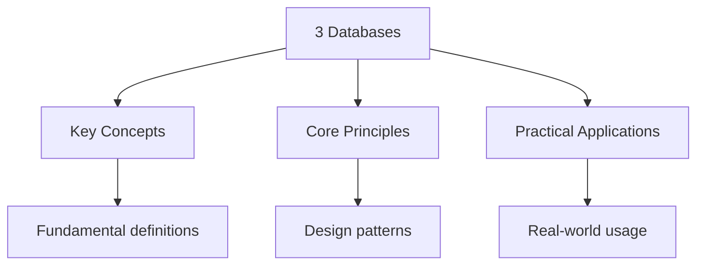

---

date: 2026-07-23T21:57:32+01:00
title: "3 Databases | Highers - Wyatt's Notes"
description: "\"itemListElement\": [{\"name\": \"Home\", \"url\": \"https://wyattau.com\"}, {\"name\": \"highers\", \"url\": \"https://highers.wyattau.com\"}, {\"name\": \"Computer Science\","
---

<!-- Breadcrumb Schema for SEO -->

## Intuition

A database is a structured collection of data organised for efficient retrieval and manipulation. Think of it as a highly organised filing cabinet where each drawer (table) contains related records, and each folder (row) holds specific information. The power of databases lies in their ability to store, retrieve, and update large amounts of data quickly and reliably, while maintaining relationships between different pieces of information.

## Why This Matters

Databases underpin virtually every digital system — from banking and healthcare to social media and e-commerce. Understanding how data is structured, queried, and protected is essential for any computer scientist. The relational model, SQL, and normalisation concepts taught at Highers level provide the foundation for working with data at any scale.

## Key Concepts

- **Relational model**: Data is organised into tables with rows and columns, linked by keys
- **Primary and foreign keys**: Unique identifiers that establish relationships between tables
- **Normalisation**: Reducing data redundancy by splitting data into related tables
- **SQL**: The standard language for querying and manipulating relational data
- **ACID properties**: Atomicity, Consistency, Isolation, Durability — guarantees for reliable transactions

## Why This Matters

Databases underpin virtually every digital system — from banking and healthcare to social media and e-commerce. Understanding how data is structured, queried, and protected is essential for any computer scientist. The relational model, SQL, and normalisation concepts taught at Highers level provide the foundation for working with data at any scale.

## Practical Applications

- **Banking systems:** ACID transactions ensure money transfers are atomic — either the entire transfer succeeds or none of it does, preventing partial updates that could lose money.
- **Healthcare records:** Normalised databases prevent duplicate patient records while maintaining referential integrity across departments.
- **E-commerce platforms:** Proper indexing on product catalogs and order tables ensures fast searches even with millions of records.

## Study Tips

- **Draw entity-relationship diagrams:** For every database design question, sketch the ER diagram first. This visual representation prevents missing relationships and helps normalise the schema.
- **Practise SQL queries against real databases:** Use SQLite or an online SQL editor to test queries. Understanding JOIN types requires seeing actual result sets.
- **Normalise step by step:** Apply 1NF, 2NF, and 3NF systematically. Write down the functional dependencies, identify partial and transitive dependencies, and split tables accordingly.
- **Memorise ACID properties:** These four guarantees are fundamental to database theory. Understanding what each property protects against (e.g., durability protects against crashes) builds intuition for system design.

## Cross-References

- **[SQL Fundamentals](./2-sql-fundamentals.md)**: Learn the language used to interact with databases
- **[Networks](../../../../../../alevel/src/content/docs/computer-science/diagnostics/diag-networks)**: How databases are accessed across networks
- **[Data Security](./4-data-security.md)**: Protecting database contents from unauthorised access

## Common Mistakes

**Confusing primary key with foreign key:** A primary key uniquely identifies each record in a table. A foreign key references a primary key in another table to create relationships. Using the wrong key type breaks referential integrity.

**Assuming 1NF is sufficient normalisation:** First Normal Form eliminates repeating groups but does not address partial or transitive dependencies. Most practical databases should be in at least 3NF to avoid update anomalies.

**Ignoring NULL behaviour in SQL:** NULL is not equal to NULL (`NULL = NULL` returns UNKNOWN, not TRUE). Use `IS NULL` or `IS NOT NULL` for null checks. Aggregation functions like COUNT ignore NULLs, which can produce unexpected results.

## Summary

Databases store structured data organised into tables with rows and columns,
linked by primary and foreign keys. The relational model uses SQL for data
manipulation and supports ACID transactions for reliability. Normalisation
(1NF through BCNF) reduces redundancy by eliminating partial and transitive
dependencies. Understanding entity-relationship modelling, SQL queries, and
normal forms is essential for designing databases that are efficient, consistent,
and maintainable.
