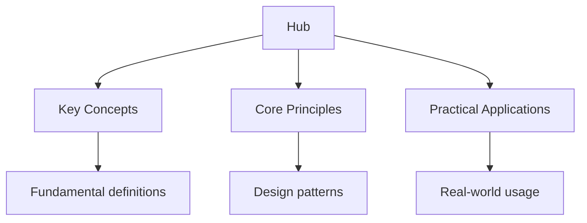

## Why This Guide Exists

The Scottish Highers are the qualifications taken by students in Scotland, typically in S5 (the fifth year of secondary school). They are the Scottish equivalent of A-levels and are used for university admissions across the UK and internationally. Highers are structured differently from other UK qualifications — you typically sit 5 Highers in S5 and may take Advanced Highers in S6 for more advanced study.

This hub page links every resource on this site — organised by subject, with study plans and exam strategies tailored to the SQA assessment approach. Every topic below links to detailed notes, practice questions, flashcards, and diagnostic quizzes.

## Table of Contents

- [Biology](#biology)
- [Chemistry](#chemistry)
- [Computer Science](#computer-science)
- [Mathematics](#mathematics)
- [Physics](#physics)
- [Recommended Study Plan](#recommended-study-plan)
- [Cross-Site Resources](#cross-site-resources)
- [FAQ](#faq)

---

## Biology

Higher Biology covers cell biology, metabolism, multicellular organisms, genetics and adaptation, and evolution. The SQA exam tests both factual recall and the ability to apply biological knowledge to unfamiliar scenarios.

### Topic Notes

- [Biology Overview](biology) — course structure and assessment format
- [Cell Biology](biology/1-cell-biology) — cell structure, organelles, and membrane transport
- [Metabolism](biology/2-metabolism) — enzymes, respiration, and photosynthesis
- [Multicellular Organisms](biology/3-multicellular) — tissues, organ systems, and homeostasis
- [Genetics and Adaptation](biology/4-genetics-adaptation) — inheritance, DNA, and natural selection
- [Evolution](biology/5-evolution) — evidence for evolution, speciation, and classification

### Practice and Review

- [Flashcards: Biology](flashcards-biology)
- [Practice Questions: Biology](biology/practice-biology)
- [Diagnostic Quizzes](biology/diagnostics) — test across all biology topics

### Key Exam Focus

Higher Biology requires you to describe, explain, and evaluate biological processes. The exam includes structured questions, data analysis, and extended-response questions. Diagrams and labelled drawings are frequently tested — practise drawing and annotating cell structures, enzyme action, and genetic crosses.

---

## Chemistry

Higher Chemistry covers structure and bonding, heat and matter, acids and bases, organic chemistry, and analytical techniques. The subject requires fluency with calculations and a strong grasp of molecular-level reasoning.

### Topic Notes

- [Chemistry Overview](chemistry) — course structure and assessment format
- [Structure and Bonding](chemistry/1-structure-bonding) — ionic, covalent, and metallic bonding, and intermolecular forces
- [Heat and Matter](chemistry/2-heat-matter) — energetics, kinetics, and equilibrium
- [Acids and Bases](chemistry/3-acids-bases) — pH, titrations, and neutralisation reactions
- [Organic Chemistry](chemistry/4-organic) — hydrocarbons, alcohols, carboxylic acids, and functional groups
- [Analytical Techniques](chemistry/5-analytical) — chromatography, spectroscopy, and mass spectrometry

### Practice and Review

- [Flashcards: Chemistry](flashcards-chemistry)
- [Practice Questions: Chemistry](chemistry/practice-chemistry)
- [Diagnostic Quizzes](chemistry/diagnostics) — test across all chemistry topics

### Key Exam Focus

Higher Chemistry emphasises calculation questions — enthalpy changes, equilibrium constants, and titration calculations. Practise working through numerical problems step by step, showing all working. The exam also tests your ability to interpret experimental data and draw conclusions from results.

---

## Computer Science

Higher Computer Science covers hardware, software, databases, algorithms, and networks. The course balances theoretical understanding with practical programming skills.

### Topic Notes

- [Computer Science Overview](computer-science) — course structure and assessment format
- [Hardware](computer-science/1-hardware) — computer architecture, processors, and memory
- [Software](computer-science/2-software) — operating systems, utilities, and application software
- [Databases](computer-science/3-databases) — relational databases, SQL, and data modelling
- [Algorithms](computer-science/4-algorithms) — searching, sorting, complexity, and pseudocode
- [Networks](computer-science/5-networks) — network types, protocols, and security

### Practice and Review

- [Flashcards: Computer Science](flashcards-computer-science)
- [Practice Questions: Computer Science](computer-science/practice-computer-science)
- [Diagnostic Quizzes](computer-science/diagnostics) — test across all computer science topics

### Key Exam Focus

Higher Computer Science tests your ability to trace algorithms, write pseudocode, and design database schemas. The exam includes short-answer questions on theory and extended questions requiring you to design solutions to computational problems. Practise writing clear, structured pseudocode and drawing ER diagrams.

---

## Mathematics

Higher Mathematics covers algebra, trigonometry, calculus, vectors, and statistics. The course builds on National 5 Mathematics and introduces more abstract and analytical thinking.

### Topic Notes

- [Mathematics Overview](maths) — course structure and assessment format
- [Algebra and Functions](maths/1-algebra-functions) — polynomials, surds, indices, and functions
- [Trigonometry](maths/2-trigonometry) — trigonometric identities, equations, and the sine/cosine rules
- [Calculus](maths/3-calculus) — differentiation, integration, and applications
- [Vectors](maths/4-vectors) — vector operations, scalar product, and equations of lines
- [Statistics](maths/5-statistics) — data analysis, probability, and normal distribution

### Practice and Review

- [Flashcards: Mathematics](flashcards-mathematics)
- [Practice Questions: Mathematics](maths/practice-maths)
- [Diagnostic Quizzes](maths/diagnostics) — test across all maths topics

### Key Exam Focus

Higher Mathematics requires fluent algebraic manipulation and the ability to apply techniques to unfamiliar problems. The exam includes both short-answer and extended-response questions. Calculus is a major component — practise differentiation and integration until the techniques are automatic.

---

## Physics

Higher Physics covers mechanics, dynamics and space, electricity, particles and waves, and waves and radiation. The subject combines conceptual understanding with mathematical application.

### Topic Notes

- [Physics Overview](physics) — course structure and assessment format
- [Mechanics](physics/1-mechanics) — motion, forces, and energy
- [Dynamics and Space](physics/2-dynamics-space) — Newton's laws, gravitation, and orbital motion
- [Electricity](physics/3-electricity) — circuits, voltage, current, and resistance
- [Particles and Waves](physics/4-particles-waves) — quantum phenomena, wave properties, and diffraction
- [Waves and Radiation](physics/5-waves-radiation) — electromagnetic spectrum, nuclear physics, and radioactivity

### Practice and Review

- [Flashcards: Physics](flashcards-physics)
- [Practice Questions: Physics](physics/practice-physics)
- [Diagnostic Quizzes](physics/diagnostics) — test across all physics topics

### Key Exam Focus

Higher Physics requires you to apply mathematical techniques to physical problems. The exam includes calculation questions where you must show your working, explain your reasoning, and state your answer with appropriate units and significant figures. Practise rearranging equations and substituting values correctly.

---

## Recommended Study Plan

Preparing for Scottish Highers requires sustained effort across multiple subjects. Here is a structured approach.

### Phase 1: Foundation (Months 1–4)

- Study all topic notes for each subject, marking areas of uncertainty
- Complete flashcards daily for active recall
- Aim for one diagnostic quiz per subject per week
- Focus on understanding rather than memorisation

### Phase 2: Consolidation (Months 5–8)

- Revisit weak areas identified by diagnostic quizzes
- Begin practice questions in exam conditions (timed, no notes)
- Work through past SQA papers — they reveal the exam's style and expectations
- Cross-reference between subjects where topics overlap

### Phase 3: Exam Readiness (Months 9–12)

- Focus almost entirely on practice questions and past papers
- Analyse SQA marking instructions to understand what markers look for
- Do full-length timed papers under real conditions
- Use flashcards to maintain recall on topics you already know well
- Reserve the last two weeks for light revision and rest

### Daily Routine

| Time | Activity |
| ------ | ---------- |
| Morning | Active recall — flashcards for 20 minutes |
| Afternoon | Topic study — read notes on one new topic |
| Evening | Practice — complete 5–10 practice questions |
| Weekend | Diagnostic quiz + review weak areas |

---

## Cross-Site Resources

Wyatt's Notes is a network of interconnected study sites. The Highers content connects to related material:

- **[GCSE Study Guide](https://gcse.wyattau.com/hub)** — comparable UK qualifications if you are comparing exam systems
- **[A-Level Study Guide](https://alevel.wyattau.com/hub)** — the next level if you are considering Advanced Highers or A-levels
- **[IB Study Guide](https://ib.wyattau.com/hub)** — the International Baccalaureate as an alternative qualification
- **[University Physics](https://physics.wyattau.com/hub)** — deeper coverage beyond Higher level
- **[University Mathematics](https://mathematics.wyattau.com/hub)** — proof-based mathematics beyond Higher level

---

## Frequently Asked Questions

### How should I start using this site?

Take a diagnostic quiz for each subject. This takes about 10–15 minutes per subject and gives you a clear picture of your strengths and weaknesses. Then prioritise studying the topics where you scored lowest.

### How many Highers should I study at once?

Most students take 5 Highers in S5. Study no more than 3 subjects per day to maintain focus. Alternate between a science, a mathematics, and a humanity or practical subject each day.

### Are the practice questions similar to real SQA exams?

The practice questions are modelled on SQA-style problems. They test the same concepts and use similar formats, but they are not past papers. Use them alongside official SQA past papers for the best preparation.

### How often should I use the flashcards?

Daily. Flashcards use spaced repetition — each time you get a card right, it appears less frequently. This is the most efficient way to retain factual knowledge. Spend 15–20 minutes each morning.

### What is the difference between Higher and Advanced Higher?

Higher is typically taken in S5 and is the standard qualification for university entry. Advanced Higher is taken in S6 and covers university-level content in more depth. Advanced Higher is closer to first-year university material and is valued by competitive university courses.

### How do Highers compare to A-levels?

Highers and A-levels are both used for university admissions, but they differ in structure. You typically take 5 Highers versus 3 A-levels. Highers are generally considered slightly less in depth per subject but cover more subjects. Both are widely recognised by universities.

---

*Last updated: 24 July 2026*

*Written by Wyatt. For questions or feedback, visit [wyattau.com](https://wyattau.com).*
