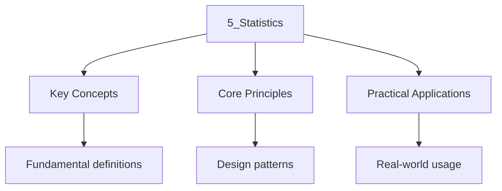

---

title: "Statistics and Probability | Highers"
description: "Scottish Highers Maths Statistics and Probability notes covering key definitions, core concepts, worked examples, and practice questions for complete revision."
date: 2026-04-14
tags:
  - highers
  - highers-maths
categories:
  - highers-maths

---

<!-- Breadcrumb Schema for SEO -->

## Statistics and Probability

## Higher Statistics

### Measures of Central Tendency and Spread

**Mean:** $\bar{x} = \dfrac{\sum x_i}{n}$

The mean is the balance point of the data. It is sensitive to outliers: a single extreme value can
Shift the mean significantly.

**Median:** The middle value when data is sorted. For $n$ data points, if $n$ is odd, the median is
The $\frac{n+1}{2}$Th value. If $n$ is even, it is the average of the $\frac{n}{2}$Th and
$\frac{n}{2}+1$Th values. The median is robust to outliers.

**Mode:** The most frequently occurring value. A data set can be unimodal, bimodal, or multimodal.

**Standard Deviation:**

$$
S = \sqrt{\frac{\sum(x_i - \bar{x})^2}{n-1}}
$$

The divisor $n-1$ (Bessel"s correction) gives an unbiased estimate of the population standard
Deviation. With $n$ in the denominator, the sample standard deviation systematically underestimates
The population parameter.

For grouped data with frequencies $f_i$:

$$
\bar{x} = \frac{\sum f_i x_i}{\sum f_i}, \quad s = \sqrt{\frac{\sum f_i(x_i - \bar{x})^2}{\sum f_i - 1}}
$$

**Computational formula (avoids subtracting the mean from each value):**

$$
S = \sqrt{\frac{\sum f_i x_i^2 - \frac{(\sum f_i x_i)^2}{\sum f_i}}{\sum f_i - 1}}
$$

**Example:** Calculate the mean and standard deviation of the following data:

| $x$ | 2   | 4   | 6   | 8   | 10  |
| --- | --- | --- | --- | --- | --- |
| $f$ | 3   | 5   | 8   | 4   | 2   |

$$
\bar{x} = \frac{3(2) + 5(4) + 8(6) + 4(8) + 2(10)}{3 + 5 + 8 + 4 + 2} = \frac{6 + 20 + 48 + 32 + 20}{22} = \frac{126}{22} \approx 5.73
$$

$$
\sum f_i x_i^2 = 3(4) + 5(16) + 8(36) + 4(64) + 2(100) = 12 + 80 + 288 + 256 + 200 = 836
$$

$$
S = \sqrt{\frac{836 - \frac{126^2}{22}}{21}} = \sqrt{\frac{836 - 721.636}{21}} = \sqrt{\frac{114.364}{21}} \approx 2.333
$$

**Transformation properties of the mean and standard deviation.** If $Y = aX + b$ where $a$ and $b$
Are constants:

- $\bar{Y} = a\bar{X} + b$
- $s_Y = |a| \cdot s_X$

This is useful when data needs to be converted between units (e.g., Celsius to Fahrenheit).

### Interquartile Range and Box Plots

The **interquartile range** (IQR) is $Q_3 - Q_1$Where $Q_1$ is the 25th percentile and $Q_3$ is The
75th percentile.

**Box plots** (box-and-whisker diagrams) display five key statistics: minimum, $Q_1$Median, $Q_3$
And maximum. The box spans from $Q_1$ to $Q_3$With the median marked inside. Whiskers extend to The
most extreme data points within $1.5 \times \mathrm{IQR$ of the quartiles.

**Outlier detection:** A value is a potential outlier if it falls below
$Q_1 - 1.5 \times \mathrm{IQR$ or above $Q_3 + 1.5 \times \mathrm{IQR$.

**Example:** Data set: $2, 5, 7, 8, 12, 14, 15, 18, 25, 110$.

$n = 10$. Median $= \frac{12 + 14}{2} = 13$.

Lower half: $2, 5, 7, 8, 12$. $Q_1 = 7$.

Upper half: $14, 15, 18, 25, 110$. $Q_3 = 18$.

$\mathrm{IQR = 18 - 7 = 11$.

Upper fence: $Q_3 + 1.5 \times 11 = 18 + 16.5 = 34.5$.

Since $110 > 34.5$The value $110$ is an outlier.

### Probability

**Basic Rules:**

$$
P(A') = 1 - P(A)
$$

$$
P(A \cup B) = P(A) + P(B) - P(A \cap B)
$$

For mutually exclusive events: $P(A \cap B) = 0$ So $P(A \cup B) = P(A) + P(B)$.

For independent events: $P(A \cap B) = P(A) \times P(B)$.

**Conditional Probability:**

$$
P(A | B) = \frac{P(A \cap B)}{P(B)}
$$

**Bayes' Theorem:**

$$
P(A | B) = \frac{P(B | A) \cdot P(A)}{P(B)}
$$

This theorem is foundational in statistics, machine learning, and medical testing. It allows you to
"invert" conditional probabilities: if you know $P(B|A)$ but need $P(A|B)$Bayes' theorem provides
The bridge.

**Example:** In a school, 60% of students study Maths, 40% study Physics, and 25% study both. A
Student is chosen at random.

(a) What is the probability they study at least one of Maths or Physics?

$$
P(M \cup P) = 0.6 + 0.4 - 0.25 = 0.75
$$

(b) Given that a student studies Physics, what is the probability they also study Maths?

$$
P(M | P) = \frac{P(M \cap P)}{P(P)} = \frac{0.25}{0.40} = 0.625
$$

(c) Are the events "studies Maths" and "studies Physics" independent?

$P(M) \times P(P) = 0.6 \times 0.4 = 0.24$ But $P(M \cap P) = 0.25$. Since $0.24 \ne 0.25$The Events
are **not** independent.

**Example:** A medical test has a 95% true positive rate
($P(\mathrm{positive | \mathrm{disease) = 0.95$) and a 2% false positive rate
($P(\mathrm{positive | \mathrm{no disease) = 0.02$). If 1% of the population has the condition, find
$P(\mathrm{disease | \mathrm{positive)$.

Let $D$ = has disease, $+$ = tests positive.

$$
P(D) = 0.01, \quad P(D') = 0.99
$$

$$
P(+|D) = 0.95, \quad P(+|D') = 0.02
$$

$$
P(D|+) = \frac{P(+|D) \cdot P(D)}{P(+|D) \cdot P(D) + P(+|D') \cdot P(D')}
$$

$$
= \frac{0.95 \times 0.01}{0.95 \times 0.01 + 0.02 \times 0.99} = \frac{0.0095}{0.0095 + 0.0198} = \frac{0.0095}{0.0293} \approx 0.324
$$

Despite a 95% true positive rate, only about 32% of positive tests indicate actual disease, due to
The low prevalence (base rate fallacy).

### Probability Trees

A probability tree diagram is useful for multi-stage experiments. Each branch represents a possible
Outcome at each stage, with probabilities labeled on the branches.

**Rules for probability trees:**

- The probabilities on branches from a single node sum to 1.
- To find the probability of a path through the tree, multiply the probabilities along the path.
- To find the probability of an event, add the probabilities of all paths leading to that event.

**Example:** A bag contains 3 red and 5 blue balls. Two balls are drawn without replacement. Find
The probability that both are red.

First draw: $P(R) = \frac{3}{8}$.

Second draw (given first was red): $P(R) = \frac{2}{7}$.

$$
P(\mathrm{both red) = \frac{3}{8} \times \frac{2}{7} = \frac{6}{56} = \frac{3}{28}
$$

### Binomial Distribution

A binomial distribution $X \sim B(n, p)$ describes the number of successes in $n$ independent
Trials, each with probability of success $p$.

$$
P(X = r) = \binom{n}{r} p^r (1-p)^{n-r}
$$

**Conditions for a binomial distribution:**

1. Fixed number of trials $n$
2. Each trial has exactly two outcomes (success/failure)
3. Trials are independent
4. Probability of success $p$ is constant across trials

**Mean:** $E(X) = np$

**Variance:** $\mathrm{Var(X) = np(1-p)$

**Proof of $E(X) = np$.** Let $X_i$ be the indicator variable for the $i$Th trial: $X_i = 1$ if
Success, $0$ if failure. Then $X = \sum_{i=1}^{n} X_i$ and $E(X) = \sum E(X_i) = n \cdot p$.

**Example:** A fair die is rolled 8 times. Find the probability of getting exactly 3 sixes.

$$
X \sim B(8, \tfrac{1}{6})
$$

$$
P(X = 3) = \binom{8}{3}\left(\frac{1}{6}\right)^3\left(\frac{5}{6}\right)^5
$$

$$
= 56 \times \frac{1}{216} \times \frac{3125}{7776}
$$

$$
= \frac{175000}{1679616} \approx 0.1042
$$

**Example:** $X \sim B(20, 0.3)$. Find $P(X \le 5)$.

$$
P(X \le 5) = \sum_{r=0}^{5} \binom{20}{r}(0.3)^r(0.7)^{20-r}
$$

$$
= \binom{20}{0}(0.7)^{20} + \binom{20}{1}(0.3)(0.7)^{19} + \cdots + \binom{20}{5}(0.3)^5(0.7)^{15}
$$

This is most evaluated using a calculator or statistical tables.

### Normal Distribution

A continuous random variable $X$ has a normal distribution $X \sim N(\mu, \sigma^2)$ if its
Probability density function is:

$$
F(x) = \frac{1}{\sigma\sqrt{2\pi}} \, e^{-\frac{(x - \mu)^2}{2\sigma^2}}
$$

**Why the normal distribution is ubiquitous.** The Central Limit Theorem states that the sum (or
Average) of a large number of independent, identically distributed random variables is approximately
Normally distributed, regardless of the original distribution. This is why measurements of natural
Phenomena (heights, blood pressure, measurement errors) tend to be normally distributed.

**Standard Normal:** $Z = \dfrac{X - \mu}{\sigma}$Where $Z \sim N(0, 1)$.

**Properties:**

- The curve is symmetric about $x = \mu$
- Approximately 68% of data lies within one standard deviation of the mean
- Approximately 95% within two standard deviations
- Approximately 99.7% within three standard deviations

**Key standard normal values:**

| $z$   | $P(Z \lt z)$ |
| ----- | ------------ |
| 1.00  | 0.8413       |
| 1.645 | 0.9500       |
| 1.96  | 0.9750       |
| 2.00  | 0.9772       |
| 2.326 | 0.9900       |
| 2.576 | 0.9950       |

**Example:** The heights of Scottish men are normally distributed with mean 175 cm and standard
Deviation 8 cm. Find the probability that a randomly chosen man is taller than 185 cm.

$$
P(X > 185) = P\left(Z > \frac{185 - 175}{8}\right) = P(Z > 1.25)
$$

From standard normal tables, $P(Z < 1.25) = 0.8944$.

$$
P(Z > 1.25) = 1 - 0.8944 = 0.1056
$$

**Example:** Exam scores are normally distributed with mean 60 and standard deviation 12. The top
10% of candidates receive an A grade. Find the minimum score for an A grade.

We need $P(X > a) = 0.10$I.e., $P(X \leq a) = 0.90$.

From tables, $P(Z \leq 1.282) = 0.90$.

$$
A = 60 + 1.282 \times 12 = 60 + 15.38 = 75.38
$$

The minimum A grade score is approximately 75.

### Normal Approximation to the Binomial

When $n$ is large and $p$ is not too close to 0 or 1, $B(n, p) \approx N(np, np(1-p))$.

**Rule of thumb:** Use the normal approximation when $np \ge 5$ and $n(1-p) \ge 5$.

**Continuity correction:** Since the binomial is discrete and the normal is continuous, apply a
Continuity correction:
$P(X \le k) \approx P\!\left(Z \lt \frac{k + 0.5 - np}{\sqrt{np(1-p)}}\right)$.

**Example:** $X \sim B(100, 0.3)$. Approximate $P(X \le 35)$.

$\mu = 100 \times 0.3 = 30$, $\sigma = \sqrt{100 \times 0.3 \times 0.7} = \sqrt{21} \approx 4.583$.

$$
P(X \le 35) \approx P\!\left(Z \lt \frac{35.5 - 30}{4.583}\right) = P(Z < 1.20) \approx 0.8849
$$

**Example:** $X \sim B(50, 0.4)$. Use the normal approximation with continuity correction to
Estimate $P(X > 20)$.

$\mu = 50 \times 0.4 = 20$, $\sigma = \sqrt{50 \times 0.4 \times 0.6} = \sqrt{12} \approx 3.464$.

With continuity correction:

$$
P(X > 20) = P(X \ge 21) \approx P\!\left(Z > \frac{20.5 - 20}{3.464}\right) = P(Z > 0.144) \approx 0.443
$$

### Correlation and Regression

**Product Moment Correlation Coefficient (PMCC):**

$$
R = \frac{\sum(x_i - \bar{x})(y_i - \bar{y})}{\sqrt{\sum(x_i - \bar{x})^2 \sum(y_i - \bar{y})^2}}
$$

**Properties:**

- $-1 \le r \le 1$
- $r = 1$: perfect positive linear correlation
- $r = -1$: perfect negative linear correlation
- $r = 0$: no linear correlation (but there may be a non-linear relationship)

**Important caveat:** Correlation does not imply causation. Two variables may be strongly correlated
Because they are both driven by a third variable (confounding variable).

**Least Squares Regression Line:**

$$
Y - \bar{y} = \frac{S_{xy}}{S_{xx}}(x - \bar{x})
$$

Where $S_{xy} = \sum(x_i - \bar{x})(y_i - \bar{y})$ and $S_{xx} = \sum(x_i - \bar{x})^2$.

**Interpretation:** The slope $b = \frac{S_{xy}}{S_{xx}}$ tells you the expected change in $y$ for a
One-unit increase in $x$.

**Extrapolation warning:** The regression line is reliable only within the range of the observed
Data. Predicting outside this range (extrapolation) is unreliable because the linear relationship
May not hold.

**Example:** Calculate the PMCC for the following data:

| $x$ | 1   | 2   | 3   | 4   | 5   |
| --- | --- | --- | --- | --- | --- |
| $y$ | 2   | 5   | 6   | 9   | 11  |

$\bar{x} = 3$, $\bar{y} = 6.6$.

$S_{xx} = (1-3)^2 + (2-3)^2 + (3-3)^2 + (4-3)^2 + (5-3)^2 = 4 + 1 + 0 + 1 + 4 = 10$.

$S_{yy} = (2-6.6)^2 + (5-6.6)^2 + (6-6.6)^2 + (9-6.6)^2 + (11-6.6)^2 = 21.16 + 2.56 + 0.36 + 5.76 + 19.36 = 49.2$.

$S_{xy} = (1-3)(2-6.6) + (2-3)(5-6.6) + (3-3)(6-6.6) + (4-3)(9-6.6) + (5-3)(11-6.6)$
$= 9.2 + 1.6 + 0 + 2.4 + 8.8 = 22$.

$$
R = \frac{22}{\sqrt{10 \times 49.2}} = \frac{22}{\sqrt{492}} = \frac{22}{22.18} \approx 0.992
$$

There is a very strong positive linear correlation.

---

<!-- Breadcrumb Schema for SEO -->

## Advanced Higher Statistics

### Probability Distributions

**Expected Value and Variance:**

$$
E(X) = \sum x \cdot P(X = x)
$$

$$
\mathrm{Var(X) = E(X^2) - [E(X)]^2
$$

**Properties of expectation:**

- $E(aX + b) = aE(X) + b$
- $E(X + Y) = E(X) + E(Y)$ (always, even if $X$ and $Y$ are dependent)
- If $X$ and $Y$ are independent: $\mathrm{Var(X + Y) = \mathrm{Var(X) + \mathrm{Var(Y)$
- If $X$ and $Y$ are dependent:
  $\mathrm{Var(X + Y) = \mathrm{Var(X) + \mathrm{Var(Y) + 2\mathrm{Cov(X, Y)$

**Example:** A biased coin lands on heads with probability $p$. Let $X$ be the number of heads in 3
Tosses.

$X \sim B(3, p)$.

$$
E(X) = 3p, \quad \mathrm{Var(X) = 3p(1-p)
$$

### Discrete Probability Distributions

**Uniform distribution:** $P(X = x_i) = \frac{1}{n}$ for $n$ equally likely outcomes.

$$
E(X) = \frac{1}{n}\sum x_i, \quad \mathrm{Var(X) = \frac{1}{n}\sum x_i^2 - \left(\frac{1}{n}\sum x_i\right)^2
$$

**Example:** A fair die is rolled. Find $E(X)$ and $\mathrm{Var(X)$.

$$
E(X) = \frac{1+2+3+4+5+6}{6} = \frac{21}{6} = 3.5
$$

$$
E(X^2) = \frac{1+4+9+16+25+36}{6} = \frac{91}{6}
$$

$$
\mathrm{Var(X) = \frac{91}{6} - \frac{49}{4} = \frac{182 - 147}{12} = \frac{35}{12} \approx 2.917
$$

### The Geometric Distribution

The geometric distribution models the number of trials until the first success in a sequence of
Independent Bernoulli trials with success probability $p$.

$$
P(X = k) = (1-p)^{k-1} p, \quad k = 1, 2, 3, \ldots
$$

**Mean:** $E(X) = \dfrac{1}{p}$

**Variance:** $\mathrm{Var(X) = \dfrac{1-p}{p^2}$

**Proof of $E(X) = 1/p$.**

$$
E(X) = \sum_{k=1}^{\infty} k(1-p)^{k-1}p = p\sum_{k=1}^{\infty} k(1-p)^{k-1}
$$

Using the identity $\displaystyle\sum_{k=1}^{\infty} kr^{k-1} = \frac{1}{(1-r)^2}$ for $|r| \lt 1$
With $r = 1-p$:

$$
E(X) = p \cdot \frac{1}{p^2} = \frac{1}{p}
$$

$\blacksquare$

**Example:** A die is rolled until a 6 appears. Find the probability that more than 4 rolls are
Needed.

$$
P(X > 4) = 1 - P(X \le 4) = 1 - [P(X=1) + P(X=2) + P(X=3) + P(X=4)]
$$

$$
= 1 - \left[\frac{1}{6} + \frac{5}{6} \cdot \frac{1}{6} + \left(\frac{5}{6}\right)^2 \cdot \frac{1}{6} + \left(\frac{5}{6}\right)^3 \cdot \frac{1}{6}\right]
$$

$$
= 1 - \frac{1}{6}\!\left[1 + \frac{5}{6} + \frac{25}{36} + \frac{125}{216}\right] = 1 - \frac{1}{6} \cdot \frac{671}{216} = 1 - \frac{671}{1296} = \frac{625}{1296} \approx 0.482
$$

Alternatively: $P(X > 4) = (1-p)^4 = \left(\frac{5}{6}\right)^4 = \frac{625}{1296}$. This is because
$X > 4$ means the first 4 rolls are all failures.

### The Poisson Distribution (Introduction)

The Poisson distribution models the number of events occurring in a fixed interval of time or space,
Given that events occur independently at a constant average rate $\lambda$.

$$
P(X = k) = \frac{e^{-\lambda}\lambda^k}{k!}, \quad k = 0, 1, 2, \ldots
$$

**Mean:** $E(X) = \lambda$

**Variance:** $\mathrm{Var(X) = \lambda$

The Poisson distribution is a limiting case of the binomial when $n \to \infty$ and $p \to 0$ with
$np = \lambda$ fixed.

**Example:** A call centre receives an average of 4 calls per minute. Find the probability of
Receiving exactly 6 calls in a given minute.

$$
X \sim \mathrm{Po(4)
$$

$$
P(X = 6) = \frac{e^{-4} \cdot 4^6}{6!} = \frac{e^{-4} \cdot 4096}{720} \approx 0.1042
$$

### Hypothesis Testing

**Steps:**

1. State the null hypothesis $H_0$ and alternative hypothesis $H_1$
2. State the significance level $\alpha$
3. Calculate the test statistic
4. Determine the critical region or $p$-value
5. Make a decision and state the conclusion in context

**Type I and Type II errors:**

- **Type I error:** Rejecting $H_0$ when it is true (false positive). Probability = $\alpha$.
- **Type II error:** Failing to reject $H_0$ when it is false (false negative). Probability =
  $\beta$.
- The **power** of a test is $1 - \beta$The probability of correctly rejecting a false $H_0$.

**Trade-off between errors.** Decreasing $\alpha$ (making the test more conservative) increases
$\beta$ (making it harder to detect a real effect). The only way to decrease both simultaneously is
To increase the sample size.

**Example:** A manufacturer claims that the mean weight of bags of sugar is 500 g. A sample of 16
Bags has mean weight 497 g with standard deviation 5 g. Test at the 5% significance level whether
The mean weight differs from 500 g.

$H_0: \mu = 500$, $H_1: \mu \neq 500$.

Test statistic:
$t = \dfrac{\bar{x} - \mu_0}{s / \sqrt{n}} = \dfrac{497 - 500}{5/\sqrt{16}} = \dfrac{-3}{1.25} = -2.4$.

Critical values for $t$-distribution with 15 degrees of freedom at 5% (two-tailed): approximately
$\pm 2.131$.

Since $|-2.4| = 2.4 > 2.131$We reject $H_0$. There is sufficient evidence to suggest the mean Weight
differs from 500 g.

### Chi-Squared Test

Used to test for association between categorical variables.

$$
\chi^2 = \sum \frac{(O_i - E_i)^2}{E_i}
$$

Where $O_i$ is the observed frequency and $E_i$ is the expected frequency.

**Conditions:** All expected frequencies should be at least 5. If any $E_i < 5$Combine categories.

**Example:** A survey investigates whether there is an association between gender and preferred
Subject among 200 students:

|        | Maths | Science | English | Total |
| ------ | ----- | ------- | ------- | ----- |
| Male   | 40    | 35      | 15      | 90    |
| Female | 30    | 25      | 55      | 110   |
| Total  | 70    | 60      | 70      | 200   |

Expected frequencies:
$E_{ij} = \dfrac{\mathrm{row total \times \mathrm{column total}{\mathrm{grand total}$.

$$
\chi^2 = \frac{(40 - 31.5)^2}{31.5} + \frac{(35 - 27)^2}{27} + \frac{(15 - 31.5)^2}{31.5} + \frac{(30 - 38.5)^2}{38.5} + \frac{(25 - 33)^2}{33} + \frac{(55 - 38.5)^2}{38.5}
$$

$$
= \frac{72.25}{31.5} + \frac{64}{27} + \frac{272.25}{31.5} + \frac{72.25}{38.5} + \frac{64}{33} + \frac{272.25}{38.5}
$$

$$
= 2.294 + 2.370 + 8.643 + 1.877 + 1.939 + 7.071 = 24.194
$$

Degrees of freedom: $(2-1)(3-1) = 2$.

Critical value at 5% for 2 df: 5.991.

Since $24.194 > 5.991$We reject $H_0$. There is significant evidence of an association.

### One-Tailed vs Two-Tailed Tests

- **Two-tailed test:** $H_1$ specifies that the parameter differs from $H_0$ in either direction
  (e.g., $\mu \ne \mu_0$). The significance level is split between both tails: $\alpha/2$ in each.
- **One-tailed test:** $H_1$ specifies a direction (e.g., $\mu > \mu_0$ or $\mu < \mu_0$). The
  entire significance level is in one tail, making the test more powerful for detecting an effect in
  that direction.

**Example:** A machine is supposed to fill bottles with 500 ml. A sample of 20 bottles has mean 498
Ml with standard deviation 4 ml. Test at the 5% level whether the machine is underfilling.

$H_0: \mu = 500$, $H_1: \mu < 500$ (one-tailed).

$t = \dfrac{498 - 500}{4/\sqrt{20}} = \dfrac{-2}{0.894} = -2.236$.

Critical value for $t$-distribution with 19 df at 5% (one-tailed): approximately $-1.729$.

Since $-2.236 < -1.729$We reject $H_0$. There is sufficient evidence that the machine is
Underfilling.

Note: If this were a two-tailed test, the critical value would be approximately $\pm 2.093$ And
$|-2.236| = 2.236 > 2.093$ So we would still reject $H_0$ in this case. However, the one-tailed Test
has a lower threshold, making it easier to detect a difference in the specified direction.

### Coefficient of Determination

The coefficient of determination $r^2$ represents the proportion of the variance in $y$ that is
Explained by the linear relationship with $x$.

$$
R^2 = 1 - \frac{\sum(y_i - \hat{y}_i)^2}{\sum(y_i - \bar{y})^2}
$$

Where $\hat{y}_i$ are the predicted values from the regression line.

**Interpretation:** If $r^2 = 0.85$ Then 85% of the variation in $y$ is accounted for by the linear
Regression on $x$. The remaining 15% is due to other factors or random variation.

---

<!-- Breadcrumb Schema for SEO -->

## Worked Examples

See the examples integrated throughout the sections above.

## Intuition

**Statistics is about making decisions from incomplete information:** You can't measure every fish in the ocean, but you can measure a sample and make educated guesses about the population. Statistics gives you the tools to quantify uncertainty — how confident can you be in your conclusions, and what could go wrong?

**Why it matters:** Every scientific study, medical trial, quality control process, and election poll relies on statistics. Understanding probability distributions, hypothesis testing, and confidence intervals lets you evaluate claims and make data-driven decisions.

**The key insight:** The standard deviation measures spread, not size — a dataset with values clustered near the mean has a small standard deviation, while one with values spread far from the mean has a large one.

## Common Pitfalls

1. **Using $n$ instead of $n - 1$ for sample standard deviation:** The sample standard deviation
   uses $n - 1$ (Bessel's correction) in the denominator. Using $n$ gives a biased estimate that
   systematically underestimates the population standard deviation.

2. **Confusing $P(A | B)$ with $P(B | A)$:** These are not the same. A classic example:
   $P(\mathrm{disease | \mathrm{positive test)$ is much lower than
   $P(\mathrm{positive test | \mathrm{disease)$ because the base rate of the disease matters. Use
   Bayes' theorem if needed.

3. **Forgetting continuity correction:** When approximating a discrete distribution (e.g., binomial)
   with a continuous one (normal), apply a continuity correction. Without it, your approximation can
   be significantly off.

4. **Incorrect expected frequencies:** In a chi-squared test, expected frequencies must be
   calculated correctly using row and column totals. Each $E_i$ is the product of its row total and
   column total, divided by the grand total.

5. **Not stating hypotheses :** Always explicitly state $H_0$ and $H_1$ before performing a
   hypothesis test. The conclusion must be stated in the context of the problem.

6. **Interpreting correlation as causation:** A strong correlation between $X$ and $Y$ does not mean
   $X$ causes $Y$. There may be a confounding variable, or the relationship may be spurious.

7. **Extrapolating beyond the data range:** The regression line is only valid within the range of
   observed data. Predicting outside this range is unreliable.

8. **Assuming normality without justification:** The normal approximation to the binomial requires
   $np \ge 5$ and $n(1-p) \ge 5$. For small $n$ or extreme $p$Use the exact binomial distribution.

9. **Confusing one-tailed and two-tailed tests:** A two-tailed test has a critical region split
   between both tails. The significance level $\alpha$ is shared between the two tails, so each tail
   has $\alpha/2$. Using a two-tailed test when a one-tailed test is appropriate reduces the power
   of the test.

---

<!-- Breadcrumb Schema for SEO -->

## Practice Questions

1. The weights of packets of crisps are normally distributed with mean 35 g and standard deviation
   1.5 g. Find the probability that a randomly chosen packet weighs between 33 g and 37 g.

2. $X \sim B(20, 0.3)$. Find $P(X \le 5)$.

3. A company tests whether a new drug reduces blood pressure. In a sample of 25 patients, the mean
   reduction was 4.2 mmHg with standard deviation 3.1 mmHg. Test at the 1% significance level
   whether the drug reduces blood pressure (one-tailed test).

4. Calculate the PMCC for the following data and interpret the result:

| $x$ | 1   | 2   | 3   | 4   | 5   |
| --- | --- | --- | --- | --- | --- |
| $y$ | 2   | 5   | 6   | 9   | 11  |

1. In a group of 100 students, 55 study Maths, 40 study Chemistry, and 20 study both. A student is
   selected at random. Find the probability that they study neither subject.

2. A die is rolled until a 6 appears. Find the probability that more than 4 rolls are needed.

3. For the data in question 4, find the equation of the least squares regression line of $y$ on $x$
   and use it to predict $y$ when $x = 6$.

4. A survey of 300 people classified by age group and voting preference gives $\chi^2 = 12.4$ with 4
   degrees of freedom. Test at the 5% significance level whether there is an association between age
   and voting preference.

5. A machine produces bolts with mean length 10 cm and standard deviation 0.1 cm. Find the
   probability that a randomly selected bolt is between 9.85 cm and 10.15 cm.

6. $X \sim B(50, 0.4)$. Use the normal approximation with continuity correction to estimate
    $P(X > 20)$.

7. A medical test has a 95% true positive rate and a 2% false positive rate. If 1% of the
    population has the condition, find the probability that a person who tests positive actually has
    the condition.

8. Explain the difference between a Type I error and a Type II error in the context of a hypothesis
    test.

9. Find $E(X)$ and $\mathrm{Var(X)$ for the probability distribution:

| $x$      | 0   | 1   | 2   | 3   |
| -------- | --- | --- | --- | --- |
| $P(X=x)$ | 0.1 | 0.3 | 0.4 | 0.2 |

1. Two dice are rolled. Let $X$ be the sum. Find $E(X)$ and $\mathrm{Var(X)$.

2. A bag contains 4 red and 6 blue balls. Three balls are drawn without replacement. Find the
    probability that exactly two are red.

3. Heights are normally distributed with mean 170 cm and standard deviation 10 cm. Find the height
    that only 5% of people exceed.

## Summary

This topic covers the mathematical techniques and concepts related to statistics and probability,
including key theorems, methods, and problem-solving approaches.

**Key concepts include:**

- measures of central tendency and spread
- probability distributions (binomial, normal)
- hypothesis testing
- correlation and regression
- sampling methods

Regular practice with a variety of question types is essential to build fluency and confidence in
applying these mathematical techniques.

## Cross-References

- [Algebra and Functions](../1-algebra-functions/1_algebra-functions) -- Statistical distributions are defined using algebraic functions, connecting probability to function theory.
- [Calculus](../3-calculus/3_calculus) -- Continuous probability distributions require integration to calculate probabilities.
- [Dynamics and Space](../../physics/2-dynamics-space/2_dynamics-space) -- Statistical methods are used to analyse experimental data in physics investigations.
