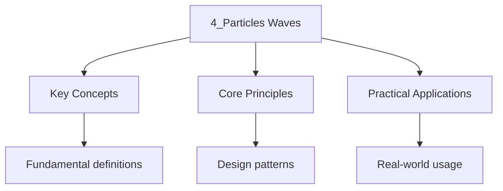

---

title: "Particles and Waves | Highers - Wyatt's Notes"
description: "This chapter covers Physics content, extending beyond Higher level. Comprehensive educational content coverage with definitions and practice problems."
date: 2026-04-14
tags:
  - highers
  - highers-physics
categories:
  - highers-physics

---

<!-- Breadcrumb Schema for SEO -->

## Particles and Waves

</aside>
## Quantum Physics

### Wave-Particle Duality

Light and matter exhibit both wave-like and particle-like properties.

**Photoelectric Effect:** When light of sufficient frequency shines on a metal surface, electrons
Are emitted.

- Electrons are emitted **instantaneously**, not after a delay
- No electrons are emitted if the frequency is below the threshold frequency $f_0$Regardless of
  intensity
- The maximum kinetic energy of emitted electrons depends on frequency, not intensity
- More intense light produces more electrons, not more energetic ones

### Why the Photoelectric Effect Disproves the Wave Theory of Light

Classical wave theory predicts that the energy of a light wave depends on its intensity (amplitude),
Not its frequency. A sufficiently intense low-frequency light should eventually eject electrons.
This does not happen. Einstein"s explanation -- that light consists of discrete photons with energy
$E = hf$ -- correctly predicts that the kinetic energy of emitted electrons depends on frequency,
And that there is a threshold frequency below which no electrons are emitted regardless of
Intensity. This was one of the key experiments that led to quantum mechanics.

**Einstein's Photoelectric Equation:**

$$E_k = hf - \phi$$

Where $\phi = hf_0$ is the work function of the metal.

**Example:** The work function of sodium is $2.28 \mathrm{ eV$. Find the threshold frequency and the
Maximum kinetic energy of photoelectrons when illuminated by light of frequency
$8 \times 10^{14} \mathrm{ Hz$.

Threshold frequency:
$f_0 = \dfrac{\phi}{h} = \dfrac{2.28 \times 1.6 \times 10^{-19}}{6.63 \times 10^{-34}} = \dfrac{3.648 \times 10^{-19}}{6.63 \times 10^{-34}} = 5.50 \times 10^{14} \mathrm{ Hz$.

Maximum kinetic energy:
$E_k = hf - \phi = 6.63 \times 10^{-34} \times 8 \times 10^{14} - 3.648 \times 10^{-19}$

$$= 5.304 \times 10^{-19} - 3.648 \times 10^{-19} = 1.656 \times 10^{-19} \mathrm{ J = 1.04 \mathrm{ eV$$

### De Broglie Wavelength

All matter has wave-like properties. The de Broglie wavelength of a particle with momentum $p$ is:

$$\lambda = \frac{h}{p} = \frac{h}{mv}$$

**Example:** Find the de Broglie wavelength of an electron accelerated through a potential
Difference of $200 \mathrm{ V$.

$$E_k = eV = 200 \mathrm{ eV = 200 \times 1.6 \times 10^{-19} = 3.2 \times 10^{-17} \mathrm{ J$$

$$E_k = \frac{1}{2}mv^2 = \frac{p^2}{2m}$$

$$p = \sqrt{2mE_k} = \sqrt{2 \times 9.11 \times 10^{-31} \times 3.2 \times 10^{-17}} = \sqrt{5.83 \times 10^{-47}} = 7.64 \times 10^{-24} \mathrm{ kg m/s$$

$$\lambda = \frac{h}{p} = \frac{6.63 \times 10^{-34}}{7.64 \times 10^{-24}} = 8.68 \times 10^{-11} \mathrm{ m \approx 0.087 \mathrm{ nm$$

### Why Macroscopic Objects Do Not Show Wave Behaviour

A $1 \mathrm{ kg$ ball moving at $1 \mathrm{ m/s$ has a de Broglie wavelength of
$\lambda = 6.63 \times
10^{-34} / 1 = 6.63 \times 10^{-34}$ m. This is unfathomably small -- far
Smaller than any aperture or obstacle. Wave effects (diffraction, interference) are only observable
When the wavelength is comparable to the size of the obstacles. For electrons (small mass), the de
Broglie wavelength can be comparable to atomic spacing, which is why electron diffraction is readily
Observable.

### Energy Levels and Spectra

Electrons in atoms exist in discrete energy levels. Transitions between levels produce photons:

$$\Delta E = hf = \frac{hc}{\lambda}$$

- **Emission spectrum:** Bright lines on a dark background (photons emitted when electrons move to
  lower levels)
- **Absorption spectrum:** Dark lines on a continuous spectrum (photons absorbed when electrons move
  to higher levels)

**Example:** An electron in a hydrogen atom transitions from $n = 3$ to $n = 1$. The energy levels
Are $E_1 = -13.6 \mathrm{ eV$$E_2 = -3.4 \mathrm{ eV$$E_3 = -1.51 \mathrm{ eV$. Find the wavelength
Of the emitted photon.

$$\Delta E = E_3 - E_1 = -1.51 - (-13.6) = 12.09 \mathrm{ eV = 1.934 \times 10^{-18} \mathrm{ J$$

$$\lambda = \frac{hc}{\Delta E} = \frac{6.63 \times 10^{-34} \times 3 \times 10^8}{1.934 \times 10^{-18}} = \frac{1.989 \times 10^{-25}}{1.934 \times 10^{-18}} = 1.028 \times 10^{-7} \mathrm{ m \approx 103 \mathrm{ nm$$

This is in the ultraviolet region (Lyman series).

### Heisenberg Uncertainty Principle

It is fundamentally impossible to simultaneously know both the exact position and exact momentum of
A particle:

$$\Delta x \cdot \Delta p \geq \frac{\hbar}{2}$$

Where $\hbar = \dfrac{h}{2\pi}$.

### Why the Uncertainty Principle Is Not About Measurement Error

The uncertainty principle is not a statement about the limitations of our instruments. It is a
Fundamental property of nature: a particle does not have simultaneously well-defined position And
momentum. This has profound consequences: it explains why electrons cannot spiral into the Nucleus
(confinement to a small volume requires large momentum, preventing collapse), and it sets a Limit on
the precision of any physical theory.

**Example:** An electron is confined to a region of width $1 \mathrm{ nm$. What is the minimum
Uncertainty in its momentum?

$$\Delta p \geq \frac{\hbar}{2\Delta x} = \frac{1.055 \times 10^{-34}}{2 \times 10^{-9}} = 5.275 \times 10^{-26} \mathrm{ kg m/s$$

---

<!-- Breadcrumb Schema for SEO -->

## Particle Physics

### Standard Model

The Standard Model classifies fundamental particles into:

**Quarks** (six flavours, each with an antiquark):

| Generation | Up-type   | Charge | Down-type   | Charge |
| ---------- | --------- | ------ | ----------- | ------ |
| 1          | Up (u)    | $+2/3$ | Down (d)    | $-1/3$ |
| 2          | Charm (c) | $+2/3$ | Strange (s) | $-1/3$ |
| 3          | Top (t)   | $+2/3$ | Bottom (b)  | $-1/3$ |

**Leptons** (six flavours, each with an antilepton):

| Generation | Charged      | Charge | Neutrino          | Charge |
| ---------- | ------------ | ------ | ----------------- | ------ |
| 1          | Electron (e) | $-1$   | Electron neutrino | $0$    |
| 2          | Muon ($\mu$) | $-1$   | Muon neutrino     | $0$    |
| 3          | Tau ($\tau$) | $-1$   | Tau neutrino      | $0$    |

**Gauge Bosons** (force carriers):

| Force           | Boson                   | Mass  | Acts on           |
| --------------- | ----------------------- | ----- | ----------------- |
| Electromagnetic | Photon ($\gamma$)       | 0     | Charged particles |
| Strong          | Gluon (g)               | 0     | Quarks, gluons    |
| Weak            | $W^+, W^-, Z^0$         | Heavy | All fermions      |
| Gravity         | Graviton (hypothetical) | 0     | All particles     |

**Higgs Boson:** Gives particles mass via the Higgs mechanism.

### Why Quarks Are Never Found in Isolation

The strong force between quarks increases with distance (unlike gravity and electromagnetism, which
Decrease with distance). This phenomenon, called **colour confinement**, means that separating
Quarks requires more and more energy, until it becomes energetically favourable to create new
Quark-antiquark pairs. The result is that quarks are always found in colour-neutral combinations:
Baryons (three quarks) and mesons (quark-antiquark pair).

### Conservation Laws in Particle Physics

In all particle interactions, the following are conserved:

- Charge
- Baryon number
- Lepton number
- Energy and momentum
- Strangeness (in strong interactions)

### Feynman Diagrams

Feynman diagrams represent particle interactions visually. Key features:

- Straight lines represent matter particles (left to right) or antimatter (right to left)
- Wavy lines represent photons
- Curly lines represent gluons
- Dashed lines represent $W$ or $Z$ bosons

**Beta decay:** A neutron converts to a proton by emitting a $W^-$ boson, which decays into an
Electron and electron antineutrino:

$$n \to p + W^-$$ $$W^- \to e^- + \bar{\nu}_e$$

### Antimatter

Every particle has a corresponding antiparticle with the same mass but opposite charge.

**Electron-positron annihilation:**

$$e^- + e^+ \to 2\gamma$$

The total energy of the photons equals $2m_e c^2$ plus any kinetic energy.

---

<!-- Breadcrumb Schema for SEO -->

## Wave Phenomena (Advanced Higher)

### Superposition and Interference

**Principle of Superposition:** When two or more waves overlap, the resultant displacement at any
Point is the sum of the individual displacements.

**Coherent sources** have the same frequency and a constant phase relationship.

### Stationary Waves

A stationary (standing) wave is formed by the superposition of two progressive waves of the same
Frequency travelling in opposite directions.

**Nodes:** Points of zero amplitude.

**Antinodes:** Points of maximum amplitude.

**String fixed at both ends:**

$$f_n = \frac{nv}{2L}, \quad n = 1, 2, 3, \ldots$$

Where $L$ is the string length and $v$ is the wave speed.

**Pipe open at both ends:**

$$f_n = \frac{nv}{2L}, \quad n = 1, 2, 3, \ldots$$

**Pipe closed at one end:**

$$f_n = \frac{nv}{4L}, \quad n = 1, 3, 5, \ldots$$

**Example:** A guitar string of length $65 \mathrm{ cm$ has a fundamental frequency of
$330 \mathrm{ Hz$. Find the wave speed and the frequency of the third harmonic.

$$v = 2Lf_1 = 2 \times 0.65 \times 330 = 429 \mathrm{ m/s$$

$$f_3 = \frac{3v}{2L} = 3 \times 330 = 990 \mathrm{ Hz$$

### Why a Closed Pipe Only Supports Odd Harmonics

At the closed end, there must be a displacement node (the air cannot move). At the open end, there
Is a displacement antinode. The fundamental has a quarter wavelength fitting in the pipe. The second
Harmonic would require three-quarters of a wavelength, which gives the frequency $3f_1$. The pattern
Continues with only odd multiples of the fundamental.

### Doppler Effect

When a source of waves moves relative to an observer, the observed frequency changes:

$$f' = f\frac{v}{v \pm v_s}$$

Where $v_s$ is the speed of the source (minus for approaching, plus for receding).

**For electromagnetic waves (relativistic):**

$$f' = f\sqrt{\frac{c \pm v}{c \mp v}}$$

**Example:** An ambulance siren emits sound at $800 \mathrm{ Hz$. If the ambulance approaches at
$25 \mathrm{ m/s$ (speed of sound $= 343 \mathrm{ m/s$), find the observed frequency.

$$f' = 800 \times \frac{343}{343 - 25} = 800 \times \frac{343}{318} = 800 \times 1.0786 = 862.9 \mathrm{ Hz$$

---

<!-- Breadcrumb Schema for SEO -->

## Intuition

**Light is both a wave and a particle:** Imagine light as a chameleon — it behaves like a wave (diffracting, interfering) in some experiments and like a particle (ejecting electrons) in others. This wave-particle duality is one of the most counterintuitive concepts in physics, but it's essential for understanding the quantum world.

**Why it matters:** Quantum physics explains how atoms work, how lasers produce light, how semiconductors conduct electricity, and how MRI machines image our bodies. Understanding the photoelectric effect, de Broglie wavelength, and energy quantization is fundamental to modern technology.

**The key insight:** Energy comes in discrete packets (quanta), not continuous streams — this is why the photoelectric effect has a threshold frequency below which no electrons are emitted, regardless of light intensity.

## Common Pitfalls

1. **Units in the photoelectric effect:** Convert between eV and joules as needed.
   $1 \mathrm{ eV = 1.6 \times 10^{-19} \mathrm{ J$.

2. **De Broglie wavelength of massive objects:** While all matter has a de Broglie wavelength, it is
   negligibly small for macroscopic objects.

3. **Conservation laws:** Always check charge, baryon number, and lepton number are conserved in
   particle reactions.

4. **Stationary wave harmonics:** A pipe closed at one end only supports odd harmonics
   ($n = 1, 3, 5, \ldots$).

5. **Doppler effect sign convention:** Approaching sources increase observed frequency; receding
   sources decrease it.

6. **Confusing baryon number and atomic mass number.** Baryon number counts the number of quarks
   minus antiquarks (each quark has $B = 1/3$Each antiquark has $B = -1/3$). A proton has $B = 1$ a
   neutron has $B = 1$A meson has $B = 0$.

---

<!-- Breadcrumb Schema for SEO -->

## Practice Questions

1. The work function of potassium is $2.30 \mathrm{ eV$. Find the threshold wavelength and the
   maximum kinetic energy of photoelectrons when illuminated by $400 \mathrm{ nm$ light.

2. Calculate the de Broglie wavelength of a proton moving at $2 \times 10^6 \mathrm{ m/s$.

3. Verify that the following reaction conserves charge, baryon number, and lepton number:
   $\pi^- + p \to K^0 + \Lambda^0$.

4. A stationary wave on a string of length $0.8 \mathrm{ m$ has a third harmonic frequency of
   $600 \mathrm{ Hz$. Find the wave speed.

5. Draw a Feynman diagram for electron-proton scattering via photon exchange.

6. A source emitting $500 \mathrm{ Hz$ sound moves away from a stationary observer at
   $30 \mathrm{ m/s$. Speed of sound is $343 \mathrm{ m/s$. Find the observed frequency.

7. In a hydrogen atom, an electron transitions from $n = 4$ to $n = 2$. Calculate the wavelength of
   the emitted photon.

8. Explain how the Heisenberg uncertainty principle limits the precision of simultaneous
   measurements of position and momentum.

9. A neutron decays into a proton, electron, and electron antineutrino. Write the full reaction and
   verify conservation of charge, baryon number, and lepton number.

10. A stationary wave is formed on a string of length $1.2 \mathrm{ m$ with a fundamental frequency
    of $200 \mathrm{ Hz$. Calculate the frequencies of the second, third, and fourth harmonics, and
    the positions of the nodes and antinodes for the second harmonic.

## 11. Photoelectric Effect: Extended Worked Examples

### Worked Example: Stopping Potential

When light of wavelength $450 \mathrm{ nm$ is incident on a sodium surface, the stopping potential
is Measured to be $0.65 \mathrm{ V$. Find the work function of sodium and the threshold frequency.

$$E_k = eV_s = 1.6 \times 10^{-19} \times 0.65 = 1.04 \times 10^{-19} \mathrm{ J = 0.65 \mathrm{ eV$$

Photon energy:
$E = hf = \frac{hc}{\lambda} = \frac{6.63 \times 10^{-34} \times 3 \times 10^8}{450 \times 10^{-9}} = 4.42 \times 10^{-19} \mathrm{ J = 2.76 \mathrm{ eV$

$$\phi = E - E_k = 2.76 - 0.65 = 2.11 \mathrm{ eV$$

Threshold frequency:
$f_0 = \frac{\phi}{h} = \frac{2.11 \times 1.6 \times 10^{-19}}{6.63 \times 10^{-34}} = 5.09 \times 10^{14} \mathrm{ Hz$

Threshold wavelength:
$\lambda_0 = \frac{c}{f_0} = \frac{3 \times 10^8}{5.09 \times 10^{14}} = 5.89 \times 10^{-7} \mathrm{ m = 589 \mathrm{ nm$

This is in the yellow part of the visible spectrum, so sodium only emits photoelectrons when
Illuminated with blue, violet, or UV light.

### Worked Example: Photoelectric Current

A metal surface with work function $2.0 \mathrm{ eV$ is illuminated with light of frequency
$7 \times 10^{14} \mathrm{ Hz$ at an intensity of $5 \mathrm{ W/m^2$. The surface area is
$2 \mathrm{ cm^2$.

**Photon energy:**
$E = hf = 6.63 \times 10^{-34} \times 7 \times 10^{14} = 4.64 \times 10^{-19} \mathrm{ J = 2.90 \mathrm{ eV$

Since $2.90 \mathrm{ eV \gt 2.0 \mathrm{ eV$Photoelectrons are emitted.

**Maximum KE:** $E_k = 2.90 - 2.0 = 0.90 \mathrm{ eV$

**Photon flux:** Power per unit area divided by energy per photon:

$$\mathrm{flux = \frac{5}{4.64 \times 10^{-19}} = 1.078 \times 10^{19} \mathrm{ photons/m^2\mathrm{/s$$

**Photoelectrons per second:**
$1.078 \times 10^{19} \times 2 \times 10^{-4} = 2.16 \times 10^{15} \mathrm{ electrons/s$

**Maximum current:**
$I = ne = 2.16 \times 10^{15} \times 1.6 \times 10^{-19} = 3.45 \times 10^{-4} \mathrm{ A = 0.345 \mathrm{ mA$

## 12. De Broglie Wavelength: Extended Examples

### Worked Example: Electron Diffraction

Electrons are accelerated through a potential difference of $500 \mathrm{ V$. They pass through a
Thin crystal and produce a diffraction pattern. The first diffraction maximum is observed at an
Angle of $1.8^{\circ}$. Calculate the atomic spacing.

$$E_k = eV = 500 \mathrm{ eV = 8.0 \times 10^{-17} \mathrm{ J$$

$$p = \sqrt{2mE_k} = \sqrt{2 \times 9.11 \times 10^{-31} \times 8.0 \times 10^{-17}} = \sqrt{1.458 \times 10^{-46}} = 1.208 \times 10^{-23} \mathrm{ kg m/s$$

$$\lambda = \frac{h}{p} = \frac{6.63 \times 10^{-34}}{1.208 \times 10^{-23}} = 5.49 \times 10^{-11} \mathrm{ m$$

For the first-order maximum: $d\sin\theta = \lambda$

$$d = \frac{\lambda}{\sin\theta} = \frac{5.49 \times 10^{-11}}{\sin 1.8^{\circ}} = \frac{5.49 \times 10^{-11}}{0.0314} = 1.75 \times 10^{-9} \mathrm{ m = 1.75 \mathrm{ nm$$

This is roughly 3--5 atomic spacings, which is consistent with crystal lattice spacing.

## 13. Energy Levels: Extended Analysis

### Worked Example: Hydrogen Spectral Series

Calculate the wavelength of the first three lines in the Balmer series (transitions to $n = 2$).

$E_n = -\frac{13.6}{n^2} \mathrm{ eV$

**$n = 3 \to 2$:**

$$\Delta E = 13.6\left(\frac{1}{4} - \frac{1}{9}\right) = 13.6 \times \frac{5}{36} = 1.889 \mathrm{ eV$$

$$\lambda = \frac{hc}{\Delta E} = \frac{6.63 \times 10^{-34} \times 3 \times 10^8}{1.889 \times 1.6 \times 10^{-19}} = \frac{1.989 \times 10^{-25}}{3.022 \times 10^{-19}} = 6.58 \times 10^{-7} \mathrm{ m = 658 \mathrm{ nm \mathrm{ (red)$$

**$n = 4 \to 2$:**

$$\Delta E = 13.6\left(\frac{1}{4} - \frac{1}{16}\right) = 13.6 \times \frac{3}{16} = 2.55 \mathrm{ eV$$

$$\lambda = \frac{1.989 \times 10^{-25}}{2.55 \times 1.6 \times 10^{-19}} = 4.87 \times 10^{-7} \mathrm{ m = 487 \mathrm{ nm \mathrm{ (blue-green)$$

**$n = 5 \to 2$:**

$$\Delta E = 13.6\left(\frac{1}{4} - \frac{1}{25}\right) = 13.6 \times \frac{21}{100} = 2.856 \mathrm{ eV$$

$$\lambda = \frac{1.989 \times 10^{-25}}{2.856 \times 1.6 \times 10^{-19}} = 4.35 \times 10^{-7} \mathrm{ m = 435 \mathrm{ nm \mathrm{ (violet)$$

## 14. Particle Physics: Extended Conservation Laws

### Worked Example: Verifying Conservation Laws

Verify conservation of charge, baryon number, and lepton number for beta-minus decay of a free
Neutron:

$$n \to p + e^- + \bar{\nu}_e$$

Writing with full quark content: $udd \to uud + e^- + \bar{\nu}_e$

| Quantity      | Before                                                      | After                                                        | Conserved? |
| ------------- | ----------------------------------------------------------- | ------------------------------------------------------------ | ---------- |
| Charge        | $0 + (-\frac{1}{3}) + (-\frac{1}{3}) + (-\frac{1}{3}) = -1$ | $\frac{2}{3} + \frac{2}{3} + (-\frac{1}{3}) + (-1) + 0 = -1$ | Yes        |
| Baryon number | $3 \times \frac{1}{3} = 1$                                  | $3 \times \frac{1}{3} + 0 + 0 + 0 = 1$                       | Yes        |
| Lepton number | $0$                                                         | $1 + (-1) = 0$                                               | Yes        |

### Worked Example: Pion Decay

A $\pi^-$ meson (quark content $d\bar{u}$) decays: $\pi^- \to \mu^- + \bar{\nu}_\mu$

| Quantity      | Before                                 | After          | Conserved? |
| ------------- | -------------------------------------- | -------------- | ---------- |
| Charge        | $(-\frac{1}{3}) + (-\frac{2}{3}) = -1$ | $-1 + 0 = -1$  | Yes        |
| Baryon number | $0 + 0 = 0$                            | $0 + 0 = 0$    | Yes        |
| Lepton number | $0$                                    | $1 + (-1) = 0$ | Yes        |

## 15. Stationary Waves: Extended Analysis

### Worked Example: Nodes and Antinodes for the Second Harmonic

A string of length $1.2 \mathrm{ m$ has fundamental frequency $200 \mathrm{ Hz$.

Wave speed: $v = 2Lf_1 = 2 \times 1.2 \times 200 = 480 \mathrm{ m/s$

**Second harmonic ($n = 2$):** $f_2 = 400 \mathrm{ Hz$, $\lambda_2 = \frac{2L}{2} = 1.2 \mathrm{ m$.

Nodes at: $0, 0.6 \mathrm{ m, 1.2 \mathrm{ m$ (3 nodes, including the fixed ends)

Antinodes at: $0.3 \mathrm{ m, 0.9 \mathrm{ m$ (2 antinodes)

**Third harmonic ($n = 3$):** $f_3 = 600 \mathrm{ Hz$, $\lambda_3 = \frac{2L}{3} = 0.8 \mathrm{ m$.

**Fourth harmonic ($n = 4$):** $f_4 = 800 \mathrm{ Hz$, $\lambda_4 = \frac{2L}{4} = 0.6 \mathrm{ m$.

## 16. Summary Table: Quantum and Wave Formulas

| Topic           | Formula                         | Variables              | Notes                |
| --------------- | ------------------------------- | ---------------------- | -------------------- |
| Photon energy   | $E = hf = hc/\lambda$           | $h$, $f$, $\lambda$    | Planck's constant    |
| Photoelectric   | $E_k = hf - \phi$               | $h$, $f$, $\phi$       | Einstein's equation  |
| De Broglie      | $\lambda = h/p = h/(mv)$        | $h$, $p$, $m$, $v$     | Matter waves         |
| Uncertainty     | $\Delta x \Delta p \ge \hbar/2$ | $\Delta x$, $\Delta p$ | Fundamental limit    |
| Energy levels   | $\Delta E = hf = hc/\lambda$    | $h$, $f$, $\lambda$    | Spectral lines       |
| Standing wave   | $f_n = nv/(2L)$                 | $n$, $v$, $L$          | String fixed at ends |
| Closed pipe     | $f_n = nv/(4L)$                 | $n$ odd                | Only odd harmonics   |
| Doppler (sound) | $f' = fv/(v \pm v_s)$           | $f$, $v$, $v_s$        | Approaching/receding |

## 17. Practice Questions (Additional)

1. The work function of caesium is $2.14 \mathrm{ eV$. Calculate the threshold wavelength and the
    maximum KE of photoelectrons when illuminated with $550 \mathrm{ nm$ light.

2. Calculate the de Broglie wavelength of a neutron moving at $2200 \mathrm{ m/s$ (thermal neutrons
    in a nuclear reactor). (Mass of neutron $= 1.675 \times 10^{-27} \mathrm{ kg$.)

3. A hydrogen atom is in the $n = 4$ state. Calculate the wavelengths of all possible photons
    emitted as it decays to the ground state.

4. Verify conservation of charge, baryon number, and lepton number for the reaction:
    $\pi^+ + p \to K^+ + \Sigma^+$

5. A stationary wave is set up on a string of length $0.6 \mathrm{ m$ with a fundamental frequency
    of $250 \mathrm{ Hz$. Calculate the wave speed and the frequency of the fifth harmonic.

6. A source emitting $600 \mathrm{ Hz$ moves towards a stationary observer at $40 \mathrm{ m/s$.
    Speed of sound $= 343 \mathrm{ m/s$. Calculate the observed frequency and the wavelength of the
    observed sound.

7. Explain how electron diffraction experiments provide evidence for the wave nature of matter.

8. Calculate the energy of a photon in the Lyman series corresponding to a transition from $n = 5$
    to $n = 1$ in hydrogen.

9. An electron is confined to a region of width $0.5 \mathrm{ nm$. Estimate the minimum uncertainty
    in its velocity.

10. Explain why the strong nuclear force must be a short-range force. Reference colour confinement
    and the fact that quarks are never observed in isolation.

## Extended Worked Examples

### Example 21: De Broglie Wavelength of an Electron in a Potential Difference

An electron is accelerated through a potential difference of $200 \mathrm{ V$. Calculate its de
Broglie wavelength.

**Step 1: Find the kinetic energy**

$$eV = \frac{1}{2}mv^2$$

$$1.602 \times 10^{-19} \times 200 = \frac{1}{2} \times 9.109 \times 10^{-31} \times v^2$$

$$v^2 = \frac{2 \times 3.204 \times 10^{-17}}{9.109 \times 10^{-31}} = 7.034 \times 10^{13}$$

$$v = 8.387 \times 10^6 \mathrm{ m/s$$

**Step 2: Calculate the de Broglie wavelength**

$$\lambda = \frac{h}{mv} = \frac{6.626 \times 10^{-34}}{9.109 \times 10^{-31} \times 8.387 \times 10^6}$$

$$\lambda = \frac{6.626 \times 10^{-34}}{7.639 \times 10^{-24}} = 8.67 \times 10^{-11} \mathrm{ m = 0.0867 \mathrm{ nm$$
