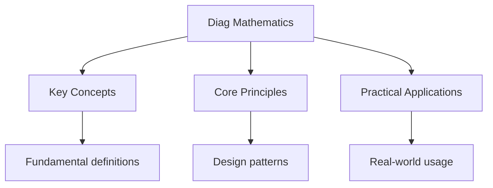

---

date: 2026-07-23T21:57:32+01:00
title: "Diagnostic Test: Mathematics | HSC"
description: "Comprehensive study notes for Diagnostic Test: Mathematics with worked examples, practice problems, and key concepts for exam preparation."
sidebar_position: 60
tableOfContents: false
---

<!-- Breadcrumb Schema for SEO -->

## Diagnostic Test: Mathematics

10 multiple-choice questions covering algebra, calculus, trigonometry, probability, and statistics. Select the best answer for each question, then check your score using the answer key below.

---

<!-- Breadcrumb Schema for SEO -->

**Question 1.** Solve for $x$: $3x - 7 = 2x + 5$.

(A) $x = 2$
(B) $x = 12$
(C) $x = -12$
(D) $x = -2$

---

<!-- Breadcrumb Schema for SEO -->

**Question 2.** What is the value of $\\displaystyle\\lim_{x \\to 3} \\dfrac{x^2 - 9}{x - 3}$?

(A) 0
(B) 3
(C) 6
(D) Undefined

---

<!-- Breadcrumb Schema for SEO -->

**Question 3.** If $\\tan \\theta = \\dfrac{5}{12}$ and $\\theta$ is acute, what is $\\sin \\theta$?

(A) $\\dfrac{5}{13}$
(B) $\\dfrac{12}{13}$
(C) $\\dfrac{5}{12}$
(D) $\\dfrac{13}{5}$

---

<!-- Breadcrumb Schema for SEO -->

**Question 4.** A coin is flipped 3 times. What is the probability of getting exactly 2 heads?

(A) $\\dfrac{1}{2}$
(B) $\\dfrac{1}{4}$
(C) $\\dfrac{3}{8}$
(D) $\\dfrac{1}{8}$

---

<!-- Breadcrumb Schema for SEO -->

**Question 5.** The gradient of the curve $y = x^3 - 2x$ at $x = 1$ is:

(A) $-1$
(B) 0
(C) 1
(D) 3

---

<!-- Breadcrumb Schema for SEO -->

**Question 6.** Which of the following is the derivative of $y = \\ln(2x)$?

(A) $\\dfrac{1}{2x}$
(B) $\\dfrac{1}{x}$
(C) $\\dfrac{2}{x}$
(D) $\\dfrac{x}{2}$

---

<!-- Breadcrumb Schema for SEO -->

**Question 7.** The median of the data set $\\{2, 5, 8, 3, 7\\}$ is:

(A) 5
(B) 7
(C) 8
(D) 3

---

<!-- Breadcrumb Schema for SEO -->

**Question 8.** Simplify: $\\dfrac{x^2 - 4}{x + 2}$.

(A) $x - 2$, $x \\neq -2$
(B) $x + 2$
(C) $x^2 - 2$
(D) $x - 4$

---

<!-- Breadcrumb Schema for SEO -->

**Question 9.** What is the exact value of $\\sin\\left(\\dfrac{\\pi}{6}\\right)$?

(A) $\\dfrac{\\sqrt{3}}{2}$
(B) $\\dfrac{1}{2}$
(C) $\\dfrac{\\sqrt{2}}{2}$
(D) 1

---

<!-- Breadcrumb Schema for SEO -->

**Question 10.** If events $A$ and $B$ are mutually exclusive with $P(A) = 0.3$ and $P(B) = 0.5$, then $P(A \\cup B)$ is:

(A) 0.15
(B) 0.65
(C) 0.8
(D) 0.85

---

<!-- Breadcrumb Schema for SEO -->

## Answer Key

| Question | Correct Answer |
|----------|---------------|
| 1        | B             |
| 2        | C             |
| 3        | A             |
| 4        | C             |
| 5        | A             |
| 6        | B             |
| 7        | A             |
| 8        | A             |
| 9        | B             |
| 10       | C             |

**Scoring:** Count your correct answers out of 10. A score of 8 or above indicates strong mastery of HSC Mathematics fundamentals. Review the explanations in the practice problems for any questions you answered incorrectly.

## Intuition

**Mathematics is the tool for quantitative reasoning:** From algebra to calculus, mathematics provides systematic methods for solving problems involving numbers, patterns, and change. Each topic builds on previous ones to create a powerful problem-solving toolkit.

**Why it matters:** Mathematical skills are essential for science, engineering, finance, and any career involving data or quantitative analysis.

**The key insight:** Mathematics is cumulative — gaps in algebra will cause difficulties in calculus, and weak trigonometry will hinder physics and engineering.

## Common Mistakes

**Confusing arithmetic and geometric progressions:** Arithmetic has constant difference $d$; geometric has constant ratio $r$. Using the wrong formula ($a_n = a_1 + (n-1)d$ vs $a_n = a_1 r^{n-1}$) gives completely wrong answers for term values and sums.

**Sign errors in trigonometry:** The CAST diagram (All, Sin, Tan, Cos) determines which quadrants give positive values. Forgetting the sign in specific quadrants leads to wrong angle solutions. Always check the quadrant before finalising an answer.

**Misapplying the cosine rule:** The cosine rule $c^2 = a^2 + b^2 - 2ab\cos C$ requires the angle to be between sides $a$ and $b$. Using the wrong angle gives incorrect side lengths. Identify the included angle before applying the rule.

## Cross-References

- **[Site Home](../../):** Main landing page for hsc notes.
- **[Practice](../../practice-*.mdx):** Practice problems for revision.
