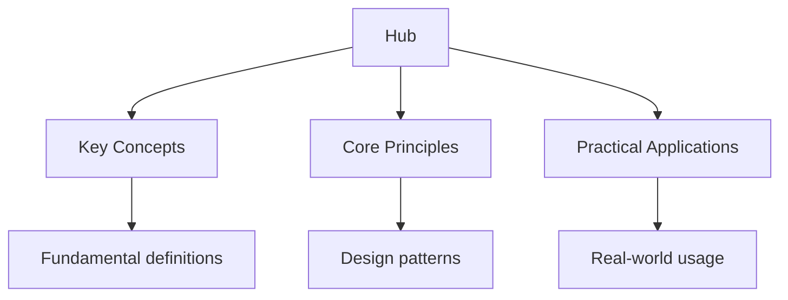

## Why This Guide Exists

The Higher School Certificate (HSC) is the qualification earned by students in New South Wales, Australia, upon completing secondary school. The HSC is administered by NESA (NSW Education Standards Authority) and is the primary pathway to university admissions in Australia. Physics and Mathematics are among the most challenging and high-value HSC subjects — they develop analytical thinking, problem-solving skills, and the quantitative foundation for university STEM courses.

This hub page maps every resource on this site — organised by subject, with study plans and exam strategies tailored to the HSC assessment approach. Every topic below links to detailed notes, practice questions, flashcards, and diagnostic quizzes.

## Table of Contents

- [Physics](#physics)
- [Mathematics](#mathematics)
- [Recommended Study Plan](#recommended-study-plan)
- [Cross-Site Resources](#cross-site-resources)
- [FAQ](#faq)

---

## Physics

HSC Physics covers mechanics, electricity and magnetism, waves and light, the universe, and additional topics including technological implications. The HSC course emphasises understanding physical principles and applying them to real-world scenarios.

### Topic Notes

- [Physics Overview](physics) — course structure, syllabus topics, and assessment format
- [Mechanics](physics/mechanics) — motion, forces, energy, momentum, and circular motion
- [Waves](physics/waves) — wave properties, sound, electromagnetic waves, and diffraction

### Practice and Review

- [Flashcards: Physics](flashcards-physics)
- [Practice Questions: Physics](practice-physics)

### Key Exam Focus

HSC Physics requires you to explain, predict, and analyse physical phenomena. The exam includes short-answer questions, extended-response questions, and data analysis. Practise explaining concepts clearly in writing — the exam rewards well-structured explanations supported by calculations and diagrams.

The exam is divided into a first paper (typically 1.5 hours) covering all topics and a second paper that may include additional depth. You must manage your time carefully — allocate roughly 1 minute per mark and move on if a question is stalling you.

**The "In-depth Investigation"** (major work) is a significant component of your HSC mark. Plan it carefully — choose a topic that allows genuine investigation with measurable outcomes. Start early, document everything, and ensure your conclusion directly addresses your hypothesis.

### Topic Breakdown

**Mechanics** is the foundation of HSC Physics. You must understand Newton's laws, projectile motion, momentum conservation, and energy transformations. The exam frequently combines mechanics concepts — for example, a projectile problem that also involves energy conservation and circular motion. Practise drawing free-body diagrams and applying Newton's second law to objects on inclined planes, in circular motion, and in collision scenarios.

**Electricity and Magnetism** covers electric fields, magnetic fields, electromagnetic induction, and generators. Understanding the relationship between electricity and magnetism — Faraday's law, Lenz's law, and motor/generator principles — is essential. You should be able to predict the direction of induced current and calculate induced EMF using Faraday's law.

**Waves and Light** includes mechanical waves, electromagnetic spectrum, reflection, refraction, diffraction, and interference. The HSC tests both the physics of waves and their practical applications. Practise solving problems involving Snell's law, diffraction gratings, and double-slit interference. Understanding the relationship between wavelength, frequency, and wave speed is fundamental.

**The Universe** covers stellar evolution, cosmology, and the expansion of the universe. This topic requires both factual recall and the ability to apply physical principles to astronomical phenomena. You should understand Hertzsprung-Russell diagrams, the life cycle of stars, redshift, and the Big Bang theory.

---

## Mathematics

HSC Mathematics is available in three levels: General Mathematics, Mathematics (Standard 2), and Mathematics (Advanced). Each level builds on the previous one and serves different academic pathways.

### Topic Notes

- [Mathematics Overview](mathematics) — course structure, syllabus topics, and assessment format
- [Algebra](mathematics/algebra) — algebraic manipulation, functions, and equations
- [Calculus](mathematics/calculus) — differentiation, integration, and applications

### Practice and Review

- [Practice Questions: Mathematics](practice-mathematics)
- [Diagnostic Quizzes](mathematics) — test across all maths topics

### Key Exam Focus

HSC Mathematics rewards clear, structured working. Show every step of your solution — markers award marks for correct method even when the final answer is wrong. The exam includes both short-answer and extended-response questions.

The exam typically consists of a 2-hour paper for Standard and Advanced levels. You must manage your time carefully — allocate time proportional to marks and do not spend too long on any single question. Read each question carefully to ensure you are answering what is actually asked.

### Mathematics Levels

**General Mathematics** covers financial mathematics, measurement, statistical investigation, algebraic modelling, and networks. It is designed for students who need quantitative skills but not advanced mathematical reasoning. This course is suitable for students planning non-STEM university courses.

**Mathematics (Standard 2)** covers algebra, measurement, financial modelling, statistical analysis, and networks. It is suitable for students planning university courses that require some mathematical background. Standard 2 provides a solid foundation without the demands of calculus.

**Mathematics (Advanced)** covers functions, calculus, financial modelling, statistical analysis, and networks. It is the prerequisite for Mathematics Extension 1 and is designed for students planning STEM university courses. Calculus — differentiation and integration — forms a major component of the Advanced course.

### Mathematics Extension 1

Extension 1 covers combinatorics, polynomial functions, trigonometric functions, calculus, and proof. It is taken alongside Mathematics (Advanced) and provides additional depth and challenge. Extension 1 is essential for students planning to study engineering, mathematics, or physics at university.

### Mathematics Extension 2

Extension 2 covers complex numbers, vectors, proof, mechanics, and harder calculus. It is the most challenging HSC mathematics course and is designed for students with strong mathematical ability planning to study mathematics or engineering at university. The exam tests both technical skill and mathematical reasoning.

---

## Recommended Study Plan

Preparing for the HSC requires sustained effort across your subject selections. Here is a structured approach for Physics and Mathematics.

### Phase 1: Foundation (Months 1–6)

- Study all topic notes for each subject, building conceptual understanding
- Complete flashcards daily for formulas and key concepts
- Aim for one diagnostic quiz per subject per week
- Focus on understanding before memorisation
- For Physics, practise drawing diagrams and labelling them correctly
- For Mathematics, work through examples step by step, verifying each calculation

### Phase 2: Consolidation (Months 7–10)

- Revisit weak areas identified by diagnostic quizzes
- Begin practice questions under timed conditions
- Work through past HSC papers — they reveal the exam's style and marking criteria
- Practise extended-response questions for Physics
- For Mathematics, focus on calculus and algebra — they carry the most marks
- Analyse NESA marking criteria to understand what markers reward

### Phase 3: Exam Readiness (Months 11–12)

- Focus almost entirely on practice questions and past papers
- Study NESA marking criteria — they show exactly what markers look for
- Do full-length timed papers under real conditions
- Revise formulas and key concepts daily
- Practise explaining Physics concepts in writing — clarity is rewarded
- Reserve the last two weeks for light revision and rest

### Daily Routine

| Time | Activity |
| ------ | ---------- |
| Morning | Active recall — flashcards and formula review for 20 minutes |
| Afternoon | Topic study — read notes on one new topic |
| Evening | Practice — complete 5–10 practice questions |
| Weekend | Diagnostic quiz + review weak areas |

---

## Cross-Site Resources

Wyatt's Notes is a network of interconnected study sites. The HSC content connects to related material:

- **[IB Study Guide](https://ib.wyattau.com/hub)** — the International Baccalaureate as an alternative qualification
- **[AP Study Guide](https://ap.wyattau.com/hub)** — Advanced Placement courses as an alternative pathway
- **[University Physics](https://physics.wyattau.com/hub)** — deeper coverage beyond HSC level
- **[University Mathematics](https://mathematics.wyattau.com/hub)** — proof-based mathematics beyond HSC level

---

## Frequently Asked Questions

### How should I start using this site?

Take a diagnostic quiz for each subject. This takes about 10–15 minutes per subject and gives you a clear picture of your strengths and weaknesses. Then prioritise studying the topics where you scored lowest.

### Which mathematics level should I take?

Choose based on your university plans and mathematical ability. If you are planning a STEM degree, take Mathematics (Advanced) at minimum. If you are confident in mathematics and want to study engineering or mathematics at university, consider Extension 1 or Extension 2.

### How important are past papers?

Very. Past HSC papers are the single best resource for exam preparation. They reveal the exam's structure, difficulty, and marking criteria. Complete as many as possible under timed conditions.

### How often should I use the flashcards?

Daily. Flashcards use spaced repetition to optimise review timing. Spend 15–20 minutes each morning reviewing formulas and key concepts.

### What is the difference between the HSC and other Australian state exams?

The HSC is specific to New South Wales. Other states have their own qualifications (e.g., VCE in Victoria, ATAR in Queensland). The content is similar but the exam structure and assessment methods differ. If you are planning to study interstate, check the specific requirements of your target university.

### How should I prepare for the Physics major work?

Start early — the major work is a long-term project. Choose a topic that genuinely interests you and allows measurable investigation. Follow the NESA guidelines carefully and seek feedback from your teacher throughout the process. Keep a detailed logbook — it is assessed alongside your final report.

### What is the ATAR and how does it affect my university options?

The ATAR (Australian Tertiary Admission Rank) is a rank from 0 to 99.95 that determines your eligibility for university courses. Your ATAR is calculated from your best HSC subjects (including any scaling adjustments). Higher ATARs give access to more competitive courses.

### Does HSC Physics scale well for ATAR?

Physics is generally considered a moderately scaling subject — it may be scaled up slightly depending on the difficulty of the exam. However, choose subjects based on your strengths and interests, not just scaling. A strong mark in a subject you enjoy will always outperform a mediocre mark in a scaled subject.

---

*Last updated: 24 July 2026*

*Written by Wyatt. For questions or feedback, visit [wyattau.com](https://wyattau.com).*
