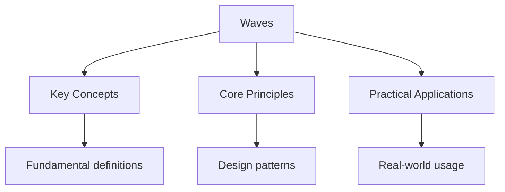

---

date: 2026-07-23T21:57:32+01:00
title: "Waves | HSC - Wyatt's Notes"
description: "\"itemListElement\": [{\"name\": \"Home\", \"url\": \"https://wyattau.com\"}, {\"name\": \"hsc\", \"url\": \"https://hsc.wyattau.com\"}, {\"name\": \"Physics\", \"url\":"
---

<!-- Breadcrumb Schema for SEO -->

## Waves

HSC physics study notes - Waves

## Key Concepts

### Wave Properties

**Wave speed equation:** $v = f\lambda$

**Frequency:** $f = \frac{1}{T}$ (where $T$ is the period)

**Wave types:**

- Transverse: oscillations perpendicular to wave direction (e.g., light, water waves)
- Longitudinal: oscillations parallel to wave direction (e.g., sound, compressions)

### Sound Waves

**Speed of sound in air:** $v \approx 340\,\text{m/s}$ at $20°C$

**Sound intensity:** $I = \frac{P}{4\pi r^2}$ (inverse square law)

**Sound level (decibels):** $\beta = 10\log_{10}\left(\frac{I}{I_0}\right)$ where $I_0 = 10^{-12}\,\text{W/m}^2$

### Electromagnetic Spectrum

**Speed of EM waves in vacuum:** $c = 3 \times 10^8\,\text{m/s}$

**Energy of a photon:** $E = hf = \frac{hc}{\lambda}$

**Relationship:** $c = f\lambda$

### Interference

**Superposition principle:** When two waves meet, the resultant displacement is the sum of individual displacements.

**Constructive interference:** Path difference $= n\lambda$ ($n = 0, 1, 2, \ldots$)

**Destructive interference:** Path difference $= (n + \frac{1}{2})\lambda$ ($n = 0, 1, 2, \ldots$)

### Diffraction

**Single slit:** Central maximum is twice the width of other maxima.

**Diffraction grating:** $d\sin\theta = n\lambda$

## Worked Examples

### Example 1: Wave Speed

**Problem:** A wave has frequency $50\,\text{Hz}$ and wavelength $0.8\,\text{m}$. Find the wave speed.

**Solution:**

Step 1: Apply the wave speed equation:
$$v = f\lambda = 50 \times 0.8 = 40\,\text{m/s}$$

**Answer:** The wave speed is $40\,\text{m/s}$

### Example 2: Sound Intensity

**Problem:** A sound has intensity $10^{-4}\,\text{W/m}^2$. Find the sound level in decibels.

**Solution:**

Step 1: Apply the decibel formula:
$$\beta = 10\log_{10}\left(\frac{I}{I_0}\right) = 10\log_{10}\left(\frac{10^{-4}}{10^{-12}}\right)$$

Step 2: Simplify:
$$\beta = 10\log_{10}(10^8) = 10 \times 8 = 80\,\text{dB}$$

**Answer:** The sound level is $80\,\text{dB}$

### Example 3: Diffraction Grating

**Problem:** Light of wavelength $600\,\text{nm}$ passes through a diffraction grating with $5000$ lines per cm. Find the angle of the first-order maximum.

**Solution:**

Step 1: Find the grating spacing:
$$d = \frac{1}{5000} = 2 \times 10^{-4}\,\text{cm} = 2 \times 10^{-6}\,\text{m}$$

Step 2: Convert wavelength: $\lambda = 600\,\text{nm} = 6 \times 10^{-7}\,\text{m}$

Step 3: Apply the grating equation for $n = 1$:
$$\sin\theta = \frac{n\lambda}{d} = \frac{1 \times 6 \times 10^{-7}}{2 \times 10^{-6}} = 0.3$$

Step 4: $\theta = \arcsin(0.3) \approx 17.5°$

**Answer:** The angle of the first-order maximum is approximately $17.5°$

## Exam Tips

1. Remember that $v = f\lambda$ applies to all waves
2. Sound intensity follows the inverse square law
3. For diffraction gratings, higher orders are only visible if $\sin\theta \leq 1$
4. EM spectrum: radio, microwave, infrared, visible, UV, X-ray, gamma (increasing energy)

## Practice Problems

1. A wave travels at $340\,\text{m/s}$ with wavelength $0.5\,\text{m}$. Find the frequency.
2. Two sound sources are $2\,\text{m}$ apart and vibrate in phase. Find the position of the first minimum between them for sound of wavelength $0.4\,\text{m}$.
3. What is the energy of a photon with wavelength $500\,\text{nm}$? ($h = 6.63 \times 10^{-34}\,\text{J s}$, $c = 3 \times 10^8\,\text{m/s}$)

### Example 4: Standing Waves on a String

**Problem:** A string of length $0.5\,\text{m}$ is fixed at both ends and vibrates in its third harmonic at $150\,\text{Hz}$. Find the wave speed.

**Solution:**

Step 1: For a string fixed at both ends, the $n$-th harmonic frequency is:
$$f_n = \frac{nv}{2L}$$

Step 2: For the third harmonic ($n = 3$):
$$150 = \frac{3v}{2 \times 0.5} = \frac{3v}{1}$$

Step 3: Solve for $v$:
$$v = \frac{150}{3} = 50\,\text{m/s}$$

**Answer:** The wave speed is $50\,\text{m/s}$

**Common mistake:** Using $f_n = nv/L$ instead of $f_n = nv/(2L)$ for a string fixed at both ends. The factor of 2 arises because both ends are nodes.

### Example 5: Doppler Effect

**Problem:** A train sounding its horn at $400\,\text{Hz}$ approaches a stationary observer at $30\,\text{m/s}$. The speed of sound is $340\,\text{m/s}$. Find the frequency heard by the observer.

**Solution:**

Step 1: For a source approaching a stationary observer:
$$f' = f \cdot \frac{v}{v - v_s}$$

Step 2: Substitute values:
$$f' = 400 \times \frac{340}{340 - 30} = 400 \times \frac{340}{310} = 400 \times 1.097 = 438.7\,\text{Hz}$$

**Answer:** The observer hears a frequency of approximately $439\,\text{Hz}$

**Common mistake:** Using the wrong sign in the Doppler formula. When the source approaches, the denominator is $v - v_s$ (frequency increases). When the source recedes, it is $v + v_s$ (frequency decreases).

### Example 6: Photon Energy and Photoelectric Effect

**Problem:** Light of wavelength $200\,\text{nm}$ strikes a metal with work function $3.5\,\text{eV}$. Find the maximum kinetic energy of the emitted electrons ($h = 6.63 \times 10^{-34}\,\text{J s}$, $c = 3 \times 10^8\,\text{m/s}$, $1\,\text{eV} = 1.6 \times 10^{-19}\,\text{J}$).

**Solution:**

Step 1: Calculate photon energy:
$$E = \frac{hc}{\lambda} = \frac{6.63 \times 10^{-34} \times 3 \times 10^8}{200 \times 10^{-9}} = 9.945 \times 10^{-19}\,\text{J}$$

Step 2: Convert to eV:
$$E = \frac{9.945 \times 10^{-19}}{1.6 \times 10^{-19}} = 6.22\,\text{eV}$$

Step 3: Apply the photoelectric equation:
$$E_k = E - W_0 = 6.22 - 3.5 = 2.72\,\text{eV}$$

**Answer:** The maximum kinetic energy is $2.72\,\text{eV}$

**Common mistake:** Forgetting to convert between joules and electron volts. Always check the units requested in the answer.

## More Worked Examples

### Example 7: Standing Waves in a Pipe

**Problem:** Find the fundamental frequency of a pipe of length $0.8\,\text{m}$ that is open at both ends ($v = 340\,\text{m/s}$).

**Solution:**

Step 1: For a pipe open at both ends, the fundamental frequency occurs when the length equals half a wavelength:
$$L = \frac{\lambda}{2} \implies \lambda = 2L = 2 \times 0.8 = 1.6\,\text{m}$$

Step 2: Apply the wave equation:
$$f = \frac{v}{\lambda} = \frac{340}{1.6} = 212.5\,\text{Hz}$$

**Answer:** The fundamental frequency is $212.5\,\text{Hz}$

**Common mistake:** Using $L = \lambda$ instead of $L = \lambda/2$ for the fundamental mode in a pipe open at both ends.

### Example 8: Beats

**Problem:** Two tuning forks produce frequencies of $256\,\text{Hz}$ and $260\,\text{Hz}$. Find the beat frequency and the time interval between successive maxima.

**Solution:**

Step 1: Beat frequency is the difference of the two frequencies:
$$f_{\text{beat}} = |f_1 - f_2| = |256 - 260| = 4\,\text{Hz}$$

Step 2: Time interval between successive maxima:
$$T = \frac{1}{f_{\text{beat}}} = \frac{1}{4} = 0.25\,\text{s}$$

**Answer:** The beat frequency is $4\,\text{Hz}$ and the time interval is $0.25\,\text{s}$

**Common mistake:** Confusing beat frequency with the average frequency. The beat frequency is the difference, not the sum or average.

### Example 9: Refraction and Snell's Law

**Problem:** Light traveling in glass ($n = 1.5$) strikes the glass-air boundary at an angle of incidence of $40°$. Find the angle of refraction and determine if total internal reflection occurs.

**Solution:**

Step 1: Check for total internal reflection. The critical angle is:
$$\sin C = \frac{n_2}{n_1} = \frac{1}{1.5} = 0.667$$
$$C = \arcsin(0.667) = 41.8°$$

Step 2: Since the angle of incidence ($40°$) is less than the critical angle ($41.8°$), total internal reflection does not occur.

Step 3: Apply Snell's law:
$$n_1 \sin\theta_1 = n_2 \sin\theta_2$$
$$1.5 \times \sin 40° = 1 \times \sin\theta_2$$
$$\sin\theta_2 = 1.5 \times 0.643 = 0.964$$
$$\theta_2 = \arcsin(0.964) = 74.6°$$

**Answer:** The angle of refraction is $74.6°$ and no total internal reflection occurs

**Common mistake:** Forgetting to check the critical angle before applying Snell's law. If the angle of incidence exceeds the critical angle, all light is reflected back into the denser medium.

## Intuition

Waves are energy in motion without matter following it -- think of a Mexican wave in a stadium where each person moves up and down while the pattern travels forward. Interference is what happens when two waves occupy the same space: they add together, creating regions of reinforcement and cancellation. Diffraction reveals that waves bend around obstacles, a behaviour that becomes more pronounced when the obstacle size approaches the wavelength. The Doppler effect is the reason a siren changes pitch as it passes you -- the wavefronts compress ahead and stretch behind.

## Common Mistakes

**Confusing the wave speed equation variables.** The equation v = f * lambda relates wave speed (m/s), frequency (Hz), and wavelength (m). Students often rearrange it incorrectly or mix up which variable to solve for. Remember: speed equals frequency times wavelength, always.

**Using the wrong sign in the Doppler effect formula.** When the source approaches the observer, the observed frequency increases: f' = f *v / (v - vs). When the source recedes, frequency decreases: f' = f* v / (v + vs). Students often use the wrong sign, giving the opposite effect to what actually occurs.

**Forgetting that sound intensity follows the inverse square law.** Sound intensity decreases as 1/r^2 with distance from the source. Doubling the distance reduces intensity to one-quarter, not one-half. Students often assume a linear decrease, leading to incorrect calculations of sound levels at different distances.

## Cross-References

- [Mechanics](../physics/mechanics) -- Simple harmonic motion is the foundation for understanding oscillatory wave behaviour.
- [Algebra](../mathematics/algebra) -- Logarithmic functions are used in decibel calculations and sound intensity levels.
- [Calculus](../mathematics/calculus) -- Differentiation and integration are used in wave equations and standing wave analysis.
- [Inorganic](../chemistry/inorganic) -- Electromagnetic spectrum properties connect to atomic structure and electron transitions.
