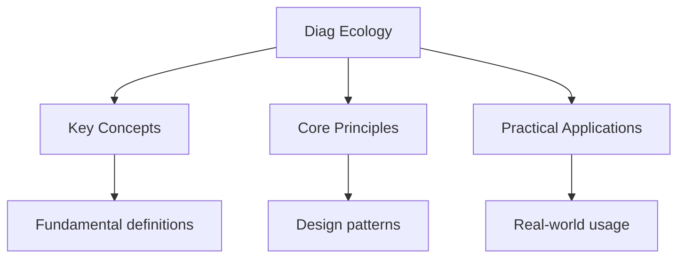

---

date: 2026-07-23T21:57:32+01:00
title: "Ecology -- Diagnostic Tests | IB"
description: "IB Biology Ecology -- Diagnostic Tests notes covering key definitions, core concepts, worked examples, and practice questions for structured preparation."
tableOfContents: false
---

<!-- Breadcrumb Schema for SEO -->

## Ecology — Diagnostic Tests

## Intuition

**Ecology is like studying a web of relationships — every organism is connected to others through food webs, competition, and symbiosis:** Ecosystems are dynamic systems where energy flows and nutrients cycle through interconnected communities

**Why it matters:** Ecology is essential for conservation, resource management, and understanding human impacts on the environment

**The key insight:** Ecosystems are dynamic systems where energy flows and nutrients cycle through interconnected communities

## Unit Tests

### UT-1: Energy Flow and Ecological Efficiency

**Question:** A lake receives $10000\ \text{kJ m}^{-2}\text{yr}^{-1}$ of solar radiation. The gross
primary productivity (GPP) of the phytoplankton is $2000\ \text{kJ m}^{-2}\text{yr}^{-1}$ and their
net primary productivity (NPP) is $1200\ \text{kJ m}^{-2}\text{yr}^{-1}$. Zooplankton consume
phytoplankton with 10% ecological efficiency. Small fish eat zooplankton with 15% efficiency.
Calculate: (a) the respiratory loss of the phytoplankton, (b) the energy available to the small
fish, (c) the percentage of incident solar energy captured as NPP.

**Solution:**

(a) Respiratory loss of phytoplankton:
$\text{GPP} - \text{NPP} = 2000 - 1200 = 800\ \text{kJ m}^{-2}\text{yr}^{-1}$.

This represents 40% of GPP lost to respiration.

(b) Energy flow:

- Phytoplankton NPP: $1200\ \text{kJ m}^{-2}\text{yr}^{-1}$
- Zooplankton receive (10% efficiency): $1200 \times 0.10 = 120\ \text{kJ m}^{-2}\text{yr}^{-1}$
- Small fish receive (15% efficiency): $120 \times 0.15 = 18\ \text{kJ m}^{-2}\text{yr}^{-1}$

(c) Percentage of incident solar energy captured as NPP: $\frac{1200}{10000} \times 100 = 12\%$.

Note: typical ecological efficiency is about 10%, and typical NPP as a fraction of incident solar
radiation is about 1--3% for most ecosystems. The 12% value in this question is higher than average
but within the range for highly productive aquatic systems.

---

<!-- Breadcrumb Schema for SEO -->

### UT-2: Carbon Cycle Calculations

**Question:** The atmosphere contains approximately $870\ \text{Gt}$ (gigatonnes) of carbon as
$\text{CO}_2$. Fossil fuel combustion releases approximately $9.5\ \text{Gt C yr}^{-1}$.
Deforestation releases approximately $1.5\ \text{Gt C yr}^{-1}$. The oceans absorb approximately
$2.5\ \text{Gt C yr}^{-1}$ and land vegetation absorbs approximately $3.0\ \text{Gt C yr}^{-1}$.
Calculate: (a) the net annual increase in atmospheric $\text{CO}_2$ in Gt C, (b) the percentage
increase per year, (c) the time for atmospheric carbon to double if these rates remain constant.

**Solution:**

(a) Total emissions: $9.5 + 1.5 = 11.0\ \text{Gt C yr}^{-1}$ Total absorption:
$2.5 + 3.0 = 5.5\ \text{Gt C yr}^{-1}$ Net annual increase: $11.0 - 5.5 = 5.5\ \text{Gt C yr}^{-1}$

(b) Percentage increase per year: $\frac{5.5}{870} \times 100 = 0.63\%\text{ yr}^{-1}$.

(c) For doubling: $\frac{870}{5.5} = 158$ years (using the simple linear approximation). More
precisely, using exponential growth: $870 \times e^{0.0063t} = 1740$So
$e^{0.0063t} = 2$, $t = \frac{\ln 2}{0.0063} = 110$ years.

The linear model gives 158 years and the exponential model gives 110 years. The exponential model is
more realistic because as atmospheric $\text{CO}_2$ increases, ocean absorption increases (but at a
diminishing rate due to ocean acidification), so the net accumulation rate actually increases over
time.

---

<!-- Breadcrumb Schema for SEO -->

### UT-3: Population Growth and Carrying Capacity

**Question:** A population of rabbits on an island follows logistic growth with carrying capacity
$K = 5000$ and intrinsic growth rate $r = 0.5\ \text{yr}^{-1}$. The current population is $N = 500$.
Calculate: (a) the current per capita growth rate, (b) the current population growth rate ($dN/dt$),
(c) the population size at which the growth rate is maximum.

**Solution:**

The logistic growth equation: $\frac{dN}{dt} = rN\left(1 - \frac{N}{K}\right)$

(a) Per capita growth rate:
$r\left(1 - \frac{N}{K}\right) = 0.5\left(1 - \frac{500}{5000}\right) = 0.5(1 - 0.1) = 0.5 \times 0.9 = 0.45\ \text{yr}^{-1}$.

When $N \ll K$The per capita growth rate is close to $r$. When $N$ approaches $K$It approaches zero.

(b) Population growth rate:
$\frac{dN}{dt} = 0.5 \times 500 \times 0.9 = 225\ \text{rabbits yr}^{-1}$.

(c) The population growth rate ($dN/dt$) is maximised when $N = K/2 = 2500$.

At this point:
$\frac{dN}{dt} = 0.5 \times 2500 \times (1 - 0.5) = 0.5 \times 2500 \times 0.5 = 625\ \text{rabbits yr}^{-1}$.

This is the maximum possible growth rate for this population under logistic growth. At $N = K/2$The
per capita growth rate is $r/2 = 0.25\ \text{yr}^{-1}$.

## Integration Tests

### IT-1: Nitrogen Cycle and Agriculture (with Molecular Biology)

**Question:** Explain the role of nitrogen-fixing bacteria in the nitrogen cycle, including the
biochemical pathway (name the enzyme and its co-factors). A farmer applies $150\ \text{kg ha}^{-1}$
of synthetic nitrogen fertiliser ($\text{NH}_4\text{NO}_3$). If only 50% of the applied nitrogen is
taken up by crops, 20% runs off into waterways, and the rest is lost to the atmosphere as
$\text{N}_2\text{O}$ or $\text{N}_2$ through denitrification, calculate: (a) the mass of nitrogen
taken up by crops, (b) the mass of nitrogen running off, (c) the mass of nitrogen lost to the
atmosphere.

**Solution:**

**Biochemical pathway:** Nitrogen-fixing bacteria (e.g., Rhizobium in root nodules of legumes, or
free-living Azotobacter) convert atmospheric $\text{N}_2$ to $\text{NH}_3$ (ammonia) through
biological nitrogen fixation. The enzyme responsible is **nitrogenase**, which catalyses:
$\text{N}_2 + 8\text{H}^+ + 8e^- + 16\text{ATP} \to 2\text{NH}_3 + \text{H}_2 + 16\text{ADP} + 16\text{P}_i$.

Nitrogenase is a complex of two proteins: the Fe protein (iron-sulphur protein) and the MoFe protein
(molybdenum-iron-sulphur protein). The enzyme is extremely oxygen-sensitive -- in root nodules,
leghaemoglobin maintains a low free $\text{O}_2$ concentration while still allowing sufficient
$\text{O}_2$ delivery for aerobic respiration.

**Calculations:**

Molar mass of $\text{NH}_4\text{NO}_3 = 14 + 4(1) + 14 + 3(16) = 80\ \text{g mol}^{-1}$.

Mass of nitrogen in $\text{NH}_4\text{NO}_3$: $2 \times 14 = 28\ \text{g}$ per $80\ \text{g}$ of
fertiliser. Nitrogen fraction $= 28/80 = 0.35 = 35\%$.

Total nitrogen applied: $150 \times 0.35 = 52.5\ \text{kg ha}^{-1}$.

(a) Nitrogen taken up by crops (50%): $52.5 \times 0.50 = 26.25\ \text{kg ha}^{-1}$. (b) Nitrogen
runoff (20%): $52.5 \times 0.20 = 10.5\ \text{kg ha}^{-1}$. (c) Nitrogen lost to atmosphere
(remaining 30%): $52.5 \times 0.30 = 15.75\ \text{kg ha}^{-1}$.

The atmospheric loss includes both $\text{N}_2\text{O}$ (a potent greenhouse gas, approximately 300
times the warming potential of $\text{CO}_2$ over 100 years) and $\text{N}_2$ (harmless). The
nitrogen runoff contributes to eutrophication of waterways.

---

<!-- Breadcrumb Schema for SEO -->

### IT-2: Ecosystem Productivity and Climate Change (with Evolution)

**Question:** Global warming is causing permafrost thawing in Arctic tundra, releasing large amounts
of organic carbon that was previously frozen. Explain how this could create a positive feedback loop
accelerating climate change. Use the concepts of gross and net primary productivity, decomposition
rates, and the carbon cycle.

**Solution:**

**Positive feedback mechanism:**

1. Permafrost contains an estimated 1500 Gt of organic carbon -- approximately twice the current
   atmospheric carbon content. This carbon was accumulated over thousands of years from slow-growing
   tundra vegetation but was frozen before it could fully decompose.

2. As global temperatures rise, the permafrost thaws, exposing this previously frozen organic matter
   to microbial decomposition. Decomposer organisms (bacteria and fungi) that were inactive at
   sub-zero temperatures become active.

3. Decomposition rate increases exponentially with temperature (approximately doubling for every
   $10\ ^\circ\text{C}$ increase, $\text{Q}_{10} \approx 2$). The thawed organic matter is
   decomposed aerobically (where $\text{O}_2$ is available), releasing $\text{CO}_2$Or anaerobically
   (in waterlogged soils), releasing $\text{CH}_4$ (methane), which has a global warming potential
   about 80 times that of $\text{CO}_2$ over 20 years.

4. The released $\text{CO}_2$ and $\text{CH}_4$ enter the atmosphere, enhancing the greenhouse
   effect and causing further warming.

5. Further warming causes more permafrost to thaw, releasing more greenhouse gases -- completing the
   positive feedback loop.

**GPP/NPP perspective:** In the tundra, GPP is limited by low temperatures and short growing
seasons. When the permafrost thaws, two competing effects occur:

- GPP may temporarily increase as the growing season lengthens and more plant species colonise the
  thawed ground.
- However, the massive increase in decomposition (heterotrophic respiration) far exceeds any
  increase in NPP. The ecosystem transitions from a weak carbon sink to a strong carbon source.

This is why climate models that include permafrost carbon feedback predict significantly more
warming than those that do not. The transition of permafrost from carbon store to carbon source is
one of the most concerning tipping points in the climate system.

---

<!-- Breadcrumb Schema for SEO -->

### IT-3: Biodiversity and Conservation (with Genetics)

**Question:** A nature reserve contains a population of 200 individuals of an endangered species.
Genetic analysis shows a heterozygosity of 0.08. Calculate the effective population size ($N_e$) if
the expected heterozygosity under Hardy-Weinberg equilibrium is 0.12. Explain why $N_e$ might be
lower than the census population size and discuss the implications for the species" long-term
survival.

**Solution:**

Under the genetic drift model, heterozygosity declines over generations:
$H_t = H_0\left(1 - \frac{1}{2N_e}\right)^t$.

We can estimate $N_e$ from the ratio of observed to expected heterozygosity. If the population has
been at size $N_e$ for many generations, the equilibrium heterozygosity under drift-mutation balance
is $H = \frac{4N_e\mu}{1 + 4N_e\mu}$.

Alternatively, a simpler approach: the ratio of observed to expected heterozygosity gives an
indication of inbreeding:

$F = 1 - \frac{H_{\text{obs}}}{H_{\text{exp}}} = 1 - \frac{0.08}{0.12} = 1 - 0.667 = 0.333$

This inbreeding coefficient indicates significant inbreeding. The effective population size can be
estimated from: $F \approx \frac{1}{2N_e}$ for a recently bottlenecked population, giving
$N_e \approx \frac{1}{2 \times 0.333} = 1.5$ -- but this is unrealistic.

A better approach uses the relationship between census size ($N$) and effective size for a
population at equilibrium:
$N_e = N \times \frac{H_{\text{obs}}}{H_{\text{exp}}} = 200 \times \frac{0.08}{0.12} = 133$.

$N_e$ is lower than $N = 200$ for several reasons:

- Unequal sex ratio (if one sex is less numerous, $N_e$ is reduced)
- Variance in reproductive success (if some individuals have many offspring and others have none,
  $N_e \ll N$)
- Fluctuating population size (bottlenecks reduce $N_e$ more than the current census size suggests)
- Overlapping generations

Implications for survival:

- A population with $N_e \approx 133$ is below the "50/500 rule": $N_e \gt 50$ is needed to avoid
  inbreeding depression in the short term, and $N_e \gt 500$ is needed for long-term evolutionary
  potential.
- Inbreeding depression may reduce fitness through expression of deleterious recessive alleles.
- Reduced genetic diversity limits the population's ability to adapt to environmental changes (e.g.,
  disease, climate change).
- The population may require genetic rescue (introduction of individuals from other populations) to
   increase $N_e$ and genetic diversity.

## Common Mistakes

**Confusing community with ecosystem:** A community is all living organisms in an area. An ecosystem includes the community PLUS the abiotic environment. Don't use them interchangeably.

**Forgetting that energy flows but nutrients cycle:** Energy enters as sunlight, flows through food chains, and exits as heat. Nutrients (carbon, nitrogen) cycle through ecosystems repeatedly.

**Mixing up primary and secondary succession:** Primary succession starts on bare rock (no soil). Secondary succession starts where soil already exists (after fire, farming). They have different pioneer species and timelines.

## Cross-References

- **[Cell Biology](../flashcards-cell-biology):** Cells are the basic units of life
- **[Genetics](../flashcards-genetics):** Genetics studies heredity and variation
- **[Ecology](diag-ecology):** Ecology studies organism-environment interactions
