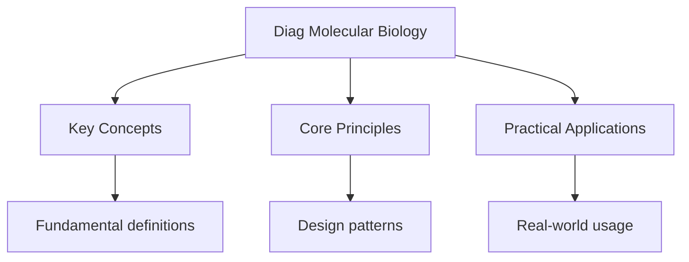

---

date: 2026-07-23T21:57:32+01:00
title: "Molecular Biology -- Diagnostic Tests"
description: "IB Molecular Biology -- Diagnostic Tests notes covering key definitions, core concepts, worked examples, and practice questions for structured preparation."
tableOfContents: false
---

<!-- Breadcrumb Schema for SEO -->

## Molecular Biology — Diagnostic Tests

## Intuition

**Molecular biology is like reverse-engineering life — understanding DNA, RNA, and proteins reveals how cells read and execute genetic instructions:** The central dogma (DNA → RNA → protein) describes how genetic information flows from storage to function

**Why it matters:** Molecular biology underpins biotechnology, genetic engineering, and understanding genetic diseases

**The key insight:** The central dogma (DNA → RNA → protein) describes how genetic information flows from storage to function

## Unit Tests

### UT-1: DNA Replication — Leading and Lagging Strand

**Question:** A bacterial chromosome is a circular DNA molecule of $4600000\ \text{bp}$ with a
single origin of replication. DNA polymerase III synthesises DNA at $1000\ \text{bp s}^{-1}$.
Calculate the minimum time required for replication. Explain why the lagging strand is synthesised
as Okazaki fragments and why this does not slow down the overall replication rate.

**Solution:**

With a single origin and bidirectional replication, two replication forks move in opposite
directions. Each fork must travel half the chromosome: $4600000 / 2 = 2300000\ \text{bp}$.

Time per fork: $2300000 / 1000 = 2300\ \text{s} \approx 38.3\ \text{min}$.

Since both forks operate simultaneously, minimum replication time
$= 2300\ \text{s} \approx 38\ \text{min}$.

The lagging strand is synthesised in the opposite direction to fork movement because DNA polymerase
can only add nucleotides in the 5" to 3' direction. As the replication fork opens, the template
strand for the lagging strand is oriented 3' to 5' (reading 5' to 3'), meaning synthesis must occur
away from the fork. Short Okazaki fragments ($1000$--$2000\ \text{bp}$ in bacteria,
$100$--$200\ \text{bp}$ in eukaryotes) are initiated by RNA primers and extended by DNA pol III.
Each fragment is later joined by DNA ligase.

This does not slow the overall rate because the overall fork movement rate is determined by the
leading strand synthesis speed. On the lagging strand, multiple Okazaki fragments are synthesised
concurrently by different DNA pol III enzymes. While one fragment is being completed, the next RNA
primer has already been laid down further back, so there is always a fragment being synthesised. The
overall rate of nucleotide incorporation on the lagging strand matches the fork movement rate.

---

<!-- Breadcrumb Schema for SEO -->

### UT-2: Transcription and Translation — Central Dogma

**Question:** The template strand of a gene has the sequence: 3'-TAC-AAA-TGC-CTA-GCA-5'. Write: (a)
the mRNA sequence, (b) the amino acid sequence using the genetic code, (c) the coding (sense) strand
DNA sequence, (d) what happens if a point mutation changes TGC to TGA in the template strand.

**Solution:**

(a) mRNA (synthesised 5' to 3', complementary to template): 5'-AUG-UUU-ACG-GAU-CGU-3'

(b) Amino acid sequence (reading codons from the mRNA):

- AUG = Methionine (Met, start codon)
- UUU = Phenylalanine (Phe)
- ACG = Threonine (Thr)
- GAU = Aspartic acid (Asp)
- CGU = Arginine (Arg)

Sequence: Met-Phe-Thr-Asp-Arg

(c) Coding (sense) strand is complementary to the template and identical to mRNA (with T instead of
U): 5'-ATG-AAA-TGC-CTA-GCA-3'

(d) If TGC changes to TGA in the template strand:

- The mRNA codon changes from ACG to ACU
- ACG = Threonine, ACU = Threonine
- This is a **silent mutation** -- the amino acid does not change because the genetic code is
  degenerate (multiple codons can code for the same amino acid).

Note: If the question had asked about TGC changing to TGG in the template, the mRNA would change
from ACG to ACC, which also codes for Thr -- also silent. However, if TGC changed to TTC in the
template, mRNA would change from ACG to AAG, which codes for Lys instead of Thr -- a **missense
mutation**.

---

<!-- Breadcrumb Schema for SEO -->

### UT-3: PCR and Gel Electrophoresis

**Question:** A DNA fragment of $1200\ \text{bp}$ is amplified by PCR starting from a single copy.
After 30 cycles, how many copies are produced? If each cycle takes 3 minutes, how long does the full
PCR run take? Explain why primers are necessary and why the annealing temperature must be carefully
chosen.

**Solution:**

After $n$ cycles, the theoretical number of copies is $2^n$ (assuming 100% efficiency).

After 30 cycles: $2^{30} = 1073741824 \approx 1.07 \times 10^9$ copies.

Total time: 30 cycles $\times$ 3 minutes/cycle $= 90$ minutes, plus the initial denaturation step (
2--5 minutes) and final extension (5--10 minutes). Total: approximately 97--105 minutes.

Primers are necessary because DNA polymerase cannot initiate synthesis de novo -- it can only extend
from a pre-existing 3'-OH group. Primers are short single-stranded DNA oligonucleotides ( 18--25
nucleotides) that are complementary to the regions flanking the target sequence. They provide the
free 3'-OH group that DNA polymerase needs to begin synthesis.

The annealing temperature must be carefully chosen because:

- If too low: primers may bind to non-target sequences (non-specific binding), producing unwanted
  amplification products. Primers may also bind to each other (primer-dimer formation).
- If too high: primers may not bind at all to the target, resulting in no amplification.
- The ideal annealing temperature is $3$--$5\ ^\circ\text{C}$ below the melting temperature ($T_m$)
  of the primers, where $T_m$ depends on primer length and GC content. For a 20-mer with 50% GC
  content, $T_m \approx 60\ ^\circ\text{C}$ So annealing at $55$--$57\ ^\circ\text{C}$ is
  appropriate.

## Integration Tests

### IT-1: Gene Expression and Enzymes (with Genetics)

**Question:** In lac operon regulation, explain how the presence of lactose and absence of glucose
leads to maximal transcription of the lac genes. Describe the roles of the lac repressor, cAMP, CAP,
and RNA polymerase. Why is this system considered an example of both negative and positive control?

**Solution:**

The lac operon contains three structural genes (lacZ, lacY, lacA) under the control of a single
promoter.

**Negative control (repressor):** In the absence of lactose, the lac repressor protein (encoded by
lacI) binds to the operator site, physically blocking RNA polymerase from transcribing the
structural genes. When lactose is present, it is converted to allolactose (by the basal level of
beta-galactosidase). Allolactose acts as an inducer by binding to the repressor, causing a
conformational change that reduces its affinity for the operator. The repressor dissociates,
removing the blockade.

**Positive control (CAP-cAMP):** When glucose is absent, intracellular cAMP levels rise. CAMP binds
to the catabolite activator protein (CAP), forming a CAP-cAMP complex that binds to a site upstream
of the promoter. This binding bends the DNA and facilitates the binding of RNA polymerase to the
promoter, increasing transcription efficiency approximately 50-fold.

**Combined effect:** When lactose is present AND glucose is absent:

1. The repressor is inactivated (lactose/allolactose bound), allowing RNA polymerase access to the
   promoter (negative control relieved).
2. The CAP-cAMP complex is bound, enhancing RNA polymerase binding and transcription initiation
   (positive control active).
3. Result: maximal transcription of lac genes -- up to 1000-fold increase over the basal level.

When both glucose and lactose are present: the repressor is inactive but cAMP is low, so CAP-cAMP
does not form. Transcription occurs at only a low basal level -- the cell prefers to metabolise
glucose first (catabolite repression).

When glucose is absent but lactose is also absent: CAP-cAMP is bound but the repressor blocks the
operator. No transcription occurs.

This dual control ensures the lac operon is only fully activated when the cell actually needs to
metabolise lactose (lactose present) and cannot use a preferred carbon source (glucose absent).

---

<!-- Breadcrumb Schema for SEO -->

### IT-2: DNA Technology and Ethics (with Human Physiology)

**Question:** CRISPR-Cas9 gene editing uses a guide RNA (gRNA) to direct the Cas9 nuclease to a
specific DNA sequence. Explain the mechanism of CRISPR-Cas9, including the role of the PAM sequence.
Discuss two potential therapeutic applications and two ethical concerns specific to germline
editing.

**Solution:**

**Mechanism:** The CRISPR-Cas9 system has two key components: (1) the Cas9 endonuclease enzyme,
which cuts double-stranded DNA, and (2) a single guide RNA (sgRNA), which is a chimeric RNA
combining the crRNA (targeting sequence) and tracrRNA (Cas9-binding sequence).

The sgRNA contains a 20-nucleotide sequence complementary to the target DNA. When the sgRNA binds to
Cas9, the complex scans the genome for sequences complementary to the guide RNA that are also
adjacent to a PAM (Protospacer Adjacent Motif) sequence. The PAM is a short 2--6 bp sequence
(5'-NGG-3' for Streptococcus pyogenes Cas9) that is required for Cas9 binding and cleavage.

Once the correct target is found, Cas9 creates a double-strand break (DSB) 3 bp upstream of the PAM.
The cell repairs the DSB by one of two pathways:

- Non-homologous end joining (NHEJ): error-prone, often introduces insertions/deletions (indels)
  that can knock out a gene.
- Homology-directed repair (HDR): if a donor DNA template is provided, precise edits can be made.

**Therapeutic applications:**

1. Sickle cell disease: editing the HBB gene in haematopoietic stem cells to correct the Glu6Val
   mutation or reactivate fetal haemoglobin (HbF) production.
2. Inherited retinal diseases: delivering CRISPR components to retinal cells to correct mutations in
   genes like RPE65 (Leber congenital amaurosis).

**Ethical concerns with germline editing:**

1. Heritability: germline edits are passed to all future generations, making it impossible to obtain
   consent from affected descendants. Unintended consequences (off-target mutations) would propagate
   through the gene pool.
2. Enhancement vs therapy: germline editing could be used for non-therapeutic enhancement (e.g.,
   intelligence, physical traits), raising concerns about eugenics, social inequality, and the
   definition of "normal" human traits.

---

<!-- Breadcrumb Schema for SEO -->

### IT-3: Protein Structure and Function (with Biochemistry)

**Question:** Haemoglobin has a quaternary structure of four subunits (two alpha, two beta), each
containing a haem group with an $\text{Fe}^{2+}$ ion that binds one $\text{O}_2$ molecule. Explain
cooperative oxygen binding using the concepts of protein conformational change. How does the Bohr
effect enhance oxygen delivery to active tissues?

**Solution:**

**Cooperative binding:** Haemoglobin exists in two main conformational states: the T-state (tense,
deoxygenated) with low affinity for $\text{O}_2$ And the R-state (relaxed, oxygenated) with high
affinity for $\text{O}_2$.

When the first $\text{O}_2$ molecule binds to a haem group in one subunit, it causes a
conformational change in that subunit (the iron ion moves into the plane of the porphyrin ring,
pulling the proximal histidine and shifting the position of the entire F helix). This conformational
change is transmitted to the adjacent subunits through non-covalent interactions at the subunit
interfaces (salt bridges between the C-termini of the subunits are broken in the T to R transition).

The shift from T to R state increases the $\text{O}_2$ affinity of the remaining subunits, making it
progressively easier for subsequent $\text{O}_2$ molecules to bind. This produces the characteristic
sigmoidal oxygen dissociation curve, which is steeper in the middle range of partial pressures than
the hyperbolic curve of myoglobin (which has only one subunit and no cooperativity).

**Bohr effect:** In active tissues, $\text{CO}_2$ is produced and converted to carbonic acid
($\text{H}_2\text{CO}_3$), which dissociates to $\text{H}^+$ and $\text{HCO}_3^-$. The increased
$[\text{H}^+]$ (lower pH) stabilises the T-state of haemoglobin by promoting the formation of salt
bridges that lock it in the low-affinity conformation. Additionally, $\text{CO}_2$ can directly bind
to the N-terminal amino groups of the globin chains, forming carbaminohaemoglobin, which also
stabilises the T-state.

The combined effect: at lower pH and higher $\text{CO}_2$ (as found in actively respiring tissues),
the oxygen dissociation curve shifts to the right. At any given partial pressure of
$\text{O}_2$Haemoglobin releases more $\text{O}_2$. This ensures that oxygen delivery is matched to
metabolic demand -- tissues that are respiring most actively receive the most oxygen.

## Cross-References

- **[Cell Biology](../flashcards-cell-biology):** Cells are the basic units of life
- **[Genetics](../flashcards-genetics):** Genetics studies heredity and variation
- **[Ecology](diag-ecology):** Ecology studies organism-environment interactions
