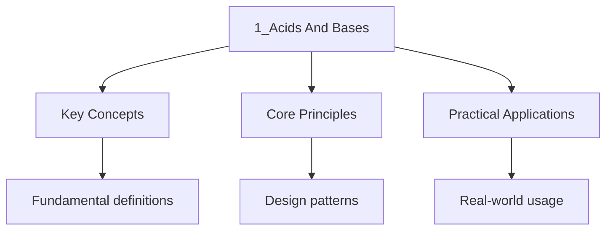

---

title: "Acids and Bases | IB - Wyatt's Notes"
description: "Rigorous IB chemistry notes covering Acids and Bases. Includes definitions, derivations, worked examples, and exam-style problems. buffers, titrations,"
date: 2024-01-01T00:00:00Z
tags:
  - IB
categories:
  - ib
---

<!-- Breadcrumb Schema for SEO -->

## Intuition

**Acids and bases are like chemical opposites that neutralize each other — protons (H⁺) are transferred from acid to base:** The pH scale provides a logarithmic measure of hydrogen ion concentration, governing chemical and biological processes

**Why it matters:** Acid-base chemistry is fundamental to buffer systems, titrations, and biological homeostasis

**The key insight:** The pH scale provides a logarithmic measure of hydrogen ion concentration, governing chemical and biological processes

## Bronsted-Lowry Theory

### Definitions

- **Acid:** A proton ($\mathrm{H}^+$) donor.
- **Base:** A proton ($\mathrm{H}^+$) acceptor.

### Conjugate Acid-Base Pairs

When an acid donates a proton, the remaining species is its **conjugate base**. When a base accepts
A proton, the resulting species is its **conjugate acid**.

$$
\mathrm{HA} + \mathrm{H}_2\mathrm{O} \rightleftharpoons \mathrm{H}_3\mathrm{O}^+ + \mathrm{A}^-
$$

| Left side     | Right side                  |
| ------------- | --------------------------- |
| HA (acid)     | A$^-$ (conjugate base)      |
| H$_2$O (base) | H$_3$O$^+$ (conjugate acid) |

**Key relationship:** The stronger the acid, the weaker its conjugate base, and vice versa.

### Strong vs Weak Acids and Bases

| Property                  | Strong Acid/Base                | Weak Acid/Base                   |
| ------------------------- | ------------------------------- | -------------------------------- |
| Dissociation              | Complete (100%)                 | Partial (equilibrium)            |
| Equilibrium               | Lies far to the right           | Lies to the left                 |
| Conductivity              | High                            | Low                              |
| pH (same conc.)           | Lower (acid) / Higher (base)    | Less extreme                     |
| Reaction rate with metals | Faster                          | Slower                           |
| Examples (acids)          | HCl, HNO$_3$H$_2$SO$_4$HClO$_4$ | CH$_3$COOH, HF, HCN, H$_2$CO$_3$ |
| Examples (bases)          | NaOH, KOH, Ba(OH)$_2$           | NH$_3$CH$_3$COO$^-$CO$_3^{2-}$   |

:::caution
<strong>Exam Tip H$_2$SO$_4$ is a diprotic acid. The first dissociation is complete (strong),</strong>
But the second dissociation is partial (weak):
$\mathrm{HSO}_4^- \rightleftharpoons \mathrm{H}^+ + \mathrm{SO}_4^{2-}$ with
$K_a \approx 1.0 \times 10^{-2}$.
:::
---

<!-- Breadcrumb Schema for SEO -->

## pH and pOH Scales

### Definitions

$$
\mathrm{pH} = -\log[\mathrm{H}^+]
$$

$$
\mathrm{pOH} = -\log[\mathrm{OH}^-]
$$

### Relationship

At $25\degree\mathrm{C}$:

$$
\mathrm{pH} + \mathrm{pOH} = 14
$$

$$
[\mathrm{H}^+][\mathrm{OH}^-] = K_w = 1.0 \times 10^{-14}
$$

### pH Scale

| pH  | Nature          | [H$^+$] (mol/L)       |
| --- | --------------- | --------------------- |
| 0   | Strongly acidic | $1.0 \times 10^0$     |
| 1   |                 | $1.0 \times 10^{-1}$  |
| 3   |                 | $1.0 \times 10^{-3}$  |
| 7   | Neutral         | $1.0 \times 10^{-7}$  |
| 11  |                 | $1.0 \times 10^{-11}$ |
| 14  | Strongly basic  | $1.0 \times 10^{-14}$ |

Worked Example 1: pH of a Strong Acid

Calculate the pH of $0.050\mathrm{ mol/L}$ HCl.

HCl is a strong acid and dissociates completely:

$$
[\mathrm{H}^+] = 0.050\mathrm{ mol/L}
$$

$$
\mathrm{pH} = -\log(0.050) = -\log(5.0 \times 10^{-2}) = 2 - \log 5.0 = 2 - 0.699 = 1.30
$$

Worked Example 2: pH of a Strong Base

Calculate the pH of $0.020\mathrm{ mol/L}$ NaOH at $25\degree\mathrm{C}$.

NaOH is a strong base:

$$
[\mathrm{OH}^-] = 0.020\mathrm{ mol/L}
$$

$$
\mathrm{pOH} = -\log(0.020) = -\log(2.0 \times 10^{-2}) = 2 - \log 2.0 = 2 - 0.301 = 1.70
$$

$$
\mathrm{pH} = 14 - 1.70 = 12.30
$$

Worked Example 3: pH of a Diprotic Strong Acid

Calculate the pH of $0.010\mathrm{ mol/L}$ H$_2$SO$_4$.

Since the first dissociation of H$_2$SO$_4$ is complete:

$$
\mathrm{H}_2\mathrm{SO}_4 \to \mathrm{H}^+ + \mathrm{HSO}_4^-
$$

Each mole of H$_2$SO$_4$ gives 1 mole of H$^+$ from the first dissociation. At this concentration,
The second dissociation contributes additional H$^+$ But for most IB exam questions, it is Acceptable
to consider only the first dissociation unless told otherwise:

$$
[\mathrm{H}^+] \approx 0.010\mathrm{ mol/L}
$$

$$
\mathrm{pH} = -\log(0.010) = 2.00
$$

If the second dissociation is considered (with $K_{a2} = 1.0 \times 10^{-2}$):

Let $x$ be the additional [$\mathrm{H}^+$] from the second dissociation:

$$
K_{a2} = \frac{[\mathrm{H}^+][\mathrm{SO}_4^{2-}]}{[\mathrm{HSO}_4^-]} = \frac{(0.010 + x)(x)}{0.010 - x} = 1.0 \times 10^{-2}
$$

This gives $x \approx 0.0045$ So $[\mathrm{H}^+] \approx 0.0145$ and $\mathrm{pH} \approx 1.84$.

---

<!-- Breadcrumb Schema for SEO -->

## Ka and Kb Expressions

### Acid Dissociation Constant

For a weak acid $\mathrm{HA}$:

$$
\mathrm{HA} \rightleftharpoons \mathrm{H}^+ + \mathrm{A}^-
$$

$$
K_a = \frac{[\mathrm{H}^+][\mathrm{A}^-]}{[\mathrm{HA}]}
$$

### Base Dissociation Constant

For a weak base $\mathrm{B}$:

$$
\mathrm{B} + \mathrm{H}_2\mathrm{O} \rightleftharpoons \mathrm{BH}^+ + \mathrm{OH}^-
$$

$$
K_b = \frac{[\mathrm{BH}^+][\mathrm{OH}^-]}{[\mathrm{B}]}
$$

### Relationship Between Ka and Kb

For a conjugate acid-base pair:

$$
K_a \times K_b = K_w = 1.0 \times 10^{-14}
$$

$$
\mathrm{p}K_a + \mathrm{p}K_b = 14
$$

Where $\mathrm{p}K_a = -\log K_a$.

### Common Ka Values at $25\degree\mathrm{C}$

| Acid           | Ka                    | pKa  |
| -------------- | --------------------- | ---- |
| CH$_3$COOH     | $1.8 \times 10^{-5}$  | 4.74 |
| HCOOH (formic) | $1.8 \times 10^{-4}$  | 3.74 |
| HCN            | $6.2 \times 10^{-10}$ | 9.21 |
| HF             | $6.8 \times 10^{-4}$  | 3.17 |
| HNO$_2$        | $4.5 \times 10^{-4}$  | 3.35 |
| NH$_4^+$       | $5.6 \times 10^{-10}$ | 9.25 |

Worked Example 4: pH of a Weak Acid

Calculate the pH of $0.100\mathrm{ mol/L}$ CH$_3$COOH ($K_a = 1.8 \times 10^{-5}$).

$$
\mathrm{CH}_3\mathrm{COOH} \rightleftharpoons \mathrm{H}^+ + \mathrm{CH}_3\mathrm{COO}^-
$$

ICE table (initial, change, equilibrium):

| Species       | [Initial] | Change | [Equilibrium] |
| ------------- | --------- | ------ | ------------- |
| CH$_3$COOH    | 0.100     | $-x$   | $0.100 - x$   |
| H$^+$         | 0         | $+x$   | $x$           |
| CH$_3$COO$^-$ | 0         | $+x$   | $x$           |

$$
K_a = \frac{x^2}{0.100 - x} = 1.8 \times 10^{-5}
$$

Check the $5\%$ rule:
$\frac{K_a}{c} = \frac{1.8 \times 10^{-5}}{0.100} = 1.8 \times 10^{-4} \lt 0.05$. The approximation
$0.100 - x \approx 0.100$ is valid.

$$
X^2 = 1.8 \times 10^{-6}
$$

$$
X = \sqrt{1.8 \times 10^{-6}} = 1.34 \times 10^{-3}\mathrm{ mol/L}
$$

$$
\mathrm{pH} = -\log(1.34 \times 10^{-3}) = 2.87
$$

Worked Example 5: pH of a Weak Base

Calculate the pH of $0.150\mathrm{ mol/L}$ NH$_3$ ($K_b = 1.8 \times 10^{-5}$) at
$25\degree\mathrm{C}$.

$$
\mathrm{NH}_3 + \mathrm{H}_2\mathrm{O} \rightleftharpoons \mathrm{NH}_4^+ + \mathrm{OH}^-
$$

| Species  | [Initial] | Change | [Equilibrium] |
| -------- | --------- | ------ | ------------- |
| NH$_3$   | 0.150     | $-x$   | $0.150 - x$   |
| NH$_4^+$ | 0         | $+x$   | $x$           |
| OH$^-$   | 0         | $+x$   | $x$           |

$$
K_b = \frac{x^2}{0.150 - x} = 1.8 \times 10^{-5}
$$

Approximation valid: $\frac{K_b}{c} = 1.2 \times 10^{-4} \lt 0.05$.

$$
X^2 = 0.150 \times 1.8 \times 10^{-5} = 2.7 \times 10^{-6}
$$

$$
X = \sqrt{2.7 \times 10^{-6}} = 1.64 \times 10^{-3}\mathrm{ mol/L} = [\mathrm{OH}^-]
$$

$$
\mathrm{pOH} = -\log(1.64 \times 10^{-3}) = 2.78
$$

$$
\mathrm{pH} = 14 - 2.78 = 11.22
$$

---

<!-- Breadcrumb Schema for SEO -->

## Kw (Ionic Product of Water)

Water undergoes autoionisation:

$$
\mathrm{H}_2\mathrm{O}(l) \rightleftharpoons \mathrm{H}^+(aq) + \mathrm{OH}^-(aq)
$$

$$
K_w = [\mathrm{H}^+][\mathrm{OH}^-]
$$

At $25\degree\mathrm{C}$: $K_w = 1.0 \times 10^{-14}$ (mol$^2$/L$^2$).

$K_w$ is **temperature dependent**:

| Temperature ($\degree$C) | $K_w$                  |
| ------------------------ | ---------------------- |
| 0                        | $1.14 \times 10^{-15}$ |
| 25                       | $1.00 \times 10^{-14}$ |
| 50                       | $5.48 \times 10^{-14}$ |
| 100                      | $5.13 \times 10^{-13}$ |

:::caution
<strong>Exam Tip At $50\degree\mathrm{C}$Pure water has $\mathrm{pH} = 6.63$ (not 7). This is</strong>
Because $K_w$ is larger, so $[\mathrm{H}^+] = [\mathrm{OH}^-] = \sqrt{K_w} \gt 10^{-7}$. The water
Is still **neutral** because $[\mathrm{H}^+] = [\mathrm{OH}^-]$. Neutral does not always mean pH =
7; on temperature.
:::
---

<!-- Breadcrumb Schema for SEO -->

## Polyprotic Acids

A polyprotic acid can donate more than one proton. Each dissociation has its own $K_a$ value.

**Carbonic acid (H$_2$CO$_3$):**

$$
\mathrm{H}_2\mathrm{CO}_3 \rightleftharpoons \mathrm{H}^+ + \mathrm{HCO}_3^- \quad K_{a1} = 4.3 \times 10^{-7}
$$

$$
\mathrm{HCO}_3^- \rightleftharpoons \mathrm{H}^+ + \mathrm{CO}_3^{2-} \quad K_{a2} = 4.8 \times 10^{-11}
$$

**Phosphoric acid (H$_3$PO$_4$):**

$$
\mathrm{H}_3\mathrm{PO}_4 \rightleftharpoons \mathrm{H}^+ + \mathrm{H}_2\mathrm{PO}_4^- \quad K_{a1} = 7.5 \times 10^{-3}
$$

$$
\mathrm{H}_2\mathrm{PO}_4^- \rightleftharpoons \mathrm{H}^+ + \mathrm{HPO}_4^{2-} \quad K_{a2} = 6.2 \times 10^{-8}
$$

$$
\mathrm{HPO}_4^{2-} \rightleftharpoons \mathrm{H}^+ + \mathrm{PO}_4^{3-} \quad K_{a3} = 4.2 \times 10^{-13}
$$

**General rule:** $K_{a1} \gg K_{a2} \gg K_{a3}$. Each successive proton is harder to remove because
Removing a proton from an increasingly negative ion requires more energy.

---

<!-- Breadcrumb Schema for SEO -->

## Indicators

### Common Acid-Base Indicators

| Indicator           | Colour (Acid) | Transition pH Range | Colour (Base)  |
| ------------------- | ------------- | ------------------- | -------------- |
| Methyl orange       | Red           | 3.1 -- 4.4          | Yellow         |
| Bromothymol blue    | Yellow        | 6.0 -- 7.6          | Blue           |
| Phenolphthalein     | Colourless    | 8.3 -- 10.0         | Pink/Magenta   |
| Universal indicator | Red (pH 1)    | Full range 1--14    | Violet (pH 14) |

### How Indicators Work

Indicators are weak organic acids (HIn) where the acid form and conjugate base form have different
Colours:

$$
\mathrm{HIn} \rightleftharpoons \mathrm{H}^+ + \mathrm{In}^-
$$

The colour observed depends on the ratio $[\mathrm{HIn}]/[\mathrm{In}^-]$Which depends on [H$^+$]
(pH).

### Choosing an Indicator for a Titration

An indicator is suitable when its transition range overlaps with the **equivalence point** of the
Titration (where pH changes most steeply).

| Titration Type             | Equivalence Point pH | Suitable Indicator                               |
| -------------------------- | -------------------- | ------------------------------------------------ |
| Strong acid -- strong base | pH = 7               | Bromothymol blue, phenolphthalein, methyl orange |
| Weak acid -- strong base   | pH \gt 7             | Phenolphthalein                                  |
| Strong acid -- weak base   | pH \lt 7             | Methyl orange                                    |

---

<!-- Breadcrumb Schema for SEO -->

## pH Curves for Titrations

### Strong Acid -- Strong Base

Example: HCl + NaOH

- Initial pH: low (strong acid).
- pH rises slowly, then **sharply** near the equivalence point (pH = 7).
- Beyond equivalence point: pH approaches 14 (excess strong base).

### Weak Acid -- Strong Base

Example: CH$_3$COOH + NaOH

- Initial pH: higher than strong acid at same concentration (partial dissociation).
- Buffer region: gradual pH rise before the equivalence point.
- Equivalence point: pH \gt 7 (conjugate base of weak acid hydrolyses).
- Suitable indicator: phenolphthalein.

### Strong Acid -- Weak Base

Example: HCl + NH$_3$

- Initial pH: low (strong acid).
- Equivalence point: pH \lt 7 (conjugate acid of weak base hydrolyses).
- Suitable indicator: methyl orange.

### Key Features of pH Curves

- **Equivalence point:** The volume where stoichiometrically equivalent amounts of acid and base
  have reacted. The pH at this point depends on the salt formed.
- **Half-equivalence point:** The volume where half the acid/base has been neutralised. At this
  point, $\mathrm{pH} = \mathrm{p}K_a$ (for weak acid titrations), because
  $[\mathrm{HA}] = [\mathrm{A}^-]$.

---

<!-- Breadcrumb Schema for SEO -->

## Buffer Solutions

### Composition

A buffer solution **resists changes in pH** when small amounts of acid or base are added. It
Consists of:

1. A weak acid and its conjugate base, **or**
2. A weak base and its conjugate acid.

**Examples:**

- CH$_3$COOH / CH$_3$COONa$^-$ (acetic acid / acetate)
- NH$_3$ / NH$_4$Cl (ammonia / ammonium)
- H$_2$CO$_3$ / HCO$_3^-$ (carbonic acid / bicarbonate -- the blood buffer system)

### Mechanism

**Adding acid (H$^+$):** The conjugate base (A$^-$) reacts with the added H$^+$:

$$
\mathrm{A}^- + \mathrm{H}^+ \to \mathrm{HA}
$$

**Adding base (OH$^-$):** The weak acid (HA) reacts with the added OH$^-$:

$$
\mathrm{HA} + \mathrm{OH}^- \to \mathrm{A}^- + \mathrm{H}_2\mathrm{O}
$$

In both cases, the ratio $[\mathrm{HA}]/[\mathrm{A}^-]$ changes only slightly, so pH remains nearly
Constant.

### Henderson-Hasselbalch Equation

$$
\mathrm{pH} = \mathrm{p}K_a + \log\frac{[\mathrm{A}^-]}{[\mathrm{HA}]}
$$

Or equivalently:

$$
\mathrm{pH} = \mathrm{p}K_a + \log\frac{[\mathrm{base}]}{[\mathrm{acid}]}
$$

### Buffer Capacity

Buffer capacity is the amount of acid or base that can be added before the pH changes significantly.
A buffer is most effective when:

- The concentrations of the weak acid and conjugate base are **large** (more moles available to
  react).
- The ratio $[\mathrm{A}^-]/[\mathrm{HA}]$ is **close to 1** (i.e., pH is close to p$K_a$).

The effective buffer range is approximately $\mathrm{p}K_a \pm 1$.

Worked Example 6: Buffer pH Calculation

Calculate the pH of a buffer solution containing $0.200\mathrm{ mol/L}$ CH$_3$COOH and
$0.150\mathrm{ mol/L}$ CH$_3$COONa. ($K_a = 1.8 \times 10^{-5}$P$K_a = 4.74$)

Using the Henderson-Hasselbalch equation:

$$
\mathrm{pH} = 4.74 + \log\frac{0.150}{0.200}
$$

$$
\mathrm{pH} = 4.74 + \log(0.750)
$$

$$
\mathrm{pH} = 4.74 + (-0.125) = 4.62
$$

Worked Example 7: pH Change When Adding Acid to a Buffer

To $500\mathrm{ mL}$ of the buffer from Worked Example 6, $0.010\mathrm{ mol}$ of HCl is added.
Calculate the new pH.

Initial moles:

- $n(\mathrm{CH}_3\mathrm{COOH}) = 0.200 \times 0.500 = 0.100\mathrm{ mol}$
- $n(\mathrm{CH}_3\mathrm{COO}^-) = 0.150 \times 0.500 = 0.075\mathrm{ mol}$

Adding $0.010\mathrm{ mol}$ HCl:

- HCl reacts with CH$_3$COO$^-$:
  $\mathrm{CH}_3\mathrm{COO}^- + \mathrm{H}^+ \to \mathrm{CH}_3\mathrm{COOH}$
- $n(\mathrm{CH}_3\mathrm{COO}^-) = 0.075 - 0.010 = 0.065\mathrm{ mol}$
- $n(\mathrm{CH}_3\mathrm{COOH}) = 0.100 + 0.010 = 0.110\mathrm{ mol}$

$$
\mathrm{pH} = 4.74 + \log\frac{0.065}{0.110}
$$

$$
\mathrm{pH} = 4.74 + \log(0.591) = 4.74 + (-0.228) = 4.51
$$

The pH changed from 4.62 to 4.51, a change of only 0.11 units, demonstrating the buffer"s
Effectiveness.

Worked Example 8: Preparing a Buffer

What mass of sodium acetate (CH$_3$COONa, $M_r = 82.0\mathrm{ g/mol}$) must be added to
$1.00\mathrm{ L}$ of $0.100\mathrm{ mol/L}$ CH$_3$COOH to produce a buffer with pH = 5.00?
($K_a = 1.8 \times 10^{-5}$)

Using the Henderson-Hasselbalch equation:

$$
5.00 = 4.74 + \log\frac{[\mathrm{CH}_3\mathrm{COO}^-]}{0.100}
$$

$$
\log\frac{[\mathrm{CH}_3\mathrm{COO}^-]}{0.100} = 0.26
$$

$$
\frac{[\mathrm{CH}_3\mathrm{COO}^-]}{0.100} = 10^{0.26} = 1.82
$$

$$
[\mathrm{CH}_3\mathrm{COO}^-] = 0.182\mathrm{ mol/L}
$$

In $1.00\mathrm{ L}$:

$$
N(\mathrm{CH}_3\mathrm{COONa}) = 0.182\mathrm{ mol}
$$

$$
M = n \times M_r = 0.182 \times 82.0 = 14.9\mathrm{ g}
$$

---

<!-- Breadcrumb Schema for SEO -->

## Acid-Base Titrations

### Titration Calculations

At the equivalence point, moles of acid = moles of base.

**Strong acid -- strong base:**

$$
\mathrm{H}^+ + \mathrm{OH}^- \to \mathrm{H}_2\mathrm{O}
$$

PH at equivalence point = 7 (neutral salt).

**Weak acid -- strong base:**

$$
\mathrm{HA} + \mathrm{OH}^- \to \mathrm{A}^- + \mathrm{H}_2\mathrm{O}
$$

The conjugate base A$^-$ hydrolyses:

$$
\mathrm{A}^- + \mathrm{H}_2\mathrm{O} \rightleftharpoons \mathrm{HA} + \mathrm{OH}^-
$$

PH at equivalence point \gt 7.

**Strong acid -- weak base:**

$$
\mathrm{H}^+ + \mathrm{B} \to \mathrm{BH}^+
$$

The conjugate acid BH$^+$ hydrolyses:

$$
\mathrm{BH}^+ + \mathrm{H}_2\mathrm{O} \rightleftharpoons \mathrm{B} + \mathrm{H}_3\mathrm{O}^+
$$

PH at equivalence point \lt 7.

Worked Example 9: Titration of Weak Acid with Strong Base

$25.0\mathrm{ mL}$ of $0.100\mathrm{ mol/L}$ CH$_3$COOH ($K_a = 1.8 \times 10^{-5}$) is titrated
With $0.100\mathrm{ mol/L}$ NaOH. Calculate the pH at the equivalence point.

At the equivalence point, moles of NaOH = moles of CH$_3$COOH:

$$
N = 0.100 \times 0.0250 = 0.00250\mathrm{ mol}
$$

Volume of NaOH required:

$$
V = \frac{0.00250}{0.100} = 0.0250\mathrm{ L} = 25.0\mathrm{ mL}
$$

Total volume at equivalence point: $25.0 + 25.0 = 50.0\mathrm{ mL} = 0.0500\mathrm{ L}$.

All CH$_3$COOH has been converted to CH$_3$COO$^-$:

$$
[\mathrm{CH}_3\mathrm{COO}^-] = \frac{0.00250}{0.0500} = 0.0500\mathrm{ mol/L}
$$

The acetate ion hydrolyses:

$$
K_b = \frac{K_w}{K_a} = \frac{1.0 \times 10^{-14}}{1.8 \times 10^{-5}} = 5.56 \times 10^{-10}
$$

$$
[\mathrm{OH}^-] = \sqrt{K_b \times [\mathrm{CH}_3\mathrm{COO}^-]} = \sqrt{5.56 \times 10^{-10} \times 0.0500}
$$

$$
[\mathrm{OH}^-] = \sqrt{2.78 \times 10^{-11}} = 5.27 \times 10^{-6}\mathrm{ mol/L}
$$

$$
\mathrm{pOH} = -\log(5.27 \times 10^{-6}) = 5.28
$$

$$
\mathrm{pH} = 14 - 5.28 = 8.72
$$

Worked Example 10: pH at Half-Equivalence Point

Using the titration from Worked Example 9, calculate the pH when $12.5\mathrm{ mL}$ of NaOH has been
Added (half-equivalence point).

At half-equivalence point, half the acid has been neutralised:

$$
N(\mathrm{NaOH}) = 0.100 \times 0.0125 = 0.00125\mathrm{ mol}
$$

Moles of CH$_3$COOH remaining: $0.00250 - 0.00125 = 0.00125\mathrm{ mol}$

Moles of CH$_3$COO$^-$ formed: $0.00125\mathrm{ mol}$

Since $[\mathrm{HA}] = [\mathrm{A}^-]$:

$$
\mathrm{pH} = \mathrm{p}K_a = -\log(1.8 \times 10^{-5}) = 4.74
$$

This is a general result: at the half-equivalence point, $\mathrm{pH} = \mathrm{p}K_a$.

---

<!-- Breadcrumb Schema for SEO -->

## Common Pitfalls

1. **Strong vs weak acid pH:** A $0.10\mathrm{ mol/L}$ strong acid has pH = 1.0, but a
   $0.10\mathrm{ mol/L}$ weak acid has pH \gt 1.0 ( 2--3) because it only partially dissociates. Do
   not assume $[\mathrm{H}^+] = c$ for weak acids.

2. **Diprotic acid contribution:** H$_2$SO$_4$ gives 2 H$^+$ per molecule, but H$_2$CO$_3$ does not
   give 2 H$^+$ at normal concentrations because $K_{a2}$ is very small. Only the first dissociation
   contributes significantly.

3. **pH + pOH = 14 only at $25\degree\mathrm{C}$:** At other temperatures, use the actual $K_w$
   value. $\mathrm{pH} + \mathrm{pOH} = \mathrm{p}K_w$.

4. **Buffer range:** A buffer is only effective within $\pm 1$ pH unit of its p$K_a$. Outside this
   range, the buffer capacity is essentially zero.

5. **Equivalence point pH:** For weak acid -- strong base titrations, the equivalence point pH is
   \gt 7, not 7. For strong acid -- weak base, it is \lt 7.

6. **Henderson-Hasselbalch validity:** The equation assumes that the concentrations of HA and A$^-$
   are much larger than $[\mathrm{H}^+]$ and $[\mathrm{OH}^-]$. It is not valid for very dilute
   solutions.

7. **Neutral pH:** Neutral means $[\mathrm{H}^+] = [\mathrm{OH}^-]$Which equals pH = 7 only at
   $25\degree\mathrm{C}$. At $50\degree\mathrm{C}$Neutral pH is approximately 6.63.

8. **$K_a$ and $K_b$ relationship:** Remember $K_a \times K_b = K_w$. This connects a conjugate
   acid-base pair. The conjugate base of a weak acid has a calculable $K_b$.

9. **Titration indicator choice:** Methyl orange (3.1--4.4) is suitable for strong acid -- weak base
   titrations (equivalence pH \lt 7). Phenolphthalein (8.3--10.0) is suitable for weak acid --
   strong base (equivalence pH \gt 7). Do not use methyl orange for weak acid -- strong base.

10. **Units in Ka/Kb:** Concentrations in $K_a$ and $K_b$ expressions are in mol/L. The units of
    $K_a$ and $K_b$ are mol/L. $K_w$ has units of mol$^2$/L$^2$.

---

<!-- Breadcrumb Schema for SEO -->

## Practice Problems

Question 1: Strong Acid/Base pH

(a) Calculate the pH of $0.0030\mathrm{ mol/L}$ HNO$_3$.

(b) Calculate the pH of $0.0025\mathrm{ mol/L}$ Ca(OH)$_2$ at $25\degree\mathrm{C}$.

(c) A solution has pH = 3.40. What is $[\mathrm{H}^+]$?

Answer:

(a) HNO$_3$ is a strong monoprotic acid:

$$
[\mathrm{H}^+] = 0.0030\mathrm{ mol/L}
$$

$$
\mathrm{pH} = -\log(3.0 \times 10^{-3}) = 3 - \log 3.0 = 3 - 0.477 = 2.52
$$

(b) Ca(OH)$_2$ is a strong base giving 2 OH$^-$ per formula unit:

$$
[\mathrm{OH}^-] = 2 \times 0.0025 = 0.0050\mathrm{ mol/L}
$$

$$
\mathrm{pOH} = -\log(5.0 \times 10^{-3}) = 3 - \log 5.0 = 3 - 0.699 = 2.30
$$

$$
\mathrm{pH} = 14 - 2.30 = 11.70
$$

(c)

$$
[\mathrm{H}^+] = 10^{-\mathrm{pH}} = 10^{-3.40} = 3.98 \times 10^{-4}\mathrm{ mol/L}
$$

Question 2: Weak Acid pH and Degree of Dissociation

Hypochlorous acid (HOCl) has $K_a = 3.5 \times 10^{-8}$.

(a) Calculate the pH of $0.050\mathrm{ mol/L}$ HOCl.

(b) Calculate the percentage dissociation of HOCl at this concentration.

Answer:

(a)

$$
\mathrm{HOCl} \rightleftharpoons \mathrm{H}^+ + \mathrm{OCl}^-
$$

$$
K_a = \frac{x^2}{0.050} = 3.5 \times 10^{-8}
$$

$$
X^2 = 1.75 \times 10^{-9}
$$

$$
X = 4.18 \times 10^{-5}\mathrm{ mol/L}
$$

$$
\mathrm{pH} = -\log(4.18 \times 10^{-5}) = 4.38
$$

(b)

$$
\mathrm{Percentage dissociation} = \frac{4.18 \times 10^{-5}}{0.050} \times 100\% = 0.084\%
$$

Question 3: Conjugate Pairs and Ka/Kb

(a) The $K_b$ of NH$_3$ is $1.8 \times 10^{-5}$. Calculate $K_a$ for NH$_4^+$.

(b) Is NH$_4^+$ acidic, basic, or neutral in aqueous solution? Explain.

Answer:

(a)

$$
K_a(\mathrm{NH}_4^+) = \frac{K_w}{K_b(\mathrm{NH}_3)} = \frac{1.0 \times 10^{-14}}{1.8 \times 10^{-5}} = 5.56 \times 10^{-10}
$$

(b) NH$_4^+$ is the conjugate acid of the weak base NH$_3$. Since NH$_3$ is a weak base, its
Conjugate acid NH$_4^+$ will donate protons in water, making the solution acidic. This is confirmed
By the relatively large $K_a$ value ($5.56 \times 10^{-10} \gg K_b$ of NH$_4^+$ which would be
$K_w/K_a = 1.8 \times 10^{-5}$ But wait -- we already have $K_a$ for NH$_4^+$ So we can see it is An
acid). A $0.1\mathrm{ mol/L}$ NH$_4$Cl solution would have pH \lt 7.

Question 4: Buffer Preparation and pH Change

A buffer is prepared by mixing $0.150\mathrm{ mol/L}$ HCOOH ($K_a = 1.8 \times 10^{-4}$
P$K_a = 3.74$) with $0.100\mathrm{ mol/L}$ HCOONa in equal volumes.

(a) Calculate the pH of the buffer.

(b) To $100\mathrm{ mL}$ of this buffer, $5.0\mathrm{ mL}$ of $0.100\mathrm{ mol/L}$ NaOH is added.
Calculate the new pH.

Answer:

(a) Equal volumes of $0.150$ and $0.100\mathrm{ mol/L}$ give concentrations of $0.0750$ and
$0.0500\mathrm{ mol/L}$ respectively:

$$
\mathrm{pH} = 3.74 + \log\frac{0.0500}{0.0750} = 3.74 + \log(0.667) = 3.74 + (-0.176) = 3.56
$$

(b) Moles in $100\mathrm{ mL}$ of buffer:

- $n(\mathrm{HCOOH}) = 0.0750 \times 0.100 = 0.00750\mathrm{ mol}$
- $n(\mathrm{HCOO}^-) = 0.0500 \times 0.100 = 0.00500\mathrm{ mol}$

Moles of NaOH added: $n = 0.100 \times 0.0050 = 0.000500\mathrm{ mol}$

After reaction:

- $n(\mathrm{HCOOH}) = 0.00750 - 0.000500 = 0.00700\mathrm{ mol}$
- $n(\mathrm{HCOO}^-) = 0.00500 + 0.000500 = 0.00550\mathrm{ mol}$

$$
\mathrm{pH} = 3.74 + \log\frac{0.00550}{0.00700} = 3.74 + \log(0.786) = 3.74 + (-0.105) = 3.64
$$

Question 5: Titration Curve Analysis (Paper 2 Style)

$20.0\mathrm{ mL}$ of $0.100\mathrm{ mol/L}$ NH$_3$ ($K_b = 1.8 \times 10^{-5}$) is titrated with
$0.100\mathrm{ mol/L}$ HCl.

(a) Calculate the pH at the equivalence point.

(b) State and explain which indicator would be most suitable for this titration.

(c) Calculate the pH when $10.0\mathrm{ mL}$ of HCl has been added (half-equivalence point).

Answer:

(a) At equivalence point, moles of HCl = moles of NH$_3$:

$$
N = 0.100 \times 0.0200 = 0.00200\mathrm{ mol}
$$

Volume of HCl: $V = 0.00200 / 0.100 = 0.0200\mathrm{ L} = 20.0\mathrm{ mL}$.

Total volume: $20.0 + 20.0 = 40.0\mathrm{ mL} = 0.0400\mathrm{ L}$.

All NH$_3$ is converted to NH$_4^+$:

$$
[\mathrm{NH}_4^+] = \frac{0.00200}{0.0400} = 0.0500\mathrm{ mol/L}
$$

$$
K_a(\mathrm{NH}_4^+) = \frac{K_w}{K_b} = \frac{1.0 \times 10^{-14}}{1.8 \times 10^{-5}} = 5.56 \times 10^{-10}
$$

$$
[\mathrm{H}^+] = \sqrt{K_a \times [\mathrm{NH}_4^+]} = \sqrt{5.56 \times 10^{-10} \times 0.0500}
$$

$$
[\mathrm{H}^+] = \sqrt{2.78 \times 10^{-11}} = 5.27 \times 10^{-6}\mathrm{ mol/L}
$$

$$
\mathrm{pH} = -\log(5.27 \times 10^{-6}) = 5.28
$$

(b) The equivalence point pH is 5.28, which falls within the transition range of **methyl orange**
(3.1--4.4) only partially. A better choice would be **bromocresol green** (3.8--5.4) or **methyl
Red** (4.4--6.2), which has a transition range that includes pH 5.28. From the common indicators
Listed in the IB syllabus, methyl orange is the closest suitable indicator for a strong acid -- weak
Base titration.

(c) At the half-equivalence point, $[\mathrm{NH}_3] = [\mathrm{NH}_4^+]$ So:

$$
\mathrm{pH} = \mathrm{p}K_a(\mathrm{NH}_4^+) = 14 - \mathrm{p}K_b = 14 - (-\log(1.8 \times 10^{-5}))
$$

$$
\mathrm{pH} = 14 - 4.74 = 9.26
$$

Question 6: Polyprotic Acid (Paper 2 Style)

Calculate the pH of a $0.100\mathrm{ mol/L}$ H$_3$PO$_4$ solution. Use the following data:
$K_{a1} = 7.5 \times 10^{-3}$$K_{a2} = 6.2 \times 10^{-8}$$K_{a3} = 4.2 \times 10^{-13}$.

Answer:

For the first dissociation:

$$
\mathrm{H}_3\mathrm{PO}_4 \rightleftharpoons \mathrm{H}^+ + \mathrm{H}_2\mathrm{PO}_4^-
$$

Since $K_{a1}$ is not very small compared to $c$The approximation $c - x \approx c$ may not be
Valid. Check: $K_{a1}/c = 7.5 \times 10^{-3}/0.100 = 0.075 \gt 0.05$. The $5\%$ rule fails.

Solve the quadratic: $x^2 + K_a x - K_a \cdot c = 0$

$$
X^2 + 7.5 \times 10^{-3}x - 7.5 \times 10^{-4} = 0
$$

$$
X = \frac{-7.5 \times 10^{-3} + \sqrt{(7.5 \times 10^{-3})^2 + 4 \times 7.5 \times 10^{-4}}}{2}
$$

$$
X = \frac{-7.5 \times 10^{-3} + \sqrt{5.625 \times 10^{-5} + 3.0 \times 10^{-3}}}{2}
$$

$$
X = \frac{-7.5 \times 10^{-3} + \sqrt{3.056 \times 10^{-3}}}{2}
$$

$$
X = \frac{-7.5 \times 10^{-3} + 5.528 \times 10^{-2}}{2} = \frac{4.778 \times 10^{-2}}{2} = 2.389 \times 10^{-2}
$$

$$
[\mathrm{H}^+] \approx 0.0239\mathrm{ mol/L}
$$

$$
\mathrm{pH} = -\log(0.0239) = 1.62
$$

Note: The second and third dissociations contribute negligible H$^+$ since $K_{a2} \ll K_{a1}$.

---

<!-- Breadcrumb Schema for SEO -->

## Related Content at Other Levels

- **A-Level Acids, Bases & Buffers:**
  [Acids, Bases & Buffers](https://alevel.wyattau.com/docs/chemistry/acids-bases)
- **DSE Acids, Bases, and Salts:**
  [Acids, Bases, and Salts](https://dse.wyattau.com/docs/dse/chemistry/5-acids-bases)

## Summary

This topic covers the essential chemistry of acids and bases, including key reactions, underlying
theories, and practical applications.

**Key concepts include:**

- Brønsted-Lowry theory
- strong and weak acids/bases
- pH calculations
- titration curves and indicators
- hydrolysis of salts

Mastery of these concepts requires both theoretical understanding and the ability to apply knowledge
to unfamiliar contexts, particularly in calculation and practical questions.

## Cross-References

| Topic             | Site    | Link                                                                                                |
| ----------------- | ------- | --------------------------------------------------------------------------------------------------- |
| [Acids and Bases] | A-Level | [View](https://alevel-sciences.wyattau.com/docs/alevel/chemistry/acids-bases)                       |
| [Acids and Bases] | IB      | [View](https://ib.wyattau.com/docs/ib/chemistry/8-acids-and-bases/1_acids-and-bases)                |
| [Acids and Bases] | DSE     | [View](https://dse.wyattau.com/docs/dse/chemistry/5-acids-bases/1_acids-bases-and-electrochemistry) |

## Worked Examples

Worked examples demonstrating the application of key concepts are covered in the detailed sub-pages
linked above.

## See Also

- [Acids And Bases](./)
- [Acids and Bases (Advanced)](./2_acids-and-bases-advanced)
- [IB Chemistry](..)
