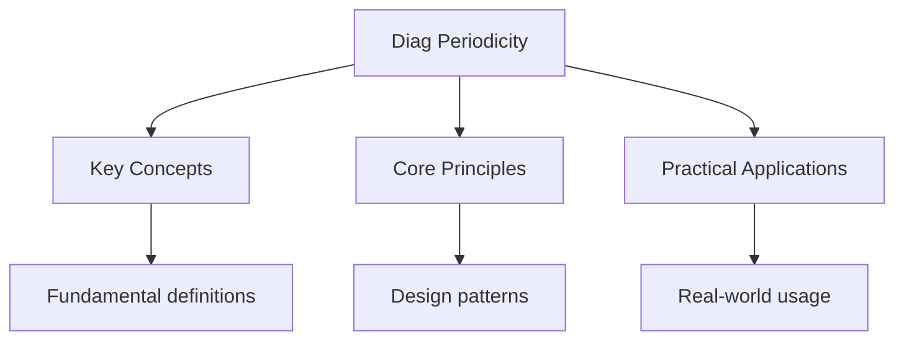

---

date: 2026-07-23T21:57:32+01:00
title: "Periodicity -- Diagnostic Tests"
description: "IB Chemistry Periodicity -- Diagnostic Tests notes covering key definitions, core concepts, worked examples, and practice questions for structured preparation."
tableOfContents: false
---

<!-- Breadcrumb Schema for SEO -->

## Periodicity — Diagnostic Tests

## Intuition

**The periodic table is like a map of元素 properties — elements in the same column share similar chemical personalities:** Periodic trends in atomic radius, ionization energy, and electronegability arise from electron configuration patterns

**Why it matters:** Understanding periodicity allows prediction of chemical behavior, guiding everything from drug design to materials science

**The key insight:** Periodic trends in atomic radius, ionization energy, and electronegability arise from electron configuration patterns

## Unit Tests

### UT-1: Ionisation Energy Trend Explanation

**Question:** The first ionisation energies of the period 3 elements (in $\text{kJ mol}^{-1}$) are:
Na (496), Mg (738), Al (578), Si (786), P (1012), S (1000), Cl (1251), Ar (1521). Identify the two
points where the trend decreases rather than increases and explain each anomaly in terms of electron
configuration.

**Solution:** The trend decreases at Al (578) compared to Mg (738), and at S (1000) compared to P
(1012).

At Al: Mg has configuration $[Ne]\, 3s^2$ (fully filled $3s$Stable). Al has $[Ne]\, 3s^2\, 3p^1$.
The electron removed from Al is in the higher-energy $3p$ subshell, which experiences greater
shielding and less penetration than $3s$ So less energy is needed despite the extra proton.

At S: P has $[Ne]\, 3s^2\, 3p^3$ (half-filled $3p$ with three unpaired electrons -- extra exchange
energy stability). S has $[Ne]\, 3s^2\, 3p^4$ where the fourth $3p$ electron must pair with an
existing electron. The electron-electron repulsion from pairing makes this electron easier to
remove.

---

<!-- Breadcrumb Schema for SEO -->

### UT-2: Atomic and Ionic Radii Comparison

**Question:** Arrange the following species in order of increasing ionic/atomic radius and justify
each placement: $\text{O}^{2-}$$\text{F}^-$$\text{Na}^+$$\text{Mg}^{2+}$. All are isoelectronic (10
electrons).

**Solution:** Increasing radius: $\text{Mg}^{2+} \lt \text{Na}^+ \lt \text{F}^- \lt \text{O}^{2-}$.

All four species have the electron configuration $1s^2\, 2s^2\, 2p^6$ (10 electrons). For
isoelectronic species, the radius is determined entirely by nuclear charge. Higher nuclear charge
pulls electrons closer to the nucleus.

- $\text{Mg}^{2+}$: $Z = 12$Highest effective nuclear charge, smallest radius.
- $\text{Na}^+$: $Z = 11$Less pull than $\text{Mg}^{2+}$.
- $\text{F}^-$: $Z = 9$Fewer protons attracting the same 10 electrons.
- $\text{O}^{2-}$: $Z = 8$Lowest effective nuclear charge, largest radius.

---

<!-- Breadcrumb Schema for SEO -->

### UT-3: Electronegativity and Bond Character Prediction

**Question:** The Pauling electronegativities are: H (2.20), Cl (3.16), Na (0.93), O (3.44). Use
electronegativity differences to classify the bonds in NaCl, HCl, and $\text{H}_2\text{O}$ as
non-polar covalent, polar covalent, or ionic. Calculate the percentage ionic character for each
using the empirical formula $\%\ \text{ionic} = 1 - \exp\left(-\frac{(\Delta\chi)^2}{4}\right)$.

**Solution:**

NaCl: $\Delta\chi = 3.16 - 0.93 = 2.23$.
$\%\ \text{ionic} = 1 - \exp\left(-\frac{2.23^2}{4}\right) = 1 - \exp(-1.243) = 1 - 0.289 = 71.1\%$.
Classification: ionic ($\Delta\chi \gt 1.7$).

HCl: $\Delta\chi = 3.16 - 2.20 = 0.96$.
$\%\ \text{ionic} = 1 - \exp\left(-\frac{0.96^2}{4}\right) = 1 - \exp(-0.230) = 1 - 0.795 = 20.5\%$.
Classification: polar covalent ($0.4 \lt \Delta\chi \lt 1.7$).

$\text{H}_2\text{O}$: $\Delta\chi = 3.44 - 2.20 = 1.24$.
$\%\ \text{ionic} = 1 - \exp\left(-\frac{1.24^2}{4}\right) = 1 - \exp(-0.384) = 1 - 0.681 = 31.9\%$.
Classification: polar covalent.

## Integration Tests

### IT-1: Periodicity and Chemical Bonding (with Chemical Bonding)

**Question:** Explain why silicon dioxide ($\text{SiO}_2$) is a solid with a very high melting point
($1713\ ^\circ\text{C}$), while carbon dioxide ($\text{CO}_2$) is a gas at room temperature, despite
both being group 14/16 compounds. Use periodic trends in electronegativity and atomic size in your
explanation.

**Solution:** Si and C are both in group 14, but Si is in period 3 while C is in period 2. The
larger atomic radius of Si means it forms longer, weaker $\pi$ bonds. Therefore, Si uses $sp^3$
hybridisation to form four single $\sigma$ bonds to four oxygen atoms in a continuous macromolecular
(giant covalent) network -- each Si is tetrahedrally bonded, and each O bridges two Si atoms.
Breaking this structure requires breaking strong covalent bonds throughout the entire lattice, hence
the very high melting point.

C, being much smaller, can form strong $\pi$ bonds. In $\text{CO}_2$Carbon uses $sp$ hybridisation
to form two double bonds ($\text{O}=\text{C}=\text{O}$). These are discrete molecules held together
only by weak London dispersion forces (instantaneous dipole-induced dipole). Very little energy is
needed to overcome these intermolecular forces, so $\text{CO}_2$ sublimes at
$-78.5\ ^\circ\text{C}$.

The key periodic trend is that $\pi$ bonding becomes progressively weaker down a group as atomic
orbitals become more diffuse and overlap less effectively. This explains the fundamental structural
difference.

---

<!-- Breadcrumb Schema for SEO -->

### IT-2: Ionisation Energy and Reactivity (with Redox)

**Question:** The first ionisation energies of group 1 elements decrease from Li (520) to Cs (376
$\text{kJ mol}^{-1}$). Explain this trend using nuclear charge and shielding. Then explain why Cs is
a stronger reducing agent than Li in aqueous solution, despite both forming $+1$ ions.

**Solution:** Down group 1, each successive element adds a full electron shell. Although nuclear
charge increases by one proton each time, the additional inner shell provides significant shielding.
The valence electron is further from the nucleus and experiences a much lower effective nuclear
charge. Therefore, less energy is required to remove it -- first ionisation energy decreases.

A reducing agent donates electrons. Lower ionisation energy means the element more readily loses its
valence electron. Cs has the lowest first ionisation energy in group 1, so it loses its electron
most : $\text{Cs} \to \text{Cs}^+ + e^-$. In aqueous solution, the reaction is
$\text{Cs}(s) + \text{H}_2\text{O}(l) \to \text{Cs}^+(aq) + \text{OH}^-(aq) + \tfrac{1}{2}\text{H}_2(g)$Which
occurs extremely vigorously. The standard electrode potential
$E^\circ(\text{Cs}^+/\text{Cs}) = -3.03\ \text{V}$ is more negative than
$E^\circ(\text{Li}^+/\text{Li}) = -3.04\ \text{V}$; the values are very close (hydration energy
partially compensates for the ionisation energy difference), but thermodynamically Cs is still a
marginally stronger reducing agent, and kinetically it reacts much faster due to its lower
ionisation energy and lower melting point.

---

<!-- Breadcrumb Schema for SEO -->

### IT-3: Electronegativity Trends and Acid Strength (with Acids and Bases)

**Question:** Across period 3, the hydrides are:
$\text{NaH}$$\text{MgH}_2$$\text{AlH}_3$$\text{SiH}_4$$\text{PH}_3$$\text{H}_2\text{S}$HCl. Use
electronegativity trends to predict and explain which of these behave as acids, which as bases, and
which are essentially neutral in water.

**Solution:** Electronegativity increases across period 3 from Na (0.93) to Cl (3.16). The polarity
of the E--H bond reverses direction across the period.

Left side (Na, Mg, Al): These elements have electronegativity less than H (2.20). The E--H bond is
polarised E$^\delta$--H$^\delta+$Making H partially negative. In water, the hydride ion
($\text{H}^-$) acts as a strong base:
$\text{H}^- + \text{H}_2\text{O} \to \text{H}_2 + \text{OH}^-$. So $\text{NaH}$ and $\text{MgH}_2$
are strongly basic.

Middle (Si, P): Electronegativity is close to H (Si: 1.90, P: 2.19). The bonds are nearly non-polar.
$\text{SiH}_4$ is essentially neutral. $\text{PH}_3$ is a very weak base (lone pair on P) but
practically insoluble and unreactive in water.

Right side (S, Cl): These have electronegativity greater than H (S: 2.58, Cl: 3.16). The bond is
polarised E$^\delta+$--H$^\delta-$Making H partially positive. In water, the H can be donated:
$\text{H}_2\text{S} \rightleftharpoons \text{H}^+ + \text{HS}^-$ ($K_a = 9.1 \times 10^{-8}$) and
$\text{HCl} \to \text{H}^+ + \text{Cl}^-$ ($K_a \gg 1$Strong acid). So $\text{H}_2\text{S}$ is a
weak acid and HCl is a strong acid.

## Common Mistakes

**Assuming ionisation energy always increases across a period:** There are exceptions (e.g., between Group 2 and 13, and between Group 15 and 16) due to subshell filling and electron pairing effects.

**Confusing atomic radius trend with ionic radius trend:** Atomic radius decreases across a period. Ionic radius depends on whether the ion is a cation (smaller than parent) or anion (larger than parent).

**Mixing up electronegativity with electron affinity:** Electronegativity is the ability to attract bonding electrons. Electron affinity is the energy change when gaining an electron. They're related but different concepts.

## See Also

- [Diagnostics](./)
- [Measurement and Data Processing -- Diagnostic Tests](./diag-measurement)
- [Redox Reactions -- Diagnostic Tests](./diag-redox)
