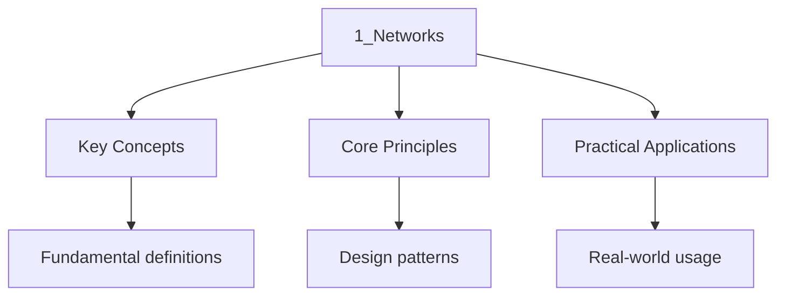

---

title: "Networks | IB - Wyatt's Notes"
description: "Rigorous IB computer science notes covering Networks. Includes definitions, derivations, worked examples, and exam-style problems."
date: 2024-01-01T00:00:00Z
tags:
  - CS
categories:
  - ib
---

<!-- Breadcrumb Schema for SEO -->

## Intuition

**Computer networks are like postal systems — data is broken into packets, addressed, routed, and reassembled at the destination:** The Internet's layered protocol architecture allows different technologies to work together seamlessly

**Why it matters:** Understanding networks is essential for building, securing, and troubleshooting connected systems

**The key insight:** The Internet's layered protocol architecture allows different technologies to work together seamlessly

## Computer Network

A computer network is a set of two or more computer systems that is able to exchange data by a
Connection.

### Server

A server is a broad term for a computer system or software that provide a service, this can be a
Single computer system to a large cluster with many computer systems.

### Client

A client is a computer system to requests a service from a server in the same network.

### Hub

A hub is a connection point that directly copies transmitted data and send to every device
Connected. When a device sends transmit data to the hub, the hub copies the data and sends towards
All devices connected. The device awaiting the data will receive the data, while all other device
Ignores the signal. Therefore the hub itself is does not account for any MAC address, and is
Consider a Physical Layer device in the OSI model.

### Switch

A switch is a connection point that can identify the device connection to each port and transmit
Data to the corresponding device using a MAC address. This means only the device awaiting for the
Data will receive data while all other devices connected will not. The switch is consider a data
Link layer in the OSI model as a flow control is present.

### Router

A router is a connection point that connect multiple networks, where MAC address is use to transmit
Information within the local network, and IP is used when transmitting information outside of the
Local network. The router is a network layer in the OSI model as it involves inter-network
Connections.

### Modem

A modem is a connection to the ISP, where the modem is connected to a router to allow router To
access the internet. The modem is consider a physical layer in the OSI model as it only transmit
Data in analog signals.

### Wireless Access Points (WAP)

A WAP is a connection point that acts as a hub with wireless connection

### Types of Network

- Local area network (LAN)
- A single network connected by MAC address.
- Normally involve clients and servers connected to a single hub or switch.
- Wireless local area network (WLAN)
- A single network connect by wireless protocols.
- Normally involve clients and servers connected to a WAP.
- Virtual local area network (VLAN)
- Partitioned LANs, where they are connected to a central switch but virtualize logically as
  different networks.
- Normally involve clients and servers connected with a switch, but each set of clients and servers
  are separated to multiple VLANs.
- Wide area network (WAN)
- A network connected multiple LANs spanning a large geographical area
- Storage area network (SAN)
- A network connected a cluster of storage devices, make accessible to a LAN
- Normally involve servers and storage devices connected by a switch
- Intranet
- A network connecting multiple networks through transport layer in OSI such as TCP/IP
- Internet
- A WAN connecting global devices normally accessed through an ISP
- Internet of things (IOT)
- A network connecting physical devices embedded with sensors and exchange data though the internet
- Extranet
- A network that allowed controlled internet access from clients to specific LAN or WAN
- VPN
- A network that connects remote networks through a encrypted connection
- Personal Area Network (PAN)
- A network connecting a single client and multiple devices
- Peer-To-Peer (P2P)
- A distributed network that connect every device with direct physical layer connection.

### Open System Interconnection (OSI) model

The OSI model is a networking standard established by the International Organization for
Standardization (ISO) to formalize communication across multiple devices. OSI is established by 7
Layers which specifies standards for physical communication and virtual communication, this include:

- Physical communication
- Physical layer
- Binary transmission (bitstreams) between devices
- Protocol data unit (PDU): Bits
- Bluetooth, IEEE802.11 (Wi-Fi)
- Hub, ethernet cable, fiber-optic links, WAP
- Data link layer
- Handles communication within a network with MAC address with error detection and flow control
- PDU: Frames (One network packet)
- Ethernet, HDLC
- Switch
- Network layer
- Handles routing of packets across a interconnected networks using logical address such as IP
  address header
- PDU: Packets
- IP (IPv4, IPv6)
- Router
- Transport layer
- Establish end-to-end connection, segmenting data in to packets with transmission protocol header.
- PDU: Segments (TCP) / Datagrams (UDP)
- TCP, UDP
- Session layer
- Managing and terminating sessions between application, including authentication, reconnection, and
  synchronization
- PDU: Data
- NetBIOS, RPC
- Presentation layer
- Translate data formats, encrypt, and compresses data
- PDU: Data
- SSL/TLS
- Application Layer
- Provide end-user application communication
- PDU: Data
- HTTPs, HTTP, FTP, SMTP, DNS, DHCP, IMAP

---

<!-- Breadcrumb Schema for SEO -->

## Network Topologies

### Bus Topology

- All devices share a single communication line (the "bus").
- **Advantages:** Simple and cheap to install, uses less cable than other topologies.
- **Disadvantages:** If the main cable fails, the entire network goes down. Performance degrades as
  more devices are added due to data collisions.

### Star Topology

- All devices connect to a central hub or switch.
- **Advantages:** Easy to add or remove devices without disrupting the network. If one cable fails,
  only that device is affected.
- **Disadvantages:** If the central hub/switch fails, the entire network fails. Requires more cable
  than a bus topology.

### Ring Topology

- Devices are connected in a closed loop, with each device connected to exactly two others.
- **Advantages:** Data travels in one direction, reducing the chance of packet collisions.
- **Disadvantages:** If one device or cable fails, the entire ring is broken. Adding or removing
  devices disrupts the network.

### Mesh Topology

- Every device is connected to every other device (full mesh) or to multiple devices (partial mesh).
- **Advantages:** High redundancy — if one connection fails, data can be rerouted. No single point
  of failure.
- **Disadvantages:** Expensive and complex to set up due to the large number of cables/connections
  required.

### Tree (Hierarchical) Topology

- A hybrid topology combining characteristics of bus and star topologies. Devices are arranged in a
  hierarchy, with a root node branching into sub-nodes.
- **Advantages:** Scalable and easy to manage hierarchically.
- **Disadvantages:** If the root node fails, the entire network below it is affected.

---

<!-- Breadcrumb Schema for SEO -->

## Key Protocols

### TCP/IP (Transmission Control Protocol / Internet Protocol)

TCP/IP is the foundational protocol suite of the internet. It operates at the transport and network
Layers of the OSI model.

**TCP (Transport Layer):**

- Connection-oriented — establishes a connection before data transfer (three-way handshake).
- Reliable delivery — uses acknowledgements (ACKs) and retransmission to ensure all packets arrive.
- Flow control — prevents the sender from overwhelming the receiver.
- Order preservation — packets are reassembled in the correct order at the destination.

**IP (Network Layer):**

- Responsible for addressing and routing packets across interconnected networks.
- Each device on a network has a unique IP address (IPv4: 32-bit, e.g. `192.168.1.1`; IPv6:
  128-bit).
- IP is connectionless — each packet is treated independently (datagram switching).
- TTL (Time to Live) prevents packets from circulating indefinitely.

**Three-way handshake (TCP connection establishment):**

1. Client sends SYN (synchronise) packet to server.
2. Server responds with SYN-ACK (synchronise-acknowledge).
3. Client sends ACK (acknowledge) to confirm.

### HTTP and HTTPS

**HTTP (Hypertext Transfer Protocol):**

- Application layer protocol used for transmitting web pages and other resources.
- Stateless — each request is independent; no memory of previous interactions.
- Request methods: `GET` (retrieve data), `POST` (submit data), `PUT` (update data), `DELETE`
  (remove data).
- Status codes: `200` (OK), `301` (Moved Permanently), `404` (Not Found), `500` (Server Error).

**HTTPS (HTTP Secure):**

- HTTP encrypted using SSL/TLS (Secure Sockets Layer / Transport Layer Security).
- Prevents eavesdropping and man-in-the-middle attacks.
- Uses asymmetric encryption for the initial handshake, then symmetric encryption for data transfer.

### DNS (Domain Name System)

DNS translates human-readable domain names (e.g. `www.example.com`) into IP addresses (e.g.
`93.184.216.34`).

**DNS resolution process:**

1. The browser checks its local cache for the IP address.
2. If not found, the request is sent to the **recursive DNS resolver** ( operated by the ISP).
3. The resolver queries the **root DNS server**, which directs it to the appropriate **TLD
   (Top-Level Domain) server** (e.g. `.com`).
4. The TLD server directs the resolver to the **authoritative name server** for the domain.
5. The authoritative server returns the IP address, which is cached by the resolver and returned to
   the browser.

**DNS records:**

- **A record:** Maps a domain name to an IPv4 address.
- **AAAA record:** Maps a domain name to an IPv6 address.
- **CNAME record:** Maps one domain name to another (alias).
- **MX record:** Specifies the mail server for the domain.

### DHCP (Dynamic Host Configuration Protocol)

DHCP automatically assigns IP addresses to devices on a network.

- When a device connects, it broadcasts a DHCPDISCOVER message.
- The DHCP server responds with a DHCPOFFER containing an available IP address.
- The device sends a DHCPREQUEST to accept the offer.
- The server confirms with a DHCPACK.
- IP addresses are leased for a set period and must be renewed.

### Other Important Protocols

| Protocol  | Layer       | Function                                               |
| :-------- | :---------- | :----------------------------------------------------- |
| FTP       | Application | File transfer between client and server                |
| SMTP      | Application | Sending email                                          |
| IMAP/POP3 | Application | Receiving email                                        |
| UDP       | Transport   | Connectionless, fast data delivery (streaming, gaming) |
| ARP       | Network     | Maps IP addresses to MAC addresses                     |
| ICMP      | Network     | Error reporting and diagnostics (e.g. `ping`)          |

---

<!-- Breadcrumb Schema for SEO -->

## Client-Server vs Peer-to-Peer

### Client-Server Model

- A central server provides resources and services to client devices.
- The server has higher processing power, storage, and bandwidth than clients.
- **Advantages:** Centralised security and management; easy to back up data; efficient for many
  simultaneous clients.
- **Disadvantages:** Single point of failure; server bottleneck under heavy load; higher cost to
  maintain the server.

### Peer-to-Peer (P2P) Model

- All devices (peers) have equal status — each can act as both client and server.
- No central server; resources are shared directly between peers.
- **Advantages:** No single point of failure; scalable — more peers means more resources; lower
  infrastructure cost.
- **Disadvantages:** Harder to manage and secure; performance depends on the number and capability
  of peers; data consistency is harder to maintain.

| Feature           | Client-Server                  | Peer-to-Peer                               |
| :---------------- | :----------------------------- | :----------------------------------------- |
| Central authority | Yes (server)                   | No                                         |
| Cost              | Higher (server infrastructure) | Lower                                      |
| Scalability       | Limited by server capacity     | Increases with more peers                  |
| Security          | Centralised, easier to manage  | Distributed, harder to manage              |
| Fault tolerance   | Server failure affects all     | Individual peer failure has minimal impact |
| Examples          | Web browsing, email, databases | BitTorrent, blockchain                     |

---

<!-- Breadcrumb Schema for SEO -->

## Network Security

### Threats

- **Malware:** Viruses (attach to files), worms (self-replicate), trojans (disguised as legitimate
  software), ransomware (encrypts data and demands payment).
- **Phishing:** Deceptive emails or websites designed to steal credentials or personal information.
- **Man-in-the-Middle (MITM) attack:** An attacker intercepts communication between two parties
  without their knowledge.
- **DDoS (Distributed Denial of Service):** Overwhelming a server with traffic from multiple
  compromised devices (botnet).
- **SQL Injection:** Inserting malicious SQL code into input fields to manipulate a database.

### Security Measures

- **Firewall:** Monitors and controls incoming and outgoing network traffic based on security rules.
  Can be hardware- or software-based.
- **Antivirus/Anti-malware software:** Scans for, detects, and removes malicious software.
- **Access control:** Authentication (verifying identity) and authorisation (determining
  permissions). Methods include passwords, biometrics, and multi-factor authentication (MFA).
- **Intrusion Detection System (IDS):** Monitors network traffic for suspicious activity and alerts
  administrators.
- **Physical security:** Securing server rooms with locks, CCTV, and access badges.

---

<!-- Breadcrumb Schema for SEO -->

## Encryption

Encryption is the process of converting plaintext into ciphertext using an algorithm and a key. Only
Authorised parties with the correct key can decrypt the data.

### Symmetric Encryption

- The same key is used for both encryption and decryption.
- **Advantages:** Fast; efficient for large amounts of data.
- **Disadvantages:** Key distribution problem — how do you securely share the key?
- **Examples:** AES (Advanced Encryption Standard), DES (Data Encryption Standard — now considered
  insecure).

### Asymmetric Encryption

- Uses a pair of keys: a **public key** (shared openly) and a **private key** (kept secret).
- Data encrypted with the public key can only be decrypted with the private key, and vice versa.
- **Advantages:** Solves the key distribution problem; enables digital signatures.
- **Disadvantages:** Slower than symmetric encryption.
- **Examples:** RSA, ECC (Elliptic Curve Cryptography).

### Digital Signatures and Certificates

- A **digital signature** is created by encrypting a hash of a message with the sender"s private
  key. The recipient can verify it using the sender's public key.
- A **digital certificate** binds a public key to an identity, issued by a trusted **Certificate
  Authority (CA)** (e.g. VeriSign, Let's Encrypt). This prevents man-in-the-middle attacks.
- **SSL/TLS** uses a combination of asymmetric encryption (for the initial handshake and key
  exchange) and symmetric encryption (for the data session).

### Hashing

- A hash function converts data of arbitrary size into a fixed-size string (the hash or digest).
- Properties: deterministic, one-way (cannot reverse a hash to find the original data),
  collision-resistant.
- **Examples:** SHA-256, MD5 (now considered insecure due to collision vulnerabilities).
- Uses: password storage (store hash, not plaintext), data integrity verification, digital
  signatures.

---

<!-- Breadcrumb Schema for SEO -->

## Data Transmission

### Packet Switching

Data is broken into packets, each containing:

- **Header:** Source address, destination address, sequence number, protocol information.
- **Payload:** The actual data being transmitted.
- **Trailer:** Error-checking information (checksum).

Packets may travel different routes across the network and arrive out of order. They are reassembled
At the destination using sequence numbers.

### Error Detection

- **Checksum:** A value computed from the data that is sent alongside it. The receiver recomputes
  the checksum and compares.
- **Parity bit:** A single bit added to each byte to make the total number of 1s even (even parity)
  or odd (odd parity). Can detect single-bit errors but cannot correct them.
- **CRC (Cyclic Redundancy Check):** A more robust error-detection method using polynomial division.
  Commonly used in network protocols.

### Transmission Errors

- **Echo:** Part of a signal is reflected back, causing interference.
- **Crosstalk:** Signal from one wire interferes with a signal on an adjacent wire.
- **Attenuation:** Signal strength decreases over distance.
- **Noise:** Unwanted electrical signals that distort the data.

### Multiplexing

- **Frequency-Division Multiplexing (FDM):** Divides the bandwidth into separate frequency channels.
- **Time-Division Multiplexing (TDM):** Each device is assigned a time slot in which to transmit.
- **Statistical TDM:** Time slots are allocated dynamically based on demand, improving efficiency
  over fixed TDM.

---

<!-- Breadcrumb Schema for SEO -->

## TCP/IP Protocol Stack Detail

The TCP/IP model is a four-layer model that predates and influenced the OSI model. It is the
Practical framework used on the internet today.

| Layer | TCP/IP Name    | OSI Equivalent                     | Key Protocols                   |
| :---- | :------------- | :--------------------------------- | :------------------------------ |
| 4     | Application    | Application, Session, Presentation | HTTP, FTP, SMTP, DNS, DHCP, SSH |
| 3     | Transport      | Transport                          | TCP, UDP                        |
| 2     | Internet       | Network                            | IP, ICMP, ARP, OSPF             |
| 1     | Network Access | Data Link, Physical                | Ethernet, Wi-Fi, MAC, PPP       |

### TCP Segment Structure

A TCP segment contains:

- **Source port** and **destination port** (16 bits each): identify the application-level processes.
- **Sequence number** (32 bits): ensures correct reassembly of packets.
- **Acknowledgement number** (32 bits): confirms receipt of data.
- **Flags**: SYN, ACK, FIN, RST control the connection state.
- **Window size** (16 bits): used for flow control — tells the sender how much data the receiver can
  accept.
- **Checksum**: error detection for the segment header and data.

### TCP vs UDP

| Feature      | TCP                                      | UDP                                  |
| :----------- | :--------------------------------------- | :----------------------------------- |
| Connection   | Connection-oriented (handshake required) | Connectionless                       |
| Reliability  | Reliable (ACKs, retransmission)          | Unreliable (best-effort delivery)    |
| Ordering     | Preserves packet order                   | No ordering guarantee                |
| Flow control | Yes (window-based)                       | No                                   |
| Overhead     | Higher (more header data)                | Lower (minimal header)               |
| Use cases    | Web browsing, email, file transfer       | Streaming, gaming, VoIP, DNS queries |

### UDP Segment Structure

A UDP datagram is much simpler than TCP:

- **Source port** and **destination port** (16 bits each).
- **Length** (16 bits): total length of the datagram.
- **Checksum**: optional error detection.
- No sequence numbers, no acknowledgements, no flow control.

---

<!-- Breadcrumb Schema for SEO -->

## Subnetting

Subnetting divides a large network into smaller sub-networks (subnets) to improve performance,
Security, and address management.

### Subnet Mask

A subnet mask determines which portion of an IP address represents the network and which represents
The host. It is written as a series of 1s followed by 0s:

- `255.255.255.0` = `/24` = the first 24 bits are the network portion.
- `255.255.0.0` = `/16` = the first 16 bits are the network portion.

### Worked Example: Subnetting

**Problem:** A company has been allocated the network `192.168.1.0/24`. They need 6 subnets.
Determine the subnet mask, number of usable hosts per subnet, and the range of the first three
Subnets.

**Solution:**

1. To create 6 subnets, we need at least 3 bits for the subnet portion ($2^3 = 8 \ge 6$).
2. The new subnet mask borrows 3 bits from the host portion: `/24 + 3 = /27`.
3. Subnet mask: `255.255.255.224` (since `11100000` in binary = 224 in decimal).
4. Host bits remaining: $8 - 3 = 5$ So $2^5 - 2 = 30$ usable hosts per subnet.
5. Subnet ranges (block size = $256 - 224 = 32$):

| Subnet | Network Address | Usable Host Range               | Broadcast Address |
| :----- | :-------------- | :------------------------------ | :---------------- |
| 1      | `192.168.1.0`   | `192.168.1.1` - `192.168.1.30`  | `192.168.1.31`    |
| 2      | `192.168.1.32`  | `192.168.1.33` - `192.168.1.62` | `192.168.1.63`    |
| 3      | `192.168.1.64`  | `192.168.1.65` - `192.168.1.94` | `192.168.1.95`    |

---

<!-- Breadcrumb Schema for SEO -->

## Network Security Threats (Expanded)

### Malware Types

| Type       | Description                                                   | Example                             |
| :--------- | :------------------------------------------------------------ | :---------------------------------- |
| Virus      | Attaches to legitimate files; requires user action to spread  | Macro virus in Word documents       |
| Worm       | Self-replicates across networks without user intervention     | Conficker worm (2008)               |
| Trojan     | Disguised as legitimate software; creates backdoors           | Emotet                              |
| Ransomware | Encrypts files and demands payment for decryption key         | WannaCry (2017), NotPetya (2017)    |
| Spyware    | Monitors user activity and collects data without consent      | Keyloggers                          |
| Rootkit    | Hides deep in the OS to maintain persistent privileged access | Used in advanced persistent threats |

### Common Attack Vectors

- **Brute force attack:** Systematically trying every possible password combination. Countermeasure:
  rate limiting, account lockout, strong password policies.
- **Social engineering:** Manipulating people into divulging confidential information. Includes
  pretexting, baiting, and tailgating (following an authorised person through a secure door).
- **Session hijacking:** Stealing a valid session token after a user authenticates. Countermeasure:
  HTTPS, secure cookies, session timeout.
- **Zero-day exploit:** Exploiting a vulnerability that the software vendor has not yet patched or
  publicly disclosed.

---

<!-- Breadcrumb Schema for SEO -->

## Problem Set

Question 1

A company uses a Class C network address `192.168.10.0`. The network administrator needs to create
10 subnets.

A) What is the minimum number of subnet bits required? b) What is the new subnet mask in both binary
Prefix notation and dotted decimal? c) How many usable host addresses are available per subnet? d)
Write the network address, first usable address, and broadcast address for the first subnet.

Answer 1

A) We need $2^n \ge 10$. With $n = 4$, $2^4 = 16 \ge 10$. Minimum subnet bits: 4. B) Original
Prefix: `/24`. New prefix: `/24 + 4 = /28`. Subnet mask: `255.255.255.240`. C) Remaining host bits:
$8 - 4 = 4$. Usable hosts: $2^4 - 2 = 14$ per subnet. D) Block size: $256 - 240 = 16$. First subnet:
Network = `192.168.10.0`First usable = `192.168.10.1`Broadcast = `192.168.10.15`.

Question 2

Explain why TCP is described as a "reliable" protocol but UDP is not. In your answer, describe the
Mechanisms TCP uses to ensure reliability and explain why these mechanisms are not always desirable.

Answer 2

TCP is described as reliable because it uses several mechanisms to ensure data delivery: (1)
**Three-way handshake** establishes a connection before data transfer. (2) **Sequence numbers**
Allow the receiver to reassemble packets in the correct order and detect missing packets. (3)
**Acknowledgements (ACKs)** confirm receipt; the sender retransmits unacknowledged packets. (4)
**Flow control** (sliding window) prevents the sender from overwhelming the receiver. (5)
**Checksums** detect corrupted data.

UDP does not use any of these mechanisms, making it unreliable but faster and with lower overhead.
UDP is preferred for real-time applications (streaming, VoIP, online gaming) where speed matters
More than perfect delivery, and for DNS queries where the small request/response size makes the
Overhead of a TCP connection wasteful.

Question 3

A user types `https://www.example.com` into their browser. Describe, in order, the steps that occur
From the moment the URL is entered until the web page begins to load. Include reference to DNS
Resolution, TCP connections, TLS, and HTTP.

Answer 3

1. **DNS Resolution:** The browser checks its local cache for the IP address of `www.example.com`.
   If not found, it queries the recursive DNS resolver (ISP), which queries the root server, then
   the TLD server (`.com`), then the authoritative name server. The IP address is returned and
   cached.
2. **TCP Connection:** The browser initiates a TCP three-way handshake with the server at the
   resolved IP address on port 443 (HTTPS). SYN is sent, SYN-ACK is received, ACK is sent.
3. **TLS Handshake:** The browser and server perform a TLS handshake. The server sends its digital
   certificate. The browser verifies the certificate with a Certificate Authority. They negotiate a
   symmetric encryption key using asymmetric encryption. All subsequent data is encrypted.
4. **HTTP Request:** The browser sends an HTTP GET request over the encrypted connection, requesting
   the root path `/`.
5. **HTTP Response:** The server processes the request and sends back the HTML content along with
   status code `200 OK`.
6. **Rendering:** The browser begins parsing the HTML and making additional requests for embedded
   resources (CSS, JavaScript, images).

Question 4

A network uses a star topology with a central switch. There are 24 devices connected. A new security
Policy requires the network to be split into three separate groups so that devices in different
Groups cannot communicate with each other.

A) What network technology would you recommend to achieve this without adding physical switches? b)
Explain how this technology works at the Data Link layer. C) Discuss one advantage and one
Disadvantage of this approach compared to using three separate physical switches.

Answer 4

A) VLAN (Virtual Local Area Network). B) A VLAN works at the Data Link layer by tagging Ethernet
Frames with a VLAN ID (using IEEE 802.1Q standard). The switch is configured so that ports assigned
To VLAN 1 can only communicate with other ports in VLAN 1, and similarly for VLANs 2 and 3. The
Switch enforces this isolation by only forwarding frames to ports in the same VLAN. Frames between
Different VLANs can only be routed through a router (inter-VLAN routing), which can be configured
With access control policies. C) **Advantage:** Cost-effective — no additional hardware required;
Flexible — devices can be moved between VLANs through software configuration without recabling.
**Disadvantage:** All VLANs share the same physical switch, so a hardware failure of the switch
Affects all VLANs; total bandwidth is shared among all VLANs.

Question 5

Compare and contrast symmetric and asymmetric encryption. Your answer should address:

- How keys are used in each type
- Key distribution challenges
- Relative speed
- A practical scenario where both are used together

Answer 5

**Symmetric encryption** uses a single shared key for both encryption and decryption. Both the
Sender and receiver must possess the same key. The main challenge is **key distribution**: how to
Securely share the key without it being intercepted. Symmetric encryption is computationally
**fast**, making it suitable for encrypting large volumes of data (e.g., AES).

**Asymmetric encryption** uses a key pair: a public key (freely shared) and a private key (kept
Secret). Data encrypted with the public key can only be decrypted with the private key, and vice
Versa. This solves the key distribution problem since the public key can be transmitted openly.
Asymmetric encryption is computationally **slow**, making it impractical for large data volumes
(e.g., RSA).

**Practical scenario — HTTPS/TLS:** Asymmetric encryption is used during the initial TLS handshake
To securely exchange a symmetric session key. Once the symmetric key is established, all subsequent
Data is encrypted using symmetric encryption (AES), combining the security benefits of asymmetric
Encryption with the speed of symmetric encryption.

## Common Pitfalls

1. Forgetting edge cases in algorithm design (e.g., empty input, single element, already sorted
   data).

2. Confusing authentication (who you are) with authorisation (what you can do) in security contexts.

3. Misunderstanding the difference between a stack (LIFO) and a queue (FIFO) in data structure
   applications.

4. Writing pseudocode that is too language-specific rather than using standard algorithmic
   constructs.

## Cross-References

| Topic      | Site       | Link                                                                                                      |
| ---------- | ---------- | --------------------------------------------------------------------------------------------------------- |
| [Networks] | A-Level    | [View](https://alevel-sciences.wyattau.com/docs/alevel/computer-science/networks/01-network-fundamentals) |
| [Networks] | IB         | [View](https://ib.wyattau.com/docs/ib/computer-science/3-networks/1_networks)                             |
| [Networks] | DSE        | [View](https://dse.wyattau.com/docs/dse/ict/4-networking-and-internet/1_internet-and-data-communications) |
| [Networks] | University | [View](https://computer-science.wyattau.com/)             |

## Summary

The key principles covered in this topic are linked in the sub-pages above. Focus on understanding
the definitions, applying the formulas or frameworks, and evaluating strengths and limitations of
each approach.

## Worked Examples

Worked examples demonstrating the application of key concepts are covered in the detailed sub-pages
linked above.

## See Also

- [Networks](./)
- [IB Computer Science](..)
- [IB CS Flashcards: Networks and Databases](../flashcards-networks-databases)
