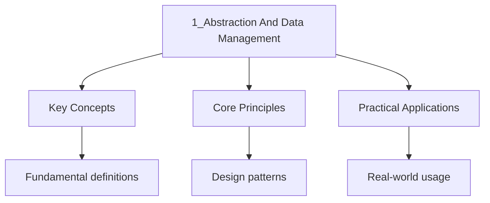

---

title: Abstraction and Data Management
description: "Rigorous IB computer science notes covering Abstraction and Data Management. Includes definitions, derivations, worked examples, and exam-style problems."
date: 2024-01-01T00:00:00Z
tags:
  - IB
categories:
  - ib
---

<!-- Breadcrumb Schema for SEO -->
<script type="application/ld+json">
{
  "@context": "https://schema.org",
  "@type": "BreadcrumbList",
  "itemListElement": [{"name": "Home", "url": "https://wyattau.com"}, {"name": "ib", "url": "https://ib.wyattau.com"}, {"name": "Computer Science", "url": "https://ib.wyattau.com/computer-science"}, {"name": "5 Abstract Data Structures", "url": "https://ib.wyattau.com/computer-science/5-abstract-data-structures"}, {"name": "1_abstraction And Data Management", "url": "https://ib.wyattau.com/computer-science/5-abstract-data-structures/1_abstraction-and-data-management"}]
}
</script>

## Conceptual Models vs Physical Models

A **conceptual model** describes what a system does, what data it manages, and what relationships
Exist, without specifying how these are implemented. It focuses on the problem domain and the user"s
Perspective. Conceptual models are independent of any particular technology, programming language,
Or database system.

A **physical model** describes how a system is actually implemented: the specific data structures,
Algorithms, storage mechanisms, and hardware configurations used. It focuses on the solution domain
And the developer's perspective.

### Comparison

| Aspect            | Conceptual Model                            | Physical Model                               |
| ----------------- | ------------------------------------------- | -------------------------------------------- |
| Focus             | What the system does                        | How the system is implemented                |
| Audience          | Stakeholders, analysts, end users           | Developers, database administrators          |
| Abstraction level | High                                        | Low                                          |
| Technology        | Technology-independent                      | Technology-specific                          |
| Examples          | ERDs, use case diagrams, data flow diagrams | Schema definitions, file structures, indexes |
| Changes           | Stable (reflects the problem)               | Changes with technology or optimization      |

### Worked Example: Library System

**Conceptual model:** The library has Books and Members. A Member can borrow many Books. A Book can
Be borrowed by one Member at a time. A Book has a title, author, ISBN, and availability status. A
Member has a name, member ID, and a list of current loans.

**Physical model:** The Book entity is stored in a MySQL table with columns
`book_id INT PRIMARY KEY AUTO_INCREMENT``title VARCHAR(200) NOT NULL`
`author VARCHAR(100) NOT NULL``isbn VARCHAR(13) UNIQUE``is_available BOOLEAN DEFAULT TRUE`. The
Member entity is stored in a MySQL table with columns `member_id INT PRIMARY KEY AUTO_INCREMENT`
`name VARCHAR(100) NOT NULL`. The loan relationship is stored in a junction table `loan` with
Columns `loan_id``book_id FOREIGN KEY`And `member_id FOREIGN KEY`.

The conceptual model describes the domain. The physical model describes the implementation. A good
Design separates them so that the physical implementation can change (e.g., migrating from MySQL to
PostgreSQL) without requiring changes to the conceptual understanding of the system.

### Worked Example: Converting a Conceptual Model to a Physical Model

A car rental company has the following conceptual model:

- A Customer has a name, phone, and license number
- A Vehicle has a make, model, year, and daily rate
- A Customer can rent many Vehicles over time; a Vehicle can be rented by many Customers
- Each Rental has a start date, end date, and total cost

Convert this to a physical model with specific SQL data types.

<details>
<summary>Solution</summary>

**Conceptual entities:** Customer, Vehicle, Rental

**Relationships:**

- Customer-Rental: 1:M
- Vehicle-Rental: 1:M
- Customer-Vehicle: M:N (via Rental)

**Physical model (SQL CREATE TABLE):**

```sql
CREATE TABLE Customer (
    customerID INTEGER PRIMARY KEY,
    name VARCHAR(100) NOT NULL,
    phone VARCHAR(20),
    licenseNumber VARCHAR(20) UNIQUE NOT NULL
);

CREATE TABLE Vehicle (
    vehicleID INTEGER PRIMARY KEY,
    make VARCHAR(50) NOT NULL,
    model VARCHAR(50) NOT NULL,
    year INTEGER CHECK (year >= 1900 AND year <= 2030),
    dailyRate DECIMAL(10, 2) NOT NULL
);

CREATE TABLE Rental (
    rentalID INTEGER PRIMARY KEY,
    customerID INTEGER NOT NULL,
    vehicleID INTEGER NOT NULL,
    startDate DATE NOT NULL,
    endDate DATE,
    totalCost DECIMAL(10, 2),
    FOREIGN KEY (customerID) REFERENCES Customer(customerID),
    FOREIGN KEY (vehicleID) REFERENCES Vehicle(vehicleID)
);
```

Key decisions:

- `licenseNumber` has a UNIQUE constraint (no two customers share a license)
- `dailyRate` and `totalCost` use DECIMAL (not FLOAT) to avoid rounding errors with money
- `endDate` and `totalCost` can be NULL (the rental may still be in progress)
- Rental is the junction table for the M:N Customer-Vehicle relationship

</details>

## Data Abstraction

Data abstraction is the principle of separating the specification of what data operations do from
The implementation of how they do it. The user of an abstract data type knows what operations are
Available and what they do, but does not know (and does not need to know) how the data is stored or
How the operations are implemented.

### What vs How

**What (the interface):** A stack supports push, pop, peek, isEmpty, and size operations. Push adds
An element to the top. Pop removes and returns the top element. Peek returns the top element without
Removing it.

**How (the implementation):** A stack can be implemented using a dynamic array (with an index
Tracking the top position) or a linked list (with a head pointer). The array implementation provides
$O(1)$ amortized push and $O(1)$ pop but may need resizing. The linked list implementation provides
$O(1)$ push and $O(1)$ pop with no resizing but has pointer overhead.

The caller of push and pop does not know or care which implementation is used. This is data
Abstraction: the "what" is exposed, the "how" is hidden.

### Benefits of Data Abstraction

**Reduced complexity:** The user only needs to understand the interface, not the implementation. A
Programmer using a stack does not need to understand memory allocation, pointer arithmetic, or array
Resizing.

**Implementation independence:** The implementation can be changed without affecting any code that
Uses the abstract data type. If a stack is initially implemented with an array and later changed to
A linked list, no caller code needs to change.

**Encapsulation of invariants:** The implementation enforces the data structure's invariants. A
Stack implemented as a class with a private array ensures that external code cannot corrupt the
Stack by directly modifying array elements.

**Improved testing:** The interface defines a clear contract that can be tested independently of the
Implementation. The same test suite can verify correctness regardless of which implementation is
used.

## Procedural Abstraction

Procedural abstraction is the practice of hiding the implementation details of a procedure or
Function behind a well-defined interface. The caller knows the procedure's name, parameters, and
Return type, but not the algorithm it uses.

### Procedural Decomposition

Procedural decomposition (also called top-down design) is the process of breaking a complex problem
Into a hierarchy of sub-procedures, each of which solves a part of the problem. The main procedure
Delegates work to lower-level procedures, which may themselves delegate to even lower-level
Procedures.

**Worked example:** A program to calculate and display student grades.

```python
PROCEDURE main()
  students ← loadStudentData()
  grades ← calculateGrades(students)
  displayReport(grades)
END PROCEDURE
```

The `main` procedure does not contain any of the actual logic. It delegates to three sub-procedures:
`loadStudentData` handles file I/O, `calculateGrades` handles the computation, and `displayReport`
Handles the output. Each sub-procedure can be developed, tested, and modified independently.

```python
FUNCTION calculateGrades(students) RETURNS ARRAY
  FOR i ← 0 TO LENGTH(students) - 1
    total ← 0
    FOR j ← 0 TO LENGTH(students[i].scores) - 1
      total ← total + students[i].scores[j]
    END FOR
    students[i].average ← total / LENGTH(students[i].scores)
    IF students[i].average >= 90
      THEN students[i].grade ← "A"
    ELSE IF students[i].average >= 80
      THEN students[i].grade ← "B"
    ELSE IF students[i].average >= 70
      THEN students[i].grade ← "C"
    ELSE IF students[i].average >= 60
      THEN students[i].grade ← "D"
    ELSE
      students[i].grade ← "F"
    END IF
  END FOR
  RETURN students
END FUNCTION
```

The `calculateGrades` function can be further decomposed: the average calculation could be a
Separate function, and the grade assignment could be a separate function. The level of decomposition
Is a judgment call: too little decomposition makes the code monolithic; too much decomposition
Creates trivial functions that add complexity without benefit.

<details>
<summary>Worked Example: Decomposing a Task Management System</summary>

A task management system allows users to create tasks, assign priorities, mark tasks as complete,
and Generate a daily summary report. Apply procedural decomposition to design this system.

**Level 1 -- Main procedure:**

```python
PROCEDURE taskManager()
  tasks ← loadTasks()
  PROCESS user input
  IF user requests report
    THEN generateReport(tasks)
  END IF
  saveTasks(tasks)
END PROCEDURE
```

**Level 2 -- Refine user input processing:**

```python
PROCEDURE processInput(tasks)
  choice ← getMenuChoice()
  IF choice = 1
    THEN addTask(tasks)
  ELSE IF choice = 2
    THEN markComplete(tasks)
  ELSE IF choice = 3
    THEN setPriority(tasks)
  ELSE IF choice = 4
    THEN generateReport(tasks)
  END IF
END PROCEDURE
```

**Level 3 -- Refine addTask:**

```python
PROCEDURE addTask(tasks)
  OUTPUT "Enter task description: "
  desc ← INPUT
  OUTPUT "Enter priority (1-5): "
  priority ← INPUT
  newTask ← createTask(desc, priority)
  APPEND newTask TO tasks
END PROCEDURE
```

Each level adds more detail while keeping the higher-level structure intact. The `processInput`
Procedure acts as a dispatcher, delegating to specific handlers. This makes it straightforward to
add New commands (e.g., delete task) by adding a new branch and handler without modifying the main
loop.

</details>

## Abstract Data Types (ADTs)

### Specification vs Implementation

An Abstract Data Type is defined by two components:

**Specification:** The public interface -- the set of operations, their names, parameters, return
Types, preconditions, and postconditions. The specification defines the contract between the ADT and
Its users.

**Implementation:** The internal representation of the data and the algorithms that implement the
Operations. The implementation is hidden from users and can be changed without affecting the
Specification.

### ADT Example: Stack

**Specification:**

| Operation    | Precondition       | Postcondition                                            |
| ------------ | ------------------ | -------------------------------------------------------- |
| `push(item)` | Stack is not full  | `item` is on top; size increases by 1                    |
| `pop()`      | Stack is not empty | Top element is removed and returned; size decreases by 1 |
| `peek()`     | Stack is not empty | Returns top element; stack is unchanged                  |
| `isEmpty()`  | None               | Returns TRUE if size is 0, FALSE otherwise               |
| `size()`     | None               | Returns the number of elements in the stack              |

**Implementation (array-based):**

```python
CLASS Stack
  PRIVATE items : ARRAY[0 : MAX_SIZE - 1] OF INTEGER
  PRIVATE top : INTEGER

  PUBLIC CONSTRUCTOR Stack()
    top ← -1
  END CONSTRUCTOR

  PUBLIC PROCEDURE push(item)
    IF top = MAX_SIZE - 1
      THEN OUTPUT "Stack overflow"
    ELSE
      top ← top + 1
      items[top] ← item
    END IF
  END PROCEDURE

  PUBLIC FUNCTION pop() RETURNS INTEGER
    IF isEmpty()
      THEN
        OUTPUT "Stack underflow"
        RETURN -1
      END IF
    result ← items[top]
    top ← top - 1
    RETURN result
  END FUNCTION

  PUBLIC FUNCTION peek() RETURNS INTEGER
    IF isEmpty()
      THEN RETURN -1
    END IF
    RETURN items[top]
  END FUNCTION

  PUBLIC FUNCTION isEmpty() RETURNS BOOLEAN
    RETURN top = -1
  END FUNCTION

  PUBLIC FUNCTION size() RETURNS INTEGER
    RETURN top + 1
  END FUNCTION
END CLASS
```

**Implementation (linked-list-based):**

```python
CLASS Node
  PUBLIC data : INTEGER
  PUBLIC next : Node
END CLASS

CLASS LinkedListStack
  PRIVATE head : Node
  PRIVATE count : INTEGER

  PUBLIC CONSTRUCTOR LinkedListStack()
    head ← NIL
    count ← 0
  END CONSTRUCTOR

  PUBLIC PROCEDURE push(item)
    newNode ← new Node
    newNode.data ← item
    newNode.next ← head
    head ← newNode
    count ← count + 1
  END PROCEDURE

  PUBLIC FUNCTION pop() RETURNS INTEGER
    IF isEmpty()
      THEN RETURN -1
    END IF
    result ← head.data
    head ← head.next
    count ← count - 1
    RETURN result
  END FUNCTION

  PUBLIC FUNCTION peek() RETURNS INTEGER
    IF isEmpty()
      THEN RETURN -1
    END IF
    RETURN head.data
  END FUNCTION

  PUBLIC FUNCTION isEmpty() RETURNS BOOLEAN
    RETURN head = NIL
  END FUNCTION

  PUBLIC FUNCTION size() RETURNS INTEGER
    RETURN count
  END FUNCTION
END CLASS
```

Both implementations satisfy the same specification. Code that uses `Stack` via its public interface
(push, pop, peek, isEmpty, size) works identically with either implementation. The choice of
Implementation affects performance characteristics (array-based has better cache locality;
Linked-list-based has no size limit) but not correctness.

### Worked Example: Comparing Stack Implementations

Trace pushing 3 elements (10, 20, 30) and then popping 2 elements on both the array-based and
Linked-list-based stack implementations.

<details>
<summary>Solution</summary>

**Array-based stack** (MAX_SIZE = 5):

| Operation | `top` | Stack contents (bottom to top) | Output |
| --------- | ----- | ------------------------------ | ------ |
| push(10)  | 0     | [10]                           | --     |
| push(20)  | 1     | [10, 20]                       | --     |
| push(30)  | 2     | [10, 20, 30]                   | --     |
| pop()     | 1     | [10, 20]                       | 30     |
| pop()     | 0     | [10]                           | 20     |

**Linked-list-based stack:**

| Operation | `count` | Head → ... (top is head) | Output |
| --------- | ------- | ------------------------ | ------ |
| push(10)  | 1       | 10 → NIL                 | --     |
| push(20)  | 2       | 20 → 10 → NIL            | --     |
| push(30)  | 3       | 30 → 20 → 10 → NIL       | --     |
| pop()     | 2       | 20 → 10 → NIL            | 30     |
| pop()     | 1       | 10 → NIL                 | 20     |

Both implementations produce identical external behavior (same outputs for same operations). The
Internal state differs (array index vs. Linked pointers), but the caller cannot observe this
Difference through the public interface. This demonstrates **data abstraction**.

</details>

## Encapsulation and Information Hiding

### Encapsulation

Encapsulation is the bundling of data (attributes) and the methods that operate on that data into a
Single unit. In object-oriented programming, this unit is a class. Encapsulation restricts direct
Access to some of the object's components, by making attributes private and exposing only Public
methods.

### Information Hiding

Information hiding is the design principle that the internal details of a module should be hidden
From other modules. Only the essential interface is exposed. The implementation can change without
Affecting any code that depends only on the interface.

**Practical benefits:**

**Protection against invalid state:** If a bank account's balance is private and can only be
Modified through `deposit()` and `withdraw()` methods, external code cannot set the balance to a
Negative value directly. The methods enforce business rules (e.g., withdraw cannot exceed balance).

**Reduced coupling:** A module that depends only on another module's interface is loosely coupled to
It. Changes to the implementation do not propagate. This makes the system easier to maintain and
Extend.

**Localized debugging:** When a bug is found in the stack implementation, the developer knows to
Look inside the Stack class, not in the code that calls push and pop. The bug is confined to a
Single location.

**Parallel development:** Teams can work on different modules simultaneously as long as they agree
On interfaces. One team implements the Stack class; another team writes code that uses it. They only
Need to coordinate on the interface, not on the implementation details.

<details>
<summary>Worked Example: Designing Encapsulation for a Student Record</summary>

Design a `StudentRecord` class with proper encapsulation. The system must enforce that a student's
GPA Is always between 0.0 and 4.0, and that the student ID cannot be changed after construction.

```python
CLASS StudentRecord
  PRIVATE studentID : STRING
  PRIVATE name : STRING
  PRIVATE gpa : FLOAT
  PRIVATE creditsCompleted : INTEGER

  PUBLIC CONSTRUCTOR StudentRecord(id, n)
    studentID ← id
    name ← n
    gpa ← 0.0
    creditsCompleted ← 0
  END CONSTRUCTOR

  PUBLIC PROCEDURE addCourse(grade, creditHours)
    totalQualityPoints ← gpa * creditsCompleted
    totalQualityPoints ← totalQualityPoints + (grade * creditHours)
    creditsCompleted ← creditsCompleted + creditHours
    gpa ← totalQualityPoints / creditsCompleted
  END PROCEDURE

  PUBLIC FUNCTION getGPA() RETURNS FLOAT
    RETURN gpa
  END FUNCTION

  PUBLIC FUNCTION getStudentID() RETURNS STRING
    RETURN studentID
  END FUNCTION

  PUBLIC FUNCTION getCredits() RETURNS INTEGER
    RETURN creditsCompleted
  END FUNCTION

  PUBLIC PROCEDURE setName(newName)
    name ← newName
  END PROCEDURE

  PUBLIC FUNCTION getName() RETURNS STRING
    RETURN name
  END FUNCTION
END CLASS
```

**Encapsulation decisions:**

- `studentID` is private with only a getter -- no setter, so it cannot be changed after
  construction.
- `gpa` is private with no setter -- it is computed internally by `addCourse`Ensuring it is always
  consistent with the completed courses.
- There is no `setGPA()` method, preventing external code from assigning an invalid GPA (e.g., 5.0
  or -1.0).
- `name` is private but has both getter and setter since names can legitimately change.

</details>

## Classes as Abstractions

### Structure of a Class

A class defines a template for creating objects. It encapsulates:

**Attributes:** The data stored in each object (also called fields, properties, or instance
Variables).

**Methods:** The operations that can be performed on the object (also called functions or
Behaviors).

**Constructors:** Special methods that initialize a new object when it is created.

**Access modifiers:** Keywords that control the visibility of attributes and methods.

### Access Modifiers

| Modifier    | Visibility                                 | Purpose                                        |
| ----------- | ------------------------------------------ | ---------------------------------------------- |
| `PUBLIC`    | Accessible from anywhere                   | Defines the interface exposed to other code    |
| `PRIVATE`   | Accessible only within the class           | Hides implementation details                   |
| `PROTECTED` | Accessible within the class and subclasses | Allows subclass access while hiding externally |

### Worked Example: BankAccount Class

```python
CLASS BankAccount
  PRIVATE accountNumber : STRING
  PRIVATE balance : FLOAT
  PRIVATE ownerName : STRING

  PUBLIC CONSTRUCTOR BankAccount(accNum, owner, initialBalance)
    accountNumber ← accNum
    ownerName ← owner
    IF initialBalance >= 0
      THEN balance ← initialBalance
      ELSE balance ← 0
    END IF
  END CONSTRUCTOR

  PUBLIC PROCEDURE deposit(amount)
    IF amount > 0
      THEN balance ← balance + amount
    END IF
  END PROCEDURE

  PUBLIC FUNCTION withdraw(amount) RETURNS BOOLEAN
    IF amount > 0 AND amount <= balance
      THEN
        balance ← balance - amount
        RETURN TRUE
      END IF
    RETURN FALSE
  END FUNCTION

  PUBLIC FUNCTION getBalance() RETURNS FLOAT
    RETURN balance
  END FUNCTION

  PUBLIC FUNCTION getAccountNumber() RETURNS STRING
    RETURN accountNumber
  END FUNCTION
END CLASS
```

The balance is private and can only be modified through deposit and withdraw. The withdraw method
Enforces the rule that you cannot withdraw more than your balance. The constructor enforces that the
Initial balance cannot be negative.

### Worked Example: Tracing Class Method Calls

Trace the following code and determine the final balance:

```python
acc ← new BankAccount("ACC001", "Alice", 100)
acc.deposit(50)
acc.withdraw(200)
result ← acc.withdraw(100)
OUTPUT acc.getBalance()
OUTPUT result
```

<details>
<summary>Solution</summary>

| Step | Operation                   | Balance | Return Value | Notes                         |
| ---- | --------------------------- | ------- | ------------ | ----------------------------- |
| 1    | `new BankAccount(..., 100)` | 100     | --           | Initial balance = 100         |
| 2    | `acc.deposit(50)`           | 150     | --           | $100 + 50 = 150$              |
| 3    | `acc.withdraw(200)`         | 150     | FALSE        | $200 \gt 150$Withdrawal fails |
| 4    | `acc.withdraw(100)`         | 50      | TRUE         | $100 \le 150$Succeeds         |
| 5    | `acc.getBalance()`          | 50      | 50           | Returns current balance       |

**Outputs:** 50, TRUE

The withdraw method returns a BOOLEAN indicating success or failure. The second withdrawal (200)
Fails because it exceeds the balance, and the balance remains unchanged at 150. The third withdrawal
(100) succeeds, reducing the balance to 50.

</details>

## Interfaces and APIs

### Interfaces

An interface defines a contract that a class must fulfill. It specifies method signatures (names,
Parameters, return types) without providing implementations. A class that implements an interface
Must provide concrete implementations for all methods defined in the interface.

```python
INTERFACE Sortable
  FUNCTION compare(item) RETURNS INTEGER
END INTERFACE

CLASS Student IMPLEMENTS Sortable
  PRIVATE name : STRING
  PRIVATE grade : FLOAT

  PUBLIC FUNCTION compare(other) RETURNS INTEGER
    IF grade > other.grade
      THEN RETURN 1
    ELSE IF grade < other.grade
      THEN RETURN -1
    ELSE RETURN 0
    END IF
  END FUNCTION
END CLASS
```

Interfaces enable polymorphism: any class that implements the `Sortable` interface can be used by
Sorting algorithms without the algorithm needing to know the specific class.

### Application Programming Interfaces (APIs)

An API is a set of rules and protocols that allows different software components to communicate. An
API defines the endpoints, request formats, response formats, and authentication mechanisms that
External code must use to interact with a service.

**Types of APIs:**

| Type         | Description                                                   | Example                     |
| ------------ | ------------------------------------------------------------- | --------------------------- |
| REST API     | Uses HTTP methods (GET, POST, PUT, DELETE) with JSON payloads | OpenWeatherMap, Twitter API |
| Library API  | Functions and classes provided by a library                   | Python's `requests` library |
| OS API       | Functions provided by the operating system                    | POSIX file I/O, Win32 API   |
| Database API | Protocol for interacting with a database                      | JDBC (Java), SQLite API     |

**API abstraction:** The caller of an API does not need to know how the API is implemented. When you
Call `requests.get(url)`You do not need to know how the HTTP protocol is implemented at the socket
Level. The API abstracts away the complexity.

## Top-Down Design and Stepwise Refinement

### Top-Down Design

Top-down design starts with the overall problem and progressively breaks it down into smaller, more
Manageable sub-problems. At each level of decomposition, the sub-problems are defined by what they
Should accomplish (their specification), not by how they accomplish it (their implementation).

The process continues until each sub-problem is simple enough to be implemented directly as a single
Function or procedure.

### Stepwise Refinement

Stepwise refinement is the iterative process of gradually adding detail to a design. At each step, a
High-level description is refined into a more detailed description, until the level of detail is
Sufficient for direct implementation.

**Worked example: A program to process student exam results.**

**Level 1 (highest abstraction):**

```python
PROCEDURE processResults()
  load data
  calculate .../4-statistics-and-probability/2_statistics
  generate report
END PROCEDURE
```

**Level 2 (refine each sub-procedure):**

```python
PROCEDURE processResults()
  students ← loadStudentData("results.csv")
  stats ← calculateStatistics(students)
  generateReport(stats, "report.txt")
END PROCEDURE
```

**Level 3 (refine calculateStatistics):**

```python
FUNCTION calculateStatistics(students) RETURNS RECORD
  total ← 0
  highest ← -1
  lowest ← 101
  count ← LENGTH(students)

  FOR i ← 0 TO count - 1
    total ← total + students[i].score
    IF students[i].score > highest
      THEN highest ← students[i].score
    END IF
    IF students[i].score < lowest
      THEN lowest ← students[i].score
    END IF
  END FOR

  stats.average ← total / count
  stats.highest ← highest
  stats.lowest ← lowest
  stats.count ← count

  RETURN stats
END FUNCTION
```

At Level 3, the logic is detailed enough to be translated directly into code. The top-down approach
Ensures that the overall structure is correct before details are filled in.

## UML Class Diagrams

### Basics

UML class diagrams are a standard notation for visualizing the structure of object-oriented systems.
They show classes, their attributes, methods, and the relationships between them.

### Class Notation

A class is represented as a rectangle divided into three compartments:

1. **Top compartment:** Class name (bold, centered)
2. **Middle compartment:** Attributes with types and visibility
3. **Bottom compartment:** Methods with parameters, return types, and visibility

Visibility prefixes: `+` (public), `-` (private), `#` (protected)

```python
+-----------------------+
|        Student         |
+-----------------------+
| - studentID: INTEGER  |
| - name: STRING        |
| - gpa: FLOAT          |
+-----------------------+
| + getGPA(): FLOAT     |
| + setName(n: STRING)  |
| + getName(): STRING   |
+-----------------------+
```

### Relationship Types

| Relationship | UML Notation              | Description                                                   |
| ------------ | ------------------------- | ------------------------------------------------------------- |
| Association  | Solid line                | General relationship between two classes                      |
| Aggregation  | Hollow diamond on one end | "Has-a" relationship, weak ownership                          |
| Composition  | Filled diamond on one end | "Has-a" relationship, strong ownership (lifecycle dependency) |
| Inheritance  | Hollow triangle arrow     | "Is-a" relationship, generalization                           |
| Dependency   | Dashed arrow              | One class uses another temporarily                            |

### Worked Example: School System

```python
+------------------+       +------------------+
|     Teacher      |       |     Student      |
+------------------+       +------------------+
| - teacherID: INT |1    * | - studentID: INT |
| - name: STRING   |<>-----| - name: STRING   |
| - department: STR|       | - gpa: FLOAT     |
+------------------+       +------------------+
| + getName(): STR |       | + getGPA(): FLT  |
+------------------+       +------------------+
        | 1                        | *
        |                          |
        | *                        | *
+------------------+       +------------------+
|     Course       |       |   Enrollment     |
+------------------+       +------------------+
| - courseID: INT  |       | - grade: STRING  |
| - title: STRING  |       +------------------+
| - credits: INT   |       | + getGrade(): STR|
+------------------+       +------------------+
| + getTitle(): STR|
+------------------+
```

Teacher aggregates Courses (a teacher can have many courses). Student is associated with Enrollment
(a student has many enrollments). Course is associated with Enrollment (a course has many
Enrollments). The Enrollment table is the junction table for the many-to-many relationship between
Student and Course.

## Inheritance and Polymorphism as Abstraction Mechanisms

### Inheritance

Inheritance allows a class (subclass/child) to acquire the attributes and methods of another class
(superclass/parent). The subclass extends the superclass by adding new attributes and methods or by
Overriding existing methods.

**Purpose as abstraction:** Inheritance abstracts common properties and behaviors into a superclass.
Instead of duplicating code across multiple classes, the shared code is defined once in the
Superclass and inherited by all subclasses.

```python
CLASS Shape
  PRIVATE color : STRING

  PUBLIC CONSTRUCTOR Shape(c)
    color ← c
  END CONSTRUCTOR

  PUBLIC FUNCTION area() RETURNS FLOAT
    RETURN 0
  END FUNCTION

  PUBLIC FUNCTION getAreaDescription() RETURNS STRING
    RETURN "Area: " + area()
  END FUNCTION
END CLASS

CLASS Rectangle EXTENDS Shape
  PRIVATE width : FLOAT
  PRIVATE height : FLOAT

  PUBLIC CONSTRUCTOR Rectangle(w, h, c)
    SUPER(c)
    width ← w
    height ← h
  END CONSTRUCTOR

  PUBLIC FUNCTION area() RETURNS FLOAT
    RETURN width * height
  END FUNCTION
END CLASS

CLASS Circle EXTENDS Shape
  PRIVATE radius : FLOAT

  PUBLIC CONSTRUCTOR Circle(r, c)
    SUPER(c)
    radius ← r
  END CONSTRUCTOR

  PUBLIC FUNCTION area() RETURNS FLOAT
    RETURN 3.14159 * radius * radius
  END FUNCTION
END CLASS
```

### Polymorphism

Polymorphism (meaning "many forms") allows objects of different classes to be treated through a
Common interface. When a method is called on a superclass reference, the actual method that executes
Depends on the type of the object at runtime.

**Purpose as abstraction:** Polymorphism allows the caller to interact with a hierarchy of classes
Through a single interface without knowing the specific class of each object. The caller calls
`shape.area()` without knowing or caring whether the shape is a Rectangle or a Circle.

```python
shapes ← ARRAY[0..2] OF Shape
shapes[0] ← new Rectangle(5, 3, "red")
shapes[1] ← new Circle(2, "blue")
shapes[2] ← new Rectangle(10, 10, "green")

FOR i ← 0 TO 2
  OUTPUT shapes[i].getAreaDescription()
END FOR
```

Output:

```python
Area: 15
Area: 12.56636
Area: 100
```

The `getAreaDescription()` method is defined in `Shape` and calls `area()`. Because `area()` is
Overridden in both `Rectangle` and `Circle`The correct version is called for each object at Runtime.
This is **runtime polymorphism** (also called dynamic dispatch or late binding).

### Worked Example: Tracing Polymorphic Behavior

Given the Shape hierarchy above, trace this code:

```python
shapes ← ARRAY[0..1] OF Shape
shapes[0] ← new Rectangle(4, 6, "blue")
shapes[1] ← new Circle(5, "red")

totalArea ← 0
FOR i ← 0 TO 1
  totalArea ← totalArea + shapes[i].area()
END FOR
OUTPUT totalArea
```

<details>
<summary>Solution</summary>

| Step | `i` | `shapes[i]` | Method Called      | Result                      | `totalArea` |
| ---- | --- | ----------- | ------------------ | --------------------------- | ----------- |
| 1    | 0   | Rectangle   | `Rectangle.area()` | $4 \times 6 = 24$           | 24          |
| 2    | 1   | Circle      | `Circle.area()`    | $3.14159 \times 25 = 78.54$ | 102.54      |

**Output:** 102.54

The loop treats all objects as `Shape` references. At runtime, the JVM/interpreter determines the
Actual type of each object and calls the appropriate `area()` method. This is dynamic dispatch: The
same method call `shapes[i].area()` executes different code depending on the object type.

Without polymorphism, you would need a CASE statement or type checking:

```python
IF shapes[i] is Rectangle
  THEN totalArea ← totalArea + shapes[i].width * shapes[i].height
  ELSE IF shapes[i] is Circle
    THEN totalArea ← totalArea + 3.14159 * shapes[i].radius * shapes[i].radius
END IF
```

Polymorphism eliminates this conditional logic, making the code extensible: adding a new `Triangle`
Class requires no changes to the loop.

</details>

### Abstract Classes

An abstract class is a class that cannot be instantiated directly. It may contain abstract methods
(methods without implementations) that must be implemented by concrete subclasses.

```python
ABSTRACT CLASS Animal
  ABSTRACT FUNCTION speak() RETURNS STRING

  PUBLIC FUNCTION introduce() RETURNS STRING
    RETURN "I say " + speak()
  END FUNCTION
END CLASS

CLASS Dog EXTENDS Animal
  PUBLIC FUNCTION speak() RETURNS STRING
    RETURN "Woof"
  END FUNCTION
END CLASS

CLASS Cat EXTENDS Animal
  PUBLIC FUNCTION speak() RETURNS STRING
    RETURN "Meow"
  END FUNCTION
END CLASS
```

The `speak()` method is abstract in `Animal` and must be implemented by every concrete subclass. The
`introduce()` method is concrete and inherited by all subclasses. This enforces a common interface
While allowing each subclass to provide its own behavior.

<details>
<summary>Worked Example: Designing an Inheritance Hierarchy</summary>

**Scenario:** A transport company manages vehicles. All vehicles have a registration number, make,
and Year. Cars have a number of seats and calculate daily rental as `USD 50 + (seats - 4) * 10`.
Trucks have a payload in tonnes and calculate daily rental as `USD 80 + payload * 25`. Design an
abstract superclass and two subclasses.

**Solution:**

```python
ABSTRACT CLASS Vehicle
  PRIVATE registration : STRING
  PRIVATE make : STRING
  PRIVATE year : INTEGER

  PUBLIC CONSTRUCTOR Vehicle(reg, mk, yr)
    registration ← reg
    make ← mk
    year ← yr
  END CONSTRUCTOR

  ABSTRACT FUNCTION dailyRentalCost() RETURNS FLOAT

  PUBLIC FUNCTION getDetails() RETURNS STRING
    RETURN make + " (" + year + "), Reg: " + registration
  END FUNCTION
END CLASS

CLASS Car EXTENDS Vehicle
  PRIVATE seatCount : INTEGER

  PUBLIC CONSTRUCTOR Car(reg, mk, yr, seats)
    SUPER(reg, mk, yr)
    seatCount ← seats
  END CONSTRUCTOR

  PUBLIC FUNCTION dailyRentalCost() RETURNS FLOAT
    RETURN 50 + (seatCount - 4) * 10
  END FUNCTION
END CLASS

CLASS Truck EXTENDS Vehicle
  PRIVATE payloadTonnes : FLOAT

  PUBLIC CONSTRUCTOR Truck(reg, mk, yr, payload)
    SUPER(reg, mk, yr)
    payloadTonnes ← payload
  END CONSTRUCTOR

  PUBLIC FUNCTION dailyRentalCost() RETURNS FLOAT
    RETURN 80 + payloadTonnes * 25
  END FUNCTION
END CLASS
```

The abstract class enforces that every vehicle type must implement `dailyRentalCost()`. Code can
Iterate over an array of `Vehicle` objects and call `dailyRentalCost()` polymorphically without
knowing The specific type.

</details>

## Common Pitfalls in Abstraction Design

### Leaky Abstractions

An abstraction is "leaky" when implementation details are exposed to the user, forcing them to
Understand the implementation to use the abstraction correctly. For example, if a stack implemented
With an array throws an "array index out of bounds" error, the user must understand that the stack
Uses an array internally. A well-designed stack would throw a "stack overflow" error instead,
Keeping the array implementation hidden.

### Over-Abstraction

Creating too many layers of abstraction makes the code harder to understand and debug. If a simple
Calculation is wrapped in a factory that creates a strategy object that delegates to a provider, the
Code becomes unnecessarily complex. Abstraction should be applied where it provides clear benefits:
Code reuse, encapsulation, or separation of concerns. A good rule of thumb: if you cannot explain
The purpose of an abstraction layer in one sentence, it may be unnecessary.

### Under-Abstraction

Failing to abstract common patterns leads to code duplication. If the same validation logic appears
In five different functions, it should be extracted into a shared function. If multiple classes
Share the same attributes and methods, they should inherit from a common superclass. The "don't
Repeat yourself" (DRY) principle is a guideline for identifying where abstraction is needed.

### Breaking Encapsulation

Making attributes public when they should be private violates encapsulation. If a BankAccount class
Exposes its balance as a public attribute, external code can modify it directly, bypassing the
Deposit and withdraw methods and their validation logic. Always make attributes private and provide
Public getter/setter methods where needed.

### Violating the Liskov Substitution Principle

The Liskov Substitution Principle states that a subclass should be usable wherever its superclass is
Expected, without altering the correctness of the program. If a Square class extends Rectangle and
Overrides `setWidth()` to also set the height (to maintain the square invariant), then a Square
Object cannot be used interchangeably with a Rectangle object. Code that calls `setWidth(5)`
Followed by `setHeight(10)` on a Rectangle expects the area to be 50, but on a Square the area would
Be 100. This is a violation of abstraction: the subclass does not truly behave like its superclass.

### Ignoring Preconditions and Postconditions

An ADT's contract is defined by its preconditions and postconditions. If the documentation says that
`pop()` requires the stack to be non-empty (precondition) and that `pop()` returns the top element
And decreases the size by one (postcondition), both sides must be honored. The caller must not call
`pop()` on an empty stack, and the implementation must correctly return the top element. Violations
On either side lead to bugs that are difficult to trace.

## Common Pitfalls in Data Modeling

### Confusing Entities with Attributes

A common mistake is modeling something as an entity when it should be an attribute. For example,
"color" is an attribute of a product, not a separate entity. However, if the system needs to Track
color-specific pricing or metadata, "Color" should be a separate entity.

### Ignoring Cardinality Constraints

Failing to correctly identify 1:1, 1:M, or M:N relationships leads to structural problems. The most
Common error is not recognizing an M:N relationship and failing to create a junction table.

### Storing Derived Data Without Validation

Storing calculated values (e.g., order totals) can lead to inconsistencies if the underlying data
Changes. Derived data should either be calculated on demand or updated through a controlled
Transaction that ensures consistency.

## IB Exam-Style Worked Examples

<details>
<summary>Worked Example 1: IB Paper 1 Style -- Abstraction in Practice (4 marks)</summary>

**Question:** A software developer is creating a mobile application for a taxi booking service. The
Application allows users to request rides, view driver details, and make payments.

(a) Define the term **abstraction**. [2 marks]

(b) Explain how the developer could use procedural abstraction when designing the ride-requesting
Feature. [2 marks]

**Solution:**

(a) Abstraction is the process of hiding unnecessary implementation details and exposing only the
Essential features of a system. It reduces complexity by allowing users to interact with a
simplified Interface without needing to understand the underlying details. [2 marks: 1 for
definition of hiding Details, 1 for reducing complexity]

(b) The developer could create a procedure `requestRide(pickup, destination)` that handles all the
Logic for finding a nearby driver, calculating the fare estimate, and sending the request. The main
Program calls this single procedure without needing to know how drivers are located (e.g., by GPS
Coordinates, by distance) or how the fare is calculated. This allows the algorithm for matching
Drivers to be changed independently of the calling code. [2 marks: 1 for identifying a specific
Procedure, 1 for explaining the benefit of hiding the implementation]

</details>

<details>
<summary>Worked Example 2: IB Paper 2 Style -- Class Design and Inheritance (8 marks)</summary>

**Question:** A company employs two types of workers: full-time employees and contractors. Both have
a Name and an employee ID. Full-time employees have an annual salary and receive a bonus calculated
as 10% of their salary. Contractors have an hourly rate and a number of hours worked, and their
bonus is 5% of their total earnings. Write pseudocode for the abstract superclass and both
subclasses, including A polymorphic `calculateBonus()` method.

**Solution:**

```python
ABSTRACT CLASS Worker
  PROTECTED empID : STRING
  PROTECTED name : STRING

  PUBLIC CONSTRUCTOR Worker(id, n)
    empID ← id
    name ← n
  END CONSTRUCTOR

  ABSTRACT FUNCTION calculateBonus() RETURNS FLOAT
END CLASS

CLASS FullTime EXTENDS Worker
  PRIVATE salary : FLOAT

  PUBLIC CONSTRUCTOR FullTime(id, n, sal)
    SUPER(id, n)
    salary ← sal
  END CONSTRUCTOR

  PUBLIC FUNCTION calculateBonus() RETURNS FLOAT
    RETURN salary * 0.10
  END FUNCTION
END CLASS

CLASS Contractor EXTENDS Worker
  PRIVATE hourlyRate : FLOAT
  PRIVATE hours : INTEGER

  PUBLIC CONSTRUCTOR Contractor(id, n, rate, hrs)
    SUPER(id, n)
    hourlyRate ← rate
    hours ← hrs
  END CONSTRUCTOR

  PUBLIC FUNCTION calculateBonus() RETURNS FLOAT
    RETURN (hourlyRate * hours) * 0.05
  END FUNCTION
END CLASS
```

The abstract superclass defines the common interface (`calculateBonus`). Each subclass provides its
Own implementation. Code can iterate over an array of `Worker` objects and call `calculateBonus()`
Without knowing the specific type.

</details>

<details>
<summary>Worked Example 3: IB Paper 1 Style -- Conceptual vs Physical Models (4 marks)</summary>

**Question:** An online store is being redesigned. The development team creates an
entity-relationship Diagram showing Customer, Product, and Order entities with their relationships.
Separately, the Database administrator defines SQL `CREATE TABLE` statements with specific data
types, primary keys, And foreign key constraints.

(a) Identify which artifact is the conceptual model and which is the physical model. [2 marks]

(b) Explain one advantage of separating the conceptual model from the physical model during the
Development process. [2 marks]

**Solution:**

(a) The entity-relationship diagram is the **conceptual model**. The SQL `CREATE TABLE` statements
are The **physical model**. [2 marks]

(b) Separation allows the database technology to change without redesigning the system. For example,
If the company migrates from MySQL to PostgreSQL, only the physical model (SQL statements) needs to
Change. The conceptual model (entities, attributes, relationships) remains the same because it
Describes the problem domain, not the implementation. This also allows developers and stakeholders
to Communicate about the system using domain concepts rather than technical details. [2 marks: 1 for
Identifying a valid advantage, 1 for explaining it]

</details>

## Problem Set

**Problem 1.** Define **data abstraction** and explain how it differs from **procedural
abstraction**. Give one example of each in the context of a restaurant management system.

<details>
<summary>Solution</summary>

**Data abstraction** hides the internal representation of data and exposes only the operations that
Can be performed on it. Example: a `Menu` class that provides `addItem()``removeItem()`And
`findItem(name)` methods while hiding whether items are stored in an array, linked list, or
database.

**Procedural abstraction** hides the implementation details of a procedure behind its name,
Parameters, and return type. Example: a `calculateDailyRevenue(orders)` procedure that computes
total Revenue while hiding whether it iterates through an array, queries a database, or reads from a
file.

The key difference: data abstraction hides _data structure and storage_, while procedural
abstraction Hides _algorithmic logic_.

</details>

**Problem 2.** A stack is implemented using a dynamic array. Initially the stack is empty. Trace the
Stack after each operation: `push(10)``push(20)``push(30)``pop()``push(40)``peek()` `pop()``pop()`.
State the value returned by each `pop()` and `peek()` call.

<details>
<summary>Solution</summary>

| Operation  | Stack (top on right) | Returned |
| ---------- | -------------------- | -------- |
| `push(10)` | 10                   | --       |
| `push(20)` | 10, 20               | --       |
| `push(30)` | 10, 20, 30           | --       |
| `pop()`    | 10, 20               | 30       |
| `push(40)` | 10, 20, 40           | --       |
| `peek()`   | 10, 20, 40           | 40       |
| `pop()`    | 10, 20               | 40       |
| `pop()`    | 10                   | 20       |

Values returned: `pop()` returns 30, then 40, then 20. `peek()` returns 40. Final stack: [10].

</details>

**Problem 3.** Explain the difference between **aggregation** and **composition** in UML class
Diagrams. Give a real-world example of each.

<details>
<summary>Solution</summary>

**Aggregation** represents a "has-a" relationship with weak ownership. The parts can exist
Independently of the whole. Deleting the whole does not necessarily delete the parts. In UML it is
Shown with a hollow diamond. Example: A `Department` aggregates `Employee` objects. If the
department Is dissolved, the employees still exist and can be reassigned.

**Composition** represents a "has-a" relationship with strong ownership and lifecycle dependency.
The Parts cannot exist without the whole. Deleting the whole deletes the parts. In UML it is shown
with a Filled diamond. Example: A `House` is composed of `Room` objects. If the house is demolished,
the Rooms cease to exist as meaningful entities in the system.

</details>

**Problem 4.** A `Queue` ADT has the following specification: `enqueue(item)` adds to the rear,
`dequeue()` removes from the front, `isEmpty()` returns whether the queue is empty. Starting with an
Empty queue, trace the queue after: `enqueue("A")``enqueue("B")``enqueue("C")``dequeue()`
`enqueue("D")``dequeue()`. What is the final state of the queue?

<details>
<summary>Solution</summary>

| Operation      | Queue (front on left) | Returned |
| -------------- | --------------------- | -------- |
| `enqueue("A")` | A                     | --       |
| `enqueue("B")` | A, B                  | --       |
| `enqueue("C")` | A, B, C               | --       |
| `dequeue()`    | B, C                  | A        |
| `enqueue("D")` | B, C, D               | --       |
| `dequeue()`    | C, D                  | B        |

Final queue: [C, D], front = C. Elements removed: A, B. This demonstrates FIFO behavior: the
Earliest elements added are the first to be removed.

</details>

**Problem 5.** Design a class `LibraryItem` as an abstract superclass with subclasses `Book` and
`DVD`. Both have a title and an item ID. Books have an author and page count. DVDs have a director
And duration in minutes. Include an abstract method `getDetails()` that returns a formatted string.

<details>
<summary>Solution</summary>

```python
ABSTRACT CLASS LibraryItem
  PROTECTED itemID : STRING
  PROTECTED title : STRING

  PUBLIC CONSTRUCTOR LibraryItem(id, t)
    itemID ← id
    title ← t
  END CONSTRUCTOR

  ABSTRACT FUNCTION getDetails() RETURNS STRING
END CLASS

CLASS Book EXTENDS LibraryItem
  PRIVATE author : STRING
  PRIVATE pageCount : INTEGER

  PUBLIC CONSTRUCTOR Book(id, t, auth, pages)
    SUPER(id, t)
    author ← auth
    pageCount ← pages
  END CONSTRUCTOR

  PUBLIC FUNCTION getDetails() RETURNS STRING
    RETURN "Book: " + title + " by " + author + " (" + pageCount + " pages)"
  END FUNCTION
END CLASS

CLASS DVD EXTENDS LibraryItem
  PRIVATE director : STRING
  PRIVATE duration : INTEGER

  PUBLIC CONSTRUCTOR DVD(id, t, dir, dur)
    SUPER(id, t)
    director ← dir
    duration ← dur
  END CONSTRUCTOR

  PUBLIC FUNCTION getDetails() RETURNS STRING
    RETURN "DVD: " + title + ", dir. " + director + " (" + duration + " min)"
  END FUNCTION
END CLASS
```

The abstract class enforces that every `LibraryItem` must provide a `getDetails()` method, while
Allowing each subclass to format its details differently.

</details>

**Problem 6.** Explain why preconditions and postconditions are important for ADTs. What happens if
The caller violates a precondition?

<details>
<summary>Solution</summary>

Preconditions and postconditions define the **contract** of an ADT. The precondition states what
must Be true before an operation is called (e.g., the stack must not be empty before calling
`pop()`). The Postcondition states what will be true after the operation completes (e.g., `pop()`
returns the top Element and the size decreases by one).

If the caller violates a precondition, the behavior of the ADT is **undefined**. The implementation
Is not required to handle invalid input gracefully because the contract was broken by the caller.
Possible consequences include: returning incorrect results, corrupting the data structure, throwing
an Error, or causing a crash. This is why callers must always check preconditions (e.g., call
`isEmpty()` before `pop()`).

</details>

**Problem 7.** A social media application stores user profiles. Each user has a userID, username,
Email, date of birth, and a list of friends. A user can have many friends, and a friendship is
mutual (bidirectional). Design the data model showing entities, attributes, primary keys, foreign
keys, and Relationships.

<details>
<summary>Solution</summary>

**Entity `user`:** userID (PK), username (UNIQUE, NOT NULL), email (UNIQUE, NOT NULL), dateOfBirth
(NOT NULL).

**Entity `friendship` (junction table):** userID1 (FK → user.userID), userID2 (FK → user.userID).
Composite PK: (userID1, userID2). A check constraint ensures userID1 &lt; userID2 to prevent
Duplicates.

**Relationships:** User-Friendship is 1:M. The M:N self-referencing relationship (user has many
Friends) is resolved by the junction table. No separate `friends` attribute is needed in `user`.

</details>

**Problem 8.** What is the **Liskov Substitution Principle (LSP)**? Explain why a `Square` class
Inheriting from a `Rectangle` class can violate LSP.

<details>
<summary>Solution</summary>

The Liskov Substitution Principle states that objects of a superclass should be replaceable with
Objects of a subclass without altering the correctness of the program.

A `Square` inheriting from `Rectangle` violates LSP because a square has the invariant that width
Must equal height. If `Rectangle` has `setWidth(w)` and `setHeight(h)`And `Square` overrides
`setWidth(w)` to also set height to w, then code calling `setWidth(5)` followed by `setHeight(10)`
Expects the area to be 50 on a `Rectangle`But on a `Square` it would be 100. The `Square` cannot Be
substituted for `Rectangle` because it behaves differently. The correct design is to have both
Inherit from an abstract `Shape` class instead.

</details>

**Problem 9.** Explain the difference between an **abstract class** and an **interface**. When would
You use each?

<details>
<summary>Solution</summary>

An **abstract class** can contain both abstract methods (no implementation) and concrete methods
(with implementation). It can also have instance variables. A class can extend only one abstract
class (single inheritance). Use an abstract class when subclasses share common code and state.

An **interface** contains only method signatures (no implementation) and no instance variables (in
Most languages). A class can implement multiple interfaces. Use an interface when you need to define
a Contract that unrelated classes can fulfill, or when a class already extends another class and you
need Additional polymorphic behavior.

**Example:** `Vehicle` is an abstract class: vehicles share common state (registration, make) and
Behavior (getDetails). `Electric` is an interface: unrelated classes like `Car``Bus`And `Scooter`
Can all be electric, but they do not share a common electric-vehicle superclass.

</details>

**Problem 10.** A binary search tree (BST) is an ADT that stores elements in sorted order. State the
Precondition and postcondition for an `insert(value)` operation on a BST. Then explain how data
Abstraction applies to the BST.

<details>
<summary>Solution</summary>

**Precondition:** The value to insert is not already present in the BST (assuming no duplicates are
Allowed). The BST satisfies the BST property before insertion (left subtree values &lt; node value
&lt; right subtree values for every node).

**Postcondition:** The BST contains the new value and still satisfies the BST property. The size of
The BST has increased by one.

**Data abstraction applies** because the user of the BST ADT only needs to know that `insert(value)`
Adds a value and that `search(value)` finds a value. The user does not need to know whether the BST
is Implemented with nodes and pointers, whether it self-balances (AVL, Red-Black), or how the tree
is Traversed internally. The implementation could change from a basic BST to a self-balancing BST
for Better performance without any changes to the calling code.

</details>

**Problem 11.** Using top-down design, decompose a program that simulates a simple ATM. The ATM
Allows a user to: (1) check balance, (2) withdraw cash, (3) deposit cash, (4) change PIN. Show the
Hierarchy of procedures at two levels of refinement.

<details>
<summary>Solution</summary>

```python
PROCEDURE atm()
  IF NOT authenticateUser()
    THEN OUTPUT "Invalid PIN. Exiting."
    RETURN
  END IF
  LOOP
    choice ← displayMenu()
    IF choice = 1
      THEN checkBalance()
    ELSE IF choice = 2
      THEN withdrawCash()
    ELSE IF choice = 3
      THEN depositCash()
    ELSE IF choice = 4
      THEN changePIN()
    ELSE IF choice = 5
      THEN OUTPUT "Goodbye."
      RETURN
    END IF
  END LOOP
END PROCEDURE
```

Sub-procedures `authenticateUser``checkBalance``withdrawCash``depositCash`And `changePIN` each Have
a single responsibility. Each can be developed and modified independently.

</details>

**Problem 12.** Consider the following unnormalized table for a university course enrollment system:

| studentID | studentName | courseCode | courseName  | credits | semester | grade |
| --------- | ----------- | ---------- | ----------- | ------- | -------- | ----- |
| S001      | Alice       | CS101      | Intro to CS | 3       | Fall     | A     |
| S001      | Alice       | MA101      | Calculus    | 4       | Fall     | B     |
| S002      | Bob         | CS101      | Intro to CS | 3       | Fall     | A     |
| S002      | Bob         | PH101      | Physics     | 3       | Spring   | C     |

Identify the normalization issues and convert this to 3NF.

<details>
<summary>Solution</summary>

**Issues:** Partial dependencies (2NF) -- `studentName` depends only on `studentID``courseName` and
`credits` depend only on `courseCode`. Transitive dependency (3NF) -- `courseName` depends on
`courseCode`. Update, insertion, and deletion anomalies result.

**3NF Schema:**

- `student`: studentID (PK), studentName
- `course`: courseCode (PK), courseName, credits
- `enrollment`: studentID (FK), courseCode (FK), semester, grade -- composite PK: (studentID,
  courseCode, semester)

</details>

**Problem 13.** Explain how **polymorphism** reduces code duplication in a program that processes
Different types of payment methods (cash, credit card, digital wallet). Include a pseudocode
example.

<details>
<summary>Solution</summary>

Without polymorphism, the payment processing code would need a separate conditional branch for each
Payment type (IF-ELSE IF chain for cash, credit, wallet). Adding a new payment type requires
modifying This conditional in every place payments are processed.

With polymorphism, a common interface `PaymentMethod` with a `process(amount)` method is defined:

```python
INTERFACE PaymentMethod
  FUNCTION process(amount) RETURNS BOOLEAN
END INTERFACE

CLASS CashPayment IMPLEMENTS PaymentMethod
  PUBLIC FUNCTION process(amount) RETURNS BOOLEAN
    IF amount > cashOnHand THEN RETURN FALSE
    cashOnHand ← cashOnHand - amount
    RETURN TRUE
  END FUNCTION
END CLASS

CLASS CreditPayment IMPLEMENTS PaymentMethod
  PUBLIC FUNCTION process(amount) RETURNS BOOLEAN
    IF amount > creditLimit - usedCredit THEN RETURN FALSE
    usedCredit ← usedCredit + amount
    RETURN TRUE
  END FUNCTION
END CLASS
```

The checkout code calls `payment.process(amount)` without knowing the payment type. Adding a new
Payment method requires only a new class implementing `PaymentMethod` -- no existing code changes.
This follows the open-closed principle: open for extension, closed for modification.

</details>

**Problem 14.** A developer creates a `List` ADT with operations `add(item)``remove(index)`
`get(index)`And `size()`. The initial implementation uses a dynamic array. Later, the developer
Switches to a doubly-linked list because the application frequently inserts and removes elements at
Arbitrary positions. Explain what changes are needed in (a) the ADT specification, and (b) the code
That uses the ADT.

<details>
<summary>Solution</summary>

(a) **No changes needed in the ADT specification.** The specification defines the interface
(operations, Parameters, return types, preconditions, postconditions) and is independent of
implementation.

(b) **No changes needed in the calling code.** This is the key benefit of data abstraction. The
calling Code interacts only with the public interface. The only code that changes is the
**implementation** Itself. Performance characteristics change (e.g., `get(index)` from $O(1)$ to
$O(n)$), but correctness And the interface do not.

</details>

**Problem 15.** A school management system has the following requirements: Teachers can teach
Multiple subjects. Each subject is taught by exactly one teacher. Students enroll in multiple
subjects. Each subject can have many students. The system must record the grade each student
receives in each Subject.

(a) Identify all entities, attributes, primary keys, and relationships with cardinality. (b) Draw
the schema showing all tables, columns, primary keys, and foreign keys.

<details>
<summary>Solution</summary>

(a) **Entities and attributes:**

- `Teacher`: teacherID (PK), name, email, department
- `Subject`: subjectCode (PK), subjectName, teacherID (FK)
- `Student`: studentID (PK), name, gradeLevel
- `Enrollment`: studentID (FK), subjectCode (FK), enrollmentGrade -- composite PK: (studentID,
  subjectCode)

**Relationships:**

- Teacher-Subject: 1:M (one teacher teaches many subjects; each subject has exactly one teacher)
- Student-Subject: M:N (resolved by Enrollment junction table)
- Student-Enrollment: 1:M
- Subject-Enrollment: 1:M

(b) **Schema:** Teacher (teacherID PK, name, email, department) -- 1:M to Subject (subjectCode PK,
SubjectName, teacherID FK). Subject -- M:N to Student (studentID PK, name, gradeLevel), resolved by
Enrollment (PK: studentID + subjectCode, enrollmentGrade).

The `teacherID` foreign key in `Subject` enforces that each subject has exactly one teacher. The
`Enrollment` table resolves the M:N relationship between `Student` and `Subject` and stores the
`enrollmentGrade`Which is an attribute of the relationship itself.

</details>




## Summary

This topic covers the core concepts of abstraction and data management, including underlying theory,
practical implementation, and key applications.

**Key concepts include:**

- variables, data types, and control flow
- functions and procedures
- object-oriented programming
- error handling and debugging
- modular design

Understanding these concepts thoroughly is essential for both examinations and practical
programming, and requires both theoretical knowledge and hands-on practice.

## Cross-References

| Topic             | Site       | Link                                                                                                                 |
| ----------------- | ---------- | -------------------------------------------------------------------------------------------------------------------- |
| [Data Structures] | A-Level    | [View](https://alevel-sciences.wyattau.com/docs/alevel/computer-science/data-structures/01-arrays-and-records)       |
| [Data Structures] | IB         | [View](https://ib.wyattau.com/docs/ib/computer-science/5-abstract-data-structures/1_abstraction-and-data-management) |
| [Data Structures] | University | [View](https://university.wyattau.com/docs/computing/2-algorithms-and-data-structures/2_data-structures-advanced)    |

---

<!-- Breadcrumb Schema for SEO -->
<script type="application/ld+json">
{
  "@context": "https://schema.org",
  "@type": "BreadcrumbList",
  "itemListElement": [{"name": "Home", "url": "https://wyattau.com"}, {"name": "ib", "url": "https://ib.wyattau.com"}, {"name": "Computer Science", "url": "https://ib.wyattau.com/computer-science"}, {"name": "5 Abstract Data Structures", "url": "https://ib.wyattau.com/computer-science/5-abstract-data-structures"}, {"name": "1_abstraction And Data Management", "url": "https://ib.wyattau.com/computer-science/5-abstract-data-structures/1_abstraction-and-data-management"}]
}
</script>

## Intuition

Abstraction is hiding complexity behind simplicity. When you drive a car, you use the steering wheel and pedals without thinking about the engine's combustion cycle. In computing, abstraction means presenting a simplified view of a system while hiding the implementation details. A conceptual model describes _what_ the system does (the problem); a physical model describes _how_ it's implemented (the solution).

Data management is about organising information efficiently. A database stores data in tables with rows (records) and columns (fields). Relationships between tables are managed through primary keys (unique identifiers) and foreign keys (links to other tables). The ER model helps you design the database logically before worrying about the specific database software. Normalisation eliminates redundancy — you don't want to store the same student's name in 50 different places.

## Common Mistakes

1. **Confusing abstraction levels.** A conceptual model describes what the system does (problem domain); a physical model describes how it is implemented (solution). Students often mix these levels, describing implementation details in a conceptual model or omitting necessary details in a physical model. Keep the two levels separate.

2. **Skipping normalisation in database design.** Unnormalised tables contain redundant data, leading to insertion, update, and deletion anomalies. Always normalise to at least 3NF: remove repeating groups (1NF), remove partial dependencies (2NF), and remove transitive dependencies (3NF). Skipping normalisation seems faster but creates maintenance problems.

3. **Misidentifying primary and foreign keys.** A primary key uniquely identifies each record in a table and cannot be null. A foreign key references a primary key in another table and can be null. Confusing the two leads to broken relationships between tables. Always verify that foreign keys match the data type and constraints of the referenced primary key.

4. **Assuming abstract data types are the same as their implementations.** An ADT specifies behaviour (operations and their semantics), not implementation. A stack can be implemented with an array or a linked list — the ADT is the same. Testing only one implementation does not guarantee the ADT's contract is satisfied across all implementations.

5. **Ignoring the cost of abstraction.** Every layer of abstraction adds overhead. A high-level language is easier to write but slower than assembly. A database view simplifies queries but may hide performance issues. Always consider whether the abstraction's benefits outweigh its costs for the specific use case.

## See Also

- [Abstract Data Structures](./)
- [IB Computer Science](..)
- [Measurement and Data Processing](../../chemistry/11-measurement-and-data-processing/1_measurement-and-data-processing)
