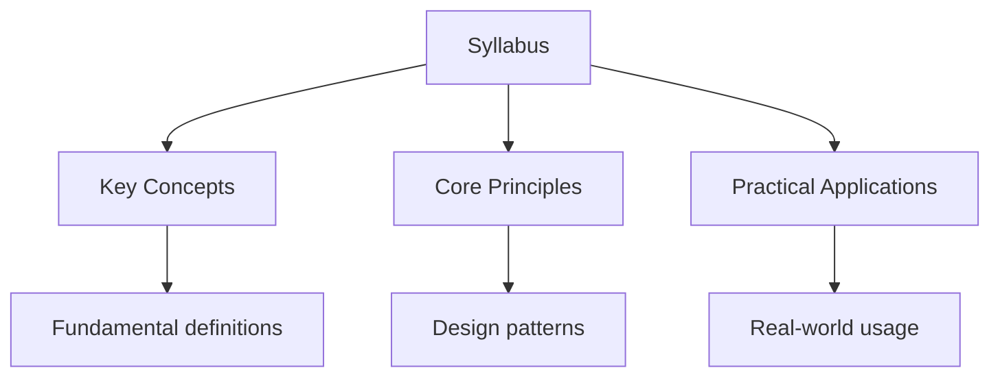

---

date: 2026-07-23T21:57:32+01:00
title: "Syllabus | IB - Wyatt's Notes"
description: "First assessment 2025. The course is organized into five core themes studied at both Standard Level (SL) and Higher Level (HL), plus an HL Extension with"
---

<!-- Breadcrumb Schema for SEO -->

## IB Computer Science Syllabus Overview

First assessment 2025. The course is organized into five core themes studied at both Standard Level
(SL) and Higher Level (HL), plus an HL Extension with three additional topics.

## Syllabus Content

### Theme 1: System Design

| Topic                     | Level | Key Understanding                                                                                                                                                                 | Relevant Concepts                                                                                                                                                                                                          |
| ------------------------- | ----- | --------------------------------------------------------------------------------------------------------------------------------------------------------------------------------- | -------------------------------------------------------------------------------------------------------------------------------------------------------------------------------------------------------------------------- |
| 1.1 System design         | SL/HL | Systems thinking principles, stakeholder perspectives, requirements specification, feasibility study, and project management methodologies for designing robust computing systems | Stakeholders, requirements, feasibility study, system specifications, project management (Gantt, PERT, agile, waterfall), prototyping, data flow diagrams (DFDs), system flowcharts, use case diagrams, process flowcharts |
| 1.1 System design (HL)    | HL    | Extended system design including human-computer interaction, social and ethical considerations, and system integration complexities                                               | Human-computer interaction (HCI) principles, usability, accessibility, system integration, legacy systems, social and ethical considerations                                                                               |
| 1.2 Computer architecture | SL/HL | Structure and function of processors, memory hierarchy, and the fetch-decode-execute cycle that underpins all computation                                                         | CPU components (ALU, CU, registers, buses), fetch-decode-execute cycle, RAM, ROM, cache, virtual memory, secondary storage, embedded systems, von Neumann architecture, Harvard architecture, parallel processing          |
| 1.3 Boolean logic         | SL/HL | Application of Boolean algebra and truth tables to model and simplify digital logic circuits                                                                                      | Boolean operators (AND, OR, NOT, NAND, NOR, XOR, XNOR), truth tables, logic gates, Karnaugh maps, Boolean identities, De Morgan"s laws, simplification of expressions                                                      |

System design focuses on how computing systems are planned, analyzed, and constructed to meet
Specified requirements. Students learn to identify all relevant stakeholders, gather both functional
And non-functional requirements, and evaluate the feasibility of proposed solutions across
Technical, economic, and operational dimensions. Project management methodologies such as Gantt
Charts, PERT charts, and agile/waterfall models are used to plan and coordinate system development
Timelines. Visual modeling tools including data flow diagrams (DFDs), system flowcharts, use case
Diagrams, and process flowcharts are employed to communicate design decisions .

At HL, system design extends to include human-computer interaction (HCI) principles, covering
Usability heuristics, accessibility standards, and user experience design. Students consider the
Challenges of system integration, particularly when incorporating legacy systems, and evaluate
Social and ethical considerations such as privacy, intellectual property, digital divide, and the
Environmental impact of computing systems.

Computer architecture covers the internal structure of processors and the fetch-decode-execute
Cycle. Students examine the von Neumann and Harvard architectures in depth, understand the role of
The arithmetic logic unit (ALU), control unit (CU), registers (PC, MAR, MDR, CIR, accumulator), and
System buses (data, address, control). The memory hierarchy from registers and cache (L1, L2, L3) to
RAM, ROM, and secondary storage devices (HDD, SSD, optical) is explored. Embedded systems and the
Principles of parallel processing (multi-core, GPU computing) are also considered.

Boolean logic provides the mathematical foundation for digital circuits. Students construct truth
Tables for expressions with up to four variables, apply Boolean identities and De Morgan's laws to
Simplify expressions, and use Karnaugh maps for systematic optimization. Understanding of AND, OR,
NOT, NAND, NOR, XOR, and XNOR gates is essential for analyzing and designing combinatorial logic
Circuits.

### Theme 2: Computational Thinking

| Topic                      | Level | Key Understanding                                                                                                                                 | Relevant Concepts                                                                                                                                                                                     |
| -------------------------- | ----- | ------------------------------------------------------------------------------------------------------------------------------------------------- | ----------------------------------------------------------------------------------------------------------------------------------------------------------------------------------------------------- |
| 2.1 Computational thinking | SL/HL | Systematic approaches to problem decomposition, pattern recognition, abstraction, and algorithm design as foundational problem-solving strategies | Decomposition, pattern recognition, abstraction, algorithmic thinking, flowcharts, pseudocode, Nassi-Shneiderman diagrams, tracing algorithms                                                         |
| 2.2 Algorithms             | SL/HL | Design, analysis, and comparison of standard algorithms for searching, sorting, and other common computational tasks                              | Linear search, binary search, bubble sort, selection sort, insertion sort, algorithm efficiency, Big-O notation (time and space complexity), best/average/worst case, recursion, recursive algorithms |
| 2.3 Data structures        | SL/HL | Static and dynamic data structures for organizing, storing, and manipulating data in programs                                                     | Arrays (1D and 2D), records/structs, sets, linked lists, stacks, queues, trees (binary search trees), hash tables, comparison of structures, appropriate selection                                    |

Computational thinking is the cornerstone of the course and is assessed throughout all papers.
Students practice four key techniques:

- **Decomposition** -- breaking complex problems into manageable sub-problems
- **Pattern recognition** -- identifying similarities and trends within or across problems
- **Abstraction** -- filtering out irrelevant details to focus on essential features
- **Algorithmic thinking** -- developing precise, step-by-step solutions

Flowcharts, pseudocode, and Nassi-Shneiderman diagrams are the standard notations used to represent
Algorithms. Students must be able to trace through algorithms with test data and predict outputs.

The algorithms topic covers fundamental searching and sorting algorithms. Students learn to
Implement and trace linear search (O(n)) and binary search (O(log n)), as well as bubble sort
(O(n^2)), selection sort (O(n^2)), and insertion sort (O(n^2)). Algorithm efficiency is analyzed
Using Big-O notation, distinguishing between best-case, average-case, and worst-case performance for
Time and space complexity. Recursive algorithms and their base cases are introduced alongside
Iterative alternatives, with students expected to understand the call stack and how recursion is
Resolved.

Data structures at the SL/HL level include static structures such as one-dimensional and
Two-dimensional arrays, records (structs), and sets, as well as dynamic structures including singly
And doubly linked lists, stacks (LIFO), queues (FIFO), binary search trees, and hash tables.
Students evaluate the trade-offs between different structures in terms of access time, insertion,
Deletion, searching, and memory usage, and must justify their choice of data structure for a given
Problem.

### Theme 3: Programming

| Topic                | Level | Key Understanding                                                                                                                        | Relevant Concepts                                                                                                                                                                                                                                                                                                                  |
| -------------------- | ----- | ---------------------------------------------------------------------------------------------------------------------------------------- | ---------------------------------------------------------------------------------------------------------------------------------------------------------------------------------------------------------------------------------------------------------------------------------------------------------------------------------- |
| 3.1 Programming      | SL/HL | Fundamental programming constructs, paradigms, and methodologies for writing correct and efficient code                                  | Variables, constants, data types, operators, control structures (sequence, selection, iteration), procedures, functions, parameter passing (by value, by reference), return values, modularity, programming paradigms (procedural, object-oriented, functional), IDE features, debugging, testing, exception handling, error types |
| 3.1 Programming (HL) | HL    | Advanced programming topics including concurrent processing, abstract data types, and further algorithm design                           | Concurrency, parallel processing, multi-threading, synchronization, deadlock, race conditions, advanced recursion                                                                                                                                                                                                                  |
| 3.2 Abstraction      | SL/HL | The use of abstraction to manage complexity, including models, data abstraction, and the separation of specification from implementation | Conceptual vs. Physical models, data abstraction, procedural abstraction, classes as abstractions, APIs, information hiding, encapsulation, top-down design, stepwise refinement                                                                                                                                                   |
| 3.3 Data management  | SL/HL | Principles of database design, data modeling, and query languages for efficient data storage, retrieval, and manipulation                | Relational databases, entity-relationship diagrams (ERDs), normalization (1NF, 2NF, 3NF), SQL (DDL, DML, queries, joins, subqueries), primary keys, foreign keys, referential integrity, transaction management (ACID), indexing, data dictionaries, big data concepts                                                             |

The programming theme covers fundamental constructs common to most imperative languages:

- Variables, constants, and data types (integer, real, Boolean, char, string)
- Operators (arithmetic, relational, logical, bitwise)
- Control structures for sequence, selection (IF, CASE), and iteration (WHILE, FOR, REPEAT...UNTIL)
- Procedures and functions for modularity and code reuse
- Parameter passing by value and by reference, local and global variable scope

Students should understand the differences between programming paradigms including procedural,
Object-oriented, and functional approaches.

Abstraction is explored as a strategy for managing complexity in software systems. Conceptual and
Physical models are contrasted, and students learn how data abstraction and procedural abstraction
Reduce coupling between components. Classes serve as abstractions that encapsulate state
(attributes) and behavior (methods). Application programming interfaces (APIs) and information
Hiding demonstrate how specification is separated from implementation. Top-down design and stepwise
Refinement are applied as structured approaches to program development.

Data management introduces relational database design using entity-relationship diagrams (ERDs) to
Model entities, attributes, relationships (one-to-one, one-to-many, many-to-many), and cardinality.
Normalization to 1NF, 2NF, and 3NF eliminates redundancy and dependency anomalies. Students write
SQL statements for DDL (CREATE, ALTER, DROP) and DML (INSERT, UPDATE, DELETE, SELECT with JOIN,
GROUP BY, HAVING, ORDER BY, and subqueries). Transaction management, ACID properties, indexing, and
Data dictionaries are covered alongside an introduction to big data concepts (volume, velocity,
Variety, veracity).

### Theme 4: Networks

| Topic                 | Level | Key Understanding                                                                                  | Relevant Concepts                                                                                                                                                                                                                                                                                              |
| --------------------- | ----- | -------------------------------------------------------------------------------------------------- | -------------------------------------------------------------------------------------------------------------------------------------------------------------------------------------------------------------------------------------------------------------------------------------------------------------- |
| 4.1 Networks          | SL/HL | Architecture, topologies, protocols, and security mechanisms of computer networks and the internet | LAN, WAN, WLAN, network topologies (star, bus, ring, mesh), client-server vs. Peer-to-peer, OSI model (7 layers), TCP/IP model, protocols (TCP, UDP, HTTP, HTTPS, FTP, SMTP, POP, IMAP, DNS, DHCP, ARP, IP), IP addressing (IPv4, IPv6), subnetting, NAT, MAC addressing, routing algorithms, network hardware |
| 4.1 Networks (HL)     | HL    | Advanced networking concepts including network security, encryption, and cloud computing           | Encryption (symmetric, asymmetric), digital certificates, PKI, VPN, firewalls, IDS/IPS, cloud computing models (IaaS, PaaS, SaaS), load balancing, quality of service (QoS), network troubleshooting                                                                                                           |
| 4.2 Data transmission | SL/HL | Methods and principles of data transmission including signal types, protocols, and error detection | Analog vs. Digital signals, bit rate, baud rate, bandwidth, latency, synchronous vs. Asynchronous transmission, serial vs. Parallel transmission, simplex, half-duplex, full-duplex, multiplexing (FDM, TDM, STDM), error detection (parity check, checksum, CRC, Hamming code), error correction              |

Networks introduces the architecture, operation, and security of computer networks. Students study
LAN, WAN, and WLAN configurations, compare network topologies (star, bus, ring, mesh, hybrid), and
Distinguish between client-server and peer-to-peer models. The OSI seven-layer model (Physical, Data
Link, Network, Transport, Session, Presentation, Application) and the four-layer TCP/IP model
Provide frameworks for understanding protocol stacks and the process of encapsulation.

Key protocols include TCP (connection-oriented, reliable), UDP (connectionless, fast), HTTP/HTTPS
(web), FTP (file transfer), SMTP/POP/IMAP (email), DNS (name resolution), DHCP (address assignment),
ARP (address resolution), and IP (routing). IP addressing covers both IPv4 (32-bit, classes A-D,
Subnet masks, CIDR) and IPv6 (128-bit), along with NAT, MAC addressing, and routing algorithms.
Network hardware components include routers, switches, hubs, bridges, gateways, repeaters, and NICs.

At HL, network security concepts are extended to include symmetric encryption (AES, DES), asymmetric
Encryption (RSA), digital certificates, public key infrastructure (PKI), virtual private networks
(VPN), firewalls, intrusion detection/prevention systems (IDS/IPS), and cloud computing service
Models (IaaS, PaaS, SaaS).

Data transmission covers the physical characteristics of signal transmission:

- Analog vs. Digital signals and conversion (ADC, DAC)
- Bit rate, baud rate, bandwidth, and latency
- Synchronous vs. Asynchronous transmission
- Serial vs. Parallel transmission
- Simplex, half-duplex, and full-duplex communication modes
- Multiplexing techniques (FDM, TDM, STDM)
- Error detection (parity bits, checksums, CRC, Hamming codes) and correction

### Theme 5: Computational Mathematics

| Topic                      | Level | Key Understanding                                                                                                  | Relevant Concepts                                                                                                                                                                                                                                                                    |
| -------------------------- | ----- | ------------------------------------------------------------------------------------------------------------------ | ------------------------------------------------------------------------------------------------------------------------------------------------------------------------------------------------------------------------------------------------------------------------------------ |
| 5.1 Number systems         | SL/HL | Representation and conversion between number systems used in computing, and the handling of numeric data           | Binary, denary, hexadecimal, octal, conversions between bases, binary addition, subtraction (two's complement), representation of integers (signed magnitude, two's complement), representation of real numbers (floating point, IEEE 754), character encoding (ASCII, Unicode), BCD |
| 5.2 Computational thinking | SL/HL | Mathematical foundations underpinning computational thinking including number theory, sequences, and combinatorics | Number theory (prime numbers, GCD, LCM), modular arithmetic, sequences and series, combinatorics (permutations, combinations), pigeonhole principle, mathematical induction, proof by contradiction                                                                                  |
| 5.3 Logic gates            | SL/HL | Design and analysis of digital circuits using logic gates and Boolean expressions                                  | Logic gate diagrams, truth table construction from circuits, circuit simplification, half adder, full adder, multiplexers, flip-flops, D-type flip-flops, sequential logic, clock signals                                                                                            |

Number systems covers binary, denary (decimal), hexadecimal, and octal representations and
Conversions between them. Students perform binary arithmetic including addition, subtraction using
Two's complement, and multiplication. Integer representation methods (signed magnitude, one's
Complement, two's complement) and floating-point representation following the IEEE 754 standard
(sign bit, exponent, mantissa) are studied. Character encoding standards including ASCII (7-bit,
Extended 8-bit) and Unicode (UTF-8, UTF-16, UTF-32) are examined, along with binary-coded decimal
(BCD).

Computational thinking as a mathematical topic introduces:

- Number theory (prime numbers, GCD via Euclidean algorithm, LCM)
- Modular arithmetic (mod operations, congruence relations)
- Arithmetic and geometric sequences and series (including sigma notation)
- Combinatorics including permutations (nPr) and combinations (nCr)
- The pigeonhole principle
- Mathematical induction and proof by contradiction

Logic gates extends Boolean logic into practical circuit design. Students construct logic gate
Diagrams from Boolean expressions, derive truth tables for combinatorial circuits, and simplify
Circuits using Boolean algebra. Sequential logic is introduced through D-type flip-flops, clock
Signals, latches, and the design of arithmetic circuits including half adders and full adders.
Multiplexers and demultiplexers as combinational selection circuits are also covered.

### HL Extension

| Topic                    | Level | Key Understanding                                                                                         | Relevant Concepts                                                                                                                                                                                    |
| ------------------------ | ----- | --------------------------------------------------------------------------------------------------------- | ---------------------------------------------------------------------------------------------------------------------------------------------------------------------------------------------------- |
| Abstract data structures | HL    | Implementation and application of advanced data structures for efficient problem solving                  | Stacks, queues, linked lists, binary trees, BSTs, balanced trees (AVL), priority queues, heaps, graphs (adjacency matrix/list), Dijkstra's algorithm, minimum spanning tree (Prim's, Kruskal's)      |
| Resource management      | HL    | Operating system concepts for managing hardware resources including memory, processes, and storage        | Process scheduling (FCFS, round robin, SJF, priority), memory management (paging, segmentation, virtual memory, page replacement: FIFO, LRU), disk scheduling, deadlock, multi-level feedback queues |
| Control (OOP)            | HL    | Object-oriented programming principles and their role in software design, including advanced OOP concepts | Classes, objects, encapsulation, inheritance, polymorphism, abstraction, UML class diagrams, design patterns, SOLID principles                                                                       |

The HL extension deepens understanding in three areas exclusive to Higher Level students.

**Abstract data structures** requires students to implement and reason about stacks, queues, linked
Lists (singly and doubly), binary search trees, balanced trees (AVL trees with rotations), priority
Queues, heaps (min-heap, max-heap), and graphs. Graph algorithms including Dijkstra's shortest path
Algorithm and minimum spanning tree algorithms (Prim's, Kruskal's) are studied, with students
Expected to trace through these algorithms step by step. Both adjacency matrix and adjacency list
Representations are used. Students must justify the selection of data structures based on the
Specific requirements of a problem.

**Resource management** focuses on operating system responsibilities for managing hardware
Resources:

- Process scheduling (FCFS, round robin, SJF, priority) compared by throughput, turnaround time,
  waiting time, and response time
- Memory management covering paging, segmentation, virtual memory, and page replacement (FIFO, LRU)
- Disk scheduling algorithms (FCFS, SSTF, SCAN, C-SCAN)
- Deadlock conditions (mutual exclusion, hold and wait, no preemption, circular wait), detection,
  prevention, and avoidance

**Control through object-oriented programming** covers the principles of classes and objects,
Encapsulation (access modifiers, getters and setters), inheritance (single and multiple, method
Overriding, super calls), polymorphism (compile-time overloading, runtime overriding via virtual
Methods), and abstraction (abstract classes, interfaces). UML class diagrams model relationships
Including associations, aggregations, compositions, and generalizations. Design patterns (factory,
Observer, singleton) and SOLID principles illustrate advanced OOP design strategies.

## Assessment Components

### Paper 1

A theory paper assessing knowledge and understanding of the syllabus content. Contains a mix of
Short-answer and extended-response questions covering all five themes. Questions may require
Students to explain concepts, compare methodologies, analyze scenarios, and evaluate solutions. HL
Students answer additional questions on the HL Extension topics. Calculators are not permitted.

| Aspect      | SL      | HL                 |
| ----------- | ------- | ------------------ |
| Duration    | 2 hours | 2 hours 15 minutes |
| Total marks | 80      | 100                |
| Weighting   | 45%     | 45%                |

### Paper 2

A paper focused on problem-solving and programming. Includes questions requiring algorithm design,
Pseudocode or flowchart construction, and program tracing. Students may be asked to complete
Pseudocode, trace through algorithms with given test data and input values, predict outputs, and
Suggest modifications to existing solutions. HL students encounter more complex algorithmic
Problems. Calculators are not permitted.

| Aspect      | SL     | HL                |
| ----------- | ------ | ----------------- |
| Duration    | 1 hour | 1 hour 45 minutes |
| Total marks | 45     | 70                |
| Weighting   | 25%    | 25%               |

### Paper 3 (HL only)

An HL-specific paper based on a previously issued case study published by the IB at the start of the
Examination session (approximately 6 months before the exam). The case study describes a real-world
Computational scenario in detail, and students are expected to research and prepare extensively
Before the exam. The paper assesses the application of syllabus content to this scenario, requiring
Extended analysis, evaluation, and synthesis of information. Students must demonstrate depth of
Understanding by connecting multiple topics from across the syllabus to the case study context.

| Aspect      | HL     |
| ----------- | ------ |
| Duration    | 1 hour |
| Total marks | 40     |
| Weighting   | 20%    |

### Internal Assessment (IA)

A computational solution project where students identify a problem for a specified client, design,
Develop, test, and evaluate a software solution. Students must produce a functioning program and
Supporting documentation covering the entire software development lifecycle:

1. **Planning** -- identifying the problem and client, feasibility assessment
2. **Design** -- algorithm design, data structure selection, UI mockups
3. **Development** -- coding the solution with appropriate constructs
4. **Testing** -- test plan, test data, evidence of testing outcomes
5. **Evaluation** -- success criteria, limitations, recommendations for improvement

The project is internally assessed by teachers and externally moderated by the IB. Maximum marks: 34
For both SL and HL. The IA is an individual piece of work and must be the student's own authentic
Work.

| Aspect        | SL  | HL  |
| ------------- | --- | --- |
| Maximum marks | 34  | 34  |
| Weighting     | 30% | 20% |

## SL and HL Comparison

| Aspect              | SL              | HL                                                           |
| ------------------- | --------------- | ------------------------------------------------------------ |
| Teaching hours      | 150             | 240                                                          |
| Themes covered      | 1-5 (core only) | 1-5 plus HL Extension                                        |
| HL Extension topics | Not studied     | Abstract data structures, Resource management, Control (OOP) |
| Paper 3             | Not taken       | Required (case study based)                                  |

## Topic Pages

- [Computer Organization](2-computer-organization/1_computer-organization.md) -- processor
  architecture, memory, and instruction cycle
- [Networks](3-networks/1_networks.md) -- network models, protocols, and data transmission
- [System Design](1-system-fundamentals/1_system-design.md) -- system planning, stakeholder
  analysis, and design methodologies
- [System in Organization](1-system-fundamentals/2_system-organization.md) -- systems in context,
  integration, and organizational impact
- [OOP / Java](8-object-oriented-programming/1_object-oriented-programming.md) -- object-oriented
  programming concepts and Java-specific notes

## Common Pitfalls

1. Mixing up Big O, Big $\Omega$, and Big $\Theta$ notation. Big O is an upper bound, not
   necessarily tight.

2. Forgetting edge cases in algorithm design (e.g., empty input, single element, already sorted
   data).

3. Forgetting that $O(n \log n)$ average-case for quicksort becomes $O(n^2)$ worst-case on already
   sorted input.

4. Writing pseudocode that is too language-specific rather than using standard algorithmic
   constructs.

## Summary

The key principles covered in this topic are linked in the sub-pages above. Focus on understanding
the definitions, applying the formulas or frameworks, and evaluating strengths and limitations of
each approach.

## Worked Examples

Worked examples demonstrating the application of key concepts are covered in the detailed sub-pages
linked above.

## Cross-References

- **[System Fundamentals](../computer-science/flashcards-system-fundamentals):** The syllabus covers fundamentals
- **[Algorithms](../computer-science/flashcards-algorithms-data-structures):** Algorithms are a major component
- **[Networking](../computer-science/flashcards-networks-databases):** Networks are included

---

<!-- Breadcrumb Schema for SEO -->

## Intuition

The IB Computer Science syllabus is a roadmap of what you need to know. It's organised into five themes, each building on the previous one. System Design is about planning and building systems that work. Computational Thinking is about solving problems with algorithms. Data and Information is about storing and managing data efficiently. Networking and Cybersecurity is about connecting systems and keeping them safe. Programming is about implementing everything else in code.

The HL extension goes deeper into resource management (how CPUs and memory work), control (how programs flow), and modelling (how we represent real-world systems in code). Think of the syllabus as a hierarchy: you start with the basics (what is a computer, what is an algorithm), then build up to complex systems (networks, databases, OOP). Each topic connects to the others — you can't understand databases without understanding data structures, and you can't understand networking without understanding protocols.

## Common Mistakes

1. **Focusing only on HL content and neglecting SL foundations.** The HL extension builds directly on SL topics. If your understanding of SL algorithms, data structures, or networking is weak, the HL material on resource management, control, and modelling will be incomprehensible. Master the SL content before tackling HL extensions.

2. **Memorising without understanding.** The IB rewards application and evaluation, not rote recall. Memorising definitions of "abstraction" or "decomposition" without being able to apply them to novel problems will not earn full marks. Practice applying concepts to unfamiliar scenarios.

3. **Ignoring the command terms in exam questions.** "Define," "describe," "explain," and "evaluate" require different depths of response. "Define" means state the meaning precisely. "Explain" means give reasons or causes. "Evaluate" means weigh strengths and weaknesses. Misinterpreting the command term leads to responses that are too shallow or too detailed.

4. **Confusing related concepts across topics.** Abstraction in computational thinking is different from abstraction in object-oriented programming. Data structures in Topic 3 are different from data representation in Topic 1. Keep concepts separated by topic and understand the specific context in which each is used.

5. **Neglecting practical programming skills.** The internal assessment requires a working program. Many students focus on written exams and leave programming practice until too late. Write code regularly throughout the course, not just before the IA deadline.
