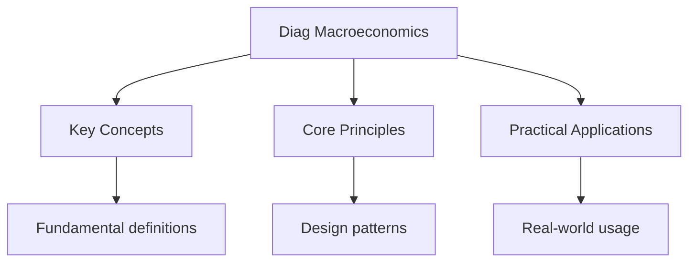

---

date: 2026-07-23T21:57:32+01:00
title: "Diagnostic Test: Macroeconomics"
description: "Diagnostic test notes for ib Diagnostic Test: Macroeconomics covering key concepts, worked examples, and practice problems for exam preparation."
tableOfContents: false
sidebar_position: 40
---

<!-- Breadcrumb Schema for SEO -->

## Diagnostic Test: Macroeconomics

**Instructions:** Attempt each question without referring to notes. Select the best answer from the four options provided. After completing all questions, check your answers against the key below.

---

<!-- Breadcrumb Schema for SEO -->

## Questions

**1.** Which of the following is a component of Aggregate Demand?

(A) Savings
(B) Government spending
(C) Imports
(D) Tax revenue

**2.** A government increases spending by $50 billion while tax revenue remains unchanged. If the marginal propensity to consume is 0.75, what is the maximum expected change in national income?

(A) $50 billion
(B) $125 billion
(C) $200 billion
(D) $37.5 billion

**3.** Which type of unemployment results from a mismatch between the skills of workers and the requirements of available jobs?

(A) Frictional unemployment
(B) Structural unemployment
(C) Cyclical unemployment
(D) Seasonal unemployment

**4.** The central bank raises interest rates primarily to:

(A) Increase the rate of economic growth
(B) Reduce the level of unemployment
(C) Control inflation
(D) Depreciate the exchange rate

**5.** Cost-push inflation is most likely caused by:

(A) An increase in consumer spending
(B) A rise in raw material prices
(C) An expansion of the money supply
(D) A decrease in income tax rates

**6.** According to the Phillips curve, in the short run there is a trade-off between:

(A) Economic growth and exchange rate stability
(B) Unemployment and inflation
(C) Exports and imports
(D) Government spending and taxation

**7.** A country runs a current account deficit. This can be financed by:

(A) A surplus on the capital account
(B) Reducing government spending
(C) Decreasing the money supply
(D) Lowering interest rates

**8.** The Marshall-Lerner condition states that a currency devaluation will improve the trade balance if:

(A) The sum of PED for exports and imports is less than 1
(B) The sum of PED for exports and imports is greater than 1
(C) The exchange rate is fixed
(D) Inflation is below the target rate

**9.** Which of the following is an automatic stabiliser?

(A) A one-off stimulus payment
(B) A progressive income tax system
(C) A change in the base interest rate
(D) A government infrastructure programme

**10.** Real GDP differs from nominal GDP because real GDP:

(A) Includes the informal economy
(B) Is adjusted for inflation using constant prices
(C) Measures only goods, not services
(D) Excludes government spending

---

<!-- Breadcrumb Schema for SEO -->

## Intuition

**Macroeconomics is like reading the economy's vital signs — GDP, inflation, and unemployment reveal the health of the system:** Macroeconomic variables are interconnected — policies affecting one often have ripple effects across the economy

**Why it matters:** Understanding macroeconomics is essential for evaluating government policy and economic forecasts

**The key insight:** Macroeconomic variables are interconnected — policies affecting one often have ripple effects across the economy

## Answer Key

| Question | Answer | Topic                    |
| :------: | :----: | :----------------------- |
|    1     |  (B)   | Aggregate Demand         |
|    2     |  (C)   | Multiplier Effect        |
|    3     |  (B)   | Unemployment             |
|    4     |  (C)   | Monetary Policy          |
|    5     |  (B)   | Inflation                |
|    6     |  (B)   | Phillips Curve           |
|    7     |  (A)   | Balance of Payments      |
|    8     |  (B)   | Exchange Rates           |
|    9     |  (B)   | Fiscal Policy            |
|    10    |  (B)   | GDP Measurement          |

---

<!-- Breadcrumb Schema for SEO -->

## Explanations

**1. (B)** AD = C + I + G + (X - M). Government spending (G) is a direct component. Savings are a leakage from the circular flow; imports and tax revenue are not components of AD.

**2. (C)** The multiplier k = 1 / (1 - MPC) = 1 / (1 - 0.75) = 4. Maximum change in national income = initial injection x multiplier = $50 billion x 4 = $200 billion.

**3. (B)** Structural unemployment arises when there is a mismatch between workers' skills, location, or experience and the jobs available. It is often caused by technological change, deindustrialisation, or globalisation.

**4. (C)** Raising interest rates increases the cost of borrowing, which reduces consumption and investment, thereby reducing aggregate demand and easing inflationary pressure.

**5. (B)** Cost-push inflation occurs when production costs rise, causing firms to raise prices. Increases in raw material prices, wages, or indirect taxes are typical causes.

**6. (B)** The short-run Phillips curve shows an inverse relationship between unemployment and inflation, implying policymakers face a trade-off between the two.

**7. (A)** A current account deficit must be offset by a surplus on the capital and financial account (through borrowing, selling assets, or drawing down reserves).

**8. (B)** When |PEDx + PEDm| > 1, the volume effect of devaluation (more exports, fewer imports) outweighs the price effect, improving the trade balance.

**9. (B)** Progressive income taxes automatically stabilise the economy: during expansion, rising incomes push taxpayers into higher brackets, dampening demand; during contraction, falling incomes reduce tax burdens, cushioning the fall in demand.

**10. (B)** Real GDP is adjusted for inflation by using constant base-year prices, allowing meaningful comparison of output across different time periods. Nominal GDP uses current prices and can rise due to inflation alone.

## Common Mistakes

**Confusing nominal with real values:** Nominal values are in current prices. Real values are adjusted for inflation. Real GDP growth shows actual output changes, not just price changes.

**Mixing up fiscal and monetary policy:** Fiscal policy is government spending/taxation (controlled by government). Monetary policy is interest rates/money supply (controlled by central bank). Don't confuse who controls what.

**Assuming trade deficits are always bad:** A trade deficit means importing more than exporting. It can be sustainable if funded by investment inflows. Don't automatically equate deficits with problems.

## Cross-References

- **[Fiscal Policy](../2-macroeconomics/2-fiscal-policy):** Macroeconomics covers fiscal policy
- **[National Income](../2-macroeconomics/1-national-income):** GDP is a macro indicator
- **[Exchange Rates](../3-international-economics/2-exchange-rates):** Exchange rates are macro variables
