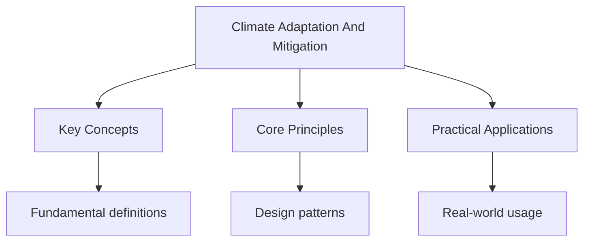

---

date: 2026-07-23T21:57:32+01:00
title: Climate Adaptation and Mitigation
description: "refers to actions that reduce the sources or enhance the sinks of greenhouse gases, Thereby reducing the magnitude of future climate change. Mitigation"

---

<!-- Breadcrumb Schema for SEO -->

## Climate Adaptation and Mitigation

## Intuition

**Adaptation is like building an ark before the flood — preparing for climate impacts we can no longer avoid:** Climate action requires both mitigation (reducing emissions) and adaptation (preparing for impacts) — neither alone is sufficient

**Why it matters:** Balancing adaptation and mitigation strategies is essential for protecting communities and ecosystems from climate change

**The key insight:** Climate action requires both mitigation (reducing emissions) and adaptation (preparing for impacts) — neither alone is sufficient

## Distinguishing Adaptation and Mitigation

**Mitigation** refers to actions that reduce the sources or enhance the sinks of greenhouse gases,
Thereby reducing the magnitude of future climate change. Mitigation addresses the causes of climate
Change.

**Adaptation** refers to adjustments in ecological, social, or economic systems in response to
Actual or expected climate stimuli and their effects. Adaptation addresses the consequences of
Climate change.

Both are necessary. Even under the most ambitious mitigation scenarios, some degree of additional
Warming and its associated impacts are already locked in due to the thermal inertia of the climate
System and the long atmospheric lifetime of $\mathrm{CO_2}$. Adaptation is therefore required
Regardless of mitigation efforts.

## Mitigation Strategies

### Energy Sector

The energy sector (electricity generation, heat, and transport) accounts for approximately 73% of
Global greenhouse gas emissions. Mitigation in this sector involves:

**Renewable energy deployment.** Replacing fossil fuel generation with renewable sources (solar,
Wind, hydroelectric, geothermal, biomass).

- **Solar photovoltaic (PV):** global installed capacity exceeded 1200 GW in 2023. The cost of solar
  PV has declined by approximately 90% since 2010, reaching approximately USD 0.05 per kWh in
  optimal locations, making it the cheapest source of new electricity in most of the world.
- **Wind energy:** global installed capacity exceeded 1000 GW in 2023 (approximately 740 GW onshore,
  260 GW offshore). Offshore wind is expanding rapidly, with the UK (approximately 14 GW), China
  (approximately 38 GW), and Germany leading installation.
- **Limitations:** intermittency (solar and wind generation vary with weather and time of day);
  energy storage requirements; land-use conflicts; grid integration challenges; supply chain
  constraints for critical minerals (lithium, cobalt, rare earth elements).

**Nuclear energy.** Nuclear provides approximately 10% of global electricity from approximately 440
Reactors. It is a low-carbon baseload source but faces challenges: high capital cost (approximately
USD 5000--10 000 per kW), long construction times ( 8--12 years), radioactive waste Disposal, and
public safety concerns following the Chernobyl (1986) and Fukushima (2011) accidents.

**Energy efficiency.** Reducing energy consumption per unit of economic output or per unit of
Service delivered. Key measures include: building energy codes (requiring improved insulation,
Efficient windows, heat pumps); fuel efficiency standards for vehicles; industrial energy
Management; efficient lighting (LED technology has reduced global lighting electricity consumption
By approximately 15% since 2010).

### Land Use, Forestry, and Agriculture

This sector accounts for approximately 18--22% of global greenhouse gas emissions (including
Deforestation and land-use change).

**Reducing deforestation.** Halting tropical deforestation (which releases approximately 4.8 Gt
$\mathrm{CO_2}$ per year) is among the most cost-effective mitigation strategies. Approaches
Include: strengthening and enforcing forest protection laws; providing economic alternatives to
Deforestation (sustainable agriculture, ecotourism, payment for ecosystem services); addressing the
Demand-side drivers of deforestation (soy, palm oil, beef, timber); and REDD+ (see Carbon Cycle and
Sequestration).

**Afforestation and reforestation.** Establishing forests on previously non-forested land or
Replanting degraded forests can sequester carbon while providing biodiversity, watershed protection,
And livelihood co-benefits. The Bonn Challenge (2011) aims to restore 350 million hectares of
Degraded and deforested land by 2030; approximately 200 million hectares have been pledged.

**Sustainable agriculture.** Reducing agricultural emissions through improved nitrogen management
(precision fertiliser application to reduce $\mathrm{N_2}\mathrm{O}$ emissions), improved livestock
Management (feed additives, manure management to reduce $\mathrm{CH_4}$), reduced food waste
(approximately 30% of food produced globally is wasted, representing approximately 8% of global
Emissions), and dietary shifts (reducing meat consumption, particularly beef, which has a carbon
Footprint approximately 50 times greater than plant-based protein per gram of protein).

### Transport

The transport sector accounts for approximately 16% of global emissions.

**Electric vehicles (EVs).** EV sales exceeded 14 million globally in 2023, representing
Approximately 18% of total car sales. Norway leads with approximately 90% of new car sales being
Electric; China and the EU are rapidly expanding. EVs produce zero tailpipe emissions but the net
Carbon benefit depends on the electricity grid mix (EVs charged on coal-generated electricity have a
Higher lifecycle carbon footprint than those charged on renewable electricity).

**Public transport and active travel.** Investing in efficient public transport (bus rapid transit,
Metro, rail) and infrastructure for walking and cycling can reduce per-capita transport emissions by
Reducing car dependence. The IPCC estimates that shifting urban trips from cars to public transport
And active travel could reduce transport emissions by approximately 20--40% in cities.

**Sustainable aviation fuels (SAF).** Aviation is one of the hardest sectors to decarbonise because
Of its high energy density requirements. SAFs, produced from biomass or synthetic processes
(power-to-liquid), can reduce aviation lifecycle emissions by approximately 50--80%, but are
Currently expensive (2--4 times the cost of conventional jet fuel) and limited in supply.

## Adaptation Strategies

### Agricultural Adaptation

Climate change poses severe risks to food security through altered precipitation patterns, increased
Temperature stress, increased pest and disease pressure, and increased frequency of extreme events
(droughts, floods, heat waves).

| Strategy                                | Description                                                                                                  | Example                                                                                                                         |
| --------------------------------------- | ------------------------------------------------------------------------------------------------------------ | ------------------------------------------------------------------------------------------------------------------------------- |
| **Drought-resistant crop varieties**    | Breeding or genetic modification of crops to tolerate heat and water stress                                  | Drought-tolerant maize varieties developed by CGIAR centres for Sub-Saharan Africa; salt-tolerant rice varieties for Bangladesh |
| **Conservation agriculture**            | Minimum tillage, crop residue retention, crop rotation to improve soil moisture retention and reduce erosion | Widely adopted in Brazil, Argentina, and Australia                                                                              |
| **Irrigation expansion and efficiency** | Expanding irrigated area; shifting from flood to drip irrigation to reduce water use                         | Drip irrigation adoption in India has increased water-use efficiency by 40--60%                                                 |
| **Adjusted planting dates**             | Shifting sowing and harvesting dates to match changing seasonal patterns                                     | Farmers in the Sahel shifting planting dates earlier to take advantage of changing onset of rains                               |
| **Crop diversification**                | Reducing reliance on a single crop to spread climate risk                                                    | Promoting millet and sorghum alongside maize in southern Africa                                                                 |

### Infrastructural Adaptation

| Strategy                             | Description                                                                    | Example                                                                                                                                                                                                        |
| ------------------------------------ | ------------------------------------------------------------------------------ | -------------------------------------------------------------------------------------------------------------------------------------------------------------------------------------------------------------- |
| **Sea walls and coastal defences**   | Hard engineering structures to protect against sea level rise and storm surges | Netherlands Delta Programme (EUR 20+ billion); MOSE barrier in Venice (EUR 5.5 billion)                                                                                                                        |
| **Flood-resistant infrastructure**   | Designing buildings, roads, and utilities to withstand flooding                | Bangladesh"s elevated schools and cyclone shelters; floating housing in the Netherlands                                                                                                                        |
| **Improved drainage**                | Upgrading urban drainage systems to handle increased rainfall intensity        | Sustainable Urban Drainage Systems (SUDS) in UK cities; Tokyo's underground floodwater storage (the Metropolitan Area Outer Underground Discharge Channel, completed 2006, stores 670 000 m$^3$ of floodwater) |
| **Climate-resilient building codes** | Updating construction standards to account for projected climate conditions    | Caribbean building codes for hurricane resistance; Japan's earthquake and tsunami-resistant standards                                                                                                          |

### Community-Based Adaptation

Community-based adaptation (CBA) involves local communities in identifying, designing, and
Implementing adaptation strategies. It is grounded in the recognition that local communities possess
Detailed knowledge of their environmental conditions and vulnerabilities, and that adaptation is
More effective and equitable when communities are active participants rather than passive
Recipients.

**Characteristics of CBA:**

- Focus on the most vulnerable communities (often those with the least resources and political
  influence).
- Emphasis on local knowledge and participatory decision-making.
- Integration of indigenous and traditional knowledge with scientific knowledge.
- Attention to gender, ethnicity, and social inequality in vulnerability and adaptive capacity.

**Case study: Bangladesh.** Bangladesh's community-based adaptation programmes are widely regarded
As models of good practice. The Comprehensive Disaster Management Programme (CDMP) trains local
Communities in flood preparedness, early warning dissemination, first aid, and evacuation
Procedures. The Union Disaster Management Committees (UDMCs) at the village level develop local risk
Reduction plans and coordinate community responses. Floating agriculture (baira) allows communities
To continue cultivation during seasonal flooding. These programmes have significantly reduced
Cyclone mortality: Cyclone Bhola (1970) killed approximately 300 000--500 000 people; Cyclone Sidr
(2007) killed approximately 3400, despite being of similar magnitude, thanks to improved early
Warning and preparedness.

## International Climate Governance

### The Paris Agreement (2015)

The Paris Agreement, adopted by 196 parties at COP21, is the primary international framework for
Climate action.

**Key features:**

- **Temperature goals:** hold the increase in global average temperature to "well below 2$^\circ$C"
  above pre-industrial levels, while pursuing efforts to limit it to 1.5$^\circ$C.
- **Nationally Determined Contributions (NDCs):** each party submits its own climate pledge,
  specifying its emission reduction targets, adaptation priorities, and support needs. NDCs are
  updated every five years, with a "ratchet mechanism" requiring each successive submission to be
  more ambitious than the previous one.
- **Global Stocktake:** a periodic assessment of collective progress toward the Agreement's goals.
  The first Global Stocktake concluded at COP28 (2023), finding that current NDCs are insufficient
  to meet the temperature goals.
- **Climate finance:** developed countries committed to mobilising USD 100 billion per year in
  climate finance for developing countries. This target was reportedly met in 2022 (two years late),
  but much of this finance was in the form of loans rather than grants.

### Assessment of the Paris Agreement

**Strengths:** universal participation (unlike the Kyoto Protocol, which only bound developed
Countries); flexibility (countries set their own targets based on national circumstances); the
Ratchet mechanism creates a framework for progressive ambition.

**Weaknesses:** NDCs are voluntary and non-binding; there is no enforcement mechanism for
Non-compliance; current NDCs are insufficient (the UN Environment Programme estimates that full
Implementation of current NDCs would result in warming of approximately 2.5$^\circ$--2.9$^\circ$C by
2100); the USD 100 billion climate finance target is inadequate (developing countries estimate that
Approximately USD 1 trillion per year is needed for both mitigation and adaptation).

### Key COP Outcomes

| COP                         | Year | Key Outcome                                                                                                                                                              |
| --------------------------- | ---- | ------------------------------------------------------------------------------------------------------------------------------------------------------------------------ |
| **COP21 (Paris)**           | 2015 | Paris Agreement adopted                                                                                                                                                  |
| **COP24 (Katowice)**        | 2018 | Paris Rulebook (rules for implementing the Agreement)                                                                                                                    |
| **COP26 (Glasgow)**         | 2021 | Glasgow Climate Pact; completion of Article 6 rules (carbon markets); pledge to phase down unabated coal                                                                 |
| **COP27 (Sharm el-Sheikh)** | 2022 | Establishment of a Loss and Damage Fund                                                                                                                                  |
| **COP28 (Dubai)**           | 2023 | First Global Stocktake; operationalisation of the Loss and Damage Fund (initial pledges approximately USD 700 million); agreement to "transition away from fossil fuels" |

## Case Study: The Netherlands

The Netherlands (26% of land below sea level, 59% flood-prone) exemplifies both adaptation and
Mitigation.

**Adaptation:** the Delta Programme (2010--2050) invests over EUR 20 billion in climate-adaptive
Water management, including strengthening dikes, the Maeslantkering storm surge barrier, and the
Room for the River programme (giving rivers more space to flood safely). The Netherlands is also
Investing in climate-resilient agriculture (water-efficient farming, salt-tolerant crops) and urban
Adaptation (green roofs, permeable surfaces, climate-adaptive building codes).

**Mitigation:** the Netherlands aims to reduce greenhouse gas emissions by 49% by 2030 (relative
To 1990) and by 95% by 2050. Key strategies include: large-scale offshore wind expansion (targeting
21 GW by 2030); a coal phase-out (the last coal plant is to close by 2030); a hydrogen economy
Strategy (green hydrogen produced from offshore wind electrolysis); and a circular economy programme
Targeting 50% reduction in primary raw materials use by 2030.

## Case Study: The Maldives

The Maldives is an archipelago of 1192 coral islands with an average elevation of approximately 1.5
M above sea level, making it one of the world's most vulnerable countries to climate change.

**Adaptation:** construction of artificial islands (Hulhumale, built 2 m above sea level, designed
To accommodate 130 000 residents); sea walls around vulnerable islands; desalination plants to
Address freshwater scarcity from saltwater intrusion; coral reef restoration to maintain coastal
Protection; and advocacy for international climate action (former President Nasheed held an
Underwater cabinet meeting in 2009).

**Mitigation:** the Maldives contributes negligibly to global emissions (approximately 1.2 million
Tonnes $\mathrm{CO_2}$ per year) but has set ambitious targets: achieving net-zero emissions
By 2030. Strategies include: transitioning to solar power (targeting 30% of electricity from solar
By 2030); reducing diesel dependency in electricity generation; and promoting electric vehicle
Adoption.

Common Pitfalls: Presenting Adaptation and Mitigation as Alternatives

Adaptation and mitigation are not alternatives; both are necessary. The IPCC is clear that limiting
Warming to 1.5$^\circ$C requires rapid, deep emission reductions (mitigation) combined with
Large-scale investment in adaptation. Some strategies have both mitigation and adaptation
Co-benefits: mangrove restoration sequesters carbon (mitigation) and provides coastal protection
(adaptation); urban green infrastructure reduces the urban heat island effect (adaptation) and
Sequesters carbon (mitigation). However, not all adaptation strategies have mitigation co-benefits,
And not all mitigation strategies have adaptation co-benefits. Some strategies involve trade-offs:
Air conditioning adapts to heat (adaptation) but increases energy demand and emissions (undermining
Mitigation). When evaluating climate strategies, always consider both mitigation and adaptation
Dimensions and identify co-benefits and trade-offs.

For related topics, see [./atmospheric-systems](./atmospheric-systems) and
[./carbon-cycle-and-sequestration](./carbon-cycle-and-sequestration). The parent topic page is at
[../climate-change](../climate-change).

## Common Pitfalls

1. Misreading the question, particularly with 'hence' vs 'hence or otherwise'. The former requires
   using previous work.

2. Rounding too early in multi-step calculations. Carry full precision through and round only the
   final answer.

3. Forgetting the $+c$ constant of integration in indefinite integrals, or misusing boundary
   conditions in definite integrals.

4. Forgetting to check that solutions satisfy the original equation (especially with squaring both
   sides or dividing by variables).

## Summary

The key principles covered in this topic are linked in the sub-pages above. Focus on understanding
the definitions, applying the formulas or frameworks, and evaluating strengths and limitations of
each approach.

## Worked Examples

Worked examples demonstrating the application of key concepts are covered in the detailed sub-pages
linked above.
