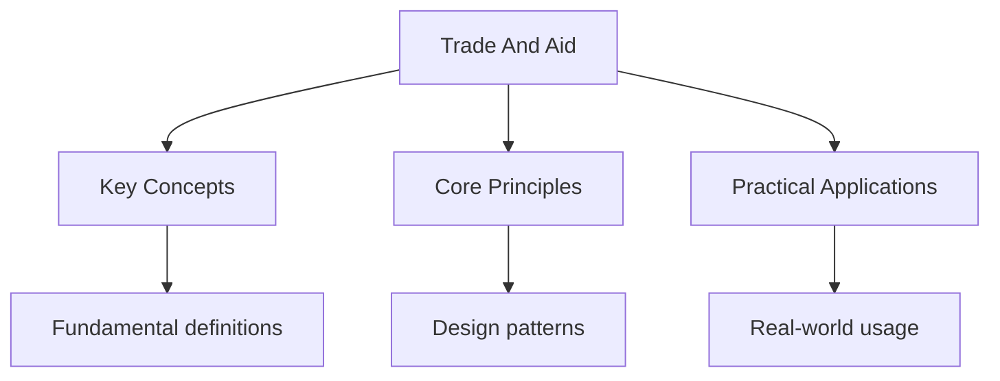

---

date: 2026-07-23T21:57:32+01:00
title: "Trade and Aid | IB - Wyatt's Notes"
description: "\"itemListElement\": [{\"name\": \"Home\", \"url\": \"https://wyattau.com\"}, {\"name\": \"ib\", \"url\": \"https://ib.wyattau.com\"}, {\"name\": \"Geography\", \"url\":"
---

<!-- Breadcrumb Schema for SEO -->

## Trade and Aid

## Intuition

**International trade is like a global potluck — each country brings what it does best and shares with others, ideally making everyone better off:** Trade and aid are powerful tools for development, but their effectiveness depends on fair terms, good governance, and local capacity building

**Why it matters:** Understanding trade relationships and aid effectiveness is crucial for reducing global poverty and inequality

**The key insight:** Trade and aid are powerful tools for development, but their effectiveness depends on fair terms, good governance, and local capacity building

## Trade Patterns and Globalisation

### The Structure of Global Trade

Global trade in goods and services exceeded USD 32 trillion in 2022. The structure of trade is
Characterised by several patterns:

**North-South trade.** Historically, developing countries (the "South") exported primary commodities
(agricultural products, minerals, fossil fuels) to developed countries (the "North") and imported
Manufactured goods and services in return. This pattern reflects colonial trading relationships and
Comparative advantage based on natural resource endowments.

**South-South trade.** Trade between developing countries has grown rapidly, now accounting for
Approximately 25% of global trade. China"s economic rise has been a major driver: China is the
Largest trading partner for over 120 countries, including many in Africa, Latin America, and
Southeast Asia.

**Intra-industry trade.** A growing proportion of trade occurs between countries at similar levels
Of development, involving the exchange of similar types of goods (e.g., Germany exports cars to
Japan and imports cars from Japan). This reflects specialisation within industries based on product
Differentiation and economies of scale.

**Global value chains (GVCs).** Modern trade is increasingly organised through GVCs, in which the
Production of a single good is fragmented across multiple countries. An iPhone, for example, is
Designed in California, uses components from South Korea, Japan, Taiwan, and Europe, and is
Assembled in China or India. GVCs account for approximately 70% of global trade.

### Trading Blocs

A trading bloc is a group of countries that agree to reduce or eliminate trade barriers among
Themselves. Trading blocs vary in the degree of integration:

| Type                            | Description                                                                                   | Example                                                  |
| ------------------------------- | --------------------------------------------------------------------------------------------- | -------------------------------------------------------- |
| **Free trade area**             | Members eliminate tariffs on trade among themselves but maintain independent external tariffs | NAFTA/USMCA (USA, Mexico, Canada); ASEAN Free Trade Area |
| **Customs union**               | Free trade area plus a common external tariff on imports from non-members                     | Southern African Customs Union (SACU); Mercosur          |
| **Common market**               | Customs union plus free movement of capital and labour                                        | European Single Market (1993)                            |
| **Economic and monetary union** | Common market plus a common currency and coordinated monetary policy                          | Eurozone (20 EU member states using the euro)            |

**The European Union.** The EU (27 member states, population approximately 450 million) is the
World"s most advanced trading bloc, with a single market ensuring the free movement of goods,
Services, capital, and labour. The EU accounts for approximately 15% of global trade in goods. The
EU's Common Agricultural Policy (CAP) has been criticised for subsidising European farmers,
Depressing global agricultural prices, and undermining producers in developing countries.

**ASEAN.** The Association of Southeast Asian Nations (10 member states, population approximately
680 million) has created one of the world's largest free trade areas. ASEAN's combined GDP exceeds
USD 3.6 trillion. The Regional Comprehensive Economic Partnership (RCEP), which entered into force
In 2022, creates the world's largest trading bloc by GDP, encompassing ASEAN plus China, Japan,
South Korea, Australia, and New Zealand.

### The World Trade Organisation (WTO)

The WTO, established in 1995, sets and enforces rules governing international trade. Its core
Principles include most-favoured-nation treatment (non-discrimination between trading partners),
National treatment (equal treatment of domestic and foreign goods), and the reduction of trade
Barriers.

**Criticisms of the WTO:**

1. **Asymmetric bargaining power.** Negotiations are dominated by large economies (USA, EU, China).
   Developing countries, with smaller delegations and limited technical expertise, are often unable
   to assert their interests effectively.
2. **Double standards on subsidies.** Developed countries maintain high levels of agricultural
   subsidies (the EU's CAP, the US Farm Bill), which depress global commodity prices and undermine
   farmers in developing countries, while pressuring developing countries to reduce their own
   tariffs.
3. **Intellectual property rules.** The TRIPS Agreement enforces patent protections that restrict
   access to essential medicines, particularly antiretroviral drugs for HIV/AIDS. Although the Doha
   Declaration (2001) affirmed the right of developing countries to use compulsory licensing for
   public health, access remains limited.
4. **Limited development mandate.** The WTO prioritises trade liberalisation over development
   objectives, potentially constraining the policy space available to developing countries for
   industrial policy and infant industry protection.

## Fair Trade

### Principles and Mechanism

The fair trade movement aims to ensure that producers in developing countries receive a fair price
For their goods, above the market price, along with a social premium for community development. Fair
Trade certification (administered by Fairtrade International, Fair Trade USA, and other bodies)
Applies to commodities including coffee, cocoa, bananas, cotton, tea, sugar, and gold.

The fair trade price includes two components:

1. **The Fairtrade Minimum Price:** a guaranteed minimum price floor that protects producers from
   market price fluctuations. For example, the Fairtrade minimum price for washed Arabica coffee is
   USD 1.80 per pound (plus USD 0.20 organic premium), compared to the market price which has
   fluctuated between approximately USD 1.00 and USD 2.50 per pound in recent years.
2. **The Fairtrade Premium:** an additional payment (approximately USD 0.20 per pound of coffee)
   that is invested in community projects (schools, healthcare, water supply, infrastructure)
   decided democratically by producer organisations.

### Effectiveness

**Positive impacts:**

- A meta-analysis by the Centre for the Evaluation of Development Policies found that fair trade
  increased producer incomes by approximately 30--50% on average.
- Fairtrade certification has been associated with improved environmental practices (reduced
  pesticide use, soil conservation, organic certification).
- The premium has funded community projects (schools, health clinics, clean water) in producing
  communities.
- Fair trade has raised consumer awareness of trade justice issues.

**Limitations:**

- Fair trade reaches a small minority of producers: only approximately 2 million farmers and workers
  are certified, out of an estimated 500 million smallholder farmers worldwide.
- The premium is often captured by intermediaries (exporters, processors) rather than reaching
  producers.
- Fair trade addresses symptoms (low prices) rather than structural causes (overproduction, market
  power of trading companies, commodity speculation).
- Certification costs can be prohibitive for the poorest producers.
- Fair trade can create dependency on niche markets and may lock producers into specific commodity
  structures rather than supporting diversification.

## Aid

### Types of Aid

| Type                 | Description                                                 | Source                                 | Advantages                                                          | Disadvantages                                                             |
| -------------------- | ----------------------------------------------------------- | -------------------------------------- | ------------------------------------------------------------------- | ------------------------------------------------------------------------- |
| **Bilateral aid**    | Government-to-government                                    | Donor government                       | Can be targeted to specific priorities; strengthens diplomatic ties | May serve donor political interests; tied aid may benefit donor companies |
| **Multilateral aid** | Channelled through international organisations              | Multiple governments                   | Pooling of resources; technical expertise; reduced donor leverage   | Slow decision-making; bureaucratic; conditions may be inappropriate       |
| **NGO aid**          | Delivered by non-governmental organisations                 | Private donations, government grants   | Often reaches communities directly; flexible; innovative            | Limited scale; variable quality; coordination challenges                  |
| **Humanitarian aid** | Emergency assistance (food, shelter, medical) during crises | Multiple sources                       | Saves lives; rapid response                                         | Does not address underlying causes; can create dependency                 |
| **Development aid**  | Long-term support for economic and social development       | Governments, multilateral institutions | Addresses root causes of poverty                                    | Slow to show results; effectiveness varies                                |
| **Tied aid**         | Requires recipient to spend on goods/services from donor    | Donor government                       | Ensures aid benefits donor economy                                  | Reduces value of aid by 15--30%; may not meet recipient needs             |

### The Aid Effectiveness Debate

**Pro-aid arguments (Sachs, 2005):**

- Targeted aid can break the "poverty trap" by financing investments in health, education, and
  infrastructure that poor countries cannot fund themselves.
- Aid has been successful in specific areas: the Green Revolution (which tripled cereal production
  in Asia between 1960 and 1990); the eradication of smallpox (1977); the near-eradication of polio;
  the expansion of antiretroviral treatment for HIV/AIDS (PEPFAR has provided treatment to
  approximately 20 million people since 2003).

**Anti-aid arguments (Easterly, 2006; Moyo, 2009):**

- Aid is often wasted due to corruption (an estimated USD 1 trillion in aid to Africa since 1960 has
  produced limited development outcomes).
- Top-down, large-scale aid programmes (structural adjustment programmes imposed by the IMF in the
  1980s--1990s) have frequently failed and sometimes worsened poverty by requiring privatisation of
  public services, reduction of social spending, and trade liberalisation.
- Aid can create dependency, undermining local governance, accountability, and entrepreneurial
  activity (the "aid curse").

**Moderate position (Collier, 2007):**

- Aid is effective under specific conditions: good governance, institutional capacity, and alignment
  with recipient priorities.
- Aid is ineffective or harmful where these conditions are absent: in countries with weak
  institutions, corruption, and conflict.
- The key is not more or less aid, but better aid: focused on countries with the capacity to use it
  effectively, aligned with local priorities, and accompanied by governance reforms.

### Debt Relief

**The Heavily Indebted Poor Countries (HIPC) Initiative** was launched by the IMF and World Bank in
1996 to reduce the debt burdens of the world's poorest countries. Under HIPC, eligible countries
Receive debt relief (cancellation of a portion of their external debt) in exchange for implementing
Economic reforms and poverty reduction strategies.

**Results.** As of 2023, 36 countries have received debt relief under HIPC and the subsequent
Multilateral Debt Relief Initiative (MDRI, 2005), with approximately USD 76 billion in debt
Cancelled. Debt-to-export ratios in HIPC countries fell from an average of approximately 270% to
Approximately 60%.

**Limitations:** debt relief was insufficient to prevent a new wave of debt distress: as of 2023,
Approximately 60% of low-income countries are at high risk of or already in debt distress, driven by
Borrowing (much of it from China and private creditors, outside the HIPC framework), COVID-19
Spending, and rising interest rates. Zambia defaulted on its sovereign debt in 2020; Sri Lanka
Defaulted in 2022; Ghana and Ethiopia have sought debt restructuring.

Common Pitfalls: Evaluating Aid Without Context

Aid effectiveness depends critically on context. "Aid works" and "aid does not work" are both overly
Simplistic generalisations. When evaluating aid in examination responses, consider: the type of aid
(humanitarian vs development, bilateral vs multilateral), the governance and institutional context
Of the recipient country, the conditions attached to aid, the alignment of aid with recipient
Priorities, and the time horizon (aid impacts may take decades to materialise). Use specific case
Studies with evidence, and avoid blanket generalisations.

For related topics, see [./measuring-development](./measuring-development) and
[./sustainable-development-goals](./sustainable-development-goals). The parent topic page is at
[../economic-development](../economic-development).

## Common Pitfalls

1. Misreading the question, particularly with 'hence' vs 'hence or otherwise'. The former requires
   using previous work.

2. Forgetting to check that solutions satisfy the original equation (especially with squaring both
   sides or dividing by variables).

3. Confusing the domain and range of functions, or not considering restrictions (e.g., denominator
   cannot be zero).

4. Forgetting the $+c$ constant of integration in indefinite integrals, or misusing boundary
   conditions in definite integrals.

## Summary

The key principles covered in this topic are linked in the sub-pages above. Focus on understanding
the definitions, applying the formulas or frameworks, and evaluating strengths and limitations of
each approach.

## Worked Examples

Worked examples demonstrating the application of key concepts are covered in the detailed sub-pages
linked above.
