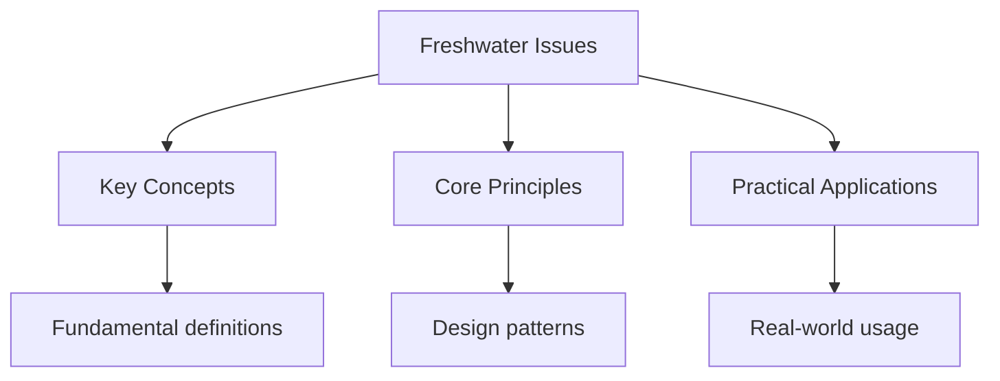

---

date: 2026-07-23T21:57:32+01:00
title: "Freshwater Issues | IB - Wyatt's Notes"
description: "This section covers the IB Geography optional theme on freshwater -- issues and conflicts. It examines the hydrological cycle, the characteristics and"

---

<!-- Breadcrumb Schema for SEO -->

## Freshwater Issues

This section covers the IB Geography optional theme on freshwater -- issues and conflicts. It
examines the hydrological cycle, the characteristics and functioning of drainage basins, the causes
and consequences of water scarcity, and the strategies used to manage freshwater resources and flood
risks. Water resources are unevenly distributed and increasingly under pressure from population
growth, economic development, and climate change, making this a topic with significant real-world
relevance.

## Intuition

**Freshwater is like liquid gold — it covers 70% of Earth's surface, but only 3% is freshwater, and most of that is locked in ice:** Water scarcity is not just about quantity — it's about distribution, quality, and management of this essential resource

**Why it matters:** Freshwater issues affect billions of people and will intensify with climate change and population growth

**The key insight:** Water scarcity is not just about quantity — it's about distribution, quality, and management of this essential resource

## Contents

- [Drainage Basins and Hydrology](./freshwater/drainage-basins-and-hydrology) -- the hydrological
  cycle, drainage basin systems, and river processes.
- [Water Scarcity and Management](./freshwater/water-scarcity-and-management) -- causes of water
  scarcity, supply and demand management strategies.
- [Flood Management](./freshwater/flood-management) -- flood causes, impacts, and management
  approaches including hard and soft engineering.

## Key Definitions

These terms form the foundation of freshwater geography and should be defined precisely in exam
responses. Confusion between similar terms is a common source of lost marks on Paper 2 and Paper 3.

- **Watershed (drainage basin boundary):** the line of highest ground separating one drainage basin
  from another. Also called a divide. Watershed delineation is essential for understanding the scale
  at which water management operates; many transboundary drainage basins (the Nile, the Mekong, the
  Colorado) complicate management because multiple sovereign jurisdictions share a single basin.

- **Throughflow:** water that moves laterally through the soil profile, downslope toward a river
  channel. Throughflow is slower than surface runoff but faster than baseflow, and is a major
  contributor to stream discharge between storm events. Changes in land use (deforestation,
  urbanisation) significantly alter throughflow rates and are a key factor in modifying flood
  hydrographs.

- **Baseflow:** the sustained flow in a river channel fed by groundwater discharge. Baseflow
  maintains river levels during dry periods and is critical for water supply in regions with
  seasonal rainfall. Over-extraction of groundwater (as in the Ogallala Aquifer in the US High
  Plains, or the North China Plain) reduces baseflow and can cause rivers to cease flowing in dry
  seasons.

- **Physical water scarcity:** occurs where annual renewable freshwater resources per capita fall
  below 1,000 cubic metres. Arid and semi-arid regions (North Africa, the Middle East, Central Asia,
  parts of Australia) face physical scarcity regardless of economic development. The UN projects
  that by 2025, approximately 1.8 billion people will live in areas of absolute physical scarcity.

- **Economic water scarcity:** occurs where renewable freshwater is available but infrastructure
  (pipelines, treatment plants, wells, storage) is insufficient to deliver it reliably to users.
  Sub-Saharan Africa is the most affected region: despite adequate rainfall in many areas, lack of
  investment in water infrastructure leaves large populations without reliable access to safe water.

- **Integrated drainage basin management (IDBM):** a holistic approach to managing all aspects of a
  drainage basin -- water supply, quality, flood risk, and ecology -- in a coordinated way rather
  than addressing each issue in isolation. The EU Water Framework Directive is a policy example of
  IDBM, requiring member states to achieve "good ecological status" for all water bodies. Exam
  questions frequently ask students to evaluate whether management in a given case study is truly
  integrated.

## Key Concepts

- **Hydrological cycle** -- the continuous movement of water between the atmosphere, land surface,
  and subsurface through processes including evaporation, transpiration, condensation,
  precipitation, infiltration, and runoff. Human activities such as deforestation and urbanisation
  alter local hydrological cycles.
- **Drainage basin** -- an area of land drained by a river and its tributaries, bounded by a
  watershed. Key components include inputs (precipitation), stores (lakes, groundwater, soil
  moisture), flows (surface runoff, throughflow, baseflow), and outputs (evapotranspiration, river
  discharge).
- **Water scarcity** -- a situation where demand for freshwater exceeds available supply. Can be
  physical (arid regions with limited rainfall) or economic (regions with abundant water but
  insufficient infrastructure to access it).
- **Flood hydrograph** -- a graph showing river discharge over time in response to a rainfall event.
  Key features include the lag time (delay between peak rainfall and peak discharge), rising limb,
  falling limb, and peak discharge.
- **Hard engineering** -- structural flood management approaches such as dams, levees, channel
  straightening, and flood barriers. Effective but expensive and can have significant environmental
  impacts.
- **Soft engineering** -- non-structural approaches such as floodplain zoning, afforestation,
  wetland restoration, and early warning systems. Generally lower cost and more sustainable, but may
  be less effective against extreme events.
- **Storm hydrograph (flood hydrograph) factors** -- physical factors influencing the shape of a
  hydrograph include drainage basin size, slope gradient, soil type, rock permeability, land use,
  and antecedent weather conditions. Urbanised basins have shorter lag times and higher peak
  discharges compared to rural basins with extensive woodland cover.
- **Water quality and pollution** -- freshwater quality is degraded by point-source pollution
  (sewage outfalls, industrial discharge) and diffuse-source pollution (agricultural runoff of
  fertilisers and pesticides, urban runoff of oil and heavy metals). The EU Water Framework
  Directive sets quality standards; monitoring using biotic indices (BMWP score) and chemical
  parameters is assessable in exam questions.
- **Transboundary water conflict** -- disputes arising when a shared river basin crosses national
  borders, as upstream abstraction affects downstream supply. The Nile Basin (Egypt, Ethiopia, Sudan
  and the Grand Ethiopian Renaissance Dam) and the Colorado River basin (US and Mexico) are
  frequently examined case studies. International water law (UN Watercourses Convention) is rarely
  enforceable, leaving negotiations as the primary resolution mechanism.

## Exam Focus

Paper 1 questions on freshwater in most cases require:

- Explaining the physical and human causes of water scarcity using specific case studies (e.g., the
  Colorado River basin, sub-Saharan Africa).
- Evaluating the effectiveness of different water management strategies at varying scales.
- Analysing flood hydrographs and explaining the factors that influence lag time and peak discharge.
- Comparing hard and soft engineering approaches to flood management with reference to case study
  evidence.
- Discussing the conflicts arising from competing demands for freshwater resources.
- Evaluating the effectiveness of integrated drainage basin management (IDBM) approaches using
  specific case study evidence (e.g., the EU Water Framework Directive, the Tennessee Valley
  Authority).
- Analysing water quality data, including interpreting biotic index scores and chemical
  contamination measurements, and distinguishing between point-source and diffuse-source pollution.
- Assessing transboundary water conflicts, explaining how upstream abstraction affects downstream
  nations and evaluating the effectiveness of international agreements in resolving disputes.
- Discussing the impacts of climate change on freshwater availability, including changes in
  precipitation patterns, glacier retreat, and the intensification of the hydrological cycle.

## Worked Examples

### Example 1: Interpreting a Flood Hydrograph

**Problem:** A flood hydrograph shows a lag time of 3 hours and a peak discharge of 120
$\mathrm{m^3\,s^{-1}}$ following a storm event. An upstream urbanised area has recently been
developed. Explain how this development would affect the hydrograph. **Solution:** Urbanisation
increases the proportion of impermeable surfaces (concrete, tarmac), reducing infiltration and
increasing surface runoff. This would decrease the lag time (water reaches the channel faster) and
increase the peak discharge (more water enters the channel in a shorter time). The rising limb would
be steeper. These changes increase flood risk downstream.

### Example 2: Evaluating Hard vs Soft Engineering

**Problem:** Evaluate the effectiveness of hard engineering (dams) compared to soft engineering
(afforestation) for flood management. **Solution:** Dams provide reliable, large-scale flood control
and can also generate hydroelectric power and store water for irrigation. However, they are
extremely expensive to construct, displace communities, trap sediment (reducing fertility
downstream), and disrupt river ecosystems. Afforestation increases infiltration, reduces surface
runoff, and is low-cost and environmentally sustainable. However, it is less effective against
extreme flood events and takes years to reach full effectiveness. The best approaches combine both
strategies at different points in the drainage basin.

## Common Pitfalls

- **Confusing physical and economic water scarcity:** Physical scarcity means insufficient rainfall
  or groundwater; economic scarcity means infrastructure is inadequate to access available water.
  Many DSE answers conflate the two.
- **Describing flood management without case study evidence:** Generic descriptions of dams or
  afforestation score poorly. Always reference a specific location (e.g., the Three Gorges Dam on
  the Yangtze, or floodplain restoration on the River Severn).

## Summary

Freshwater issues examines the hydrological cycle, drainage basin systems, flood hydrographs, water
scarcity (physical and economic), and flood management strategies. Students must evaluate hard and
soft engineering approaches using specific case studies and understand the conflicts arising from
competing demands for water resources between agriculture, industry, and domestic use.
