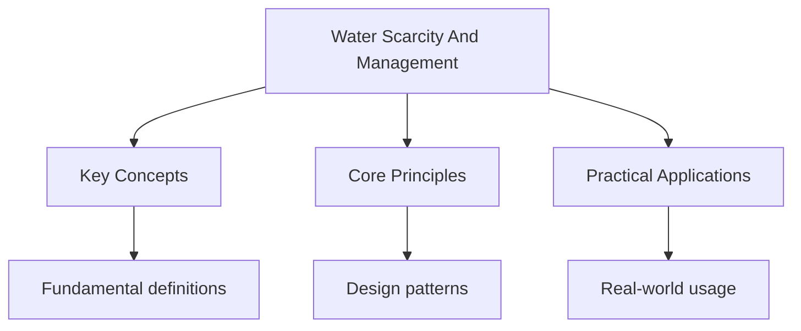

---

date: 2026-07-23T21:57:32+01:00
title: "Water Scarcity and Management | IB"
description: "Comprehensive study notes for Water Scarcity and Management with worked examples, practice problems, and key concepts for exam preparation."
---

<!-- Breadcrumb Schema for SEO -->

## Water Scarcity and Management

## Defining Water Scarcity

### Physical vs Economic Scarcity

Water scarcity exists when the demand for freshwater exceeds the available supply. It is critical to
Distinguish between two fundamentally different types:

**Physical water scarcity** occurs when annual renewable freshwater resources fall below a defined
Threshold relative to population. The most widely used threshold is the Falkenmark indicator:
Regions with less than 1000 m$^3$ of renewable freshwater per person per year are classified as
Water-scarce; those with 1000--1700 m$^3$ per person per year are water-stressed. Physical scarcity
Reflects an absolute deficit between supply and demand that cannot be resolved by infrastructure
Alone.

**Economic water scarcity** occurs where freshwater resources are physically sufficient but are
Inaccessible due to inadequate infrastructure (lack of dams, treatment plants, pipelines, wells),
Financial constraints (communities cannot afford to develop or access water), institutional failures
(weak governance, corruption, absence of property rights), or conflict. The International Water
Management Institute (IWMI) estimated in 2007 that approximately 1.6 billion people live in areas of
Economic water scarcity, predominantly in Sub-Saharan Africa and parts of South and Southeast Asia.

### Water Stress Indices

Several composite indices measure water stress at national and subnational scales:

| Index                                       | Description                                                             | Key Variables                                                  |
| ------------------------------------------- | ----------------------------------------------------------------------- | -------------------------------------------------------------- |
| **Falkenmark Water Stress Indicator**       | Annual renewable freshwater per capita                                  | Total renewable freshwater, population                         |
| **Basin-level Water Stress (WRI Aqueduct)** | Ratio of total freshwater withdrawals to available renewable freshwater | Withdrawals, renewable supply, environmental flow requirements |
| **Water Poverty Index (WPI)**               | Combines water availability with access, capacity, use, and environment | Five components: resources, access, capacity, use, environment |
| **UN Water SDG 6 Indicator 6.4.2**          | Water-use efficiency (value added per unit of water withdrawn)          | GDP, total freshwater withdrawals                              |

The WRI Aqueduct tool classifies water stress into five categories: extremely high ($\gt{80}\%$ of
Available supply withdrawn), high (40--80%), medium to high (20--40%), low to medium (10--20%), and
Low ($\lt{10}\%$). As of 2023, 17 countries extract more than 80% of their available renewable
Freshwater annually, including Saudi Arabia, Egypt, United Arab Emirates, and Pakistan.

## Scale of the Global Water Crisis

The United Nations World Water Development Report (2023) documents the scale of the challenge:

- Approximately 2 billion people worldwide lack access to safely managed drinking water services.
- Approximately 3.6 billion people lack access to safely managed sanitation services.
- Global freshwater demand has increased sixfold since 1900 and continues to rise at approximately
  1% per year.
- Agriculture accounts for approximately 70% of global freshwater withdrawals; industry for
  approximately 19%; and municipal use for approximately 11%.
- By 2050, global water demand is projected to increase by 20--30% above current levels, driven by
  population growth, economic development, and changing consumption patterns.
- Climate change is projected to reduce renewable water resources in regions that are already
  water-stressed, particularly the Middle East, North Africa, and Central Asia.

## Supply-Side Management Strategies

Supply-side strategies increase the quantity of freshwater available for use. They are essential in
Regions of physical water scarcity but often involve high capital costs, significant environmental
Impacts, and long lead times.

### Dams and Reservoirs

Dams create reservoirs that store water during wet periods for release during dry periods, providing
A more reliable and constant supply. The world has over 57 000 large dams (exceeding 15 m in
Height).

**Advantages:** reliable year-round supply, flood control downstream, hydroelectric power
Generation, recreational amenities, irrigation for agriculture.

**Disadvantages:** displacement of populations (the Three Gorges Dam displaced over 1.3 million
People), fragmentation of river ecosystems (blocking fish migration, altering sediment transport,
Reducing downstream fertility), greenhouse gas emissions from reservoirs (decomposing organic matter
Releases methane, particularly in tropical reservoirs), high construction costs, sedimentation
Reducing reservoir capacity over time, and the risk of catastrophic dam failure.

### Desalination

Desalination converts seawater or brackish water into freshwater. The two dominant technologies are:

- **Reverse osmosis (RO):** water is forced through a semi-permeable membrane under high pressure (
  55--80 bar), rejecting dissolved salts. RO accounts for approximately 69% of global desalination
  capacity.
- **Thermal distillation:** seawater is heated to produce steam, which is then condensed.
  Multi-stage flash (MSF) distillation and multi-effect distillation (MED) are the main thermal
  methods. These are dominant in the Middle East, where energy is cheap.

**Global capacity:** approximately 100 million m$^3$ of desalinated water produced per day (2023).
The largest desalination plant is the Sorek plant in Israel (capacity approximately 624 000
M$^3$/day).

**Costs and limitations:** energy-intensive (approximately 3--4 kWh per m$^3$ by RO, higher for
Thermal methods); brine disposal contaminates marine environments (global brine production is
Approximately 142 million m$^3$/day, with ecological impacts including increased salinity,
Temperature, and heavy metal concentrations); high capital cost (approximately USD 0.5--1.5 per
M$^3$ for RO, depending on scale and energy costs).

### Inter-Basin Water Transfer

Inter-basin transfers move water from basins with surplus to basins with deficit via canals,
Tunnels, or pipelines.

| Scheme                              | Location             | Scale                                                                                            | Issues                                                                                                                    |
| ----------------------------------- | -------------------- | ------------------------------------------------------------------------------------------------ | ------------------------------------------------------------------------------------------------------------------------- |
| **South-to-North Water Transfer**   | China                | Three routes transferring up to 45 billion m$^3$/year from the Yangtze to the Yellow River basin | Cost approximately USD 62 billion; displacement of over 300 000 people; ecological impacts on source and receiving basins |
| **California Aqueduct**             | USA                  | Transfers approximately 5 billion m$^3$/year from northern to southern California                | Energy-intensive (pumping water over the Tehachapi Mountains); ecological impacts on the Sacramento-San Joaquin Delta     |
| **Lesotho Highlands Water Project** | Lesotho/South Africa | Transfers approximately 780 million m$^3$/year from Lesotho to South Africa"s Gauteng province   | Displacement of communities in Lesotho; dependence of Gauteng on a foreign water source                                   |

## Demand-Side Management Strategies

Demand-side strategies reduce water consumption without increasing supply. They are generally
Cheaper, more environmentally sustainable, and faster to implement than supply-side strategies, but
Their effectiveness depends on strong governance, appropriate pricing, and behavioural change.

| Strategy                       | Mechanism                                                                                                               | Effectiveness                                                                                              | Limitations                                                                                                             |
| ------------------------------ | ----------------------------------------------------------------------------------------------------------------------- | ---------------------------------------------------------------------------------------------------------- | ----------------------------------------------------------------------------------------------------------------------- |
| **Water pricing and metering** | Charging by volume consumed rather than a flat rate                                                                     | Proven effective where enforcement is strong; can reduce domestic consumption by 15--30%                   | Regressive: low-income households spend a higher proportion of income on water; political resistance to price increases |
| **Drip irrigation**            | Delivering water directly to plant roots through perforated tubes                                                       | Reduces agricultural water use by 40--60% compared to flood irrigation; improves crop yields               | High capital cost; requires maintenance (clogging); energy required for pumping                                         |
| **Greywater recycling**        | Treating and reusing water from showers, sinks, and washing machines for toilet flushing, irrigation, or industrial use | Can reduce household water demand by 30--40%                                                               | Requires dual plumbing systems; public acceptance of recycled water varies                                              |
| **Leakage reduction**          | Repairing and maintaining water distribution infrastructure                                                             | London loses approximately 25% of treated water through leaks; many developing-country cities lose 40--60% | Expensive to replace buried infrastructure; difficult to prioritise among competing demands                             |
| **Public education campaigns** | Promoting water conservation behaviour (shorter showers, full washing loads, fixing leaks)                              | Modest effect alone (5--10% reduction); most effective when combined with pricing measures                 | Difficult to measure impact; effect may diminish over time without reinforcement                                        |
| **Industrial water recycling** | Closed-loop systems that treat and reuse process water within factories                                                 | Can reduce industrial freshwater consumption by 50--90%                                                    | Capital-intensive; requires process redesign                                                                            |

Common Pitfalls: Evaluating Water Management Strategies in Isolation

Examination questions often ask students to evaluate water management strategies. A common error is
To evaluate supply-side or demand-side strategies in isolation, without comparing them. A strong
Answer will compare specific strategies, recognising that the optimal approach depends on context:
Physical water scarcity (where supply must be increased) vs economic water scarcity (where demand
Management and infrastructure development are priorities), available finance, governance capacity,
And environmental considerations. Singapore demonstrates that a combination of supply
Diversification (desalination, recycling, imports) and aggressive demand management (pricing,
Metering, public education) can achieve water security even in a water-scarce country.

## Case Study: The Colorado River, USA/Mexico

The Colorado River basin illustrates the consequences of over-allocation and the challenges of
Managing a transboundary water resource under increasing scarcity.

**Over-allocation.** The Colorado Compact of 1922 allocated 7.5 million acre-feet (approximately
9.25 billion m$^3$) per year to each of the upper and lower basin states, plus 1.5 million acre-feet
To Mexico, based on an estimated average annual flow of 17.5 million acre-feet. Subsequent analysis
Has shown that the long-term average flow is approximately 14.8 million acre-feet -- the river was
Over-allocated from the outset. Total allocations now exceed the river"s flow by approximately
20--30%.

**Consequences.** Lake Mead (the largest reservoir in the USA by volume) fell to 27% of capacity in
2023, triggering Tier 2 shortage conditions. The river no longer consistently reaches the Gulf of
California; the Colorado River Delta has largely dried up, destroying a once-productive wetland
Ecosystem. Water quality has declined as agricultural return flows concentrate salts, selenium, and
Other contaminants.

**Management response.** The 2023 post-2026 operating guidelines commit the lower basin states to
Reducing consumption by approximately 3 million acre-feet by 2026, with federal compensation for
Water conservation. Longer-term strategies include water recycling (the Metropolitan Water District
Of Southern California is constructing a recycling facility that will produce approximately 570 000
M$^3$/day of purified water by 2028), agricultural efficiency improvements, and potentially
Desalination.

## Case Study: Singapore NEWater

Singapore (population approximately 5.9 million) has limited natural freshwater resources and no
Significant aquifers. Despite this, it has achieved near-universal access to clean water through the
"Four National Taps" strategy:

1. **Local catchment:** approximately 17 reservoirs capture rainfall from approximately two-thirds
   of Singapore's land area.
2. **Imported water:** from Malaysia under the 1962 Water Agreement (expiring 2061).
3. **NEWater:** advanced treatment of wastewater using microfiltration, reverse osmosis, and
   ultraviolet disinfection produces water exceeding WHO drinking water standards. NEWater supplies
   approximately 40% of total demand.
4. **Desalination:** three plants supply approximately 25% of demand; a fourth is under
   construction.

Singapore's governance model is distinctive: the Public Utilities Board (PUB) manages the entire
Water cycle in an integrated manner. Water is priced at full cost recovery with a conservation
Tariff that increases with consumption volume, creating strong incentives for conservation. Domestic
Water consumption has declined from approximately 165 litres per person per day in 2003 to
Approximately 141 litres per person per day in 2023.

## Case Study: China South-North Water Transfer Project

The South-to-North Water Transfer Project (SNWTP) is the largest water transfer scheme ever
Constructed, designed to address the severe imbalance between water supply and demand in northern
China.

**Context.** Northern China has approximately 24% of the country's freshwater resources but supports
Approximately 40% of its population and approximately 45% of its agricultural output. The North
China Plain, which produces approximately 60% of China's wheat, has experienced severe groundwater
Depletion: the aquifer beneath the plain has declined by over 50 m in some areas since the 1970s.

**Structure.** The SNWTP consists of three routes:

- **Eastern Route:** follows the route of the ancient Grand Canal, transferring water from the
  Yangtze near Yangzhou to Tianjin (approximately 115 billion m$^3$ total capacity; completed 2013).
  Water quality was initially poor due to industrial pollution along the canal corridor, requiring
  extensive treatment.
- **Central Route:** transfers water from the Danjiangkou Reservoir on the Han River (a Yangtze
  tributary) to Beijing via a 1267 km canal and tunnel system (approximately 13 billion m$^3$/year
  capacity; completed 2014). Over 300 000 people were relocated to expand the Danjiangkou Reservoir.
- **Western Route (planned):** would transfer water from the upper Yangtze headwaters across the
  Tibetan Plateau to the upper Yellow River. This route is technically extremely challenging
  (tunnels through mountains at elevations exceeding 4000 m) and has not been constructed due to
  engineering difficulties, environmental concerns, and tensions over transboundary water resources
  with downstream riparian states.

**Impacts.** The Central Route now supplies approximately 70% of Beijing's municipal water. However,
The project has been criticised for its enormous cost (estimated at over USD 62 billion), the
Displacement of communities, reduced flows in the lower Yangtze and Han rivers (with ecological
Consequences including reduced fish habitat and increased saltwater intrusion in the Yangtze
Estuary), and the perpetuation of unsustainable water consumption patterns in northern China.

For related topics, see [./drainage-basins-and-hydrology](./drainage-basins-and-hydrology) and
[./flood-management](./flood-management). The parent topic page is at
[../freshwater-issues](../freshwater-issues).

## Intuition

Water scarcity is not just about how much rain falls but about whether societies have built the infrastructure to capture and deliver it. Physical scarcity is an absolute deficit; economic scarcity is a failure of governance and investment. Supply-side management is like adding water to a bathtub from a bigger pipe; demand-side management is learning to use less water in the bath. Singapore demonstrates that a combination of diversified supply and aggressive demand management can achieve water security even in one of the most water-scarce nations on Earth.

## Common Pitfalls

1. Losing marks by not showing sufficient working. Always write out each step, especially in proof
   questions.

2. Misreading the question, particularly with 'hence' vs 'hence or otherwise'. The former requires
   using previous work.

3. Confusing the domain and range of functions, or not considering restrictions (e.g., denominator
   cannot be zero).

4. Rounding too early in multi-step calculations. Carry full precision through and round only the
   final answer.

## Summary

The key principles covered in this topic are linked in the sub-pages above. Focus on understanding
the definitions, applying the formulas or frameworks, and evaluating strengths and limitations of
each approach.

## Worked Examples

Worked examples demonstrating the application of key concepts are covered in the detailed sub-pages
linked above.
