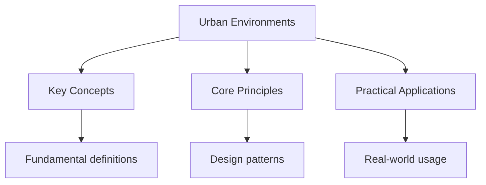

---

date: 2026-07-23T21:57:32+01:00
title: "Urban Environments | IB - Wyatt's Notes"
description: "This section covers the IB Geography optional theme on urban environments. It examines the global trends in urbanisation, the spatial structure of cities,"

---

<!-- Breadcrumb Schema for SEO -->

## Urban Environments

This section covers the IB Geography optional theme on urban environments. It examines the global
trends in urbanisation, the spatial structure of cities, the environmental and social challenges of
urban growth, and the strategies used to create sustainable and liveable urban areas. With over half
the world"s population now living in cities, understanding urban processes is essential for
addressing challenges related to housing, transport, pollution, inequality, and climate resilience.

## Intuition

**Cities are like living organisms — they have circulation systems (transport), nervous systems (communications), and metabolic processes (resource consumption):** Urbanization concentrates both opportunities and challenges, creating complex systems that require careful planning and management

**Why it matters:** Understanding urban environments is essential as more than half the world's population now lives in cities

**The key insight:** Urbanization concentrates both opportunities and challenges, creating complex systems that require careful planning and management

## Contents

- [Urbanisation Trends and Patterns](./urban/urbanisation-trends-and-patterns) -- global
  urbanisation trends, megacities, and the causes and consequences of urban growth.
- [Urban Environmental Quality](./urban/urban-environmental-quality) -- urban microclimates,
  pollution, waste management, and environmental justice.
- [Urban Planning and Sustainability](./urban/urban-planning-and-sustainability) -- urban models,
  sustainable city initiatives, and planning strategies.

## Overview

Urbanisation is one of the defining geographic processes of the twenty-first century. In 2007, the
global urban population exceeded the rural population for the first time; by 2050, the UN projects
that approximately 68% of the world's population will live in urban areas. The IB Geography course
treats urban environments as a system with inputs (people, capital, resources), processes (economic
activity, land-use change, migration, governance), and outputs (goods, services, pollution, waste,
quality of life). This systems approach is expected in higher-mark exam responses.

The spatial perspective is central to this topic. Cities are not uniform entities -- their internal
structure, the distribution of populations and activities within them, and the relationships between
urban cores and peripheral areas all reflect geographic processes operating at different scales. The
Burgess, Hoyt, and Harris and Ullman models provide starting frameworks for analysing urban spatial
structure, but students must evaluate these models against real-world complexity, including the role
of informal economies, colonial planning legacies (particularly in cities of the Global South), and
environmental constraints such as rivers, coastlines, and topography.

Human-environment interaction within cities generates distinctive challenges. Urban heat islands,
air and water pollution, waste generation, and the loss of permeable surfaces all degrade
environmental quality. Critically, these impacts are not evenly distributed: environmental justice
-- the unequal distribution of environmental benefits and burdens across social groups -- is a key
assessment objective that distinguishes stronger exam responses from weaker ones. Students should
expect to discuss environmental justice in the context of specific case studies (e.g., waste dumping
in Dandora, Nairobi, or air pollution disparities in Los Angeles).

Scale matters throughout urban geography. A neighbourhood-level analysis might examine land-use
change, housing quality, or access to green space; a city-level analysis considers transport
networks, planning policy, and economic base; a global-scale analysis examines world city networks,
megacity growth trajectories, and comparative urbanisation rates. Students should be comfortable
moving between scales in written responses, recognising that processes at one scale (global
investment flows, national planning legislation) produce outcomes at another (gentrification in a
specific district, slum formation on the urban fringe).

## Key Concepts

- **Urbanisation** -- the increasing proportion of a population living in urban areas, driven by
  rural-urban migration and natural increase within cities. Rates of urbanisation vary significantly
  between regions, with the fastest rates in sub-Saharan Africa and South Asia.
- **Megacities** -- cities with populations exceeding 10 million. Examples include Tokyo, Delhi,
  Shanghai, and Lagos. Megacities face distinctive challenges related to infrastructure, housing,
  employment, and governance.
- **Urban models** -- theoretical frameworks that describe the spatial structure of cities. Key
  models include the Burgess concentric zone model, the Hoyt sector model, and the Harris and Ullman
  multiple nuclei model. Each has strengths and limitations in explaining different urban forms.
- **Urban microclimate** -- the distinctive climate of urban areas, characterised by the urban heat
  island effect (higher temperatures due to materials, lack of vegetation, and waste heat), altered
  precipitation patterns, and reduced wind speeds.
- **Environmental justice** -- the principle that all communities should have equal protection from
  environmental hazards and equal access to environmental benefits. In practice, low-income and
  minority communities often bear a disproportionate burden of pollution and inadequate
  infrastructure.
- **Sustainable urban development** -- development that meets present urban needs without
  compromising the ability of future generations to meet theirs. Strategies include green building,
  public transit investment, mixed-use zoning, green infrastructure, and smart city technologies.
- **Counter-urbanisation** -- the movement of people from urban areas to rural areas, driven by
  factors such as housing affordability, quality of life preferences, remote work, and environmental
  amenity. Common in HICs (e.g., UK, parts of the US and Western Europe) but distinct from
  urbanisation and suburbanisation in both direction and motivation.
- **Urban sprawl** -- the uncontrolled, low-density expansion of urban areas into surrounding rural
  land. Driven by car dependency, inadequate planning regulation, and lower land costs at the urban
  fringe. Urban sprawl increases infrastructure costs, fragments ecosystems, increases per-capita
  carbon emissions, and exacerbates social segregation between affluent suburbs and declining
  inner-city areas.
- **In-formal economy** -- economic activities that are not regulated, taxed, or protected by the
  state, including street vending, waste picking, and unregistered construction. In cities of the
  Global South, the informal economy can account for over 50% of employment. Ignoring the informal
  economy when applying urban models (e.g., Burgess, Hoyt) is a significant limitation.
- **Gentrification** -- the transformation of a low-income urban neighbourhood through the influx of
  wealthier residents, investment in property and services, and consequent displacement of original
  residents through rising rents and property taxes. Gentrification improves physical infrastructure
  but raises questions about equity, cultural displacement, and the right to the city.

## Exam Focus

Paper 1 questions on urban environments in most cases require:

- Explaining the causes and consequences of urbanisation using case studies from contrasting
  countries (e.g., urbanisation in Nigeria vs. the United Kingdom).
- Evaluating the applicability of one or more urban models to a specific city.
- Discussing strategies for improving urban environmental quality with reference to specific
  examples.
- Assessing the effectiveness of sustainable urban planning initiatives (e.g., Curitiba's BRT
  system, Singapore's integrated planning).
- Analysing urban data presented in maps, photographs, graphs, or statistical tables.
- Discussing environmental justice within cities, explaining how pollution, waste, and inadequate
  infrastructure are disproportionately concentrated in low-income and minority neighbourhoods, with
  reference to specific case studies.
- Evaluating the causes and consequences of counter-urbanisation and urban sprawl, contrasting HIC
  and LIC contexts and linking to transport policy and planning regulation.
- Assessing the role of the informal economy in cities of the Global South, including its
  contribution to livelihoods and the limitations of applying formal-sector urban models to informal
  settlements.
- Discussing gentrification as a process that improves physical environments while displacing
  existing communities, evaluating competing perspectives on whether it is regenerative or
  destructive for urban neighbourhoods.

## Worked Examples

### Example 1: Applying the Burgess Model

**Problem:** Apply the Burgess concentric zone model to Lagos, evaluating its strengths and
limitations. **Solution:** Lagos partially fits Burgess: the CBD (Lagos Island) contains commercial
and administrative functions; the inner zone has transitional industries and high-density housing
(e.g., Mushin); outer zones include newer residential areas and informal settlements (e.g., Makoko).
Limitations: Burgess does not account for the massive informal economy (which cuts across all
zones), the role of colonial-era planning in creating distinct European and African quarters, or the
impact of water bodies (Lagos Lagoon) that constrain the concentric pattern. The model is a useful
starting point but requires significant modification.

### Example 2: Evaluating a Sustainable Urban Initiative

**Problem:** Evaluate Curitiba's Bus Rapid Transit (BRT) system as a sustainable urban transport
strategy. **Solution:** Curitiba's BRT carries over 2 million passengers daily on dedicated bus
lanes at a fraction of the cost of a metro system ($0.3$ million/km vs $10$ million/km for rail).
Strengths: reduces car dependency, lowers emissions, affordable for low-income residents, integrated
with land-use planning (higher density along corridors). Limitations: bus capacity is lower than
rail; the system is reaching saturation as the city grows; feeder routes are not as efficient as the
trunk lines. Despite limitations, Curitiba's BRT is widely cited as a best practice for cities in
developing countries.

## Common Pitfalls

- **Describing urban models without evaluation:** The Burgess, Hoyt, and multiple nuclei models all
  have significant limitations. Always evaluate their applicability to a specific city rather than
  directly describing them.
- **Equating urbanisation with urban growth:** Urbanisation is the increasing proportion of people
  living in urban areas (a rate); urban growth is the absolute increase in urban population. A
  country can have high urban growth without rapid urbanisation if the rural population is also
  growing fast.
- **Ignoring environmental justice:** When discussing urban environmental quality, note that
  pollution, waste, and inadequate infrastructure disproportionately affect low-income communities.
  This is a key assessment objective.

## Summary

Urban environments in IB Geography covers urbanisation trends (megacities, rates of urbanisation),
urban spatial models (Burgess, Hoyt, Harris and Ullman), urban environmental challenges (heat
island, pollution, waste), and sustainable planning strategies (green infrastructure, BRT, mixed-use
zoning, smart cities). Case studies from both developed and developing countries are essential for
demonstrating contrasting urban processes and evaluating planning effectiveness.
