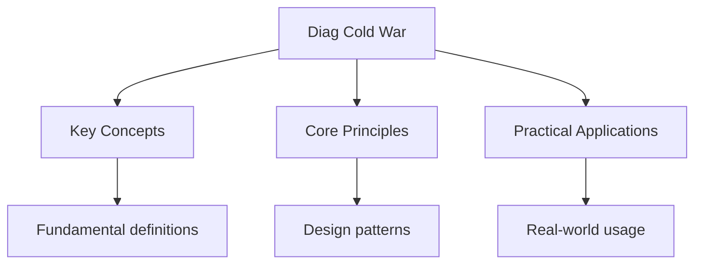

---

date: 2026-07-23T21:57:32+01:00
title: "Diagnostic Test: Cold War | IB"
description: "\"itemListElement\": [{\"name\": \"Home\", \"url\": \"https://wyattau.com\"}, {\"name\": \"ib\", \"url\": \"https://ib.wyattau.com\"}, {\"name\": \"History\", \"url\":"
sidebar_position: 30
---

<!-- Breadcrumb Schema for SEO -->

## Diagnostic Test: Cold War

Answer each question. Check your answers against the key at the end.

## Intuition

**The Cold War was like a chess match between superpowers — each move by one side prompted a countermove by the other, with the world as the board:** The Cold War's ideological struggle between capitalism and communism shaped global politics, technology, and culture for nearly half a century

**Why it matters:** Understanding the Cold War explains the modern world order, from NATO to nuclear proliferation to ongoing geopolitical tensions

**The key insight:** The Cold War's ideological struggle between capitalism and communism shaped global politics, technology, and culture for nearly half a century

## Questions

**1.** Which ideological difference most fundamentally divided the United States and the Soviet Union after 1945?
(A) Religious beliefs
(B) Capitalism versus communism
(C) Colonial ambitions in Africa
(D) Language and cultural traditions

**2.** The policy of "massive retaliation" associated with John Foster Dulles aimed to:
(A) Provide economic aid to developing nations
(B) Deter Soviet aggression through the threat of overwhelming nuclear response
(C) Negotiate bilateral arms reduction treaties
(D) Withdraw American forces from European bases

**3.** Which crisis demonstrated the dangers of nuclear brinkmanship between the superpowers?
(A) The Suez Crisis (1956)
(B) The Cuban Missile Crisis (1962)
(C) The Berlin Airlift (1948-1949)
(D) The Hungarian Uprising (1956)

**4.** Détente during the 1970s is best characterised as:
(A) An escalation of the arms race
(B) A relaxation of tensions through diplomacy, trade agreements, and arms control
(C) The formal dissolution of the Warsaw Pact
(D) The reunification of Germany

**5.** The Korean War (1950-1953) ended with:
(A) A unified democratic Korea
(B) An armistice establishing a demilitarised zone along the 38th parallel
(C) The complete withdrawal of all foreign forces
(D) The Soviet occupation of the entire peninsula

**6.** Which event most significantly demonstrated the limits of superpower intervention in proxy conflicts?
(A) The Berlin Wall construction
(B) The Tet Offensive and subsequent American withdrawal from Vietnam
(C) The Cuban Revolution
(D) The Space Race

**7.** The Helsinki Accords (1975) were significant because they:
(A) Formally ended the Cold War
(B) Included human rights provisions alongside territorial agreements
(C) Established NATO as a military alliance
(D) Recognised the independence of Soviet satellite states

**8.** Which factor most directly contributed to the dissolution of the Soviet Union in 1991?
(A) Military defeat in World War II
(B) Economic stagnation, political reform, and nationalist movements
(C) The formation of the European Union
(D) The American occupation of Moscow

**9.** The concept of "mutually assured destruction" (MAD) served to:
(A) Encourage first-strike nuclear attacks
(B) Deter nuclear war by ensuring both sides would suffer complete destruction
(C) Promote nuclear disarmament through treaties
(D) Limit conventional military spending

**10.** Which leader's reform policies of glasnost and perestroika are most associated with the end of the Cold War?
(A) Leonid Brezhnev
(B) Joseph Stalin
(C) Mikhail Gorbachev
(D) Nikita Khrushchev

## Answer Key

| Q | Answer | Explanation |
| --- | -------- | ------------- |
| 1 | (B) | The Cold War was fundamentally a conflict between American capitalism and Soviet communism, shaping global alignments. |
| 2 | (B) | Massive retaliation threatened overwhelming nuclear response to deter Soviet conventional aggression, embodying Eisenhower's New Look. |
| 3 | (B) | The Cuban Missile Crisis brought the superpowers closest to nuclear war, resolved through diplomatic negotiation. |
| 4 | (B) | Détente represented a deliberate easing of tensions through diplomatic engagement, arms control agreements, and trade. |
| 5 | (B) | The Korean War ended in armistice, not peace, leaving the peninsula divided along the 38th parallel to the present day. |
| 6 | (B) | The Tet Offensive revealed the limits of American military power and shifted public opinion against the Vietnam War. |
| 7 | (B) | The Helsinki Accords balanced recognition of post-war borders with commitments to human rights, influencing dissident movements. |
| 8 | (B) | Economic decline, Gorbachev's reforms, and rising nationalism in Soviet republics led to the USSR's dissolution. |
| 9 | (B) | MAD deterred nuclear war by ensuring that any attack would result in the destruction of both attacker and defender. |
| 10 | (C) | Gorbachev's glasnost (openness) and perestroika (restructuring) reforms weakened Soviet control and hastened the Cold War's end. |

## Common Mistakes

**Assuming the Cold War was only between the US and USSR:** Many countries were involved as allies, proxies, or non-aligned states. The Sino-Soviet split shows the Communist bloc wasn't monolithic.

**Confusing détente with the end of the Cold War:** Détente (1970s) reduced tensions but didn't end the rivalry. The Cold War ended in 1989-1991 with Soviet collapse.

**Mixing up the Truman Doctrine with the Marshall Plan:** The Truman Doctrine was about military/political containment. The Marshall Plan was about economic reconstruction. They're related but different.

## Cross-References

- **[Cold War](../cold-war):** Cold War diagnostics test core knowledge
- **[Authoritarian States](../authoritarian-states):** Authoritarian regimes are examined
- **[Causes and Effects](../causes-and-effects-of-wars):** Proxy wars are studied
