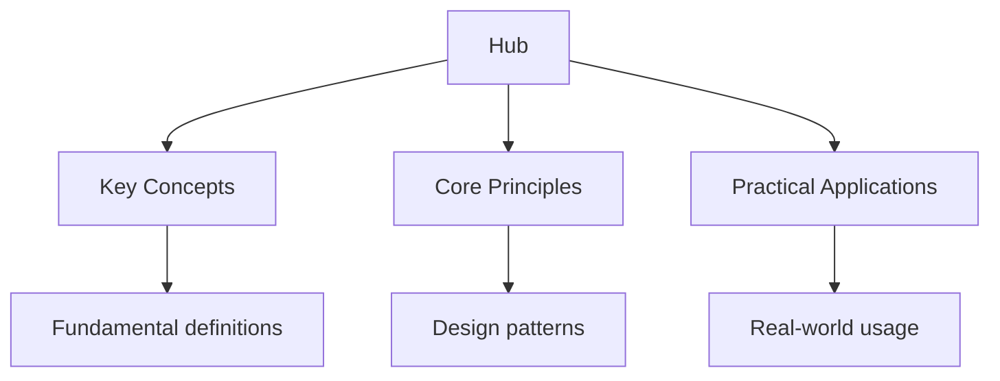

## Why This Guide Exists

The IB Diploma Programme demands breadth and depth across six subject groups, plus the Core (TOK, Extended Essay, and CAS). This hub page is your roadmap to every resource on this site — organised by subject, with study strategies tailored to IB's unique assessment approach.

Whether you are preparing for Paper 1, Paper 2, or the internal assessments, this page connects you to everything you need. Start here, then drill into the subjects that matter most to your exam success.

## Table of Contents

- [Biology](#biology)
- [Chemistry](#chemistry)
- [Physics](#physics)
- [Mathematics](#mathematics)
- [Computer Science](#computer-science)
- [Economics](#economics)
- [Geography](#geography)
- [History](#history)
- [English](#english)
- [Psychology](#psychology)
- [Theory of Knowledge (TOK)](#theory-of-knowledge-tok)
- [IB Study Strategy](#ib-study-strategy)
- [Cross-Site Resources](#cross-site-resources)
- [FAQ](#faq)

---

## Biology

IB Biology covers cell biology, molecular biology, genetics, ecology, evolution, human physiology, plant biology, and the nervous system. The IB syllabus is extensive — HL students must master additional topics beyond SL.

### Topic Notes

- [Cell Biology](biology/1-cell-biology/1_cell-biology) — cell structure, membrane transport, and cell division
- [Metabolism](biology/1-cell-biology/2_metabolism) — enzyme kinetics, cellular respiration, and photosynthesis
- [Molecular Biology](biology/2-molecular-biology/1_molecular-biology) — DNA replication, transcription, and translation
- [Genetics](biology/3-genetics/1_genetics) — Mendelian inheritance, chi-squared tests, and genetic engineering
- [Genetics Advanced](biology/3-genetics/2_genetics-advanced) — linkage, epistasis, and polygenic inheritance
- [Ecology](biology/4-ecology/1_ecology) — ecosystems, energy transfer, and succession
- [Evolution and Biodiversity](biology/5-evolution-and-biodiversity/1_evolution) — speciation, classification, and evidence for evolution
- [Human Physiology](biology/6-human-physiology/1_human-physiology) — digestion, gas exchange, and circulation
- [Plant Biology](biology/7-plant-biology/1_plant-biology) — photosynthesis, transpiration, and plant responses
- [Nervous System](biology/8-nervous-system-and-immunology/1_nervous-system) — neurons, synapses, and the brain
- [Immunology](biology/8-nervous-system-and-immunology/2_immunology) — immune response and disease

### Practice and Review

- [Flashcards: Cell Biology](biology/flashcards-cell-biology)
- [Flashcards: Genetics](biology/flashcards-genetics)
- [Practice Questions: Cell Biology](biology/practice-cell-biology)
- [Diagnostic Quizzes](biology/diagnostics) — assess your knowledge across all biology topics

---

## Chemistry

IB Chemistry spans stoichiometry, atomic structure, periodicity, chemical bonding, energetics, kinetics, equilibrium, acids and bases, redox, organic chemistry, and measurement. HL students cover additional topics in bonding, energetics, and organic chemistry.

### Topic Notes

- [Stoichiometric Relationships](chemistry/1-stoichiometry/1_stoichiometric-relationships) — mole concept, Avogadro's number, and empirical formulae
- [States of Matter](chemistry/1-stoichiometry/2_states-of-matter) — ideal gas law and kinetic molecular theory
- [Atomic Theory](chemistry/2-atomic-structure/1_atomic-theory) — subatomic particles, isotopes, and electron configuration
- [Atomic Structure and Periodicity](chemistry/2-atomic-structure/2_atomic-structure-and-periodicity) — periodic trends and ionisation energy
- [Periodicity](chemistry/3-periodicity/1_periodicity) — group trends and properties of elements
- [Chemical Bonding](chemistry/4-chemical-bonding/1_chemical-bonding) — ionic, covalent, and metallic bonding
- [Chemical Bonding Advanced](chemistry/4-chemical-bonding/2_chemical-bonding-advanced) — VSEPR, hybridisation, and intermolecular forces
- [Thermochemistry](chemistry/5-energetics/1_thermochemistry) — enthalpy changes and Hess's law
- [Chemical Kinetics](chemistry/6-kinetics/1_chemical-kinetics) — rate laws, activation energy, and catalysts
- [Equilibrium](chemistry/7-equilibrium/1_equilibrium) — Le Chatelier's principle and equilibrium constants
- [Acids and Bases](chemistry/8-acids-and-bases/1_acids-and-bases) — pH, titrations, and buffer solutions
- [Acids and Bases Advanced](chemistry/8-acids-and-bases/2_acids-and-bases-advanced) — Lewis acids and Henderson-Hasselbalch
- [Redox Reactions](chemistry/9-redox/1_redox-reactions) — oxidation states and balancing equations
- [Redox Advanced](chemistry/9-redox/2_redox-advanced) — electrochemical cells and electrolysis
- [Electrochemistry](chemistry/9-redox/3_electrochemistry)
- [Organic Chemistry](chemistry/10-organic-chemistry/1_organic-chemistry) — nomenclature, isomerism, and functional groups
- [Organic Chemistry Advanced](chemistry/10-organic-chemistry/2_organic-chemistry-advanced) — reaction mechanisms and synthesis
- [Measurement and Data Processing](chemistry/11-measurement-and-data-processing/1_measurement-and-data-processing) — uncertainty, sig figs, and graphical analysis

### Practice and Review

- [Flashcards: Stoichiometry](chemistry/flashcards-stoichiometry)
- [Flashcards: Atomic Structure](chemistry/flashcards-atomic-structure)
- [Flashcards: Chemical Bonding](chemistry/flashcards-chemical-bonding)
- [Flashcards: Energetics](chemistry/flashcards-energetics)
- [Flashcards: Kinetics and Equilibrium](chemistry/flashcards-kinetics-equilibrium)
- [Flashcards: Acids and Bases](chemistry/flashcards-chemical-bonding)
- [Flashcards: Redox and Electrochemistry](chemistry/flashcards-redox-electrochemistry)
- [Flashcards: Organic Chemistry](chemistry/flashcards-organic-chemistry)
- [Flashcards: Measurement](chemistry/flashcards-measurement-data)
- [Flashcards: Quantitative Chemistry](chemistry/flashcards-quantitative-chemistry)
- [Flashcards: Periodicity](chemistry/flashcards-periodicity)
- [Practice Questions](chemistry/practice-stoichiometry) — practice sets for each chemistry topic
- [Diagnostic Quizzes](chemistry/diagnostics)

---

## Physics

IB Physics covers space, time and motion; the particulate nature of matter; wave behaviour; fields; and nuclear and quantum physics. HL topics include additional mechanics, wave phenomena, and electromagnetic induction.

### Topic Notes

- [Space, Time and Motion](physics/1-space-time-and-motion/index) — kinematics, dynamics, energy, and momentum
- [Forces and Momentum](physics/1-space-time-and-motion/5_forces-and-momentum)
- [Rotational Motion](physics/1-space-time-and-motion/4_rotational-motion) — torque, angular momentum, and rotational energy
- [Particulate Nature of Matter](physics/2-particulate-nature-of-matter/index) — thermal physics and ideal gases
- [Wave Behaviour](physics/3-wave-behaviour/index) — wave properties, interference, and diffraction
- [Fields](physics/4-fields/index) — gravitational, electric, and magnetic fields
- [Motion in Electromagnetic Fields](physics/4-fields/3_motion-in-electromagnetic-fields)
- [Nuclear and Quantum Physics](physics/5-nuclear-and-quantum-physics/index) — photoelectric effect, atomic models, and nuclear reactions

### Practice and Review

- [Flashcards: Kinematics](physics/flashcards-kinematics)
- [Flashcards: Mechanics](physics/flashcards-mechanics)
- [Flashcards: Waves](physics/flashcards-waves)
- [Flashcards: Electricity](physics/flashcards-electricity)
- [Flashcards: Thermal Physics](physics/flashcards-thermal-physics)
- [Flashcards: Nuclear and Quantum](physics/flashcards-nuclear-quantum)
- [Practice Questions: Kinematics](physics/practice-kinematics)
- [Practice Questions: Mechanics](physics/practice-mechanics)
- [Practice Questions: Waves](physics/practice-waves)
- [Practice Questions: Electricity](physics/practice-electricity)
- [Practice Questions: Thermal Physics](physics/practice-thermal-physics)
- [Practice Questions: Nuclear and Quantum](physics/practice-nuclear-quantum)
- [Diagnostic Quizzes](physics/diagnostics)

---

## Mathematics

IB Mathematics covers number and algebra, functions, geometry and trigonometry, statistics and probability, calculus, and discrete mathematics. Students choose between Analysis & Approaches (AA) and Applications & Interpretation (AI) at SL or HL.

### Topic Notes

- [Number and Algebra](maths/1-number-and-algebra/index)
- [Functions](maths/2-functions/index)
- [Geometry and Trigonometry](maths/3-geometry-and-trigonometry/index)
- [Statistics and Probability](maths/4-statistics-and-probability/index)
- [Calculus](maths/5-calculus/index)
- [Discrete Mathematics](maths/6-discrete-mathematics/index)
- [Analysis and Approaches Question Bank](mathematics/analysis-and-approaches-question-bank)

### Practice and Review

- [Flashcards: Calculus](maths/flashcards-calculus)
- [Flashcards: Statistics](maths/flashcards-statistics)
- [Flashcards: Geometry and Vectors](maths/flashcards-geometry-vectors)
- [Practice Questions: Number and Algebra](maths/practice-number-algebra)
- [Practice Questions: Functions](maths/practice-functions-and-algebra)
- [Practice Questions: Geometry and Trigonometry](maths/practice-geometry-trigonometry)
- [Practice Questions: Statistics and Probability](maths/practice-statistics-probability)
- [Practice Questions: Calculus](maths/practice-calculus)
- [Practice Questions: Discrete Mathematics](maths/practice-discrete-mathematics)
- [Diagnostic Quizzes](maths/diagnostics)
- [Interactive Practice](mathematics/practice-interactive)

---

## Computer Science

IB Computer Science covers system fundamentals, computer organisation, networks, computational thinking, data structures, resource management, control, and object-oriented programming. The course balances theory with Java programming skills.

### Topic Notes

- [System Fundamentals](computer-science/1-system-fundamentals/1_system-design) — system design and organisation
- [Computer Organisation](computer-science/2-computer-organization/1_computer-organization) — hardware architecture and data representation
- [Networks](computer-science/3-networks/1_networks) — network types, protocols, and security
- [Boolean Logic](computer-science/4-computational-thinking/1_boolean-logic) — logic gates and Boolean algebra
- [Algorithms and Data Structures](computer-science/4-computational-thinking/2_algorithms-and-data-structures) — sorting, searching, and complexity
- [Abstraction and Data Management](computer-science/5-abstract-data-structures/1_abstraction-and-data-management) — ADTs and data modelling
- [Databases](computer-science/6-resource-management/1_databases) — relational databases and SQL
- [Programming Fundamentals](computer-science/7-control/1_programming-fundamentals) — variables, loops, and functions
- [Object-Oriented Programming](computer-science/8-object-oriented-programming/1_object-oriented-programming) — classes, inheritance, and polymorphism

### Practice and Review

- [Flashcards: System Fundamentals](computer-science/flashcards-system-fundamentals)
- [Flashcards: Algorithms and Data Structures](computer-science/flashcards-algorithms-data-structures)
- [Flashcards: Networks and Databases](computer-science/flashcards-networks-databases)
- [Flashcards: Programming and OOP](computer-science/flashcards-programming-oop)
- [Practice Questions: Computer Science](computer-science/practice-computer-science)

---

## Economics

IB Economics covers microeconomics, macroeconomics, international economics, development economics, quantitative economics, and game theory. The course emphasises diagram analysis, evaluation, and real-world application.

### Topic Notes

- [Microeconomics](economics/1-microeconomics/1_supply-and-demand) — supply and demand, elasticity, market failure, and theory of the firm
- [Macroeconomics](economics/2-macroeconomics/1-national-income) — national income, fiscal policy, monetary policy, and supply-side policy
- [International Economics](economics/3-international-economics/1-trade) — trade theory, exchange rates, and balance of payments
- [Development Economics](economics/4-development-economics/1-measuring-development) — measuring development, barriers to growth, and trade and aid
- [Quantitative Economics](economics/5-quantitative-economics/1-descriptive-statistics) — statistics and index numbers
- [Game Theory and Behavioural Economics](economics/6-game-theory/1_game-theory-and-behavioural)

### Practice and Review

- [Flashcards: Microeconomics](economics/flashcards-microeconomics)
- [Flashcards: Macroeconomics](economics/flashcards-macroeconomics)
- [Practice Questions: Microeconomics](economics/practice-microeconomics)
- [Practice Questions: Macroeconomics](economics/practice-macroeconomics)
- [Diagnostic Quizzes](economics/diagnostics)

---

## Geography

IB Geography covers climate change and hazards, freshwater issues, population distribution, urban environments, and economic development. The course combines case study knowledge with data interpretation skills.

### Topic Notes

- [Climate Change and Hazards](geography/climate/index) — climate systems, global warming, and natural hazards
- [Freshwater Issues](geography/freshwater/index) — water resources, drainage basins, and water management
- [Population Distribution](geography/population/index) — demographics, migration, and population policies
- [Urban Environments](geography/urban/index) — urbanisation, land use, and sustainable cities
- [Economic Development](geography/development/index) — development indicators, industrialisation, and inequality

### Practice and Review

- [Flashcards: Climate Change](geography/flashcards-climate-change)
- [Flashcards: Freshwater](geography/flashcards-freshwater-issues)
- [Flashcards: Population](geography/flashcards-population-distribution)
- [Flashcards: Urban Environments](geography/flashcards-urban-environments)
- [Flashcards: Economic Development](geography/flashcards-economic-development)
- [Practice Questions: Climate Change](geography/practice-climate-change)
- [Practice Questions: Freshwater](geography/practice-freshwater)
- [Practice Questions: Population](geography/practice-population)
- [Practice Questions: Urban Environments](geography/practice-urban-environments)
- [Practice Questions: Economic Development](geography/practice-economic-development)

---

## History

IB History examines the Cold War, authoritarian states, and comparative studies. The course demands source analysis, essay writing, and the ability to construct historically valid arguments.

### Topic Notes

- [Comparative Studies](history/comparitives/index) — comparing regimes, movements, and events
- [Diagnostics](history/diagnostics)

### Practice and Review

- [Practice Questions: History](history/practice-history)

---

## English

IB English covers language and literature analysis, including poetry, prose, and non-literary texts. The course develops analytical writing and critical interpretation skills.

### Topic Notes

- [Comparative Studies](english/comparitives/index) — comparative analysis of texts
- [Diagnostics](english/diagnostics)

### Practice and Review

- [Flashcards: Poetry](english/flashcards-poetry)
- [Practice Questions: English](english/practice-english)

---

## Psychology

IB Psychology covers biological, cognitive, developmental, social, and abnormal psychology, plus research methods. HL students study additional topics and complete an extended essay in psychology.

### Topic Notes

- [Biological Psychology](psychology/biological/index) — neuroscience, genetics, and behaviour
- [Cognitive Psychology](psychology/cognitive/index) — memory, thinking, and decision-making
- [Developmental Psychology](psychology/developmental/index) — attachment, Piaget, and Vygotsky
- [Social Psychology](psychology/sociocultural/index) — conformity, obedience, and group behaviour
- [Abnormal Psychology](psychology/abnormal/index) — psychological disorders and treatment

### Practice and Review

- [Flashcards: Biological Psychology](psychology/flashcards-biological)
- [Flashcards: Cognitive Psychology](psychology/flashcards-cognitive)
- [Flashcards: Developmental Psychology](psychology/flashcards-developmental)
- [Flashcards: Social Psychology](psychology/flashcards-sociocultural)
- [Flashcards: Abnormal Psychology](psychology/flashcards-abnormal)
- [Practice Questions: Biological](psychology/practice-biological)
- [Practice Questions: Cognitive](psychology/practice-cognitive)
- [Practice Questions: Abnormal](psychology/practice-abnormal)
- [Practice Questions: Sociocultural](psychology/practice-sociocultural)

---

## Theory of Knowledge (TOK)

TOK is a core component of the IB Diploma. It explores how knowledge is constructed, validated, and contested across disciplines.

- [Complete TOK Guide](ib-theory-of-knowledge) — knowledge questions, ways of knowing, areas of knowledge, the Exhibition, and the Essay

---

## IB Study Strategy

The IB demands a different approach from most exam systems. Here is how to study effectively.

### Managing the IB Workload

The IB requires simultaneous preparation across six subjects, plus TOK, the Extended Essay, and CAS. This is a scheduling challenge as much as an academic one.

**Weekly schedule framework:**

| Day | Focus | Time |
| ----- | ------- | ------ |
| Monday | HL Subject 1 + SL Subject 1 | 2–3 hours |
| Tuesday | HL Subject 2 + SL Subject 2 | 2–3 hours |
| Wednesday | HL Subject 3 + SL Subject 3 | 2–3 hours |
| Thursday | TOK + Extended Essay work | 1–2 hours |
| Friday | Weakest subject (extra practice) | 2 hours |
| Weekend | Revision, flashcards, practice papers | 3–4 hours total |

### The IB Assessment Approach

IB exams test understanding, not memorisation. Here is what to focus on:

1. **Command terms** — "analyse" means something different from "evaluate" or "discuss." Know the IB command terms exactly.
2. **Diagram quality** — in Economics, Geography, and Sciences, well-labelled, accurate diagrams score marks independently.
3. **Evaluation** — IB rewards balanced arguments. Always consider both sides before reaching a conclusion.
4. **Real-world examples** — abstract answers score lower than answers grounded in specific, named examples.
5. **Internal assessments** — start early. The IA is worth 20–30% of your final grade in most subjects.

### Using Flashcards Effectively

Review flashcards daily for 15–20 minutes. The spaced repetition system handles scheduling automatically — you review cards just before you would forget them. Focus on definitions, key terms, and formulae that require precise recall.

### Practice Paper Strategy

Do practice papers under real exam conditions: timed, quiet, no notes. After each paper, mark it honestly and study every question you got wrong. The diagnostic quizzes on this site identify which topics need the most attention before you attempt full papers.

---

## Cross-Site Resources

Wyatt's Notes connects to a wider network of study sites:

- **[DSE Study Guide](https://dse.wyattau.com/hub)** — Hong Kong DSE preparation if you are comparing IB and DSE
- **[University Physics](https://physics.wyattau.com/hub)** — deeper coverage of mechanics, electromagnetism, and quantum physics for university-bound students
- **[University Mathematics](https://mathematics.wyattau.com/hub)** — proof-based mathematics beyond IB level
- **[C++ Programming](https://programming.wyattau.com/hub)** — if you are taking IB Computer Science and want to go deeper

---

## Frequently Asked Questions

### How do I start using this site?

Take a diagnostic quiz for each of your six IB subjects. This takes about 10–15 minutes per subject and tells you exactly which topics need attention. Then study the topic notes for your weakest areas, followed by practice questions.

### How many hours should I study per day?

For IB, aim for 2–4 hours of focused study per day outside of school. Quality matters more than quantity — active recall (flashcards, practice questions) is more effective than passive reading.

### What is the difference between SL and HL content on this site?

The topic notes cover both SL and HL content. HL-only topics are marked with "(HL)" in the title. If you are an SL student, you can skip HL-only topics.

### How should I prepare for the Internal Assessments?

Start your IA research early — at least 3 months before the deadline. Use the topic notes to build foundational knowledge, then design your investigation. The IA rewards independent thinking, methodology, and critical analysis.

### Are the flashcards aligned to the IB syllabus?

Yes. The flashcards cover key terms, definitions, and concepts from the IB subject guides. They are designed for active recall and spaced repetition, making them the most efficient way to memorise the factual content IB exams demand.

### Can I use these notes alongside other IB resources?

Absolutely. These notes are designed to complement resources like the Oxford IB textbooks, Questionbank, and Past Paper collections. Use the topic notes here for quick review, then practise with official IB materials.

---

*Last updated: 24 July 2026*

*Written by Wyatt. For questions or feedback, visit [wyattau.com](https://wyattau.com).*
