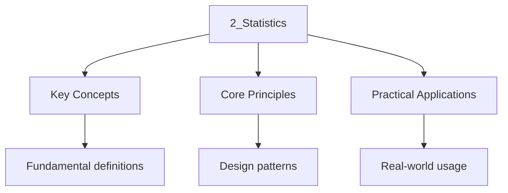

---

title: "Statistics | IB - Wyatt's Notes"
description: "Rigorous IB mathematics notes covering Statistics. Includes definitions, derivations, worked examples, and exam-style problems. hypothesis testing."
date: 2024-01-01T00:00:00Z
tags:
  - ib
---

<!-- Breadcrumb Schema for SEO -->

## Measures of Central Tendency

### Mean

The **arithmetic mean** of a data set $x_1, x_2, \ldots, x_n$:

$$
\bar{x} = \frac{1}{n}\sum_{i=1}^{n} x_i = \frac{\sum x_i}{n}
$$

For grouped data with frequencies $f_i$:

$$
\bar{x} = \frac{\sum f_i x_i}{\sum f_i}
$$

### Median

The **median** is the middle value when data is arranged in order.

- If $n$ is odd: median $= x_{\frac{n+1}{2}}$
- If $n$ is even: median $= \dfrac{x_{\frac{n}{2}} + x_{\frac{n}{2}+1}}{2}$

For grouped data, use linear interpolation within the median class.

### Mode

The **mode** is the most frequently occurring value. A data set can be unimodal, bimodal, or have no
Mode.

### Comparing Measures

| Measure | Advantages                                 | Disadvantages              |
| ------- | ------------------------------------------ | -------------------------- |
| Mean    | Uses all data points, algebraic properties | Affected by outliers       |
| Median  | Robust to outliers                         | Does not use all data      |
| Mode    | Simple, useful for categorical data        | May not exist or be unique |

:::note
<strong>Example</strong>
Find the mean, median, and mode of: $3, 5, 5, 7, 8, 9, 12, 15, 45$.

**Mean**: $\bar{x} = \dfrac{3+5+5+7+8+9+12+15+45}{9} = \dfrac{109}{9} \approx 12.1$

**Median**: 5th value $= 8$

**Mode**: $5$ (appears twice)

The mean (12.1) is significantly higher than the median (8) due to the outlier $45$.

---

<!-- Breadcrumb Schema for SEO -->

## Measures of Spread

### Range

$$
\mathrm{Range} = x_{\max} - x_{\min}
$$

### Interquartile Range (IQR)

$$
\mathrm{IQR} = Q_3 - Q_1
$$

Where $Q_1$ is the first quartile (25th percentile) and $Q_3$ is the third quartile (75th
Percentile).

### Variance

The **variance** measures the average squared deviation from the mean.

**Population variance**:

$$
\sigma^2 = \frac{1}{N}\sum_{i=1}^{N}(x_i - \mu)^2
$$

**Sample variance** (unbiased estimator):

$$
S^2 = \frac{1}{n-1}\sum_{i=1}^{n}(x_i - \bar{x})^2
$$

### Standard Deviation

$$
\sigma = \sqrt{\sigma^2} \quad \mathrm{or} \quad s = \sqrt{s^2}
$$

### Computational Formula

$$
S^2 = \frac{\sum x_i^2 - n\bar{x}^2}{n - 1} = \frac{n\sum x_i^2 - (\sum x_i)^2}{n(n-1)}
$$
:::
:::note
<strong>Example</strong>
Calculate the standard deviation of: $4, 8, 6, 5, 3, 8, 9, 2, 7$.

$$
N = 9, \quad \bar{x} = \frac{52}{9} \approx 5.778
$$

$$
\sum x_i^2 = 16 + 64 + 36 + 25 + 9 + 64 + 81 + 4 + 49 = 348
$$

$$
S^2 = \frac{348 - 9 \times (52/9)^2}{9 - 1} = \frac{348 - 300.44}{8} = \frac{47.56}{8} = 5.944
$$

$$
S \approx 2.438
$$
:::
:::caution
<strong>Exam Tip</strong>
Know whether to use the population formula ($\div N$) or the sample formula ($\div (n-1)$). In IB
Exams, when data is from a sample, use $s^2$ (dividing by $n-1$). Your GDC uses the sample Formula
by default.

---

<!-- Breadcrumb Schema for SEO -->

## Grouped Data

### Estimating the Mean from Grouped Data

Use the **midpoint** of each class interval:

$$
\bar{x} \approx \frac{\sum f_i m_i}{\sum f_i}
$$

Where $m_i$ is the midpoint of class $i$.

### Estimating the Median from Grouped Data

Use linear interpolation within the median class:

$$
\mathrm{Median} \approx L + \left(\frac{\frac{n}{2} - F}{f}\right) \times w
$$

Where:

- $L$ = lower boundary of median class
- $n$ = total frequency
- $F$ = cumulative frequency before median class
- $f$ = frequency of median class
- $w$ = class width
:::
:::note
<strong>Example</strong>
| Mass (g)           | Frequency |
| ------------------ | --------- |
| $0 \le m \lt 20$   | 5         |
| $20 \le m \lt 40$  | 12        |
| $40 \le m \lt 60$  | 18        |
| $60 \le m \lt 80$  | 10        |
| $80 \le m \lt 100$ | 5         |

Total $n = 50$. Median position $= \dfrac{50}{2} = 25$.

Cumulative frequencies: $5, 17, 35, 45, 50$.

Median is in the $40 \le m \lt 60$ class ($F = 17$, $f = 18$).

$$
\mathrm{Median} \approx 40 + \left(\frac{25 - 17}{18}\right) \times 20 = 40 + \frac{8}{18} \times 20 = 40 + 8.89 = 48.89 \mathrm{ g}
$$

---

<!-- Breadcrumb Schema for SEO -->

## Box-and-Whisker Plots

### Components

A box-and-whisker plot displays the **five-number summary**:

1. **Minimum** (or lower whisker)
2. **$Q_1$** (first quartile)
3. **Median** ($Q_2$)
4. **$Q_3$** (third quartile)
5. **Maximum** (or upper whisker)

### Outliers

A value is a potential outlier if it falls outside:

$$
Q_1 - 1.5 \times \mathrm{IQR} \quad \mathrm{or} \quad Q_3 + 1.5 \times \mathrm{IQR}
$$

### Interpreting Box Plots

- The **box** represents the middle 50% of data (IQR).
- The **line inside** the box is the median.
- **Whiskers** extend to the minimum and maximum (or to the most extreme non-outlier values).
- **Skewness**: if the median is closer to $Q_1$The data is right-skewed (positively skewed). If
  closer to $Q_3$Left-skewed (negatively skewed).

---

<!-- Breadcrumb Schema for SEO -->

## Cumulative Frequency

### Cumulative Frequency Graph (Ogive)

Plot cumulative frequency against the upper class boundary. From this graph, you can read:

- Median: at $\dfrac{n}{2}$
- Quartiles: at $\dfrac{n}{4}$ and $\dfrac{3n}{4}$
- Percentiles: at the appropriate fraction of $n$
:::
:::note
<strong>Example</strong>
Using the grouped data from the previous example:

| Upper boundary | Cumulative frequency |
| -------------- | -------------------- |
| 20             | 5                    |
| 40             | 17                   |
| 60             | 35                   |
| 80             | 45                   |
| 100            | 50                   |

To find $Q_1$ (at $12.5$): interpolate between $(20, 5)$ and $(40, 17)$.

$$
Q_1 \approx 20 + \frac{12.5 - 5}{17 - 5} \times 20 = 20 + 12.5 = 32.5 \mathrm{ g}
$$

---

<!-- Breadcrumb Schema for SEO -->

## Correlation

### Scatter Diagrams

A scatter diagram plots two variables to visually assess the relationship between them.

### Pearson"s Correlation Coefficient ($r$)

Measures the strength and direction of the linear relationship between two variables.

$$
R = \frac{\sum(x_i - \bar{x})(y_i - \bar{y})}{\sqrt{\sum(x_i - \bar{x})^2 \sum(y_i - \bar{y})^2}}
$$

### Properties of $r$

| Value            | Interpretation                      |
| ---------------- | ----------------------------------- |
| $r = 1$          | Perfect positive linear correlation |
| $r = -1$         | Perfect negative linear correlation |
| $r = 0$          | No linear correlation               |
| $0 \lt r \lt 1$  | Positive linear correlation         |
| $-1 \lt r \lt 0$ | Negative linear correlation         |

### Strength Guidelines

| $            | r        | $   | Strength |
| ------------ | -------- | --- | -------- |
| $0.0$--$0.3$ | Weak     |     |          |
| $0.3$--$0.7$ | Moderate |     |          |
| $0.7$--$1.0$ | Strong   |     |          |

### Computational Formula

$$
R = \frac{n\sum x_iy_i - \sum x_i \sum y_i}{\sqrt{[n\sum x_i^2 - (\sum x_i)^2][n\sum y_i^2 - (\sum y_i)^2]}}
$$
:::
:::caution
<strong>Exam Tip</strong>
Correlation does NOT imply causation. Two variables may be strongly correlated without one causing
The other (they may both be influenced by a third variable).

---

<!-- Breadcrumb Schema for SEO -->

## Linear Regression

### Least Squares Regression Line

The **line of best fit** minimises the sum of squared residuals:

$$
Y = a + bx
$$

Where:

$$
B = \frac{\sum(x_i - \bar{x})(y_i - \bar{y})}{\sum(x_i - \bar{x})^2} = \frac{n\sum x_iy_i - \sum x_i \sum y_i}{n\sum x_i^2 - (\sum x_i)^2}
$$

$$
A = \bar{y} - b\bar{x}
$$

### Regression Line of $x$ on $y$

If predicting $x$ from $y$:

$$
X = a' + b'y
$$

$$
B' = \frac{n\sum x_iy_i - \sum x_i \sum y_i}{n\sum y_i^2 - (\sum y_i)^2}
$$

### Coefficient of Determination ($r^2$)

$$
R^2 = \frac{\mathrm{explained variation}}{\mathrm{total variation}}
$$

$r^2$ represents the proportion of variance in $y$ explained by the linear relationship with $x$.

- $r^2 = 1$: the line explains all the variation.
- $r^2 = 0$: the line explains none of the variation.
:::
:::note
<strong>Example</strong>
Given the data:

| $x$ | 1   | 2   | 3   | 4   | 5    |
| --- | --- | --- | --- | --- | ---- |
| $y$ | 2.1 | 3.9 | 6.2 | 7.8 | 10.1 |

Find the regression line of $y$ on $x$.

$$
N = 5, \quad \sum x = 15, \quad \sum y = 30.1
$$

$$
\sum x^2 = 55, \quad \sum xy = 110.2
$$

$$
B = \frac{5(110.2) - 15(30.1)}{5(55) - 225} = \frac{551 - 451.5}{275 - 225} = \frac{99.5}{50} = 1.99
$$

$$
\bar{y} = 6.02, \quad \bar{x} = 3
$$

$$
A = 6.02 - 1.99(3) = 6.02 - 5.97 = 0.05
$$

Regression line: $y = 0.05 + 1.99x$.

### Extrapolation and Interpolation

- **Interpolation**: predicting within the range of data (generally reliable).
- **Extrapolation**: predicting outside the range of data (unreliable and potentially misleading).
:::
:::caution
<strong>Exam Tip</strong>
Never extrapolate beyond the data range without acknowledging the uncertainty. IB exam questions
Often ask you to comment on the reliability of a prediction.

---

<!-- Breadcrumb Schema for SEO -->

## Hypothesis Testing

### Key Concepts

- **Null hypothesis** ($H_0$): The statement being tested ( "no effect" or "no difference").
- **Alternative hypothesis** ($H_1$): The statement we suspect might be true.
- **Significance level** ($\alpha$): The threshold for rejecting $H_0$ (commonly 0.05 or 0.01).
- **Test statistic**: A value computed from the sample data.
- **$p$-value**: The probability of observing the test statistic (or more extreme) assuming $H_0$ is
  true.
- **Critical value**: The boundary value(s) that define the rejection region.

### Decision Rule

- If $p$-value $\lt \alpha$: **reject** $H_0$.
- If $p$-value $\ge \alpha$: **do not reject** $H_0$.

### Types of Errors

| Error Type | Description                                                                       |
| ---------- | --------------------------------------------------------------------------------- |
| Type I     | Rejecting $H_0$ when it is true (false positive). Probability $= \alpha$.         |
| Type II    | Failing to reject $H_0$ when it is false (false negative). Probability $= \beta$. |

### One-Tailed vs Two-Tailed Tests

| Test         | $H_1$                  | Rejection Region |
| ------------ | ---------------------- | ---------------- |
| Two-tailed   | Parameter $\neq$ value | Both tails       |
| Right-tailed | Parameter $\gt$ value  | Upper tail       |
| Left-tailed  | Parameter $\lt$ value  | Lower tail       |

### Hypothesis Test for Correlation

To test whether the population correlation coefficient $\rho$ is zero:

1. $H_0: \rho = 0$ and $H_1: \rho \neq 0$ (or $\rho \gt 0$ or $\rho \lt 0$).
2. Compute $r$ from the sample.
3. Compare $|r|$ with the critical value (or compute the $p$-value).
4. Make a conclusion.

The test statistic for large samples ($n \gt 30$):

$$
T = r\sqrt{\frac{n-2}{1-r^2}}
$$

Which follows a $t$-distribution with $n - 2$ degrees of freedom.
:::
:::note
<strong>Example</strong>
A sample of 12 students gives a correlation coefficient of $r = 0.85$ between hours studied and exam
Score. Test at the 5% significance level whether there is a positive correlation.

$H_0: \rho = 0$ vs $H_1: \rho \gt 0$.

This is a one-tailed test. The critical value for $n = 12$ at 5% level is approximately $0.497$.

Since $r = 0.85 \gt 0.497$We reject $H_0$.

There is sufficient evidence at the 5% level to conclude a positive correlation between hours
Studied and exam score.

### Chi-Squared Test for Independence

Used to determine whether two categorical variables are independent.

**Test statistic**:

$$
\chi^2 = \sum \frac{(O_i - E_i)^2}{E_i}
$$

Where $O_i$ are observed frequencies and $E_i$ are expected frequencies.

**Expected frequency**:

$$
E_`\{ij}` = \frac{(\mathrm{row } i \mathrm{ total}) \times (\mathrm{column } j \mathrm{ total})}{\mathrm{grand total}}
$$

**Degrees of freedom**: $\nu = (r-1)(c-1)$ where $r$ is the number of rows and $c$ is the number of
Columns.
:::
:::note
<strong>Example</strong>
Test whether gender and favourite subject are independent:

|        | Maths | Science | English | Total |
| ------ | ----- | ------- | ------- | ----- |
| Male   | 30    | 25      | 15      | 70    |
| Female | 20    | 20      | 40      | 80    |
| Total  | 50    | 45      | 55      | 150   |

Expected frequencies:

$E(\mathrm{Male, Maths}) = \dfrac{70 \times 50}{150} = 23.33$

$E(\mathrm{Male, Science}) = \dfrac{70 \times 45}{150} = 21.00$

$E(\mathrm{Male, English}) = \dfrac{70 \times 55}{150} = 25.67$

$E(\mathrm{Female, Maths}) = \dfrac{80 \times 50}{150} = 26.67$

$E(\mathrm{Female, Science}) = \dfrac{80 \times 45}{150} = 24.00$

$E(\mathrm{Female, English}) = \dfrac{80 \times 55}{150} = 29.33$

$$
\chi^2 = \frac{(30-23.33)^2}{23.33} + \frac{(25-21)^2}{21} + \frac{(15-25.67)^2}{25.67} + \frac{(20-26.67)^2}{26.67} + \frac{(20-24)^2}{24} + \frac{(40-29.33)^2}{29.33}
$$

$$
= 1.91 + 0.76 + 4.44 + 1.67 + 0.67 + 3.88 = 13.33
$$

Degrees of freedom: $(2-1)(3-1) = 2$.

Critical value at $\alpha = 0.05$ with $\nu = 2$: $5.99$.

Since $13.33 \gt 5.99$We reject $H_0$. Gender and favourite subject are not independent.
:::
:::caution
<strong>Exam Tip</strong>
For the chi-squared test, always check that all expected frequencies are at least 5. If any
$E_i \lt 5$Combine categories or note the limitation.

---

<!-- Breadcrumb Schema for SEO -->

## IB Exam-Style Questions

### Question 1 (Paper 1 style)

The marks of 8 students in Maths and Physics are:

| Student | Maths ($x$) | Physics ($y$) |
| ------- | ----------- | ------------- |
| `A`     | 72          | 68            |
| `B`     | 85          | 82            |
| `C`     | 60          | 58            |
| `D`     | 90          | 88            |
| `E`     | 78          | 74            |
| `F`     | 65          | 70            |
| `G`     | 88          | 85            |
| `H`     | 76          | 72            |

**(a)** Calculate Pearson's correlation coefficient.

Using a GDC: $r \approx 0.960$.

**(b)** Interpret this value.

There is a very strong positive linear correlation between Maths and Physics marks.

**(c)** Find the equation of the regression line of $y$ on $x$.

Using a GDC: $y \approx 5.10 + 0.917x$.

### Question 2 (Paper 2 style)

The reaction times (in seconds) of 20 drivers were measured:

0.42, 0.55, 0.61, 0.48, 0.72, 0.38, 0.65, 0.51, 0.44, 0.59, 0.67, 0.53, 0.46, 0.71, 0.39, 0.58,
0.63, 0.50, 0.57, 0.66

**(a)** Find the mean and standard deviation.

$\bar{x} \approx 0.555$, $s \approx 0.099$.

**(b)** Construct a box-and-whisker plot.

Ordered data: 0.38, 0.39, 0.42, 0.44, 0.46, 0.48, 0.50, 0.51, 0.53, 0.55, 0.57, 0.58, 0.59, 0.61,
0.63, 0.65, 0.66, 0.67, 0.71, 0.72.

Median: $\dfrac{0.55 + 0.57}{2} = 0.56$.

$Q_1$: median of lower half $= \dfrac{0.46 + 0.48}{2} = 0.47$.

$Q_3$: median of upper half $= \dfrac{0.63 + 0.65}{2} = 0.64$.

$\mathrm{IQR} = 0.64 - 0.47 = 0.17$.

Lower fence: $0.47 - 1.5(0.17) = 0.215$. Minimum $= 0.38$.

Upper fence: $0.64 + 1.5(0.17) = 0.895$. Maximum $= 0.72$.

No outliers.

### Question 3 (Paper 1 style)

A researcher claims that the mean height of a population is $170\mathrm{ cm}$. A sample of 25 people
Gives $\bar{x} = 173\mathrm{ cm}$ with $s = 8\mathrm{ cm}$. Test this claim at the 5% significance
Level.

$H_0: \mu = 170$ vs $H_1: \mu \neq 170$.

$$
T = \frac{\bar{x} - \mu_0}{s/\sqrt{n}} = \frac{173 - 170}{8/\sqrt{25}} = \frac{3}{1.6} = 1.875
$$

Degrees of freedom $= 24$.

Critical value (two-tailed, 5%) $\approx 2.064$.

Since $|1.875| \lt 2.064$We do not reject $H_0$.

There is insufficient evidence at the 5% level to reject the claim that the mean height is
$170\mathrm{ cm}$.

---

<!-- Breadcrumb Schema for SEO -->

## Summary

| Concept          | Formula                                                                                                         |
| ---------------- | --------------------------------------------------------------------------------------------------------------- |
| Mean             | $\bar{x} = \dfrac{\sum x_i}{n}$                                                                                 |
| Sample variance  | $s^2 = \dfrac{\sum(x_i - \bar{x})^2}{n-1}$                                                                      |
| IQR              | $Q_3 - Q_1$                                                                                                     |
| Correlation      | $r = \dfrac{n\sum x_iy_i - \sum x_i \sum y_i}{\sqrt{[n\sum x_i^2 - (\sum x_i)^2][n\sum y_i^2 - (\sum y_i)^2]}}$ |
| Regression slope | $b = \dfrac{n\sum x_iy_i - \sum x_i \sum y_i}{n\sum x_i^2 - (\sum x_i)^2}$                                      |
| Chi-squared      | $\chi^2 = \displaystyle\sum \dfrac{(O_i - E_i)^2}{E_i}$                                                         |
:::
:::tip
<strong>Exam Strategy</strong>
For .../4-statistics-and-probability/2_statistics questions in Paper 2, always show your working.
State hypotheses for Hypothesis tests. When using your GDC, note what function you used and the
inputs. Interpret results In context — never leave a numerical answer without explaining what it
means.

---

<!-- Breadcrumb Schema for SEO -->

## Transformations of Data

### Linear Transformations

If every data value is transformed by $y_i = ax_i + b$:

| Statistic               | Original    | Transformed                                      |
| ----------------------- | ----------- | ------------------------------------------------ | --- | ------------ |
| Mean                    | $\bar{x}$   | $a\bar{x} + b$                                   |     |              |
| Standard deviation      | $s_x$       | $                                                | a   | s_x$         |
| Variance                | $s_x^2$     | $a^2 s_x^2$                                      |     |              |
| Median                  | $Q_2$       | $aQ_2 + b$                                       |     |              |
| IQR                     | $Q_3 - Q_1$ | $                                                | a   | (Q_3 - Q_1)$ |
| Correlation coefficient | $r$         | $r$ (unchanged if $a \gt 0$Negated if $a \lt 0$) |     |              |

### Standardised Scores (z-scores)

The z-score measures how many standard deviations a value is from the mean:

$$
Z = \frac{x - \bar{x}}{s}
$$
:::
:::note
<strong>Example</strong>
In a test with mean 65 and standard deviation 8, a student scores 81. Find the z-score.

$$
Z = \frac{81 - 65}{8} = 2.0
$$

The student scored 2 standard deviations above the mean.

---

<!-- Breadcrumb Schema for SEO -->

## Non-Linear Regression

### Transformations for Non-Linear Data

When data shows a non-linear pattern, transform the variables to linearise:

| Relationship          | Transformation                        | Linear Form               |
| --------------------- | ------------------------------------- | ------------------------- |
| $y = a x^b$           | $\log y = \log a + b \log x$          | Plot $\log y$ vs $\log x$ |
| $y = a e^{bx}$        | $\ln y = \ln a + bx$                  | Plot $\ln y$ vs $x$       |
| $y = a + b\ln x$      | $y = a + b\ln x$                      | Plot $y$ vs $\ln x$       |
| $y = \frac{a}{x} + b$ | $y = a\!\left(\frac{1}{x}\right) + b$ | Plot $y$ vs $1/x$         |

### Power Law

If $\log y$ vs $\log x$ gives a straight line, then $y = ax^b$ where:

- $b$ is the gradient
- $\log a$ is the $y$-intercept

### Exponential Law

If $\ln y$ vs $x$ gives a straight line, then $y = ae^{bx}$ where:

- $b$ is the gradient
- $\ln a$ is the $y$-intercept
:::
:::note
<strong>Example</strong>
Data suggests $y$ is related to $x$ by $y = ax^b$. A plot of $\log y$ vs $\log x$ has gradient $1.5$
And $y$-intercept $0.7$. Find the relationship.

$$
B = 1.5, \quad \log a = 0.7 \implies a = 10^{0.7} \approx 5.01
$$

$$
Y \approx 5.01x^{1.5}
$$

---

<!-- Breadcrumb Schema for SEO -->

## Additional Exam-Style Questions

### Question 4 (Paper 2 style)

Two groups of students took a test. The results are summarised below:

Group A: $n = 30$$\bar{x} = 72$$s = 8$

Group B: $n = 25$$\bar{x} = 68$$s = 10$

**(a)** Find the overall mean.

$$
\bar{x}_{\mathrm{overall}} = \frac{30 \times 72 + 25 \times 68}{55} = \frac{2160 + 1700}{55} = \frac{3860}{55} = 70.2
$$

**(b)** Comment on the spread of the two groups.

Group B has a larger standard deviation (10 vs 8), meaning the scores are more spread out in Group
B. Group A's scores are more tightly clustered around the mean.

### Question 5 (Paper 2 style)

A scientist investigates the relationship between temperature ($x$In $\degree$C) and reaction rate
($y$In mol/L/s). The following data was collected:

| $x$ | 10  | 20  | 30  | 40  | 50   | 60   |
| --- | --- | --- | --- | --- | ---- | ---- |
| $y$ | 0.4 | 1.1 | 2.5 | 5.2 | 10.8 | 22.0 |

**(a)** Explain why a linear regression model may not be appropriate.

The data appears to show exponential growth — as temperature increases, the rate increases by an
Increasing amount. A plot of $y$ vs $x$ would show a curve, not a straight line.

**(b)** By plotting $\ln y$ against $x$Determine whether the relationship is of the form
$y = ae^{bx}$.

| $x$     | 10       | 20      | 30      | 40      | 50      | 60      |
| ------- | -------- | ------- | ------- | ------- | ------- | ------- |
| $\ln y$ | $-0.916$ | $0.095$ | $0.916$ | $1.649$ | $2.380$ | $3.091$ |

A plot of $\ln y$ vs $x$ would show an approximately linear relationship with a positive gradient,
Confirming the exponential model is appropriate.

**(c)** Using a GDC, find the equation of the regression line of $\ln y$ on $x$.

The regression gives approximately $\ln y = -1.40 + 0.074x$.

So $y = e^{-1.40}e^{0.074x} \approx 0.247e^{0.074x}$.

### Question 6 (Paper 1 style)

The correlation coefficient between study hours and exam scores for 50 students is $r = 0.72$.

**(a)** Calculate the coefficient of determination and interpret it.

$$
R^2 = 0.5184
$$

About $51.8\%$ of the variation in exam scores is explained by the linear relationship with study
Hours.

**(b)** The $p$-value for testing $H_0: \rho = 0$ is $0.0001$. What conclusion can be drawn?

Since $p = 0.0001 \lt 0.05$We reject $H_0$. There is strong evidence of a positive correlation
Between study hours and exam scores.

---

<!-- Breadcrumb Schema for SEO -->

## Measures of Shape: Skewness and Kurtosis

### Skewness

Skewness measures the asymmetry of the distribution.

| Type                  | Description            | Mean vs Median    |
| --------------------- | ---------------------- | ----------------- |
| Positive (right) skew | Long tail to the right | Mean $\gt$ Median |
| Negative (left) skew  | Long tail to the left  | Mean $\lt$ Median |
| Symmetric             | No skew                | Mean = Median     |

The **Pearson coefficient of skewness**:

$$
\mathrm{Skewness} = \frac{3(\bar{x} - Q_2)}{s}
$$

### Kurtosis

Kurtosis measures the "tailedness" of the distribution compared to a normal distribution.

| Type        | Description                                |
| ----------- | ------------------------------------------ |
| Leptokurtic | Heavy tails, sharp peak (kurtosis $\gt 3$) |
| Mesokurtic  | Same as normal (kurtosis $= 3$)            |
| Platykurtic | Light tails, flat peak (kurtosis $\lt 3$)  |

---

<!-- Breadcrumb Schema for SEO -->

## Standardised Scores and Normal Distribution Tables

### Using z-Scores

Given a population with mean $\mu$ and standard deviation $\sigma$:

1. Convert raw score to z-score: $z = \dfrac{x - \mu}{\sigma}$
2. Use the standard normal table (or GDC) to find probabilities.
3. Convert back: $x = \mu + z\sigma$

### Finding Percentiles

The $p$-th percentile is the value below which $p\%$ of the data falls.

$$
X_p = \mu + z_p \cdot \sigma
$$

Where $z_p$ is the z-score such that $P(Z \lt z_p) = p/100$.
:::
:::note
<strong>Example</strong>
Scores on a test are normally distributed with $\mu = 72$ and $\sigma = 8$. Find the 90th
Percentile.

$$
Z_{0.90} = 1.282
$$

$$
X_{90} = 72 + 1.282 \times 8 = 72 + 10.26 = 82.26
$$

A score of 82.26 is at the 90th percentile.
:::
---

<!-- Breadcrumb Schema for SEO -->

## Data Collection Methods

### Types of Data

| Type                      | Description          | Examples                         |
| ------------------------- | -------------------- | -------------------------------- |
| Qualitative (categorical) | Labels or names      | Colour, gender, nationality      |
| Quantitative              | Numerical            | Height, mass, temperature        |
| Discrete                  | Integer values       | Number of siblings, goals scored |
| Continuous                | Any value in a range | Height, time, mass               |

### Sampling Methods

| Method        | Description                    | Advantages             | Disadvantages                   |
| ------------- | ------------------------------ | ---------------------- | ------------------------------- |
| Simple random | Every member has equal chance  | Unbiased               | Difficult for large populations |
| Systematic    | Every $k$-th member selected   | Easy to implement      | May be periodic bias            |
| Stratified    | Population divided into strata | Ensures representation | Complex to organise             |
| Quota         | Fixed numbers from each group  | Quick                  | Not random                      |
| Convenience   | accessible members             | Easy                   | Likely biased                   |

### Reliability and Validity

- **Reliability**: consistency of measurements (repeatable).
- **Validity**: measures what it claims to measure.
- A measurement can be reliable without being valid, but not valid without being reliable.

---

<!-- Breadcrumb Schema for SEO -->

:::tip
contains the hardest questions within the IB specification for this topic, each with a full worked
solution.

**Unit tests** probe edge cases and common misconceptions. **Integration tests** combine Statistics
with other IB mathematics topics to test synthesis under exam conditions.

See for instructions on self-marking
and building a personal test matrix.

## Intuition

Statistics is the science of making decisions under uncertainty. The mean tells you the center of the data, but the standard deviation tells you how much trust to place in that center — a low standard deviation means the data clusters tightly around the mean, while a high one means the data spreads widely. Correlation measures the strength of a linear relationship, but it does not prove causation — two variables may move together because a third hidden variable drives both. Hypothesis testing is a courtroom argument: you assume innocence (the null hypothesis) and check whether the evidence is strong enough to convict. The p-value is the probability of seeing evidence this extreme if innocence is true.

## Common Pitfalls

1. Confusing the domain and range of functions, or not considering restrictions (e.g., denominator
   cannot be zero).

2. Misreading the question, particularly with 'hence' vs 'hence or otherwise'. The former requires
   using previous work.

3. Confusing $P(A|B)$ with $P(B|A)$. These are related by Bayes' theorem but are not equal in
   general.

## Cross-References

| Topic        | Site | Link                                                                                   |
| ------------ | ---- | -------------------------------------------------------------------------------------- |
| [Statistics] | IB   | [View](https://ib.wyattau.com/docs/ib/maths/4-statistics-and-probability/2_statistics) |
| [Statistics] | DSE  | [View](https://dse.wyattau.com/docs/dse/maths/compulsory/12_dispersion)                |

## Worked Examples

Worked examples demonstrating the application of key concepts are covered in the detailed sub-pages
linked above.
:::

## See Also

- [Statistics And Probability](./)
- [Probability](./1_probability)
- [Probability Distributions](./3_probability-distributions)
