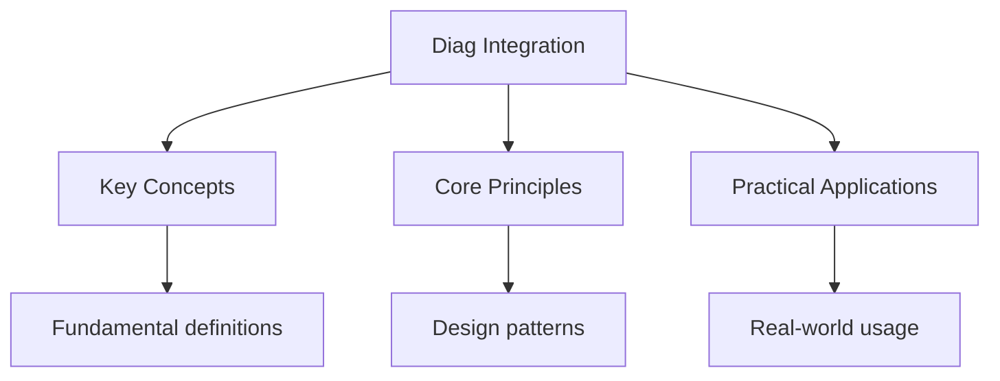

---

date: 2026-07-23T21:57:32+01:00
title: "Integration -- Diagnostic Tests"
description: "IB Maths Integration -- Diagnostic Tests notes covering key definitions, core concepts, worked examples, and practice questions for in-depth revision."
tableOfContents: false
---

<!-- Breadcrumb Schema for SEO -->

## Integration — Diagnostic Tests

## Intuition

**Integration is like adding up infinitely many infinitely thin slices — it's the mathematical tool for finding total quantities from rates of change:** Integration and differentiation are inverse operations — the fundamental theorem of calculus connects accumulation with instantaneous change

**Why it matters:** Integration calculates areas, volumes, probabilities, and totals that would be impossible to measure directly

**The key insight:** Integration and differentiation are inverse operations — the fundamental theorem of calculus connects accumulation with instantaneous change

## Unit Tests

> Tests edge cases, boundary conditions, and common misconceptions for integration.

### UT-1: Integration by Parts — Cyclic Integral Trap

**Question:**

**(a)** Evaluate $\displaystyle\int e^{2x}\sin x\,dx$.

**(b)** A student sets up $I = \int e^{2x}\sin x\,dx$Applies integration by parts twice, and gets
$I = \text{(something)} - I$ Then concludes $I = 0$. Explain the error.

[Difficulty: hard. Tests cyclic integration by parts and the algebraic step of collecting the $I$
terms.]

**Solution:**

**(a)** Let $I = \displaystyle\int e^{2x}\sin x\,dx$.

First application: $u = e^{2x}$$dv = \sin x\,dx$. Then $du = 2e^{2x}\,dx$$v = -\cos x$.

$$I = -e^{2x}\cos x + \int 2e^{2x}\cos x\,dx$$

Second application on $\int e^{2x}\cos x\,dx$: $u = e^{2x}$, $dv = \cos x\,dx$. Then
$du = 2e^{2x}\,dx$, $v = \sin x$.

$$\int e^{2x}\cos x\,dx = e^{2x}\sin x - \int 2e^{2x}\sin x\,dx = e^{2x}\sin x - I$$

Substitute back:

$$I = -e^{2x}\cos x + 2e^{2x}\sin x - 2I$$

$$3I = e^{2x}(2\sin x - \cos x)$$

$$I = \frac{e^{2x}(2\sin x - \cos x)}{3} + C$$

**(b)** The student"s error is that when they got $I = \text{(something)} - I$They incorrectly
concluded $I = 0$. The correct step is to add $I$ to both sides to get $2I = \text{(something)}$ Then
divide by $2$ (or in this case $3$). The cyclic nature of the integral means $I$ appears on both
sides, but this does not mean $I = 0$ — it means $I$ can be solved for algebraically.

---

<!-- Breadcrumb Schema for SEO -->

### UT-2: Partial Fractions with Irreducible Quadratic

**Question:**

**(a)** Express $\dfrac{3x - 1}{(x + 1)(x^2 + 1)}$ in partial fractions.

**(b)** Hence evaluate $\displaystyle\int \frac{3x - 1}{(x + 1)(x^2 + 1)}\,dx$.

**(c)** A student attempts to split the denominator as $\dfrac{A}{x + 1} + \dfrac{B}{x^2 + 1}$ and
gets $A = 3$, $B = -1$. Show that this is incorrect.

[Difficulty: hard. Tests partial fraction decomposition with an irreducible quadratic factor and the
correct form of the decomposition.]

**Solution:**

**(a)** Since $x^2 + 1$ is irreducible (discriminant $= -4 \lt 0$), the correct form is:

$$\frac{3x - 1}{(x + 1)(x^2 + 1)} = \frac{A}{x + 1} + \frac{Bx + C}{x^2 + 1}$$

$$3x - 1 = A(x^2 + 1) + (Bx + C)(x + 1)$$

$$3x - 1 = Ax^2 + A + Bx^2 + Bx + Cx + C$$

$$3x - 1 = (A + B)x^2 + (B + C)x + (A + C)$$

Comparing coefficients:

- $x^2$: $A + B = 0$ \quad (i)
- $x$: $B + C = 3$ \quad (ii)
- constant: $A + C = -1$ \quad (iii)

From (i): $B = -A$. From (iii): $C = -1 - A$.

Substitute into (ii): $-A + (-1 - A) = 3 \implies -2A - 1 = 3 \implies -2A = 4 \implies A = -2$.

Then $B = 2$ and $C = -1 - (-2) = 1$.

$$\frac{3x - 1}{(x + 1)(x^2 + 1)} = \frac{-2}{x + 1} + \frac{2x + 1}{x^2 + 1}$$

**(b)**

$$\int \frac{3x - 1}{(x + 1)(x^2 + 1)}\,dx = \int \frac{-2}{x + 1}\,dx + \int \frac{2x + 1}{x^2 + 1}\,dx$$

$$= -2\ln\lvert x + 1 \rvert + \int \frac{2x}{x^2 + 1}\,dx + \int \frac{1}{x^2 + 1}\,dx$$

$$= -2\ln\lvert x + 1 \rvert + \ln(x^2 + 1) + \arctan x + C$$

**(c)** If the student uses $\dfrac{A}{x + 1} + \dfrac{B}{x^2 + 1}$ Then:

$$3x - 1 = A(x^2 + 1) + B(x + 1) = Ax^2 + A + Bx + B$$

Comparing coefficients: $A = 0$ (from $x^2$ term), $B = 3$ (from $x$ term), and $A + B = 3 = -1$
(from constant term), which is a contradiction ($3 \neq -1$). This shows the form
$\dfrac{B}{x^2 + 1}$ is incorrect — the numerator must be linear: $\dfrac{Bx + C}{x^2 + 1}$.

---

<!-- Breadcrumb Schema for SEO -->

### UT-3: Improper Integral — Convergence with Parameter

**Question:**

**(a)** Determine whether $\displaystyle\int_1^{\infty} \frac{1}{x^p}\,dx$ converges or diverges,
stating the condition on $p$.

**(b)** Evaluate $\displaystyle\int_0^1 \frac{1}{\sqrt{x}}\,dx$ and explain why it converges despite
the integrand being unbounded.

**(c)** A student claims that since $\dfrac{1}{\sqrt{x}} \to \infty$ as $x \to 0^+$The integral must
diverge. Explain the error.

[Difficulty: hard. Tests improper integrals at both endpoints and the $p$-test for convergence.]

**Solution:**

**(a)**

$$\int_1^{\infty} \frac{1}{x^p}\,dx = \lim_{b \to \infty}\int_1^b x^{-p}\,dx$$

Case $p \neq 1$:

$$= \lim_{b \to \infty}\left[\frac{x^{1-p}}{1-p}\right]_1^b = \lim_{b \to \infty}\left(\frac{b^{1-p}}{1-p} - \frac{1}{1-p}\right)$$

- If $p \gt 1$: $1 - p \lt 0$ So $b^{1-p} \to 0$ and the integral converges to $\dfrac{1}{p - 1}$.
- If $p \lt 1$: $1 - p \gt 0$ So $b^{1-p} \to \infty$ and the integral diverges.

Case $p = 1$:

$$\int_1^{\infty} \frac{1}{x}\,dx = \lim_{b \to \infty}\ln b = \infty \quad \text{(diverges)}$$

The integral converges if and only if $p \gt 1$.

**(b)**

$$\int_0^1 \frac{1}{\sqrt{x}}\,dx = \lim_{a \to 0^+}\int_a^1 x^{-1/2}\,dx = \lim_{a \to 0^+}\left[2\sqrt{x}\right]_a^1 = \lim_{a \to 0^+}(2 - 2\sqrt{a}) = 2$$

The integral converges to $2$. Although the integrand is unbounded at $x = 0$The area under the
curve is finite because the singularity is integrable (the exponent $-\frac{1}{2} \gt -1$).

**(c)** The student confuses the behaviour of the integrand with the behaviour of the integral. An
unbounded integrand does not necessarily produce a divergent integral. The key question is whether
the **area** accumulates to a finite value. For $\frac{1}{\sqrt{x}}$ near $x = 0$The function grows,
but slowly enough that the total area remains bounded. The $p$-test shows that $\int_0^1 x^{-p}\,dx$
converges when $p \lt 1$.

---

<!-- Breadcrumb Schema for SEO -->

## Integration Tests

> Tests synthesis of integration with other topics.

### IT-1: Area Between Curves with Trigonometry

**Question:**

Find the total area enclosed by the curves $y = \sin x$ and $y = \cos x$ for $0 \le x \le \pi$.

[Difficulty: hard. Combines curve sketching, intersection finding, and definite integration with
absolute value.]

**Solution:**

Find intersection points in $[0, \pi]$:

$$\sin x = \cos x \implies \tan x = 1 \implies x = \frac{\pi}{4}$$

In $[0, \pi]$This is the only intersection.

Check which curve is on top:

- For $0 \lt x \lt \frac{\pi}{4}$: $\cos x \gt \sin x$ (e.g., at $x = 0$:
  $\cos 0 = 1 \gt 0 = \sin 0$).
- For $\frac{\pi}{4} \lt x \lt \pi$: $\sin x \gt \cos x$ (e.g., at $x = \frac{\pi}{2}$:
  $\sin\frac{\pi}{2} = 1 \gt 0 = \cos\frac{\pi}{2}$).

$$\text{Area} = \int_0^{\pi/4}(\cos x - \sin x)\,dx + \int_{\pi/4}^{\pi}(\sin x - \cos x)\,dx$$

$$= \left[\sin x + \cos x\right]_0^{\pi/4} + \left[-\cos x - \sin x\right]_{\pi/4}^{\pi}$$

First integral:
$\sin\frac{\pi}{4} + \cos\frac{\pi}{4} - (\sin 0 + \cos 0) = \frac{\sqrt{2}}{2} + \frac{\sqrt{2}}{2} - 1 = \sqrt{2} - 1$.

Second integral:
$(-\cos\pi - \sin\pi) - (-\cos\frac{\pi}{4} - \sin\frac{\pi}{4}) = (1 - 0) - \!\left(-\frac{\sqrt{2}}{2} - \frac{\sqrt{2}}{2}\right) = 1 + \sqrt{2}$.

$$\text{Area} = (\sqrt{2} - 1) + (1 + \sqrt{2}) = 2\sqrt{2}$$

---

<!-- Breadcrumb Schema for SEO -->

### IT-2: Volume of Revolution with Substitution (with Algebra)

**Question:**

The region bounded by $y = \dfrac{1}{\sqrt{x + 1}}$, $x = 0$, $x = 3$ And the $x$-axis is rotated
$360\degree$ about the $x$-axis. Find the volume generated.

[Difficulty: hard. Combines volume of revolution with algebraic substitution and definite integral
evaluation.]

**Solution:**

$$V = \pi\int_0^3 \left(\frac{1}{\sqrt{x+1}}\right)^2 dx = \pi\int_0^3 \frac{1}{x + 1}\,dx$$

$$= \pi\Big[\ln(x + 1)\Big]_0^3 = \pi(\ln 4 - \ln 1) = \pi \ln 4 = 2\pi \ln 2$$

## Cross-References

- **[Number and Algebra](../1-number-and-algebra/1_number-and-algebra):** Algebra is foundational
- **[Functions](../../../../../../alevel/src/content/docs/maths/pure-mathematics/05-functions):** Functions are central
- **[Calculus](../../../../../../hsc/src/content/docs/mathematics/calculus):** Calculus is a major topic
