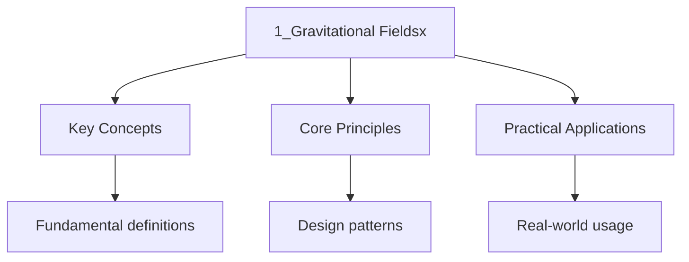

---

title: "Gravitational Fields | IB - Wyatt's Notes"
description: "Rigorous IB physics notes covering Gravitational Fields. Includes definitions, derivations, worked examples, and exam-style problems."
date: 2024-01-01T00:00:00Z
tags:
  - ib
---

import PhetSimulation from "@components/PhetSimulation";

## Point Mass

An idealized object with non-zero mass and infinitesimal volume.

_Requirements_:

- The object have an even mass distribution
- The dimensions considered is larger than the size of the object

## Kepler's Three Laws of Orbital Motion

### Origins

Also called Kepler's laws of planetary motion, where the first two laws were published by Johannes
Kepler in 1609, and the third being completed in 1619. These laws describes the planetary motions of
Orbital bodies.

### First Law

The orbit of any planet about the Sun is an ellipse with one of the focus being the Sun, where the
Orbit govern the separation distance ($r$) between the center of the Sun and the orbital body.
Expressing the $r$ mathematically as a function of angle ($\theta$) measured from the Sun:

$$
\begin`\{aligned}`
 r(\theta) = \frac\{a(1-e^2)\}\{1+e \cos \theta\}
\end`\{aligned}`
$$

Where:

$e$: Orbital eccentricity, where elliptic orbit constraint e to $0 < e < 1$

$a$: Semi-major axis, defined by the distance between the center and the furthest distance from the
Center

### Second Law

Equal areas are constructed by the sweeping of line segments at equal time interval. This implies
The change of area ($A$) by time ($t$) is constant, expressing this relationship mathematically:

$$
\begin`\{aligned}`
 \frac`\{dA}``\{dt}` = \frac\{1\}\{2\} r^2 d\theta \quad \because A = \frac\{1\}\{2\} r^2 \theta
\end`\{aligned}`
$$

As orbital bodies can be approximated by point masses, the
[moment of inertia ($I$)](../1-space-time-and-motion/5_forces-and-momentum#moment-of-inertia) of The
orbital body can be approximated by:

$$
\begin`\{aligned}`
 I = mr^2
\end`\{aligned}`
$$

Hence the
[angular momentum ($L$)](../1-space-time-and-motion/5_forces-and-momentum#angular-momentum) of the
Orbital body would be:

$$
\begin`\{aligned}`
 L = mr^2\omega = mr^2 \frac\{d\theta\}`\{dt}`\\
 \frac\{d\theta\}`\{dt}` = \frac\{L\}\{mr^2\}
\end`\{aligned}`
$$

Substituting $\frac{d\theta}{dt}$:

$$
\begin`\{aligned}`
 \frac`\{dA}``\{dt}` = \frac\{1\}\{2\}r^2 \left(\frac\{L\}\{mr^2\} \right)\\
 \frac`\{dA}``\{dt}` = \frac\{L\}\{2m\}
\end`\{aligned}`
$$

Since angular momentum is conserved under centripetal force, Kepler's second law holds.

### Third Law

The orbital period of a planet, squared is directly proportional to the semi major axes ($a$). This
Relationship can be presented as:

$$
\begin`\{aligned}`
 T^2 \propto a^3
\end`\{aligned}`
$$

## Newton's Law of Universal Gravitation

Newton's Universal Law of Gravitation states that every point mass attracts every other point mass
By a gravitational force attracting both points. This force is given by:

$$
\begin`\{aligned}`
 F=G\frac\{m_1 m_2\}\{r^2\}
\end`\{aligned}`
$$

Where:

$G$: Gravitational constant
($6.67 \times 10^{-11} \mathrm{ m}^3 \mathrm{ kg}^{-1} \mathrm{ s}^{-2}$)

$m_1, m_2$: The mass of the two point masses

$r$: The separation distance between the point mass, where bodies approximated to point masses are
Measured from the center

:::note
<strong>The IB uses the Newton's Universal Law of Gravitation published in 1687, where the equation</strong>

Only describes the magnitude of the force, the vector form is required to describe the force
$\bm{F}$ on $m_2$ with the direction, with $\bm{r}$ being the separation displacement
($r= r_2 - r_1$) from $m_1$ to $m_2$:

$$
\begin`\{aligned}`
 \bm\{F\} = -G\frac\{m_1 m_2\}\{|\bm\{r\}|^2\}\bm\{\hat\{r\}\}, \qquad \left(\bm\{\hat\{r\}\} = \frac\{\bm\{r\}\}\{|\bm\{r\}|\}\right)
\end`\{aligned}`
$$

This describes the force in the inverse direction as the displacement vector from $m_1$
:::
:::caution
<strong>IB extends Newton's Law of Universal Gravitation to include spherical masses with uniform</strong>

Density by assuming to be point mass.
:::
## Gravitational Field

<PhetSimulation client:only="solid-js" simulationId="gravity-and-orbits" title="Gravity and Orbits"  />

Simulate gravitational interactions between a star, planet, and moon. Adjust the masses and observe
How orbital speed, period, and gravitational force change.

A gravitational field ($g$) is a vector field with dimension of
[acceleration](../1-space-time-and-motion/5_forces-and-momentum#acceleration), where the
Acceleration of each point determine the motion of bodies in the field.

### Gravitational Potential Energy

Gravitational potential energy ($E_p$ or $U$) is the minimum work required to translate a mass from
Infinite distance to a point in the gravitational field. The work done is therefore the resultant
Force ($F_{ext}$) opposing the gravitational force ($F_g$) at each point from infinity to the
Current position ($\bm{r}$). To determine the gravitational potential energy of a point with a
Displacement ($R$) from the [point mass](#point-mass), the work done is therefore:

$$
\begin`\{aligned}`
 U = E_p = \int_\{\infty\}^\{R\} F_`\{ext}`(\bm\{r\}) \cdot d\bm\{r\} = -\int_\{\infty\}^\{R\} F_g(\bm\{r\}) \cdot d\bm\{r\}
\end`\{aligned}`
$$

Since $d\bm{r}$ act inwards, and $F(\bm{r})$ acts opposite to $\bm{\hat{r}}$The dot product Between
two vectors simplify to a scalar calculation:

$$
\begin`\{aligned}`
 F_g(r) \cdot dr = \left(-\frac\{G m_1 m_2\}\{|r|^2\}\right)(-|dr|)= \frac\{Gm_1 m_2\}\{|r|^2\} |dr|\\
 U = -\int_\{\infty\}^\{R\} \frac\{Gm_1 m_2\}\{|r|^2\} |dr| = -Gm_1 m_2 \left[-\frac\{1\}\{|r|\}\right]_R^\infty\\
 U = E_p = -G\frac\{m_1 m_2\}\{|R|\}
\end`\{aligned}`
$$

The IB formula booklet label this equation with $r$ as $|R|$:

$$
\begin`\{aligned}`
 E_p = -G \frac\{m_1 m_2\}\{r\}
\end`\{aligned}`
$$

### Gravitation Potential

The gravitational potential ($V_g$) is the
[gravitational potential energy](#gravitational-potential-energy) per unit mass of a body with a
[displacement](../1-space-time-and-motion/5_forces-and-momentum#displacement) magnitude of $r$. For
A body with mass $m_2$ interacting with the magnetic field of a body with mass $m_1$The
Gravitational potential is:

$$
\begin`\{aligned}`
 V_g = \frac\{E_p\}\{m_2\} = -G \frac\{m_1 m_2\}\{m_2 r\} = -G\frac\{m_1\}\{r\}
\end`\{aligned}`
$$

The IB formula booklet label this equation with $M$ as $m_1$:

$$
\begin`\{aligned}`
 V_g = -G \frac\{M\}\{r\}
\end`\{aligned}`
$$

#### Change of Gravitational Potential

The work done ($W$) by a translation of a body with a mass ($m$) in a gravitational field by a point
Mass ($M$) corresponds to the change in gravitational potential energy ($\Delta E_p$) between two
Position with different gravitational potential:

$$
\begin`\{aligned}`
 W = \Delta E_p = G\frac`\{Mm}`\{r_2\} - G\frac`\{Mm}`\{r_1\} = m \Delta V_g
\end`\{aligned}`
$$

### Gravitational Field Strength

The gravitational field strength ($\bm{g}$) is the
[acceleration](../1-space-time-and-motion/5_forces-and-momentum#acceleration) (force per unit mass)
Experience by bodies of mass ($m$) interacting with the [gravitational field](#gravitational-field),
Therefore, calculated as:

$$
\begin`\{aligned}`
 g = \frac\{F\}\{m\}
\end`\{aligned}`
$$

Since the [gravitational potential energy](#gravitational-potential-energy) is the minimum work
Required to translate a body from a infinite displacement to displacement at $r$The work done by
Gravity is inherently in the opposite direction:

$$
\begin`\{aligned}`
 W_g = -E_p = -U
\end`\{aligned}`
$$

Therefore, the gravitational field strength can also be determined by the negative gradient of the
Gravitational potential $V_g$:

$$
\begin`\{aligned}`
 g = -\nabla V_g\\
\end`\{aligned}`
$$

Since the gravitational field is radial, $\nabla V_g$ can be determined in spherical axis:

$$
\begin`\{aligned}`
 \nabla V_g = \frac\{dV_g\}`\{dr}`\hat\{r\}\\
 \frac\{dV_g\}`\{dr}` = \frac\{d\}`\{dr}`\left(-\frac`\{GM}`\{r\}\right) = G\frac\{M\}\{r^2\}\\
 g = -G\frac\{M\}\{r^2\} \hat\{r\}
\end`\{aligned}`
$$

The IB formula booklet only considers magnitude, hence expressing only the magnitude of g:

$$
\begin`\{aligned}`
 g = G\frac\{M\}\{r^2\}
\end`\{aligned}`
$$

When expressing this with the average change of
[gravitational potential $V_g = -G\frac{M}{r}$](#gravitation-potential), the magnitude of g is:

$$
\begin`\{aligned}`
 g = -\frac\{\Delta V_g\}\{\Delta r\}
\end`\{aligned}`
$$

### Graphical Presentation of Gravitational Field

#### Gravitational Field Lines

Gravitational field lines represent the direction of acceleration (equivalent to the gradient of
Gravitational potential) in the gravitational field, and the hence the direction of force applied on
Mass interacting with the gravitational field.

#### Equipotential Surfaces

Equipotential surfaces represent the region in space with equivalent gravitational potential.
Combining the gravitational field lines and equipotential surface allow the representation of a
Gravitational field with direction of gravitational field strength and magnitude of gravitational
Potential at different surfaces.

### Escape Velocity

The escape velocity ($v_e$) is the minimum speed required for a body to sustain attraction by
Gravitational field strength but continue to move to an infinite displacement without further
External force applied. This is valid under two assumptions:

- Ballistic trajectory: No other force than gravitational force is applied on the body
- No gravitational fields from other masses are considered

These assumptions along with the conservation of mechanical energy allow the total energy change is
Zero ($E_f - E_i = 0$), where gravitational potential energy at infinite displacement is $0$ by
Definition, and kinetic energy at infinite displacement is $0$ due to velocity approaching $0$ with
Gravitational field strength decelerating along the whole trajectory. This means the
$E_f = E_i = E_k + E_p = 0+0 = 0$Using their definitions:

$$
\begin`\{aligned}`
 E_i = \frac\{1\}\{2\}mv_e^2 - \frac`\{GMm}`\{r\} = 0\\
 \frac\{1\}\{2\}mv_e^2 = \frac`\{GMm}`\{r\}\\
 v_e^2 = \frac\{2GM\}\{r\}\\
 v_e = \sqrt\{\frac\{2GM\}\{r\}\}
\end`\{aligned}`
$$

### Orbital speed

Orbital speed is the required speed for an object to remain in stable orbit around a barycenter or a
Center of a body with significantly more mass.

:::caution
<strong>In IB, only the cases of orbiting a body with significantly more mass is present. The IB</strong>

Also assume all orbits to be circular instead of elliptic as stated by
[Keplar's First Law](#first-law).
:::
In a stable circular orbit, equivalent force in the opposite direction is required to balance the
[centripetal force](../1-space-time-and-motion/5_forces-and-momentum#centripetal-force) $F_c$ of
[gravitational force](#newtons-law-of-universal-gravitation) $F_g$:

$$
\begin`\{aligned}`
 F_`\{total}` = F_g + (-F_c) = 0 \\
 -\frac`\{GMm}`\{r^2\}\bm\{\hat\{r\}\} + -(-\frac\{mv^2\}\{r\}\bm\{\hat\{r\}\}) = 0\\
 \left(-\frac`\{GMm}`\{r^2\} + \frac\{mv^2\}\{r\}\right)\bm\{\hat\{r\}\} = 0\\
 \frac\{mv^2\}\{r\} = \frac`\{GMm}`\{r^2\}\\
 v = \sqrt\{\frac`\{GM}`\{r\}\}
\end`\{aligned}`
$$

:::note
<strong>IB does only consider the magnitude of orbital velocity, therefore, the equation above is</strong>

The one written in the formula booklet. The angle of orbital velocity is dependent on the angular
Position $\theta$ of the orbital body:

$$
\begin`\{aligned}`
 \bm\{\hat\{r\}\} = \cos \theta \hat\{i\} + \sin \theta \hat\{j\}
 \frac\{d\bm\{\hat\{r\}\}\}\{d\theta\} = - \sin \theta \hat\{i\} + \cos \theta \hat\{j\}
\end`\{aligned}`
$$

As the derivative is a unit vector:

$$
\begin`\{aligned}`
 \bm\{\hat\{\theta\}\} = - \sin \theta \hat\{i\} + \cos \theta \hat\{j\}
\end`\{aligned}`
$$
:::
## Viscous Drag in Atmosphere

The viscous drag ($F_{drag}$) on an orbiting body is influenced by the altitude (due to atmospheric
Density decreases with height) and orbital velocity by the formula:

$$
\begin`\{aligned}`
 F_`\{drag}` = \frac\{1\}\{2\}C_dA\rho v^2\\
 \rho(h) = \rho_0 e^\{-\frac\{h\}\{H\}\}, \quad H \approx 8 \mathrm\{ km\}\\
 v = \sqrt\{\frac`\{GM}`\{r\}\}\\
 F_`\{drag}` = \frac\{1\}\{2\}C_d A \rho_0 e^\{-\frac\{h\}\{H\}\} \left(\frac`\{GM}`\{r\}\right)\\
 \therefore F \propto \frac\{e^\{-\frac\{h\}\{H\}\}\}\{r\}
\end`\{aligned}`
$$

Where:

$\rho_0$: density at sea level

$h$: height

$H$: Scale height

Since $e^{-{\frac{h}{H}}}$ approaches $0$ at a faster rate than $\frac{1}{r}$ approaching $0$
Therefore viscous drag decrease rapidly at increasing altitudes.

## Derivation of Kepler's Third Law from Newton's Law of Gravitation

Kepler's third law follows from
[Newton's Law of Universal Gravitation](#newtons-law-of-universal-gravitation) and
[circular orbital motion](#orbital-speed). Equating gravitational and
[centripetal force](../1-space-time-and-motion/5_forces-and-momentum#centripetal-force), then
Substituting $v = 2\pi r / T$:

$$
\begin`\{aligned}`
 \frac`\{GMm}`\{r^2\} = \frac\{mv^2\}\{r\} \implies v^2 = \frac`\{GM}`\{r\} \implies \left(\frac\{2\pi r\}\{T\}\right)^2 = \frac`\{GM}`\{r\} \implies T^2 = \frac\{4\pi^2\}`\{GM}` r^3
\end`\{aligned}`
$$

:::note
<strong>Since $\frac{4\pi^2}{GM}$ is constant for a given central body, this reduces to</strong>

$T^2 \propto r^3$. For elliptical orbits, replace $r$ with semi-major axis $a$.
:::
## Gravitational Field Inside a Spherical Shell

### Shell Theorem

The shell theorem states two key results:

1. **Outside a uniform spherical shell**: The field is identical to that of a point mass at the
   center.
2. **Inside a uniform spherical shell**: The net gravitational field at any interior point is zero.

Qualitatively: for any point $P$ inside, the shell can be divided into pairs of opposing mass
Elements. A near-side element pulls more strongly (inverse-square law), but the corresponding
Far-side element has more mass (larger solid angle). These effects cancel exactly.

:::caution
<strong>The IB requires only qualitative understanding of the shell theorem. A full</strong>

../1-number-and-algebra/3_proof-and-logic Requires integration over the spherical shell.
:::
### Field Inside a Solid Sphere

For a solid sphere of total mass $M$ and radius $R$ with uniform density, consider a point at
Distance $r \lt R$ from the center. Only the enclosed mass contributes (the shell theorem makes The
outer shell contribute zero):

$$
\begin`\{aligned}`
 M_\{\mathrm\{enc\}\} = M\left(\frac\{r\}\{R\}\right)^3
\end`\{aligned}`
$$

The field strength at $r$ is then:

$$
\begin`\{aligned}`
 g = \frac\{GM_\{\mathrm\{enc\}\}\}\{r^2\} = \frac\{G M (r/R)^3\}\{r^2\} = \frac`\{GM}`\{R^3\} r \quad \implies \quad g \propto r
\end`\{aligned}`
$$

Inside a uniform solid sphere, the gravitational field increases linearly from the center. Combining
Interior and exterior:

$$
\begin`\{aligned}`
 g(r) =
 \begin`\{cases}`
 \dfrac`\{GM}`\{R^3\}\, r & \mathrm\{for \} r \lt R \\[8pt]
 \dfrac`\{GM}`\{r^2\} & \mathrm\{for \} r \geq R
 \end`\{cases}`
\end`\{aligned}`
$$

The field is zero at $r = 0$Increases linearly to $g_{\mathrm{surface}} = GM/R^2$ at $r = R$ Then
Decreases as $1/r^2$.

## Graphs of Gravitational Quantities

### $g$ vs $r$: Field Strength vs Distance

Outside a sphere, $g = GM/r^2$: large near $r = 0$Decreasing as $r^{-2}$Asymptotically Approaching
zero. For a solid sphere of radius $R$:

- **Interior** ($r \lt R$): $g$ increases linearly from $0$ to $g_{\max} = GM/R^2$.
- **Exterior** ($r \gt R$): $g$ follows the inverse-square law.

The maximum of $g$ occurs at the surface $r = R$.

### $V_g$ vs $r$: Gravitational Potential vs Distance

With $V_g = -GM/r$: always negative for finite $r$; $V_g \to 0$ from below as $r \to \infty$;
Vertical asymptote at $r = 0$ where $V_g \to -\infty$. Inside a solid sphere of radius $R$The
Potential follows $V_g = -\frac{GM}{2R^3}(3R^2 - r^2)$ (parabolic, less steep), continuous and
Smooth at $r = R$.

### $E_p$ vs $r$: Potential Energy vs Distance

$E_p = -GMm/r$ has the same shape as $V_g$ vs $r$Scaled by $m$.

### Relationship Between the Graphs

Since $g = -dV_g/dr$The value of $g$ equals the negative slope of the $V_g$ vs $r$ curve. Steep
Regions (small $r$) give large $g$; flat regions (large $r$) give small $g$. The work to move a mass
Between two radii equals the area under the $g$ vs $r$ curve.

## Satellite Motion — Extended

### Geostationary Orbits

A geostationary orbit is a circular equatorial orbit with period equal to Earth's sidereal rotation
Period ($T = 86400$ s), making the satellite appear stationary from a fixed point on Earth's :::info
A geostationary orbit must satisfy three conditions:

1. Orbital period equals Earth's rotational period ($T = 86400$ s)
2. Orbit lies in the equatorial plane
3. Orbit is circular :::

The required orbital radius is found from Kepler's third law:

$$
\begin`\{aligned}`
 r = \sqrt[3]\{\frac\{GM T^2\}\{4\pi^2\}\} = \sqrt[3]\{\frac\{(6.67 \times 10^\{-11\})(5.97 \times 10^\{24\})(86400)^2\}\{4\pi^2\}\} \approx 4.22 \times 10^7 \mathrm\{ m\}
\end`\{aligned}`
$$

The altitude above Earth's surface and orbital speed are:

$$
\begin`\{aligned}`
 h &= r - R_E \approx 4.22 \times 10^7 - 6.371 \times 10^6 \approx 3.58 \times 10^7 \mathrm\{ m\} \approx 35800 \mathrm\{ km\}\\[4pt]
 v &= \sqrt\{\frac`\{GM}`\{r\}\} \approx 3070 \mathrm\{ m/s\} \approx 3.07 \mathrm\{ km/s\}
\end`\{aligned}`
$$

### Low Earth Orbit vs Geostationary Orbit

| Property       | Low Earth Orbit (LEO)      | Geostationary Orbit (GEO) |
| -------------- | -------------------------- | ------------------------- |
| Altitude       | 160 -- 2,000 km            | ~35,800 km                |
| Orbital radius | ~6,531 -- 8,371 km         | ~42,200 km                |
| Orbital period | 88 -- 127 min              | 24 hours                  |
| Orbital speed  | 7.5 -- 7.8 km/s            | ~3.07 km/s                |
| Applications   | ISS, Earth imaging, Hubble | Communications, weather   |

### Total Orbital Energy

For a satellite of mass $m$ in circular orbit of radius $r$ around mass $M$:

$$
\begin`\{aligned}`
 E_k &= \frac\{1\}\{2\}mv^2 = \frac\{1\}\{2\}m\left(\frac`\{GM}`\{r\}\right) = \frac`\{GMm}`\{2r\}\\[4pt]
 E_p &= -\frac`\{GMm}`\{r\}\\[4pt]
 E_\{\mathrm\{total\}\} &= E_k + E_p = \frac`\{GMm}`\{2r\} - \frac`\{GMm}`\{r\} = -\frac`\{GMm}`\{2r\}
\end`\{aligned}`
$$

The total energy is always negative (gravitationally bound), and
$E_{\mathrm{total}} = \frac{1}{2}E_p$ So $E_k = -\frac{1}{2}E_p$ for all circular orbits.

### Hohmann Transfer Orbit (Qualitative)

A Hohmann transfer is the most energy-efficient method of transferring between two circular coplanar
Orbits. It uses an elliptical orbit tangent to both the initial and final circular orbits, requiring
Two engine burns:

1. **First burn (perigee)**: Increase speed from $v_1 = \sqrt{GM/r_1}$ to the transfer orbit perigee
   speed, entering an ellipse with apogee at $r_2$.
2. **Second burn (apogee)**: At $r_2$Increase speed from the transfer orbit apogee speed to
   $v_2 = \sqrt{GM/r_2}$Circularizing at the target radius.

The transfer minimizes total $\Delta v$. To go to a higher orbit, both burns increase speed; to go
Lower, both decrease speed. The transfer time equals half the period of the elliptical transfer
Orbit.

## Worked Examples

### Example 1: Gravitational Force Between Two Masses

Calculate the gravitational force between Earth and the Moon.

$$
\begin`\{aligned}`
 M_\{\mathrm\{Earth\}\} = 5.97 \times 10^\{24\} \mathrm\{ kg\}, \quad M_\{\mathrm\{Moon\}\} = 7.35 \times 10^\{22\} \mathrm\{ kg\}, \quad r = 3.84 \times 10^8 \mathrm\{ m\}
\end`\{aligned}`
$$

$$
\begin`\{aligned}`
 F &= G\frac\{M_\{\mathrm\{Earth\}\} M_\{\mathrm\{Moon\}\}\}\{r^2\} = (6.67 \times 10^\{-11\}) \frac\{(5.97 \times 10^\{24\})(7.35 \times 10^\{22\})\}\{(3.84 \times 10^8)^2\}\\
 F &= (6.67 \times 10^\{-11\}) \frac\{4.388 \times 10^\{47\}\}\{1.475 \times 10^\{17\}\} = (6.67 \times 10^\{-11\})(2.975 \times 10^\{30\}) \approx 1.98 \times 10^\{20\} \mathrm\{ N\}
\end`\{aligned}`
$$

### Example 2: Gravitational Field Strength at Altitude

Calculate the gravitational field strength at 300 km altitude and compare with $g_0 = 9.81$ m/s$^2$.

$$
\begin`\{aligned}`
 r &= R_\{\mathrm\{Earth\}\} + h = 6.371 \times 10^6 + 3.00 \times 10^5 = 6.671 \times 10^6 \mathrm\{ m\}\\[4pt]
 g &= \frac`\{GM}`\{r^2\} = \frac\{(6.67 \times 10^\{-11\})(5.97 \times 10^\{24\})\}\{(6.671 \times 10^6)^2\} = \frac\{3.983 \times 10^\{14\}\}\{4.450 \times 10^\{13\}\} \approx 8.95 \mathrm\{ m/s\}^2\\[4pt]
 \frac\{g_0 - g\}\{g_0\} &= \frac\{9.81 - 8.95\}\{9.81\} \approx 8.8\%
\end`\{aligned}`
$$

At 300 km (ISS altitude), $g$ is still about 91% of its surface value.

### Example 3: Gravitational Potential Energy Change for Orbit Transfer

A 1000 kg satellite moves from 300 km altitude to geostationary orbit at 35,800 km. Find
$\Delta E_p$.

$$
\begin`\{aligned}`
 \Delta E_p &= GMm\left(\frac\{1\}\{r_1\} - \frac\{1\}\{r_2\}\right)\\[4pt]
 &= (6.67 \times 10^\{-11\})(5.97 \times 10^\{24\})(1000)\left(\frac\{1\}\{6.671 \times 10^6\} - \frac\{1\}\{4.22 \times 10^7\}\right)\\[4pt]
 &= (3.983 \times 10^\{14\})(1.499 \times 10^\{-7\} - 2.370 \times 10^\{-8\})\\[4pt]
 &= (3.983 \times 10^\{14\})(1.262 \times 10^\{-7\}) \approx 5.03 \times 10^7 \mathrm\{ J\} \approx 50.3 \mathrm\{ MJ\}
\end`\{aligned}`
$$

The potential energy increases (becomes less negative) since work is done against gravity.

### Example 4: Escape Velocity of Earth

$$
\begin`\{aligned}`
 v_e = \sqrt\{\frac\{2GM\}\{R\}\} = \sqrt\{\frac\{2(6.67 \times 10^\{-11\})(5.97 \times 10^\{24\})\}\{6.371 \times 10^6\}\} = \sqrt\{1.250 \times 10^8\} \approx 11.2 \mathrm\{ km/s\}
\end`\{aligned}`
$$

The mass $m$ of the escaping object cancels, confirming escape velocity is independent of the
Object's mass.

### Example 5: Orbital Period Using Kepler's Third Law

Find the period of a satellite at 500 km altitude using $T = 2\pi\sqrt{r^3/(GM)}$.

$$
\begin`\{aligned}`
 r &= 6.371 \times 10^6 + 5.00 \times 10^5 = 6.871 \times 10^6 \mathrm\{ m\}\\[4pt]
 T &= 2\pi\sqrt\{\frac\{(6.871 \times 10^6)^3\}\{(6.67 \times 10^\{-11\})(5.97 \times 10^\{24\})\}\} = 2\pi\sqrt\{\frac\{3.245 \times 10^\{20\}\}\{3.983 \times 10^\{14\}\}\}\\[4pt]
 &= 2\pi\sqrt\{8.148 \times 10^5\} = 2\pi(902.7) \approx 5672 \mathrm\{ s\} \approx 94.5 \mathrm\{ min\}
\end`\{aligned}`
$$

Consistent with the typical LEO period of approximately 90 minutes.

### Example 6: Comparing Field Strength at Surface vs Altitude

At what altitude is $g$ equal to one-quarter of the surface value?

$$
\begin`\{aligned}`
 \frac`\{GM}`\{r^2\} = \frac\{1\}\{4\} \cdot \frac`\{GM}`\{R^2\} \implies r^2 = 4R^2 \implies r = 2R
\end`\{aligned}`
$$

$$
\begin`\{aligned}`
 h = r - R = R = 6.371 \times 10^6 \mathrm\{ m\} \approx 6371 \mathrm\{ km\}
\end`\{aligned}`
$$

Doubling the distance from the center reduces the field by a factor of $2^2 = 4$.

## Common Pitfalls

### Using the Wrong Radius in $g = GM/r^2$

The formula gives the field at distance $r$ from the **center** of the mass. For the surface, use
$r = R_{\mathrm{planet}}$; for altitude $h$Use $r = R_{\mathrm{planet}} + h$. A common mistake is
Substituting the orbital radius when asked for surface gravity, or vice versa.

### Sign Conventions in Gravitational Potential Energy

By convention $E_p = 0$ at infinite separation, so $E_p$ is **always negative** for finite $r$:

$$
\begin`\{aligned}`
 E_p = -\frac`\{GMm}`\{r\} \lt 0 \quad \mathrm\{for all finite \} r
\end`\{aligned}`
$$

Moving outward ($r_2 \gt r_1$) gives positive $\Delta E_p$ since work is done against gravity. Do
Not confuse this with the $mgh$ approximation (valid only for $h \ll R_{\mathrm{Earth}}$).

### Escape Velocity is Independent of the Escaping Object's Mass

From the [escape velocity](#escape-velocity) derivation, $m$ cancels:

$$
\begin`\{aligned}`
 \frac\{1\}\{2\}mv_e^2 = \frac`\{GMm}`\{r\} \implies v_e = \sqrt\{\frac\{2GM\}\{r\}\}
\end`\{aligned}`
$$

A 1 kg object and a 10,000 kg spacecraft need the same escape velocity. The kinetic energy
$E_k = \frac{1}{2}mv_e^2$However, does depend on mass.

### Confusing Proportionality with the Full Equation

$T^2 \propto r^3$ only holds for orbits around the **same** central body. The constant
$\frac{4\pi^2}{GM}$ depends on the central body's mass. When comparing orbits around different
Planets, use the full equation:

$$
\begin`\{aligned}`
 T^2 = \frac\{4\pi^2\}`\{GM}` r^3
\end`\{aligned}`
$$

## Problem Set

### Problem 1

Two spheres of mass $m_1 = 8.00 \times 10^{6}$ kg and $m_2 = 3.50 \times 10^{4}$ kg are separated by
50.0 m. Calculate the gravitational force between them.

Solution

$$
\begin`\{aligned}`
 F &= G\frac\{m_1 m_2\}\{r^2\} = (6.67 \times 10^\{-11\})\frac\{(8.00 \times 10^6)(3.50 \times 10^4)\}\{(50.0)^2\}\\
 &= (6.67 \times 10^\{-11\})\frac\{2.80 \times 10^\{11\}\}\{2500\} = (6.67 \times 10^\{-11\})(1.12 \times 10^8) \approx 7.47 \times 10^\{-3\} \mathrm\{ N\}
\end`\{aligned}`
$$

### Problem 2

Calculate $g$ at 500 km altitude. How much weaker is this than 9.81 m/s$^2$?

Solution

$$
\begin`\{aligned}`
 r &= 6.371 \times 10^6 + 5.00 \times 10^5 = 6.871 \times 10^6 \mathrm\{ m\}\\[4pt]
 g &= \frac\{(6.67 \times 10^\{-11\})(5.97 \times 10^\{24\})\}\{(6.871 \times 10^6)^2\} = \frac\{3.983 \times 10^\{14\}\}\{4.721 \times 10^\{13\}\} \approx 8.44 \mathrm\{ m/s\}^2
\end`\{aligned}`
$$

Fractional decrease: $(9.81 - 8.44)/9.81 \approx 14.0\%$.

### Problem 3

Calculate the escape velocity from Mars. Given: $M_{\mathrm{Mars}} = 6.42 \times 10^{23}$ kg,
$R_{\mathrm{Mars}} = 3.390 \times 10^{6}$ m.

Solution

$$
\begin`\{aligned}`
 v_e &= \sqrt\{\frac\{2(6.67 \times 10^\{-11\})(6.42 \times 10^\{23\})\}\{3.390 \times 10^6\}\} = \sqrt\{\frac\{8.564 \times 10^\{13\}\}\{3.390 \times 10^6\}\} = \sqrt\{2.526 \times 10^7\} \approx 5.03 \mathrm\{ km/s\}
\end`\{aligned}`
$$

Compared to 11.2 km/s for Earth.

### Problem 4

A 500 kg satellite is in circular orbit at 300 km altitude. Find: (a) orbital period, (b) orbital
Speed, (c) total mechanical energy.

Solution

$$
\begin`\{aligned}`
 r &= 6.671 \times 10^6 \mathrm\{ m\}
\end`\{aligned}`
$$

**(a)**

$$
\begin`\{aligned}`
 T = 2\pi\sqrt\{\frac\{r^3\}`\{GM}`\} = 2\pi\sqrt\{\frac\{(6.671 \times 10^6)^3\}\{(6.67 \times 10^\{-11\})(5.97 \times 10^\{24\})\}\} = 2\pi(863.3) \approx 5425 \mathrm\{ s\} \approx 90.4 \mathrm\{ min\}
\end`\{aligned}`
$$

**(b)**

$$
\begin`\{aligned}`
 v = \sqrt\{\frac`\{GM}`\{r\}\} = \sqrt\{\frac\{3.983 \times 10^\{14\}\}\{6.671 \times 10^6\}\} \approx 7728 \mathrm\{ m/s\} \approx 7.73 \mathrm\{ km/s\}
\end`\{aligned}`
$$

**(c)**

$$
\begin`\{aligned}`
 E_\{\mathrm\{total\}\} = -\frac`\{GMm}`\{2r\} = -\frac\{(6.67 \times 10^\{-11\})(5.97 \times 10^\{24\})(500)\}\{2(6.671 \times 10^6)\} = -\frac\{1.992 \times 10^\{14\}\}\{1.334 \times 10^7\} \approx -14.9 \mathrm\{ MJ\}
\end`\{aligned}`
$$

### Problem 5

Calculate the work required to move a 1000 kg satellite from $r_1 = 6.671 \times 10^6$ m to
$r_2 = 4.22 \times 10^7$ m.

Solution

$$
\begin`\{aligned}`
 W &= GMm\left(\frac\{1\}\{r_1\} - \frac\{1\}\{r_2\}\right)\\[4pt]
 &= (6.67 \times 10^\{-11\})(5.97 \times 10^\{24\})(1000)\left(\frac\{1\}\{6.671 \times 10^6\} - \frac\{1\}\{4.22 \times 10^7\}\right)\\[4pt]
 &= (3.983 \times 10^\{14\})(1.262 \times 10^\{-7\}) \approx 5.03 \times 10^7 \mathrm\{ J\} = 50.3 \mathrm\{ MJ\}
\end`\{aligned}`
$$

This is only the potential energy change; additional kinetic energy changes are required at each
Burn for a real transfer.

### Problem 6

The surface field strength of a planet of radius $R$ is $g_0$. At what distance from the center is
$g = g_0/9$?

Solution

$$
\begin`\{aligned}`
 \frac`\{GM}`\{r^2\} = \frac\{1\}\{9\} \cdot \frac`\{GM}`\{R^2\} \implies r^2 = 9R^2 \implies r = 3R
\end`\{aligned}`
$$

At distance $3R$ from the center (altitude $2R$ above the surface). Tripling the distance reduces
$g$ by $3^2 = 9$.

### Problem 7

A 2000 kg satellite orbits at 20,000 km altitude. (a) Find the total orbital energy. (b) What
Minimum energy is needed for escape? (c) Verify $E_k = \frac{1}{2}|E_p|$.

Solution

$$
\begin`\{aligned}`
 r = 6.371 \times 10^6 + 2.00 \times 10^7 = 2.637 \times 10^7 \mathrm\{ m\}
\end`\{aligned}`
$$

**(a)**

$$
\begin`\{aligned}`
 E_\{\mathrm\{total\}\} = -\frac\{(6.67 \times 10^\{-11\})(5.97 \times 10^\{24\})(2000)\}\{2(2.637 \times 10^7)\} = -\frac\{7.966 \times 10^\{14\}\}\{5.274 \times 10^7\} \approx -15.1 \mathrm\{ MJ\}
\end`\{aligned}`
$$

**(b)** For escape, $E_{\mathrm{total}}$ must reach zero:
$\Delta E = 0 - (-15.1 \times 10^6) = 15.1$ MJ.

**(c)**

$$
\begin`\{aligned}`
 E_k &= \frac`\{GMm}`\{2r\} = \frac\{7.966 \times 10^\{14\}\}\{2(2.637 \times 10^7)\} \approx 15.1 \times 10^6 \mathrm\{ J\}\\[4pt]
 |E_p| &= \frac`\{GMm}`\{r\} = \frac\{7.966 \times 10^\{14\}\}\{2.637 \times 10^7\} \approx 30.2 \times 10^6 \mathrm\{ J\}\\[4pt]
 E_k &= \frac\{1\}\{2\}|E_p| \quad \checkmark
\end`\{aligned}`
$$

---

:::tip
<strong>Diagnostic Test Ready to test your understanding of **Gravitational Fields**? The contains the hardest</strong>

questions within the IB specification for this topic, each with a full worked solution.

**Unit tests** probe edge cases and common misconceptions. **Integration tests** combine
Gravitational Fields with other physics topics to test synthesis under exam conditions.

See for instructions on
self-marking and building a personal test matrix.

## Summary

This topic covers the fundamental principles of gravitational fields, including the key equations,
experimental methods, and applications relevant to the specification.

**Key concepts include:**

- gravitational fields and potential
- electric fields and Coulomb's law
- capacitance
- magnetic fields and the motor effect
- electromagnetic induction

A strong understanding of these principles, combined with regular practice of quantitative problems
and past paper questions, is essential for success in examinations.

## Cross-References

| Topic                  | Site    | Link                                                                                                   |
| ---------------------- | ------- | ------------------------------------------------------------------------------------------------------ |
| [Gravitational Fields] | A-Level | [View](https://alevel-maths-physics.wyattau.com/docs/alevel/physics/mechanics/08-gravitational-fields) |
| [Gravitational Fields] | IB      | [View](https://ib.wyattau.com/docs/ib/physics/4-fields/1_gravitational-fields)                         |
:::

## Intuition

From Newton's apple to quantum particles, physics explains how the world works through measurable quantities and testable laws. Forces cause acceleration, energy transforms between forms but is never lost, and waves carry information across vast distances. These concepts form the foundation for engineering, astronomy, and our understanding of reality itself.

---

## Common Mistakes

**Confusing mass with weight:** Mass ($m$) is constant (measured in kg). Weight ($W = mg$) depends on the local gravitational field strength and varies with location. On the Moon, your mass is the same but your weight is about 1/6 of Earth's.

**Forgetting that gravitational field strength decreases with altitude:** $g$ at altitude $h$ is $g = \frac{GM}{(R+h)^2}$, not $g - h$. The relationship is inverse-square, not linear. Students often incorrectly subtract a constant amount.

**Misusing escape velocity formula:** Escape velocity $v_e = \sqrt{\frac{2GM}{r}}$ is derived from conservation of energy. Students often forget the factor of 2 or confuse it with orbital velocity $v_o = \sqrt{\frac{GM}{r}}$ (which is smaller by $\sqrt{2}$).

**Confusing gravitational potential with gravitational potential energy:** Potential ($V = -\frac{GM}{r}$) is energy per unit mass (scalar, always negative). Potential energy ($U = -\frac{GMm}{r}$) is total energy (depends on both masses). Don't confuse the two.

**Forgetting that orbital energy is negative:** Total orbital energy $E = -\frac{GMm}{2r}$ is always negative for bound orbits. A positive energy means the object is on an escape trajectory. Students often forget the negative sign.
