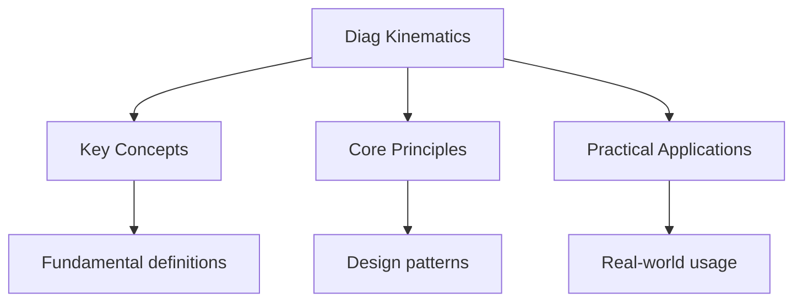

---

date: 2026-07-23T21:57:32+01:00
title: "Kinematics -- Diagnostic Tests"
description: "IB Physics Kinematics -- Diagnostic Tests notes covering key definitions, core concepts, worked examples, and practice questions for focused preparation."
tableOfContents: false
---

<!-- Breadcrumb Schema for SEO -->

## Kinematics — Diagnostic Tests

## Intuition

**Kinematics is the language of motion — it describes how objects move through space and time without worrying about why they move:** The equations of motion connect position, velocity, acceleration, and time in a mathematical framework that works from thrown balls to orbiting planets

**Why it matters:** From trajectory calculations in sports to autonomous vehicle navigation, kinematics provides the mathematical foundation for predicting motion

**The key insight:** The equations of motion connect position, velocity, acceleration, and time in a mathematical framework that works from thrown balls to orbiting planets

## Unit Tests

### UT-1: Projectile That Never Reaches Its Target

**Question:**

A ball is thrown from point $A$ at the base of a cliff with initial speed
$28\,\text{m}\,\text{s}^{-1}$ at an angle of $65^\circ$ above the horizontal. Point $B$ is at the
top of the cliff, a vertical height $h = 35\,\text{m}$ above $A$. The horizontal distance from $A$
to the base of the cliff directly below $B$ is $d$.

(a) Calculate the time at which the ball is at the same height as $B$.

(b) Calculate the horizontal distance $d$ for the ball to land exactly at $B$.

(c) Calculate the speed and direction of the ball at $B$.

Take $g = 9.81\,\text{m}\,\text{s}^{-2}$. Ignore air resistance.

**Solution:**

Resolving the initial velocity:

- Horizontal: $u_x = 28\cos 65^\circ = 28 \times 0.4226 = 11.83\,\text{m}\,\text{s}^{-1}$
- Vertical: $u_y = 28\sin 65^\circ = 28 \times 0.9063 = 25.38\,\text{m}\,\text{s}^{-1}$

(a) Using $s = ut + \frac{1}{2}at^2$ for the vertical motion, taking upward as positive:

$$35 = 25.38t - \frac{1}{2}(9.81)t^2$$

$$4.905t^2 - 25.38t + 35 = 0$$

Using the quadratic formula:

$$t = \frac{25.38 \pm \sqrt{25.38^2 - 4 \times 4.905 \times 35}}{2 \times 4.905}$$

$$t = \frac{25.38 \pm \sqrt{644.1 - 686.7}}{9.81}$$

The discriminant is $644.1 - 686.7 = -42.6 \lt 0$.

Since the discriminant is negative, the ball **never reaches** the height of $B$. The maximum height
is:

$$h_{\max} = \frac{u_y^2}{2g} = \frac{25.38^2}{2 \times 9.81} = \frac{644.1}{19.62} = 32.83\,\text{m}$$

Since $32.83\,\text{m} \lt 35\,\text{m}$The ball cannot reach $B$. The student must recognise when
the mathematics reveals a physical impossibility rather than blindly computing.

(b) Not applicable -- the ball does not reach $B$.

(c) The maximum height is $32.83\,\text{m}$Reached at time
$t = u_y/g = 25.38/9.81 = 2.586\,\text{s}$.

At maximum height, $v_y = 0$ and $v_x = 11.83\,\text{m}\,\text{s}^{-1}$ (unchanged), so the speed is
$11.83\,\text{m}\,\text{s}^{-1}$ horizontally.

The question asks for the speed at height $B$Which is unattainable. This is the key challenge:
recognising the physical constraint from the mathematics.

---

<!-- Breadcrumb Schema for SEO -->

### UT-2: Displacement vs Distance on a Non-Standard Velocity-Time Graph

**Question:**

A car moves along a straight road. Its velocity-time graph consists of three regions:

- Region I ($0 \le t \le 4\,\text{s}$): $v = 3t^2 - 4t\,\text{m}\,\text{s}^{-1}$
- Region II ($4 \lt t \le 10\,\text{s}$): $v = 40 - 5t\,\text{m}\,\text{s}^{-1}$
- Region III ($10 \lt t \le 14\,\text{s}$): $v = -10\,\text{m}\,\text{s}^{-1}$ (constant)

(a) Calculate the displacement of the car at $t = 14\,\text{s}$ relative to its starting position.

(b) Calculate the total distance travelled.

(c) At what time(s) does the car return to its starting position?

**Solution:**

(a) **Displacement** = area under $v$-$t$ graph (signed area).

**Region I** ($0 \le t \le 4$):
$\displaystyle s_I = \int_0^4 (3t^2 - 4t)\,dt = \left[t^3 - 2t^2\right]_0^4 = (64 - 32) - 0 = 32\,\text{m}$

At $t = 4$: $v = 3(16) - 16 = 32\,\text{m}\,\text{s}^{-1}$.

**Region II** ($4 \lt t \le 10$):
$\displaystyle s_{II} = \int_4^{10} (40 - 5t)\,dt = \left[40t - 2.5t^2\right]_4^{10}$

$= (400 - 250) - (160 - 40) = 150 - 120 = 30\,\text{m}$

At $t = 10$: $v = 40 - 50 = -10\,\text{m}\,\text{s}^{-1}$.

**Region III** ($10 \lt t \le 14$): $v = -10$ So $s_{III} = -10 \times 4 = -40\,\text{m}$

**Total displacement:** $s = 32 + 30 - 40 = 22\,\text{m}$

(b) **Total distance** requires finding when the velocity changes sign.

In Region I: $v = 3t^2 - 4t = t(3t - 4) = 0$ at $t = 0$ and $t = 4/3 = 1.333\,\text{s}$.

For $0 \lt t \lt 4/3$: $v \lt 0$ (e.g. $t = 1$: $v = 3 - 4 = -1$)

For $4/3 \lt t \le 4$: $v \gt 0$

So we must split Region I:

$s_{I-} = \displaystyle\int_0^{4/3} (3t^2 - 4t)\,dt = \left[t^3 - 2t^2\right]_0^{4/3} = \frac{64}{27} - \frac{32}{9} = \frac{64 - 96}{27} = -\frac{32}{27}\,\text{m}$

$s_{I+} = \displaystyle\int_{4/3}^{4} (3t^2 - 4t)\,dt = 32 - (-\frac{32}{27}) = 32 + \frac{32}{27} = \frac{896}{27}\,\text{m}$

In Region II: $v = 40 - 5t = 0$ at $t = 8\,\text{s}$.

For $4 \lt t \lt 8$: $v \gt 0$; for $8 \lt t \le 10$: $v \lt 0$.

$s_{II+} = \displaystyle\int_4^{8} (40 - 5t)\,dt = [40t - 2.5t^2]_4^8 = (320 - 160) - (160 - 40) = 160 - 120 = 40\,\text{m}$

$s_{II-} = \displaystyle\int_8^{10} (40 - 5t)\,dt = (400 - 250) - (320 - 160) = 150 - 160 = -10\,\text{m}$

Region III: $v = -10$ throughout, so $s_{III} = -40\,\text{m}$.

**Total distance** $= |s_{I-}| + s_{I+} + s_{II+} + |s_{II-}| + |s_{III}|$

$= \frac{32}{27} + \frac{896}{27} + 40 + 10 + 40 = \frac{928}{27} + 90 = 34.37 + 90 = 124.4\,\text{m}$

(c) The car returns to its starting position when the cumulative displacement is zero.

Cumulative displacement at $t = 10$: $s = 32 + 30 = 62\,\text{m}$

From $t = 10$ to $t = 14$: displacement decreases at $10\,\text{m}\,\text{s}^{-1}$.

Time to return to origin from $t = 10$: $62/10 = 6.2\,\text{s}$I.e. At $t = 16.2\,\text{s}$.

But the motion only continues to $t = 14\,\text{s}$At which point $s = 22\,\text{m}$.

The car does **not** return to its starting position within the given time interval.

We must also check during Region I. At $t = 4/3$: $s = -32/27 = -1.19\,\text{m}$ (not zero). At
$t = 0$: $s = 0$. The car starts at the origin but moves backward first, then forward. Setting the
integral to zero within Region I:

$t^3 - 2t^2 = 0 \Rightarrow t^2(t - 2) = 0$Giving $t = 0$ or $t = 2\,\text{s}$.

At $t = 2$: $v = 3(4) - 8 = 4\,\text{m}\,\text{s}^{-1}$ and $s = 8 - 8 = 0$.

So the car returns to its starting position at **$t = 2.0\,\text{s}$** (the only time within the
interval).

---

<!-- Breadcrumb Schema for SEO -->

### UT-3: Two-Stage Vertical Motion with Coefficient of Restitution

**Question:**

A small ball is projected vertically upwards with speed $18.0\,\text{m}\,\text{s}^{-1}$ from a
height of $2.0\,\text{m}$ above the ground. It reaches its maximum height, then falls and bounces
off the ground. The coefficient of restitution is $e = 0.75$Meaning the speed immediately after
bouncing is $0.75$ times the speed immediately before bouncing.

(a) Calculate the maximum height above the ground reached on the first ascent.

(b) Calculate the height above the ground reached on the second ascent.

(c) Calculate the total time from projection until the ball hits the ground for the second time.

Take $g = 9.81\,\text{m}\,\text{s}^{-2}$.

**Solution:**

(a) Using $v^2 = u^2 + 2as$ with $v = 0$$u = 18.0$$a = -9.81$:

$$0 = 18.0^2 - 2(9.81)s \Rightarrow s = \frac{324}{19.62} = 16.52\,\text{m}$$

Maximum height above ground $= 2.0 + 16.52 = 18.5\,\text{m}$ (3 s.f.)

(b) Speed when the ball hits the ground on the first descent: it falls $18.5\,\text{m}$ from rest
(at the top).

$$v^2 = 0 + 2(9.81)(18.5) = 363.0 \Rightarrow v = 19.05\,\text{m}\,\text{s}^{-1}$$

After bouncing, speed $= 0.75 \times 19.05 = 14.29\,\text{m}\,\text{s}^{-1}$.

Height on second ascent:

$$s = \frac{v^2}{2g} = \frac{14.29^2}{19.62} = \frac{204.2}{19.62} = 10.41\,\text{m}$$

(c) **First ascent:** $t_1 = u/g = 18.0/9.81 = 1.835\,\text{s}$

**First descent:** Falls $18.5\,\text{m}$ from rest:
$t_2 = \sqrt{2h/g} = \sqrt{2 \times 18.5/9.81} = \sqrt{3.772} = 1.942\,\text{s}$

**Second ascent:** $t_3 = 14.29/9.81 = 1.457\,\text{s}$

**Second descent:** Falls $10.41\,\text{m}$ from rest:
$t_4 = \sqrt{2 \times 10.41/9.81} = \sqrt{2.122} = 1.457\,\text{s}$

**Total time** $= t_1 + t_2 + t_3 + t_4 = 1.835 + 1.942 + 1.457 + 1.457 = 6.69\,\text{s}$

## Integration Tests

### IT-1: Projectile onto an Inclined Plane (with Dynamics)

**Question:**

A particle is projected with speed $u = 25\,\text{m}\,\text{s}^{-1}$ at angle $\theta = 30^\circ$
above the horizontal from a point $O$ at the foot of an inclined plane. The plane makes an angle
$\alpha = 20^\circ$ with the horizontal. The particle lands on the plane at point $P$.

(a) Show that the time of flight is given by $t = \frac{2u\sin(\theta - \alpha)}{g\cos\alpha}$.

(b) Calculate the distance $OP$ along the plane.

(c) Calculate the speed of the particle immediately before impact at $P$.

Take $g = 9.81\,\text{m}\,\text{s}^{-2}$.

**Solution:**

(a) At point $P$ on the inclined plane, the particle"s coordinates satisfy $y = x\tan\alpha$.

Horizontal: $x = u\cos\theta \cdot t$

Vertical: $y = u\sin\theta \cdot t - \frac{1}{2}gt^2$

Setting $y = x\tan\alpha$:

$$u\sin\theta \cdot t - \frac{1}{2}gt^2 = u\cos\theta \cdot t \cdot \tan\alpha$$

$$t\left(u\sin\theta - u\cos\theta\tan\alpha - \frac{1}{2}gt\right) = 0$$

Ignoring $t = 0$:

$$t = \frac{2u(\sin\theta - \cos\theta\tan\alpha)}{g} = \frac{2u(\sin\theta\cos\alpha - \cos\theta\sin\alpha)}{g\cos\alpha} = \frac{2u\sin(\theta - \alpha)}{g\cos\alpha}$$

As required.

(b) Substituting:
$t = \frac{2 \times 25 \times \sin(30^\circ - 20^\circ)}{9.81 \times \cos 20^\circ} = \frac{50 \times \sin 10^\circ}{9.81 \times \cos 20^\circ}$

$$= \frac{50 \times 0.1736}{9.81 \times 0.9397} = \frac{8.682}{9.219} = 0.9420\,\text{s}$$

Horizontal distance:
$x = 25\cos 30^\circ \times 0.9420 = 25 \times 0.8660 \times 0.9420 = 20.40\,\text{m}$

Distance along the plane: $OP = x/\cos\alpha = 20.40/\cos 20^\circ = 20.40/0.9397 = 21.71\,\text{m}$

(c) At $t = 0.9420\,\text{s}$:

$v_x = u\cos\theta = 25\cos 30^\circ = 21.65\,\text{m}\,\text{s}^{-1}$

$v_y = u\sin\theta - gt = 25\sin 30^\circ - 9.81 \times 0.9420 = 12.50 - 9.245 = 3.255\,\text{m}\,\text{s}^{-1}$

Speed
$= \sqrt{v_x^2 + v_y^2} = \sqrt{21.65^2 + 3.255^2} = \sqrt{468.7 + 10.60} = \sqrt{479.3} = 21.89\,\text{m}\,\text{s}^{-1}$

---

<!-- Breadcrumb Schema for SEO -->

### IT-2: Kinematics of Connected Particles (with Dynamics)

**Question:**

Two particles $A$ (mass $3.0\,\text{kg}$) and $B$ (mass $5.0\,\text{kg}$) are connected by a light
inextensible string passing over a smooth pulley. Initially, $A$ is held at rest on a rough
horizontal surface and $B$ hangs freely, $0.80\,\text{m}$ above the ground. The coefficient of
friction between $A$ and the surface is $\mu = 0.40$.

$A$ is released from rest. When $B$ hits the ground, the string goes slack. Assume $B$ does not
rebound.

(a) Calculate the acceleration of the system while the string is taut.

(b) Calculate the speed of $A$ at the instant $B$ hits the ground.

(c) Calculate the total distance travelled by $A$ from release until it comes to rest.

Take $g = 9.81\,\text{m}\,\text{s}^{-2}$.

**Solution:**

(a) For $B$ (downward positive): $5.0g - T = 5.0a$

For $A$ (horizontal, rightward positive): $T - F_r = 3.0a$Where
$F_r = \mu R = 0.40 \times 3.0g = 1.2g$

Adding: $5.0g - 1.2g = 8.0a$

$$a = \frac{3.8g}{8.0} = \frac{3.8 \times 9.81}{8.0} = \frac{37.28}{8.0} = 4.66\,\text{m}\,\text{s}^{-2}$$

(b) $B$ falls $0.80\,\text{m}$ from rest with $a = 4.66\,\text{m}\,\text{s}^{-2}$:

$$v^2 = 0 + 2 \times 4.66 \times 0.80 = 7.456$$

$$v = 2.73\,\text{m}\,\text{s}^{-1}$$

(c) After $B$ hits the ground, $A$ continues with initial speed $2.73\,\text{m}\,\text{s}^{-1}$ but
now decelerates due to friction alone.

Deceleration: $a' = F_r/m = \mu g = 0.40 \times 9.81 = 3.92\,\text{m}\,\text{s}^{-2}$

Distance to stop: $s = v^2/(2a') = 7.456/(2 \times 3.92) = 0.951\,\text{m}$

Total distance travelled by $A$ $= 0.80 + 0.951 = 1.75\,\text{m}$

---

<!-- Breadcrumb Schema for SEO -->

### IT-3: Graphical Analysis of Stopping Distance (with Work-Energy)

**Question:**

The velocity of a car during an emergency stop is recorded at equal time intervals of
$0.5\,\text{s}$:

| $t\,/\,\text{s}$                | 0    | 0.5  | 1.0  | 1.5  | 2.0 | 2.5 | 3.0 |
| ------------------------------- | ---- | ---- | ---- | ---- | --- | --- | --- |
| $v\,/\,\text{m}\,\text{s}^{-1}$ | 20.0 | 17.5 | 14.8 | 11.7 | 8.2 | 4.3 | 0   |

(a) Use the trapezium rule to estimate the thinking distance (distance travelled during the driver's
reaction time of $0.7\,\text{s}$) and the braking distance (total stopping distance minus thinking
distance).

(b) The car has mass $1200\,\text{kg}$. Estimate the average braking force.

(c) If the road is wet, the braking force is reduced by $40\%$. Calculate the new total stopping
distance, assuming the same initial speed and reaction time.

**Solution:**

(a) **Thinking distance:** The car travels at constant speed during the reaction time.

$v$ at $t = 0$ is $20.0\,\text{m}\,\text{s}^{-1}$. During the thinking time the car travels at
constant speed.

Thinking distance $= 20.0 \times 0.7 = 14.0\,\text{m}$.

**Total stopping distance:** Using the trapezium rule on all data:

$$s = 0.5 \times \left[\frac{20.0 + 0}{2} + 17.5 + 14.8 + 11.7 + 8.2 + 4.3\right]$$

$$= 0.5 \times [10.0 + 17.5 + 14.8 + 11.7 + 8.2 + 4.3] = 0.5 \times 66.5 = 33.25\,\text{m}$$

**Braking distance** $= 33.25 - 14.0 = 19.25 \approx 19.3\,\text{m}$

(b) Using the work-energy principle: $Fs = \frac{1}{2}mv^2$

$$F = \frac{0.5 \times 1200 \times 20.0^2}{19.25} = \frac{240000}{19.25} = 12468 \approx 12500\,\text{N}$$

(c) New braking force $= 0.60 \times 12500 = 7500\,\text{N}$

New braking distance:
$s = \frac{0.5 \times 1200 \times 400}{7500} = \frac{240000}{7500} = 32.0\,\text{m}$

New total stopping distance $= 14.0 + 32.0 = 46.0\,\text{m}$

## Cross-References

- **[Kinematics](../flashcards-kinematics):** Kinematics describes motion
- **[Mechanics](../flashcards-mechanics):** Mechanics covers forces and energy
- **[Waves](../flashcards-waves):** Waves transfer energy
