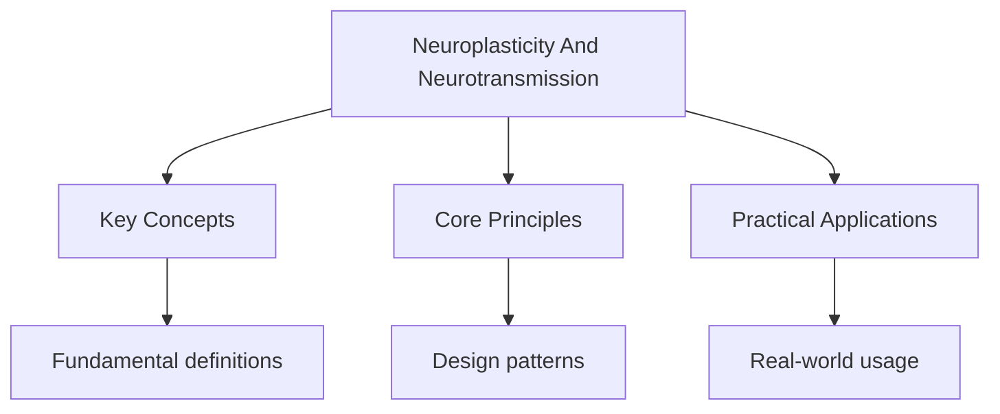

---

date: 2026-07-23T21:57:32+01:00
title: Neuroplasticity and Neurotransmission
description: "Synaptic transmission is the process by which neurons communicate with one another. It is the Fundamental mechanism underlying all neural activity, from"

---

<!-- Breadcrumb Schema for SEO -->

## Synaptic Transmission

Synaptic transmission is the process by which neurons communicate with one another. It is the
Fundamental mechanism underlying all neural activity, from simple reflexes to complex cognitive
Processes. Understanding synaptic transmission is essential for understanding how biological
Structures give rise to behaviour.

### Structure of the Synapse

A synapse consists of three main components:

1. **The presynaptic terminal:** The end of the axon of the sending neuron, which contains synaptic
   vesicles filled with neurotransmitter molecules. The presynaptic terminal also contains
   voltage-gated calcium channels.
2. **The synaptic cleft:** The narrow gap (approximately 20--40 nanometres) between the presynaptic
   terminal and the postsynaptic membrane. Neurotransmitter molecules diffuse across this gap.
3. **The postsynaptic membrane:** The membrane of the receiving neuron, which contains receptor
   proteins specific to particular neurotransmitters. These receptors are coupled to ion channels or
   to intracellular signalling cascades.

### Steps in Synaptic Transmission

1. An action potential arrives at the presynaptic terminal.
2. Voltage-gated calcium channels open, and calcium ions ($\mathrm{Ca}^{2+}$) flow into the
   presynaptic terminal.
3. The influx of calcium causes synaptic vesicles to fuse with the presynaptic membrane
   (exocytosis), releasing neurotransmitter molecules into the synaptic cleft.
4. Neurotransmitter molecules diffuse across the synaptic cleft and bind to specific receptor
   proteins on the postsynaptic membrane.
5. Binding of the neurotransmitter to the receptor causes ion channels to open (or, in the case of
   metabotropic receptors, triggers a secondary messenger system that eventually opens ion
   channels).
6. If enough excitatory postsynaptic potentials (EPSPs) accumulate to reach the threshold of
   approximately -55 mV, an action potential is triggered in the postsynaptic neuron.
7. The neurotransmitter is removed from the synaptic cleft through reuptake (the presynaptic neuron
   reabsorbs the neurotransmitter), enzymatic degradation (enzymes in the synaptic cleft break down
   the neurotransmitter), or diffusion.

### Excitatory and Inhibitory Synapses

Synaptic transmission can have either an excitatory or inhibitory effect on the postsynaptic neuron:

- **Excitatory postsynaptic potentials (EPSPs):** Depolarise the postsynaptic membrane (making the
  interior less negative), bringing it closer to the threshold for firing an action potential. The
  primary excitatory neurotransmitter in the brain is glutamate.
- **Inhibitory postsynaptic potentials (IPSPs):** Hyperpolarise the postsynaptic membrane (making
  the interior more negative), moving it further from the threshold. The primary inhibitory
  neurotransmitters are GABA and glycine.

The postsynaptic neuron integrates all incoming EPSPs and IPSPs (spatial and temporal summation) to
Determine whether or not to fire an action potential.

## Key Neurotransmitters

### Dopamine

Dopamine is a monoamine neurotransmitter produced in several key brain regions, including the
Substantia nigra, the ventral tegmental area (VTA), and the hypothalamus. Dopamine is involved in:

- **Reward and motivation:** Dopamine release in the nucleus accumbens is associated with the
  experience of pleasure and reinforcement. This mesolimbic pathway is critically involved in
  addiction.
- **Motor control:** Dopamine produced in the substantia nigra and transmitted to the striatum (the
  nigrostriatal pathway) is essential for smooth, coordinated movement. Degeneration of dopaminergic
  neurons in this pathway causes Parkinson"s disease, characterised by tremor, rigidity, and
  bradykinesia.
- **Cognitive function:** Dopamine in the prefrontal cortex (the mesocortical pathway) is involved
  in working memory, attention, and executive function. Abnormal dopamine activity in this pathway
  has been implicated in schizophrenia.
- **Hormone regulation:** Dopamine produced in the hypothalamus inhibits prolactin release from the
  pituitary gland (the tuberoinfundibular pathway).

**Disorders associated with dopamine dysfunction:**

| Disorder            | Dopamine Involvement                                                                                          |
| ------------------- | ------------------------------------------------------------------------------------------------------------- |
| Parkinson's disease | Degeneration of dopaminergic neurons in the substantia nigra leads to dopamine deficiency                     |
| Schizophrenia       | Excess dopamine activity, particularly in the mesolimbic pathway (the dopamine hypothesis)                    |
| ADHD                | Insufficient dopamine activity in the prefrontal cortex, leading to deficits in attention and impulse control |
| Addiction           | Chronic drug use causes downregulation of dopamine receptors, reducing natural reward sensitivity             |

### Serotonin (5-Hydroxytryptamine, 5-HT)

Serotonin is produced in the raphe nuclei of the brainstem and is involved in a wide range of
Functions:

- **Mood regulation:** Low serotonin activity is associated with depression. Most antidepressant
  medications (SSRIs) work by increasing serotonin availability in the synaptic cleft.
- **Sleep-wake cycle:** Serotonin is a precursor to melatonin, the hormone that regulates sleep.
- **Appetite:** Serotonin influences satiety and eating behaviour.
- **Aggression and impulsivity:** Low serotonin levels have been linked to increased aggression and
  impulsive behaviour.
- **Anxiety:** Abnormal serotonin activity is implicated in anxiety disorders, particularly OCD.

### Acetylcholine (ACh)

Acetylcholine is produced in the basal forebrain and the brainstem. It is the primary
Neurotransmitter at the neuromuscular junction (where neurons communicate with muscles) and is also
Widely distributed in the brain. ACh is involved in:

- **Memory and learning:** ACh is critical for memory formation, particularly in the hippocampus.
  Alzheimer's disease is characterised by degeneration of cholinergic neurons in the basal
  forebrain, leading to memory impairment.
- **Attention and arousal:** ACh from the brainstem contributes to cortical activation and
  attention.
- **Motor control:** ACh activates muscles at the neuromuscular junction.

### GABA (Gamma-Aminobutyric Acid)

GABA is the primary inhibitory neurotransmitter in the central nervous system. Approximately
One-third of all synapses in the brain use GABA. GABA functions by opening chloride channels in the
Postsynaptic membrane, causing hyperpolarisation and reducing the likelihood of action potential
Firing.

- **Anxiety reduction:** Benzodiazepines (e.g., diazepam) enhance GABA activity, producing their
  anxiolytic (anti-anxiety) effects.
- **Epilepsy:** Reduced GABA activity can lead to excessive neural excitation and seizures.
- **Huntington's disease:** Degeneration of GABAergic neurons in the striatum leads to involuntary
  movements and cognitive decline.

### Glutamate

Glutamate is the primary excitatory neurotransmitter in the central nervous system and is involved
In virtually all cognitive functions. It acts on several types of receptors, including NMDA, AMPA,
And kainate receptors. Glutamate is critical for:

- **Long-term potentiation (LTP):** The NMDA receptor is essential for LTP, the cellular mechanism
  underlying learning and memory (discussed below).
- **Synaptic plasticity:** Glutamate-mediated signalling is the basis of experience-dependent
  changes in synaptic strength.
- **Excitotoxicity:** Excessive glutamate release (as occurs during stroke or traumatic brain
  injury) can cause overactivation of glutamate receptors, leading to calcium influx, oxidative
  stress, and neuronal death.

## Agonists and Antagonists

Chemical substances can affect synaptic transmission by interacting with neurotransmitter receptors
Or by altering the synthesis, release, or breakdown of neurotransmitters.

### Agonists

An agonist is a substance that binds to a receptor and activates it, mimicking the effect of the
Natural neurotransmitter. Agonists can be direct (binding directly to the receptor) or indirect
(increasing the amount of neurotransmitter available).

| Type               | Mechanism                                                           | Example                                                              |
| ------------------ | ------------------------------------------------------------------- | -------------------------------------------------------------------- |
| Direct agonist     | Binds to the receptor and activates it                              | Morphine (binds to opioid receptors)                                 |
| Indirect agonist   | Increases neurotransmitter release or inhibits reuptake             | Cocaine (blocks dopamine reuptake), SSRIs (block serotonin reuptake) |
| Reuptake inhibitor | Blocks the presynaptic neuron from reabsorbing the neurotransmitter | Fluoxetine (Prozac) blocks serotonin reuptake                        |

### Antagonists

An antagonist is a substance that binds to a receptor but does not activate it, blocking the natural
Neurotransmitter from binding. Antagonists reduce or block the effect of the neurotransmitter.

| Type                | Mechanism                                                 | Example                                                                               |
| ------------------- | --------------------------------------------------------- | ------------------------------------------------------------------------------------- |
| Receptor antagonist | Binds to the receptor without activating it               | Propranolol (blocks beta-adrenergic receptors), clozapine (blocks dopamine receptors) |
| Enzyme inhibitor    | Inhibits the enzyme that breaks down the neurotransmitter | MAO inhibitors (prevent breakdown of monoamine neurotransmitters)                     |

Understanding agonists and antagonists is essential for understanding the mechanisms of psychoactive
Drugs and their therapeutic applications. For example, the effectiveness of antipsychotic medication
In treating schizophrenia is attributed to its dopamine antagonist properties, while the
Effectiveness of antidepressant medication is attributed to its serotonin agonist properties (via
Reuptake inhibition).

Common Pitfalls: Agonists and Antagonists

- **Do not confuse agonists with antagonists.** Agonists activate receptors; antagonists block them.
  A simple mnemonic: "Agonist activates, Antagonist annihilates."
- **Do not assume that increasing a neurotransmitter always produces a linear increase in the
  associated behaviour.** The relationship between neurotransmitter levels and behaviour is often
  inverted-U-shaped. For example, moderate dopamine levels support optimal cognitive function, but
  both too little (as in Parkinson's disease) and too much (as in schizophrenia) dopamine impairs
  function.
- **Do not oversimplify the role of neurotransmitters.** Most behaviours and disorders involve
  multiple neurotransmitter systems interacting in complex ways. The "dopamine hypothesis" of
  schizophrenia, for example, has been refined to include serotonin and glutamate systems.

## Neuroplasticity

Neuroplasticity refers to the brain's capacity to reorganise its structure and function in response
To experience, learning, environmental change, or injury. It is not a single mechanism but a
Collection of processes that operate at different levels, from molecular changes at individual
Synapses to large-scale cortical reorganisation.

### Synaptic Plasticity

Synaptic plasticity is the ability of synapses to strengthen or weaken over time in response to
Changes in activity. It is the primary cellular mechanism underlying learning and memory.

**Long-term potentiation (LTP):** LTP is a persistent strengthening of synaptic connections
Following high-frequency stimulation. When a presynaptic neuron repeatedly and persistently
Stimulates a postsynaptic neuron, the connection between them becomes stronger. The mechanism
Involves:

1. Glutamate is released from the presynaptic terminal and binds to AMPA receptors on the
   postsynaptic membrane.
2. If the postsynaptic neuron is sufficiently depolarised (from concurrent stimulation), the
   magnesium block on NMDA receptors is removed.
3. Calcium ions flow through the NMDA receptor into the postsynaptic neuron.
4. Calcium triggers a cascade of intracellular events (involving kinases such as CaMKII) that lead
   to the insertion of additional AMPA receptors into the postsynaptic membrane and structural
   changes (dendritic spine enlargement).
5. The synapse is now more sensitive to subsequent stimulation: the same amount of glutamate release
   produces a larger postsynaptic response.

LTP was first demonstrated by Bliss and Lomo (1973) in the rabbit hippocampus, and it is now widely
Accepted as the primary mechanism of memory formation.

**Long-term depression (LTD):** LTD is the opposite of LTP: a persistent weakening of synaptic
Connections following low-frequency stimulation. LTD is important for forgetting, for refining
Neural representations, and for preventing synaptic saturation. Without LTD, neural circuits would
Become saturated with strengthened connections, impairing the ability to form new memories.

### Synaptic Pruning

Synaptic pruning is the process by which unused or weakly activated synaptic connections are
Eliminated during development and learning. This process refines neural circuits, improving their
Efficiency and specificity.

- At birth, the human brain contains approximately 100 billion neurons, each forming thousands of
  synaptic connections. The total number of synapses peaks at approximately age 3--4, at a level far
  exceeding adult levels.
- During childhood and adolescence, approximately half of all synapses are pruned away. This process
  follows the principle of "use it or lose it": connections that are frequently activated are
  strengthened and retained, while those that are rarely used are eliminated.
- Synaptic pruning is particularly important in the prefrontal cortex, which continues to undergo
  significant pruning throughout adolescence, consistent with the protracted development of
  executive functions.

### Dendritic Branching

Dendritic branching refers to the growth of new dendritic spines (small protrusions on dendrites
That receive synaptic input) in response to learning and environmental enrichment. Increased
Dendritic branching increases the number of potential synaptic connections, enhancing the
Computational capacity of neural circuits.

## Key Studies

### Rosenzweig and Bennett (1972)

Rosenzweig, Bennett, and Diamond conducted a landmark series of experiments on the effects of
Environmental enrichment on brain structure in rats. Rats were assigned to one of three conditions:

1. **Enriched condition (EC):** Large cage with 10--12 rats, toys, tunnels, and running wheels, with
   toys rotated regularly.
2. **Standard condition (SC):** Standard laboratory cage with 3 rats, no toys.
3. **Impoverished condition (IC):** Smaller cage, isolated, no toys.

After 60 days, the brains of EC rats showed:

- Increased thickness of the cerebral cortex (approximately 6--7% thicker than IC rats)
- Greater density of synaptic connections
- Higher levels of acetylcholinesterase (an enzyme involved in the breakdown of acetylcholine,
  indicating greater cholinergic activity)
- Larger neuron cell bodies in the cortex
- Increased glial cell density

**Evaluation:**

- The study used controlled experimental methods with random assignment, strengthening internal
  validity. However, the use of rats limits the generalisability to humans.
- Ethical concerns arise from the deprivation experienced by the IC rats and the euthanasia required
  for post-mortem brain analysis.
- Subsequent human research has provided converging evidence. Maguire et al. (2000) found that
  London taxi drivers had larger posterior hippocampi than controls, and Draganski et al. (2004)
  found that learning to juggle produced measurable increases in grey matter in cortical areas
  involved in visual motion processing after just 7 days of training.

### Draganski et al. (2004)

Draganski and colleagues used voxel-based morphometry (a neuroimaging technique that measures
Differences in grey matter density) to investigate whether learning a new skill could produce
Structural changes in the adult human brain. Participants were taught a three-ball juggling routine
And practised for 60 seconds per day over 7 days. Brain scans were taken at three time points:
Before training, immediately after the 7-day training period, and 3 months later.

**Key findings:**

- Immediately after training, participants showed a significant increase in grey matter density in
  brain areas involved in visual motion processing (the hMT/V5 area in the left hemisphere and the
  intraparietal sulcus).
- After 3 months without practice, the increase in grey matter had partially receded, suggesting
  that structural changes are experience-dependent and reversible.
- A control group that did not learn juggling showed no such changes.

**Evaluation:**

- The study provides direct evidence that neuroplasticity operates in the adult human brain in
  response to relatively brief learning experiences.
- The use of voxel-based morphometry provides an objective, quantitative measure of structural brain
  change.
- The study does not demonstrate that the observed grey matter changes are causally related to
  improved juggling performance. Correlation does not imply causation, although the temporal
  sequence (change follows training) supports a causal interpretation.
- The study demonstrates both the adaptive potential and the reversibility of neuroplastic changes,
  which has important implications for rehabilitation following brain injury.

Common Pitfalls: Neuroplasticity

- **Do not assume neuroplasticity is always beneficial.** Maladaptive plasticity occurs in chronic
  pain syndromes (where neural circuits become sensitised to pain signals), phantom limb sensations,
  addiction (where drug-induced plasticity strengthens reward pathways), and post-traumatic stress
  disorder (where fear circuits become hyperactive).
- **Do not confuse neuroplasticity with neurogenesis.** Neuroplasticity refers to changes in the
  strength and structure of existing connections. Neurogenesis refers to the birth of new neurons.
  While neurogenesis does occur in specific brain regions (the hippocampus and olfactory bulb) in
  adult mammals, it is a distinct process from synaptic plasticity.
- **Do not overstate the clinical implications of neuroplasticity research.** While neuroplasticity
  offers hope for rehabilitation after brain injury, the extent of recovery depends on the nature
  and severity of the injury, the age of the individual, and the type and intensity of
  rehabilitation. Neuroplasticity is not a magic cure.

## Linking to the Levels of Analysis

The study of neuroplasticity and neurotransmission connects the biological level of analysis to
Other levels:

- **Cognitive LOA:** Neurotransmitter systems underpin cognitive processes such as memory
  (acetylcholine, glutamate), attention (dopamine), and decision making (serotonin, dopamine).
  Neuroplasticity is the biological basis of learning and memory.
- **Sociocultural LOA:** Social experiences (such as enriched environments, social isolation, or
  cultural practices) can alter brain structure and function through neuroplastic mechanisms. For
  example, social deprivation in childhood has been associated with reduced cortical thickness and
  impaired cognitive development.

For an overview of these topics at the biological level of analysis, see
[Biological Level of Analysis](../biological-level-of-analysis).

## Common Pitfalls

1. Forgetting edge cases in algorithm design (e.g., empty input, single element, already sorted
   data).

2. Forgetting that $O(n \log n)$ average-case for quicksort becomes $O(n^2)$ worst-case on already
   sorted input.

3. Writing pseudocode that is too language-specific rather than using standard algorithmic
   constructs.

4. Confusing authentication (who you are) with authorisation (what you can do) in security contexts.

## Summary

The key principles covered in this topic are linked in the sub-pages above. Focus on understanding
the definitions, applying the formulas or frameworks, and evaluating strengths and limitations of
each approach.

## Worked Examples

Worked examples demonstrating the application of key concepts are covered in the detailed sub-pages
linked above.

## Intuition

Our minds are prediction machines, constantly building models of the world to guide behaviour. Psychology studies how these mental models form, how they influence perception, and why they sometimes lead us astray. From memory biases to social stereotypes, understanding mental shortcuts explains both their efficiency and their limitations. This knowledge is essential for critical thinking and personal development.

## Cross-References

- [Research Methods](../research-methods)
- [Approaches in Psychology](/ib/psychology/approaches)
- [Biopsychology](../../../../../../alevel/src/content/docs/psychology/7-biopsychology/1_biopsychology)
