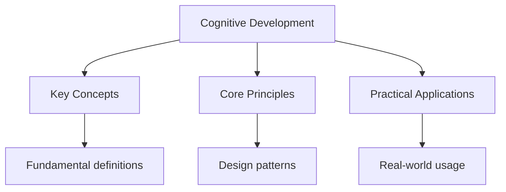

---

date: 2026-07-23T21:57:32+01:00
title: "Cognitive Development | IB - Wyatt's Notes"
description: "Cognitive development refers to the progressive changes in thinking, reasoning, problem solving, and Understanding that occur from infancy through"

---

<!-- Breadcrumb Schema for SEO -->

## Introduction

Cognitive development refers to the progressive changes in thinking, reasoning, problem solving, and
Understanding that occur from infancy through adulthood. The two most influential theories of
Cognitive development are Jean Piaget"s stage theory and Lev Vygotsky's sociocultural theory, which
Offer fundamentally different accounts of the mechanisms and processes underlying cognitive change.

## Piaget's Theory of Cognitive Development

### Overview

Jean Piaget proposed that cognitive development proceeds through four invariant, qualitatively
Distinct stages. Each stage represents a fundamentally different way of understanding and
Interacting with the world. Development is driven by the interaction between biological maturation
And environmental experience, through the processes of assimilation and accommodation.

**Key concepts:**

- **Schema:** A mental framework or organised pattern of thought that organises knowledge and guides
  behaviour. Schemas develop and become more sophisticated as the child develops.
- **Assimilation:** The process of incorporating new information into an existing schema. For
  example, a child who has a schema for "dog" and encounters a sheep for the first time may call the
  sheep a "dog" (assimilating the new experience into the existing schema).
- **Accommodation:** The process of modifying an existing schema or creating a new schema to fit new
  information. When the child learns that the sheep says "baa" instead of "woof," the child must
  accommodate by creating a new schema for "sheep."
- **Equilibration:** The driving force of cognitive development. When existing schemas are adequate
  for understanding the environment, the child is in a state of equilibrium. When the child
  encounters information that cannot be assimilated, a state of disequilibrium occurs, motivating
  the child to accommodate and restore equilibrium. This process of equilibration drives the
  transition between stages.

### The Four Stages

**1. Sensorimotor stage (birth to approximately 2 years):** The infant's knowledge is based on
Sensory experience and motor action. Key achievements include:

- **Object permanence:** The understanding that objects continue to exist even when they are no
  longer visible or audible. Piaget argued that object permanence develops gradually during the
  sensorimotor stage: by 8 months, infants search for partially hidden objects; by 12 months, they
  search for fully hidden objects; by 18--24 months, they can follow invisible displacements.
- **Goal-directed behaviour:** The ability to coordinate actions to achieve a desired outcome (e.g.,
  moving obstacles out of the way to reach a toy).

**2. Preoperational stage (approximately 2 to 7 years):** The child develops symbolic thought,
Including language and pretend play. Key limitations include:

- **Egocentrism:** The inability to take the perspective of others. The child assumes that everyone
  sees, thinks, and feels the same way they do.
- **Animism:** The belief that inanimate objects have thoughts, feelings, and intentions.
- **Centration:** The tendency to focus on a single dimension of a situation while ignoring other
  dimensions.
- **Irreversibility:** The inability to mentally reverse a sequence of events.
- **Lack of conservation:** The failure to understand that quantity remains the same despite changes
  in appearance.

**3. Concrete operational stage (approximately 7 to 11 years):** The child develops logical
Operations, but only on concrete, tangible objects and events. Key achievements include:

- **Conservation:** The understanding that quantity remains the same despite changes in appearance
  (conservation of number at approximately 6--7 years, conservation of mass at approximately 7--8
  years, conservation of weight at approximately 9--10 years).
- **Decentration:** The ability to consider multiple dimensions of a situation simultaneously.
- **Reversibility:** The ability to mentally reverse operations.
- **Seriation:** The ability to order objects along a quantitative dimension (e.g., arranging sticks
  by length).
- **Classification:** The ability to classify objects into hierarchies and subcategories.

**4. Formal operational stage (approximately 11 years and older):** The individual develops the
Ability to think abstractly, reason hypothetically, and engage in systematic problem solving. Key
Achievements include:

- **Hypothetical-deductive reasoning:** The ability to systematically test hypotheses (e.g., in a
  scientific reasoning task, considering all possible combinations of variables).
- **Propositional logic:** The ability to evaluate the truth or falsity of propositions
  independently of their real-world content.
- **Metacognition:** The ability to think about one's own thinking (e.g., "I know that I don't know
  the answer to this question").
- **Abstract reasoning:** The ability to reason about concepts that have no physical referent (e.g.,
  justice, infinity, morality).

### Evaluation of Piaget's Theory

**Strengths:**

- Piaget's theory has been enormously influential in education, particularly in the development of
  child-centred, discovery-based learning approaches.
- The identification of distinct stages and the concept of qualitative change in thinking have been
  supported by extensive research.
- The concepts of assimilation and accommodation remain useful frameworks for understanding how
  children process new information.

**Limitations:**

- **Underestimation of infant competence:** Baillargeon (1987) used the violation-of-expectation
  method (measuring looking time rather than active search behaviour) and found that infants as
  young as 3.5 months demonstrate object permanence. This suggests that Piaget's search-based
  methods underestimated infants' cognitive abilities, possibly because infants lack the motor
  skills to demonstrate their understanding through searching.
- **Underestimation of young children's abilities:** Gelman (1972) demonstrated that young children
  can conserve number if the task is simplified and the materials are familiar. Hughes (1975) found
  that 3.5-year-old children could perform a spatial perspective-taking task that Piaget claimed was
  not possible until age 7, when the task involved dolls rather than abstract shapes (suggesting
  that egocentrism is task-dependent, not stage-dependent).
- **Stage-like development is not universal:** Research has shown that cognitive development is more
  continuous and gradual than Piaget's stage theory suggests. Children may demonstrate abilities
  characteristic of a later stage in some domains while remaining at an earlier stage in others
  (horizontal decalage).
- **The theory underestimates the role of social and cultural factors.** Piaget focused primarily on
  the individual child's interaction with the physical environment, giving relatively little
  attention to the role of social interaction, language, and culture in cognitive development.

## Vygotsky's Sociocultural Theory

### Overview

Lev Vygotsky (1978) proposed a fundamentally different account of cognitive development, emphasising
The role of social interaction, language, and culture. Vygotsky argued that cognitive development is
Not an individual, internal process but is fundamentally shaped by the child's interactions with
More knowledgeable members of the culture.

**Key concepts:**

- **The zone of proximal development (ZPD):** The gap between what the child can do independently
  and what the child can do with the guidance and support of a more knowledgeable other (MKO). The
  ZPD defines the range of tasks that the child is ready to learn but cannot yet perform
  independently.
- **Scaffolding:** The process by which an MKO provides temporary support that enables the child to
  perform a task within the ZPD. Scaffolding is gradually removed as the child's competence
  increases (Wood, Bruner, and Ross, 1976). Effective scaffolding involves adjusting the level of
  support to match the child's current level of competence, breaking tasks into manageable steps,
  and providing prompts and feedback.
- **Language as a tool for thought:** Vygotsky proposed that language is the primary tool of
  cognitive development. Initially, language is used for social communication (external speech).
  Through interaction with adults, children gradually internalise language, using it as a tool for
  self-regulation and private thought (inner speech). The transition from external speech to inner
  speech is a key mechanism of cognitive development.
- **Cultural tools:** Cognitive development is mediated by cultural tools (language, number systems,
  writing, maps, technology) that are transmitted through social interaction. Different cultures
  provide different sets of tools, leading to different patterns of cognitive development.

### Comparison of Piaget and Vygotsky

| Dimension             | Piaget                                                                                       | Vygotsky                                                                         |
| --------------------- | -------------------------------------------------------------------------------------------- | -------------------------------------------------------------------------------- |
| Nature of development | Individual, construction of knowledge through interaction with the physical environment      | Social, co-construction of knowledge through interaction with others             |
| Role of language      | Language is a product of cognitive development (a tool for expressing pre-existing thoughts) | Language is a driver of cognitive development (a tool for shaping thought)       |
| Stages                | Development proceeds through universal, invariant stages                                     | Development is continuous; there are no universal stages                         |
| Role of the adult     | The adult provides a stimulating environment but does not directly instruct                  | The adult actively guides and scaffolds the child's learning                     |
| Role of peers         | Peer interaction is less important than individual exploration                               | Peer interaction (collaborative learning) is essential for cognitive development |
| View of the child     | The child is a "little scientist" who actively constructs knowledge                          | The child is a "little apprentice" who learns through guided participation       |

### Evaluation of Vygotsky's Theory

**Strengths:**

- The theory has been highly influential in education, particularly in the development of
  collaborative learning, peer tutoring, and guided instruction approaches.
- The concepts of ZPD and scaffolding provide practical frameworks for teaching.
- The theory emphasises the role of culture and social context, which Piaget's theory neglected.

**Limitations:**

- The theory underestimates the role of individual exploration and discovery. Children can and do
  learn independently, not only through social interaction.
- The theory is less precise and less testable than Piaget's theory. Concepts such as ZPD and
  scaffolding are useful but difficult to operationalise and measure.
- Vygotsky died young (age 37) and did not fully develop his theory. Many of his ideas were
  published posthumously and are incomplete.

## Theory of Mind

Theory of mind (ToM) refers to the ability to attribute mental states (beliefs, desires, intentions,
Emotions) to oneself and to others, and to understand that others' mental states may differ from
One's own. Theory of mind is a critical component of social cognition and is essential for
Successful social interaction.

### The Sally-Anne Test (Baron-Cohen, Leslie, and Frith, 1985)

The Sally-Anne task is the classic test of theory of mind. A child is shown two dolls, Sally and
Anne. Sally has a basket, and Anne has a box. Sally puts a marble in her basket and leaves the room.
While Sally is away, Anne moves the marble from Sally's basket to her own box. Sally returns. The
Child is asked: "Where will Sally look for her marble?"

**Findings:**

- developing children aged 4 and older correctly answer that Sally will look in her basket
  (understanding that Sally holds a false belief -- she does not know that Anne moved the marble).
- Children with autism aged 4 and older answer that Sally will look in the box (failing the false
  belief task, suggesting a deficit in theory of mind).
- developing 3-year-olds fail the task.

**Interpretation:** The development of theory of mind (around age 4) allows children to understand
That others can hold beliefs that are false -- that is, beliefs that do not correspond to reality.
This is a crucial milestone in social-cognitive development.

### Evaluation:\*\*

- The false belief task has been replicated across cultures, supporting the universality of theory
  of mind development.
- However, some researchers have argued that younger children may have an implicit understanding of
  false belief that is not captured by the verbal demands of the Sally-Anne task. Onoprienko and
  colleagues (2023) have shown that infants as young as 13 months look longer at outcomes that
  violate an agent's false belief, suggesting that some form of theory of mind is present much
  earlier than the age of 4.

## Moral Development

### Kohlberg's Theory of Moral Development (1969)

Lawrence Kohlberg proposed that moral reasoning develops through three levels, each containing two
Stages, for a total of six stages. Kohlberg's theory is based on Piaget's cognitive-developmental
Framework and focuses on the reasoning behind moral judgments rather than the judgments themselves.

**Level 1: Pre-conventional morality (approximately ages 4--10)**

- **Stage 1: Obedience and punishment orientation.** Moral behaviour is determined by the
  consequences of the action (avoidance of punishment).
- **Stage 2: Individualism and exchange.** Moral behaviour is determined by self-interest and
  reciprocity ("You scratch my back, I'll scratch yours").

**Level 2: Conventional morality (approximately ages 10--16)**

- **Stage 3: Good interpersonal relationships.** Moral behaviour is determined by social approval
  and the desire to be seen as a "good person."
- **Stage 4: Maintaining social order.** Moral behaviour is determined by conformity to laws and
  social rules. Duty and respect for authority are paramount.

**Level 3: Post-conventional morality (approximately age 16 and older)**

- **Stage 5: Social contract and individual rights.** Moral behaviour is determined by abstract
  principles of justice, equality, and individual rights. Laws are seen as social contracts that can
  be changed if they violate fundamental principles.
- **Stage 6: Universal ethical principles.** Moral behaviour is determined by self-chosen ethical
  principles (e.g., justice, equality, human dignity) that are universal and transcend specific
  laws.

### Evaluation of Kohlberg's Theory

- Kohlberg's stages have been supported by longitudinal research showing that moral reasoning does
  progress through the predicted sequence.
- The theory has been criticised for being based primarily on male participants (and for using a
  male standard of moral reasoning). Gilligan (1982) argued that women tend to use an "ethics of
  care" (focusing on relationships, responsibilities, and compassion) rather than an "ethics of
  justice" (focusing on rules, rights, and abstract principles). Gilligan argued that Kohlberg's
  theory systematically undervalues the care perspective.
- The theory may be culturally biased, reflecting Western individualistic values (particularly Stage
  5 and Stage 6). Some researchers have argued that not all cultures value post-conventional moral
  reasoning.
- Moral reasoning (what people say they would do) does not always predict moral behaviour (what
  people actually do). The theory focuses on reasoning rather than behaviour.

Common Pitfalls: Cognitive Development

- **Do not present Piaget and Vygotsky as if one is correct and the other is wrong.** Both theories
  offer valuable but incomplete accounts of cognitive development. Piaget emphasised the individual
  child's active construction of knowledge; Vygotsky emphasised the social and cultural context of
  learning. Contemporary developmental psychology draws on both perspectives.
- **Do not describe Piaget's stages as if all children reach them at the same age.** The age ranges
  are approximate averages. Individual children progress at different rates, and cultural and
  environmental factors influence the pace of development.
- **Do not confuse theory of mind with empathy.** Theory of mind is the cognitive ability to
  understand others' mental states. Empathy is the emotional capacity to share others' feelings. The
  two are related but distinct.
- **Do not assume that Kohlberg's stages are universal.** The higher stages of Kohlberg's theory may
  reflect Western cultural values rather than universal moral principles.

For an overview of developmental topics, see
[Developmental Psychology](../developmental-psychology).

## Common Pitfalls

1. Describing processes without explaining the underlying causes and mechanisms.

2. Making generalisations without supporting case study evidence. Always reference specific
   locations and data.

3. Confusing weather and climate, or short-term events with long-term trends.

4. Neglecting to consider multiple scales (local, regional, national, global) in geographical
   analysis.

## Summary

The key principles covered in this topic are linked in the sub-pages above. Focus on understanding
the definitions, applying the formulas or frameworks, and evaluating strengths and limitations of
each approach.

## Worked Examples

Worked examples demonstrating the application of key concepts are covered in the detailed sub-pages
linked above.

## Intuition

The mind works like an information processing system. Perception filters raw sensory data, memory stores and retrieves experiences, and thinking organises knowledge into decisions. Understanding these mental processes helps explain why people behave differently in similar situations. The key insight is that internal mental states, though invisible, can be studied scientifically through careful observation and experimentation.

## Cross-References

- [Research Methods](../research-methods)
- [Approaches in Psychology](../approaches)
- [Biopsychology](../../../../../../alevel/src/content/docs/psychology/7-biopsychology/1_biopsychology)
