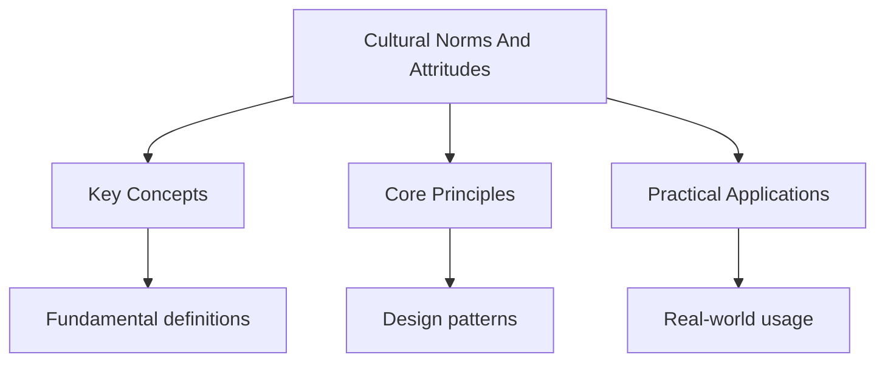

---

date: 2026-07-23T21:57:32+01:00
title: "Cultural Norms and Attitudes | IB"
description: "Culture refers to the shared values, beliefs, norms, customs, and practices that characterise a Social group. Cultural norms are the unwritten rules that"

---

<!-- Breadcrumb Schema for SEO -->

## Introduction

Culture refers to the shared values, beliefs, norms, customs, and practices that characterise a
Social group. Cultural norms are the unwritten rules that govern behaviour within a particular
Cultural context. Understanding cultural norms and how they shape attitudes and behaviour is central
To the sociocultural level of analysis, because culture is one of the most powerful environmental
Influences on human behaviour.

## Cultural Dimensions

### Hofstede"s Cultural Dimensions Theory

Geert Hofstede conducted one of the most comprehensive cross-cultural studies of work-related
Values, surveying over 100,000 IBM employees across more than 50 countries between 1967 and 1973.
From this data, Hofstede identified several dimensions along which national cultures vary.

**1. Individualism versus Collectivism**

- **Individualistic cultures** (e.g., the United States, the United Kingdom, Australia) emphasise
  personal achievement, independence, self-reliance, and individual rights. The self is defined as
  independent and autonomous. Personal goals take priority over group goals. Relationships are often
  voluntary and based on mutual benefit.
- **Collectivistic cultures** (e.g., Japan, China, Korea, many Latin American and African countries)
  emphasise group harmony, interdependence, loyalty, and obligation to the in-group (family,
  community, organisation). The self is defined in relation to others. Group goals take priority
  over individual goals. Relationships are based on obligation and duty.

**2. Power Distance**

Power distance refers to the extent to which less powerful members of a society accept and expect
That power is distributed unequally.

- **High power distance cultures** (e.g., Malaysia, the Philippines, Mexico) accept hierarchical
  structures, respect authority, and expect unequal power distribution. Subordinates are unlikely to
  disagree with superiors.
- **Low power distance cultures** (e.g., Denmark, Austria, Israel) favour egalitarianism, question
  authority, and expect more equal power distribution. Subordinates expect to be consulted and may
  openly disagree with superiors.

**3. Uncertainty Avoidance**

Uncertainty avoidance refers to the extent to which members of a culture feel threatened by
Ambiguous or unknown situations.

- **High uncertainty avoidance cultures** (e.g., Japan, Greece, Portugal) have strict laws, formal
  rules, and procedures to reduce uncertainty. They are less tolerant of deviant behaviour and
  ideas.
- **Low uncertainty avoidance cultures** (e.g., Singapore, Jamaica, Denmark) are more comfortable
  with ambiguity, tolerate deviant behaviour, and have fewer formal rules.

**4. Masculinity versus Femininity**

- **Masculine cultures** (e.g., Japan, Italy, Mexico) emphasise achievement, assertiveness,
  competition, and material success. Gender roles are differentiated.
- **Feminine cultures** (e.g., Sweden, Norway, the Netherlands) emphasise cooperation, modesty,
  caring for others, and quality of life. Gender roles overlap.

**5. Long-Term versus Short-Term Orientation**

- **Long-term oriented cultures** (e.g., China, Japan, South Korea) value perseverance, thrift, and
  adaptation to changing circumstances. They focus on future rewards.
- **Short-term oriented cultures** (e.g., the United States, the United Kingdom) value tradition,
  fulfilling social obligations, and "living in the moment." They focus on past and present.

**6. Indulgence versus Restraint**

- **Indulgent cultures** allow relatively free gratification of basic human desires related to
  enjoying life and having fun.
- **Restrained cultures** suppress gratification of needs and regulate it by means of strict social
  norms.

### Evaluation of Hofstede's Theory

**Strengths:**

- Based on a very large dataset (over 100,000 respondents across 50+ countries), providing
  quantitative measures of cultural dimensions.
- Has been widely used in cross-cultural research, business, and education.
- Provides a useful framework for understanding and predicting cultural differences in behaviour,
  attitudes, and values.

**Limitations:**

- The data were collected from IBM employees only, raising questions about the representativeness of
  the sample. IBM employees may not be representative of their national cultures, as they share a
  common organisational culture.
- The survey was conducted in the 1970s, and cultures change over time. Some cultural dimensions may
  have shifted in the intervening decades.
- The theory treats national culture as homogeneous, ignoring within-country variation (regional,
  ethnic, socioeconomic, and generational differences).
- The theory has been criticised for reflecting a Western bias. Some dimensions (e.g.,
  individualism-collectivism) may not capture the full complexity of non-Western cultural
  orientations.
- The level of analysis is the nation-state, but nations are not the same as cultures. Many nations
  contain multiple distinct cultural groups.

## Conformity Across Cultures

Conformity -- the tendency to adjust one's behaviour or beliefs to match those of a group -- varies
Significantly across cultures, and these variations can be explained in part by cultural dimensions.

### Bond and Smith (1996): Meta-Analysis of Asch Conformity Studies

Bond and Smith conducted a meta-analysis of 133 Asch conformity studies conducted in 17 countries,
Examining whether conformity rates varied across cultures.

**Key findings:**

- Conformity rates varied significantly across countries, ranging from approximately 14%
  (individualistic Western cultures) to approximately 37% (collectivistic cultures).
- Collectivistic cultures showed significantly higher conformity rates than individualistic
  cultures, consistent with the prediction that cultures that emphasise group harmony and
  interdependence produce greater conformity.
- The relationship between collectivism and conformity was moderated by the relationship between the
  participants and the confederates. Conformity was highest when the majority consisted of in-group
  members.

**Interpretation:** In collectivistic cultures, maintaining group harmony and avoiding social
Disruption are paramount values. Conforming to group norms is a mechanism for preserving social
Relationships and demonstrating loyalty to the in-group. In individualistic cultures, personal
Autonomy and independent judgment are valued, and deviation from the group is more tolerated.

### Berry (1967): Conformity in Two Cultures

Berry studied conformity and independence in two very different cultures: the Temne (a
Collectivistic, agricultural society in Sierra Leone) and the Inuit (an individualistic,
Hunter-gatherer society in the Canadian Arctic).

**Methodology:** Berry adapted the Asch paradigm using lines of different lengths, but the task was
Made ecologically valid for each culture. Participants were shown a standard line and asked to
Identify which of several comparison lines matched it.

**Key findings:**

- Temne participants showed significantly higher conformity rates than Inuit participants.
- Berry interpreted this difference in terms of the socialisation practices of each culture. The
  Temne, as an agricultural society with settled communities and hierarchical social structures,
  socialise children to be obedient and conform to authority. The Inuit, as a nomadic hunting
  society, require individual initiative, self-reliance, and independent decision making for
  survival, and socialise children accordingly.

**Evaluation:**

- The study demonstrates that conformity is not a universal phenomenon but is shaped by cultural
  context.
- The ecological adaptation of the Asch paradigm increases the validity of the comparison across
  cultures.
- However, the study was conducted in the 1960s, and both cultures have undergone significant social
  change since then.

## Acculturation and Enculturation

### Enculturation

Enculturation is the process by which individuals learn and internalise the values, norms, customs,
And behaviours of their own culture. It is the primary mechanism of cultural transmission and occurs
Through:

- **Observational learning:** Children learn by observing and imitating the behaviour of parents,
  peers, and other members of their culture.
- **Socialisation agents:** Parents, teachers, peers, religious institutions, and media all play
  roles in transmitting cultural norms and values.
- **Language:** Language is the primary vehicle of cultural transmission. Through language, children
  acquire not only vocabulary and grammar but also cultural concepts, values, and ways of thinking.

### Acculturation

Acculturation is the process of psychological and cultural change that occurs when two or more
Cultural groups come into sustained contact. Acculturation is particularly relevant for immigrants,
Refugees, and members of ethnic minority groups who must navigate between their heritage culture and
The dominant culture of the host society.

### Berry's Model of Acculturation Strategies

John Berry (1997) proposed a model of acculturation based on two dimensions: (1) the extent to which
Individuals wish to maintain their heritage culture, and (2) the extent to which individuals wish to
Participate in the dominant culture. The intersection of these two dimensions produces four
Acculturation strategies:

| Strategy        | Maintain Heritage Culture? | Participate in Dominant Culture? | Description                                                                                                                                               |
| --------------- | -------------------------- | -------------------------------- | --------------------------------------------------------------------------------------------------------------------------------------------------------- |
| Integration     | Yes                        | Yes                              | Individuals maintain their cultural identity while also participating in the dominant culture. Generally associated with the best psychological outcomes. |
| Assimilation    | No                         | Yes                              | Individuals abandon their heritage culture and adopt the dominant culture entirely.                                                                       |
| Separation      | Yes                        | No                               | Individuals maintain their heritage culture and avoid interaction with the dominant culture.                                                              |
| Marginalisation | No                         | No                               | Individuals lose contact with their heritage culture and do not participate in the dominant culture. Associated with the worst psychological outcomes.    |

**Key findings from acculturation research:**

- Integration is generally associated with the best psychological outcomes (lower levels of
  depression and anxiety, higher self-esteem, better academic achievement).
- Marginalisation is consistently associated with the worst psychological outcomes.
- The effectiveness of different acculturation strategies depends on the context, including the
  degree of cultural pluralism in the host society, the presence of discrimination, and the support
  available from both the heritage and dominant cultural communities.

### Heine et al. (1999): Self-Enhancement across Cultures

Heine and colleagues investigated whether the self-enhancement motive (the tendency to view oneself
Positively) is universal or culturally variable. In individualistic cultures, self-enhancement is
Normative and associated with psychological well-being. In collectivistic cultures, self-criticism
May be more adaptive.

**Key findings:**

- Canadian (individualistic) participants showed a clear self-enhancement bias: they rated
  themselves more positively than they rated others.
- Japanese (collectivistic) participants showed a self-criticism bias: they rated themselves less
  positively than they rated others.
- Self-enhancement in Canadian participants predicted higher self-esteem, but self-criticism in
  Japanese participants predicted higher self-esteem.

**Interpretation:** The self-enhancement motive is not universal. In collectivistic cultures,
Maintaining group harmony is more important than promoting one's own positive self-image, and
Self-criticism serves as a mechanism for identifying areas where self-improvement is needed.

Common Pitfalls: Cultural Norms and Attitudes

- **Do not treat cultures as monolithic.** Every culture contains significant individual variation.
  Cultural dimensions describe central tendencies in a population, not the behaviour of every
  individual within that culture.
- **Do not assume that individualism is "better" than collectivism or vice versa.** Each orientation
  has strengths and limitations. Individualistic cultures promote personal freedom and innovation
  but may produce social isolation. Collectivistic cultures promote social support and group
  cohesion but may suppress individual expression.
- **Do not confuse nationality with culture.** Nations contain multiple cultural groups, and
  cultural groups may span national boundaries.
- **Do not use cultural dimensions to make deterministic predictions about individual behaviour.**
  Cultural dimensions describe statistical tendencies in populations, not fixed characteristics of
  individuals.

For an overview of sociocultural topics, see
[Sociocultural Level of Analysis](../sociocultural-level-of-analysis).

## Common Pitfalls

1. Mixing up Big O, Big $\Omega$, and Big $\Theta$ notation. Big O is an upper bound, not
   necessarily tight.

2. Forgetting that $O(n \log n)$ average-case for quicksort becomes $O(n^2)$ worst-case on already
   sorted input.

3. Confusing an algorithm with a program. An algorithm is a step-by-step procedure, not its
   implementation in code.

4. Misunderstanding the difference between a stack (LIFO) and a queue (FIFO) in data structure
   applications.

## Summary

The key principles covered in this topic are linked in the sub-pages above. Focus on understanding
the definitions, applying the formulas or frameworks, and evaluating strengths and limitations of
each approach.

## Worked Examples

Worked examples demonstrating the application of key concepts are covered in the detailed sub-pages
linked above.

## Intuition

The mind works like an information processing system. Perception filters raw sensory data, memory stores and retrieves experiences, and thinking organises knowledge into decisions. Understanding these mental processes helps explain why people behave differently in similar situations. The key insight is that internal mental states, though invisible, can be studied scientifically through careful observation and experimentation.

## Cross-References

- [Research Methods](../research-methods)
- [Approaches in Psychology](/ib/psychology/approaches)
- [Biopsychology](../../../../../../alevel/src/content/docs/psychology/7-biopsychology/1_biopsychology)
