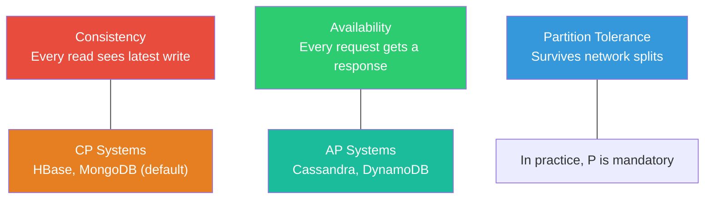

## Why Databases Matter

Every non-trivial system you build, operate, or debug depends on a database. Authentication tokens,
User profiles, financial transactions, inventory counts, sensor readings, audit logs -- all of it
Lands in a database. When the database is slow, the entire application is slow. When the database
Loses data, the business loses money. When the database schema cannot evolve, the development team
Grinds to a halt.

Understanding databases is not optional for a systems engineer. You need to know how queries are
Executed, why indexes matter, what transaction isolation levels actually guarantee, and when a NoSQL
Store is the right tool versus a premature optimisation that will cause pain in production.

## The CAP Theorem at a Glance

The CAP theorem (Brewer, 2000; proved by Gilbert and Lynch, 2002) states that a distributed data
Store can provide at most two of the following three guarantees simultaneously:

- **Consistency (C)** -- every read returns the most recent write or an error
- **Availability (A)** -- every request receives a non-error response (no guarantees about latency)
- **Partition tolerance (P)** -- the system continues to operate despite network partitions

In practice, network partitions are inevitable in distributed systems, so the real choice is between
**CP** (sacrifice availability during a partition) and **AP** (sacrifice consistency during a
Partition). The PACELC theorem (Abadi, 2012) extends this: when there is **no** partition, the
System must choose between **L**atency and **C**onsistency.

## Relational vs NoSQL: A Spectrum, Not a Dichotomy

The industry often frames this as "SQL vs NoSQL" but the reality is a spectrum of trade-offs:

| Dimension          | Relational                         | NoSQL                                         |
| ------------------ | ---------------------------------- | --------------------------------------------- |
| Data model         | Rows and columns, fixed schema     | Documents, key-value, graphs, column families |
| Query language     | SQL (declarative, standardised)    | Varies per database, often API-based          |
| Consistency        | Strong by default (ACID)           | Often eventual, tunable                       |
| Scaling            | Vertical first, then read replicas | Horizontal by design                          |
| Schema flexibility | Rigid, migrations required         | Flexible, schemaless or schema-on-read        |
| Joins              | First-class, optimised             | Limited or unsupported                        |

**Choose relational when:** your data has strong relationships, you need complex queries and joins,
ACID transactions are non-negotiable, or your team knows SQL well.

**Choose NoSQL when:** your access patterns are simple and known, you need horizontal scale beyond
What replicas provide, your data is unstructured or semi-structured, or you need extremely high
Write throughput.

## What This Subject Covers

| Topic                   | Focus                                                         |
| ----------------------- | ------------------------------------------------------------- |
| Relational Theory       | Codd"s model, normalisation, functional dependencies, keys    |
| SQL Fundamentals        | DDL, DML, joins, subqueries, window functions, CTEs           |
| Indexing & Optimisation | B-trees, covering indexes, query plans, EXPLAIN               |
| Transactions            | ACID, isolation levels, locking, MVCC, deadlocks              |
| NoSQL                   | Document stores, key-value, column families, graph, CAP       |
| Database Design         | ER modelling, partitioning, sharding, replication, migrations |

## Core Principles

1. **Data integrity is non-negotiable** -- a fast system that returns wrong answers is worse than a
   slow system that returns correct ones
2. **Index design follows access patterns** -- do not index everything, index what you query
3. **Transactions are your safety net** -- understand their costs and guarantees before disabling or
   working around them
4. **Schema evolution is a feature, not a bug** -- design for change from the start
5. **Measure before optimising** -- `EXPLAIN ANALYZE` before adding indexes, and benchmark after

## Summary

The key principles covered in this topic are linked in the sub-pages above. Focus on understanding
the definitions, applying the formulas or frameworks, and evaluating strengths and limitations of
each approach.

## Worked Examples

Worked examples demonstrating the application of key concepts are covered in the detailed sub-pages
linked above.

## Common Pitfalls

- Confusing terminology or concepts that appear similar but have distinct meanings.
- Overlooking key assumptions or boundary conditions that limit applicability.

## Overview

This introduction provides comprehensive coverage of Databases content for the Infrastructure qualification, with detailed explanations, worked examples, and practice questions aligned to the specification.

## Content Structure

This page includes:

- **Key Definitions**: Precise explanations of essential concepts
- **Core Concepts**: Detailed treatment of fundamental principles
- **Worked Examples**: Step-by-step solutions demonstrating application
- **Practice Questions**: Examination-style questions with mark schemes
- **Common Pitfalls**: Frequent errors and how to avoid them
- **Exam Tips**: Strategies for maximising marks

## How to Use This Content

1. Read through the introductory material to establish context
2. Study the definitions and core concepts carefully
3. Work through the worked examples, following each step
4. Attempt the practice questions independently
5. Review your answers against the provided solutions
6. Note any areas requiring further revision

## Key Concepts

- Foundational definitions and terminology
- Application of principles to examination contexts
- Connections to related topics within the specification
- Assessment objective alignment

## Revision Strategies

- **Active Recall**: Test yourself on the material rather than passively re-reading
- **Spaced Repetition**: Review this content at increasing intervals
- **Interleaving**: Mix this topic with others during study sessions
- **Elaborative Interrogation**: Ask yourself why each concept works

## Exam Preparation

Practise applying these concepts under timed conditions. Focus on understanding what each question is asking and how marks are allocated. Review examiner reports to learn from common mistakes made by other students.

## Further Resources

- Flashcards for rapid revision of key terms
- Diagnostic tests to identify remaining gaps
- Practice problems with detailed worked solutions
- Cross-references to related topics