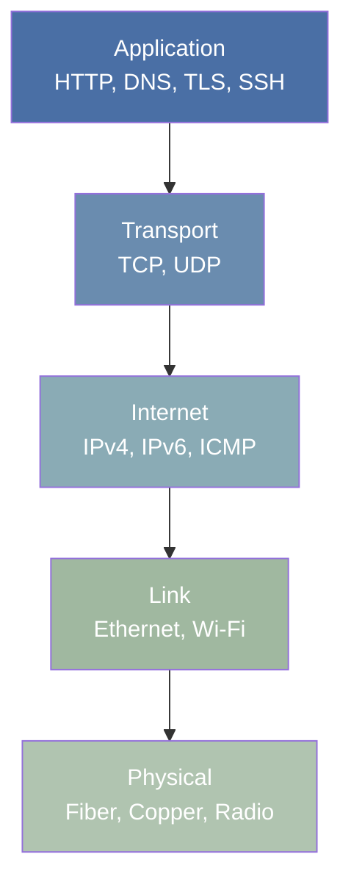

## Why Networking Matters

Every system you operate, deploy, or debug depends on networking. A container cannot reach its
Database, a service returns 502 errors, DNS resolution stalls for 5 seconds, or TLS handshakes fail
With certificate errors -- these are all networking problems that land on the systems engineer"s
Desk.

Understanding networking is not optional. It is the substrate on which every distributed system
Runs. When a microservice architecture adds latency proportional to the number of cross-service
Calls, that is a networking problem. When a load balancer drops connections under load, that is a
Networking problem. When a firewall rule blocks health checks but allows production traffic, that is
A networking problem.

This subject covers the protocol stack from layer 2 through layer 7, with emphasis on the protocols
You will encounter daily: IP, TCP, UDP, DNS, HTTP, and TLS. Each section includes practical
Troubleshooting guidance because theoretical knowledge without diagnostic skill is useless in
Production.

## The Protocol Stack

Network communication is organized into layers. Each layer provides services to the layer above it
And relies on the layer below it. The two primary reference models are:

- **OSI 7-layer model** -- a theoretical framework for understanding network functions
- **TCP/IP 4-layer model** (DoD model) -- the practical model that the Internet actually uses

## The Internet as a Network of Networks

The Internet is not a single network. It is a collection of approximately 70,000+ autonomous systems
(ASes) interconnected through peering agreements and transit relationships. Each AS is administered
Independently, yet they all agree to exchange traffic using the Border Gateway Protocol (BGP).

Traffic between two hosts traverses:

1. **Access network** -- your local network (home, office, data center)
2. **Edge network** -- the ISP or cloud provider's network
3. **Transit network** -- backbone networks that carry traffic between ASes
4. **Destination network** -- the target's access and edge networks

Understanding this hierarchy matters because latency, packet loss, and routing policies differ at
Each stage. A problem that looks like "the application is slow" may actually be a BGP route flap at
A transit provider, or it may be a misconfigured MTU on a VPN tunnel.

## What This Subject Covers

| Topic                 | Focus                                                     |
| --------------------- | --------------------------------------------------------- |
| OSI and TCP/IP Models | Reference models, encapsulation, layer violations         |
| IP Addressing         | IPv4, IPv6, subnetting, CIDR, NAT, DHCP, ARP              |
| TCP and UDP           | Connection management, congestion control, flow control   |
| DNS                   | Hierarchy, resolution, caching, DNSSEC, DoH/DoT           |
| HTTP                  | HTTP/1.1, HTTP/2, HTTP/3, caching, REST                   |
| TLS                   | Handshake, cipher suites, certificates, PKI               |
| Network Tools         | tcpdump, Wireshark, curl, dig, ss, diagnostic methodology |

## Core Principles

Every protocol covered in this subject shares a few fundamental properties:

1. **Encapsulation** -- higher-layer data is wrapped in lower-layer headers for delivery
2. **Multiplexing** -- port numbers, connection identifiers, and session tags allow multiple
   concurrent flows on a single link
3. **Best-effort delivery** -- IP provides no guarantees; reliability is an end-to-end concern
   implemented by TCP
4. **End-to-end principle** -- complexity belongs at the endpoints, not in the network (RFC 8890)

These principles explain why certain design decisions were made and why real-world networks behave
The way they do.

## Summary

The key principles covered in this topic are linked in the sub-pages above. Focus on understanding
the definitions, applying the formulas or frameworks, and evaluating strengths and limitations of
each approach.

## Worked Examples

Worked examples demonstrating the application of key concepts are covered in the detailed sub-pages
linked above.

## Common Pitfalls

- Confusing terminology or concepts that appear similar but have distinct meanings.
- Overlooking key assumptions or boundary conditions that limit applicability.

## Overview

This introduction provides comprehensive coverage of Networking content for the Infrastructure qualification, with detailed explanations, worked examples, and practice questions aligned to the specification.

## Content Structure

This page includes:

- **Key Definitions**: Precise explanations of essential concepts
- **Core Concepts**: Detailed treatment of fundamental principles
- **Worked Examples**: Step-by-step solutions demonstrating application
- **Practice Questions**: Examination-style questions with mark schemes
- **Common Pitfalls**: Frequent errors and how to avoid them
- **Exam Tips**: Strategies for maximising marks

## How to Use This Content

1. Read through the introductory material to establish context
2. Study the definitions and core concepts carefully
3. Work through the worked examples, following each step
4. Attempt the practice questions independently
5. Review your answers against the provided solutions
6. Note any areas requiring further revision

## Key Concepts

- Foundational definitions and terminology
- Application of principles to examination contexts
- Connections to related topics within the specification
- Assessment objective alignment

## Revision Strategies

- **Active Recall**: Test yourself on the material rather than passively re-reading
- **Spaced Repetition**: Review this content at increasing intervals
- **Interleaving**: Mix this topic with others during study sessions
- **Elaborative Interrogation**: Ask yourself why each concept works

## Exam Preparation

Practise applying these concepts under timed conditions. Focus on understanding what each question is asking and how marks are allocated. Review examiner reports to learn from common mistakes made by other students.

## Further Resources

- Flashcards for rapid revision of key terms
- Diagnostic tests to identify remaining gaps
- Practice problems with detailed worked solutions
- Cross-references to related topics