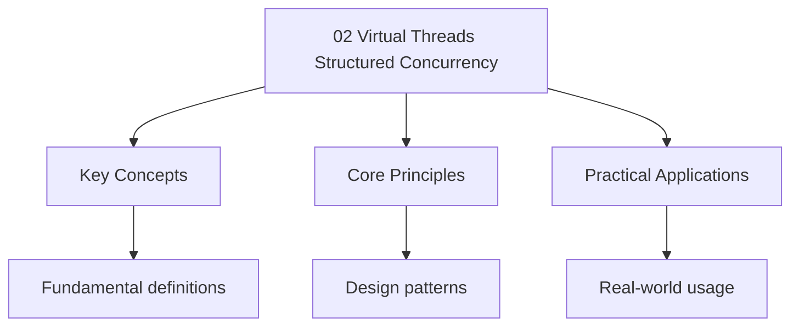

---

date: 2026-07-23T21:57:32+01:00
title: Virtual Threads and Structured Concurrency
description: "Comprehensive study notes for Virtual Threads and Structured Concurrency with worked examples, practice problems, and key concepts for exam preparation."
categories: ["java"]
---

<!-- Breadcrumb Schema for SEO -->
<script type="application/ld+json">
{
  "@context": "https://schema.org",
  "@type": "BreadcrumbList",
  "itemListElement": [{"name": "Home", "url": "https://wyattau.com"}, {"name": "java", "url": "https://java.wyattau.com"}, {"name": "08 Modern Java", "url": "https://java.wyattau.com/08-modern-java"}, {"name": "02 Virtual Threads Structured Concurrency", "url": "https://java.wyattau.com/08-modern-java/02-virtual-threads-structured-concurrency"}]
}
</script>

## Project Loom and Virtual Threads (JEP 444, Java 21)

### The Problem with Platform Threads

A platform thread in Java maps 1:1 to an operating system thread. OS threads are expensive
Resources: each consumes a stack (default 1 MB on 64-bit JVMs), kernel metadata, and scheduling
Overhead. A machine with 8 GB of RAM can run roughly 8,000 threads before exhausting memory on stack
Space alone. In practice, the scheduler overhead degrades performance long before that.

Most server workloads are I/O-bound. A thread handling an HTTP request spends the vast majority of
Its time waiting for database queries, network calls, or file I/O. During that wait, the thread's
Stack sits in memory doing nothing. The traditional solution -- thread pools bounded to some
Reasonable size (200-500 threads) -- works but introduces complexity: every blocking operation must
Be non-blocking or async, and async code is hard to write, hard to read, and hard to debug.

Virtual threads solve this by decoupling the Java-level thread from the OS thread.

### What Is a Virtual Thread

A virtual thread is a lightweight thread managed by the JVM rather than the operating system. It has
Its own stack, its own thread-local variables, and its own interrupt state -- but the stack is
Allocated on the heap as a linked list of stack frames (called "continuations"), not as a contiguous
Block of memory. When a virtual thread blocks on I/O, the JVM unmounts it from its carrier (the OS
Thread) and mounts a different virtual thread. When the I/O completes, the JVM remounts the original
Virtual thread, potentially on a different carrier.

This means you can have millions of virtual threads running on a small number of carrier threads (
matching the number of CPU cores). The memory footprint of a virtual thread that is Blocked on I/O
is a few hundred bytes, not 1 MB.

### Creating Virtual Threads

```java
// Create and start a single virtual thread
Thread vt = Thread.ofVirtual().name("worker-1").start(() -> {
    System.out.println("Running on virtual thread: " + Thread.currentThread());
});

vt.join();

// Create a virtual thread without starting it
Thread unstarted = Thread.ofVirtual().name("worker-2").unstarted(() -> {
    System.out.println("Deferred start");
});
unstarted.start();

// Using a virtual thread executor (the recommended pattern)
try (var executor = Executors.newVirtualThreadPerTaskExecutor()) {
    IntStream.range(0, 10_000).forEach(i -> {
        executor.submit(() -> {
            Thread.sleep(Duration.ofSeconds(1));
            return i;
        });
    });
}
```

`Executors.newVirtualThreadPerTaskExecutor()` creates a new virtual thread for every submitted task.
There is no pooling -- virtual threads are cheap enough that pooling is unnecessary and
Counterproductive. The executor implements `AutoCloseable`; closing it waits for all submitted tasks
To complete.

### How Virtual Threads Work Internally

The JVM maintains a pool of carrier threads ( ForkJoinPool worker threads, by default equal to the
Number of available processors). When a virtual thread performs a blocking operation:

1. **Mounting**: The virtual thread is mounted onto a carrier thread. Its stack frames are copied
   onto the carrier's stack.
2. **Blocking**: When the virtual thread calls a blocking operation (`Thread.sleep`Socket read, file
   I/O), the JVM does not park the carrier thread. Instead, it saves the virtual thread's state as a
   heap-allocated continuation and unmounts the virtual thread.
3. **Unmounting**: The carrier thread is now free to execute another virtual thread.
4. **Remounting**: When the blocking operation completes (I/O is ready, sleep expires), the JVM
   schedules the virtual thread to be mounted on any available carrier thread. It may not be the
   same carrier that originally ran it.

This mounting/unmounting is transparent to the application code. From the virtual thread's
Perspective, it called a blocking method and the method returned. The thread identity
(`Thread.currentThread()`) remains consistent.

### When Virtual Threads Help

Virtual threads excel in I/O-bound workloads where the ratio of wait time to compute time is high.
Examples:

- HTTP servers handling thousands of concurrent connections
- Database connection pools with many slow queries
- Microservice architectures with inter-service calls
- Batch processing that makes many external API calls

### When Virtual Threads Do NOT Help

Virtual threads provide no benefit for CPU-bound work. If your code is computing SHA-256 hashes,
Doing matrix multiplication, or sorting large arrays, the bottleneck is CPU, not thread count.
Virtual threads cannot make a CPU do more work than it physically can. In fact, creating millions of
Virtual threads that all compete for CPU time will degrade performance due to scheduling overhead.

```java
// This gains nothing from virtual threads -- the bottleneck is CPU
try (var executor = Executors.newVirtualThreadPerTaskExecutor()) {
    IntStream.range(0, 100_000).forEach(i -> {
        executor.submit(() -> {
            return IntStream.range(0, 100_000)
                .map(j -> j * j)
                .sum();  // Pure computation, no I/O
        });
    });
}
```

### Pinning: The One Problem to Watch

A virtual thread can get "pinned" to its carrier thread when it performs a blocking operation inside
A `synchronized` block or method. The JVM cannot unmount a virtual thread while it holds a monitor
Lock because the lock state is tied to the carrier thread. If many virtual threads are pinned
Simultaneously, you effectively revert to platform thread behavior.

```java
// Pinning: virtual thread holds monitor lock during blocking I/O
public class PinnedExample {
    private final Object lock = new Object();

    public void fetchData() {
        synchronized (lock) {  // This causes pinning
            httpClient.send(request);  // Blocking I/O inside synchronized
        }
    }
}
```

**Solution**: Replace `synchronized` with `ReentrantLock`:

```java
public class UnpinnedExample {
    private final ReentrantLock lock = new ReentrantLock();

    public void fetchData() throws Exception {
        lock.lock();
        try {
            httpClient.send(request);
        } finally {
            lock.unlock();
        }
    }
}
```

`ReentrantLock` is j.u.c. Aware -- the JVM can unmount a virtual thread that blocks while holding a
`ReentrantLock`. Starting in JDK 24, `synchronized` pinning is being eliminated, but for JDK 21-23,
You should use `ReentrantLock` in hot paths.

### Thread-Local Variables and Virtual Threads

`ThreadLocal` variables work with virtual threads, but using them heavily is a problem. Each virtual
Thread gets its own copy of every `ThreadLocal` variable. If you have 1 million virtual threads and
A `ThreadLocal` holding a 1 KB `SimpleDateFormat`That is 1 GB of heap just for thread locals.

Use `ScopedValue` (discussed below) instead of `ThreadLocal` when working with virtual threads.

## Structured Concurrency (JEP 453, Java 21)

### The Problem with Unstructured Concurrency

Traditional Java concurrency is unstructured: you create a thread, submit tasks to an executor, and
Collect results with `Future.get()`. There is no relationship between the parent task and the child
Tasks. If a child task fails, the parent must manually cancel the remaining children. If the parent
Is interrupted, cleanup is manual. This leads to leaked threads, resource exhaustion, and subtle
Bugs.

```java
// Unstructured: if fetchUser() fails, fetchOrders() keeps running
ExecutorService executor = Executors.newFixedThreadPool(10);
Future&lt;User&gt; userFuture = executor.submit(() -> fetchUser(id));
Future&lt;List&lt;Order&gt;&gt; ordersFuture = executor.submit(() -> fetchOrders(id));

User user = userFuture.get();       // If this throws, ordersFuture leaks
List&lt;Order&gt; orders = ordersFuture.get();
```

### `StructuredTaskScope`

`StructuredTaskScope` (JEP 453, incubating in Java 21) enforces a parent-child relationship between
Tasks. All child tasks must complete (successfully or exceptionally) before the parent can proceed.
If the scope is closed, all child tasks are cancelled. If the parent thread is interrupted, the
Scope cancels all children.

```java
import java.util.concurrent.StructuredTaskScope;

public record UserData(User user, List&lt;Order&gt; orders) { }

public UserData fetchUserData(String userId) throws Exception {
    try (var scope = new StructuredTaskScope.ShutdownOnFailure()) {
        StructuredTaskScope.Subtask&lt;User&gt; userTask =
            scope.fork(() -> fetchUser(userId));
        StructuredTaskScope.Subtask&lt;List&lt;Order&gt;&gt; ordersTask =
            scope.fork(() -> fetchOrders(userId));

        scope.join();             // Wait for all tasks
        scope.throwIfFailed();    // Propagate first failure

        return new UserData(userTask.get(), ordersTask.get());
    }
    // scope.close() cancels any remaining tasks and waits for them
}
```

### Shutdown Policies

`StructuredTaskScope` provides two built-in shutdown policies:

- **`ShutdownOnFailure`**: If any child task fails, cancel all remaining children. Useful when all
  results are needed.
- **`ShutdownOnSuccess`**: When the first child task succeeds, cancel all remaining children. Useful
  for "first to respond" patterns like querying multiple caches or endpoints.

```java
// First successful result wins
public Config fetchConfig() throws Exception {
    try (var scope = new StructuredTaskScope.ShutdownOnSuccess&lt;Config&gt;()) {
        scope.fork(() -> fetchFromCache());
        scope.fork(() -> fetchFromDatabase());
        scope.fork(() -> fetchFromRemote());

        scope.join();
        return scope.result();  // Returns first successful result
    }
}
```

### Cancellation and Deadlines

Child tasks are cooperative -- they must check for interruption. Standard blocking operations
(`Thread.sleep`I/O, `Future.get`) respond to interruption automatically. For long-running
Computations, periodically check `Thread.interrupted()`:

```java
public List&lt;String&gt; expensiveComputation() throws InterruptedException {
    List&lt;String&gt; results = new ArrayList&lt;&gt;();
    for (int i = 0; i &lt; 1_000_000; i++) {
        if (Thread.interrupted()) {
            throw new InterruptedException("Computation cancelled");
        }
        results.add(processItem(i));
    }
    return results;
}
```

Deadlines can be set on the scope to enforce time bounds:

```java
public UserData fetchUserDataWithDeadline(String userId) throws Exception {
    try (var scope = new StructuredTaskScope.ShutdownOnFailure()) {
        scope.joinUntil(Instant.now().plusMillis(500));

        StructuredTaskScope.Subtask&lt;User&gt; userTask =
            scope.fork(() -> fetchUser(userId));
        StructuredTaskScope.Subtask&lt;List&lt;Order&gt;&gt; ordersTask =
            scope.fork(() -> fetchOrders(userId));

        scope.joinUntil(Instant.now().plusMillis(500));
        scope.throwIfFailed();

        return new UserData(userTask.get(), ordersTask.get());
    }
}
```

### Virtual Threads + Structured Concurrency

The combination of virtual threads and structured concurrency is the intended programming model for
Modern Java server applications. Virtual threads eliminate the resource cost of concurrent blocking
Operations, and structured concurrency provides lifecycle management:

```java
public class OrderService {
    private final HttpClient httpClient = HttpClient.newHttpClient();

    public OrderSummary processOrder(OrderRequest request) throws Exception {
        try (var executor = Executors.newVirtualThreadPerTaskExecutor();
             var scope = new StructuredTaskScope.ShutdownOnFailure()) {

            StructuredTaskScope.Subtask&lt;InventoryCheck&gt; inventory =
                scope.fork(() -> checkInventory(request));
            StructuredTaskScope.Subtask&lt;PaymentResult&gt; payment =
                scope.fork(() -> processPayment(request));
            StructuredTaskScope.Subtask&lt;ShippingQuote&gt; shipping =
                scope.fork(() -> getShippingQuote(request));

            scope.join();
            scope.throwIfFailed();

            return new OrderSummary(
                inventory.get(),
                payment.get(),
                shipping.get()
            );
        }
    }
}
```

## Scoped Values (JEP 446, Java 21 Preview / JEP 482, Java 24)

### The Problem with `ThreadLocal`

`ThreadLocal` provides per-thread state, but it has several problems in a virtual thread world:

1. **Memory consumption**: Each virtual thread gets its own copy. With millions of virtual threads,
   this is unsustainable.
2. **Inheritance**: `ThreadLocal` values are inherited by child threads, which is often undesirable.
3. **Mutation**: `ThreadLocal` values are mutable, making it easy to introduce subtle bugs.
4. **Lifetime**: `ThreadLocal` values live as long as the thread. Virtual threads in a per-task
   executor are short-lived, so cleanup is frequent but not automatic.

### `ScopedValue` Basics

`ScopedValue` (JEP 446) provides immutable, dynamically-scoped values that are bound for a bounded
Duration and automatically released when the scope exits:

```java
import java.lang.ScopedValue;

private static final ScopedValue&lt;User&gt; CURRENT_USER = ScopedValue.newInstance();

public void handleRequest(Request request) throws Exception {
    User user = authenticate(request);
    ScopedValue.where(CURRENT_USER, user).run(() -> {
        processRequest(request);
        logAccess();
    });
    // CURRENT_USER is no longer bound here
}

private void processRequest(Request request) {
    User user = CURRENT_USER.get();  // No null checks, no casting
    // user is guaranteed to be non-null within the scope
}
```

### Scoped Values vs ThreadLocal

| Feature          | `ThreadLocal`                  | `ScopedValue`                       |
| ---------------- | ------------------------------ | ----------------------------------- |
| Mutability       | Mutable                        | Immutable (bound once per scope)    |
| Lifetime         | Thread lifetime                | Scope lifetime                      |
| Memory footprint | Per-thread copy                | Shared reference                    |
| Inheritance      | Inherited by child threads     | Inherited by child threads          |
| Rebinding        | Can rebind per call            | Cannot rebind within active scope   |
| Virtual thread   | Expensive (millions of copies) | Efficient (single shared reference) |

### Binding and Rebinding

Scoped values support rebinding in nested scopes:

```java
ScopedValue.where(CURRENT_USER, adminUser).run(() -> {
    processAsAdmin();  // CURRENT_USER.get() returns adminUser

    ScopedValue.where(CURRENT_USER, regularUser).run(() -> {
        processAsRegular();  // CURRENT_USER.get() returns regularUser
    });

    processAsAdmin();  // CURRENT_USER.get() returns adminUser again
});
```

Each `where` call creates a new binding that shadows the outer binding. When the inner scope exits,
The outer binding is restored. This is stack-based scoping, not heap-based per-thread storage.

### Scoped Values with Virtual Threads

The key advantage: a `ScopedValue` is stored once per carrier thread, not once per virtual thread.
When a virtual thread is unmounted and remounted on a different carrier, the scoped value is still
Accessible because it is stored in the virtual thread's scope, not in the carrier's `ThreadLocal`:

```java
try (var executor = Executors.newVirtualThreadPerTaskExecutor()) {
    ScopedValue.where(CURRENT_USER, user).run(() -> {
        // All virtual threads forked inside this scope see CURRENT_USER
        IntStream.range(0, 1000).forEach(i -> {
            executor.submit(() -> {
                // This virtual thread can be mounted on any carrier
                // but CURRENT_USER.get() still returns the correct user
                doWork(i);
            });
        });
    });
}
```

## Comparison with Other Languages

### Virtual Threads vs Go Goroutines

| Feature             | Java Virtual Threads         | Go Goroutines                  |
| ------------------- | ---------------------------- | ------------------------------ |
| Stack model         | Heap-allocated continuations | Heap-allocated growable stacks |
| Scheduling          | FIFO (JDK 21+)               | Work-stealing                  |
| Pinning risk        | Yes (`synchronized` blocks)  | No (no equivalent construct)   |
| M:N scheduling      | Yes                          | Yes                            |
| Typical concurrency | Millions                     | Hundreds of thousands          |
| Blocking I/O        | Transparent unmount          | Transparent unmount            |

Go goroutines are more mature (available since Go 1.0 in 2012) and have no pinning issue because Go
Does not have monitor-based locking. Java virtual threads are catching up, and the pinning issue is
Being addressed in JDK 24+.

### Virtual Threads vs C# async/await

C# uses `async/await` with state machines generated by the compiler. Java virtual threads are
Simpler: you write synchronous code and the JVM handles the asynchrony. There is no `async` keyword,
No `Task` type, no state machine, no `ConfigureAwait`.

```csharp
// C#: async/await with explicit Task types
public async Task&lt;User&gt; GetUserAsync(string id) {
    var response = await httpClient.GetAsync($"/users/{id}");
    var content = await response.Content.ReadAsStringAsync();
    return JsonSerializer.Deserialize&lt;User&gt;(content);
}
```

```java
// Java: synchronous code with virtual threads
public User getUser(String id) {
    var response = httpClient.send(HttpRequest.newBuilder()
        .uri(URI.create("/users/" + id)).build());
    var content = response.body();
    return JsonReader.fromJson(content);
}
```

The Java approach is simpler to understand and easier to retrofit in existing codebases. The C#
Approach is more explicit about where asynchrony occurs, which some developers prefer for
Performance reasoning.

### Virtual Threads vs Kotlin Coroutines

Kotlin coroutines are compiler-transformed suspending functions, similar to C# async/await. They use
`suspend` keyword and `Dispatchers` for thread context. Virtual threads are a runtime feature with
No language changes required.

## Common Pitfalls

### Do Not Pool Virtual Threads

Virtual threads are designed to be created per-task. Pooling them defeats the purpose -- the whole
Point is that creation is nearly free and the JVM manages the scheduling:

```java
// Wrong: pooling virtual threads
var pool = Executors.newFixedThreadPool(200, Thread.ofVirtual().factory());

// Right: one virtual thread per task
try (var executor = Executors.newVirtualThreadPerTaskExecutor()) {
    executor.submit(task);
}
```

### Synchronized Still Pins (JDK 21-23)

Any blocking operation inside a `synchronized` block pins the virtual thread to its carrier. Audit
Your codebase for `synchronized` blocks that contain I/O operations and replace with
`ReentrantLock`.

### `ThreadLocal` in Virtual Thread Per-Task Executors

In a `newVirtualThreadPerTaskExecutor`Each task runs on a new virtual thread. If you set a
`ThreadLocal` in one task, it is not visible in another. If you set it in a parent and fork child
Tasks, the children inherit it, but the memory overhead is proportional to the number of virtual
Threads. Prefer `ScopedValue`.

### Structured Concurrency Is Not Auto-Closeable on Errors

`StructuredTaskScope` implements `AutoCloseable`But closing the scope does not automatically throw
Exceptions. You must call `throwIfFailed()` explicitly after `join()`:

```java
try (var scope = new StructuredTaskScope.ShutdownOnFailure()) {
    scope.fork(() -> mayFail());
    scope.join();
    scope.throwIfFailed();  // YOU MUST CALL THIS
    // process results
}
```

### Forgetting `join()`

Forgetting to call `join()` means the scope's `close()` will wait for children, but you will not
Have access to their results:

```java
try (var scope = new StructuredTaskScope.ShutdownOnFailure()) {
    var task = scope.fork(() -> fetchUser());
    // BUG: no join() -- close() waits but you never check the result
}
```

## Performance Characteristics

### Memory

A blocked virtual thread consumes roughly 200-500 bytes of heap. A blocked platform thread consumes
1 MB of stack (configurable via `-Xss`). At 100,000 concurrent blocked requests:

- Platform threads: ~100 GB of stack memory
- Virtual threads: ~20-50 MB of heap

### Throughput

For I/O-bound workloads, virtual threads match or exceed the throughput of reactive Frameworks
(Netty, WebFlux) while using dramatically simpler code. The throughput improvement comes From
eliminating context-switch overhead: the JVM does not need to make an expensive `pthread_create` or
kernel context switch for each new concurrent operation.

### CPU-Bound Work

Virtual threads add scheduling overhead (mounting, unmounting, continuation management). For pure
CPU-bound work, platform threads on a bounded thread pool are marginally faster. The difference is
small (single-digit percentage) but measurable.

## StructuredTaskScope: Advanced Patterns

### Combining Results from Multiple Tasks

A common pattern is collecting results from parallel tasks and combining them. `StructuredTaskScope`
Makes this safe:

```java
public record EnrichedOrder(Order order, User user, List&lt;Inventory&gt; inventory) { }

public EnrichedOrder enrichOrder(String orderId) throws Exception {
    try (var scope = new StructuredTaskScope.ShutdownOnFailure()) {
        StructuredTaskScope.Subtask&lt;Order&gt; orderTask =
            scope.fork(() -> orderClient.getOrder(orderId));
        StructuredTaskScope.Subtask&lt;User&gt; userTask =
            scope.fork(() -> userClient.getUser("current"));
        StructuredTaskScope.Subtask&lt;List&lt;Inventory&gt;&gt; invTask =
            scope.fork(() -> inventoryClient.check(orderId));

        scope.join();
        scope.throwIfFailed();

        return new EnrichedOrder(orderTask.get(), userTask.get(), invTask.get());
    }
}
```

If any of the three calls fails, the remaining calls are cancelled immediately. No leaked threads,
No dangling futures.

### Handling Partial Failures

Sometimes you want to collect results from all tasks even if some fail. Use `ShutdownOnFailure` but
Check individual task states:

```java
public record PartialResults(
    Optional&lt;User&gt; user,
    Optional&lt;List&lt;Order&gt;&gt; orders,
    List&lt;Throwable&gt; errors
) { }

public PartialResults fetchWithFailures(String userId) throws Exception {
    try (var scope = new StructuredTaskScope.ShutdownOnFailure()) {
        var userTask = scope.fork(() -> fetchUser(userId));
        var ordersTask = scope.fork(() -> fetchOrders(userId));

        scope.join();
        // Do NOT call throwIfFailed() -- we want partial results

        List&lt;Throwable&gt; errors = new ArrayList&lt;&gt;();
        Optional&lt;User&gt; user = Optional.empty();
        Optional&lt;List&lt;Order&gt;&gt; orders = Optional.empty();

        if (userTask.state() == StructuredTaskScope.Subtask.State.SUCCESS) {
            user = Optional.of(userTask.get());
        } else {
            errors.add(userTask.exception());
        }

        if (ordersTask.state() == StructuredTaskScope.Subtask.State.SUCCESS) {
            orders = Optional.of(ordersTask.get());
        } else {
            errors.add(ordersTask.exception());
        }

        return new PartialResults(user, orders, errors);
    }
}
```

### Custom `StructuredTaskScope` Policies

You can extend `StructuredTaskScope` to implement custom shutdown policies:

```java
public class RaceScope&lt;T&gt; extends StructuredTaskScope&lt;T&gt; {
    private volatile T result;
    private final ReentrantLock lock = new ReentrantLock();
    private final Condition done = lock.newCondition();

    @Override
    protected void handleComplete(Subtask&lt;? extends T&gt; subtask) {
        if (subtask.state() == Subtask.State.SUCCESS) {
            lock.lock();
            try {
                if (result == null) {
                    result = subtask.get();
                    done.signalAll();
                    shutdown();
                }
            } finally {
                lock.unlock();
            }
        }
    }

    public T result() throws InterruptedException {
        lock.lock();
        try {
            while (result == null && !isShutdown()) {
                done.await();
            }
            return result;
        } finally {
            lock.unlock();
        }
    }
}
```

## Thread Dumps and Virtual Threads

### Traditional Thread Dumps

A traditional thread dump (`jstack``kill -3`Or `Thread.getAllStackTraces()`) shows platform Threads.
With virtual threads, a thread dump also shows virtual threads but in a different format:

```bash
## Dump all threads including virtual threads
jcmd &lt;pid&gt; Thread.dump_to_file -all threads.txt
```

Virtual threads appear with a `VirtualThread` prefix. Carrier threads are the ForkJoinPool worker
Threads that actually run on OS threads.

### Diagnosing Pinning

The JDK includes a mechanism to detect pinning. Enable it with:

```bash
-Djdk.tracePinnedThreads=short   # Print when pinning occurs
-Djdk.tracePinnedThreads=long    # Print with stack trace
```

When a virtual thread pins its carrier, you will see output like:

```
Thread[#42,ForkJoinPool-1-worker-1] pinned at:
    java.lang.Object.wait(Object.java)
    com.example.Handler.process(Handler.java:45)
```

This tells you exactly where to add `ReentrantLock` or restructure the synchronized block.

### Monitoring Virtual Thread Count

```bash
## Get current virtual thread count
jcmd &lt;pid&gt; VM.native_memory summary

# Or programmatically
ManagementFactory.getThreadMXBean().getThreadCount();
// With -Djdk.management.monitor=1, this includes virtual threads
```

## Scoped Values: Advanced Usage

### Binding Multiple Scoped Values

Multiple scoped values can be bound simultaneously:

```java
private static final ScopedValue&lt;User&gt; CURRENT_USER = ScopedValue.newInstance();
private static final ScopedValue&lt;RequestContext&gt; REQUEST_CTX = ScopedValue.newInstance();

public void handle(Request req) throws Exception {
    User user = authenticate(req);
    RequestContext ctx = buildContext(req);
    ScopedValue.where(CURRENT_USER, user)
               .where(REQUEST_CTX, ctx)
               .run(() -> processRequest(req));
}
```

### Scoped Values in Structured Concurrency

Scoped values propagate to child threads forked inside the binding scope. This makes them ideal for
Request-scoped context in server applications:

```java
public void handleRequest(HttpExchange exchange) throws Exception {
    RequestContext ctx = new RequestContext(exchange);
    ScopedValue.where(REQUEST_CONTEXT, ctx).run(() -> {
        try (var scope = new StructuredTaskScope.ShutdownOnFailure()) {
            scope.fork(() -> queryDatabase());
            scope.fork(() -> callExternalService());
            scope.join();
            scope.throwIfFailed();
        } catch (Exception e) {
            throw new RuntimeException(e);
        }
    });
}

private String queryDatabase() {
    // REQUEST_CONTEXT.get() returns the correct context
    // even though this runs on a different virtual thread
    return db.query(REQUEST_CONTEXT.get().getSql());
}
```

## Real-World Migration Guide

### Migrating from Thread Pools to Virtual Threads

**Step 1**: Replace `Executors.newFixedThreadPool(n)` with
`Executors.newVirtualThreadPerTaskExecutor()`:

```java
// Before
private final ExecutorService executor = Executors.newFixedThreadPool(200);

// After
private final ExecutorService executor = Executors.newVirtualThreadPerTaskExecutor();
```

**Step 2**: Audit all `synchronized` blocks that contain blocking I/O. Replace with `ReentrantLock`:

```java
// Before
synchronized (dataSource) {
    return dataSource.getConnection().prepareStatement(sql).executeQuery();
}

// After
dataSourceLock.lock();
try {
    return dataSource.getConnection().prepareStatement(sql).executeQuery();
} finally {
    dataSourceLock.unlock();
}
```

**Step 3**: Replace `ThreadLocal` with `ScopedValue` for request-scoped data (logging context, auth
Tokens, tracing IDs).

**Step 4**: Remove all `CompletableFuture` chaining that was introduced purely to avoid blocking
Threads. Synchronous code is now the correct approach:

```java
// Before: async chain to avoid blocking a platform thread
public CompletableFuture&lt;Response&gt; handle(Request req) {
    return authenticate(req)
        .thenCompose(user -> fetchOrders(user))
        .thenApply(orders -> buildResponse(orders));
}

// After: simple synchronous code on virtual thread
public Response handle(Request req) {
    User user = authenticate(req);
    List&lt;Order&gt; orders = fetchOrders(user);
    return buildResponse(orders);
}
```

### Migrating from CompletableFuture to StructuredTaskScope

`CompletableFuture` is not going away -- it remains the right tool for fire-and-forget tasks and
Event-driven composition. But for fan-out/fan-in patterns where you need all results (or want to
Cancel on failure), `StructuredTaskScope` is strictly better:

```java
// Before: CompletableFuture with manual cancellation
public UserData fetchUserData(String userId) {
    CompletableFuture&lt;User&gt; userFuture = CompletableFuture.supplyAsync(
        () -> fetchUser(userId), executor);
    CompletableFuture&lt;List&lt;Order&gt;&gt; ordersFuture = CompletableFuture.supplyAsync(
        () -> fetchOrders(userId), executor);

    userFuture.exceptionally(ex -> {
        ordersFuture.cancel(true);  // Best-effort cancellation
        return null;
    });

    return new UserData(userFuture.join(), ordersFuture.join());
}

// After: StructuredTaskScope with guaranteed cancellation
public UserData fetchUserData(String userId) throws Exception {
    try (var scope = new StructuredTaskScope.ShutdownOnFailure()) {
        var userTask = scope.fork(() -> fetchUser(userId));
        var ordersTask = scope.fork(() -> fetchOrders(userId));

        scope.join();
        scope.throwIfFailed();

        return new UserData(userTask.get(), ordersTask.get());
    }
}
```

## See Also

- [Concurrency](../06-concurrency/01-concurrency) -- traditional concurrency primitives,
  `ReentrantLock``CompletableFuture`
- [Collections Framework](../04-collections/01-collections-framework) -- thread-safe collections
  for concurrent access
- [Records, Sealed Classes, and Pattern Matching](../08-modern-java/01-records-sealed-patterns)
  -- pattern matching used in structured concurrency
- [Class Loading and Memory Model](../09-jvm-internals/01-class-loading-memory) -- how the JVM
  manages threads and memory




## Summary

This topic covers the core concepts of virtual threads and structured concurrency, including
underlying theory, practical implementation, and key applications.

**Key concepts include:**

- OOP principles (encapsulation, inheritance, polymorphism)
- collections framework
- streams and lambda expressions
- exception handling
- the JVM and garbage collection

Understanding these concepts thoroughly is essential for both examinations and practical
programming, and requires both theoretical knowledge and hands-on practice.

## Worked Examples

Worked examples demonstrating the application of key concepts are covered in the detailed sub-pages
linked above.

## Intuition

Virtual threads decouple Java-level threads from OS threads. When a virtual thread blocks on I/O, the JVM unmounts it from its carrier thread and mounts a different one, so the carrier stays busy. This means millions of virtual threads can run on a handful of carrier threads, making blocking operations cheap without reactive complexity. Structured concurrency enforces parent-child relationships between tasks -- if a child fails, the parent can cancel siblings automatically, preventing thread leaks. ScopedValue replaces ThreadLocal with immutable, scope-bound values that work efficiently with virtual threads, avoiding the memory overhead of per-thread copies.

## Cross-References

- [Concurrency](../06-concurrency/01-concurrency) -- threads, synchronized, and volatile
- [Concurrency Deep Dive](../06-concurrency/02-concurrency-deep-dive) -- locks, atomics, and ForkJoin
- [Streams API](../05-streams/01-streams-api) -- parallel streams and ForkJoinPool
